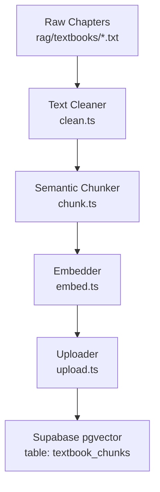
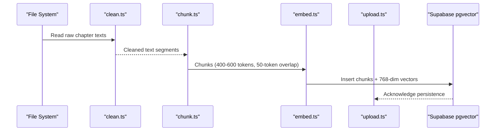
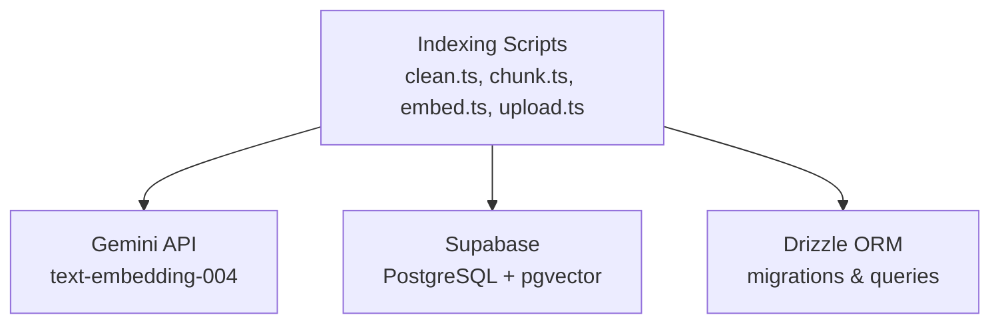

# Build-Time Indexing Pipeline

<cite>
**Referenced Files in This Document**
- [README.md](file://README.md)
- [Chapter_1_Digestive_System_of_Man_extracted.txt](file://rag/textbooks/Chapter_1_Digestive_System_of_Man_extracted.txt)
- [package.json](file://package.json)
</cite>

## Table of Contents
1. [Introduction](#introduction)
2. [Project Structure](#project-structure)
3. [Core Components](#core-components)
4. [Architecture Overview](#architecture-overview)
5. [Detailed Component Analysis](#detailed-component-analysis)
6. [Dependency Analysis](#dependency-analysis)
7. [Performance Considerations](#performance-considerations)
8. [Troubleshooting Guide](#troubleshooting-guide)
9. [Conclusion](#conclusion)

## Introduction
This document explains MedAce AI’s build-time indexing pipeline that transforms raw FSc Biology textbook content into searchable vector embeddings for Retrieval-Augmented Generation (RAG). The pipeline processes approximately 1.7 MB of text across 15 chapters, producing a pgvector-backed index used at query time to retrieve relevant textbook chunks for MCQ generation and explanations.

The pipeline consists of four stages:
- Text cleaning: strip watermarks, page markers, and fix OCR artifacts
- Semantic chunking by SLO codes with 400–600 token chunks and 50-token overlap
- Embedding generation using Gemini text-embedding-004 to produce 768-dimensional vectors
- Upload to Supabase pgvector table (textbook_chunks)

## Project Structure
At build time, the pipeline reads raw chapter files from rag/textbooks/*.txt and writes processed data through intermediate steps before persisting vectors into Supabase. The project documents the scripts and their roles, as well as the target database schema for storing chunks and embeddings.

**Diagram sources**
- [README.md:90-102](file://README.md#L90-L102)
- [README.md:167-174](file://README.md#L167-L174)

**Section sources**
- [README.md:90-102](file://README.md#L90-L102)
- [README.md:167-174](file://README.md#L167-L174)

## Core Components
- Data source: 15 FSc Biology textbook chapters (~1.7 MB text, ~420K tokens), structured with Student Learning Outcome (SLO) codes that provide natural topic boundaries.
- Text cleaner: Removes watermarks, page markers, and fixes OCR artifacts to ensure clean input for downstream processing.
- Semantic chunker: Splits cleaned text into chunks aligned with SLO codes and headings, targeting 400–600 tokens per chunk with a 50-token overlap to preserve context continuity.
- Embedder: Calls Gemini text-embedding-004 to generate 768-dimensional vectors for each chunk.
- Uploader: Inserts chunks and their embeddings into the Supabase pgvector table textbook_chunks.

Key implementation details:
- Chunk size optimization: Target 400–600 tokens per chunk balances retrieval precision and context coverage while staying within embedding model constraints.
- Overlap technique: 50-token overlap ensures semantic continuity across chunk boundaries, reducing information loss when topics span multiple chunks.
- Vector dimension specification: 768 dimensions via Gemini text-embedding-004; smaller than some alternatives, reducing storage and query costs.
- Performance considerations: Processing 1.7 MB across 15 chapters requires efficient I/O, batching where possible, and robust error handling to avoid partial runs.

**Section sources**
- [README.md:83-102](file://README.md#L83-L102)
- [README.md:280-290](file://README.md#L280-L290)

## Architecture Overview
The build-time indexing pipeline is a linear, four-stage process executed via TypeScript scripts. Each stage produces outputs consumed by the next, culminating in a pgvector index ready for retrieval at query time.

**Diagram sources**
- [README.md:90-102](file://README.md#L90-L102)
- [README.md:167-174](file://README.md#L167-L174)

## Detailed Component Analysis

### Stage 1: Text Cleaning
Purpose:
- Strip watermarks and page markers embedded in OCR-extracted text
- Fix common OCR artifacts to improve readability and chunking accuracy

Input characteristics:
- Raw chapter files contain page markers like “--- Page X ---” and watermark-like annotations
- Example patterns visible in Chapter 1 include repeated page markers and extraneous symbols

Processing logic:
- Identify and remove page marker lines
- Normalize whitespace and line breaks
- Remove or correct OCR noise around diagrams and labels

Output:
- Cleaned text suitable for semantic chunking

**Section sources**
- [README.md:90-96](file://README.md#L90-L96)
- [Chapter_1_Digestive_System_of_Man_extracted.txt:3-58](file://rag/textbooks/Chapter_1_Digestive_System_of_Man_extracted.txt#L3-L58)

### Stage 2: Semantic Chunking by SLO Codes
Purpose:
- Split cleaned text into semantically coherent chunks aligned with SLO codes and headings
- Maintain context continuity using overlap

Chunking strategy:
- Use SLO codes (e.g., [B-12-R-24], [B-12-R-25]) as natural boundaries
- Target 400–600 tokens per chunk to balance retrieval relevance and context retention
- Apply 50-token overlap between adjacent chunks to preserve continuity across boundaries

Complexity considerations:
- Tokenization cost scales with total tokens (~420K); chunking must be efficient
- Overlap increases total tokens slightly but improves retrieval quality

Output:
- Structured chunks with metadata (chapter number, SLO code, heading, token count)

**Section sources**
- [README.md:83-98](file://README.md#L83-L98)
- [Chapter_1_Digestive_System_of_Man_extracted.txt:9-31](file://rag/textbooks/Chapter_1_Digestive_System_of_Man_extracted.txt#L9-L31)

### Stage 3: Embedding Generation
Purpose:
- Convert each chunk into a dense vector representation for similarity search

Model and dimensions:
- Gemini text-embedding-004 produces 768-dimensional vectors
- Multilingual support aligns with English content and potential Urdu explanations

Implementation notes:
- Batch requests where possible to reduce API overhead
- Handle rate limits and retries robustly
- Store embeddings alongside chunk metadata for later retrieval

Output:
- Vectors stored in Supabase pgvector column for cosine similarity queries

**Section sources**
- [README.md:99-100](file://README.md#L99-L100)
- [README.md:280-286](file://README.md#L280-L286)

### Stage 4: Upload to Supabase pgvector
Purpose:
- Persist chunks and their embeddings into the textbook_chunks table for RAG retrieval

Database schema highlights:
- Fields include id, chapter_num, slo_code, heading, chunk_text, embedding (vector), token_count
- Vector type supports cosine similarity operations

Insertion strategy:
- Upsert or batch insert to handle re-runs efficiently
- Validate chunk_text length and token_count consistency
- Ensure embedding dimension matches model output (768)

Output:
- Indexed textbook_chunks available for query-time retrieval

**Section sources**
- [README.md:101-102](file://README.md#L101-L102)
- [README.md:141-150](file://README.md#L141-L150)

## Dependency Analysis
The indexing pipeline depends on external services and libraries:
- Google Gemini API for embeddings (text-embedding-004)
- Supabase for PostgreSQL with pgvector extension
- Drizzle ORM for type-safe migrations and queries
- TypeScript execution via tsx for running scripts

**Diagram sources**
- [README.md:167-174](file://README.md#L167-L174)
- [README.md:228-244](file://README.md#L228-L244)

**Section sources**
- [README.md:167-174](file://README.md#L167-L174)
- [README.md:228-244](file://README.md#L228-L244)
- [package.json:11-26](file://package.json#L11-L26)

## Performance Considerations
- Input scale: ~1.7 MB text, ~420K tokens across 15 chapters
- Chunking efficiency: Use SLO-aligned boundaries to minimize fragmentation and maximize semantic coherence
- Overhead management: Batch embedding calls and database inserts to reduce latency and API costs
- Storage optimization: 768-dimensional vectors are compact relative to higher dimensions, lowering storage and query costs
- Error resilience: Implement retries and checkpoints to resume after failures without reprocessing entire datasets

[No sources needed since this section provides general guidance]

## Troubleshooting Guide
Common issues and mitigations:
- OCR artifacts not fully removed: Verify cleaning regexes and normalize whitespace consistently
- Incorrect chunk boundaries: Ensure SLO code detection accounts for variations in formatting
- Embedding dimension mismatch: Confirm model version and validate vector length before insertion
- Database write failures: Use upsert logic and transactional batches to maintain data integrity
- Rate limiting from Gemini API: Implement exponential backoff and request throttling

**Section sources**
- [README.md:90-102](file://README.md#L90-L102)
- [README.md:141-150](file://README.md#L141-L150)

## Conclusion
MedAce AI’s build-time indexing pipeline transforms raw FSc Biology textbook content into a high-quality, searchable vector index. By leveraging SLO-aligned semantic chunking, controlled overlap, Gemini embeddings, and Supabase pgvector, the system enables precise retrieval for MCQ generation and explanations. The design balances performance, storage efficiency, and retrieval accuracy, providing a robust foundation for adaptive learning experiences.

[No sources needed since this section summarizes without analyzing specific files]