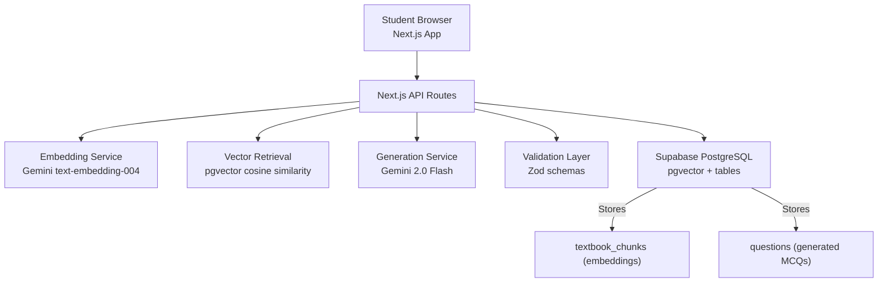
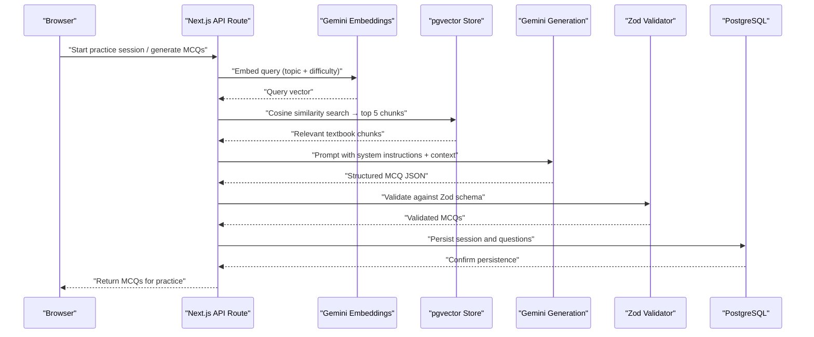
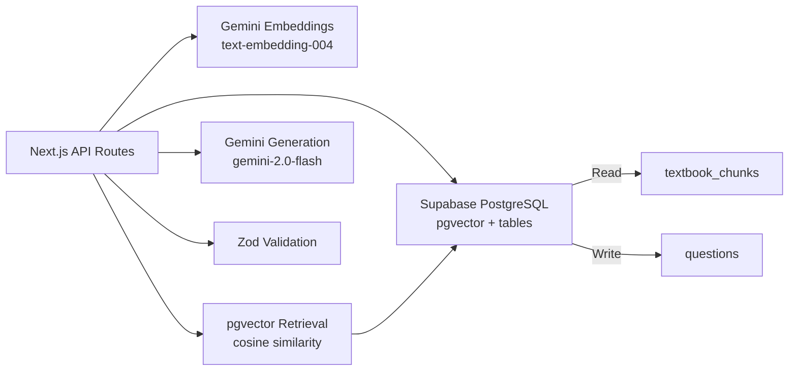

# Query-Time Processing Pipeline

<cite>
**Referenced Files in This Document**
- [README.md](file://README.md)
- [quiz.ts](file://src/types/quiz.ts)
</cite>

## Table of Contents
1. [Introduction](#introduction)
2. [Project Structure](#project-structure)
3. [Core Components](#core-components)
4. [Architecture Overview](#architecture-overview)
5. [Detailed Component Analysis](#detailed-component-analysis)
6. [Dependency Analysis](#dependency-analysis)
7. [Performance Considerations](#performance-considerations)
8. [Troubleshooting Guide](#troubleshooting-guide)
9. [Conclusion](#conclusion)

## Introduction
This document explains MedAce AI’s query-time processing pipeline that generates multiple-choice questions (MCQs) from a user’s practice session. The flow is retrieval-augmented generation (RAG): the system embeds the user’s query, retrieves relevant textbook chunks via pgvector cosine similarity, constructs a prompt with system instructions and retrieved context, asks Gemini 2.0 Flash to produce structured MCQ JSON, validates the output with Zod, and persists results for delivery to the student.

The pipeline ensures grounded, syllabus-aligned MCQs by anchoring generation on FSc Biology textbook content stored as vectors in Supabase PostgreSQL with pgvector.

## Project Structure
At a high level, the Next.js application exposes API routes that orchestrate the RAG pipeline. The build-time indexing pipeline populates the vector store; the query-time pipeline consumes it at runtime.

**Diagram sources**
- [README.md:23-55](file://README.md#L23-L55)
- [README.md:104-122](file://README.md#L104-L122)
- [README.md:124-161](file://README.md#L124-L161)

**Section sources**
- [README.md:23-77](file://README.md#L23-L77)
- [README.md:163-226](file://README.md#L163-L226)

## Core Components
- Query embedding: Convert the user’s topic/difficulty into a vector using Gemini text-embedding-004.
- Vector retrieval: Use pgvector cosine similarity to fetch the top 5 most relevant textbook chunks.
- Prompt construction: Combine system instructions, retrieved chunk context, and generation instructions into a single prompt.
- Structured generation: Ask Gemini 2.0 Flash to return MCQs in a strict JSON format.
- Validation: Enforce response structure and field constraints with Zod before persisting or serving.
- Integration: Next.js API routes coordinate these steps and interact with Supabase for storage and retrieval.

Key data contracts used across components are defined in TypeScript types for questions, sessions, and answers.

**Section sources**
- [README.md:104-122](file://README.md#L104-L122)
- [README.md:124-161](file://README.md#L124-L161)
- [quiz.ts:15-50](file://src/types/quiz.ts#L15-L50)

## Architecture Overview
The end-to-end request flow from UI to persisted MCQs:

**Diagram sources**
- [README.md:104-122](file://README.md#L104-L122)
- [README.md:124-161](file://README.md#L124-L161)

## Detailed Component Analysis

### Query Embedding
- Model: Gemini text-embedding-004
- Output dimensionality: 768-dimensional vectors
- Input: User’s selected topic and difficulty context
- Purpose: Produce a dense representation suitable for cosine similarity search in pgvector

Technical notes
- Embeddings are used only at query time to match the user’s intent with pre-indexed textbook chunks.
- The same model is used during build-time indexing to ensure consistent vector space alignment.

**Section sources**
- [README.md:73](file://README.md#L73)
- [README.md:99](file://README.md#L99)
- [README.md:109](file://README.md#L109)

### Vector Retrieval (pgvector Cosine Similarity)
- Storage: Supabase PostgreSQL with pgvector extension
- Index table: textbook_chunks containing chunk_text and embedding columns
- Search: Cosine similarity between query vector and stored embeddings
- Top-k: Retrieve the 5 most relevant chunks per query

Technical notes
- Cosine similarity is appropriate for normalized embeddings and provides robust semantic matching.
- The top-5 limit balances relevance with token budget for subsequent prompt construction.

**Section sources**
- [README.md:69](file://README.md#L69)
- [README.md:111](file://README.md#L111)
- [README.md:147-149](file://README.md#L147-L149)

### Prompt Construction
- System instruction: Define role as an MDCAT biology MCQ generator with exam-style rigor.
- Context injection: Include the retrieved textbook chunks to ground the generation.
- Instruction: Specify number of MCQs, four options each, and required fields.
- Output contract: Strict JSON schema describing question, options, answer, and bilingual explanations.

Technical notes
- Keep prompts concise to reduce latency while preserving clarity.
- Emphasize syllabus alignment and MDCAT style to improve quality.

**Section sources**
- [README.md:113-118](file://README.md#L113-L118)

### Structured MCQ Generation (Gemini 2.0 Flash)
- Model: Gemini 2.0 Flash
- Task: Generate MCQs in a strict JSON format based on system instructions and retrieved context
- Output fields: Question text, four options, correct answer, English explanation, Urdu explanation, difficulty, topic

Technical notes
- Flash offers speed and cost efficiency while maintaining strong multilingual capabilities.
- Structured outputs enable deterministic validation and reliable downstream processing.

**Section sources**
- [README.md:51-53](file://README.md#L51-L53)
- [README.md:119](file://README.md#L119)
- [README.md:124-161](file://README.md#L124-L161)

### Zod Schema Validation
- Purpose: Enforce response shape and field constraints before storing or serving MCQs
- Scope: Validates generated JSON against a schema aligned with the Question type and database expectations
- Outcome: Reject malformed responses early, improving reliability and reducing error propagation

Technical notes
- Centralize schema definitions to maintain consistency between API, storage, and UI.
- Use validation errors to surface actionable feedback during development and monitoring.

**Section sources**
- [README.md:74](file://README.md#L74)
- [README.md:121](file://README.md#L121)
- [quiz.ts:15-28](file://src/types/quiz.ts#L15-L28)

### Data Models and Contracts
- Question: Encapsulates question text, four options, correct answer, explanations, difficulty, and topic
- QuizSession: Represents a practice session including metadata, score, status, and associated questions/answers
- UserAnswer: Captures per-question selections, correctness, and timing

These models guide both database schema design and Zod validation rules.

**Section sources**
- [quiz.ts:15-50](file://src/types/quiz.ts#L15-L50)

## Dependency Analysis
The pipeline composes several services and stores:

**Diagram sources**
- [README.md:23-55](file://README.md#L23-L55)
- [README.md:104-122](file://README.md#L104-L122)
- [README.md:124-161](file://README.md#L124-L161)

**Section sources**
- [README.md:23-77](file://README.md#L23-L77)
- [README.md:104-122](file://README.md#L104-L122)
- [README.md:124-161](file://README.md#L124-L161)

## Performance Considerations
- Embedding dimensionality: 768 dimensions provide a compact yet expressive representation, reducing storage and compute costs.
- Retrieval fan-out: Limiting to top 5 chunks controls prompt size and reduces latency.
- Model selection: Gemini 2.0 Flash optimizes for speed and cost while delivering strong multilingual output.
- Database proximity: Using pgvector within Supabase avoids external service hops and simplifies operations.
- Caching: Consider caching repeated queries or popular topics to reduce redundant LLM calls.
- Prompt length: Keep context concise to minimize token usage and response times.

[No sources needed since this section provides general guidance]

## Troubleshooting Guide
Common issues and strategies:
- No relevant chunks found:
  - Verify indexing completeness and that embeddings exist for all chapters.
  - Check query phrasing and consider broadening topic keywords.
- Low-quality MCQs:
  - Review prompt instructions and ensure retrieved context is relevant.
  - Tighten Zod validation to enforce stricter formatting and content rules.
- Validation failures:
  - Inspect Zod error messages to identify missing or malformed fields.
  - Align generated schema with the Question type and database constraints.
- Latency spikes:
  - Reduce context size by limiting retrieved chunks.
  - Monitor Gemini API quotas and rate limits.

**Section sources**
- [README.md:104-122](file://README.md#L104-L122)
- [README.md:124-161](file://README.md#L124-L161)
- [quiz.ts:15-50](file://src/types/quiz.ts#L15-L50)

## Conclusion
MedAce AI’s query-time pipeline integrates retrieval-augmented generation to produce syllabus-aligned MCQs efficiently and reliably. By embedding user queries, retrieving relevant textbook chunks via pgvector, constructing focused prompts, generating structured outputs with Gemini 2.0 Flash, and validating with Zod, the system delivers high-quality practice content with predictable performance. The Next.js API routes serve as the orchestrator, coordinating embeddings, retrieval, generation, validation, and persistence within the Supabase ecosystem.

[No sources needed since this section summarizes without analyzing specific files]