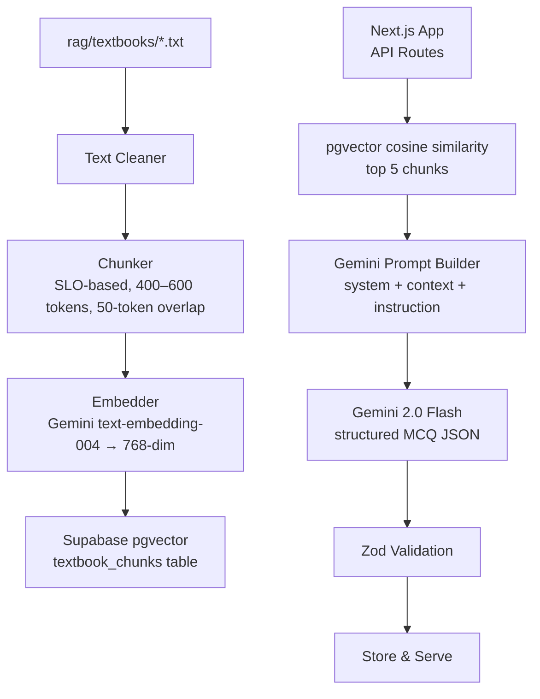
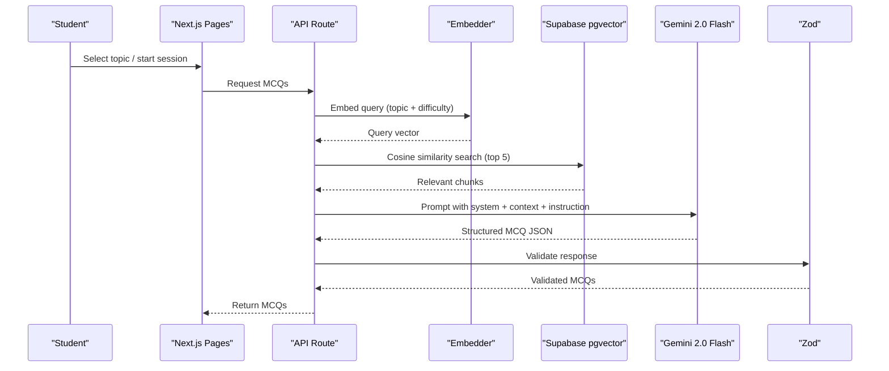
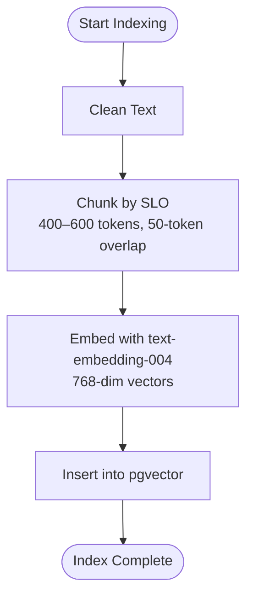
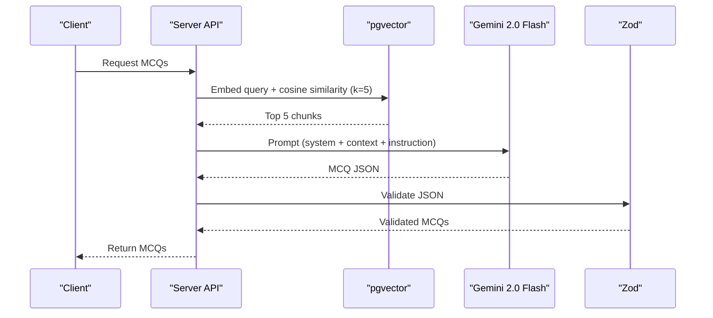
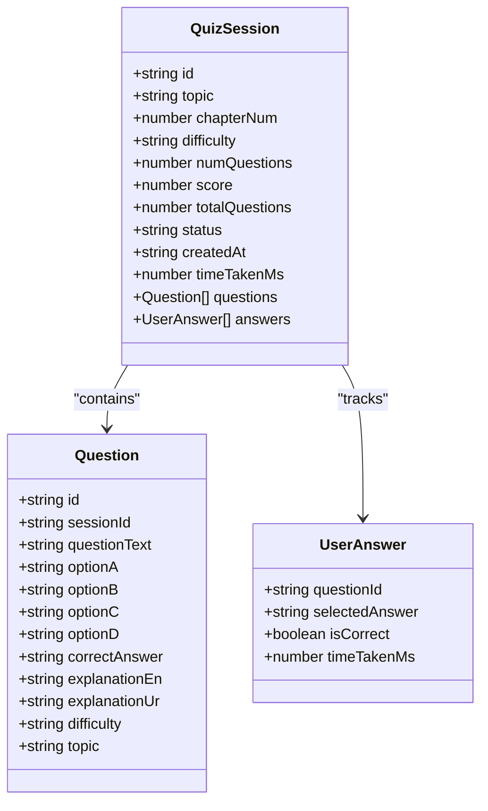
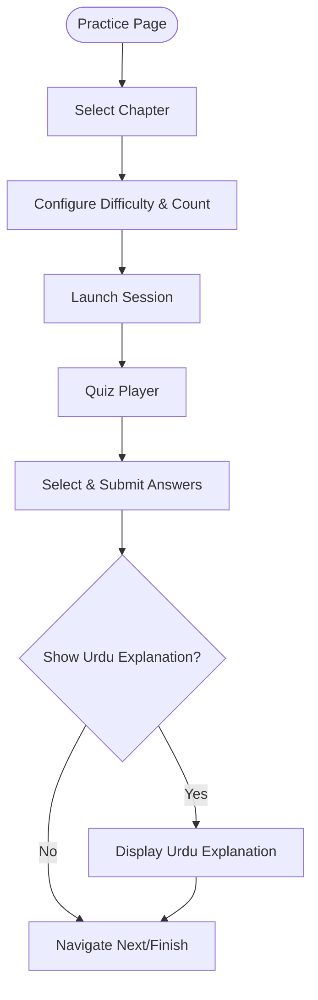
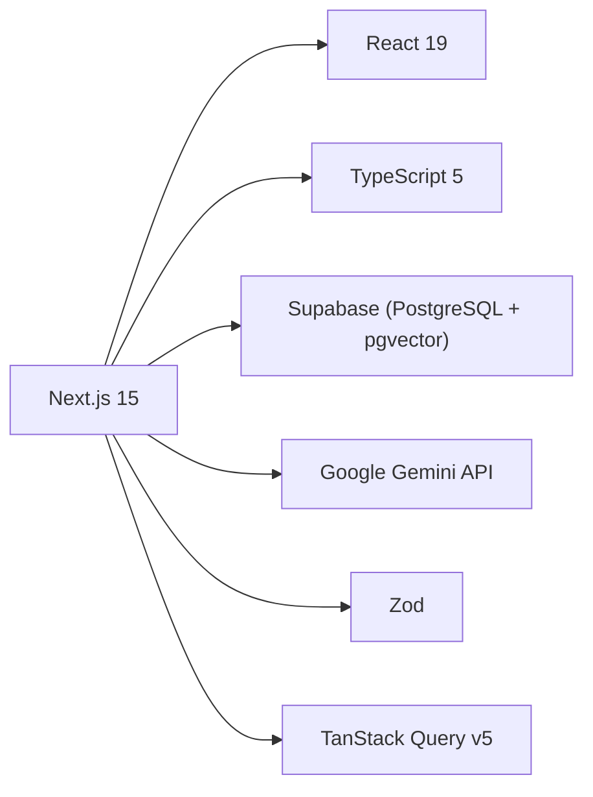

# RAG Pipeline Architecture

<cite>
**Referenced Files in This Document**
- [README.md](file://README.md)
- [package.json](file://package.json)
- [quiz.ts](file://src/types/quiz.ts)
- [practice/page.tsx](file://src/app/practice/page.tsx)
- [practice/[session]/page.tsx](file://src/app/practice/[session]/page.tsx)
</cite>

## Table of Contents
1. Introduction
2. Project Structure
3. Core Components
4. Architecture Overview
5. Detailed Component Analysis
6. Dependency Analysis
7. Performance Considerations
8. Troubleshooting Guide
9. Conclusion

## Introduction
This document explains MedAce AI’s Retrieval-Augmented Generation (RAG) pipeline that powers MDCAT Biology MCQ generation from FSc textbook content. It covers the end-to-end data flow from raw textbook processing to query-time retrieval and structured MCQ generation, including indexing parameters, vector storage, prompt construction, and output validation.

## Project Structure
The repository organizes textbook source material under rag/textbooks and provides a Next.js application for student interaction. The README documents the full RAG pipeline, environment variables, dependencies, and project layout.

**Diagram sources**
- [README.md:90-122](file://README.md#L90-L122)

**Section sources**
- [README.md:163-226](file://README.md#L163-L226)

## Core Components
- Data source: 15 chapters of FSc Biology textbooks with SLO codes for natural topic boundaries.
- Build-time indexing: cleaning, chunking, embedding, and upload to Supabase pgvector.
- Query-time retrieval: embed user query, retrieve top 5 relevant chunks via cosine similarity.
- Generation: construct Gemini prompts with system instructions and retrieved context; generate structured MCQ JSON.
- Validation: enforce schema using Zod before persisting or serving results.

Key technical specifications:
- Chunk size: 400–600 tokens per chunk
- Overlap: 50 tokens
- Embedding model: Gemini text-embedding-004 producing 768-dimensional vectors
- Vector store: Supabase pgvector
- Generator: Gemini 2.0 Flash
- Validation: Zod schemas

**Section sources**
- [README.md:83-122](file://README.md#L83-L122)

## Architecture Overview
The RAG architecture integrates a build-time indexing pipeline and a query-time generation pipeline. Indexing transforms raw textbook files into semantic chunks and stores their embeddings. At query time, the system retrieves relevant chunks and generates MCQs grounded in those chunks.

**Diagram sources**
- [README.md:104-122](file://README.md#L104-L122)

## Detailed Component Analysis

### Build-Time Indexing Pipeline
- Input: Raw textbook .txt files under rag/textbooks.
- Steps:
  - Text cleaner removes watermarks, page markers, and OCR artifacts.
  - Chunker splits content by SLO codes and headings into 400–600 token chunks with 50-token overlap.
  - Embedder calls Gemini text-embedding-004 to produce 768-dim vectors.
  - Uploader inserts vectors into Supabase pgvector table textbook_chunks.

**Diagram sources**
- [README.md:90-102](file://README.md#L90-L102)

**Section sources**
- [README.md:90-102](file://README.md#L90-L102)

### Query-Time Retrieval and Generation
- Trigger: Student selects a topic or starts a practice session.
- Steps:
  - Embed the query (topic + difficulty context).
  - Perform cosine similarity search in pgvector to retrieve top 5 relevant chunks.
  - Build a Gemini prompt combining system instructions, retrieved context, and generation instructions.
  - Generate structured MCQ JSON via Gemini 2.0 Flash.
  - Validate outputs using Zod schemas before storing or serving.

**Diagram sources**
- [README.md:104-122](file://README.md#L104-L122)

**Section sources**
- [README.md:104-122](file://README.md#L104-L122)

### Data Models and Types
- Question interface defines fields used in MCQs, including options, correct answer, explanations in English and Urdu, difficulty, and topic.
- QuizSession aggregates questions and answers for a practice session.
- These types support consistent data handling across UI and backend logic.

**Diagram sources**
- [quiz.ts:15-50](file://src/types/quiz.ts#L15-L50)

**Section sources**
- [quiz.ts:15-50](file://src/types/quiz.ts#L15-L50)

### Frontend Interaction Flow
- Topic selection and session configuration occur on the Practice page, which presents chapters, filters, and a modal to set difficulty and number of questions.
- The session player displays questions, tracks answers, shows timers, and toggles Urdu explanations.

**Diagram sources**
- [practice/page.tsx:18-196](file://src/app/practice/page.tsx#L18-L196)
- [practice/[session]/page.tsx:25-352](file://src/app/practice/[session]/page.tsx#L25-L352)

**Section sources**
- [practice/page.tsx:18-196](file://src/app/practice/page.tsx#L18-L196)
- [practice/[session]/page.tsx:25-352](file://src/app/practice/[session]/page.tsx#L25-L352)

## Dependency Analysis
- Framework and runtime: Next.js 15, React 19, TypeScript 5.
- Database and vector store: Supabase PostgreSQL with pgvector.
- AI services: Google Gemini (text-embedding-004 for embeddings; gemini-2.0-flash for generation).
- Validation: Zod for runtime schema checks.
- State management: TanStack Query v5 for server state caching and updates.

**Diagram sources**
- [package.json:11-26](file://package.json#L11-L26)
- [README.md:23-77](file://README.md#L23-L77)

**Section sources**
- [package.json:11-26](file://package.json#L11-L26)
- [README.md:23-77](file://README.md#L23-L77)

## Performance Considerations
- Chunk sizing: 400–600 tokens balances context richness with retrieval precision; 50-token overlap preserves continuity across chunk boundaries.
- Embedding dimension: 768-dim vectors reduce storage footprint while maintaining multilingual quality.
- Retrieval strategy: Cosine similarity over pgvector enables fast, SQL-native queries within Supabase.
- Model selection: Gemini 2.0 Flash offers faster inference and cost efficiency compared to larger models, suitable for MCQ generation at scale.
- Validation: Zod ensures early failure on malformed responses, reducing downstream errors and retries.

[No sources needed since this section provides general guidance]

## Troubleshooting Guide
- Missing environment variables: Ensure Supabase URL, keys, DATABASE_URL, and GEMINI_API_KEY are configured before running migrations or building the index.
- Indexing failures: Verify textbook files exist under rag/textbooks and that scripts run in order (clean → chunk → embed → upload).
- Retrieval issues: Confirm pgvector extension is enabled and textbook_chunks table contains valid embeddings.
- Generation errors: Check Gemini API key validity and rate limits; validate JSON responses with Zod to catch schema mismatches.
- Frontend behavior: If MCQs do not appear, verify API routes are implemented and returning validated structures matching client expectations.

**Section sources**
- [README.md:228-244](file://README.md#L228-L244)
- [README.md:292-314](file://README.md#L292-L314)

## Conclusion
MedAce AI’s RAG pipeline grounds MCQ generation in verified textbook content through a robust indexing process and precise retrieval. By leveraging Gemini embeddings and pgvector, the system achieves efficient, syllabus-aligned question generation with strong validation and clear performance characteristics. The frontend provides an intuitive experience for students to select topics, configure sessions, and engage with AI-generated practice questions and bilingual explanations.