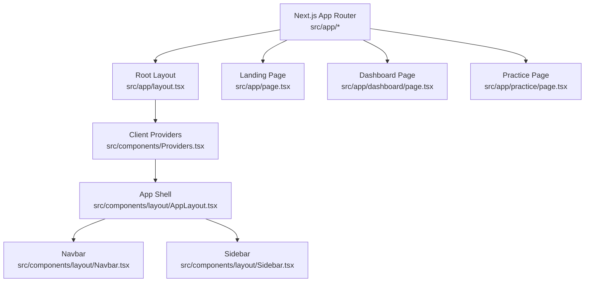
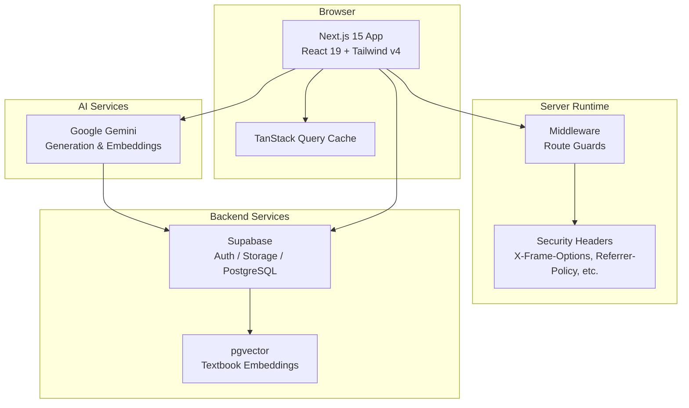
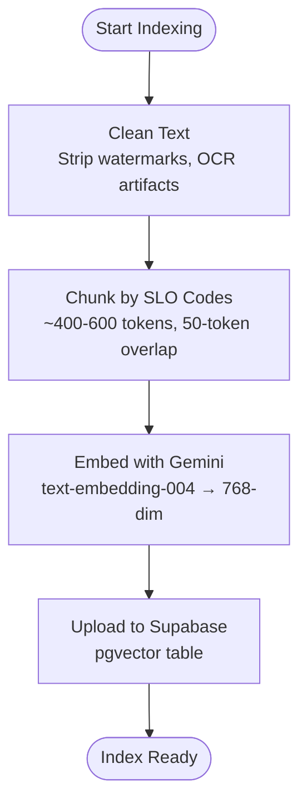
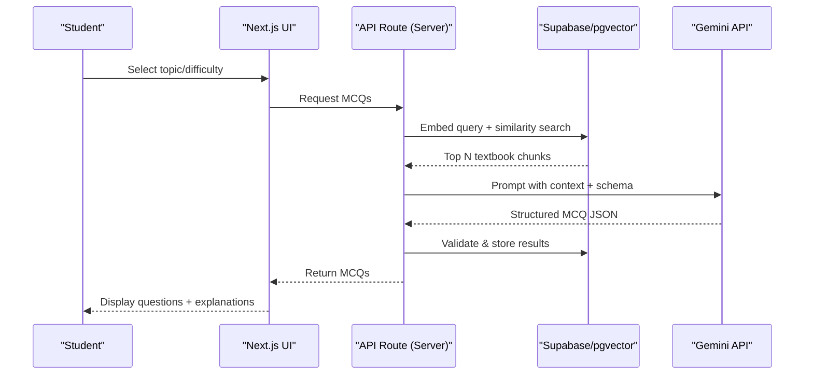
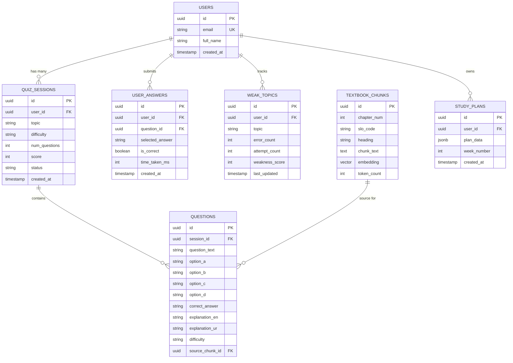
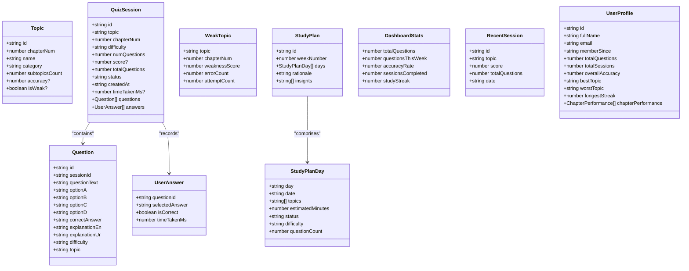
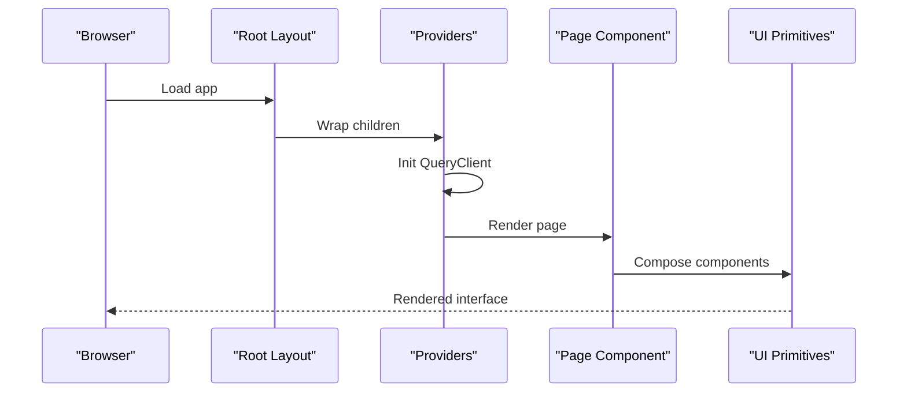
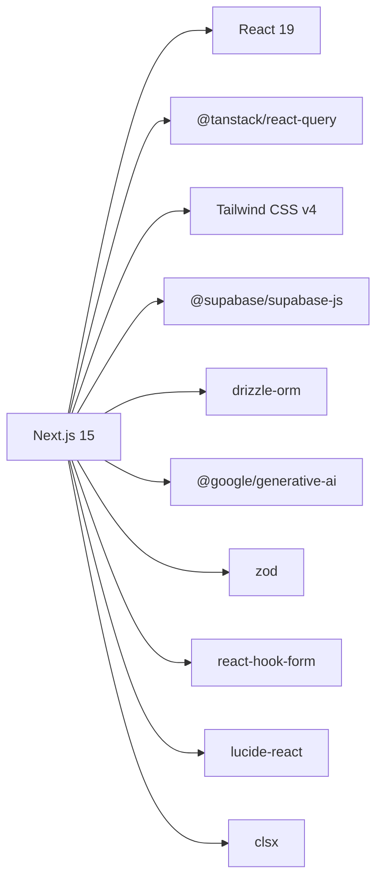

# Architecture Overview

<cite>
**Referenced Files in This Document**
- [package.json](file://package.json)
- [README.md](file://README.md)
- [next.config.ts](file://next.config.ts)
- [src/app/layout.tsx](file://src/app/layout.tsx)
- [src/middleware.ts](file://src/middleware.ts)
- [src/components/Providers.tsx](file://src/components/Providers.tsx)
- [src/components/layout/AppLayout.tsx](file://src/components/layout/AppLayout.tsx)
- [src/components/layout/Navbar.tsx](file://src/components/layout/Navbar.tsx)
- [src/components/layout/Sidebar.tsx](file://src/components/layout/Sidebar.tsx)
- [src/app/page.tsx](file://src/app/page.tsx)
- [src/app/dashboard/page.tsx](file://src/app/dashboard/page.tsx)
- [src/app/practice/page.tsx](file://src/app/practice/page.tsx)
- [src/types/quiz.ts](file://src/types/quiz.ts)
- [src/lib/mock-data.ts](file://src/lib/mock-data.ts)
</cite>

## Table of Contents
1. Introduction
2. Project Structure
3. Core Components
4. Architecture Overview
5. Detailed Component Analysis
6. Dependency Analysis
7. Performance Considerations
8. Troubleshooting Guide
9. Conclusion

## Introduction
MedAce AI is an adaptive MDCAT prep coach that delivers authentic English MCQs with optional Urdu explanations, weak-spot tracking, and RAG-powered question generation grounded in real textbook content. The system combines a Next.js 15 frontend (React 19), Supabase backend services (PostgreSQL + pgvector), and Google Gemini AI for generation and embeddings. It emphasizes type safety (TypeScript), utility-first styling (Tailwind CSS v4), robust state management (TanStack Query), and type-safe database operations (Drizzle ORM).

## Project Structure
The application follows a feature-oriented layout under src/app with shared UI components, layout wrappers, and client providers. Pages include a landing page, dashboard, practice, results, study plan, and profile. Client-side providers configure TanStack Query and toast notifications. Layout components provide consistent navigation and app shell.

**Diagram sources**
- [src/app/layout.tsx:1-57](file://src/app/layout.tsx#L1-L57)
- [src/components/Providers.tsx:1-23](file://src/components/Providers.tsx#L1-L23)
- [src/app/page.tsx:1-418](file://src/app/page.tsx#L1-L418)
- [src/app/dashboard/page.tsx:1-239](file://src/app/dashboard/page.tsx#L1-L239)
- [src/app/practice/page.tsx:1-196](file://src/app/practice/page.tsx#L1-L196)
- [src/components/layout/AppLayout.tsx:1-25](file://src/components/layout/AppLayout.tsx#L1-L25)
- [src/components/layout/Navbar.tsx:1-162](file://src/components/layout/Navbar.tsx#L1-L162)
- [src/components/layout/Sidebar.tsx:1-74](file://src/components/layout/Sidebar.tsx#L1-L74)

**Section sources**
- [src/app/layout.tsx:1-57](file://src/app/layout.tsx#L1-L57)
- [src/components/Providers.tsx:1-23](file://src/components/Providers.tsx#L1-L23)
- [src/app/page.tsx:1-418](file://src/app/page.tsx#L1-L418)
- [src/app/dashboard/page.tsx:1-239](file://src/app/dashboard/page.tsx#L1-L239)
- [src/app/practice/page.tsx:1-196](file://src/app/practice/page.tsx#L1-L196)
- [src/components/layout/AppLayout.tsx:1-25](file://src/components/layout/AppLayout.tsx#L1-L25)
- [src/components/layout/Navbar.tsx:1-162](file://src/components/layout/Navbar.tsx#L1-L162)
- [src/components/layout/Sidebar.tsx:1-74](file://src/components/layout/Sidebar.tsx#L1-L74)

## Core Components
- Root layout sets metadata, fonts, and wraps the app with Providers to initialize global state and UI context.
- Providers configures TanStack Query with default caching and retry options and provides Toast context.
- AppLayout composes Navbar and Sidebar for authenticated app pages.
- Landing page presents value propositions, features, and calls to action using reusable UI primitives.
- Dashboard displays stats, weak topics, recent sessions, and quick-start links.
- Practice page enables topic selection, filtering, and session configuration modal.

Key technology decisions:
- TypeScript for end-to-end type safety across types and data models.
- Tailwind CSS v4 for utility-first styling and theme tokens.
- TanStack Query for server state caching and optimistic updates.
- Drizzle ORM for type-safe database queries and migrations.
- Supabase Auth and PostgreSQL with pgvector for auth, persistence, and vector search.
- Google Gemini for generation and embeddings.

**Section sources**
- [src/app/layout.tsx:1-57](file://src/app/layout.tsx#L1-L57)
- [src/components/Providers.tsx:1-23](file://src/components/Providers.tsx#L1-L23)
- [src/components/layout/AppLayout.tsx:1-25](file://src/components/layout/AppLayout.tsx#L1-L25)
- [src/app/page.tsx:1-418](file://src/app/page.tsx#L1-L418)
- [src/app/dashboard/page.tsx:1-239](file://src/app/dashboard/page.tsx#L1-L239)
- [src/app/practice/page.tsx:1-196](file://src/app/practice/page.tsx#L1-L196)
- [package.json:11-27](file://package.json#L11-L27)
- [README.md:23-77](file://README.md#L23-L77)

## Architecture Overview
High-level architecture shows the browser-based Next.js app interacting with Supabase services and Google Gemini APIs. Security headers are enforced at the framework level. Middleware guards protected routes. Data flows from the UI through API routes (server-side) to Supabase and Gemini, then back to the client via TanStack Query.

**Diagram sources**
- [next.config.ts:1-25](file://next.config.ts#L1-L25)
- [src/middleware.ts:1-41](file://src/middleware.ts#L1-L41)
- [README.md:23-77](file://README.md#L23-L77)

**Section sources**
- [next.config.ts:1-25](file://next.config.ts#L1-L25)
- [src/middleware.ts:1-41](file://src/middleware.ts#L1-L41)
- [README.md:23-77](file://README.md#L23-L77)

## Detailed Component Analysis

### System Boundaries and Integration Patterns
- Frontend boundary: Next.js pages and components render UI and manage client state via TanStack Query.
- Server boundary: Middleware enforces route protection; Next.js headers enforce security policies.
- Backend boundary: Supabase provides authentication, storage, and relational data; pgvector stores and retrieves textbook chunk embeddings.
- AI boundary: Google Gemini generates MCQs and explanations, and produces embeddings for indexing.

Integration patterns:
- Client-to-server calls use typed requests and responses validated by Zod schemas (as documented).
- Server-to-database uses Drizzle ORM for type-safe queries and migrations.
- Server-to-AI calls use structured prompts and JSON outputs validated before persisting or returning to clients.

**Section sources**
- [src/middleware.ts:1-41](file://src/middleware.ts#L1-L41)
- [next.config.ts:1-25](file://next.config.ts#L1-L25)
- [README.md:23-77](file://README.md#L23-L77)

### RAG Pipeline: Build-Time Indexing
Build-time pipeline processes textbook content into indexed vectors for retrieval:
- Input: Chapter text files under rag/textbooks.
- Steps: Clean text, chunk by SLO codes/headings, embed via Gemini text-embedding-004, upload vectors to Supabase pgvector table.

**Diagram sources**
- [README.md:79-122](file://README.md#L79-L122)

**Section sources**
- [README.md:79-122](file://README.md#L79-L122)

### RAG Pipeline: Query-Time Generation
Query-time flow generates MCQs based on student-selected topics and difficulty:
- Embed query (topic + difficulty context).
- Retrieve top relevant chunks via pgvector cosine similarity.
- Build Gemini prompt with system instruction, retrieved context, and output schema.
- Generate structured MCQ JSON, validate with Zod, store in DB, serve to student.

**Diagram sources**
- [README.md:104-122](file://README.md#L104-L122)

**Section sources**
- [README.md:104-122](file://README.md#L104-L122)

### Database Schema and Data Models
Core entities include users, quiz sessions, questions, user answers, weak topics, textbook chunks, and study plans. Relationships link sessions to questions and answers, and questions to source chunks. Study plans store per-week plans with rationale and insights.

**Diagram sources**
- [README.md:124-161](file://README.md#L124-L161)

**Section sources**
- [README.md:124-161](file://README.md#L124-L161)

### Type System and Validation
Centralized TypeScript interfaces define domain models for topics, questions, sessions, answers, weak topics, study plans, dashboard stats, recent sessions, and user profiles. These types ensure consistency between UI, API contracts, and database models.

**Diagram sources**
- [src/types/quiz.ts:1-107](file://src/types/quiz.ts#L1-L107)

**Section sources**
- [src/types/quiz.ts:1-107](file://src/types/quiz.ts#L1-L107)

### UI Components and State Management
- Providers initializes TanStack Query with default cache and retry settings, enabling efficient data fetching and caching across pages.
- AppLayout composes Navbar and Sidebar for consistent navigation and app shell.
- Landing page demonstrates feature sections and CTAs using UI primitives.
- Dashboard aggregates mock stats, weak topics, and recent sessions, linking to practice and results.
- Practice page supports topic filtering, session configuration, and indicates AI-generated questions via RAG.

**Diagram sources**
- [src/app/layout.tsx:1-57](file://src/app/layout.tsx#L1-L57)
- [src/components/Providers.tsx:1-23](file://src/components/Providers.tsx#L1-L23)
- [src/app/page.tsx:1-418](file://src/app/page.tsx#L1-L418)
- [src/app/dashboard/page.tsx:1-239](file://src/app/dashboard/page.tsx#L1-L239)
- [src/app/practice/page.tsx:1-196](file://src/app/practice/page.tsx#L1-L196)

**Section sources**
- [src/components/Providers.tsx:1-23](file://src/components/Providers.tsx#L1-L23)
- [src/components/layout/AppLayout.tsx:1-25](file://src/components/layout/AppLayout.tsx#L1-L25)
- [src/app/page.tsx:1-418](file://src/app/page.tsx#L1-L418)
- [src/app/dashboard/page.tsx:1-239](file://src/app/dashboard/page.tsx#L1-L239)
- [src/app/practice/page.tsx:1-196](file://src/app/practice/page.tsx#L1-L196)

## Dependency Analysis
Technology stack includes Next.js 15, React 19, Supabase SDKs, Drizzle ORM, Postgres driver, TanStack Query, Google Generative AI, Zod, React Hook Form, Lucide icons, clsx, and Tailwind CSS v4 tooling. Dev dependencies cover TypeScript, Drizzle Kit, Tailwind PostCSS plugin, ESLint, and TSX runtime.

**Diagram sources**
- [package.json:11-39](file://package.json#L11-L39)

**Section sources**
- [package.json:11-39](file://package.json#L11-L39)

## Performance Considerations
- Caching: TanStack Query configured with staleTime and retry to reduce redundant network calls and improve perceived performance.
- Vector retrieval: pgvector cosine similarity efficiently returns top relevant chunks, minimizing LLM context size and cost.
- Cold starts: Drizzle ORM chosen for lighter footprint and faster cold starts on Vercel compared to heavier ORMs.
- UI rendering: Server components and static assets minimize client bundle; Tailwind v4 optimizes styles.
- Network boundaries: Security headers mitigate common web vulnerabilities without impacting performance.

[No sources needed since this section provides general guidance]

## Troubleshooting Guide
- Authentication gating: Middleware currently allows all routes in development; enable Supabase session checks in production to protect routes.
- Security headers: Ensure Next.js headers are applied globally to prevent clickjacking, MIME sniffing, and restrict permissions.
- Environment variables: Verify Supabase URL, keys, service role key, DATABASE_URL, and GEMINI_API_KEY are set correctly in deployment settings.
- Data validation: Use Zod to validate API inputs/outputs and Drizzle types to catch mismatches early.

**Section sources**
- [src/middleware.ts:1-41](file://src/middleware.ts#L1-L41)
- [next.config.ts:1-25](file://next.config.ts#L1-L25)
- [README.md:228-244](file://README.md#L228-L244)

## Conclusion
MedAce AI’s architecture integrates a modern Next.js frontend with Supabase services and Google Gemini AI to deliver adaptive, textbook-grounded MDCAT preparation. The RAG pipeline ensures high-quality, syllabus-aligned MCQs, while strong typing, robust state management, and secure defaults support scalability and reliability. Deployment on Vercel simplifies delivery, and the modular component structure enables maintainable growth.

[No sources needed since this section summarizes without analyzing specific files]