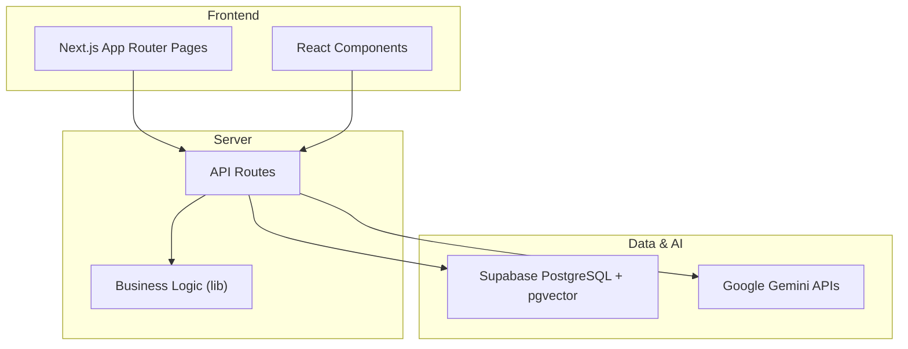
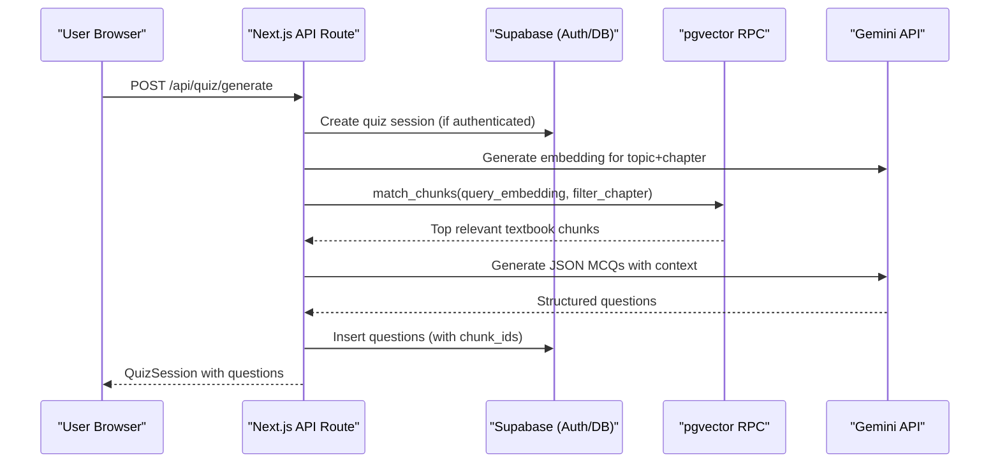
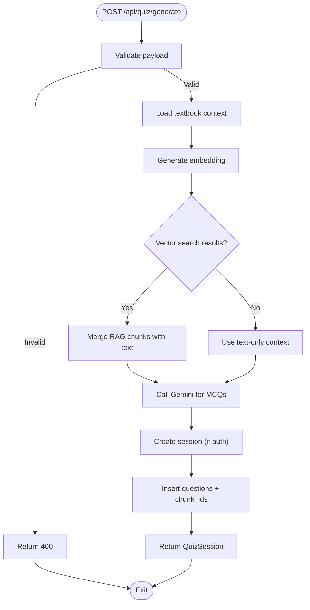
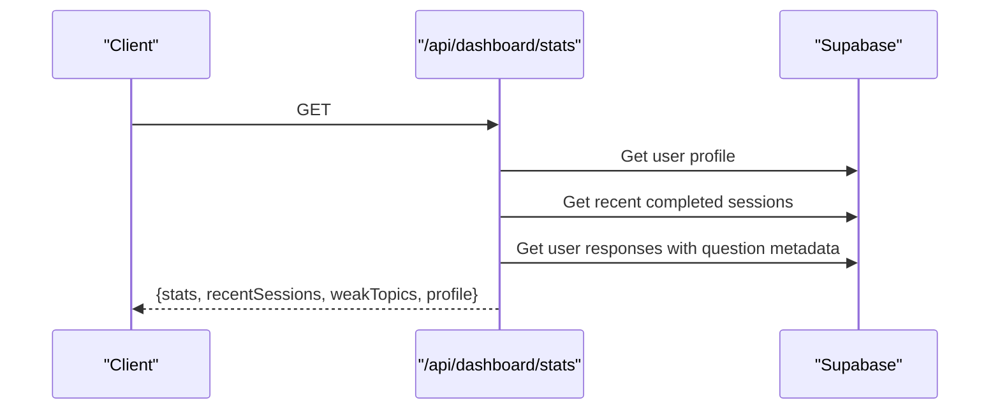
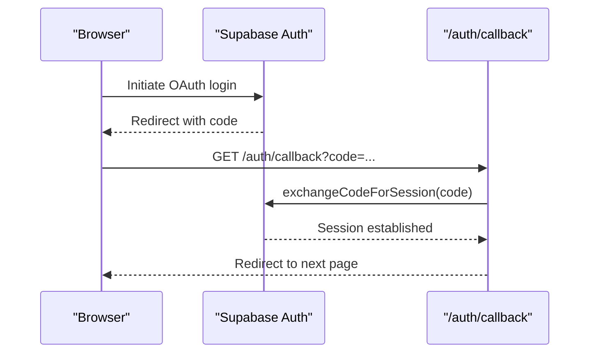
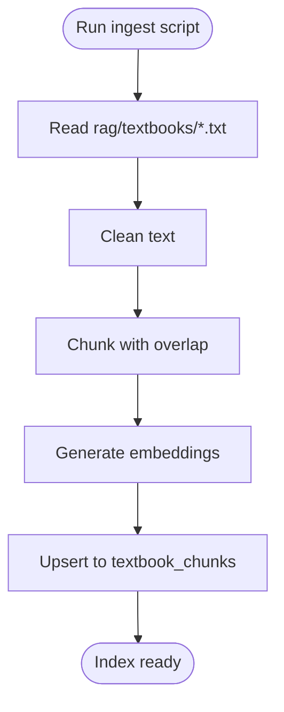
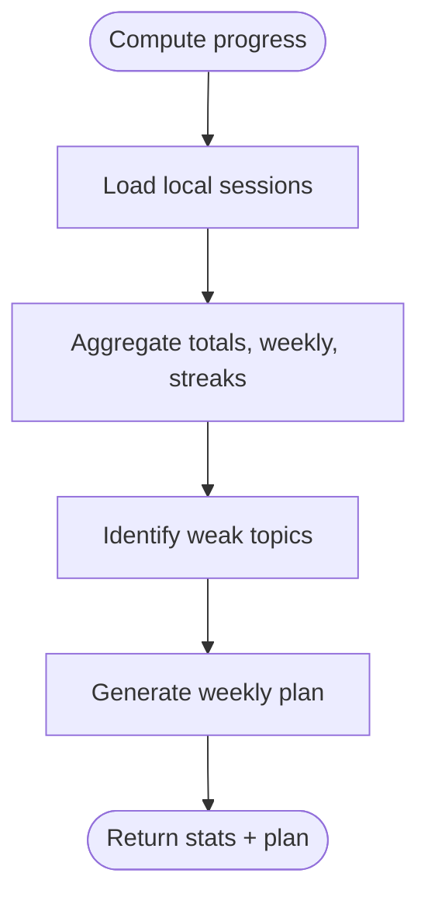
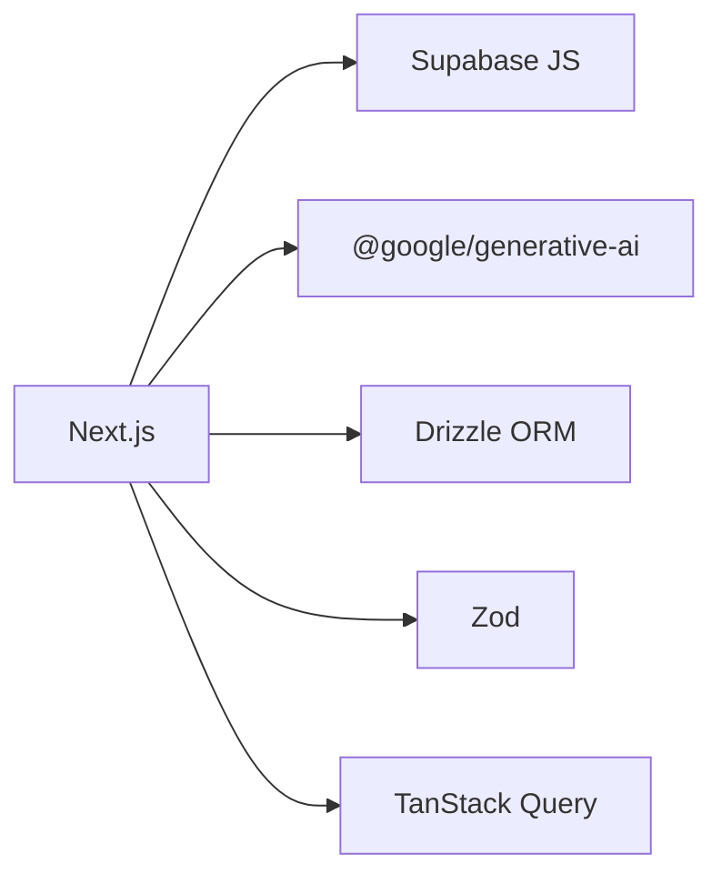
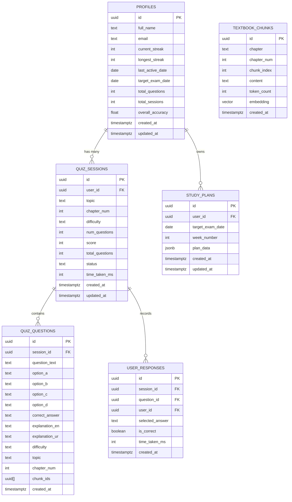

# Architecture Overview

<cite>
**Referenced Files in This Document**
- [README.md](file://README.md)
- [package.json](file://package.json)
- [next.config.ts](file://next.config.ts)
- [src/middleware.ts](file://src/middleware.ts)
- [supabase/schema.sql](file://supabase/schema.sql)
- [src/app/api/quiz/generate/route.ts](file://src/app/api/quiz/generate/route.ts)
- [src/app/api/dashboard/stats/route.ts](file://src/app/api/dashboard/stats/route.ts)
- [src/lib/textbook-reader.ts](file://src/lib/textbook-reader.ts)
- [src/lib/progress-tracker.ts](file://src/lib/progress-tracker.ts)
- [src/lib/study-plan-generator.ts](file://src/lib/study-plan-generator.ts)
- [scripts/ingest-textbooks.ts](file://scripts/ingest-textbooks.ts)
- [src/types/quiz.ts](file://src/types/quiz.ts)
- [src/app/auth/callback/route.ts](file://src/app/auth/callback/route.ts)
</cite>

## Table of Contents
1. Introduction
2. Project Structure
3. Core Components
4. Architecture Overview
5. Detailed Component Analysis
6. Dependency Analysis
7. Performance Considerations
8. Troubleshooting Guide
9. Conclusion
10. Appendices

## Introduction
MedAce AI is a full-stack, Next.js-based adaptive preparation platform for the MDCAT exam. It combines a React frontend with server-side API routes, Supabase-backed persistence (PostgreSQL + pgvector), and Google Gemini AI to generate syllabus-grounded MCQs and explanations. The system uses Retrieval-Augmented Generation (RAG) over textbook content to ensure questions are accurate and aligned with the curriculum. Authentication flows through Supabase OAuth, while state management on the client leverages TanStack Query for caching and optimistic updates.

## Project Structure
The repository follows a feature-oriented monorepo layout:
- Frontend pages and UI components live under src/app and src/components.
- Server-side logic is implemented as Next.js API routes under src/app/api.
- Business logic utilities are centralized in src/lib (textbook reader, progress tracker, study plan generator).
- Data ingestion scripts reside under scripts for building the vector index from textbook files.
- Database schema and RLS policies are defined in supabase/schema.sql.

**Diagram sources**
- [README.md:27-83](file://README.md#L27-L83)
- [src/app/api/quiz/generate/route.ts:1-196](file://src/app/api/quiz/generate/route.ts#L1-L196)
- [src/app/api/dashboard/stats/route.ts:1-181](file://src/app/api/dashboard/stats/route.ts#L1-L181)

**Section sources**
- [README.md:170-253](file://README.md#L170-L253)
- [package.json:11-28](file://package.json#L11-L28)

## Core Components
- Next.js App Router API routes handle authentication callbacks, quiz generation, and dashboard statistics.
- Supabase clients provide authenticated and admin access for data operations.
- Gemini integration performs embeddings and structured JSON generation for MCQs.
- Textbook reader loads chapter content for context during question generation.
- Progress tracker aggregates local or remote session data into actionable metrics.
- Study plan generator builds weekly plans based on weak topics and performance insights.

**Section sources**
- [src/app/api/quiz/generate/route.ts:1-196](file://src/app/api/quiz/generate/route.ts#L1-L196)
- [src/app/api/dashboard/stats/route.ts:1-181](file://src/app/api/dashboard/stats/route.ts#L1-L181)
- [src/lib/textbook-reader.ts:1-46](file://src/lib/textbook-reader.ts#L1-L46)
- [src/lib/progress-tracker.ts:1-192](file://src/lib/progress-tracker.ts#L1-L192)
- [src/lib/study-plan-generator.ts:1-102](file://src/lib/study-plan-generator.ts#L1-L102)

## Architecture Overview
High-level flow:
- Client requests trigger Next.js API routes.
- Routes validate inputs, optionally retrieve relevant textbook chunks via pgvector similarity search, and call Gemini to generate MCQs.
- Generated sessions and questions are persisted using Supabase.
- Dashboard stats aggregate user performance from database tables.
- Authentication callback exchanges OAuth codes for sessions and redirects users.

**Diagram sources**
- [src/app/api/quiz/generate/route.ts:10-187](file://src/app/api/quiz/generate/route.ts#L10-L187)
- [supabase/schema.sql:116-150](file://supabase/schema.sql#L116-L150)

**Section sources**
- [README.md:84-127](file://README.md#L84-L127)
- [src/app/api/quiz/generate/route.ts:10-187](file://src/app/api/quiz/generate/route.ts#L10-L187)

## Detailed Component Analysis

### RAG Question Generation Pipeline
- Input validation ensures correct request payloads before processing.
- Context retrieval combines direct textbook file reading with optional pgvector similarity search to enrich prompt context.
- Gemini generates structured MCQs adhering to a strict schema; fallback to local question sets if AI is unavailable.
- Session and questions are stored with references to source chunks for traceability.

**Diagram sources**
- [src/app/api/quiz/generate/route.ts:10-187](file://src/app/api/quiz/generate/route.ts#L10-L187)
- [src/lib/textbook-reader.ts:9-45](file://src/lib/textbook-reader.ts#L9-L45)
- [supabase/schema.sql:116-150](file://supabase/schema.sql#L116-L150)

**Section sources**
- [src/app/api/quiz/generate/route.ts:10-187](file://src/app/api/quiz/generate/route.ts#L10-L187)
- [src/lib/textbook-reader.ts:9-45](file://src/lib/textbook-reader.ts#L9-L45)

### Dashboard Statistics Aggregation
- Fetches current user profile and recent completed sessions.
- Computes weekly question counts, accuracy rates, and identifies weak topics by aggregating responses.
- Returns structured stats, recent sessions, weak topics, and profile details for the UI.

**Diagram sources**
- [src/app/api/dashboard/stats/route.ts:6-172](file://src/app/api/dashboard/stats/route.ts#L6-L172)

**Section sources**
- [src/app/api/dashboard/stats/route.ts:6-172](file://src/app/api/dashboard/stats/route.ts#L6-L172)

### Authentication Flow (OAuth Callback)
- Exchanges authorization code for a session using Supabase Auth.
- Redirects to the intended route after successful exchange, handling environment-specific host resolution.

**Diagram sources**
- [src/app/auth/callback/route.ts:4-31](file://src/app/auth/callback/route.ts#L4-L31)

**Section sources**
- [src/app/auth/callback/route.ts:4-31](file://src/app/auth/callback/route.ts#L4-L31)

### Textbook Ingestion (Build-Time Indexing)
- Reads raw textbook files, cleans text, splits into overlapping chunks, generates embeddings, and upserts records into pgvector.
- Includes rate-limit handling and per-chapter logging.

**Diagram sources**
- [scripts/ingest-textbooks.ts:97-183](file://scripts/ingest-textbooks.ts#L97-L183)

**Section sources**
- [scripts/ingest-textbooks.ts:97-183](file://scripts/ingest-textbooks.ts#L97-L183)

### Progress Tracking and Study Plan Generation
- Local history storage and computation of weekly activity, streaks, and weak topics.
- Generates a week-long study plan prioritizing weak areas and balancing core chapters.

**Diagram sources**
- [src/lib/progress-tracker.ts:37-191](file://src/lib/progress-tracker.ts#L37-L191)
- [src/lib/study-plan-generator.ts:26-100](file://src/lib/study-plan-generator.ts#L26-L100)

**Section sources**
- [src/lib/progress-tracker.ts:37-191](file://src/lib/progress-tracker.ts#L37-L191)
- [src/lib/study-plan-generator.ts:26-100](file://src/lib/study-plan-generator.ts#L26-L100)

## Dependency Analysis
Key runtime dependencies and their roles:
- Next.js App Router for routing and server functions.
- Supabase JS SDK for auth and database operations.
- Drizzle ORM for type-safe queries and migrations.
- Google Generative AI SDK for embeddings and model calls.
- Zod for input/output validation.
- TanStack Query for client-side data fetching and caching.

**Diagram sources**
- [package.json:11-28](file://package.json#L11-L28)

**Section sources**
- [package.json:11-28](file://package.json#L11-L28)

## Performance Considerations
- Vector search uses an HNSW index on embeddings for fast cosine similarity queries.
- Chunk size and overlap balance context richness with token limits and retrieval precision.
- Rate limiting and retries are implemented in ingestion to respect provider quotas.
- API routes return minimal payloads and leverage server-side aggregation to reduce client load.
- Security headers mitigate common web vulnerabilities at the edge.

[No sources needed since this section provides general guidance]

## Troubleshooting Guide
Common issues and mitigations:
- Missing or invalid environment variables can cause Supabase or Gemini failures; ensure all required keys are set.
- If vector search fails or returns no results, the pipeline falls back to text-only context and local question sets.
- Authentication callback errors should be checked in logs; verify redirect URLs and OAuth configuration.
- Middleware currently allows all routes in development; enable session checks when integrating Supabase Auth fully.

**Section sources**
- [src/app/api/quiz/generate/route.ts:125-135](file://src/app/api/quiz/generate/route.ts#L125-L135)
- [src/app/auth/callback/route.ts:24-31](file://src/app/auth/callback/route.ts#L24-L31)
- [src/middleware.ts:22-35](file://src/middleware.ts#L22-L35)

## Conclusion
MedAce AI’s architecture cleanly separates concerns across frontend, server routes, data persistence, and AI services. The RAG pipeline grounds question generation in verified textbook content, while Supabase provides robust authentication, relational storage, and vector search. The design supports scalability through efficient indexing, server-side aggregation, and modular API routes, enabling concurrent user sessions and iterative improvements to the learning experience.

[No sources needed since this section summarizes without analyzing specific files]

## Appendices

### Technology Stack Decisions and Rationale
- Gemini 2.0 Flash selected for speed, cost efficiency, multilingual output quality, and large context window.
- text-embedding-004 chosen for multilingual support, compact vectors, and generous free tier.
- pgvector integrated within Supabase to avoid extra services and leverage SQL-native queries.
- Drizzle ORM preferred for lighter footprint and better cold starts on serverless platforms.
- Zod centralizes validation and types, ensuring consistency between API contracts and runtime checks.
- TanStack Query offers superior developer experience for caching, pagination, and optimistic updates in Next.js.
- Framer Motion enables high-quality animations and transitions that enhance UX without sacrificing performance.

**Section sources**
- [README.md:311-323](file://README.md#L311-L323)

### Infrastructure and Deployment
- Deploy on Vercel with zero-config Next.js deployment.
- Set environment variables for Supabase, database, and Gemini before deploying.
- Security headers are applied globally via Next.js configuration.

**Section sources**
- [README.md:448-453](file://README.md#L448-L453)
- [next.config.ts:3-21](file://next.config.ts#L3-L21)

### System Boundaries and Security
- Authentication boundary: Supabase OAuth handles identity and session lifecycle.
- Database boundary: Row Level Security policies enforce per-user access across tables.
- AI boundary: Gemini calls are isolated in server routes with validated prompts and structured outputs.
- Middleware boundary: Protects routes and can enforce session checks when fully integrated.

**Section sources**
- [supabase/schema.sql:155-229](file://supabase/schema.sql#L155-L229)
- [src/middleware.ts:4-35](file://src/middleware.ts#L4-L35)

### Data Models Overview
Core entities include profiles, textbook chunks, quiz sessions, quiz questions, user responses, and study plans. Relationships link sessions to questions and responses, and questions reference source chunks.

**Diagram sources**
- [supabase/schema.sql:11-109](file://supabase/schema.sql#L11-L109)