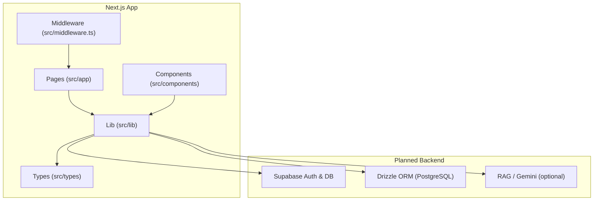
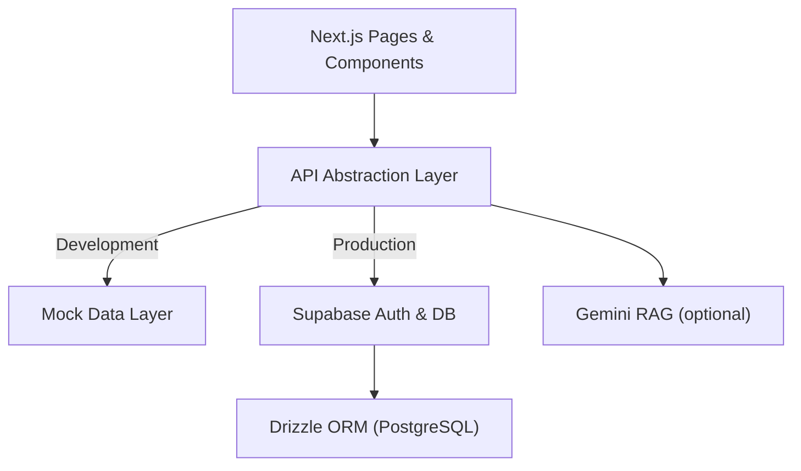
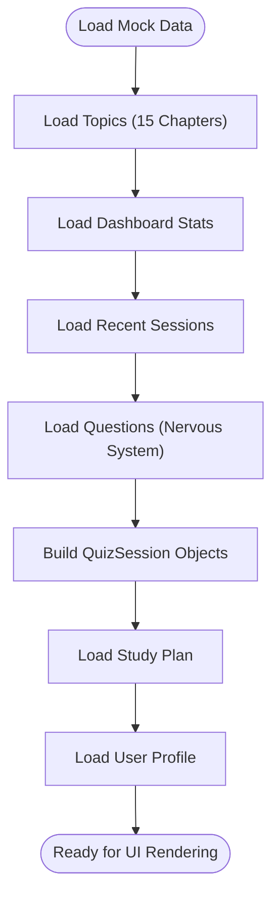
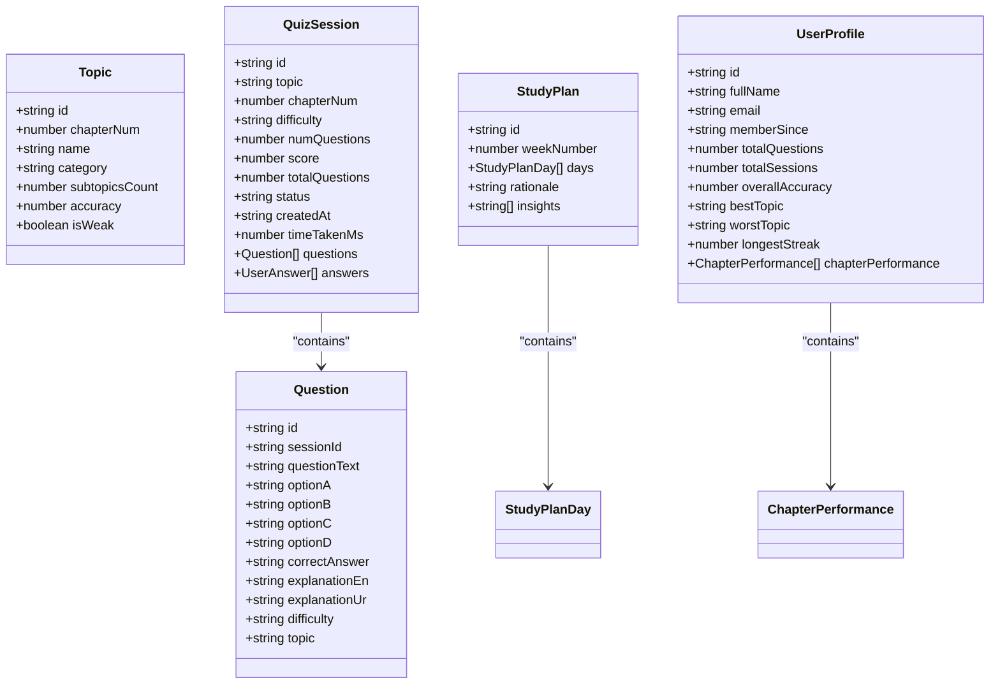
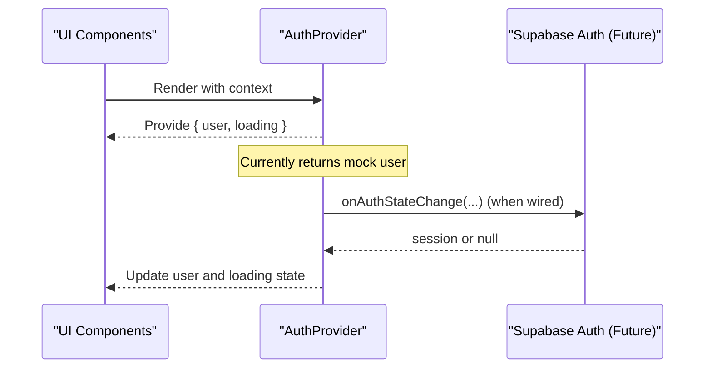
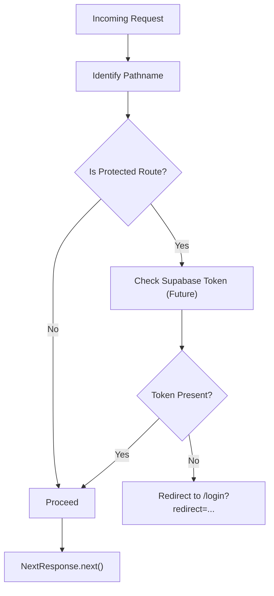
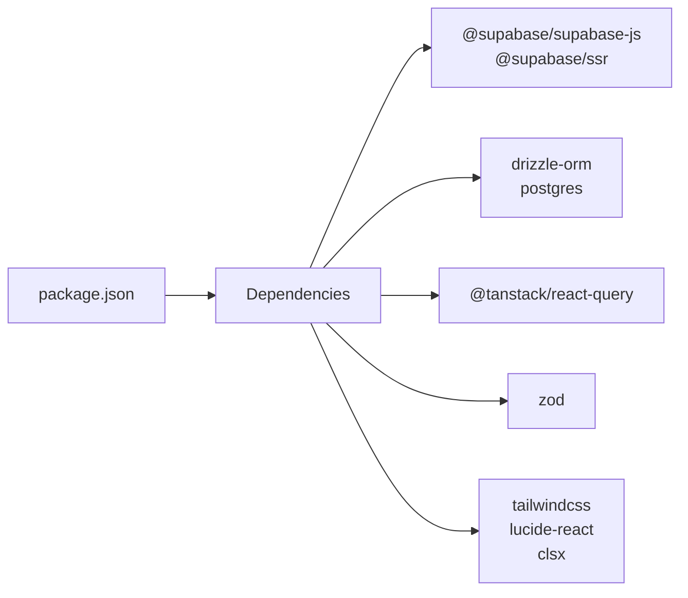

# Backend Services & Integration

<cite>
**Referenced Files in This Document**
- [package.json](file://package.json)
- [README.md](file://README.md)
- [src/lib/mock-data.ts](file://src/lib/mock-data.ts)
- [src/types/quiz.ts](file://src/types/quiz.ts)
- [src/middleware.ts](file://src/middleware.ts)
- [src/components/auth/AuthProvider.tsx](file://src/components/auth/AuthProvider.tsx)
- [next.config.ts](file://next.config.ts)
</cite>

## Table of Contents
1. Introduction
2. Project Structure
3. Core Components
4. Architecture Overview
5. Detailed Component Analysis
6. Dependency Analysis
7. Performance Considerations
8. Troubleshooting Guide
9. Conclusion

## Introduction
This document describes the backend service architecture for MedAce AI with a focus on:
- Supabase integration for authentication and database operations
- Drizzle ORM setup for PostgreSQL schema management and query building
- A mock data layer that simulates backend responses during development, including a comprehensive quiz dataset covering all 15 MDCAT biology chapters
- An API abstraction layer to provide consistent interfaces regardless of whether mock or real services are used
- Configuration patterns for environment variables, service endpoints, and connection pooling
- Scalability considerations and migration strategies from mock to production services

The current codebase is primarily frontend-focused with Next.js and includes placeholders and comments indicating where Supabase and Drizzle will be integrated. The mock data layer provides a complete development experience while the project dependencies and README outline the intended backend integrations.

## Project Structure
MedAce AI uses a Next.js application structure with:
- Pages and layouts under src/app
- Shared UI components under src/components
- Types and utilities under src/types and src/lib
- Middleware for route protection under src/middleware.ts
- Environment configuration via Next.js conventions and documented in README

**Section sources**
- [README.md:163-226](file://README.md#L163-L226)
- [next.config.ts:1-25](file://next.config.ts#L1-L25)

## Core Components
- Mock Data Layer: Provides types and datasets for topics, questions, sessions, study plans, dashboard stats, recent sessions, and user profile. It covers all 15 MDCAT Biology chapters and supports quiz flows in development.
- Type System: Centralized TypeScript interfaces define contracts for Topic, Question, QuizSession, StudyPlan, DashboardStats, RecentSession, UserProfile, and related entities.
- Authentication Provider: Currently returns a mock user; includes comments for integrating Supabase auth state changes.
- Route Middleware: Defines protected routes and contains commented logic for enforcing Supabase session checks in production.

These components form the foundation for an API abstraction layer that can switch between mock and real services without changing UI code.

**Section sources**
- [src/lib/mock-data.ts:1-313](file://src/lib/mock-data.ts#L1-L313)
- [src/types/quiz.ts:1-107](file://src/types/quiz.ts#L1-L107)
- [src/components/auth/AuthProvider.tsx:1-58](file://src/components/auth/AuthProvider.tsx#L1-L58)
- [src/middleware.ts:1-41](file://src/middleware.ts#L1-L41)

## Architecture Overview
The intended backend architecture integrates Supabase for authentication and database access, with Drizzle ORM managing schema and queries against PostgreSQL. During development, the mock data layer simulates these services. The API abstraction layer will expose consistent functions for fetching topics, generating quizzes, saving sessions, and retrieving user profiles, abstracting away whether data comes from mock or Supabase.

[No diagram sources needed since this diagram shows conceptual workflow, not actual code structure]

## Detailed Component Analysis

### Mock Data Layer
The mock data layer defines:
- Topics across 15 MDCAT Biology chapters with categories and accuracy metrics
- Weak topics with weakness scores and attempt/error counts
- Dashboard statistics and recent sessions
- A full set of sample questions for the Nervous System chapter with explanations in English and Urdu
- Quiz session objects representing in-progress and completed states
- Study plan with weekly insights and daily tasks
- User profile with performance metrics and chapter-wise accuracy

This dataset enables full UI development and testing without backend dependencies.

**Section sources**
- [src/lib/mock-data.ts:15-31](file://src/lib/mock-data.ts#L15-L31)
- [src/lib/mock-data.ts:36-42](file://src/lib/mock-data.ts#L36-L42)
- [src/lib/mock-data.ts:47-64](file://src/lib/mock-data.ts#L47-L64)
- [src/lib/mock-data.ts:69-210](file://src/lib/mock-data.ts#L69-L210)
- [src/lib/mock-data.ts:215-227](file://src/lib/mock-data.ts#L215-L227)
- [src/lib/mock-data.ts:232-256](file://src/lib/mock-data.ts#L232-L256)
- [src/lib/mock-data.ts:261-281](file://src/lib/mock-data.ts#L261-L281)
- [src/lib/mock-data.ts:286-312](file://src/lib/mock-data.ts#L286-L312)

### Type System
Centralized TypeScript interfaces ensure consistency across mock and production layers:
- Topic, Question, UserAnswer, QuizSession
- WeakTopic, StudyPlanDay, StudyPlan
- DashboardStats, RecentSession, UserProfile

These types act as the contract for the API abstraction layer, enabling seamless switching between mock and real implementations.

**Diagram sources**
- [src/types/quiz.ts:5-13](file://src/types/quiz.ts#L5-L13)
- [src/types/quiz.ts:15-28](file://src/types/quiz.ts#L15-L28)
- [src/types/quiz.ts:30-35](file://src/types/quiz.ts#L30-L35)
- [src/types/quiz.ts:37-50](file://src/types/quiz.ts#L37-L50)
- [src/types/quiz.ts:52-58](file://src/types/quiz.ts#L52-L58)
- [src/types/quiz.ts:60-76](file://src/types/quiz.ts#L60-L76)
- [src/types/quiz.ts:78-84](file://src/types/quiz.ts#L78-L84)
- [src/types/quiz.ts:86-92](file://src/types/quiz.ts#L86-L92)
- [src/types/quiz.ts:94-106](file://src/types/quiz.ts#L94-L106)

**Section sources**
- [src/types/quiz.ts:1-107](file://src/types/quiz.ts#L1-L107)

### Authentication Provider
The AuthProvider currently returns a mock user for frontend-only development. It includes explicit comments showing how to integrate Supabase auth state changes using createBrowserClient and onAuthStateChange. This design allows swapping the implementation later without altering consuming components.

**Diagram sources**
- [src/components/auth/AuthProvider.tsx:31-42](file://src/components/auth/AuthProvider.tsx#L31-L42)
- [src/components/auth/AuthProvider.tsx:43-57](file://src/components/auth/AuthProvider.tsx#L43-L57)

**Section sources**
- [src/components/auth/AuthProvider.tsx:1-58](file://src/components/auth/AuthProvider.tsx#L1-L58)

### Route Middleware
The middleware defines protected routes and includes commented logic to enforce Supabase session checks via cookies when Supabase auth is wired up. This ensures a clear path to secure pages in production while allowing development flow.

**Diagram sources**
- [src/middleware.ts:4-12](file://src/middleware.ts#L4-L12)
- [src/middleware.ts:14-35](file://src/middleware.ts#L14-L35)

**Section sources**
- [src/middleware.ts:1-41](file://src/middleware.ts#L1-L41)

### API Abstraction Layer (Design)
To unify data access across mock and production, implement an API abstraction layer that:
- Exposes typed functions for topics, questions, sessions, study plans, and user profiles
- Uses environment flags or runtime detection to choose mock vs. Supabase clients
- Returns consistent shapes defined by the type system
- Handles errors uniformly and provides retry/backoff for network calls

Example responsibilities:
- fetchTopics(): return Topic[]
- generateQuiz(topic): return QuizSession
- saveSession(session): persist to Supabase or mock store
- getStudyPlan(userId): return StudyPlan
- getUserProfile(userId): return UserProfile

This layer isolates UI components from implementation details and simplifies migration from mock to production.

[No section sources needed since this section outlines design without analyzing specific files]

## Dependency Analysis
Key dependencies indicate planned backend integrations:
- Supabase client and SSR helpers for authentication and database operations
- Drizzle ORM and Postgres driver for schema management and queries
- React Query for data fetching and caching
- Zod for validation
- Tailwind CSS and UI libraries for presentation

**Diagram sources**
- [package.json:11-26](file://package.json#L11-L26)

**Section sources**
- [package.json:1-42](file://package.json#L1-L42)

## Performance Considerations
- Connection Pooling: Configure Drizzle with a connection pool sized for expected concurrency. Use environment-based settings to scale pools per environment (dev vs prod).
- Query Optimization: Use Drizzle’s query builder to select only necessary fields, leverage indexes on frequently queried columns (e.g., userId, topicId), and paginate results.
- Caching: Leverage React Query for client-side caching and server-side caching strategies to reduce redundant requests.
- Rate Limiting: Apply rate limits at the API layer to protect downstream services like Supabase and Gemini.
- Error Handling: Implement retries with exponential backoff for transient failures and circuit breakers for external APIs.
- Security Headers: Enforce security headers globally via Next.js configuration to mitigate common web vulnerabilities.

[No section sources needed since this section provides general guidance]

## Troubleshooting Guide
Common issues and resolutions:
- Missing Environment Variables: Ensure NEXT_PUBLIC_SUPABASE_URL, NEXT_PUBLIC_SUPABASE_ANON_KEY, SUPABASE_SERVICE_ROLE_KEY, DATABASE_URL, and GEMINI_API_KEY are configured as documented.
- Auth State Not Updating: Verify Supabase client initialization and onAuthStateChange listener wiring in AuthProvider.
- Protected Routes Accessible: Enable middleware enforcement by uncommenting token checks and ensuring cookie handling matches Supabase SSR configuration.
- Database Schema Mismatches: Run Drizzle migrations to align schema with model definitions; verify DATABASE_URL points to the correct instance.
- Network Errors: Inspect error logs, validate CORS policies, and confirm service endpoints are reachable.

**Section sources**
- [README.md:228-244](file://README.md#L228-L244)
- [src/middleware.ts:22-33](file://src/middleware.ts#L22-L33)
- [src/components/auth/AuthProvider.tsx:31-42](file://src/components/auth/AuthProvider.tsx#L31-L42)

## Conclusion
MedAce AI’s backend architecture is designed around Supabase for authentication and database operations, with Drizzle ORM managing PostgreSQL schemas and queries. The mock data layer provides a robust development experience, covering all 15 MDCAT Biology chapters and supporting quiz workflows. An API abstraction layer will unify data access, enabling seamless migration from mock to production. Configuration patterns for environment variables and security headers are established, and scalability considerations include connection pooling, caching, and robust error handling. With these foundations, the team can confidently evolve from frontend-only development to a fully integrated backend service.