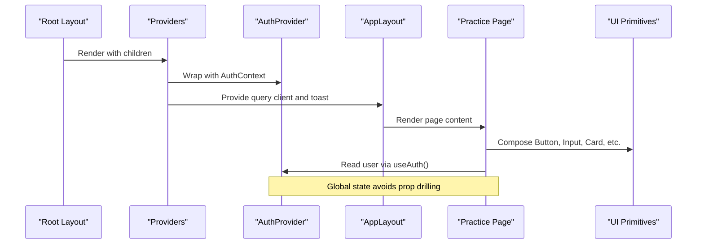
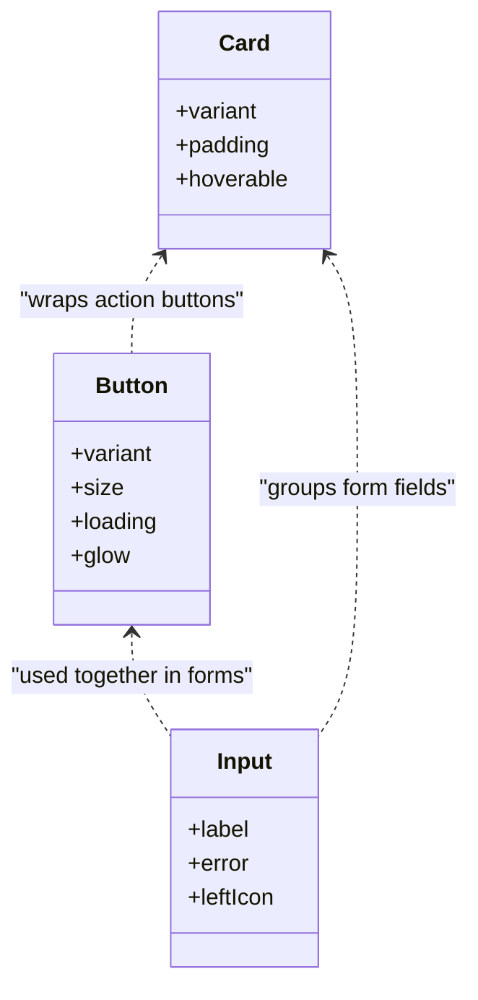
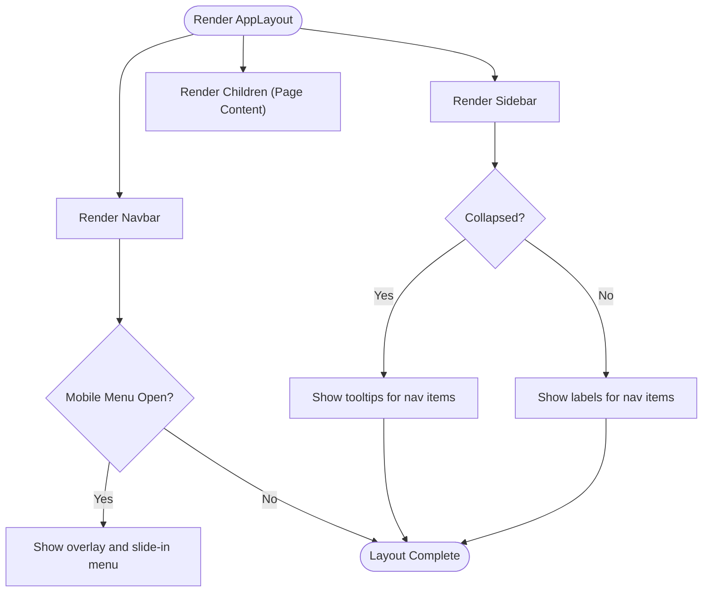
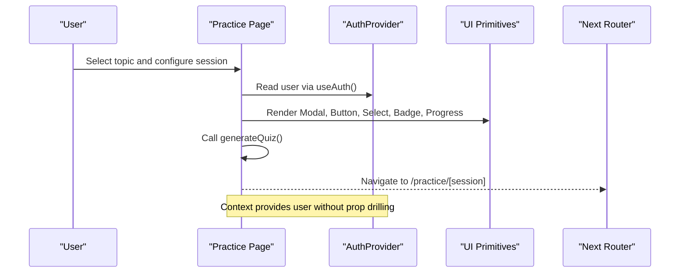
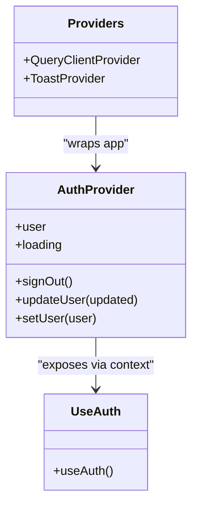
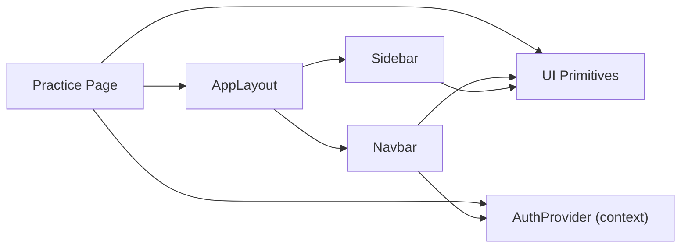

# Component Architecture

<cite>
**Referenced Files in This Document**
- [Button.tsx](file://src/components/ui/Button.tsx)
- [Input.tsx](file://src/components/ui/Input.tsx)
- [Card.tsx](file://src/components/ui/Card.tsx)
- [index.ts](file://src/components/ui/index.ts)
- [AppLayout.tsx](file://src/components/layout/AppLayout.tsx)
- [Navbar.tsx](file://src/components/layout/Navbar.tsx)
- [Sidebar.tsx](file://src/components/layout/Sidebar.tsx)
- [AuthProvider.tsx](file://src/components/auth/AuthProvider.tsx)
- [Providers.tsx](file://src/components/Providers.tsx)
- [layout.tsx](file://src/app/layout.tsx)
- [page.tsx](file://src/app/practice/page.tsx)
- [quiz.ts](file://src/types/quiz.ts)
</cite>

## Table of Contents
1. Introduction
2. Project Structure
3. Core Components
4. Architecture Overview
5. Detailed Component Analysis
6. Dependency Analysis
7. Performance Considerations
8. Troubleshooting Guide
9. Conclusion

## Introduction
This document explains MedAce-AI’s React component architecture with a focus on the three-tier structure: UI primitives, layout components, and feature-specific components. It covers how providers implement global state and service injection, composition patterns for building complex interfaces, lifecycle management, prop drilling avoidance via context, styling with Tailwind CSS and custom theme tokens, performance strategies (lazy loading, memoization, bundle optimization), and testing approaches for different component types.

## Project Structure
MedAce-AI organizes components into clear tiers:
- UI primitives under src/components/ui: Button, Input, Card, and others, re-exported from an index barrel.
- Layout components under src/components/layout: AppLayout composes Navbar and Sidebar to provide a consistent shell across pages.
- Feature-specific components and pages under src/app: Pages like Practice compose layout and UI primitives to deliver domain functionality.
- Providers at src/components/Providers.tsx wrap the app with data-fetching and toast contexts; authentication is provided by AuthProvider.

```mermaid
graph TB
subgraph "Root"
Root["Root Layout<br/>src/app/layout.tsx"]
end
subgraph "Providers"
P["Providers<br/>src/components/Providers.tsx"]
A["AuthProvider<br/>src/components/auth/AuthProvider.tsx"]
end
subgraph "Layout"
L["AppLayout<br/>src/components/layout/AppLayout.tsx"]
N["Navbar<br/>src/components/layout/Navbar.tsx"]
S["Sidebar<br/>src/components/layout/Sidebar.tsx"]
end
subgraph "UI Primitives"
U1["Button<br/>src/components/ui/Button.tsx"]
U2["Input<br/>src/components/ui/Input.tsx"]
U3["Card<br/>src/components/ui/Card.tsx"]
UBarrel["UI Barrel<br/>src/components/ui/index.ts"]
end
subgraph "Feature Page"
F["Practice Page<br/>src/app/practice/page.tsx"]
end
Root --> P
P --> A
P --> L
L --> N
L --> S
F --> L
F --> U1
F --> U2
F --> U3
U1 -.-> UBarrel
U2 -.-> UBarrel
U3 -.-> UBarrel
```

**Diagram sources**
- [layout.tsx:44-56](file://src/app/layout.tsx#L44-L56)
- [Providers.tsx:7-22](file://src/components/Providers.tsx#L7-L22)
- [AuthProvider.tsx:43-207](file://src/components/auth/AuthProvider.tsx#L43-L207)
- [AppLayout.tsx:29-89](file://src/components/layout/AppLayout.tsx#L29-L89)
- [Navbar.tsx:32-253](file://src/components/layout/Navbar.tsx#L32-L253)
- [Sidebar.tsx:27-145](file://src/components/layout/Sidebar.tsx#L27-L145)
- [Button.tsx:35-67](file://src/components/ui/Button.tsx#L35-L67)
- [Input.tsx:12-54](file://src/components/ui/Input.tsx#L12-L54)
- [Card.tsx:30-69](file://src/components/ui/Card.tsx#L30-L69)
- [index.ts:1-15](file://src/components/ui/index.ts#L1-L15)
- [page.tsx:22-276](file://src/app/practice/page.tsx#L22-L276)

**Section sources**
- [layout.tsx:44-56](file://src/app/layout.tsx#L44-L56)
- [Providers.tsx:7-22](file://src/components/Providers.tsx#L7-L22)
- [AppLayout.tsx:29-89](file://src/components/layout/AppLayout.tsx#L29-L89)
- [index.ts:1-15](file://src/components/ui/index.ts#L1-L15)

## Core Components
- UI primitives are small, focused, and styled with Tailwind classes and utility functions. They expose typed props and support variants, sizes, and optional states like loading or hover effects.
- Layout components provide structural shells and navigation behaviors, composing UI primitives and integrating with Next.js routing and motion libraries.
- Feature pages assemble layout and UI primitives to implement domain workflows, consuming global state via context and orchestrating API calls.

Key implementation highlights:
- Button supports variants, sizes, loading state, and accessible attributes while wrapping interactions with motion for micro-interactions.
- Input provides label, error messaging, and optional left icon, with focus and validation styles.
- Card offers multiple visual variants and padding scales, with optional hover elevation.
- AppLayout composes Navbar and Sidebar, adds mobile bottom navigation, and renders page content within a responsive container.
- Navbar adapts between landing and app modes, integrates user avatar from auth context, and manages mobile menu state.
- Sidebar provides collapsible navigation with active indicators and tooltips when collapsed.
- Providers sets up React Query client and Toast provider at the root.
- AuthProvider exposes user session, loading state, sign-out, and update methods via context, persisting sessions locally and syncing with Supabase when configured.

**Section sources**
- [Button.tsx:35-67](file://src/components/ui/Button.tsx#L35-L67)
- [Input.tsx:12-54](file://src/components/ui/Input.tsx#L12-L54)
- [Card.tsx:30-69](file://src/components/ui/Card.tsx#L30-L69)
- [AppLayout.tsx:29-89](file://src/components/layout/AppLayout.tsx#L29-L89)
- [Navbar.tsx:32-253](file://src/components/layout/Navbar.tsx#L32-L253)
- [Sidebar.tsx:27-145](file://src/components/layout/Sidebar.tsx#L27-L145)
- [Providers.tsx:7-22](file://src/components/Providers.tsx#L7-L22)
- [AuthProvider.tsx:43-207](file://src/components/auth/AuthProvider.tsx#L43-L207)

## Architecture Overview
The application follows a layered composition model:
- Root layout wraps the entire app with Providers that inject global services (React Query, Toast).
- AuthProvider supplies authentication state and actions through context, enabling any descendant to read user info without prop drilling.
- AppLayout standardizes the application shell, including top navigation and sidebar, and renders page content.
- Feature pages compose layout and UI primitives to implement specific workflows, such as selecting topics and starting practice sessions.



**Diagram sources**
- [layout.tsx:44-56](file://src/app/layout.tsx#L44-L56)
- [Providers.tsx:7-22](file://src/components/Providers.tsx#L7-L22)
- [AuthProvider.tsx:43-207](file://src/components/auth/AuthProvider.tsx#L43-L207)
- [AppLayout.tsx:29-89](file://src/components/layout/AppLayout.tsx#L29-L89)
- [page.tsx:22-276](file://src/app/practice/page.tsx#L22-L276)

## Detailed Component Analysis

### UI Primitives: Button, Input, Card
These components encapsulate reusable UI behavior and styling:
- Button: variant-driven styles, size presets, loading indicator, disabled state, and motion-based hover/tap feedback.
- Input: label association, error display, optional left icon, focus ring, and accessibility attributes.
- Card: variant and padding presets, optional hover elevation, and motion transitions.



**Diagram sources**
- [Button.tsx:35-67](file://src/components/ui/Button.tsx#L35-L67)
- [Input.tsx:12-54](file://src/components/ui/Input.tsx#L12-L54)
- [Card.tsx:30-69](file://src/components/ui/Card.tsx#L30-L69)

**Section sources**
- [Button.tsx:35-67](file://src/components/ui/Button.tsx#L35-L67)
- [Input.tsx:12-54](file://src/components/ui/Input.tsx#L12-L54)
- [Card.tsx:30-69](file://src/components/ui/Card.tsx#L30-L69)

### Layout Components: AppLayout, Navbar, Sidebar
- AppLayout: Provides a responsive shell with Navbar, Sidebar, and main content area; includes mobile bottom navigation with active state animations.
- Navbar: Adapts to landing vs app mode, displays user avatar from auth context, and manages mobile menu open/close with motion overlays.
- Sidebar: Collapsible navigation with active indicators, tooltips when collapsed, and smooth width transitions.



**Diagram sources**
- [AppLayout.tsx:29-89](file://src/components/layout/AppLayout.tsx#L29-L89)
- [Navbar.tsx:32-253](file://src/components/layout/Navbar.tsx#L32-L253)
- [Sidebar.tsx:27-145](file://src/components/layout/Sidebar.tsx#L27-L145)

**Section sources**
- [AppLayout.tsx:29-89](file://src/components/layout/AppLayout.tsx#L29-L89)
- [Navbar.tsx:32-253](file://src/components/layout/Navbar.tsx#L32-L253)
- [Sidebar.tsx:27-145](file://src/components/layout/Sidebar.tsx#L27-L145)

### Feature-Specific Components: Practice Page and Quiz Types
- Practice Page: Composes AppLayout and UI primitives to present topic selection, search/filter, tabs, and a configuration modal to start a quiz session. It reads user info from auth context and navigates to a session route after generating questions.
- Quiz Types: Define shared TypeScript interfaces for topics, questions, answers, sessions, weak topics, study plans, dashboard stats, recent sessions, and user profiles used across features.



**Diagram sources**
- [page.tsx:22-276](file://src/app/practice/page.tsx#L22-L276)
- [AuthProvider.tsx:43-207](file://src/components/auth/AuthProvider.tsx#L43-L207)
- [Button.tsx:35-67](file://src/components/ui/Button.tsx#L35-L67)
- [Card.tsx:30-69](file://src/components/ui/Card.tsx#L30-L69)
- [Input.tsx:12-54](file://src/components/ui/Input.tsx#L12-L54)

**Section sources**
- [page.tsx:22-276](file://src/app/practice/page.tsx#L22-L276)
- [quiz.ts:5-106](file://src/types/quiz.ts#L5-L106)

### Provider Pattern: Global State Management and Service Injection
- AuthProvider creates a context with user, loading, signOut, updateUser, and setUser. It initializes session from Supabase when configured, falls back to local storage, and listens for auth state changes. Consumers access state via useAuth(), avoiding prop drilling.
- Providers configures React Query client and Toast provider at the root, ensuring consistent caching and notification behavior across the app.



**Diagram sources**
- [AuthProvider.tsx:43-207](file://src/components/auth/AuthProvider.tsx#L43-L207)
- [Providers.tsx:7-22](file://src/components/Providers.tsx#L7-L22)

**Section sources**
- [AuthProvider.tsx:43-207](file://src/components/auth/AuthProvider.tsx#L43-L207)
- [Providers.tsx:7-22](file://src/components/Providers.tsx#L7-L22)

### Composition Patterns and Prop Drilling Avoidance
- Composition: AppLayout composes Navbar and Sidebar; Practice Page composes UI primitives to build complex interfaces from simple blocks.
- Prop Drilling Avoidance: Auth state is accessed via useAuth() instead of passing user down through many layers. Layouts receive minimal props (e.g., userName) while deeper components rely on context for global data.

**Section sources**
- [AppLayout.tsx:29-89](file://src/components/layout/AppLayout.tsx#L29-L89)
- [page.tsx:22-276](file://src/app/practice/page.tsx#L22-L276)
- [AuthProvider.tsx:43-207](file://src/components/auth/AuthProvider.tsx#L43-L207)

### Styling Architecture: Tailwind CSS and Theme Tokens
- Consistent design tokens are applied via Tailwind utilities and semantic color names (e.g., bg-surface, text-text, border-border, primary). Components use a utility function to merge classes conditionally.
- Variants and sizes are implemented as class maps, enabling flexible theming and easy extension.
- Motion is used sparingly for micro-interactions (hover, tap, layout transitions) to enhance UX without impacting performance.

**Section sources**
- [Button.tsx:18-33](file://src/components/ui/Button.tsx#L18-L33)
- [Card.tsx:16-28](file://src/components/ui/Card.tsx#L16-L28)
- [Input.tsx:35-43](file://src/components/ui/Input.tsx#L35-L43)

### Lifecycle Management and Context Usage
- AuthProvider initializes session on mount, persists to localStorage, subscribes to auth state changes, and cleans up subscriptions on unmount.
- Navbar responds to scroll events to adjust height and closes mobile menu on route changes.
- Sidebar toggles collapse state and uses motion to animate width and text visibility.

**Section sources**
- [AuthProvider.tsx:114-200](file://src/components/auth/AuthProvider.tsx#L114-L200)
- [Navbar.tsx:32-46](file://src/components/layout/Navbar.tsx#L32-L46)
- [Sidebar.tsx:27-35](file://src/components/layout/Sidebar.tsx#L27-L35)

## Dependency Analysis
Higher-level components depend on lower-level ones:
- Practice Page depends on AppLayout and UI primitives.
- AppLayout depends on Navbar and Sidebar.
- Navbar and Sidebar depend on UI primitives (Avatar, Tooltip) and Next.js navigation hooks.
- AuthProvider is consumed by Navbar and feature pages to access user state.



**Diagram sources**
- [page.tsx:22-276](file://src/app/practice/page.tsx#L22-L276)
- [AppLayout.tsx:29-89](file://src/components/layout/AppLayout.tsx#L29-L89)
- [Navbar.tsx:32-253](file://src/components/layout/Navbar.tsx#L32-L253)
- [Sidebar.tsx:27-145](file://src/components/layout/Sidebar.tsx#L27-L145)
- [AuthProvider.tsx:43-207](file://src/components/auth/AuthProvider.tsx#L43-L207)

**Section sources**
- [page.tsx:22-276](file://src/app/practice/page.tsx#L22-L276)
- [AppLayout.tsx:29-89](file://src/components/layout/AppLayout.tsx#L29-L89)
- [Navbar.tsx:32-253](file://src/components/layout/Navbar.tsx#L32-L253)
- [Sidebar.tsx:27-145](file://src/components/layout/Sidebar.tsx#L27-L145)
- [AuthProvider.tsx:43-207](file://src/components/auth/AuthProvider.tsx#L43-L207)

## Performance Considerations
- Lazy Loading: Consider code-splitting heavy feature pages and modals using dynamic imports to reduce initial bundle size.
- Memoization: Wrap expensive computations or derived data with memoization utilities where appropriate; avoid over-memoizing lightweight components.
- Bundle Optimization: Keep UI primitives small and focused; leverage Tailwind’s tree-shaking by using utility classes consistently; avoid importing unused icons or libraries.
- Rendering Efficiency: Prefer stable keys for lists; minimize re-renders by lifting state only where needed; use motion judiciously to avoid layout thrashing.
- Data Fetching: React Query is configured with default options; tune staleTime and retry policies per endpoint to balance freshness and network usage.

[No sources needed since this section provides general guidance]

## Troubleshooting Guide
- Authentication Initialization: If Supabase is not configured, AuthProvider falls back to local storage or a starter session; ensure environment variables are set correctly for production.
- Session Persistence: Sign out clears local storage and session storage; verify cleanup logic if unexpected persistence occurs.
- Navigation States: Navbar closes mobile menu on route change; if menus remain open, check event handlers and state resets.
- Sidebar Behavior: When collapsed, tooltips should appear; verify tooltip wrapper and animation settings if labels do not hide properly.
- UI Feedback: Ensure loading states are handled in buttons and modals; confirm that spinners and disabled states reflect async operations.

**Section sources**
- [AuthProvider.tsx:91-112](file://src/components/auth/AuthProvider.tsx#L91-L112)
- [AuthProvider.tsx:114-200](file://src/components/auth/AuthProvider.tsx#L114-L200)
- [Navbar.tsx:43-46](file://src/components/layout/Navbar.tsx#L43-L46)
- [Sidebar.tsx:112-120](file://src/components/layout/Sidebar.tsx#L112-L120)
- [Button.tsx:35-67](file://src/components/ui/Button.tsx#L35-L67)

## Conclusion
MedAce-AI’s component architecture emphasizes a clear three-tier structure with strong separation of concerns: UI primitives for consistent visuals, layout components for structural consistency, and feature pages for domain workflows. The Provider pattern centralizes global state and services, reducing prop drilling and simplifying consumption across the app. Composition patterns enable scalable UI construction, while Tailwind CSS and motion libraries deliver a polished, responsive experience. With thoughtful performance strategies and robust testing practices, the system remains maintainable and extensible as features grow.

[No sources needed since this section summarizes without analyzing specific files]