# Data Flow & State Management

<cite>
**Referenced Files in This Document**
- [quiz.ts](file://src/types/quiz.ts)
- [Providers.tsx](file://src/components/Providers.tsx)
- [AuthProvider.tsx](file://src/components/auth/AuthProvider.tsx)
- [layout.tsx](file://src/app/layout.tsx)
- [practice/page.tsx](file://src/app/practice/page.tsx)
- [practice/[session]/page.tsx](file://src/app/practice/[session]/page.tsx)
- [results/[session]/page.tsx](file://src/app/results/[session]/page.tsx)
- [mock-data.ts](file://src/lib/mock-data.ts)
- [utils.ts](file://src/lib/utils.ts)
</cite>

## Table of Contents
1. Introduction
2. Project Structure
3. Core Components
4. Architecture Overview
5. Detailed Component Analysis
6. Dependency Analysis
7. Performance Considerations
8. Troubleshooting Guide
9. Conclusion

## Introduction
This document explains MedAce AI’s data flow and state management from user interactions to persistence, with a focus on:
- Type-safe models that ensure consistency across the app
- Local state via React hooks and Context for UI state
- Server state strategy using TanStack Query (React Query)
- The data transformation pipeline that processes answers, computes metrics, and updates weak-spot tracking
- Adaptive learning behavior that adjusts difficulty based on performance
- Caching, optimistic updates, and error recovery patterns
- Client-server synchronization and offline considerations

## Project Structure
MedAce AI is a Next.js client application organized by features and shared layers:
- Types define the canonical data shapes used throughout the app
- Providers set up global services (TanStack Query, Toasts)
- Pages implement feature flows: topic selection, quiz taking, and results review
- Mock data simulates server responses during development
- Utilities provide formatting helpers and styling utilities

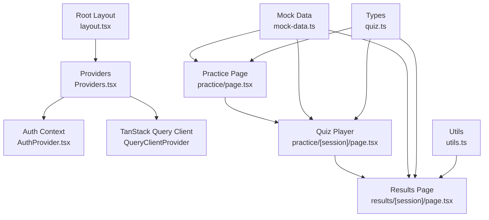

**Diagram sources**
- [layout.tsx:44-56](file://src/app/layout.tsx#L44-L56)
- [Providers.tsx:7-22](file://src/components/Providers.tsx#L7-L22)
- [AuthProvider.tsx:43-57](file://src/components/auth/AuthProvider.tsx#L43-L57)
- [practice/page.tsx:18-196](file://src/app/practice/page.tsx#L18-L196)
- [practice/[session]/page.tsx:25-352](file://src/app/practice/[session]/page.tsx#L25-L352)
- [results/[session]/page.tsx:28-315](file://src/app/results/[session]/page.tsx#L28-L315)
- [mock-data.ts:15-313](file://src/lib/mock-data.ts#L15-L313)
- [quiz.ts:5-107](file://src/types/quiz.ts#L5-L107)
- [utils.ts:1-34](file://src/lib/utils.ts#L1-L34)

**Section sources**
- [layout.tsx:44-56](file://src/app/layout.tsx#L44-L56)
- [Providers.tsx:7-22](file://src/components/Providers.tsx#L7-L22)

## Core Components
- Type system: Centralized TypeScript interfaces define Topics, Questions, Answers, Sessions, Weak topics, Study plans, Dashboard stats, Recent sessions, and User profiles. These types enforce consistent data contracts across pages and future API integrations.
- Global providers:
  - TanStack Query client configured with default caching and retry options
  - Toast provider for user feedback
  - Auth context provider exposing current user and loading state
- Feature pages:
  - Practice selection page filters topics and configures session parameters
  - Quiz player manages per-question state, timers, navigation, and answer submission
  - Results page computes metrics, reviews questions, and highlights weak spots

**Section sources**
- [quiz.ts:5-107](file://src/types/quiz.ts#L5-L107)
- [Providers.tsx:7-22](file://src/components/Providers.tsx#L7-L22)
- [AuthProvider.tsx:43-57](file://src/components/auth/AuthProvider.tsx#L43-L57)
- [practice/page.tsx:18-196](file://src/app/practice/page.tsx#L18-L196)
- [practice/[session]/page.tsx:25-352](file://src/app/practice/[session]/page.tsx#L25-L352)
- [results/[session]/page.tsx:28-315](file://src/app/results/[session]/page.tsx#L28-L315)

## Architecture Overview
The data flow follows a clear path:
- User selects a topic and configures session settings
- Quiz player renders questions from local or cached data, tracks answers locally
- On completion, results are computed locally and displayed; weak spot indicators are updated
- Future integration points:
  - Use TanStack Query to fetch topics/questions and persist sessions
  - Use optimistic updates for immediate UI feedback while requests complete
  - Persist sessions to IndexedDB or backend when offline

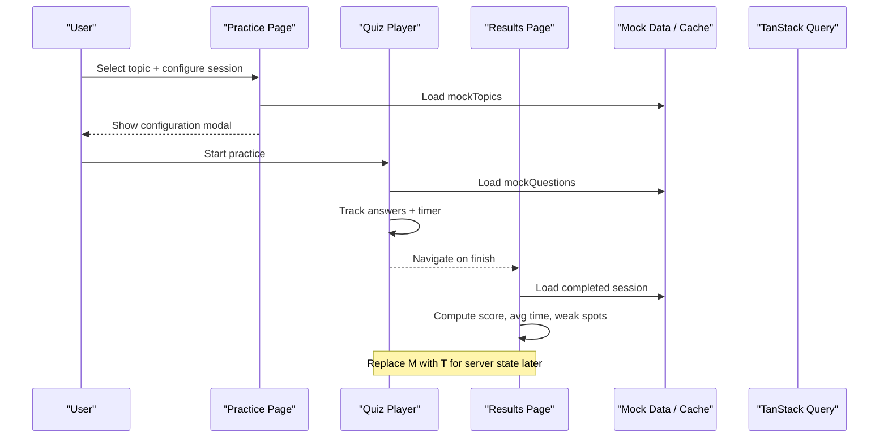

**Diagram sources**
- [practice/page.tsx:18-196](file://src/app/practice/page.tsx#L18-L196)
- [practice/[session]/page.tsx:25-352](file://src/app/practice/[session]/page.tsx#L25-L352)
- [results/[session]/page.tsx:28-315](file://src/app/results/[session]/page.tsx#L28-L315)
- [mock-data.ts:69-313](file://src/lib/mock-data.ts#L69-L313)
- [Providers.tsx:7-22](file://src/components/Providers.tsx#L7-L22)

## Detailed Component Analysis

### Type-Safe Data Models
The type system defines the canonical shapes for all domain entities:
- Topic: identifies chapters, categories, subtopic counts, accuracy, and weakness flags
- Question: includes text, options, correct answer, explanations in multiple languages, difficulty, and topic
- UserAnswer: captures selected option, correctness, and timing
- QuizSession: aggregates questions, answers, scoring, status, and metadata
- WeakTopic: tracks per-topic weakness metrics
- StudyPlan and StudyPlanDay: plan structure and daily tasks
- DashboardStats, RecentSession, UserProfile: analytics and profile data

These types ensure consistent data across UI components and future API payloads.

**Section sources**
- [quiz.ts:5-107](file://src/types/quiz.ts#L5-L107)

### Global State Providers
- TanStack Query:
  - Initialized once at the root with default query options including staleTime and retry
  - Provides caching and background refetch capabilities for server state
- Toast Provider:
  - Wraps children to enable toast notifications
- Auth Context:
  - Exposes current user and loading state
  - Currently uses a mock user for frontend-only development

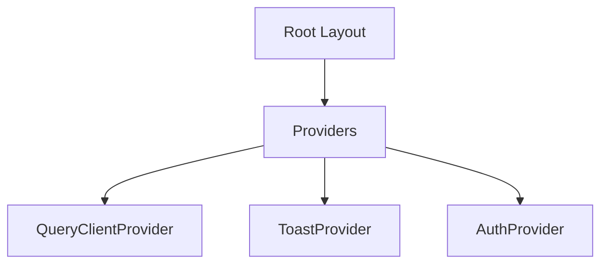

**Diagram sources**
- [layout.tsx:44-56](file://src/app/layout.tsx#L44-L56)
- [Providers.tsx:7-22](file://src/components/Providers.tsx#L7-L22)
- [AuthProvider.tsx:43-57](file://src/components/auth/AuthProvider.tsx#L43-L57)

**Section sources**
- [Providers.tsx:7-22](file://src/components/Providers.tsx#L7-L22)
- [AuthProvider.tsx:43-57](file://src/components/auth/AuthProvider.tsx#L43-L57)

### Practice Selection Flow
- Filters topics by category and search input
- Displays badges for weak topics and new topics
- Opens a configuration modal to choose difficulty and question count
- Uses mock topics for initial development

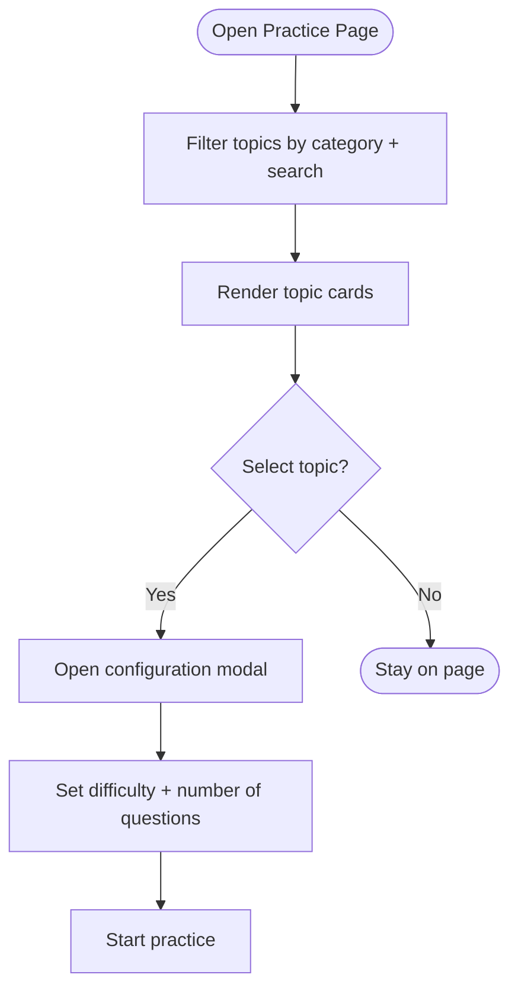

**Diagram sources**
- [practice/page.tsx:18-196](file://src/app/practice/page.tsx#L18-L196)
- [mock-data.ts:15-31](file://src/lib/mock-data.ts#L15-L31)

**Section sources**
- [practice/page.tsx:18-196](file://src/app/practice/page.tsx#L18-L196)
- [mock-data.ts:15-31](file://src/lib/mock-data.ts#L15-L31)

### Quiz Player Data Flow
- Loads questions from mock data
- Tracks per-question answer state and submission status
- Implements a 60-second timer per question
- Navigates between questions and handles exit confirmation
- Computes progress and displays feedback

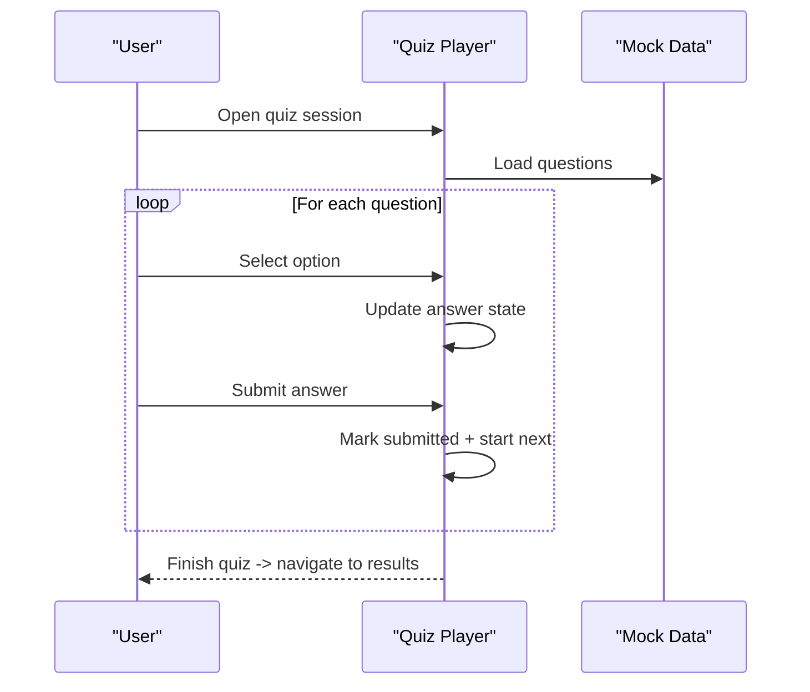

**Diagram sources**
- [practice/[session]/page.tsx:25-352](file://src/app/practice/[session]/page.tsx#L25-L352)
- [mock-data.ts:69-210](file://src/lib/mock-data.ts#L69-L210)

**Section sources**
- [practice/[session]/page.tsx:25-352](file://src/app/practice/[session]/page.tsx#L25-L352)
- [mock-data.ts:69-210](file://src/lib/mock-data.ts#L69-L210)

### Results Processing and Metrics
- Computes score percentage and grade label
- Counts correct, wrong, and skipped answers
- Calculates average time per question
- Reviews questions with filtering tabs
- Highlights weak spots and suggests next steps

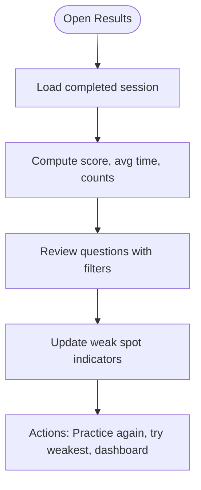

**Diagram sources**
- [results/[session]/page.tsx:28-315](file://src/app/results/[session]/page.tsx#L28-L315)
- [mock-data.ts:232-256](file://src/lib/mock-data.ts#L232-L256)
- [utils.ts:17-34](file://src/lib/utils.ts#L17-L34)

**Section sources**
- [results/[session]/page.tsx:28-315](file://src/app/results/[session]/page.tsx#L28-L315)
- [mock-data.ts:232-256](file://src/lib/mock-data.ts#L232-L256)
- [utils.ts:17-34](file://src/lib/utils.ts#L17-L34)

### Data Transformation Pipeline
- Input: User answers captured in the quiz player
- Transform:
  - Determine correctness by comparing selected answer to correct answer
  - Record time taken per question
  - Aggregate into a QuizSession with answers array
- Output:
  - Score calculation and percentage
  - Average time computation
  - Weak spot updates based on errors and attempts

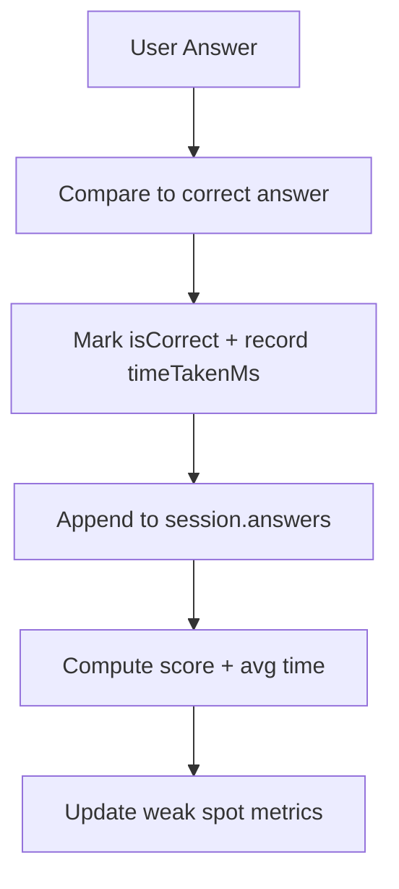

[No sources needed since this diagram shows conceptual workflow, not actual code structure]

### Adaptive Learning Algorithm
- Current implementation:
  - Weak spot tracking uses per-topic metrics (weaknessScore, errorCount, attemptCount)
  - Difficulty selection supports Mixed mode and per-session difficulty
- Proposed adaptive logic:
  - Increase difficulty if accuracy exceeds threshold
  - Decrease difficulty if accuracy falls below threshold
  - Prioritize weak topics in subsequent sessions
  - Adjust question mix based on recent performance

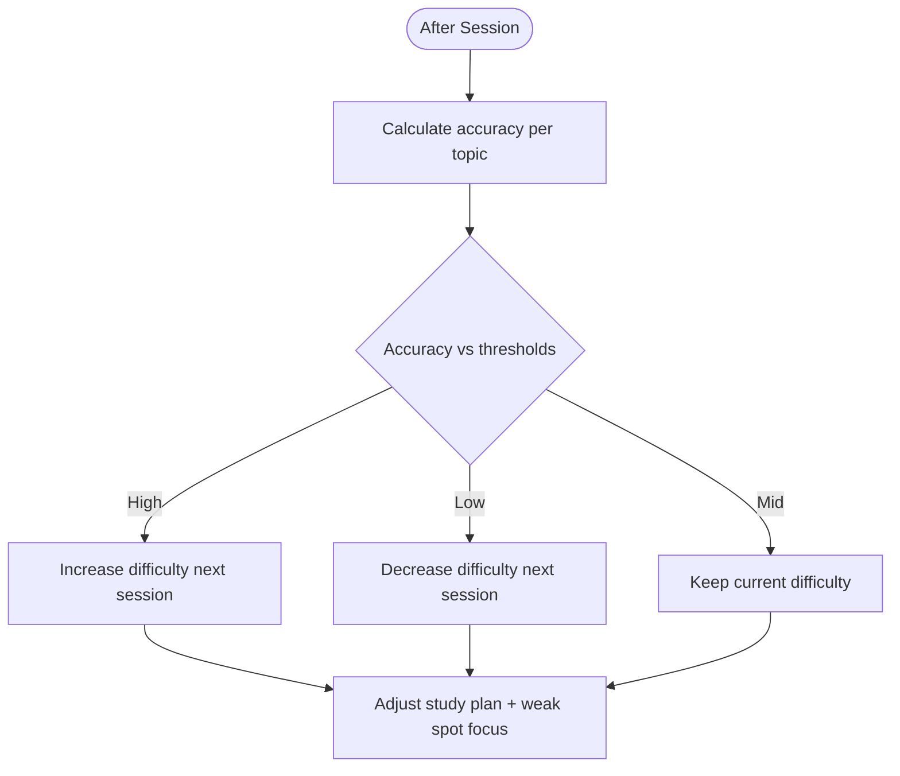

[No sources needed since this diagram shows conceptual workflow, not actual code structure]

### Caching Strategies, Optimistic Updates, Error Recovery
- Caching:
  - TanStack Query configured with default staleTime and retry
  - Ideal for topics, questions, and session data fetched from server
- Optimistic updates:
  - Immediately update UI with user actions (e.g., marking answers) before server confirmation
  - Roll back on failure to maintain consistency
- Error recovery:
  - Retry queries on transient failures
  - Provide fallback UI states (loading, empty, error)
  - Use toasts for actionable feedback

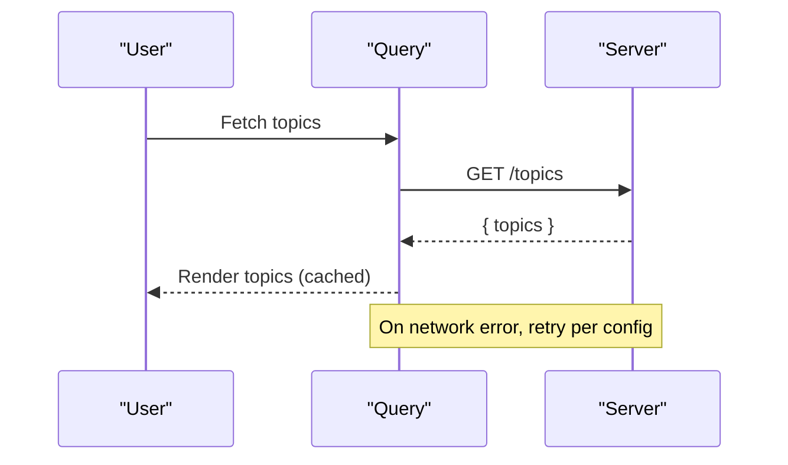

**Diagram sources**
- [Providers.tsx:7-22](file://src/components/Providers.tsx#L7-L22)

**Section sources**
- [Providers.tsx:7-22](file://src/components/Providers.tsx#L7-L22)

### Client-Server Synchronization and Offline Support
- Synchronization:
  - Use TanStack Query to keep local cache aligned with server state
  - Invalidate or refetch caches after mutations (e.g., saving session results)
- Offline considerations:
  - Persist sessions locally (IndexedDB or localStorage) when offline
  - Queue mutations and replay when connectivity resumes
  - Display offline banners and disable non-critical features

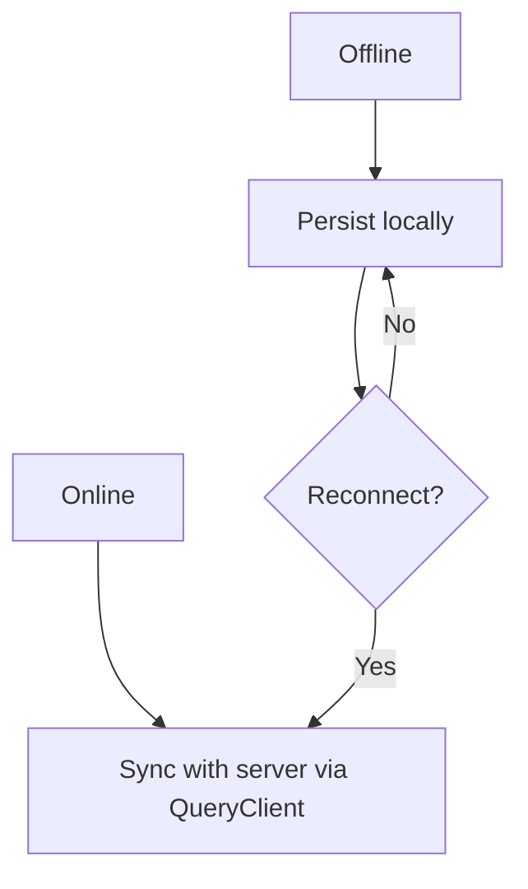

[No sources needed since this diagram shows conceptual workflow, not actual code structure]

## Dependency Analysis
- Pages depend on:
  - Types for data contracts
  - Mock data for development
  - UI components for rendering
  - Utils for formatting and styling
- Providers wrap the app to supply global services
- Auth context provides user identity for protected routes

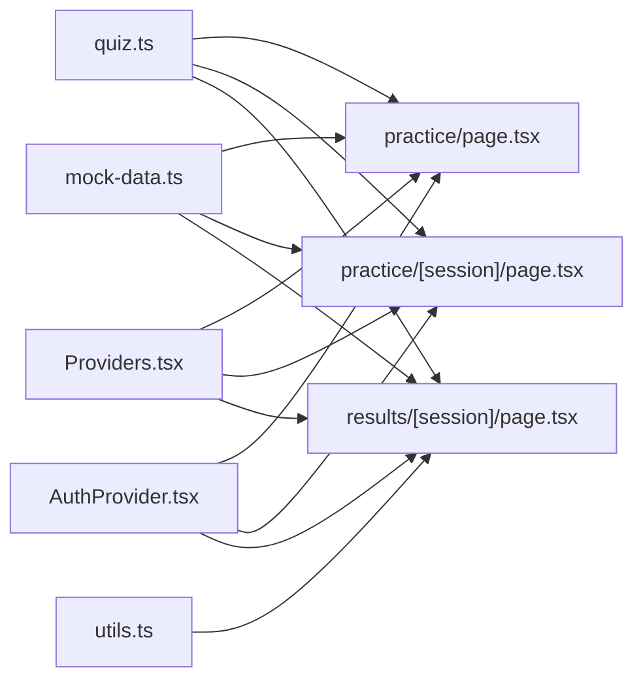

**Diagram sources**
- [quiz.ts:5-107](file://src/types/quiz.ts#L5-L107)
- [mock-data.ts:15-313](file://src/lib/mock-data.ts#L15-L313)
- [utils.ts:1-34](file://src/lib/utils.ts#L1-L34)
- [Providers.tsx:7-22](file://src/components/Providers.tsx#L7-L22)
- [AuthProvider.tsx:43-57](file://src/components/auth/AuthProvider.tsx#L43-L57)
- [practice/page.tsx:18-196](file://src/app/practice/page.tsx#L18-L196)
- [practice/[session]/page.tsx:25-352](file://src/app/practice/[session]/page.tsx#L25-L352)
- [results/[session]/page.tsx:28-315](file://src/app/results/[session]/page.tsx#L28-L315)

**Section sources**
- [quiz.ts:5-107](file://src/types/quiz.ts#L5-L107)
- [mock-data.ts:15-313](file://src/lib/mock-data.ts#L15-L313)
- [utils.ts:1-34](file://src/lib/utils.ts#L1-L34)
- [Providers.tsx:7-22](file://src/components/Providers.tsx#L7-L22)
- [AuthProvider.tsx:43-57](file://src/components/auth/AuthProvider.tsx#L43-L57)
- [practice/page.tsx:18-196](file://src/app/practice/page.tsx#L18-L196)
- [practice/[session]/page.tsx:25-352](file://src/app/practice/[session]/page.tsx#L25-L352)
- [results/[session]/page.tsx:28-315](file://src/app/results/[session]/page.tsx#L28-L315)

## Performance Considerations
- Minimize re-renders by keeping answer state localized per question
- Use memoization for expensive computations (e.g., filtered lists)
- Leverage TanStack Query caching to avoid redundant network calls
- Debounce search inputs to reduce filter recalculations
- Avoid heavy operations in render paths; compute metrics off the critical path

## Troubleshooting Guide
- Timer issues:
  - Ensure intervals are cleared when navigating away or answering
  - Reset timer on question change
- Navigation pitfalls:
  - Guard against premature navigation until answers are submitted
  - Confirm exit to prevent accidental data loss
- Data mismatches:
  - Validate that answers align with question IDs
  - Ensure correct answer comparison logic matches type constraints
- UI feedback:
  - Use toasts to inform users of success or errors
  - Provide clear states for loading, empty, and error conditions

**Section sources**
- [practice/[session]/page.tsx:42-86](file://src/app/practice/[session]/page.tsx#L42-L86)
- [practice/[session]/page.tsx:319-348](file://src/app/practice/[session]/page.tsx#L319-L348)
- [results/[session]/page.tsx:34-55](file://src/app/results/[session]/page.tsx#L34-L55)

## Conclusion
MedAce AI establishes a robust foundation for data-driven adaptive learning:
- Strong type safety ensures consistency across the application
- Clear separation of concerns between UI state and server state
- Extensible architecture ready for TanStack Query integration and backend sync
- Well-defined pipelines for processing answers, computing metrics, and updating weak spots
- Patterns for caching, optimistic updates, and error recovery support scalable growth