# Data Flow Patterns

<cite>
**Referenced Files in This Document**
- [api-client.ts](file://src/lib/api-client.ts)
- [Providers.tsx](file://src/components/Providers.tsx)
- [AuthProvider.tsx](file://src/components/auth/AuthProvider.tsx)
- [schemas.ts](file://src/lib/validations/schemas.ts)
- [quiz.ts](file://src/types/quiz.ts)
- [route.ts (generate)](file://src/app/api/quiz/generate/route.ts)
- [route.ts (submit)](file://src/app/api/quiz/submit/route.ts)
- [route.ts (explain)](file://src/app/api/quiz/explain/route.ts)
- [route.ts (dashboard stats)](file://src/app/api/dashboard/stats/route.ts)
- [route.ts (study plan)](file://src/app/api/study-plan/generate/route.ts)
- [textbook-reader.ts](file://src/lib/textbook-reader.ts)
- [progress-tracker.ts](file://src/lib/progress-tracker.ts)
- [schema.sql](file://supabase/schema.sql)
</cite>

## Table of Contents
1. Introduction
2. Project Structure
3. Core Components
4. Architecture Overview
5. Detailed Component Analysis
6. Dependency Analysis
7. Performance Considerations
8. Troubleshooting Guide
9. Conclusion

## Introduction
This document explains MedAce-AI’s data flow patterns across client, server, and database layers. It covers:
- Client-server communication using TanStack Query for server state management and caching
- Real-time synchronization with Supabase backend services
- RAG pipeline from textbook ingestion to vector embedding and AI-powered question generation
- Progress tracking data flow including user interactions, metrics calculation, and analytics aggregation
- Error handling and retry mechanisms for failed API calls
- State management combining local component state, React Context for global state, and Tanstack Query for server state
- Data validation flows using Zod schemas at client and server boundaries
- Data persistence strategies including local storage for offline support and database synchronization patterns

## Project Structure
MedAce-AI is a Next.js application with:
- Client-side providers for TanStack Query and authentication context
- API routes for quiz generation, submission, explanation, dashboard stats, and study plan generation
- Server utilities for Supabase clients and admin access
- Local libraries for progress tracking, textbook reading, and validations
- A PostgreSQL schema with vector search support for RAG

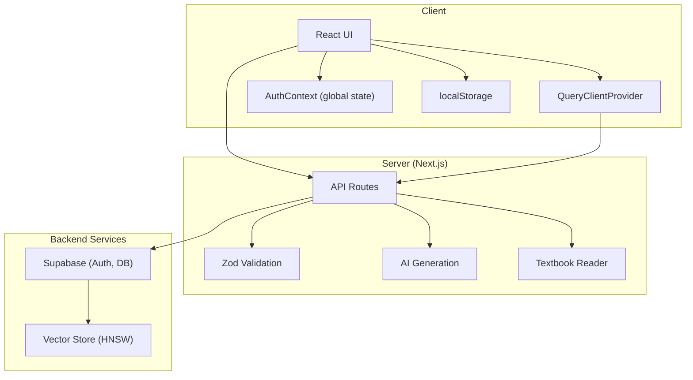

**Diagram sources**
- [Providers.tsx:7-20](file://src/components/Providers.tsx#L7-L20)
- [AuthProvider.tsx:43-208](file://src/components/auth/AuthProvider.tsx#L43-L208)
- [route.ts (generate):10-196](file://src/app/api/quiz/generate/route.ts#L10-L196)
- [route.ts (submit):6-141](file://src/app/api/quiz/submit/route.ts#L6-L141)
- [route.ts (dashboard stats):6-181](file://src/app/api/dashboard/stats/route.ts#L6-L181)
- [schema.sql:26-44](file://supabase/schema.sql#L26-L44)

**Section sources**
- [Providers.tsx:7-20](file://src/components/Providers.tsx#L7-L20)
- [AuthProvider.tsx:43-208](file://src/components/auth/AuthProvider.tsx#L43-L208)
- [schema.sql:26-44](file://supabase/schema.sql#L26-L44)

## Core Components
- Client API client: Centralized fetch wrappers for quiz generation, submission, explanation, dashboard stats, and study plan generation with error propagation.
- TanStack Query provider: Configures default query options such as staleTime and retry behavior.
- Authentication context: Manages global user state, persists session locally, and listens to auth state changes.
- Validation layer: Zod schemas enforce request payloads on the server side; types define contracts between client and server.
- RAG pipeline: Reads textbook content, optionally enhances via vector similarity search, and prompts AI to generate questions or explanations.
- Progress tracker: Computes performance metrics from local history or provided sessions, including streaks, accuracy, weak topics, and chapter performance.
- Database schema: Defines tables for profiles, textbook chunks, quiz sessions/questions/responses, study plans, and an RPC function for vector similarity search.

**Section sources**
- [api-client.ts:45-132](file://src/lib/api-client.ts#L45-L132)
- [Providers.tsx:7-20](file://src/components/Providers.tsx#L7-L20)
- [AuthProvider.tsx:43-208](file://src/components/auth/AuthProvider.tsx#L43-L208)
- [schemas.ts:1-48](file://src/lib/validations/schemas.ts#L1-L48)
- [quiz.ts:15-107](file://src/types/quiz.ts#L15-L107)
- [textbook-reader.ts:9-46](file://src/lib/textbook-reader.ts#L9-L46)
- [progress-tracker.ts:12-192](file://src/lib/progress-tracker.ts#L12-L192)
- [schema.sql:10-109](file://supabase/schema.sql#L10-L109)

## Architecture Overview
The system follows a layered architecture:
- Client layer: React components consume APIs via a typed client and manage UI state. TanStack Query caches server responses and handles retries.
- Server layer: Next.js API routes validate inputs, orchestrate AI generation, read textbooks, and persist data to Supabase.
- Backend layer: Supabase provides authentication, relational data, and vector search through an HNSW index and an RPC function.

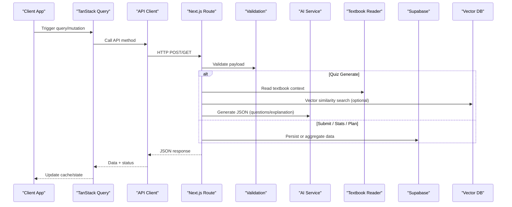

**Diagram sources**
- [api-client.ts:45-132](file://src/lib/api-client.ts#L45-L132)
- [route.ts (generate):10-196](file://src/app/api/quiz/generate/route.ts#L10-L196)
- [route.ts (submit):6-141](file://src/app/api/quiz/submit/route.ts#L6-L141)
- [route.ts (dashboard stats):6-181](file://src/app/api/dashboard/stats/route.ts#L6-L181)
- [route.ts (study plan):8-123](file://src/app/api/study-plan/generate/route.ts#L8-L123)
- [schema.sql:116-150](file://supabase/schema.sql#L116-L150)

## Detailed Component Analysis

### Client-Server Communication and Caching Strategy
- The API client encapsulates all HTTP calls with typed parameters and returns, centralizing error handling by throwing errors when responses are not ok.
- TanStack Query is configured with a default stale time and retry count, enabling automatic background refetching and limited retries on failures.
- Components should use queries for GET endpoints (e.g., dashboard stats) and mutations for POST endpoints (e.g., generate quiz, submit answers).

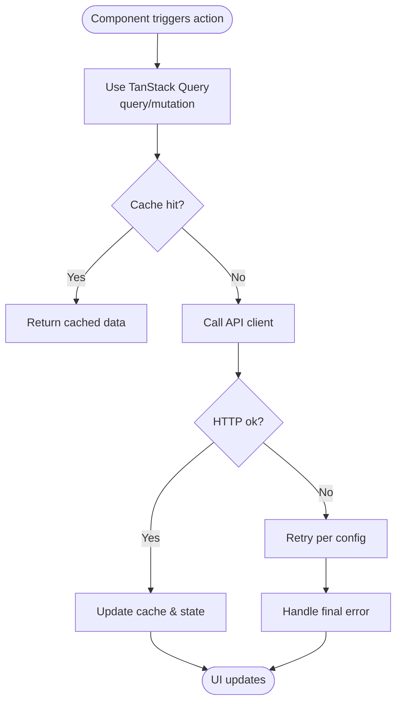

**Diagram sources**
- [Providers.tsx:7-20](file://src/components/Providers.tsx#L7-L20)
- [api-client.ts:45-132](file://src/lib/api-client.ts#L45-L132)

**Section sources**
- [Providers.tsx:7-20](file://src/components/Providers.tsx#L7-L20)
- [api-client.ts:45-132](file://src/lib/api-client.ts#L45-L132)

### Real-Time Data Synchronization with Supabase
- Authentication state is managed via a React Context that subscribes to Supabase auth events, updating global user state and persisting session locally.
- Server routes use a server-side Supabase client to authenticate requests and perform operations under Row Level Security policies defined in the schema.
- While real-time subscriptions are available in Supabase, current routes primarily rely on request/response flows; future enhancements can add real-time listeners for live updates.

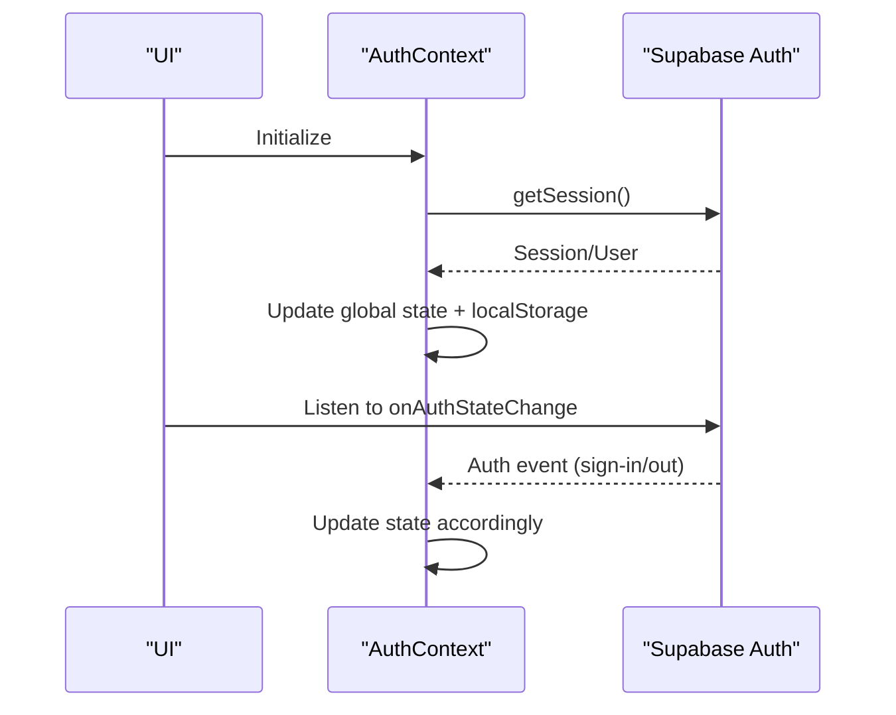

**Diagram sources**
- [AuthProvider.tsx:114-200](file://src/components/auth/AuthProvider.tsx#L114-L200)
- [schema.sql:155-229](file://supabase/schema.sql#L155-L229)

**Section sources**
- [AuthProvider.tsx:114-200](file://src/components/auth/AuthProvider.tsx#L114-L200)
- [schema.sql:155-229](file://supabase/schema.sql#L155-L229)

### RAG Pipeline Data Flow
- Textbook ingestion: Chapter text files are read and optionally chunked into a vector store with embeddings.
- Question generation: The route reads textbook context, performs optional vector similarity search to enrich context, then prompts AI to generate structured JSON questions.
- Explanation generation: Similar flow uses vector search to retrieve relevant context and generates bilingual explanations.

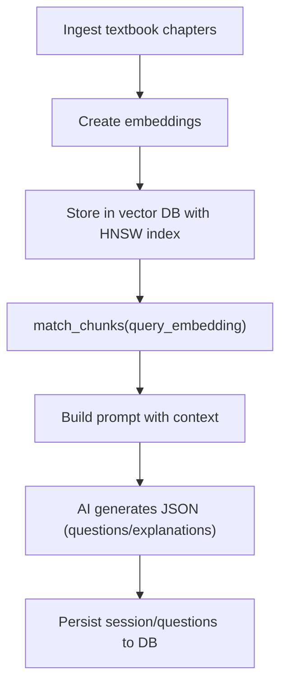

**Diagram sources**
- [textbook-reader.ts:9-46](file://src/lib/textbook-reader.ts#L9-L46)
- [route.ts (generate):29-171](file://src/app/api/quiz/generate/route.ts#L29-L171)
- [route.ts (explain):20-70](file://src/app/api/quiz/explain/route.ts#L20-L70)
- [schema.sql:26-44](file://supabase/schema.sql#L26-L44)
- [schema.sql:116-150](file://supabase/schema.sql#L116-L150)

**Section sources**
- [textbook-reader.ts:9-46](file://src/lib/textbook-reader.ts#L9-L46)
- [route.ts (generate):29-171](file://src/app/api/quiz/generate/route.ts#L29-L171)
- [route.ts (explain):20-70](file://src/app/api/quiz/explain/route.ts#L20-L70)
- [schema.sql:26-44](file://supabase/schema.sql#L26-L44)
- [schema.sql:116-150](file://supabase/schema.sql#L116-L150)

### Progress Tracking Data Flow
- User interactions: Each quiz submission records answers and timing; sessions are marked completed and scores updated.
- Metrics calculation: The progress tracker aggregates sessions to compute total questions, weekly activity, accuracy rate, study streak, weak topics, and chapter performance.
- Analytics aggregation: Dashboard stats route aggregates recent sessions, computes weekly questions, identifies weak topics from responses, and builds profile insights.

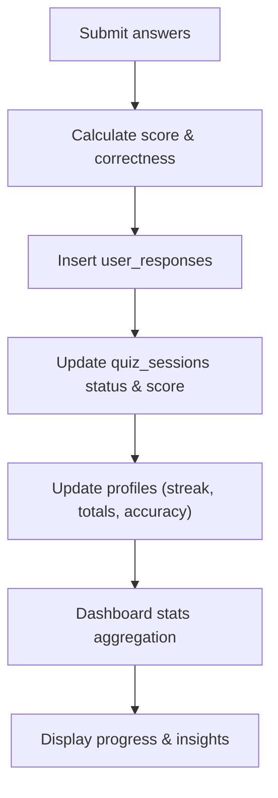

**Diagram sources**
- [route.ts (submit):20-123](file://src/app/api/quiz/submit/route.ts#L20-L123)
- [progress-tracker.ts:37-192](file://src/lib/progress-tracker.ts#L37-L192)
- [route.ts (dashboard stats):58-165](file://src/app/api/dashboard/stats/route.ts#L58-L165)

**Section sources**
- [route.ts (submit):20-123](file://src/app/api/quiz/submit/route.ts#L20-L123)
- [progress-tracker.ts:37-192](file://src/lib/progress-tracker.ts#L37-L192)
- [route.ts (dashboard stats):58-165](file://src/app/api/dashboard/stats/route.ts#L58-L165)

### Error Handling and Retry Mechanisms
- API client throws errors when responses are not ok, propagating structured error messages to callers.
- TanStack Query default retry configuration allows limited retries on failed queries; components can handle errors via query states.
- Server routes return standardized error objects with status codes for invalid payloads or internal errors.

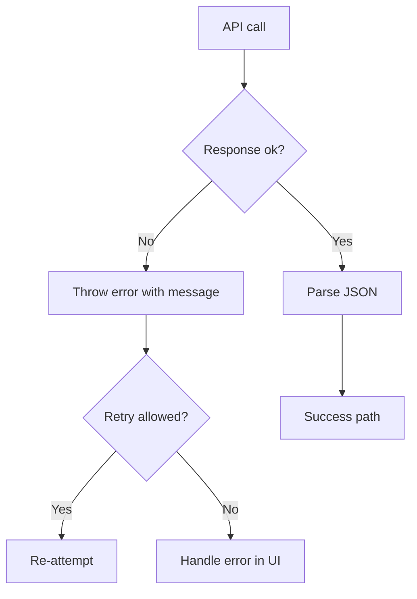

**Diagram sources**
- [api-client.ts:45-132](file://src/lib/api-client.ts#L45-L132)
- [Providers.tsx:7-20](file://src/components/Providers.tsx#L7-L20)
- [route.ts (generate):188-196](file://src/app/api/quiz/generate/route.ts#L188-L196)
- [route.ts (submit):133-141](file://src/app/api/quiz/submit/route.ts#L133-L141)
- [route.ts (dashboard stats):173-181](file://src/app/api/dashboard/stats/route.ts#L173-L181)

**Section sources**
- [api-client.ts:45-132](file://src/lib/api-client.ts#L45-L132)
- [Providers.tsx:7-20](file://src/components/Providers.tsx#L7-L20)
- [route.ts (generate):188-196](file://src/app/api/quiz/generate/route.ts#L188-L196)
- [route.ts (submit):133-141](file://src/app/api/quiz/submit/route.ts#L133-L141)
- [route.ts (dashboard stats):173-181](file://src/app/api/dashboard/stats/route.ts#L173-L181)

### State Management Approach
- Local component state: Used within components for transient UI state (e.g., form inputs, loading flags).
- React Context for global state: AuthContext manages user identity, loading state, sign-out actions, and persists session to localStorage.
- TanStack Query for server state: Provides caching, background refetching, and retry behavior for API data.

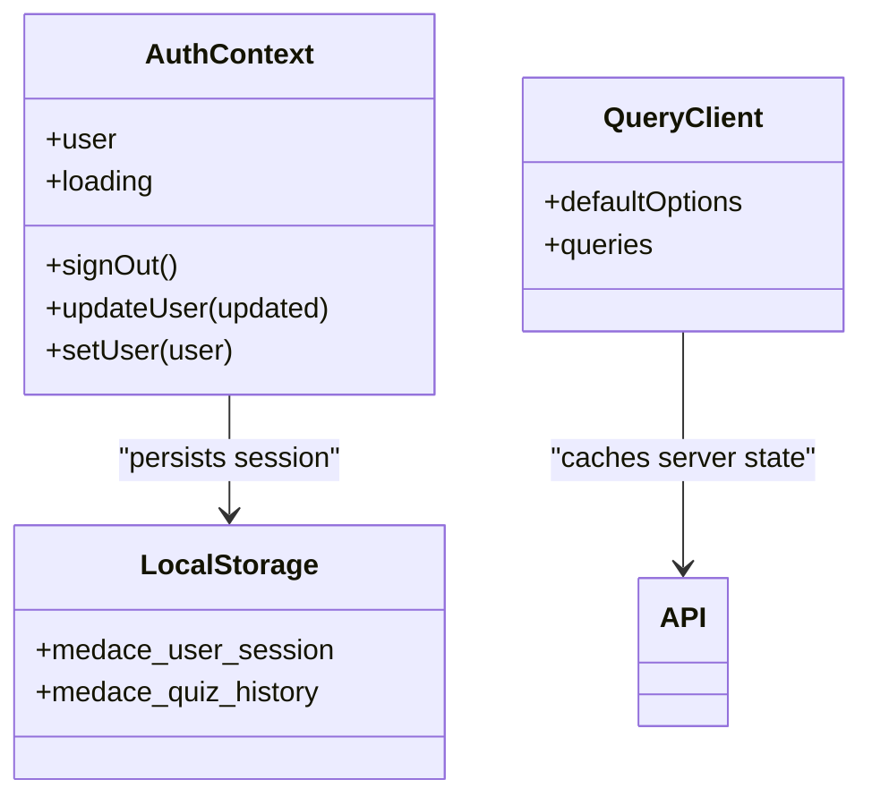

**Diagram sources**
- [AuthProvider.tsx:21-89](file://src/components/auth/AuthProvider.tsx#L21-L89)
- [Providers.tsx:7-20](file://src/components/Providers.tsx#L7-L20)
- [progress-tracker.ts:12-35](file://src/lib/progress-tracker.ts#L12-L35)

**Section sources**
- [AuthProvider.tsx:21-89](file://src/components/auth/AuthProvider.tsx#L21-L89)
- [Providers.tsx:7-20](file://src/components/Providers.tsx#L7-L20)
- [progress-tracker.ts:12-35](file://src/lib/progress-tracker.ts#L12-L35)

### Data Validation Flows Using Zod
- Server-side validation: All API routes validate incoming payloads using Zod schemas before processing, returning detailed error formats on failure.
- Type safety: Shared TypeScript interfaces define contracts for sessions, questions, answers, and dashboards, ensuring consistency across client and server.

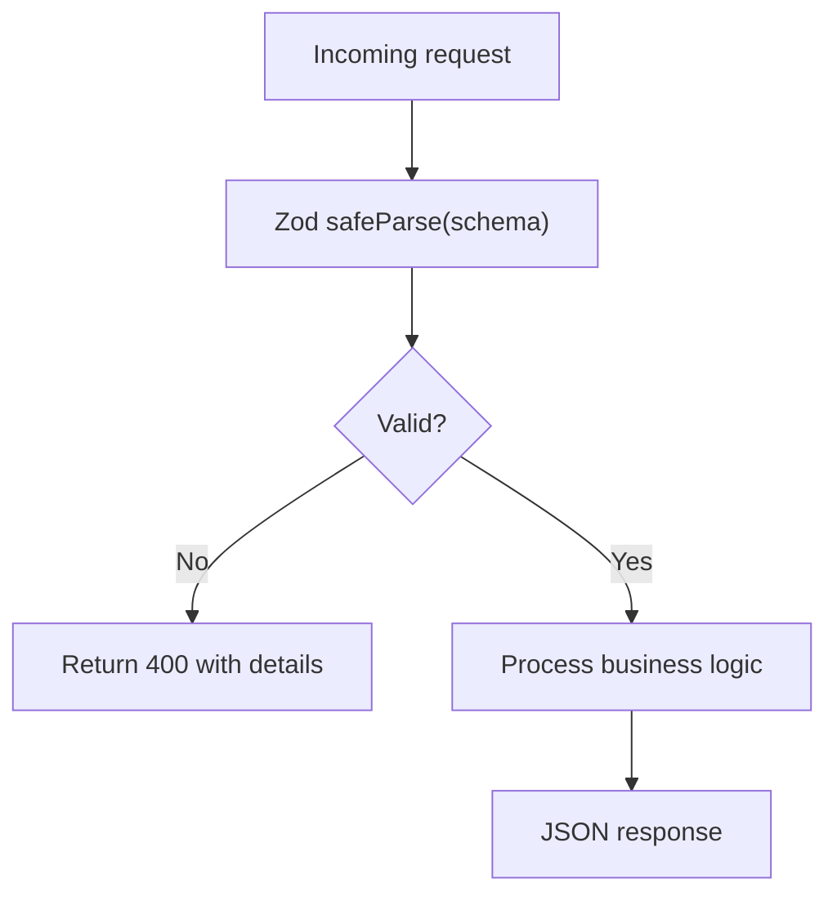

**Diagram sources**
- [schemas.ts:1-48](file://src/lib/validations/schemas.ts#L1-L48)
- [route.ts (generate):10-23](file://src/app/api/quiz/generate/route.ts#L10-L23)
- [route.ts (submit):6-18](file://src/app/api/quiz/submit/route.ts#L6-L18)
- [route.ts (explain):6-18](file://src/app/api/quiz/explain/route.ts#L6-L18)
- [route.ts (study plan):8-20](file://src/app/api/study-plan/generate/route.ts#L8-L20)

**Section sources**
- [schemas.ts:1-48](file://src/lib/validations/schemas.ts#L1-L48)
- [route.ts (generate):10-23](file://src/app/api/quiz/generate/route.ts#L10-L23)
- [route.ts (submit):6-18](file://src/app/api/quiz/submit/route.ts#L6-L18)
- [route.ts (explain):6-18](file://src/app/api/quiz/explain/route.ts#L6-L18)
- [route.ts (study plan):8-20](file://src/app/api/study-plan/generate/route.ts#L8-L20)

### Data Persistence Strategies
- Local storage: Stores quiz history and active study plans for offline support and quick access.
- Database synchronization: On authenticated requests, sessions, questions, responses, and study plans are persisted to Supabase; profiles track streaks and overall accuracy.
- Vector store: Textbook chunks with embeddings enable semantic search for RAG pipelines.

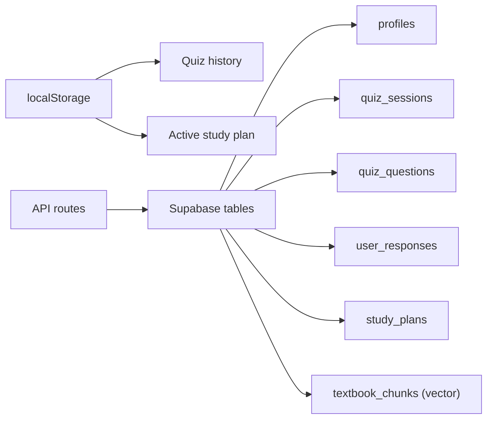

**Diagram sources**
- [progress-tracker.ts:12-35](file://src/lib/progress-tracker.ts#L12-L35)
- [route.ts (submit):52-123](file://src/app/api/quiz/submit/route.ts#L52-L123)
- [route.ts (dashboard stats):51-165](file://src/app/api/dashboard/stats/route.ts#L51-L165)
- [route.ts (study plan):94-112](file://src/app/api/study-plan/generate/route.ts#L94-L112)
- [schema.sql:10-109](file://supabase/schema.sql#L10-L109)

**Section sources**
- [progress-tracker.ts:12-35](file://src/lib/progress-tracker.ts#L12-L35)
- [route.ts (submit):52-123](file://src/app/api/quiz/submit/route.ts#L52-L123)
- [route.ts (dashboard stats):51-165](file://src/app/api/dashboard/stats/route.ts#L51-L165)
- [route.ts (study plan):94-112](file://src/app/api/study-plan/generate/route.ts#L94-L112)
- [schema.sql:10-109](file://supabase/schema.sql#L10-L109)

## Dependency Analysis
Key dependencies and relationships:
- Client depends on API client and TanStack Query for data fetching and caching.
- API routes depend on validation schemas, AI generation utilities, textbook reader, and Supabase clients.
- Database schema defines entities and vector search capabilities used by RAG flows.

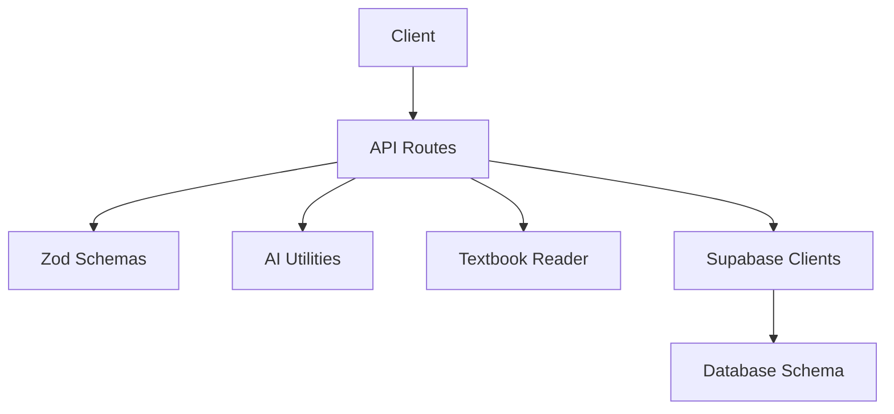

**Diagram sources**
- [api-client.ts:45-132](file://src/lib/api-client.ts#L45-L132)
- [schemas.ts:1-48](file://src/lib/validations/schemas.ts#L1-L48)
- [route.ts (generate):10-196](file://src/app/api/quiz/generate/route.ts#L10-L196)
- [schema.sql:26-44](file://supabase/schema.sql#L26-L44)

**Section sources**
- [api-client.ts:45-132](file://src/lib/api-client.ts#L45-L132)
- [schemas.ts:1-48](file://src/lib/validations/schemas.ts#L1-L48)
- [route.ts (generate):10-196](file://src/app/api/quiz/generate/route.ts#L10-L196)
- [schema.sql:26-44](file://supabase/schema.sql#L26-L44)

## Performance Considerations
- Caching: Configure appropriate stale times to balance freshness and network load.
- Retries: Limit retries to avoid cascading failures; implement exponential backoff if needed.
- Vector search: Use HNSW indexes for fast cosine similarity queries; tune thresholds and match counts.
- Aggregation: Optimize dashboard stats queries by leveraging indexes and limiting result sets.

[No sources needed since this section provides general guidance]

## Troubleshooting Guide
Common issues and resolutions:
- Invalid payloads: Check Zod validation errors returned by API routes and adjust client inputs accordingly.
- Network errors: Inspect TanStack Query retry settings and ensure proper error handling in components.
- Authentication problems: Verify Supabase configuration and session persistence; check auth state changes in the context.
- Vector search failures: Ensure embeddings exist and match_chunks RPC is configured; fallback to textbook context when unavailable.

**Section sources**
- [schemas.ts:1-48](file://src/lib/validations/schemas.ts#L1-L48)
- [Providers.tsx:7-20](file://src/components/Providers.tsx#L7-L20)
- [AuthProvider.tsx:114-200](file://src/components/auth/AuthProvider.tsx#L114-L200)
- [route.ts (generate):29-49](file://src/app/api/quiz/generate/route.ts#L29-L49)

## Conclusion
MedAce-AI implements a robust data flow pattern combining client-side caching, server-side validation, AI-driven content generation, and persistent analytics. The RAG pipeline leverages vector search to enhance contextual relevance, while progress tracking and dashboard aggregation provide actionable insights. Error handling and retry mechanisms ensure resilience, and local storage supports offline experiences. Future enhancements can introduce real-time subscriptions for live updates and further optimize performance through advanced caching and query tuning.