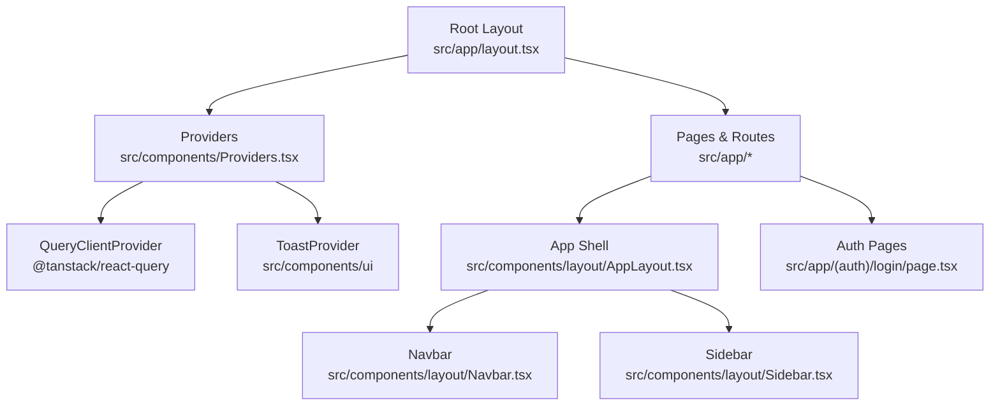
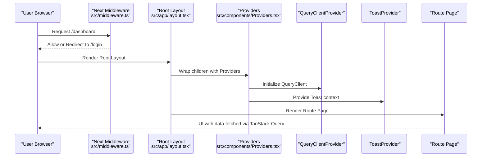
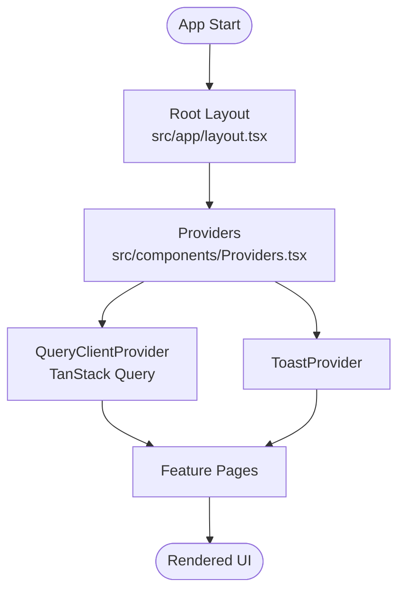
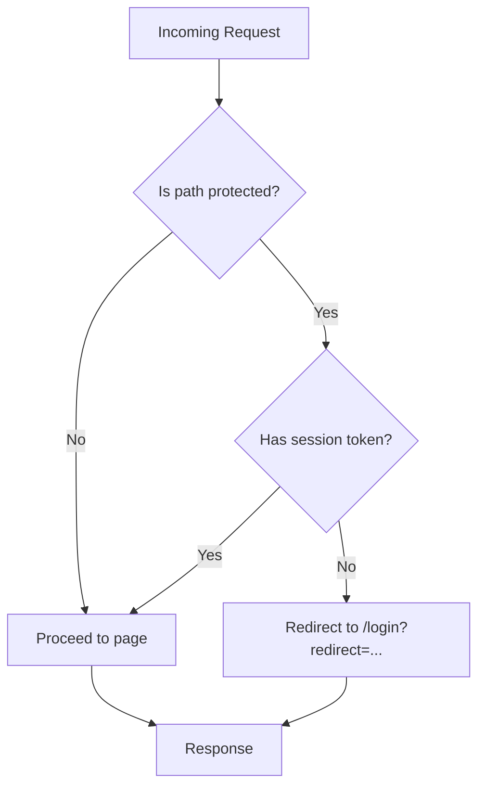
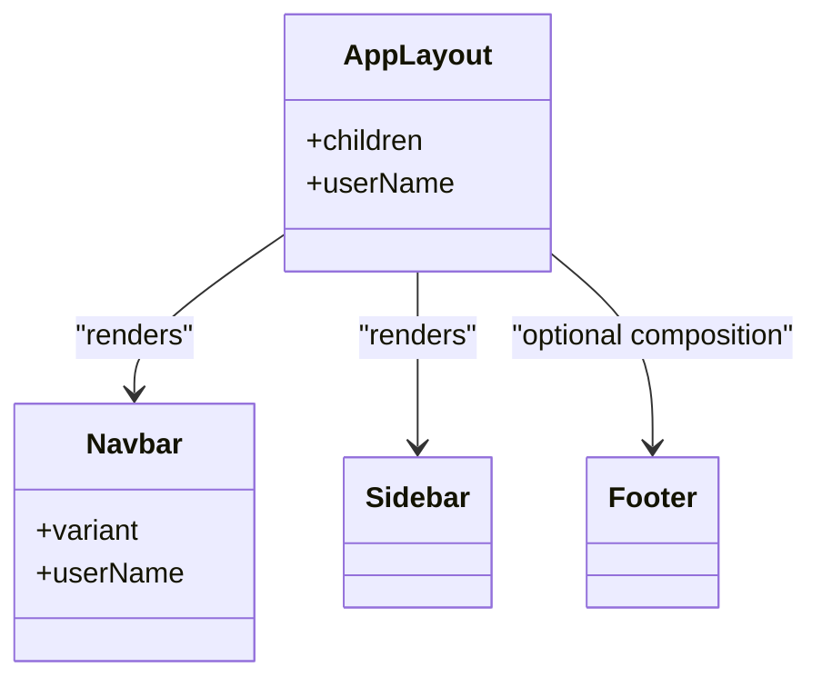
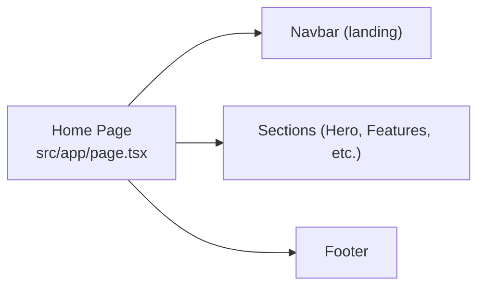
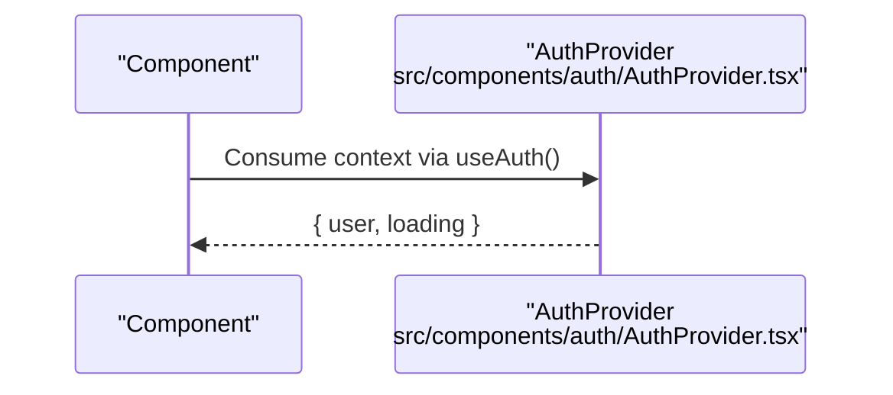
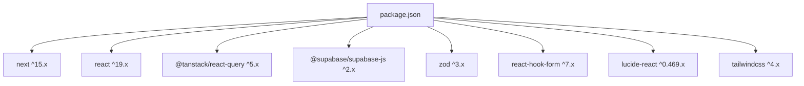

# Frontend Architecture

<cite>
**Referenced Files in This Document**
- [layout.tsx](file://src/app/layout.tsx)
- [Providers.tsx](file://src/components/Providers.tsx)
- [middleware.ts](file://src/middleware.ts)
- [next.config.ts](file://next.config.ts)
- [package.json](file://package.json)
- [AppLayout.tsx](file://src/components/layout/AppLayout.tsx)
- [Navbar.tsx](file://src/components/layout/Navbar.tsx)
- [Sidebar.tsx](file://src/components/layout/Sidebar.tsx)
- [Footer.tsx](file://src/components/layout/Footer.tsx)
- [page.tsx](file://src/app/page.tsx)
- [AuthProvider.tsx](file://src/components/auth/AuthProvider.tsx)
- [login page.tsx](file://src/app/(auth)/login/page.tsx)
- [utils.ts](file://src/lib/utils.ts)
- [tsconfig.json](file://tsconfig.json)
</cite>

## Table of Contents
1. Introduction
2. Project Structure
3. Core Components
4. Architecture Overview
5. Detailed Component Analysis
6. Dependency Analysis
7. Performance Considerations
8. Troubleshooting Guide
9. Conclusion

## Introduction
This document explains MedAce AI’s frontend architecture built on Next.js 15 with React 19. It covers the App Router structure, server vs client component strategy, provider pattern implementation, middleware-based authentication flow and route protection, global state management via TanStack Query, the layout system (Navbar, Sidebar, Footer), performance optimizations (code splitting, image optimization, font loading), TypeScript integration patterns, and error boundary considerations.

## Project Structure
The application uses the Next.js App Router under src/app:
- Root layout at src/app/layout.tsx sets metadata, fonts, and wraps content with Providers.
- Feature routes are organized as folders: dashboard, practice, results, study-plan, profile, and an auth group under (auth).
- Shared UI components live under src/components/ui; layout shell components under src/components/layout; providers and context under src/components.
- Middleware is defined at src/middleware.ts for route protection.
- Build and runtime configuration is in next.config.ts and package.json.

**Diagram sources**
- [layout.tsx:1-57](file://src/app/layout.tsx#L1-L57)
- [Providers.tsx:1-23](file://src/components/Providers.tsx#L1-L23)
- [AppLayout.tsx:1-25](file://src/components/layout/AppLayout.tsx#L1-L25)
- [Navbar.tsx:1-162](file://src/components/layout/Navbar.tsx#L1-L162)
- [Sidebar.tsx:1-74](file://src/components/layout/Sidebar.tsx#L1-L74)
- [login page.tsx:1-91](file://src/app/(auth)/login/page.tsx#L1-L91)

**Section sources**
- [layout.tsx:1-57](file://src/app/layout.tsx#L1-L57)
- [package.json:1-42](file://package.json#L1-L42)

## Core Components
- Root layout defines global metadata, imports Inter font with variable injection, and renders Providers around children.
- Providers is a client component that initializes a TanStack Query client with default options and provides it globally, along with ToastProvider for notifications.
- AppLayout composes Navbar and Sidebar to form the app shell for authenticated sections.
- Navbar supports landing and app variants, active route highlighting, and mobile menu.
- Sidebar provides navigation links with active state detection.
- Footer contains branding and quick links.

Key responsibilities:
- Global setup: metadata, fonts, providers.
- Data layer: TanStack Query client initialization and caching defaults.
- UI shell: consistent header/sidebar/main area across app pages.
- Auth UI: login/signup pages using shared UI primitives.

**Section sources**
- [layout.tsx:1-57](file://src/app/layout.tsx#L1-L57)
- [Providers.tsx:1-23](file://src/components/Providers.tsx#L1-L23)
- [AppLayout.tsx:1-25](file://src/components/layout/AppLayout.tsx#L1-L25)
- [Navbar.tsx:1-162](file://src/components/layout/Navbar.tsx#L1-L162)
- [Sidebar.tsx:1-74](file://src/components/layout/Sidebar.tsx#L1-L74)
- [Footer.tsx:1-35](file://src/components/layout/Footer.tsx#L1-L35)

## Architecture Overview
The architecture follows Next.js App Router conventions:
- Server-rendered root layout and pages by default.
- Client components marked with "use client" for interactivity (e.g., Providers, Navbar, Sidebar).
- Middleware enforces route protection rules before rendering.
- Providers wrap the tree to supply data fetching and UI contexts.

**Diagram sources**
- [middleware.ts:1-41](file://src/middleware.ts#L1-L41)
- [layout.tsx:1-57](file://src/app/layout.tsx#L1-L57)
- [Providers.tsx:1-23](file://src/components/Providers.tsx#L1-L23)

## Detailed Component Analysis

### Root Layout and Providers Pattern
- Root layout sets language, direction, CSS variables, and injects Inter font via a CSS variable for Tailwind usage.
- Providers creates a stable QueryClient instance and configures default query behavior such as stale time and retry count.
- ToastProvider is layered to enable global toast notifications throughout the app.

**Diagram sources**
- [layout.tsx:1-57](file://src/app/layout.tsx#L1-L57)
- [Providers.tsx:1-23](file://src/components/Providers.tsx#L1-L23)

**Section sources**
- [layout.tsx:1-57](file://src/app/layout.tsx#L1-L57)
- [Providers.tsx:1-23](file://src/components/Providers.tsx#L1-L23)

### Middleware-Based Authentication and Route Protection
- The middleware defines protected and public routes. Protected routes include dashboard, practice, results, study-plan, and profile.
- For production readiness, the middleware checks for an access token cookie and redirects unauthenticated users to login with a redirect parameter. Currently, all routes pass through for frontend-only development.
- Matcher excludes static assets and API routes from processing.

**Diagram sources**
- [middleware.ts:1-41](file://src/middleware.ts#L1-L41)

**Section sources**
- [middleware.ts:1-41](file://src/middleware.ts#L1-L41)

### App Shell: Navbar, Sidebar, and Footer
- AppLayout composes Navbar and Sidebar and provides a responsive main area for page content.
- Navbar supports two variants: landing (with sign-in/get-started CTAs) and app (with navigation items and avatar). It tracks active routes and includes a mobile menu.
- Sidebar lists core app sections and highlights the current section based on pathname matching.
- Footer provides branding and quick links.

**Diagram sources**
- [AppLayout.tsx:1-25](file://src/components/layout/AppLayout.tsx#L1-L25)
- [Navbar.tsx:1-162](file://src/components/layout/Navbar.tsx#L1-L162)
- [Sidebar.tsx:1-74](file://src/components/layout/Sidebar.tsx#L1-L74)
- [Footer.tsx:1-35](file://src/components/layout/Footer.tsx#L1-L35)

**Section sources**
- [AppLayout.tsx:1-25](file://src/components/layout/AppLayout.tsx#L1-L25)
- [Navbar.tsx:1-162](file://src/components/layout/Navbar.tsx#L1-L162)
- [Sidebar.tsx:1-74](file://src/components/layout/Sidebar.tsx#L1-L74)
- [Footer.tsx:1-35](file://src/components/layout/Footer.tsx#L1-L35)

### Landing Page Composition
- The home page composes multiple sections (hero, problem, features, how-it-works, stats, CTA) and includes Navbar and Footer.
- It demonstrates use of shared UI primitives like Button, Badge, Card.

**Diagram sources**
- [page.tsx:1-418](file://src/app/page.tsx#L1-L418)

**Section sources**
- [page.tsx:1-418](file://src/app/page.tsx#L1-L418)

### Authentication Context Provider
- AuthProvider exposes a simple context with user and loading state. Currently returns a mock user for frontend development.
- Designed to be extended with Supabase auth state changes when backend integration is ready.

**Diagram sources**
- [AuthProvider.tsx:1-58](file://src/components/auth/AuthProvider.tsx#L1-L58)

**Section sources**
- [AuthProvider.tsx:1-58](file://src/components/auth/AuthProvider.tsx#L1-L58)

### Login Page
- The login page uses shared UI components and presents Google OAuth and email/password forms.
- It integrates visually with the design system and can be wired to AuthProvider or middleware upon backend integration.

**Section sources**
- [login page.tsx:1-91](file://src/app/(auth)/login/page.tsx#L1-L91)

## Dependency Analysis
- Runtime dependencies include Next.js 15, React 19, TanStack Query, Supabase JS/SSR, Drizzle ORM, Zod, React Hook Form, Lucide icons, and utility libraries for styling.
- Dev dependencies include TypeScript, Tailwind tooling, ESLint, and build tools.

**Diagram sources**
- [package.json:1-42](file://package.json#L1-L42)

**Section sources**
- [package.json:1-42](file://package.json#L1-L42)

## Performance Considerations
- Code splitting: Next.js automatically splits code per route and per component where applicable. Using "use client" only where necessary keeps server components lightweight.
- Image optimization: Next.js image handling is available; ensure images use optimized formats and sizes where added.
- Font loading: The root layout loads Inter with display: swap and injects a CSS variable for Tailwind usage, improving perceived performance and avoiding layout shifts.
- Security headers: next.config.ts adds security headers (X-Frame-Options, X-Content-Type-Options, Referrer-Policy, Permissions-Policy) to harden the app.
- Data fetching: TanStack Query defaults include a one-minute stale time and single retry, balancing freshness and network efficiency.

[No sources needed since this section provides general guidance]

## Troubleshooting Guide
- Route protection not enforced: Ensure middleware matcher excludes only static assets and APIs. When integrating Supabase, uncomment and configure the token check to redirect unauthenticated users to login with a redirect parameter.
- Missing providers: If queries or toasts do not work, verify that Providers wraps the entire app in the root layout and that client components requiring them are rendered within this tree.
- Active states not updating: Confirm that components use Next.js navigation hooks (e.g., usePathname) and that route paths match exactly.
- TypeScript errors: Verify tsconfig paths alias (@/*) and strict mode settings. Use the provided utilities (cn, formatDate, formatTime, score helpers) to reduce type-related issues.

**Section sources**
- [middleware.ts:1-41](file://src/middleware.ts#L1-L41)
- [layout.tsx:1-57](file://src/app/layout.tsx#L1-L57)
- [Providers.tsx:1-23](file://src/components/Providers.tsx#L1-L23)
- [utils.ts:1-34](file://src/lib/utils.ts#L1-L34)
- [tsconfig.json:1-28](file://tsconfig.json#L1-L28)

## Conclusion
MedAce AI’s frontend leverages Next.js App Router with a clear separation between server and client components, a robust provider pattern for data and UI contexts, and middleware-driven route protection. The layout system ensures a consistent experience across the app, while TanStack Query centralizes data fetching and caching. With TypeScript, utility functions, and security headers, the project balances developer productivity, performance, and reliability. Future enhancements should wire up Supabase authentication in both middleware and AuthProvider to fully secure protected routes.