# System Design Principles

<cite>
**Referenced Files in This Document**
- [README.md](file://README.md)
- [package.json](file://package.json)
- [src/middleware.ts](file://src/middleware.ts)
- [src/app/layout.tsx](file://src/app/layout.tsx)
- [src/components/Providers.tsx](file://src/components/Providers.tsx)
- [src/components/auth/AuthProvider.tsx](file://src/components/auth/AuthProvider.tsx)
- [src/lib/supabase/server.ts](file://src/lib/supabase/server.ts)
- [src/lib/textbook-reader.ts](file://src/lib/textbook-reader.ts)
- [src/lib/validations/schemas.ts](file://src/lib/validations/schemas.ts)
- [src/lib/chapter-questions.ts](file://src/lib/chapter-questions.ts)
- [src/app/api/quiz/generate/route.ts](file://src/app/api/quiz/generate/route.ts)
- [src/app/api/dashboard/stats/route.ts](file://src/app/api/dashboard/stats/route.ts)
- [supabase/schema.sql](file://supabase/schema.sql)
</cite>

## Table of Contents
1. Introduction
2. Project Structure
3. Core Components
4. Architecture Overview
5. Detailed Component Analysis
6. Dependency Analysis
7. Performance Considerations
8. Troubleshooting Guide
9. Conclusion

## Introduction
This document explains MedAce-AI’s system design principles with a focus on foundational architectural decisions and patterns. It covers the full-stack monorepo structure, separation of concerns across presentation, business logic, and data access layers, modular architecture enabling independent scaling, RAG-based retrieval-augmented generation for MCQs, and key design patterns such as Provider, Repository, and Service Layer. It also addresses scalability and security-by-design practices implemented throughout the application.

## Project Structure
MedAce-AI is a Next.js 15 (App Router) monorepo that co-locates frontend pages, API routes, shared libraries, and database schema under a single repository. The structure enforces clear boundaries:
- Presentation layer: Next.js pages and UI components under src/app and src/components
- Business logic: Reusable services and utilities under src/lib
- Data access: Supabase client wrappers and Drizzle-compatible schemas under src/lib/supabase and supabase/schema.sql
- AI integration: Gemini embedding and generation via src/lib/ai (referenced by API routes)
- RAG content: Textbook chapters stored under rag/textbooks and ingested into pgvector

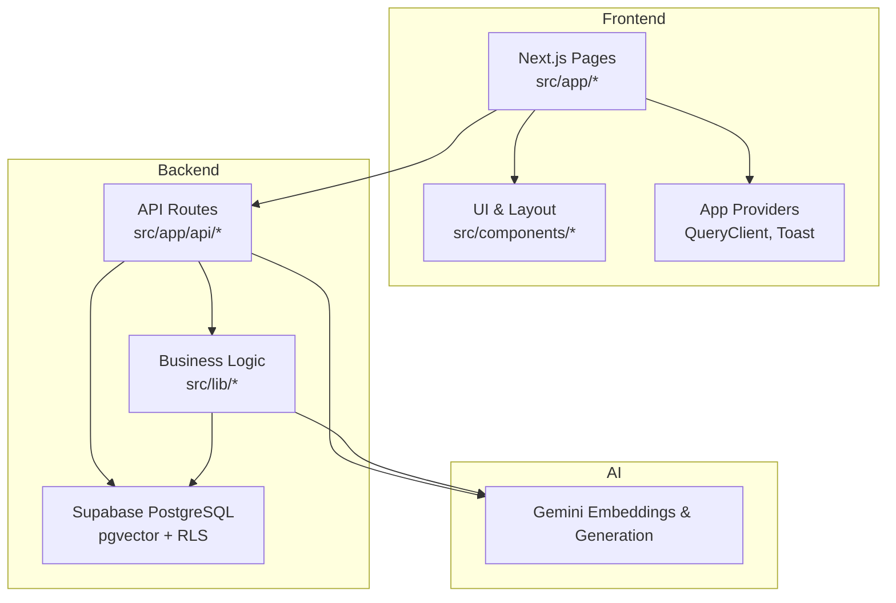

**Diagram sources**
- [src/app/layout.tsx:1-57](file://src/app/layout.tsx#L1-L57)
- [src/components/Providers.tsx:1-23](file://src/components/Providers.tsx#L1-L23)
- [src/app/api/quiz/generate/route.ts:1-196](file://src/app/api/quiz/generate/route.ts#L1-L196)
- [src/lib/supabase/server.ts:1-28](file://src/lib/supabase/server.ts#L1-L28)
- [supabase/schema.sql:1-250](file://supabase/schema.sql#L1-L250)

**Section sources**
- [README.md:27-83](file://README.md#L27-L83)
- [README.md:170-253](file://README.md#L170-L253)
- [package.json:1-43](file://package.json#L1-L43)

## Core Components
- Authentication Provider: Centralized auth state management using React Context and Supabase Auth, with local fallback for development.
- Query Client Provider: Global TanStack Query configuration for caching and retries.
- Server Supabase Client: Secure server-side Supabase client using cookies for session handling.
- Validation Schemas: Zod schemas enforcing input contracts for API routes.
- Textbook Reader: Filesystem reader for textbook content used as context for AI generation.
- Chapter Questions: Fallback question generator when AI is unavailable.
- API Routes: Endpoints for quiz generation and dashboard stats, orchestrating retrieval, AI generation, persistence, and response shaping.

**Section sources**
- [src/components/auth/AuthProvider.tsx:1-208](file://src/components/auth/AuthProvider.tsx#L1-L208)
- [src/components/Providers.tsx:1-23](file://src/components/Providers.tsx#L1-L23)
- [src/lib/supabase/server.ts:1-28](file://src/lib/supabase/server.ts#L1-L28)
- [src/lib/validations/schemas.ts:1-48](file://src/lib/validations/schemas.ts#L1-L48)
- [src/lib/textbook-reader.ts:1-46](file://src/lib/textbook-reader.ts#L1-L46)
- [src/lib/chapter-questions.ts:1-800](file://src/lib/chapter-questions.ts#L1-L800)
- [src/app/api/quiz/generate/route.ts:1-196](file://src/app/api/quiz/generate/route.ts#L1-L196)
- [src/app/api/dashboard/stats/route.ts:1-181](file://src/app/api/dashboard/stats/route.ts#L1-L181)

## Architecture Overview
The system follows a layered architecture:
- Presentation: Next.js pages and React components render user interfaces and orchestrate client-side interactions.
- API Layer: Route handlers validate inputs, coordinate business logic, and persist results.
- Business Logic: Library modules encapsulate domain operations (e.g., progress tracking, study plan generation).
- Data Access: Supabase clients and SQL schema provide secure, typed access to relational data and vector store.
- AI Integration: Gemini embeddings and generation are invoked from API routes to produce grounded MCQs.

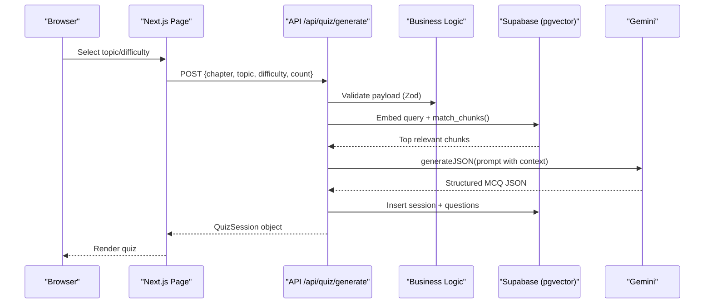

**Diagram sources**
- [src/app/api/quiz/generate/route.ts:10-187](file://src/app/api/quiz/generate/route.ts#L10-L187)
- [supabase/schema.sql:116-150](file://supabase/schema.sql#L116-L150)

## Detailed Component Analysis

### Separation of Concerns: Presentation, Business Logic, Data Access
- Presentation layer (Next.js pages and components) focuses on rendering, user interaction, and client state.
- Business logic resides in src/lib, isolating domain rules (e.g., chapter parsing, question generation strategies, progress calculations).
- Data access is abstracted through Supabase clients and SQL schema, ensuring consistent queries and security policies.

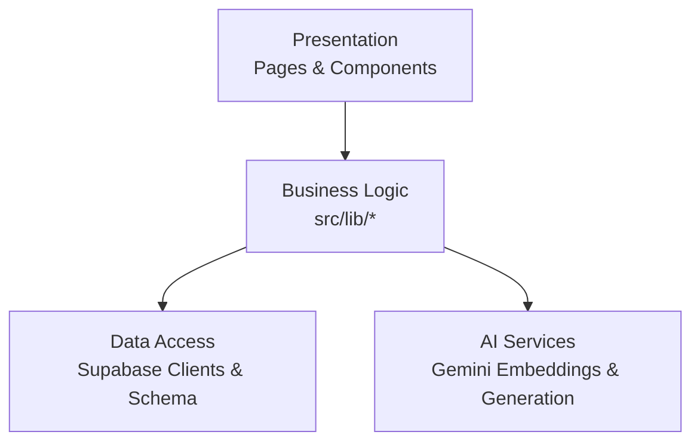

**Section sources**
- [src/app/layout.tsx:1-57](file://src/app/layout.tsx#L1-L57)
- [src/components/Providers.tsx:1-23](file://src/components/Providers.tsx#L1-L23)
- [src/lib/validations/schemas.ts:1-48](file://src/lib/validations/schemas.ts#L1-L48)
- [src/lib/textbook-reader.ts:1-46](file://src/lib/textbook-reader.ts#L1-L46)
- [src/lib/supabase/server.ts:1-28](file://src/lib/supabase/server.ts#L1-L28)
- [supabase/schema.sql:1-250](file://supabase/schema.sql#L1-L250)

### Modular Architecture and Independent Scaling
- API routes are independently deployable units; each route can scale horizontally based on load.
- Database connections are managed per request via server client, enabling connection pooling at the platform level.
- AI calls are isolated within route handlers, allowing rate limiting and retries without affecting other features.

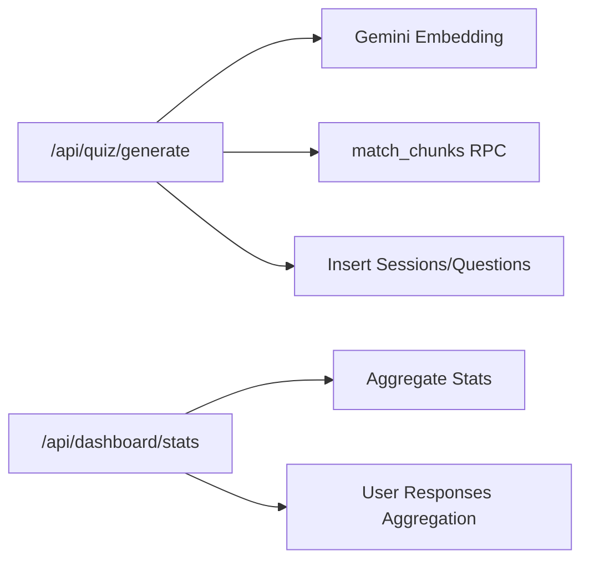

**Section sources**
- [src/app/api/quiz/generate/route.ts:1-196](file://src/app/api/quiz/generate/route.ts#L1-L196)
- [src/app/api/dashboard/stats/route.ts:1-181](file://src/app/api/dashboard/stats/route.ts#L1-L181)
- [supabase/schema.sql:116-150](file://supabase/schema.sql#L116-L150)

### RAG Architecture: Retrieval-Augmented Generation
- Build-time pipeline indexes textbook chapters into pgvector with embeddings.
- Query-time pipeline embeds the topic and retrieves top relevant chunks via cosine similarity.
- Retrieved context is injected into Gemini prompts to generate syllabus-grounded MCQs.
- Outputs are validated with Zod and persisted for later review and analytics.

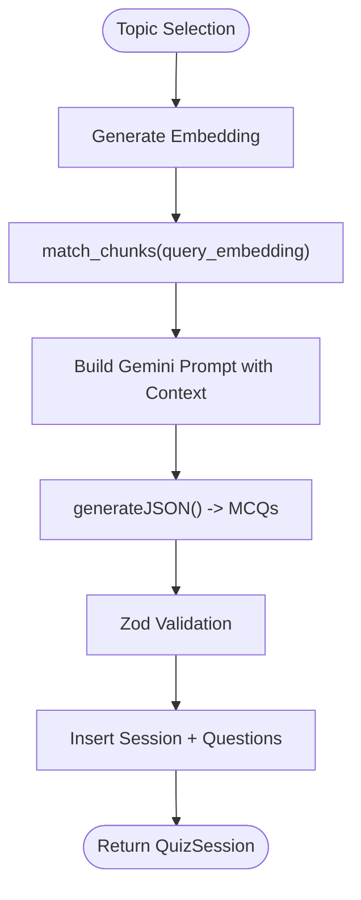

**Diagram sources**
- [src/app/api/quiz/generate/route.ts:29-187](file://src/app/api/quiz/generate/route.ts#L29-L187)
- [supabase/schema.sql:116-150](file://supabase/schema.sql#L116-L150)

**Section sources**
- [README.md:84-127](file://README.md#L84-L127)
- [src/lib/textbook-reader.ts:1-46](file://src/lib/textbook-reader.ts#L1-L46)
- [src/app/api/quiz/generate/route.ts:1-196](file://src/app/api/quiz/generate/route.ts#L1-L196)

### Design Patterns

#### Provider Pattern for State Management
- AuthProvider exposes user context, loading state, sign-out, and update methods via React Context.
- Providers wraps app with QueryClient and Toast providers for global state and notifications.

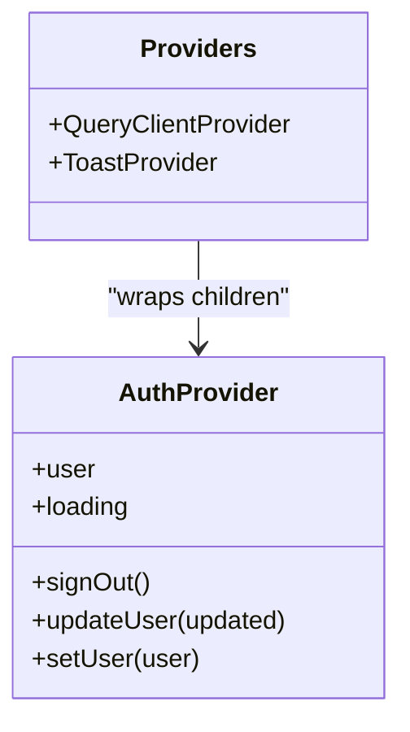

**Diagram sources**
- [src/components/auth/AuthProvider.tsx:1-208](file://src/components/auth/AuthProvider.tsx#L1-L208)
- [src/components/Providers.tsx:1-23](file://src/components/Providers.tsx#L1-L23)

**Section sources**
- [src/components/auth/AuthProvider.tsx:1-208](file://src/components/auth/AuthProvider.tsx#L1-L208)
- [src/components/Providers.tsx:1-23](file://src/components/Providers.tsx#L1-L23)

#### Repository Pattern for Data Access
- Server Supabase client abstracts cookie-based session handling and provides a consistent interface for queries.
- API routes use this client to read/write data, keeping data access logic decoupled from route handlers.

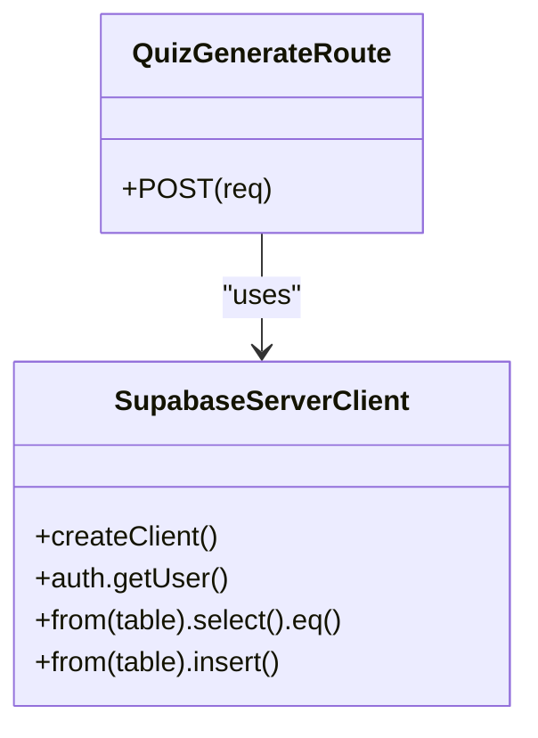

**Diagram sources**
- [src/lib/supabase/server.ts:1-28](file://src/lib/supabase/server.ts#L1-L28)
- [src/app/api/quiz/generate/route.ts:137-171](file://src/app/api/quiz/generate/route.ts#L137-L171)

**Section sources**
- [src/lib/supabase/server.ts:1-28](file://src/lib/supabase/server.ts#L1-L28)
- [src/app/api/quiz/generate/route.ts:137-171](file://src/app/api/quiz/generate/route.ts#L137-L171)

#### Service Layer Pattern for Business Operations
- Validation schemas define contracts for inputs, centralizing business rules.
- Chapter parsing and fallback question generation encapsulate domain-specific logic.
- Dashboard stats aggregation computes metrics from raw responses and sessions.

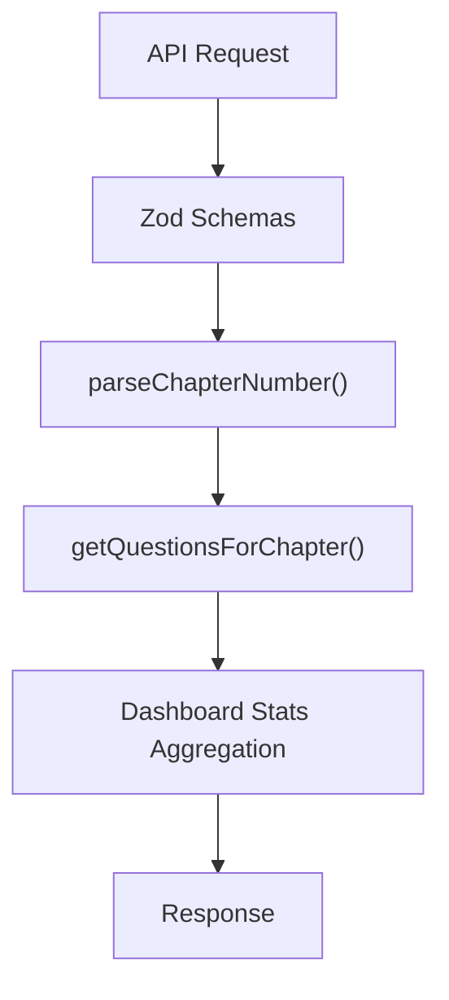

**Diagram sources**
- [src/lib/validations/schemas.ts:1-48](file://src/lib/validations/schemas.ts#L1-L48)
- [src/lib/chapter-questions.ts:1-800](file://src/lib/chapter-questions.ts#L1-L800)
- [src/app/api/dashboard/stats/route.ts:1-181](file://src/app/api/dashboard/stats/route.ts#L1-L181)

**Section sources**
- [src/lib/validations/schemas.ts:1-48](file://src/lib/validations/schemas.ts#L1-L48)
- [src/lib/chapter-questions.ts:1-800](file://src/lib/chapter-questions.ts#L1-L800)
- [src/app/api/dashboard/stats/route.ts:1-181](file://src/app/api/dashboard/stats/route.ts#L1-L181)

### Scalability Principles
- Horizontal scaling: Each API route is stateless and can be scaled independently on Vercel.
- Database connections: Server-side Supabase client uses cookies to maintain authenticated sessions per request; connection pooling handled by platform.
- Vector search: HNSW index on embeddings enables fast cosine similarity queries even as chunk volume grows.

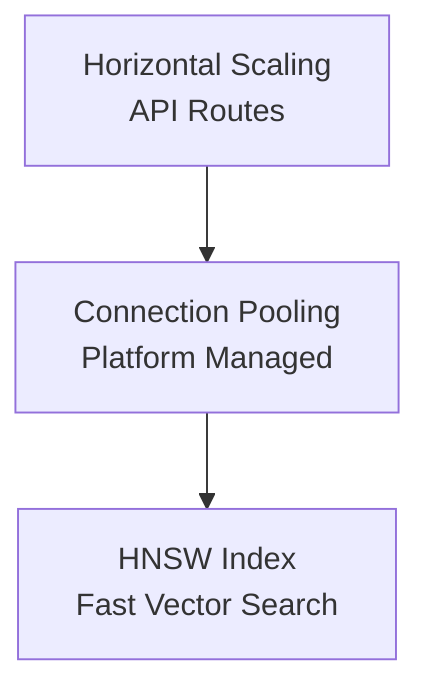

**Section sources**
- [supabase/schema.sql:38-44](file://supabase/schema.sql#L38-L44)
- [src/lib/supabase/server.ts:1-28](file://src/lib/supabase/server.ts#L1-L28)

### Security-by-Design
- Middleware: Protects routes by checking protected paths; placeholder for Supabase token verification in production.
- Row Level Security: Enforces per-user access policies on all tables.
- Input Validation: Zod schemas ensure safe and typed payloads before processing.
- Secure Communication: Server client uses environment-configured Supabase URL and keys; service role key reserved for admin operations.

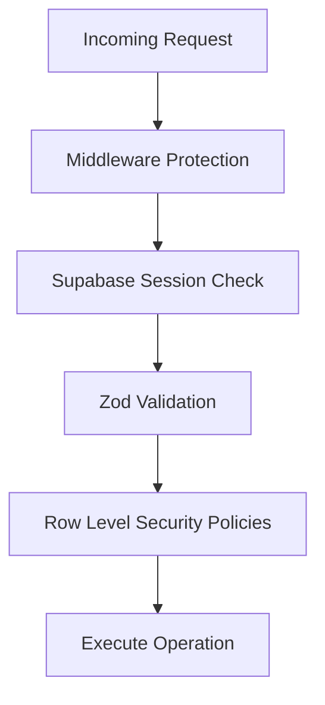

**Diagram sources**
- [src/middleware.ts:1-41](file://src/middleware.ts#L1-L41)
- [supabase/schema.sql:155-229](file://supabase/schema.sql#L155-L229)
- [src/lib/validations/schemas.ts:1-48](file://src/lib/validations/schemas.ts#L1-L48)

**Section sources**
- [src/middleware.ts:1-41](file://src/middleware.ts#L1-L41)
- [supabase/schema.sql:155-229](file://supabase/schema.sql#L155-L229)
- [src/lib/validations/schemas.ts:1-48](file://src/lib/validations/schemas.ts#L1-L48)

## Dependency Analysis
Key runtime dependencies include Next.js, React, Supabase JS SDK, Drizzle ORM, TanStack Query, Gemini AI, Zod, and Tailwind CSS. These enable full-stack development with strong typing, caching, and AI integration.

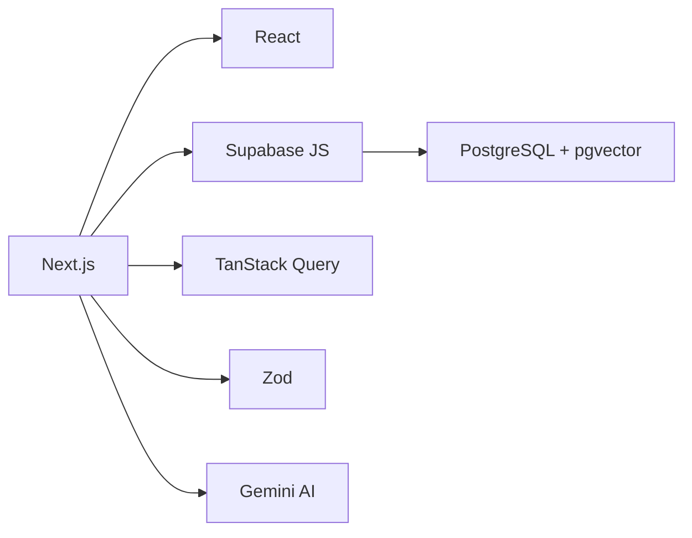

**Diagram sources**
- [package.json:11-28](file://package.json#L11-L28)
- [README.md:27-83](file://README.md#L27-L83)

**Section sources**
- [package.json:1-43](file://package.json#L1-L43)
- [README.md:27-83](file://README.md#L27-L83)

## Performance Considerations
- Use HNSW vector index for fast similarity searches over large textbook corpora.
- Cache API responses with TanStack Query to reduce redundant network calls.
- Limit prompt context size to control latency and cost during AI generation.
- Prefer server-side data fetching for sensitive or heavy computations to minimize client overhead.

[No sources needed since this section provides general guidance]

## Troubleshooting Guide
- Missing environment variables: Ensure Supabase URL, anon key, and Gemini API key are set; otherwise, fallback behaviors may trigger.
- Vector search failures: Verify match_chunks RPC exists and HNSW index is created; check embedding dimensions and thresholds.
- Auth issues: Confirm Supabase session cookies are present; middleware placeholders indicate where to enable token checks.
- Validation errors: Inspect Zod error details returned by API routes for malformed payloads.

**Section sources**
- [src/app/api/quiz/generate/route.ts:188-195](file://src/app/api/quiz/generate/route.ts#L188-L195)
- [src/app/api/dashboard/stats/route.ts:173-180](file://src/app/api/dashboard/stats/route.ts#L173-L180)
- [src/middleware.ts:22-33](file://src/middleware.ts#L22-L33)
- [supabase/schema.sql:116-150](file://supabase/schema.sql#L116-L150)

## Conclusion
MedAce-AI’s architecture emphasizes clear separation of concerns, modular design, and robust data and AI integration. The Provider pattern centralizes state, the Repository pattern abstracts data access, and the Service Layer encapsulates business operations. RAG ensures high-quality, syllabus-aligned MCQ generation. Security-by-design is enforced through middleware, validation, and row-level policies. The system is structured for horizontal scaling and maintainable growth as features and datasets expand.

[No sources needed since this section summarizes without analyzing specific files]