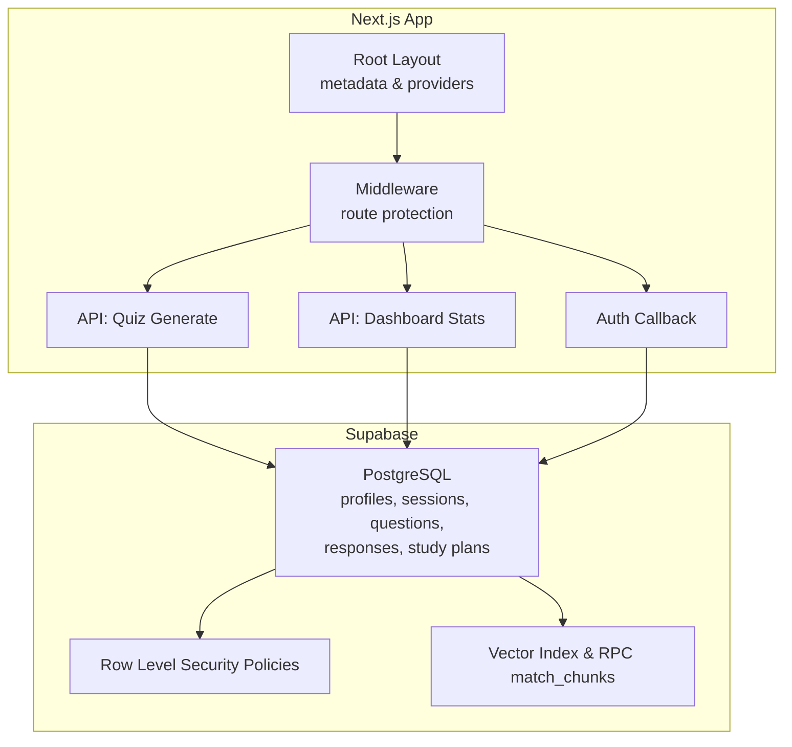
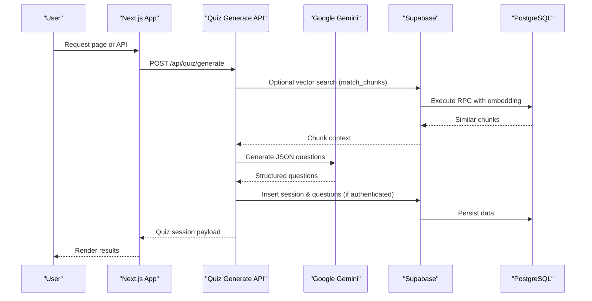
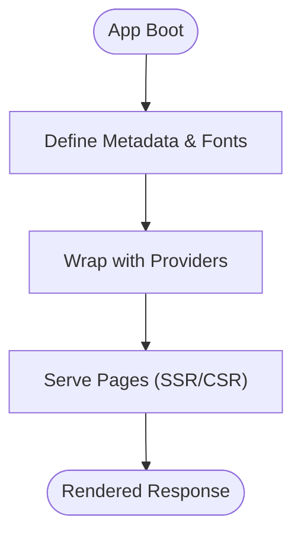
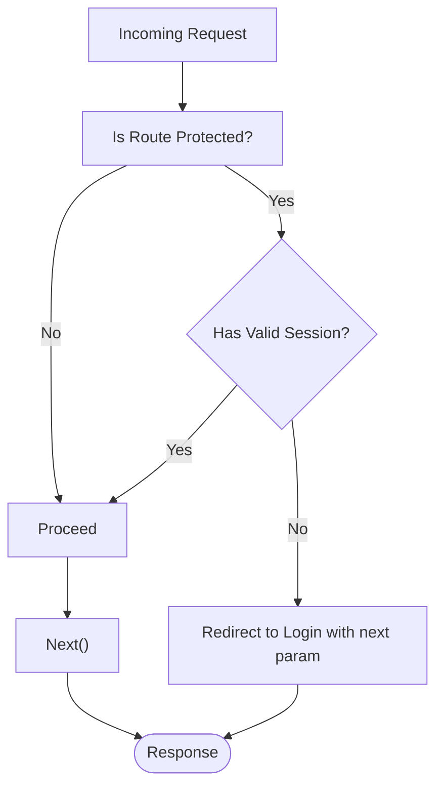
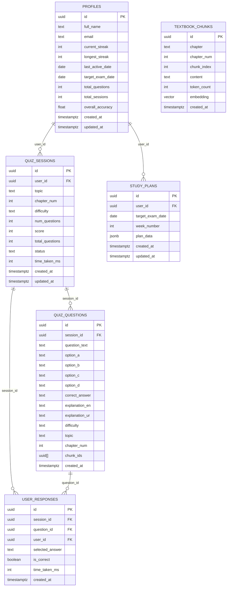
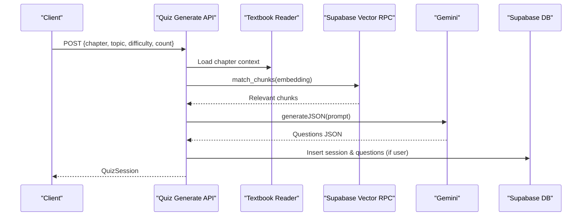
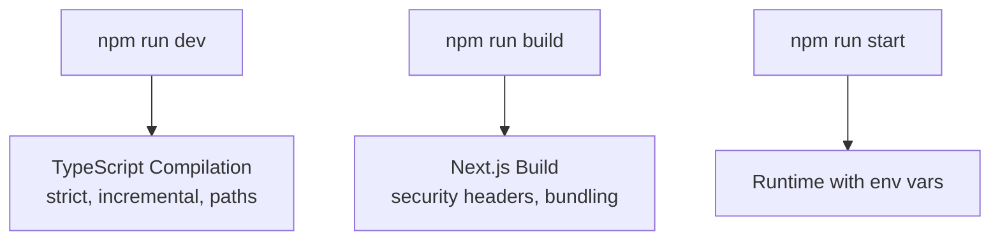
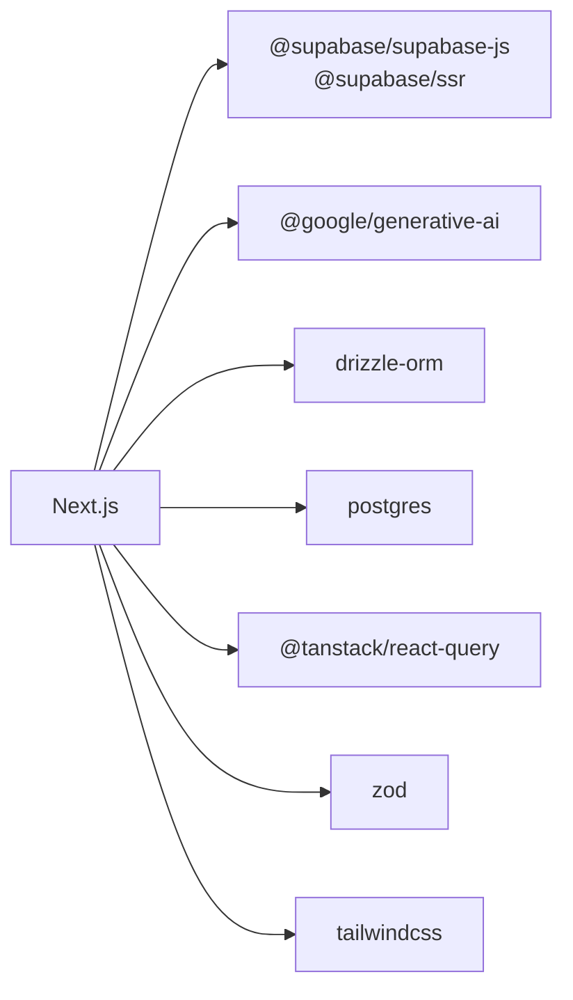

# Technology Integration

<cite>
**Referenced Files in This Document**
- [package.json](file://package.json)
- [next.config.ts](file://next.config.ts)
- [tsconfig.json](file://tsconfig.json)
- [src/middleware.ts](file://src/middleware.ts)
- [src/app/layout.tsx](file://src/app/layout.tsx)
- [src/components/Providers.tsx](file://src/components/Providers.tsx)
- [src/app/auth/callback/route.ts](file://src/app/auth/callback/route.ts)
- [src/app/api/dashboard/stats/route.ts](file://src/app/api/dashboard/stats/route.ts)
- [src/app/api/quiz/generate/route.ts](file://src/app/api/quiz/generate/route.ts)
- [supabase/schema.sql](file://supabase/schema.sql)
</cite>

## Table of Contents
1. Introduction
2. Project Structure
3. Core Components
4. Architecture Overview
5. Detailed Component Analysis
6. Dependency Analysis
7. Performance Considerations
8. Troubleshooting Guide
9. Conclusion
10. Appendices

## Introduction
This document explains how MedAce-AI integrates multiple technologies to deliver a complete adaptive MDCAT preparation experience. It covers Next.js App Router with server-side rendering, API routes, and static metadata; Supabase integration for PostgreSQL, authentication, vector search, and storage-ready patterns; Google Gemini AI model configuration, prompt engineering, response processing, and error handling; middleware for request interception and auth checks; build process configuration including TypeScript compilation and asset optimization; deployment considerations on Vercel; third-party integrations like analytics and monitoring; and the development workflow with hot reloading, debugging, and testing.

## Project Structure
MedAce-AI is organized around the Next.js App Router:
- Application shell and metadata are defined at the root layout.
- Protected routes are gated via middleware.
- API routes implement server-side logic for quiz generation and dashboard statistics.
- Supabase schema defines relational tables, vector indexes, and row-level security policies.
- Providers wrap client-side state management and UI services.

**Diagram sources**
- [src/app/layout.tsx:1-57](file://src/app/layout.tsx#L1-L57)
- [src/middleware.ts:1-41](file://src/middleware.ts#L1-L41)
- [src/app/api/quiz/generate/route.ts:1-196](file://src/app/api/quiz/generate/route.ts#L1-L196)
- [src/app/api/dashboard/stats/route.ts:1-181](file://src/app/api/dashboard/stats/route.ts#L1-L181)
- [src/app/auth/callback/route.ts:1-32](file://src/app/auth/callback/route.ts#L1-L32)
- [supabase/schema.sql:1-250](file://supabase/schema.sql#L1-L250)

**Section sources**
- [src/app/layout.tsx:1-57](file://src/app/layout.tsx#L1-L57)
- [src/middleware.ts:1-41](file://src/middleware.ts#L1-L41)
- [package.json:1-43](file://package.json#L1-L43)

## Core Components
- Next.js App Router: Root layout sets global metadata, fonts, and wraps the app with client providers.
- Middleware: Intercepts requests to protect routes and can enforce session checks when Supabase auth is enabled.
- API Routes:
  - Quiz Generation: Validates input, builds context from textbook files and optional vector RAG, calls Gemini AI to generate structured JSON, persists sessions/questions if authenticated, and returns a quiz session.
  - Dashboard Stats: Aggregates user performance metrics, recent sessions, weak topics, and profile data from Supabase.
- Supabase Schema: Defines profiles, textbook chunks (with vector embeddings), quiz sessions, questions, responses, study plans, plus an HNSW index and an RPC function for similarity search. Row-level security policies secure data access.
- Client Providers: React Query client configured with default caching and retry behavior, plus toast notifications.

**Section sources**
- [src/app/layout.tsx:1-57](file://src/app/layout.tsx#L1-L57)
- [src/middleware.ts:1-41](file://src/middleware.ts#L1-L41)
- [src/app/api/quiz/generate/route.ts:1-196](file://src/app/api/quiz/generate/route.ts#L1-L196)
- [src/app/api/dashboard/stats/route.ts:1-181](file://src/app/api/dashboard/stats/route.ts#L1-L181)
- [supabase/schema.sql:1-250](file://supabase/schema.sql#L1-L250)
- [src/components/Providers.tsx:1-23](file://src/components/Providers.tsx#L1-L23)

## Architecture Overview
The system combines Next.js server functions with Supabase and Google Gemini to create an adaptive learning loop:
- User interacts with pages served by Next.js.
- Serverless API routes validate inputs, assemble context (local textbook content + optional vector RAG), call Gemini to generate high-yield MCQs, and persist results.
- Supabase enforces security via RLS and provides fast vector similarity search through an HNSW index and RPC.
- Authentication flows exchange OAuth codes for sessions and redirect users appropriately.

**Diagram sources**
- [src/app/api/quiz/generate/route.ts:1-196](file://src/app/api/quiz/generate/route.ts#L1-L196)
- [supabase/schema.sql:116-150](file://supabase/schema.sql#L116-L150)

## Detailed Component Analysis

### Next.js App Router and SSR
- Root layout configures metadata, Open Graph, Twitter cards, robots, and injects a global font variable. It also mounts client-side providers for state and UI.
- Static site generation capabilities are leveraged via route-level metadata and server components where applicable. The application uses Next.js App Router conventions for routing and server functions.

**Diagram sources**
- [src/app/layout.tsx:1-57](file://src/app/layout.tsx#L1-L57)
- [src/components/Providers.tsx:1-23](file://src/components/Providers.tsx#L1-L23)

**Section sources**
- [src/app/layout.tsx:1-57](file://src/app/layout.tsx#L1-L57)
- [src/components/Providers.tsx:1-23](file://src/components/Providers.tsx#L1-L23)

### Middleware: Request Interception and Auth Checks
- Protects specific routes (/dashboard, /practice, /results, /study-plan, /profile).
- Includes placeholders for Supabase cookie-based session verification that can be enabled when auth is fully wired up.
- Excludes static assets and API routes from matching.

**Diagram sources**
- [src/middleware.ts:1-41](file://src/middleware.ts#L1-L41)

**Section sources**
- [src/middleware.ts:1-41](file://src/middleware.ts#L1-L41)

### Supabase Integration: PostgreSQL, Auth, Vector Search, Storage Patterns
- Database schema includes:
  - Profiles linked to auth.users with performance stats.
  - Textbook chunks with vector(768) embeddings and an HNSW index for cosine similarity.
  - Quiz sessions, questions, user responses, and study plans with appropriate indexes.
  - An RPC function match_chunks for efficient similarity queries.
  - Row-level security policies restricting access per user.
  - A trigger to auto-create profiles on user signup.
- Authentication callback exchanges OAuth code for a session and redirects safely based on environment.

**Diagram sources**
- [supabase/schema.sql:10-111](file://supabase/schema.sql#L10-L111)
- [supabase/schema.sql:116-150](file://supabase/schema.sql#L116-L150)
- [supabase/schema.sql:155-229](file://supabase/schema.sql#L155-L229)
- [supabase/schema.sql:232-250](file://supabase/schema.sql#L232-L250)

**Section sources**
- [supabase/schema.sql:1-250](file://supabase/schema.sql#L1-L250)
- [src/app/auth/callback/route.ts:1-32](file://src/app/auth/callback/route.ts#L1-L32)

### Google Gemini AI Integration: Model Configuration, Prompt Engineering, Response Processing, Error Handling
- Input validation ensures safe payloads before calling AI.
- Context assembly:
  - Reads local textbook content for the requested chapter.
  - Optionally augments with vector RAG via Supabase RPC using embeddings generated by the AI library.
- Prompt engineering:
  - Instructs Gemini to produce exactly the required number of unique, high-yield MCQs with four options, correct answers, English explanations, and Urdu explanations.
  - Enforces a strict JSON schema for reliable parsing.
- Response processing:
  - Maps AI output into internal Question structures.
  - Persists session and questions to Supabase when authenticated.
  - Falls back to a deterministic chapter question generator if AI is unavailable or fails.
- Error handling:
  - Catches and logs errors during vector search and AI calls.
  - Returns standardized error responses for invalid payloads and server errors.

**Diagram sources**
- [src/app/api/quiz/generate/route.ts:1-196](file://src/app/api/quiz/generate/route.ts#L1-L196)
- [supabase/schema.sql:116-150](file://supabase/schema.sql#L116-L150)

**Section sources**
- [src/app/api/quiz/generate/route.ts:1-196](file://src/app/api/quiz/generate/route.ts#L1-L196)

### Build Process Configuration: TypeScript, Asset Optimization, Environment Variables
- TypeScript compiler options enable strict mode, ES modules, path aliases (@/*), incremental builds, and preserve JSX for Next.js.
- Next.js configuration adds security headers across all routes.
- Package scripts standardize dev, build, start, and lint workflows.
- Environment variables are used in runtime (e.g., NODE_ENV in auth callback) and typically include Supabase and Gemini keys via platform-specific secret management.

**Diagram sources**
- [tsconfig.json:1-28](file://tsconfig.json#L1-L28)
- [next.config.ts:1-25](file://next.config.ts#L1-L25)
- [package.json:1-43](file://package.json#L1-L43)

**Section sources**
- [tsconfig.json:1-28](file://tsconfig.json#L1-L28)
- [next.config.ts:1-25](file://next.config.ts#L1-L25)
- [package.json:1-43](file://package.json#L1-L43)

### Deployment Integration: Vercel Setup, Build Optimization, Monitoring
- Vercel deploys Next.js applications seamlessly, honoring environment variables and build scripts.
- Recommended setup:
  - Configure Supabase and Gemini secrets in Vercel project settings.
  - Ensure build command matches package scripts.
  - Use domain and preview deployments for staging.
- Monitoring:
  - Integrate analytics and error tracking via environment-driven SDK initialization in client providers or layout.
  - Use Next.js/Vercel logs and performance insights for observability.

[No sources needed since this section provides general guidance]

### Third-Party Integrations: Analytics, Error Tracking, Performance Monitoring
- Analytics: Initialize analytics SDKs conditionally based on environment variables to avoid leaking keys in development.
- Error tracking: Capture unhandled exceptions in API routes and client components; report to your chosen service.
- Performance monitoring: Leverage Next.js built-in metrics and integrate APM tools via environment flags.

[No sources needed since this section provides general guidance]

### Development Workflow: Hot Reloading, Debugging Tools, Testing Frameworks
- Hot reloading: Next.js dev server provides instant feedback for changes.
- Debugging:
  - Use browser devtools for client-side issues.
  - Inspect server logs for API route errors.
  - Validate Supabase policies and vector search with test queries.
- Testing:
  - Unit tests for utilities and validators.
  - Integration tests for API routes against a test Supabase instance.
  - E2E tests for critical user flows (auth callback, quiz generation).

[No sources needed since this section provides general guidance]

## Dependency Analysis
Key dependencies and their roles:
- Next.js: App Router, SSR, API routes, build tooling.
- Supabase JS and SSR helpers: Client creation, auth flow, admin client for server operations.
- Google Generative AI: Embeddings and JSON generation for prompts.
- Drizzle ORM and Postgres driver: Type-safe database interactions and connection management.
- React Query: Data fetching, caching, retries.
- Validation libraries (Zod, Hook Form): Schema validation and form handling.
- Tailwind CSS and Framer Motion: Styling and animations.

**Diagram sources**
- [package.json:11-28](file://package.json#L11-L28)
- [package.json:29-41](file://package.json#L29-L41)

**Section sources**
- [package.json:1-43](file://package.json#L1-L43)

## Performance Considerations
- Vector search: HNSW index on embeddings enables fast cosine similarity queries for RAG. Tune match_threshold and match_count for latency vs. relevance trade-offs.
- Caching: React Query staleTime and retry reduce network load and improve perceived performance.
- API efficiency: Batch inserts for questions and sessions minimize round trips.
- Security headers: Hardened HTTP headers reduce attack surface without impacting performance.
- Asset optimization: Next.js handles image and font optimizations; ensure minimal client-side bundles.

[No sources needed since this section provides general guidance]

## Troubleshooting Guide
Common issues and resolutions:
- Invalid request payload: Ensure API inputs conform to the expected schema; check validation error details.
- AI generation failures: If Gemini is unavailable or returns unexpected output, the system falls back to deterministic chapter questions; verify API keys and rate limits.
- Vector search errors: If embeddings or RPC fail, the system continues with local textbook context; confirm Supabase extensions and indexes are enabled.
- Dashboard stats empty: For unauthenticated users, demo data is returned; verify auth flow and RLS policies.
- Auth callback redirects: Ensure correct origin and forwarded host handling; check environment-specific logic.

**Section sources**
- [src/app/api/quiz/generate/route.ts:15-20](file://src/app/api/quiz/generate/route.ts#L15-L20)
- [src/app/api/quiz/generate/route.ts:125-135](file://src/app/api/quiz/generate/route.ts#L125-L135)
- [src/app/api/dashboard/stats/route.ts:11-41](file://src/app/api/dashboard/stats/route.ts#L11-L41)
- [src/app/auth/callback/route.ts:14-22](file://src/app/auth/callback/route.ts#L14-L22)

## Conclusion
MedAce-AI integrates Next.js, Supabase, and Google Gemini to deliver an adaptive, secure, and scalable MDCAT preparation platform. The App Router provides SSR and API capabilities; Supabase offers robust data modeling, vector search, and security; Gemini powers intelligent question generation with strong prompt engineering and fallbacks. Middleware protects sensitive routes, while build and deployment configurations ensure reliability and performance. With clear error handling and extensible architecture, the system supports analytics, monitoring, and continuous improvement.

## Appendices
- Environment variables typically include Supabase URL and anon/admin keys, Gemini API key, and feature flags for analytics and monitoring.
- For production, enable full middleware auth checks and comprehensive logging.
- Regularly review RLS policies and vector indexes to maintain security and performance.

[No sources needed since this section provides general guidance]