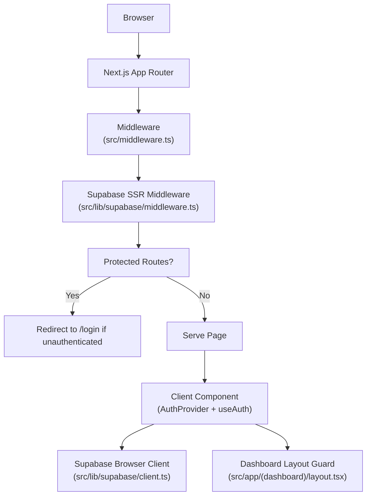
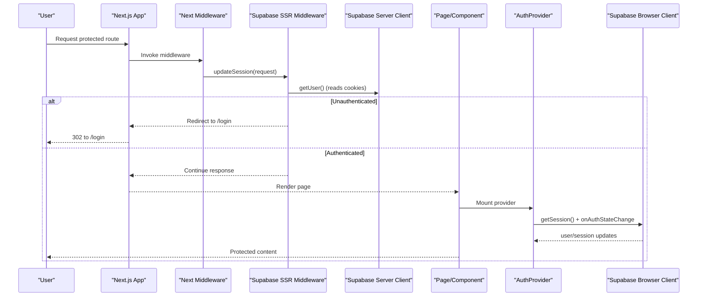
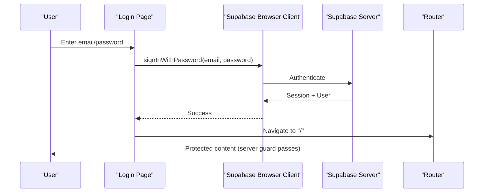
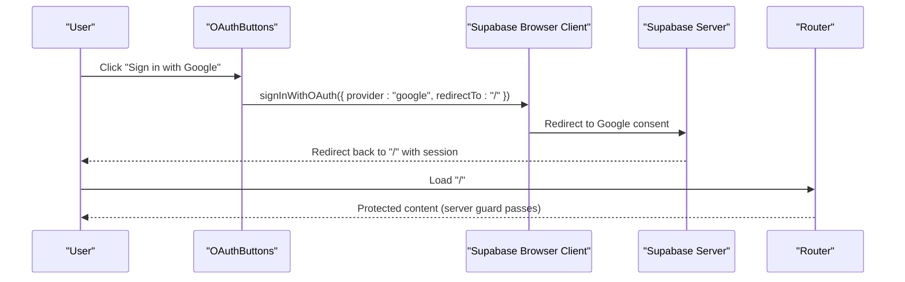
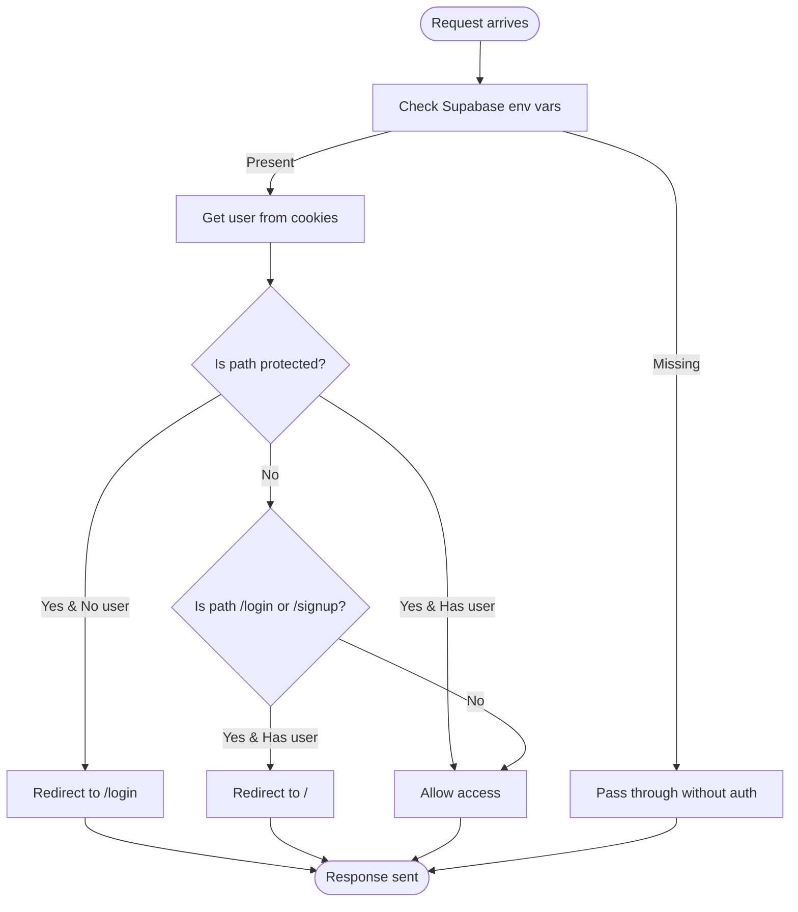
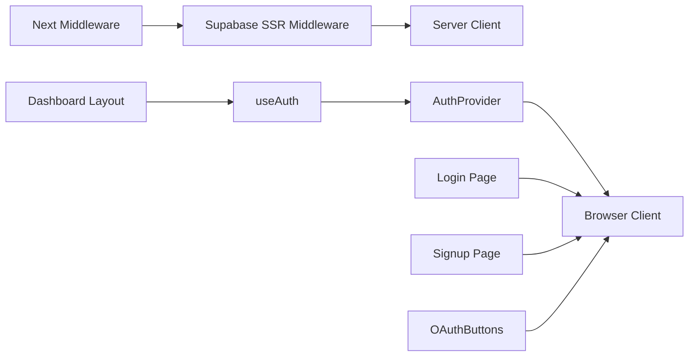

# Authentication System

<cite>
**Referenced Files in This Document**
- [middleware.ts](file://Next-app/src/middleware.ts)
- [supabase/middleware.ts](file://Next-app/src/lib/supabase/middleware.ts)
- [supabase/client.ts](file://Next-app/src/lib/supabase/client.ts)
- [supabase/server.ts](file://Next-app/src/lib/supabase/server.ts)
- [AuthProvider.tsx](file://Next-app/src/providers/AuthProvider.tsx)
- [useAuth.ts](file://Next-app/src/lib/hooks/useAuth.ts)
- [OAuthButtons.tsx](file://Next-app/src/components/auth/OAuthButtons.tsx)
- [login/page.tsx](file://Next-app/src/app/(auth)/login/page.tsx)
- [signup/page.tsx](file://Next-app/src/app/(auth)/signup/page.tsx)
- [(dashboard)/layout.tsx](file://Next-app/src/app/(dashboard)/layout.tsx)
</cite>

## Table of Contents
1. Introduction
2. Project Structure
3. Core Components
4. Architecture Overview
5. Detailed Component Analysis
6. Dependency Analysis
7. Performance Considerations
8. Troubleshooting Guide
9. Conclusion

## Introduction
This document explains the authentication system implemented in the Next.js application using Supabase. It covers:
- Supabase integration for client and server contexts
- Session management via cookies and React context
- Protected routes enforced by Next.js middleware and layout guards
- OAuth sign-in flow with Google
- End-to-end flow from login/signup to protected route access
- Security measures, error handling, and best practices for session management

## Project Structure
The authentication implementation spans several layers:
- Middleware layer enforces route protection and redirects
- Supabase clients provide browser and server-side session handling
- AuthProvider exposes user/session state to components
- UI pages handle login/signup and OAuth flows
- Dashboard layout protects routes on the client side as a second guard

**Diagram sources**
- [middleware.ts:1-13](file://Next-app/src/middleware.ts#L1-L13)
- [supabase/middleware.ts:1-68](file://Next-app/src/lib/supabase/middleware.ts#L1-L68)
- [supabase/client.ts:1-15](file://Next-app/src/lib/supabase/client.ts#L1-L15)
- [(dashboard)/layout.tsx:1-62](file://Next-app/src/app/(dashboard)/layout.tsx#L1-L62)

**Section sources**
- [middleware.ts:1-13](file://Next-app/src/middleware.ts#L1-L13)
- [supabase/middleware.ts:1-68](file://Next-app/src/lib/supabase/middleware.ts#L1-L68)
- [supabase/client.ts:1-15](file://Next-app/src/lib/supabase/client.ts#L1-L15)
- [supabase/server.ts:1-31](file://Next-app/src/lib/supabase/server.ts#L1-L31)
- [AuthProvider.tsx:1-79](file://Next-app/src/providers/AuthProvider.tsx#L1-L79)
- [useAuth.ts:1-13](file://Next-app/src/lib/hooks/useAuth.ts#L1-L13)
- [OAuthButtons.tsx:1-54](file://Next-app/src/components/auth/OAuthButtons.tsx#L1-L54)
- [login/page.tsx:1-104](file://Next-app/src/app/(auth)/login/page.tsx#L1-L104)
- [signup/page.tsx:1-139](file://Next-app/src/app/(auth)/signup/page.tsx#L1-L139)
- [(dashboard)/layout.tsx:1-62](file://Next-app/src/app/(dashboard)/layout.tsx#L1-L62)

## Core Components
- Supabase SSR middleware: Creates a server-side Supabase client, reads cookies, checks user identity, and enforces redirects for protected or auth-only paths.
- Next.js middleware: Delegates request processing to Supabase SSR middleware for every non-static route.
- Supabase browser client: Validates environment variables and returns a browser client for client-side auth calls.
- Supabase server client: Returns a server-side client bound to Next.js cookies for server components and API routes.
- AuthProvider: Initializes Supabase client, loads current session, subscribes to auth state changes, and exposes user/session/signOut via React context.
- useAuth hook: Provides typed access to AuthContext within components.
- OAuthButtons: Triggers Google OAuth sign-in with redirect back to the app root.
- Login/Signup pages: Handle email/password flows and integrate OAuth buttons.
- Dashboard layout: Guards protected routes on the client side by checking auth state and redirecting to login when needed.

**Section sources**
- [supabase/middleware.ts:1-68](file://Next-app/src/lib/supabase/middleware.ts#L1-L68)
- [middleware.ts:1-13](file://Next-app/src/middleware.ts#L1-L13)
- [supabase/client.ts:1-15](file://Next-app/src/lib/supabase/client.ts#L1-L15)
- [supabase/server.ts:1-31](file://Next-app/src/lib/supabase/server.ts#L1-L31)
- [AuthProvider.tsx:1-79](file://Next-app/src/providers/AuthProvider.tsx#L1-L79)
- [useAuth.ts:1-13](file://Next-app/src/lib/hooks/useAuth.ts#L1-L13)
- [OAuthButtons.tsx:1-54](file://Next-app/src/components/auth/OAuthButtons.tsx#L1-L54)
- [login/page.tsx:1-104](file://Next-app/src/app/(auth)/login/page.tsx#L1-L104)
- [signup/page.tsx:1-139](file://Next-app/src/app/(auth)/signup/page.tsx#L1-L139)
- [(dashboard)/layout.tsx:1-62](file://Next-app/src/app/(dashboard)/layout.tsx#L1-L62)

## Architecture Overview
The authentication architecture combines server-side enforcement and client-side state synchronization:

**Diagram sources**
- [middleware.ts:1-13](file://Next-app/src/middleware.ts#L1-L13)
- [supabase/middleware.ts:1-68](file://Next-app/src/lib/supabase/middleware.ts#L1-L68)
- [supabase/server.ts:1-31](file://Next-app/src/lib/supabase/server.ts#L1-L31)
- [AuthProvider.tsx:1-79](file://Next-app/src/providers/AuthProvider.tsx#L1-L79)
- [supabase/client.ts:1-15](file://Next-app/src/lib/supabase/client.ts#L1-L15)

## Detailed Component Analysis

### Supabase Integration (Client and Server)
- Browser client validates environment variables and creates a browser instance for client-side auth operations.
- Server client binds to Next.js cookies to support server components and API routes.
- SSR middleware uses the server client to read cookies, determine user identity, and enforce redirects for protected vs. auth-only paths.

Key behaviors:
- Environment validation prevents runtime errors when credentials are missing.
- Cookie-based sessions are synchronized between request and response objects during middleware execution.
- Protected path list includes dashboard features; auth pages are guarded against authenticated users.

**Section sources**
- [supabase/client.ts:1-15](file://Next-app/src/lib/supabase/client.ts#L1-L15)
- [supabase/server.ts:1-31](file://Next-app/src/lib/supabase/server.ts#L1-L31)
- [supabase/middleware.ts:1-68](file://Next-app/src/lib/supabase/middleware.ts#L1-L68)

### Next.js Middleware Protection
- The global middleware delegates to Supabase SSR middleware for all non-static routes.
- SSR middleware performs:
  - User detection via cookies
  - Redirect unauthenticated users away from protected routes to /login
  - Redirect authenticated users away from /login and /signup to the home page

This ensures server-side enforcement before any page renders.

**Section sources**
- [middleware.ts:1-13](file://Next-app/src/middleware.ts#L1-L13)
- [supabase/middleware.ts:1-68](file://Next-app/src/lib/supabase/middleware.ts#L1-L68)

### AuthProvider and useAuth Hook
- AuthProvider initializes the Supabase client, fetches the current session, and subscribes to auth state changes to keep UI in sync.
- Exposes user, session, loading state, and signOut through context.
- useAuth provides a convenient typed hook to consume auth state in components.

Security considerations:
- If Supabase is not configured, the provider treats the app as unauthenticated and avoids crashes.
- Sign-out clears both local state and Supabase session.

**Section sources**
- [AuthProvider.tsx:1-79](file://Next-app/src/providers/AuthProvider.tsx#L1-L79)
- [useAuth.ts:1-13](file://Next-app/src/lib/hooks/useAuth.ts#L1-L13)

### OAuth Button Component
- OAuthButtons triggers Google OAuth sign-in with a redirect to the app root.
- Uses dynamic import of the Supabase client to avoid bundling server-only code in the browser.
- Displays loading state and handles errors gracefully.

Best practice:
- Ensure OAuth providers are enabled in Supabase and redirect URLs match your domain.

**Section sources**
- [OAuthButtons.tsx:1-54](file://Next-app/src/components/auth/OAuthButtons.tsx#L1-L54)

### Login and Signup Pages
- Login page:
  - Collects email/password
  - Calls Supabase password sign-in
  - On success, navigates to home and refreshes routing state
  - Shows localized error messages
- Signup page:
  - Validates password confirmation and minimum length
  - Calls Supabase sign-up with optional user metadata
  - On success, navigates to home and refreshes routing state
  - Integrates OAuth button for alternative sign-in

Error handling:
- Errors from Supabase are surfaced to the user with clear messages.
- Loading states prevent duplicate submissions.

**Section sources**
- [login/page.tsx:1-104](file://Next-app/src/app/(auth)/login/page.tsx#L1-L104)
- [signup/page.tsx:1-139](file://Next-app/src/app/(auth)/signup/page.tsx#L1-L139)

### Protected Route Access (Client-Side Guard)
- The dashboard layout uses useAuth to check if a user exists after initial load.
- If no user is present, it redirects to /login.
- While loading, it shows a spinner; once confirmed unauthenticated, it renders nothing to avoid flash content.

This complements server-side protection with a client-side safety net.

**Section sources**
- [(dashboard)/layout.tsx:1-62](file://Next-app/src/app/(dashboard)/layout.tsx#L1-L62)

### Authentication Flow Diagrams

#### Email/Password Login Flow

**Diagram sources**
- [login/page.tsx:17-38](file://Next-app/src/app/(auth)/login/page.tsx#L17-L38)
- [supabase/client.ts:1-15](file://Next-app/src/lib/supabase/client.ts#L1-L15)
- [supabase/middleware.ts:36-66](file://Next-app/src/lib/supabase/middleware.ts#L36-L66)

#### OAuth Google Sign-In Flow

**Diagram sources**
- [OAuthButtons.tsx:8-22](file://Next-app/src/components/auth/OAuthButtons.tsx#L8-L22)
- [supabase/middleware.ts:36-66](file://Next-app/src/lib/supabase/middleware.ts#L36-L66)

#### Protected Route Enforcement Flowchart

**Diagram sources**
- [supabase/middleware.ts:4-66](file://Next-app/src/lib/supabase/middleware.ts#L4-L66)

## Dependency Analysis
High-level dependencies among authentication components:

**Diagram sources**
- [middleware.ts:1-13](file://Next-app/src/middleware.ts#L1-L13)
- [supabase/middleware.ts:1-68](file://Next-app/src/lib/supabase/middleware.ts#L1-L68)
- [supabase/server.ts:1-31](file://Next-app/src/lib/supabase/server.ts#L1-L31)
- [AuthProvider.tsx:1-79](file://Next-app/src/providers/AuthProvider.tsx#L1-L79)
- [supabase/client.ts:1-15](file://Next-app/src/lib/supabase/client.ts#L1-L15)
- [login/page.tsx:1-104](file://Next-app/src/app/(auth)/login/page.tsx#L1-L104)
- [signup/page.tsx:1-139](file://Next-app/src/app/(auth)/signup/page.tsx#L1-L139)
- [OAuthButtons.tsx:1-54](file://Next-app/src/components/auth/OAuthButtons.tsx#L1-L54)
- [(dashboard)/layout.tsx:1-62](file://Next-app/src/app/(dashboard)/layout.tsx#L1-L62)

**Section sources**
- [middleware.ts:1-13](file://Next-app/src/middleware.ts#L1-L13)
- [supabase/middleware.ts:1-68](file://Next-app/src/lib/supabase/middleware.ts#L1-L68)
- [supabase/server.ts:1-31](file://Next-app/src/lib/supabase/server.ts#L1-L31)
- [AuthProvider.tsx:1-79](file://Next-app/src/providers/AuthProvider.tsx#L1-L79)
- [supabase/client.ts:1-15](file://Next-app/src/lib/supabase/client.ts#L1-L15)
- [login/page.tsx:1-104](file://Next-app/src/app/(auth)/login/page.tsx#L1-L104)
- [signup/page.tsx:1-139](file://Next-app/src/app/(auth)/signup/page.tsx#L1-L139)
- [OAuthButtons.tsx:1-54](file://Next-app/src/components/auth/OAuthButtons.tsx#L1-L54)
- [(dashboard)/layout.tsx:1-62](file://Next-app/src/app/(dashboard)/layout.tsx#L1-L62)

## Performance Considerations
- Prefer server-side protection via middleware to avoid unnecessary client rendering for protected routes.
- Use onAuthStateChange to keep UI reactive without polling.
- Avoid heavy computations in auth flows; keep login/signup handlers minimal.
- Ensure environment variable checks fail fast to reduce startup overhead.

[No sources needed since this section provides general guidance]

## Troubleshooting Guide
Common issues and resolutions:
- Missing Supabase environment variables:
  - Symptom: Errors thrown by client/server constructors or middleware bypassing auth.
  - Resolution: Set NEXT_PUBLIC_SUPABASE_URL and NEXT_PUBLIC_SUPABASE_ANON_KEY.
- OAuth redirect mismatches:
  - Symptom: OAuth fails or redirects to wrong URL.
  - Resolution: Configure allowed redirect URLs in Supabase and ensure the app’s origin matches.
- Protected routes still accessible:
  - Symptom: Users can access dashboard without login.
  - Resolution: Verify middleware matcher and protected path list; ensure cookies are set correctly.
- Client-side redirect loops:
  - Symptom: Repeated redirects between login and dashboard.
  - Resolution: Confirm that server-side middleware and client-side layout guards align on protected paths.

**Section sources**
- [supabase/client.ts:1-15](file://Next-app/src/lib/supabase/client.ts#L1-L15)
- [supabase/server.ts:1-31](file://Next-app/src/lib/supabase/server.ts#L1-L31)
- [supabase/middleware.ts:1-68](file://Next-app/src/lib/supabase/middleware.ts#L1-L68)
- [(dashboard)/layout.tsx:1-62](file://Next-app/src/app/(dashboard)/layout.tsx#L1-L62)

## Conclusion
This authentication system combines robust server-side enforcement with responsive client-side state management:
- Next.js middleware delegates to Supabase SSR middleware for secure, cookie-based session checks and redirects.
- AuthProvider centralizes session state and keeps the UI synchronized via auth listeners.
- Login/signup pages implement standard email/password flows and integrate OAuth for convenience.
- Client-side guards in the dashboard layout complement server-side protection.

Following these patterns ensures secure, maintainable authentication with clear separation of concerns and reliable user experiences.

[No sources needed since this section summarizes without analyzing specific files]