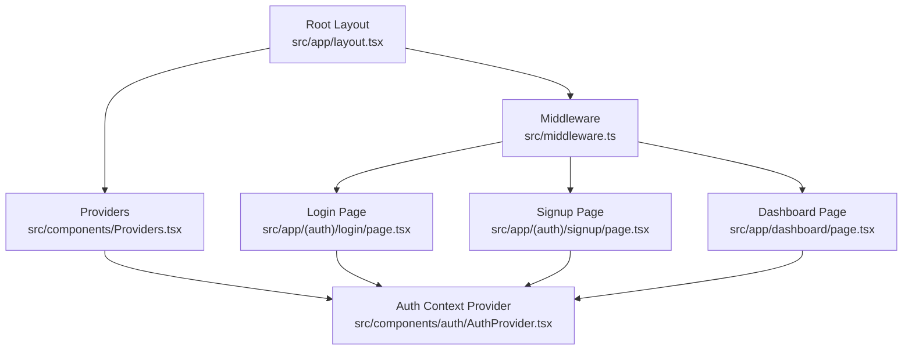
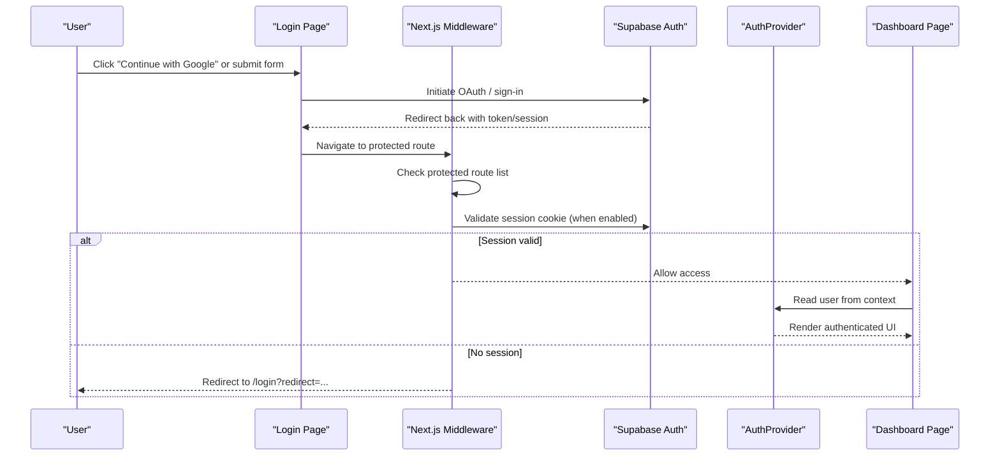
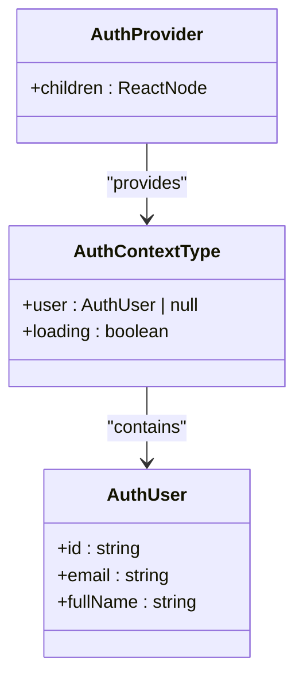
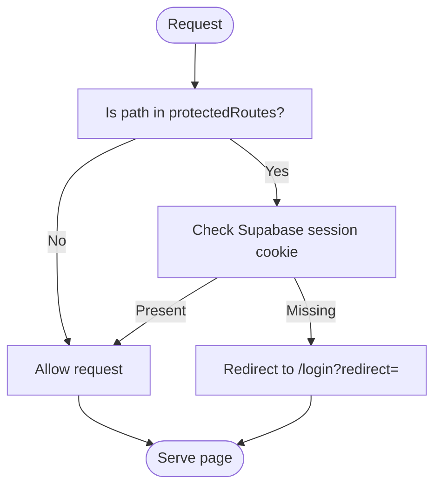
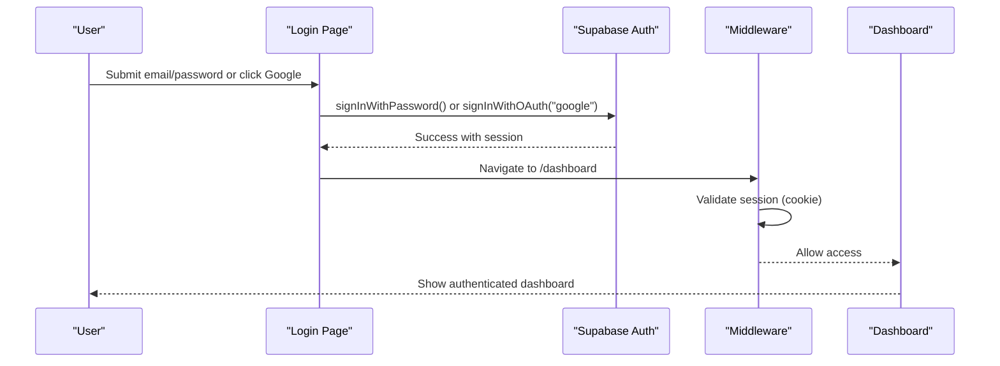
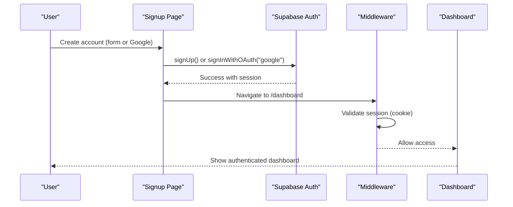
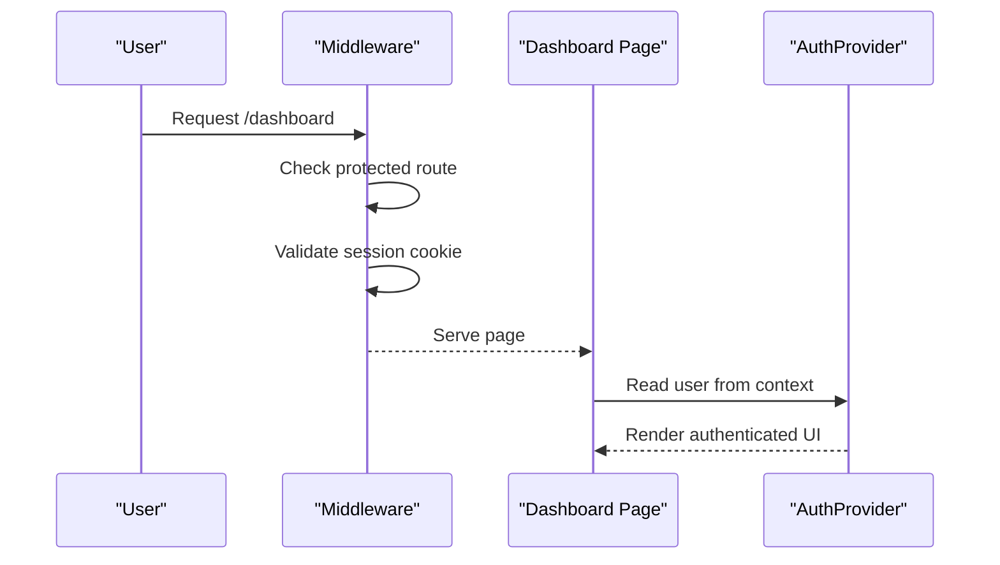
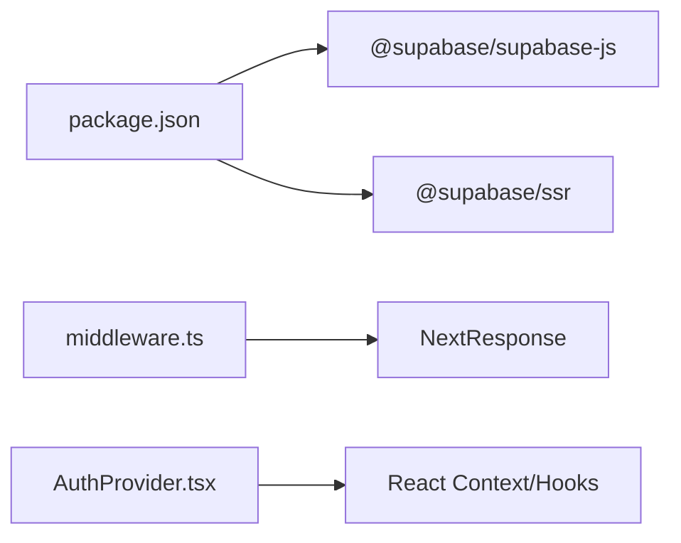

# Authentication System

<cite>
**Referenced Files in This Document**
- [AuthProvider.tsx](file://src/components/auth/AuthProvider.tsx)
- [middleware.ts](file://src/middleware.ts)
- [login/page.tsx](file://src/app/(auth)/login/page.tsx)
- [signup/page.tsx](file://src/app/(auth)/signup/page.tsx)
- [dashboard/page.tsx](file://src/app/dashboard/page.tsx)
- [layout.tsx](file://src/app/layout.tsx)
- [Providers.tsx](file://src/components/Providers.tsx)
- [package.json](file://package.json)
</cite>

## Table of Contents
1. [Introduction](#introduction)
2. [Project Structure](#project-structure)
3. [Core Components](#core-components)
4. [Architecture Overview](#architecture-overview)
5. [Detailed Component Analysis](#detailed-component-analysis)
6. [Dependency Analysis](#dependency-analysis)
7. [Performance Considerations](#performance-considerations)
8. [Troubleshooting Guide](#troubleshooting-guide)
9. [Conclusion](#conclusion)
10. [Appendices](#appendices)

## Introduction
This document explains MedAce AI’s authentication system built on Supabase Auth, focusing on:
- User registration and login flows with Google OAuth integration
- The AuthProvider context that manages user sessions and authentication state
- Middleware implementation for protecting routes and enforcing access control
- Examples for implementing protected pages, handling authentication callbacks, and managing sessions
- Error handling strategies for authentication failures, network issues, and invalid credentials
- Best practices for secure authentication, session management, and user privacy protection

The codebase currently includes UI scaffolding for login/signup (including Google OAuth buttons), a Next.js middleware placeholder for route protection, and an AuthProvider context designed to integrate with Supabase Auth.

## Project Structure
Authentication-related files are organized as follows:
- Authentication UI: login and signup pages under the auth route group
- Context provider: AuthProvider for global auth state
- Route protection: Next.js middleware for server-side checks
- App shell: root layout and providers that wrap the application

**Diagram sources**
- [layout.tsx:44-56](file://src/app/layout.tsx#L44-L56)
- [Providers.tsx:7-22](file://src/components/Providers.tsx#L7-L22)
- [AuthProvider.tsx:22-57](file://src/components/auth/AuthProvider.tsx#L22-L57)
- [middleware.ts:14-36](file://src/middleware.ts#L14-L36)
- [login/page.tsx:5-91](file://src/app/(auth)/login/page.tsx#L5-L91)
- [signup/page.tsx:5-103](file://src/app/(auth)/signup/page.tsx#L5-L103)
- [dashboard/page.tsx:21-239](file://src/app/dashboard/page.tsx#L21-L239)

**Section sources**
- [layout.tsx:44-56](file://src/app/layout.tsx#L44-L56)
- [Providers.tsx:7-22](file://src/components/Providers.tsx#L7-L22)
- [AuthProvider.tsx:22-57](file://src/components/auth/AuthProvider.tsx#L22-L57)
- [middleware.ts:14-36](file://src/middleware.ts#L14-L36)
- [login/page.tsx:5-91](file://src/app/(auth)/login/page.tsx#L5-L91)
- [signup/page.tsx:5-103](file://src/app/(auth)/signup/page.tsx#L5-L103)
- [dashboard/page.tsx:21-239](file://src/app/dashboard/page.tsx#L21-L239)

## Core Components
- AuthProvider context: Provides current user and loading state via React context; currently returns a mock user and includes comments indicating where to wire up Supabase’s onAuthStateChange listener.
- Next.js middleware: Defines protected and public routes and contains commented logic to enforce authentication by checking Supabase cookies when integrated.
- Login and Signup pages: Present UI for email/password and Google OAuth sign-in/sign-up flows; include “Continue with Google” buttons ready for integration.
- Dashboard page: Example of a protected route that displays authenticated content.

Key responsibilities:
- Manage global authentication state in the client app
- Enforce route-level access control on the server
- Provide UI hooks and components for authentication flows

**Section sources**
- [AuthProvider.tsx:11-57](file://src/components/auth/AuthProvider.tsx#L11-L57)
- [middleware.ts:4-36](file://src/middleware.ts#L4-L36)
- [login/page.tsx:25-75](file://src/app/(auth)/login/page.tsx#L25-L75)
- [signup/page.tsx:25-87](file://src/app/(auth)/signup/page.tsx#L25-L87)
- [dashboard/page.tsx:21-239](file://src/app/dashboard/page.tsx#L21-L239)

## Architecture Overview
High-level flow:
- Client-side: AuthProvider exposes user and loading state to all components. When Supabase is wired, it will listen to auth state changes and update the context accordingly.
- Server-side: Next.js middleware intercepts requests to protected routes and can redirect unauthenticated users to login.
- UI: Login and Signup pages present forms and Google OAuth buttons. On successful authentication, Supabase sets cookies and updates the client session.

**Diagram sources**
- [login/page.tsx:25-75](file://src/app/(auth)/login/page.tsx#L25-L75)
- [middleware.ts:14-36](file://src/middleware.ts#L14-L36)
- [AuthProvider.tsx:31-57](file://src/components/auth/AuthProvider.tsx#L31-L57)
- [dashboard/page.tsx:21-239](file://src/app/dashboard/page.tsx#L21-L239)

## Detailed Component Analysis

### AuthProvider Context
- Purpose: Centralizes authentication state (user and loading) for the entire app.
- Current behavior: Returns a mock user for frontend-only development.
- Integration point: Comments indicate how to replace mock state with Supabase’s onAuthStateChange to sync real sessions.

**Diagram sources**
- [AuthProvider.tsx:11-29](file://src/components/auth/AuthProvider.tsx#L11-L29)
- [AuthProvider.tsx:43-57](file://src/components/auth/AuthProvider.tsx#L43-L57)

**Section sources**
- [AuthProvider.tsx:11-57](file://src/components/auth/AuthProvider.tsx#L11-L57)

### Next.js Middleware for Route Protection
- Protected routes: /dashboard, /practice, /results, /study-plan, /profile
- Public routes: /, /login, /signup
- Behavior: Currently allows all routes through; includes commented logic to check Supabase session cookie and redirect unauthenticated users to /login with a redirect parameter.

**Diagram sources**
- [middleware.ts:4-36](file://src/middleware.ts#L4-L36)

**Section sources**
- [middleware.ts:4-36](file://src/middleware.ts#L4-L36)

### Login Flow (Email/Password and Google OAuth)
- UI: Email/password inputs and a “Continue with Google” button.
- Integration notes: The page is structured to call Supabase Auth methods for sign-in and OAuth. When implemented, success should redirect to a protected route (e.g., /dashboard).

**Diagram sources**
- [login/page.tsx:25-75](file://src/app/(auth)/login/page.tsx#L25-L75)
- [middleware.ts:14-36](file://src/middleware.ts#L14-L36)
- [dashboard/page.tsx:21-239](file://src/app/dashboard/page.tsx#L21-L239)

**Section sources**
- [login/page.tsx:25-75](file://src/app/(auth)/login/page.tsx#L25-L75)

### Signup Flow (Email/Password and Google OAuth)
- UI: Full name, email, password, confirm password fields, and a “Continue with Google” button.
- Integration notes: On successful registration or OAuth sign-up, redirect to /login or directly to /dashboard if auto-login is configured.

**Diagram sources**
- [signup/page.tsx:25-87](file://src/app/(auth)/signup/page.tsx#L25-L87)
- [middleware.ts:14-36](file://src/middleware.ts#L14-L36)
- [dashboard/page.tsx:21-239](file://src/app/dashboard/page.tsx#L21-L239)

**Section sources**
- [signup/page.tsx:25-87](file://src/app/(auth)/signup/page.tsx#L25-L87)

### Protected Pages Example (Dashboard)
- Demonstrates rendering authenticated content after passing middleware checks.
- Uses AppLayout and UI components to display user-specific data.

**Diagram sources**
- [middleware.ts:14-36](file://src/middleware.ts#L14-L36)
- [dashboard/page.tsx:21-239](file://src/app/dashboard/page.tsx#L21-L239)
- [AuthProvider.tsx:43-57](file://src/components/auth/AuthProvider.tsx#L43-L57)

**Section sources**
- [dashboard/page.tsx:21-239](file://src/app/dashboard/page.tsx#L21-L239)

## Dependency Analysis
- Dependencies relevant to authentication:
  - @supabase/supabase-js and @supabase/ssr are included in dependencies, enabling Supabase client and SSR utilities.
  - Next.js middleware uses NextResponse for redirects.
  - React context and hooks power client-side auth state.

**Diagram sources**
- [package.json:11-27](file://package.json#L11-L27)
- [middleware.ts:1-2](file://src/middleware.ts#L1-L2)
- [AuthProvider.tsx:3-9](file://src/components/auth/AuthProvider.tsx#L3-L9)

**Section sources**
- [package.json:11-27](file://package.json#L11-L27)
- [middleware.ts:1-2](file://src/middleware.ts#L1-L2)
- [AuthProvider.tsx:3-9](file://src/components/auth/AuthProvider.tsx#L3-L9)

## Performance Considerations
- Minimize re-renders: Keep AuthProvider lightweight; only expose minimal user fields needed by components.
- Defer heavy work: Perform non-critical operations after initial render to avoid blocking UI.
- Efficient routing: Use Next.js middleware to prevent unnecessary client-side navigation to protected routes.
- Network resilience: Implement retries and timeouts for auth calls; cache user session locally via Supabase cookies to reduce redundant checks.

[No sources needed since this section provides general guidance]

## Troubleshooting Guide
Common issues and resolutions:
- Unauthenticated access to protected routes:
  - Ensure middleware is enabled and Supabase session cookie is present.
  - Verify protectedRoutes list matches your actual routes.
- Google OAuth not working:
  - Confirm Google provider is enabled in Supabase project settings.
  - Ensure correct redirect URLs are configured in both Supabase and Google Console.
- Session not persisting:
  - Check browser cookies for Supabase tokens.
  - Ensure SSR setup is correct using @supabase/ssr if server-side checks are used.
- Invalid credentials:
  - Handle error responses from Supabase and show user-friendly messages.
- Network errors:
  - Implement retry logic and user feedback for connectivity issues.

**Section sources**
- [middleware.ts:14-36](file://src/middleware.ts#L14-L36)
- [AuthProvider.tsx:31-57](file://src/components/auth/AuthProvider.tsx#L31-L57)

## Conclusion
MedAce AI’s authentication system is scaffolded for Supabase Auth with:
- A client-side AuthProvider context ready to manage sessions
- Next.js middleware prepared to enforce route protection
- Login and Signup pages with Google OAuth UI elements
To complete the implementation:
- Wire Supabase client and SSR utilities
- Replace mock user in AuthProvider with real session state
- Enable middleware session checks and handle redirects
- Add robust error handling and user feedback for all auth flows

[No sources needed since this section summarizes without analyzing specific files]

## Appendices

### Implementation Checklist
- Initialize Supabase client and configure environment variables
- Integrate Supabase Auth in AuthProvider using onAuthStateChange
- Enable Google OAuth in Supabase and configure redirect URIs
- Activate middleware session validation and redirect logic
- Add error handling for failed sign-ins, network issues, and invalid credentials
- Test protected routes and ensure proper redirection

[No sources needed since this section provides general guidance]