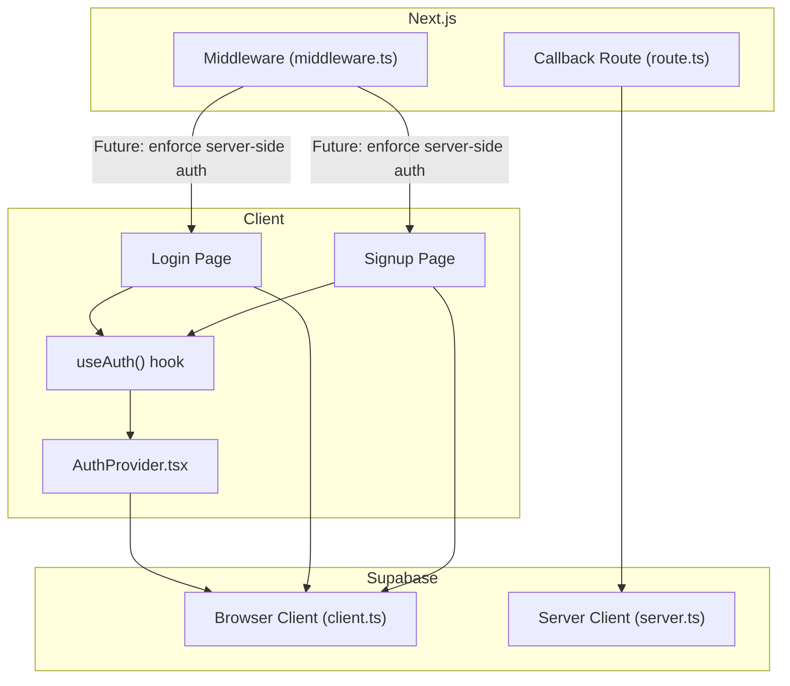
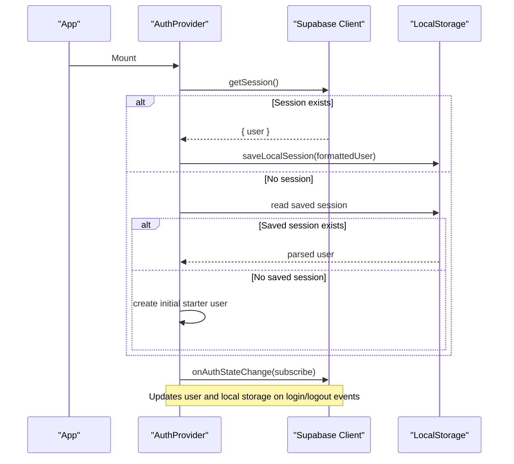
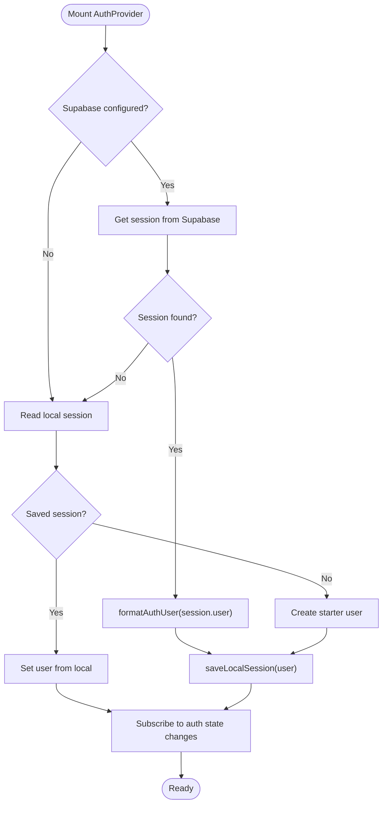
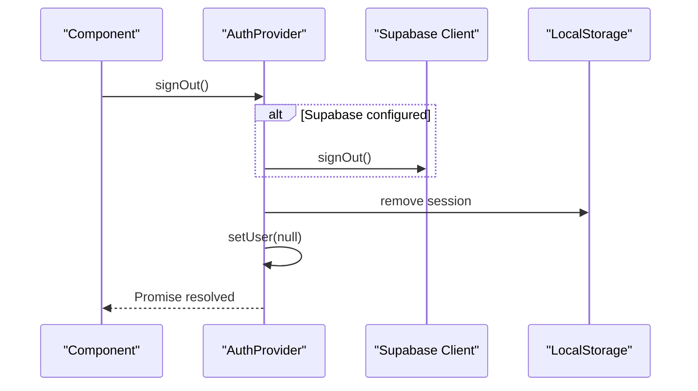
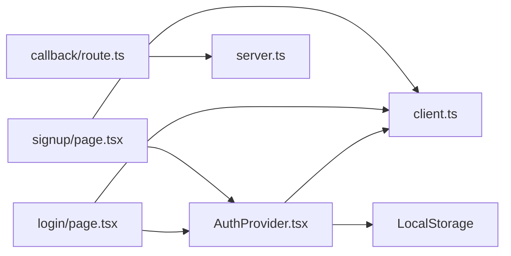

# Auth Provider Implementation

<cite>
**Referenced Files in This Document**
- [AuthProvider.tsx](file://src/components/auth/AuthProvider.tsx)
- [client.ts](file://src/lib/supabase/client.ts)
- [server.ts](file://src/lib/supabase/server.ts)
- [login/page.tsx](file://src/app/(auth)/login/page.tsx)
- [signup/page.tsx](file://src/app/(auth)/signup/page.tsx)
- [callback/route.ts](file://src/app/auth/callback/route.ts)
- [middleware.ts](file://src/middleware.ts)
</cite>

## Table of Contents
1. Introduction
2. Project Structure
3. Core Components
4. Architecture Overview
5. Detailed Component Analysis
6. Dependency Analysis
7. Performance Considerations
8. Troubleshooting Guide
9. Conclusion

## Introduction
This document explains the AuthProvider component implementation that manages global authentication state using React Context and integrates with Supabase for session handling. It covers the AuthUser interface, useState-based state management, normalization of Supabase user data via formatAuthUser, sign-out behavior including Supabase client integration and local session cleanup, and usage patterns such as the useAuth hook, protected routes, and loading states. It also addresses error handling strategies, fallback mechanisms when Supabase is unavailable, and debugging techniques for authentication issues.

## Project Structure
The authentication system spans a few key areas:
- Client-side context provider and hooks for global auth state
- Supabase client configuration for browser and server contexts
- Authentication UI pages (login/signup) that integrate with the context
- A Next.js route handler for OAuth callback exchange
- Middleware placeholder for future server-side route protection

**Diagram sources**
- [AuthProvider.tsx:1-208](file://src/components/auth/AuthProvider.tsx#L1-L208)
- [client.ts:1-9](file://src/lib/supabase/client.ts#L1-L9)
- [server.ts:1-27](file://src/lib/supabase/server.ts#L1-L27)
- [login/page.tsx:1-338](file://src/app/(auth)/login/page.tsx#L1-L338)
- [signup/page.tsx:1-365](file://src/app/(auth)/signup/page.tsx#L1-L365)
- [callback/route.ts:1-31](file://src/app/auth/callback/route.ts#L1-L31)
- [middleware.ts:1-40](file://src/middleware.ts#L1-L40)

**Section sources**
- [AuthProvider.tsx:1-208](file://src/components/auth/AuthProvider.tsx#L1-L208)
- [client.ts:1-9](file://src/lib/supabase/client.ts#L1-L9)
- [server.ts:1-27](file://src/lib/supabase/server.ts#L1-L27)
- [login/page.tsx:1-338](file://src/app/(auth)/login/page.tsx#L1-L338)
- [signup/page.tsx:1-365](file://src/app/(auth)/signup/page.tsx#L1-L365)
- [callback/route.ts:1-31](file://src/app/auth/callback/route.ts#L1-L31)
- [middleware.ts:1-40](file://src/middleware.ts#L1-L40)

## Core Components
- AuthProvider: Provides global authentication state via React Context, initializes sessions from Supabase or local storage, listens to auth state changes, and exposes actions like signOut, updateUser, and setUser.
- useAuth: A custom hook that returns the current auth context value for consuming components.
- Supabase clients: Browser client for client-side operations; server client for server-side operations and OAuth code exchange.
- Login/Signup pages: Use the context to set user state on successful authentication and handle fallbacks when Supabase is not configured.
- Callback route: Exchanges an authorization code for a session on the server side during OAuth flows.
- Middleware: Placeholder for future server-side route protection.

Key responsibilities:
- Normalize Supabase user data into a consistent AuthUser shape
- Persist user session locally for resilience and quick startup
- Maintain a loading flag to prevent UI flicker while initializing auth
- Provide robust fallbacks when Supabase is unavailable

**Section sources**
- [AuthProvider.tsx:13-39](file://src/components/auth/AuthProvider.tsx#L13-L39)
- [client.ts:1-9](file://src/lib/supabase/client.ts#L1-L9)
- [server.ts:1-27](file://src/lib/supabase/server.ts#L1-L27)
- [login/page.tsx:30-98](file://src/app/(auth)/login/page.tsx#L30-L98)
- [signup/page.tsx:32-108](file://src/app/(auth)/signup/page.tsx#L32-L108)
- [callback/route.ts:4-31](file://src/app/auth/callback/route.ts#L4-L31)
- [middleware.ts:4-35](file://src/middleware.ts#L4-L35)

## Architecture Overview
The authentication architecture combines React Context for global state with Supabase for session management and persistence. The provider initializes by attempting to load a session from Supabase; if unavailable, it falls back to a local session or a starter session. It subscribes to auth state changes to keep the UI in sync.

**Diagram sources**
- [AuthProvider.tsx:114-200](file://src/components/auth/AuthProvider.tsx#L114-L200)
- [client.ts:1-9](file://src/lib/supabase/client.ts#L1-L9)

## Detailed Component Analysis

### AuthProvider: Global Authentication State
- Context and Hook:
  - Defines AuthContext with user, loading, signOut, updateUser, setUser.
  - Exposes useAuth to consume context in any descendant component.
- State Management:
  - Uses useState for user and loading flags.
  - Persists user to localStorage under a dedicated key whenever user changes.
- Initialization Flow:
  - Attempts to fetch session from Supabase if configured.
  - On success, normalizes user via formatAuthUser and persists locally.
  - If no Supabase session, checks local storage for a previous session.
  - If still none, creates a starter session to avoid blank UI.
  - Subscribes to auth state changes to update state on login/logout events.
- Sign Out:
  - Calls Supabase signOut when configured; always clears local/session storage and resets context user.
- Error Handling:
  - Logs errors during initialization and sign out.
  - Gracefully falls back to local storage or starter session when Supabase is unavailable.

**Diagram sources**
- [AuthProvider.tsx:43-200](file://src/components/auth/AuthProvider.tsx#L43-L200)

**Section sources**
- [AuthProvider.tsx:13-39](file://src/components/auth/AuthProvider.tsx#L13-L39)
- [AuthProvider.tsx:43-200](file://src/components/auth/AuthProvider.tsx#L43-L200)

### AuthUser Interface and Normalization
- AuthUser fields:
  - id: string
  - email: string
  - fullName: string
  - avatarUrl?: string
  - provider?: string
- formatAuthUser:
  - Extracts full name from multiple metadata keys with fallbacks.
  - Derives avatar URL from metadata if present.
  - Sets provider based on app metadata or defaults to email.

Usage examples:
- Called during session retrieval and auth state change callbacks to ensure a consistent user shape across the app.

**Section sources**
- [AuthProvider.tsx:13-19](file://src/components/auth/AuthProvider.tsx#L13-L19)
- [AuthProvider.tsx:47-65](file://src/components/auth/AuthProvider.tsx#L47-L65)

### Sign-Out Functionality
- Behavior:
  - If Supabase is configured, calls signOut on the Supabase client.
  - Always clears local storage and session storage.
  - Resets user to null in context.
- Error Handling:
  - Catches and logs errors during sign-out.

**Diagram sources**
- [AuthProvider.tsx:91-112](file://src/components/auth/AuthProvider.tsx#L91-L112)

**Section sources**
- [AuthProvider.tsx:91-112](file://src/components/auth/AuthProvider.tsx#L91-L112)

### Using useAuth in Components
- Accessing state:
  - Consume user, loading, signOut, updateUser, setUser via useAuth().
- Example patterns:
  - Protected UI rendering based on user presence.
  - Displaying a spinner while loading is true.
  - Triggering signOut on logout buttons.

Note: The login and signup pages demonstrate setting user state directly after successful authentication flows and navigating to protected routes.

**Section sources**
- [AuthProvider.tsx:37-39](file://src/components/auth/AuthProvider.tsx#L37-L39)
- [login/page.tsx:18-98](file://src/app/(auth)/login/page.tsx#L18-L98)
- [signup/page.tsx:18-108](file://src/app/(auth)/signup/page.tsx#L18-L108)

### Protected Routes
- Current state:
  - Middleware defines protected routes but does not enforce them yet; all routes are allowed through.
- Future enforcement:
  - Can be enabled by checking Supabase session cookies server-side and redirecting unauthenticated users to login.

**Section sources**
- [middleware.ts:4-35](file://src/middleware.ts#L4-L35)

### OAuth Callback Handling
- Server-side route exchanges an authorization code for a session using the server Supabase client.
- Redirects to the intended destination after successful exchange or falls back to default redirection.

**Section sources**
- [callback/route.ts:4-31](file://src/app/auth/callback/route.ts#L4-L31)
- [server.ts:1-27](file://src/lib/supabase/server.ts#L1-L27)

## Dependency Analysis
- AuthProvider depends on:
  - React Context and hooks for state management
  - Supabase browser client for session retrieval and auth state subscription
  - LocalStorage for persistence and fallback
- Login/Signup pages depend on:
  - useAuth to set user state post-authentication
  - Supabase browser client for direct auth calls when needed
- Callback route depends on:
  - Supabase server client for secure code exchange

**Diagram sources**
- [AuthProvider.tsx:1-208](file://src/components/auth/AuthProvider.tsx#L1-L208)
- [client.ts:1-9](file://src/lib/supabase/client.ts#L1-L9)
- [server.ts:1-27](file://src/lib/supabase/server.ts#L1-L27)
- [login/page.tsx:1-338](file://src/app/(auth)/login/page.tsx#L1-L338)
- [signup/page.tsx:1-365](file://src/app/(auth)/signup/page.tsx#L1-L365)
- [callback/route.ts:1-31](file://src/app/auth/callback/route.ts#L1-L31)

**Section sources**
- [AuthProvider.tsx:1-208](file://src/components/auth/AuthProvider.tsx#L1-L208)
- [client.ts:1-9](file://src/lib/supabase/client.ts#L1-L9)
- [server.ts:1-27](file://src/lib/supabase/server.ts#L1-L27)
- [login/page.tsx:1-338](file://src/app/(auth)/login/page.tsx#L1-L338)
- [signup/page.tsx:1-365](file://src/app/(auth)/signup/page.tsx#L1-L365)
- [callback/route.ts:1-31](file://src/app/auth/callback/route.ts#L1-L31)

## Performance Considerations
- Minimize re-renders:
  - Memoize setters with useCallback to avoid unnecessary updates.
- Efficient state updates:
  - Use functional setState to merge partial updates safely.
- Avoid blocking UI:
  - Keep loading state minimal; initialize UI with a starter session when needed.
- Local storage usage:
  - Store only necessary user fields to reduce payload size.

[No sources needed since this section provides general guidance]

## Troubleshooting Guide
Common issues and strategies:
- Supabase not configured:
  - The provider detects placeholder URLs and falls back to local storage or a starter session.
  - Login/Signup pages detect placeholder configuration and simulate authentication for development.
- Network or API errors:
  - Errors are logged; fallback paths ensure the app remains usable.
  - In login/signup, specific error messages trigger fallback behavior to maintain UX.
- Debugging tips:
  - Inspect local storage for the session key to verify persistence.
  - Check console logs for initialization and sign-out errors.
  - Verify environment variables for Supabase URL and keys.
- Enabling server-side protection:
  - Uncomment middleware logic to check Supabase session cookies and redirect unauthenticated users.

**Section sources**
- [AuthProvider.tsx:117-192](file://src/components/auth/AuthProvider.tsx#L117-L192)
- [login/page.tsx:35-98](file://src/app/(auth)/login/page.tsx#L35-L98)
- [signup/page.tsx:42-108](file://src/app/(auth)/signup/page.tsx#L42-L108)
- [middleware.ts:22-33](file://src/middleware.ts#L22-L33)

## Conclusion
The AuthProvider establishes a resilient, context-driven authentication layer that integrates with Supabase while providing robust fallbacks for development and offline scenarios. It standardizes user data, persists sessions locally, and keeps the UI synchronized with auth state changes. With clear separation between client and server Supabase clients and a structured approach to error handling, the implementation supports both immediate usability and future enhancements such as server-side route protection.

[No sources needed since this section summarizes without analyzing specific files]