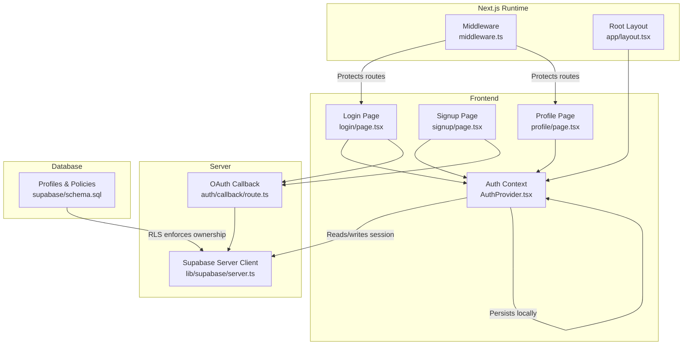
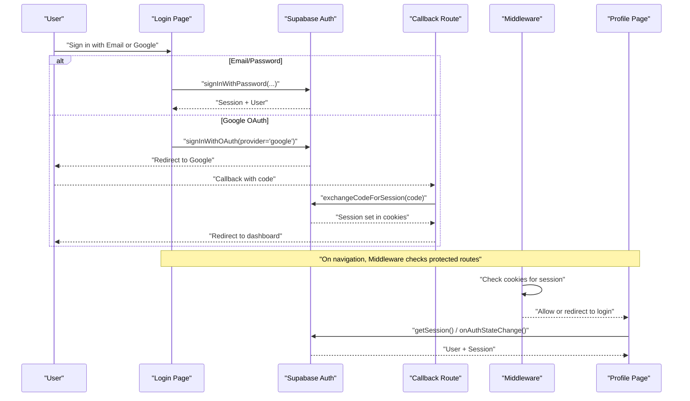
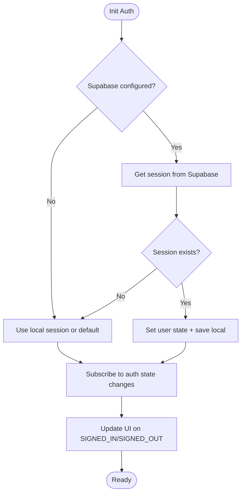
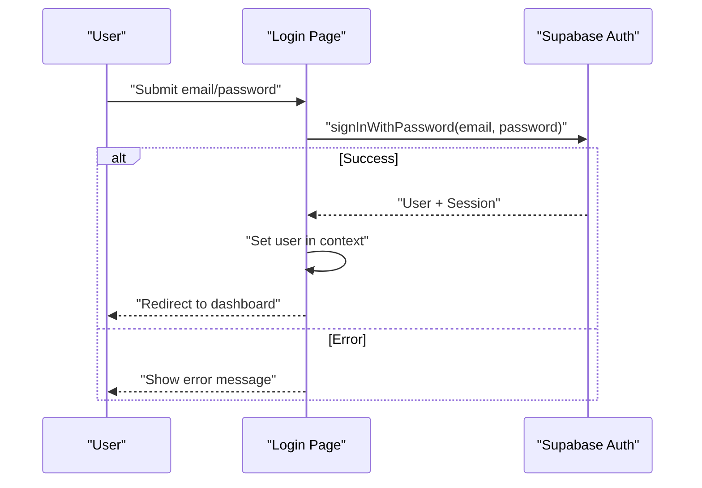
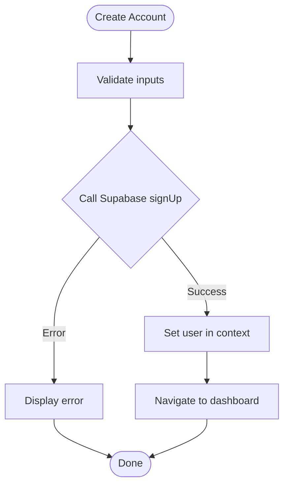
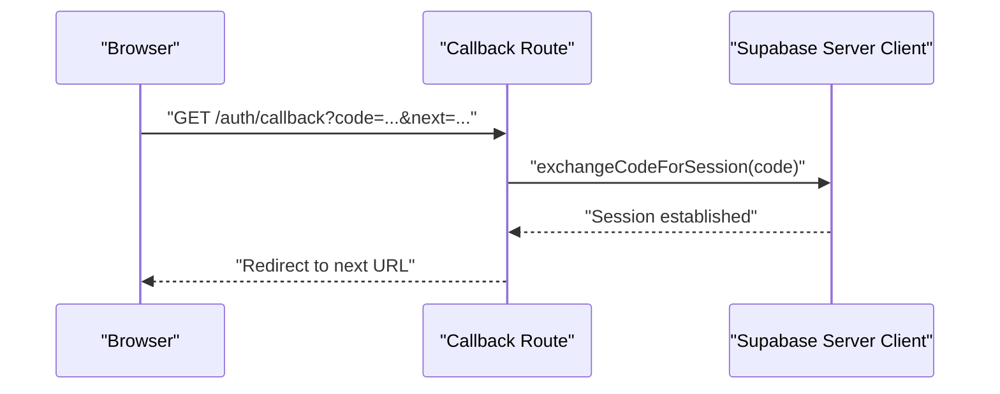
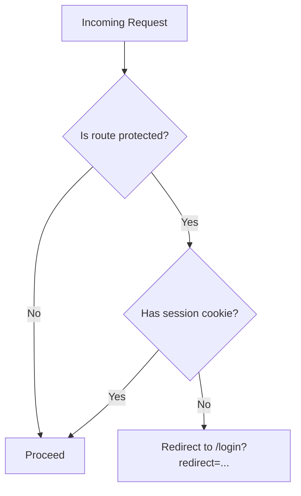
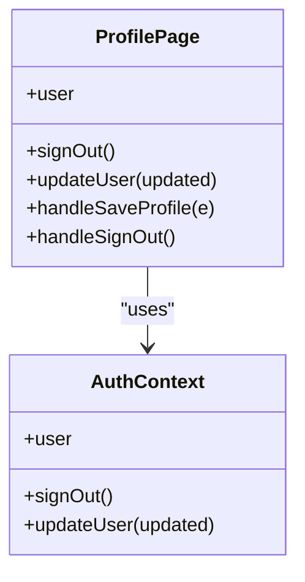
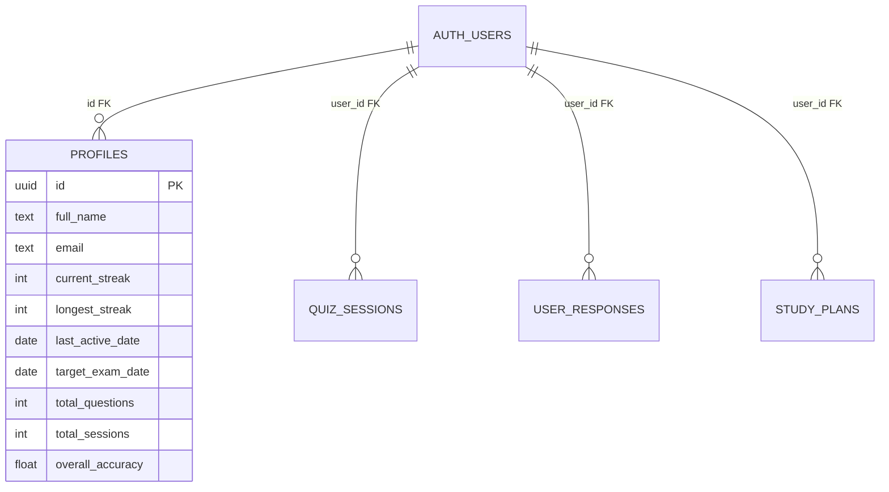
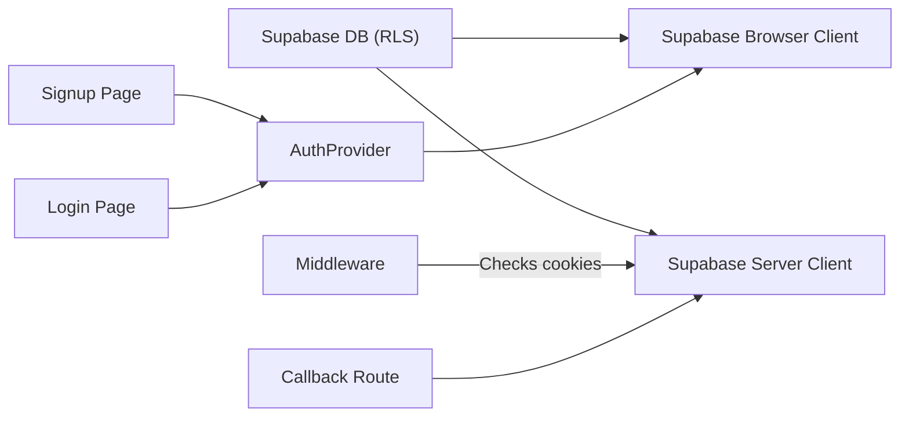

# Authentication System

<cite>
**Referenced Files in This Document**
- [middleware.ts](file://src/middleware.ts)
- [route.ts](file://src/app/auth/callback/route.ts)
- [AuthProvider.tsx](file://src/components/auth/AuthProvider.tsx)
- [login/page.tsx](file://src/app/(auth)/login/page.tsx)
- [signup/page.tsx](file://src/app/(auth)/signup/page.tsx)
- [profile/page.tsx](file://src/app/profile/page.tsx)
- [server.ts](file://src/lib/supabase/server.ts)
- [client.ts](file://src/lib/supabase/client.ts)
- [admin.ts](file://src/lib/supabase/admin.ts)
- [schema.sql](file://supabase/schema.sql)
- [layout.tsx](file://src/app/layout.tsx)
- [Providers.tsx](file://src/components/Providers.tsx)
- [package.json](file://package.json)
</cite>

## Table of Contents
1. Introduction
2. Project Structure
3. Core Components
4. Architecture Overview
5. Detailed Component Analysis
6. Dependency Analysis
7. Performance Considerations
8. Troubleshooting Guide
9. Conclusion
10. Appendices

## Introduction
This document explains MedAce-AI’s authentication system built on Supabase Auth with Google OAuth integration. It covers the complete flow from user registration and login to session management, profile handling, and route protection. It also documents the PKCE-based OAuth callback handler, local session storage mechanisms, middleware for protecting routes, security considerations (token handling, CSRF, cookies), and guidance for adding new providers, implementing role-based access control, and handling errors gracefully. Testing strategies and debugging techniques are included for both development and production.

## Project Structure
The authentication system spans several layers:
- Frontend auth context and UI flows: AuthProvider and login/signup pages
- Server-side OAuth callback and Supabase client setup for server components
- Middleware for route protection
- Database schema for profiles and RLS policies
- App layout wiring providers that include auth state

**Diagram sources**
- [AuthProvider.tsx:1-208](file://src/components/auth/AuthProvider.tsx#L1-L208)
- [login/page.tsx:1-338](file://src/app/(auth)/login/page.tsx#L1-L338)
- [signup/page.tsx:1-365](file://src/app/(auth)/signup/page.tsx#L1-L365)
- [route.ts:1-32](file://src/app/auth/callback/route.ts#L1-L32)
- [server.ts:1-27](file://src/lib/supabase/server.ts#L1-L27)
- [middleware.ts:1-41](file://src/middleware.ts#L1-L41)
- [schema.sql:10-250](file://supabase/schema.sql#L10-L250)
- [layout.tsx:44-57](file://src/app/layout.tsx#L44-L57)

**Section sources**
- [layout.tsx:44-57](file://src/app/layout.tsx#L44-L57)
- [Providers.tsx:1-23](file://src/components/Providers.tsx#L1-L23)
- [package.json:11-28](file://package.json#L11-L28)

## Core Components
- AuthProvider: Central React context managing user state, sign-out, updates, and persistence via localStorage and Supabase session events.
- Login/Signup Pages: Handle email/password flows and provide a placeholder Google modal; when Supabase is configured, they call Supabase Auth APIs.
- OAuth Callback: Exchanges authorization code for a session using Supabase’s PKCE flow and redirects back to the app.
- Server Client: Creates a Supabase server client with cookie handling for server components and API routes.
- Middleware: Defines protected/public routes and includes placeholders for enforcing session checks via cookies.
- Profile Page: Displays user info, allows editing name/email, shows provider source, and integrates with progress stats.
- Schema: Defines profiles table, RLS policies, and a trigger to auto-create profiles on signup.

**Section sources**
- [AuthProvider.tsx:13-208](file://src/components/auth/AuthProvider.tsx#L13-L208)
- [login/page.tsx:30-114](file://src/app/(auth)/login/page.tsx#L30-L114)
- [signup/page.tsx:32-124](file://src/app/(auth)/signup/page.tsx#L32-L124)
- [route.ts:4-31](file://src/app/auth/callback/route.ts#L4-L31)
- [server.ts:4-27](file://src/lib/supabase/server.ts#L4-L27)
- [middleware.ts:4-35](file://src/middleware.ts#L4-L35)
- [profile/page.tsx:24-84](file://src/app/profile/page.tsx#L24-L84)
- [schema.sql:10-250](file://supabase/schema.sql#L10-L250)

## Architecture Overview
The authentication architecture combines frontend state management with Supabase Auth and Next.js runtime features:

- Client-side:
  - AuthProvider initializes by checking Supabase session and falls back to localStorage if needed.
  - Subscribes to auth state changes to keep UI in sync.
  - Persists user data locally for resilience and quick load.

- Server-side:
  - OAuth callback exchanges the authorization code for a session using Supabase’s server client.
  - Sets cookies via Supabase SSR cookie helpers so subsequent requests carry the session.

- Route protection:
  - Middleware lists protected routes and can enforce session checks by reading Supabase cookies.

- Data layer:
  - Profiles table stores user metadata and performance metrics.
  - Row Level Security ensures users can only access their own data.

**Diagram sources**
- [login/page.tsx:30-114](file://src/app/(auth)/login/page.tsx#L30-L114)
- [route.ts:4-31](file://src/app/auth/callback/route.ts#L4-L31)
- [middleware.ts:14-35](file://src/middleware.ts#L14-L35)
- [AuthProvider.tsx:114-166](file://src/components/auth/AuthProvider.tsx#L114-L166)

## Detailed Component Analysis

### AuthProvider (Client Session Management)
- Responsibilities:
  - Initialize session from Supabase and persist to localStorage.
  - Subscribe to auth state changes to update UI and local storage.
  - Provide signOut and updateUser functions.
  - Format user object from Supabase user metadata into a consistent shape.

- Local storage strategy:
  - Uses a dedicated key to store serialized user data.
  - Clears storage on sign out and invalidates on errors.

- Error handling:
  - Logs errors during initialization and sign out.
  - Falls back to a default starter session when Supabase is not configured.

**Diagram sources**
- [AuthProvider.tsx:114-192](file://src/components/auth/AuthProvider.tsx#L114-L192)

**Section sources**
- [AuthProvider.tsx:13-208](file://src/components/auth/AuthProvider.tsx#L13-L208)

### Login Page (Email/Password and Google Placeholder)
- Email/Password:
  - Calls Supabase signInWithPassword when configured.
  - On network/API errors, falls back to a local session for development continuity.
  - Updates global user state and navigates to dashboard.

- Google OAuth:
  - Currently opens a modal to collect name/email for a local mock flow.
  - When Supabase is configured, integrate with Supabase’s OAuth flow to redirect to Google and handle callback.

**Diagram sources**
- [login/page.tsx:30-98](file://src/app/(auth)/login/page.tsx#L30-L98)

**Section sources**
- [login/page.tsx:30-114](file://src/app/(auth)/login/page.tsx#L30-L114)

### Signup Page (Account Creation)
- Validates password confirmation.
- Calls Supabase signUp with full_name in options when configured.
- On success, sets user in context and navigates to dashboard.
- Provides a similar Google placeholder modal as login.

**Diagram sources**
- [signup/page.tsx:32-108](file://src/app/(auth)/signup/page.tsx#L32-L108)

**Section sources**
- [signup/page.tsx:32-124](file://src/app/(auth)/signup/page.tsx#L32-L124)

### OAuth Callback Handler (PKCE Authorization Code Exchange)
- Extracts authorization code and next path from query parameters.
- Uses Supabase server client to exchange code for session.
- Handles environment-specific redirects (development vs production).
- Redirects back to the original destination after successful exchange.

**Diagram sources**
- [route.ts:4-31](file://src/app/auth/callback/route.ts#L4-L31)

**Section sources**
- [route.ts:4-31](file://src/app/auth/callback/route.ts#L4-L31)

### Middleware (Route Protection)
- Lists protected and public routes.
- For protected routes, includes commented logic to check Supabase access token cookie and redirect to login if missing.
- Intended to be enabled in production once Supabase auth is wired up.

**Diagram sources**
- [middleware.ts:4-35](file://src/middleware.ts#L4-L35)

**Section sources**
- [middleware.ts:4-35](file://src/middleware.ts#L4-L35)

### Profile Page (User Metadata and Preferences)
- Displays current user’s name, email, and provider source.
- Allows editing full name and email, persisted via context/local storage.
- Integrates with progress stats and provides sign-out functionality.

**Diagram sources**
- [profile/page.tsx:24-84](file://src/app/profile/page.tsx#L24-L84)
- [AuthProvider.tsx:21-27](file://src/components/auth/AuthProvider.tsx#L21-L27)

**Section sources**
- [profile/page.tsx:24-84](file://src/app/profile/page.tsx#L24-L84)

### Supabase Clients (Server and Browser)
- Server client:
  - Uses createServerClient with cookie store to read/write session cookies in server components and API routes.
- Browser client:
  - Uses createBrowserClient for client-side operations and session management.
- Admin client:
  - Service role client for privileged operations (e.g., background tasks), with session persistence disabled.

**Section sources**
- [server.ts:4-27](file://src/lib/supabase/server.ts#L4-L27)
- [client.ts:3-8](file://src/lib/supabase/client.ts#L3-L8)
- [admin.ts:3-21](file://src/lib/supabase/admin.ts#L3-L21)

### Database Schema and Security (Profiles and RLS)
- Profiles table stores user metadata and performance stats.
- RLS policies ensure users can only access their own data.
- Trigger automatically creates a profile record upon user signup.

**Diagram sources**
- [schema.sql:10-250](file://supabase/schema.sql#L10-L250)

**Section sources**
- [schema.sql:10-250](file://supabase/schema.sql#L10-L250)

## Dependency Analysis
Key dependencies and relationships:
- AuthProvider depends on Supabase browser client and manages local storage.
- Login/Signup pages depend on AuthProvider and Supabase client for auth actions.
- OAuth callback depends on Supabase server client for secure code exchange.
- Middleware depends on Next.js request/response and will depend on Supabase cookies when enabled.
- Schema defines RLS policies that protect data accessed via Supabase clients.

**Diagram sources**
- [AuthProvider.tsx:114-166](file://src/components/auth/AuthProvider.tsx#L114-L166)
- [client.ts:3-8](file://src/lib/supabase/client.ts#L3-L8)
- [server.ts:4-27](file://src/lib/supabase/server.ts#L4-L27)
- [route.ts:4-31](file://src/app/auth/callback/route.ts#L4-L31)
- [middleware.ts:14-35](file://src/middleware.ts#L14-L35)
- [schema.sql:153-250](file://supabase/schema.sql#L153-L250)

**Section sources**
- [package.json:11-28](file://package.json#L11-L28)

## Performance Considerations
- Minimize re-renders by keeping user state centralized in AuthProvider and updating via context.
- Use Supabase’s onAuthStateChange to avoid polling sessions.
- Prefer server-side session checks in middleware to reduce unnecessary client-side redirects.
- Cache non-sensitive profile data where appropriate and rely on RLS for data integrity.
- Avoid storing sensitive tokens in localStorage; rely on Supabase-managed cookies for sessions.

[No sources needed since this section provides general guidance]

## Troubleshooting Guide
Common issues and resolutions:
- Supabase not configured:
  - The app falls back to local sessions; verify environment variables for NEXT_PUBLIC_SUPABASE_URL and NEXT_PUBLIC_SUPABASE_ANON_KEY.
- OAuth callback failures:
  - Ensure the callback URL is registered in Supabase and matches your domain.
  - Check that exchangeCodeForSession is called and logs any errors.
- Middleware not protecting routes:
  - Enable the commented session check in middleware and ensure cookies are set by Supabase SSR.
- Profile updates not persisting:
  - Confirm updateUser is called and that localStorage is writable; check for errors in the console.
- RLS policy errors:
  - Verify that the user is authenticated and that policies allow access to requested resources.

**Section sources**
- [AuthProvider.tsx:167-192](file://src/components/auth/AuthProvider.tsx#L167-L192)
- [route.ts:24-31](file://src/app/auth/callback/route.ts#L24-L31)
- [middleware.ts:22-35](file://src/middleware.ts#L22-L35)
- [schema.sql:153-250](file://supabase/schema.sql#L153-L250)

## Conclusion
MedAce-AI’s authentication system leverages Supabase Auth with a robust client-server separation. The AuthProvider centralizes session state and persistence, while the OAuth callback securely exchanges codes for sessions. Middleware is prepared to enforce route protection via cookies. The database schema and RLS policies ensure data isolation. With proper environment configuration, the system supports email/password and Google OAuth flows, with clear paths to extend to additional providers and implement role-based access control.

[No sources needed since this section summarizes without analyzing specific files]

## Appendices

### Adding a New Authentication Provider
Steps:
- Configure the provider in Supabase Dashboard (e.g., GitHub, Apple).
- In login/signup pages, add a button that calls supabase.auth.signInWithOAuth({ provider }).
- Ensure the callback URL is whitelisted in Supabase and handled by the existing callback route.
- Test the flow and verify session establishment and redirection.

[No sources needed since this section provides general guidance]

### Implementing Role-Based Access Control (RBAC)
Approach:
- Add a roles column to the profiles table and populate it based on user attributes or admin assignment.
- Create RLS policies that check the user’s role for sensitive operations.
- Extend middleware or server-side checks to enforce role-based permissions before processing requests.

**Section sources**
- [schema.sql:10-250](file://supabase/schema.sql#L10-L250)

### Handling Authentication Errors Gracefully
Patterns:
- Catch and display user-friendly messages for invalid credentials or network errors.
- Fall back to local sessions in development to maintain workflow continuity.
- Log detailed errors for debugging while avoiding exposing sensitive details to users.

**Section sources**
- [login/page.tsx:59-98](file://src/app/(auth)/login/page.tsx#L59-L98)
- [signup/page.tsx:69-108](file://src/app/(auth)/signup/page.tsx#L69-L108)

### Testing Strategies for Authentication Flows
- Unit tests:
  - Mock Supabase client methods (signInWithPassword, signUp, signInWithOAuth, getSession).
  - Assert user state updates and navigation behavior in login/signup pages.
- Integration tests:
  - Use a test Supabase project to validate OAuth callback and session establishment.
  - Test middleware redirection for protected routes with and without valid cookies.
- E2E tests:
  - Simulate full flows: signup, email login, Google OAuth, profile updates, sign out.

[No sources needed since this section provides general guidance]

### Debugging Techniques
- Development:
  - Inspect localStorage for medace_user_session entries.
  - Check browser console for Supabase errors and network requests.
  - Temporarily enable middleware session checks to verify cookie presence.
- Production:
  - Monitor server logs for callback errors and session exchange failures.
  - Validate environment variables and callback URLs in Supabase Dashboard.
  - Use Supabase logs to trace auth events and policy denials.

**Section sources**
- [AuthProvider.tsx:167-192](file://src/components/auth/AuthProvider.tsx#L167-L192)
- [route.ts:24-31](file://src/app/auth/callback/route.ts#L24-L31)
- [middleware.ts:22-35](file://src/middleware.ts#L22-L35)