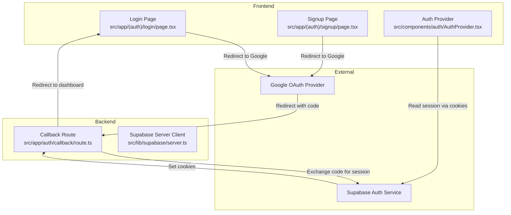
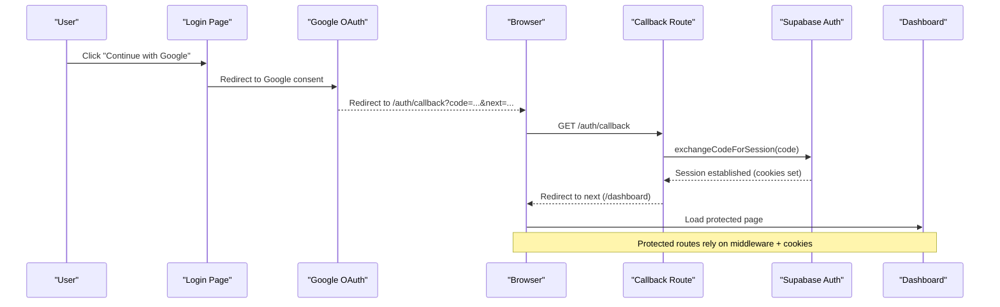
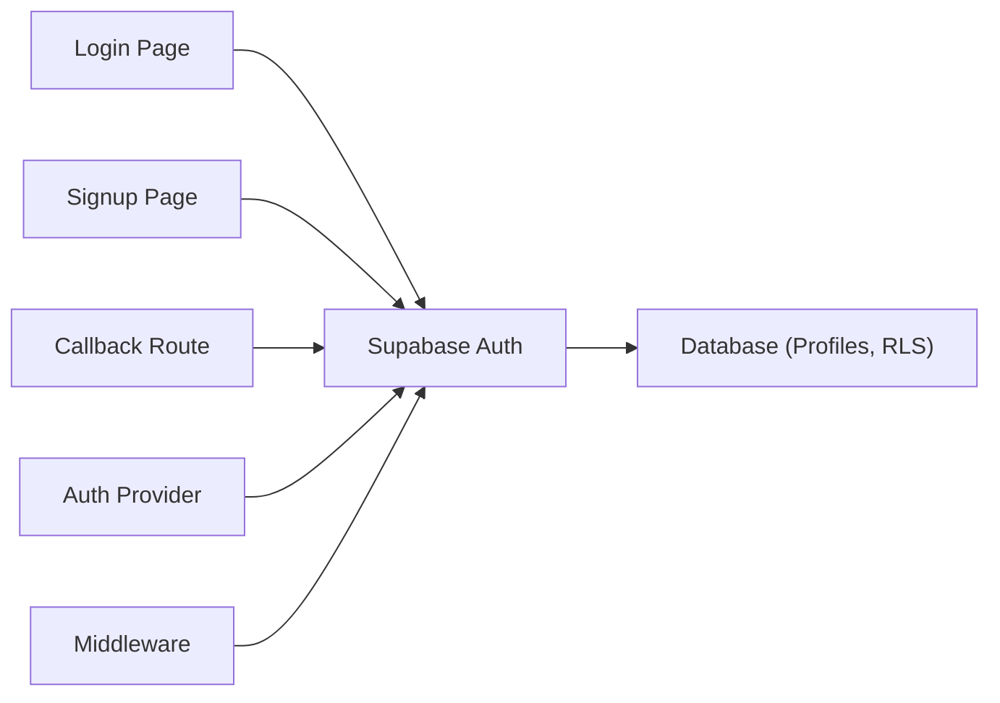

# OAuth Authentication Flow

<cite>
**Referenced Files in This Document**
- [login/page.tsx](file://src/app/(auth)/login/page.tsx)
- [signup/page.tsx](file://src/app/(auth)/signup/page.tsx)
- [callback/route.ts](file://src/app/auth/callback/route.ts)
- [AuthProvider.tsx](file://src/components/auth/AuthProvider.tsx)
- [middleware.ts](file://src/middleware.ts)
- [client.ts](file://src/lib/supabase/client.ts)
- [server.ts](file://src/lib/supabase/server.ts)
- [schema.sql](file://supabase/schema.sql)
</cite>

## Table of Contents
1. [Introduction](#introduction)
2. [Project Structure](#project-structure)
3. [Core Components](#core-components)
4. [Architecture Overview](#architecture-overview)
5. [Detailed Component Analysis](#detailed-component-analysis)
6. [Dependency Analysis](#dependency-analysis)
7. [Performance Considerations](#performance-considerations)
8. [Troubleshooting Guide](#troubleshooting-guide)
9. [Conclusion](#conclusion)
10. [Appendices](#appendices)

## Introduction
This document explains the authentication flow for MedAce AI with a focus on Google OAuth integration and how to implement PKCE (Proof Key for Code Exchange). It covers:
- Login page behavior and Google OAuth provider configuration
- Redirect URL setup and error handling
- Signup process for new users, including profile creation and initial data setup
- Callback route handler that exchanges authorization codes for sessions
- Security considerations such as CSRF protection, token validation, and secure cookie configuration
- How to add additional OAuth providers and customize the flow

The current codebase uses Supabase Auth for session management and provides a server-side callback that exchanges an authorization code for a session. The login/signup pages include UI for Google sign-in and local fallbacks when Supabase is not configured.

## Project Structure
Authentication-related files are organized into:
- Pages for login and signup under app/(auth)
- A server-side callback route at app/auth/callback
- An auth context provider for client-side state
- Middleware for route protection
- Supabase client configurations for browser and server contexts
- Database schema with RLS policies and triggers for profile creation

**Diagram sources**
- [login/page.tsx:100-114](file://src/app/(auth)/login/page.tsx#L100-L114)
- [signup/page.tsx:110-124](file://src/app/(auth)/signup/page.tsx#L110-L124)
- [callback/route.ts:4-31](file://src/app/auth/callback/route.ts#L4-L31)
- [server.ts:4-27](file://src/lib/supabase/server.ts#L4-L27)
- [AuthProvider.tsx:114-169](file://src/components/auth/AuthProvider.tsx#L114-L169)

**Section sources**
- [login/page.tsx:1-338](file://src/app/(auth)/login/page.tsx#L1-L338)
- [signup/page.tsx:1-365](file://src/app/(auth)/signup/page.tsx#L1-L365)
- [callback/route.ts:1-32](file://src/app/auth/callback/route.ts#L1-L32)
- [server.ts:1-28](file://src/lib/supabase/server.ts#L1-L28)
- [client.ts:1-9](file://src/lib/supabase/client.ts#L1-L9)
- [AuthProvider.tsx:1-208](file://src/components/auth/AuthProvider.tsx#L1-L208)

## Core Components
- Login page: Provides email/password sign-in and a Google sign-in button. When Supabase is not configured, it sets a local user and navigates to the dashboard. Otherwise, it attempts Supabase password sign-in and handles errors gracefully.
- Signup page: Creates accounts via Supabase Auth or falls back to a local session if credentials are missing. Stores full name in user metadata.
- Callback route: Exchanges an authorization code for a session using Supabase server client and redirects to the intended destination.
- Auth provider: Initializes and maintains client-side auth state, persists a local fallback session, and listens to Supabase auth changes.
- Middleware: Defines protected routes and includes commented logic to enforce authentication via cookies when ready.
- Supabase clients: Browser and server clients configured with environment variables; server client integrates with Next.js cookies for secure session handling.

**Section sources**
- [login/page.tsx:30-98](file://src/app/(auth)/login/page.tsx#L30-L98)
- [signup/page.tsx:32-108](file://src/app/(auth)/signup/page.tsx#L32-L108)
- [callback/route.ts:4-31](file://src/app/auth/callback/route.ts#L4-L31)
- [AuthProvider.tsx:43-200](file://src/components/auth/AuthProvider.tsx#L43-L200)
- [middleware.ts:1-41](file://src/middleware.ts#L1-L41)
- [client.ts:1-9](file://src/lib/supabase/client.ts#L1-L9)
- [server.ts:1-28](file://src/lib/supabase/server.ts#L1-L28)

## Architecture Overview
The authentication architecture centers around Supabase Auth with a server-side callback to exchange authorization codes for sessions. The flow supports both email/password and Google OAuth.

**Diagram sources**
- [login/page.tsx:100-114](file://src/app/(auth)/login/page.tsx#L100-L114)
- [callback/route.ts:4-31](file://src/app/auth/callback/route.ts#L4-L31)
- [server.ts:4-27](file://src/lib/supabase/server.ts#L4-L27)
- [middleware.ts:14-35](file://src/middleware.ts#L14-L35)

## Detailed Component Analysis

### Login Page Implementation
- Displays a Google sign-in button and email/password form.
- On Google click, opens a modal to collect name/email for local fallback; actual OAuth redirect can be wired by navigating to Google’s OAuth endpoint with PKCE parameters and setting the callback to /auth/callback.
- Email/password flow calls Supabase signInWithPassword and updates the client-side user via the auth provider.
- Error handling shows messages and falls back to a local session when Supabase is not configured or network errors occur.

Security notes:
- Ensure the Google OAuth redirect URI is registered in your Google Cloud Console to match your domain and path.
- Use PKCE for all OAuth flows to prevent authorization code interception attacks.
- Validate and sanitize inputs before submission.

**Section sources**
- [login/page.tsx:100-114](file://src/app/(auth)/login/page.tsx#L100-L114)
- [login/page.tsx:30-98](file://src/app/(auth)/login/page.tsx#L30-L98)
- [login/page.tsx:229-243](file://src/app/(auth)/login/page.tsx#L229-L243)

### Signup Process and Profile Creation
- Collects full name, email, and password; validates password confirmation.
- Calls Supabase signUp with user metadata (full_name).
- If Supabase is not configured, creates a local session and navigates to the dashboard.
- Database trigger automatically creates a profile record for new users, enabling RLS policies to protect data.

Security notes:
- Enforce strong password policies on the client and server.
- Use RLS policies to ensure users can only access their own data.

**Section sources**
- [signup/page.tsx:32-108](file://src/app/(auth)/signup/page.tsx#L32-L108)
- [schema.sql:231-249](file://supabase/schema.sql#L231-L249)
- [schema.sql:155-189](file://supabase/schema.sql#L155-L189)

### Callback Route Handler
- Parses the authorization code and optional next parameter from the query string.
- Uses the Supabase server client to exchange the code for a session.
- Sets cookies via the server client and redirects to the intended destination, respecting forwarded host headers in production.
- Handles errors by logging and falling back to redirect without session establishment.

Security notes:
- Always validate the presence of the code parameter before exchanging.
- Use HTTPS in production and ensure cookies are marked secure and httpOnly where applicable by Supabase SSR configuration.
- Implement CSRF protection by validating state and nonce if you extend the flow.

**Section sources**
- [callback/route.ts:4-31](file://src/app/auth/callback/route.ts#L4-L31)
- [server.ts:4-27](file://src/lib/supabase/server.ts#L4-L27)

### Client-Side Auth State Management
- Initializes session from Supabase and persists a local fallback session in localStorage.
- Subscribes to auth state changes to keep UI in sync with server sessions.
- Provides setUser, updateUser, and signOut functions for consistent state updates.

Security notes:
- Clear local storage and session storage on sign out.
- Avoid storing sensitive tokens in localStorage; rely on secure cookies managed by Supabase SSR.

**Section sources**
- [AuthProvider.tsx:43-200](file://src/components/auth/AuthProvider.tsx#L43-L200)

### Middleware and Protected Routes
- Defines protected routes and public routes.
- Includes commented logic to enforce authentication by checking Supabase access token cookies.
- When enabled, redirects unauthenticated users to login with a redirect parameter.

Security notes:
- Enable middleware checks in production to protect sensitive routes server-side.
- Combine with Supabase RLS for defense-in-depth.

**Section sources**
- [middleware.ts:1-41](file://src/middleware.ts#L1-L41)

## Dependency Analysis
The authentication flow depends on:
- Frontend pages for user interaction
- Supabase clients for browser and server contexts
- Callback route for server-side code exchange
- Database schema for profiles and RLS policies

**Diagram sources**
- [login/page.tsx:30-98](file://src/app/(auth)/login/page.tsx#L30-L98)
- [signup/page.tsx:32-108](file://src/app/(auth)/signup/page.tsx#L32-L108)
- [callback/route.ts:4-31](file://src/app/auth/callback/route.ts#L4-L31)
- [AuthProvider.tsx:114-169](file://src/components/auth/AuthProvider.tsx#L114-L169)
- [middleware.ts:14-35](file://src/middleware.ts#L14-L35)
- [schema.sql:155-189](file://supabase/schema.sql#L155-L189)

**Section sources**
- [client.ts:1-9](file://src/lib/supabase/client.ts#L1-L9)
- [server.ts:1-28](file://src/lib/supabase/server.ts#L1-L28)
- [schema.sql:10-24](file://supabase/schema.sql#L10-L24)

## Performance Considerations
- Minimize client-side network calls by relying on Supabase SSR cookies for authenticated requests.
- Debounce or throttle repeated auth state updates if necessary.
- Use database indexes (already present) to optimize queries for user-specific data.
- Keep the callback route lightweight; avoid heavy processing during code exchange.

[No sources needed since this section provides general guidance]

## Troubleshooting Guide
Common issues and resolutions:
- Invalid API key or fetch failures: The login/signup pages detect placeholder or invalid Supabase URLs and fall back to a local session. Verify environment variables for NEXT_PUBLIC_SUPABASE_URL and NEXT_PUBLIC_SUPABASE_ANON_KEY.
- Missing authorization code in callback: Ensure the OAuth provider redirects to /auth/callback with a valid code and that the redirect URI is correctly configured.
- Redirect loops or wrong host: The callback respects x-forwarded-host in production; verify proxy settings and environment.
- Protected routes not enforced: Enable middleware checks by uncommenting the cookie-based authentication logic and ensuring cookies are present after callback.

**Section sources**
- [login/page.tsx:35-77](file://src/app/(auth)/login/page.tsx#L35-L77)
- [signup/page.tsx:42-87](file://src/app/(auth)/signup/page.tsx#L42-L87)
- [callback/route.ts:4-31](file://src/app/auth/callback/route.ts#L4-L31)
- [middleware.ts:22-35](file://src/middleware.ts#L22-L35)

## Conclusion
MedAce AI’s authentication integrates Supabase Auth with a server-side callback to securely establish sessions. The login and signup pages provide both email/password and Google OAuth entry points, with robust fallbacks for development. The callback route exchanges authorization codes for sessions and redirects appropriately. To fully enable OAuth with PKCE:
- Configure Google OAuth in your provider console with the correct redirect URI
- Initiate OAuth with PKCE from the frontend and handle the callback via /auth/callback
- Enable middleware to protect routes using cookies
- Leverage RLS policies and database triggers for secure, user-scoped data

[No sources needed since this section summarizes without analyzing specific files]

## Appendices

### Adding Additional OAuth Providers
To add another provider (e.g., GitHub):
- Register the provider in your Supabase dashboard and configure client/server secrets.
- Update the login/signup pages to include a provider button that initiates the OAuth flow with PKCE.
- Ensure the callback route remains generic; it already exchanges any supported provider’s code for a session.
- Test the flow end-to-end and verify cookies and redirects.

[No sources needed since this section provides general guidance]

### Customizing the Authentication Flow
- Customize redirect destinations by passing a next parameter to the callback.
- Add custom claims or metadata during signup to enrich user profiles.
- Extend middleware to enforce role-based access control beyond basic authentication.
- Integrate CSRF protection by validating state and nonce in the OAuth initiation and callback steps.

[No sources needed since this section provides general guidance]