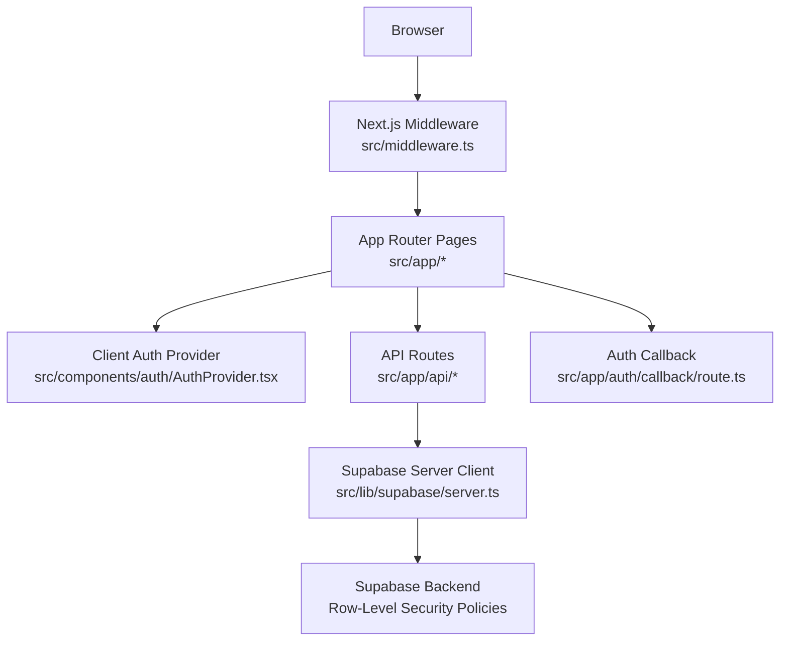
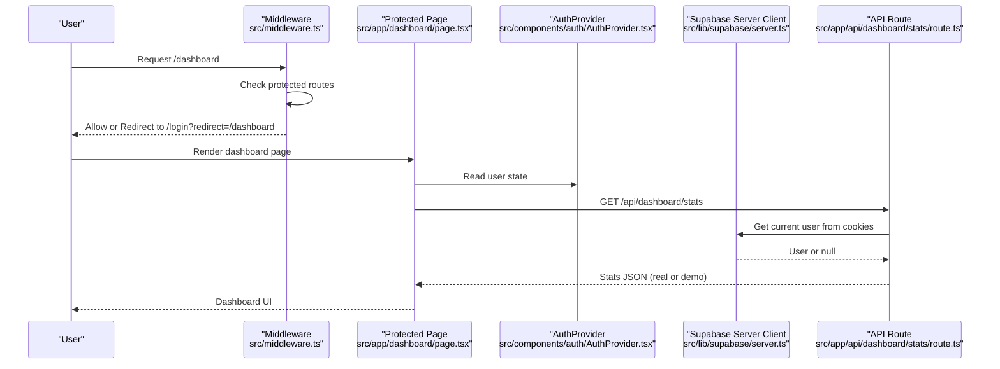
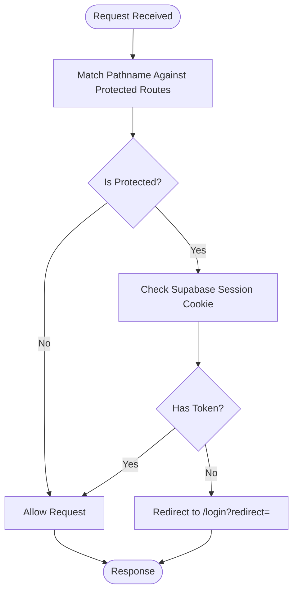
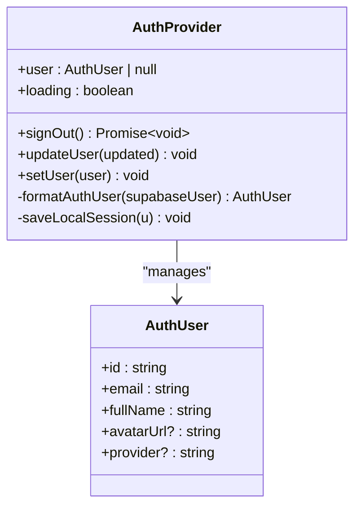
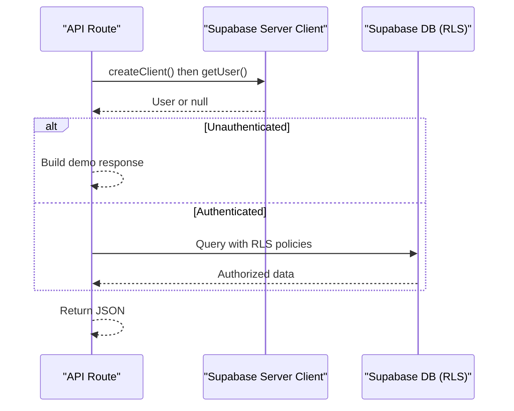
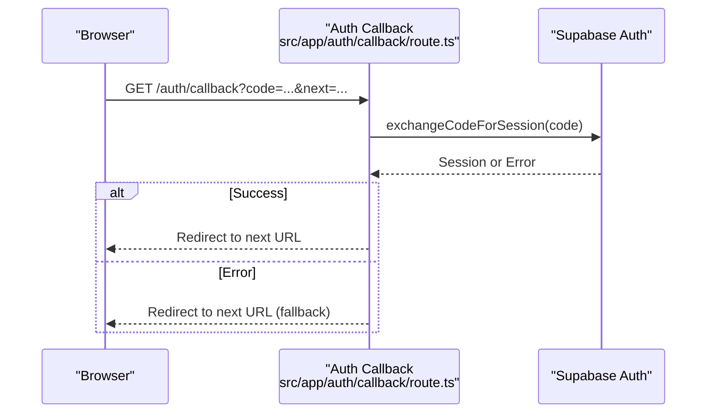
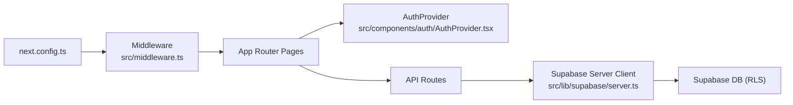

# Route Protection Middleware

<cite>
**Referenced Files in This Document**
- [middleware.ts](file://src/middleware.ts)
- [layout.tsx](file://src/app/layout.tsx)
- [AuthProvider.tsx](file://src/components/auth/AuthProvider.tsx)
- [client.ts](file://src/lib/supabase/client.ts)
- [server.ts](file://src/lib/supabase/server.ts)
- [route.ts (auth callback)](file://src/app/auth/callback/route.ts)
- [route.ts (dashboard stats)](file://src/app/api/dashboard/stats/route.ts)
- [route.ts (quiz generate)](file://src/app/api/quiz/generate/route.ts)
- [schema.sql](file://supabase/schema.sql)
- [next.config.ts](file://next.config.ts)
</cite>

## Table of Contents
1. [Introduction](#introduction)
2. [Project Structure](#project-structure)
3. [Core Components](#core-components)
4. [Architecture Overview](#architecture-overview)
5. [Detailed Component Analysis](#detailed-component-analysis)
6. [Dependency Analysis](#dependency-analysis)
7. [Performance Considerations](#performance-considerations)
8. [Troubleshooting Guide](#troubleshooting-guide)
9. [Conclusion](#conclusion)
10. [Appendices](#appendices)

## Introduction
This document explains the middleware-based route protection system integrated with Next.js App Router. It covers how the middleware intercepts requests, how authentication guard logic validates sessions, and how redirects are handled for unauthenticated users. It also documents protected routes, role-based access control patterns, customization strategies per application section, performance considerations, caching approaches, debugging techniques, testing guidance, and production edge cases.

## Project Structure
The route protection system spans server-side middleware, client-side authentication state, API route guards, and Supabase integration:

- Middleware defines protected/public routes and prepares redirect logic.
- Client-side AuthProvider manages user session state and persistence.
- Server-side Supabase client reads cookies to identify authenticated users.
- API routes enforce authorization via Supabase auth context and Row Level Security policies.
- Auth callback exchanges OAuth codes for sessions and redirects appropriately.

**Diagram sources**
- [middleware.ts:14-35](file://src/middleware.ts#L14-L35)
- [AuthProvider.tsx:43-207](file://src/components/auth/AuthProvider.tsx#L43-L207)
- [server.ts:4-27](file://src/lib/supabase/server.ts#L4-L27)
- [route.ts (auth callback):4-31](file://src/app/auth/callback/route.ts#L4-L31)
- [schema.sql:152-229](file://supabase/schema.sql#L152-L229)

**Section sources**
- [middleware.ts:1-40](file://src/middleware.ts#L1-L40)
- [layout.tsx:44-56](file://src/app/layout.tsx#L44-L56)

## Core Components
- Middleware route protection: Declares protected and public routes; currently allows all through but includes commented logic to check Supabase session cookie and redirect to login when missing.
- Client-side authentication: AuthProvider initializes session from Supabase or local storage fallback, persists user state, and exposes sign-out and update methods.
- Server-side session validation: Supabase server client reads cookies to obtain current user context for API routes.
- API route guards: API endpoints use Supabase auth to determine if a request is authenticated and return demo data or real data accordingly.
- Auth callback: Exchanges OAuth code for session and redirects to the intended destination.

Key responsibilities:
- Protect routes at the edge (middleware).
- Maintain consistent user state on the client.
- Enforce authorization on the server for data access.
- Provide seamless login flow with redirect handling.

**Section sources**
- [middleware.ts:4-35](file://src/middleware.ts#L4-L35)
- [AuthProvider.tsx:43-207](file://src/components/auth/AuthProvider.tsx#L43-L207)
- [server.ts:4-27](file://src/lib/supabase/server.ts#L4-L27)
- [route.ts (dashboard stats):6-41](file://src/app/api/dashboard/stats/route.ts#L6-L41)
- [route.ts (auth callback):4-31](file://src/app/auth/callback/route.ts#L4-L31)

## Architecture Overview
The system uses a layered approach:
- Edge-level protection via Next.js middleware.
- Client-side session management via React context and Supabase browser client.
- Server-side authorization via Supabase server client and database Row Level Security.

**Diagram sources**
- [middleware.ts:14-35](file://src/middleware.ts#L14-L35)
- [AuthProvider.tsx:114-192](file://src/components/auth/AuthProvider.tsx#L114-L192)
- [server.ts:4-27](file://src/lib/supabase/server.ts#L4-L27)
- [route.ts (dashboard stats):6-41](file://src/app/api/dashboard/stats/route.ts#L6-L41)

## Detailed Component Analysis

### Middleware Route Protection
- Protected routes list includes dashboard, practice, results, study-plan, profile.
- Public routes include home, login, signup.
- Matcher excludes static assets, images, favicon, and API routes from middleware execution.
- Authentication check is prepared but not active by default; when enabled, it will read Supabase session cookie and redirect to login with redirect parameter.

**Diagram sources**
- [middleware.ts:4-35](file://src/middleware.ts#L4-L35)

**Section sources**
- [middleware.ts:4-40](file://src/middleware.ts#L4-L40)

### Client-Side Authentication State Management
- Initializes session from Supabase or falls back to local storage.
- Persists user to localStorage under a dedicated key.
- Subscribes to auth state changes to keep UI in sync.
- Provides sign-out that clears local/session storage and calls Supabase sign-out when configured.

**Diagram sources**
- [AuthProvider.tsx:13-27](file://src/components/auth/AuthProvider.tsx#L13-L27)
- [AuthProvider.tsx:43-207](file://src/components/auth/AuthProvider.tsx#L43-L207)

**Section sources**
- [AuthProvider.tsx:43-207](file://src/components/auth/AuthProvider.tsx#L43-L207)

### Server-Side Session Validation and API Guards
- Supabase server client reads cookies to obtain current user context.
- API routes check for authenticated user; if absent, they return demo data instead of real data.
- Database Row Level Security ensures users can only access their own data.

**Diagram sources**
- [server.ts:4-27](file://src/lib/supabase/server.ts#L4-L27)
- [route.ts (dashboard stats):6-41](file://src/app/api/dashboard/stats/route.ts#L6-L41)
- [schema.sql:152-229](file://supabase/schema.sql#L152-L229)

**Section sources**
- [server.ts:4-27](file://src/lib/supabase/server.ts#L4-L27)
- [route.ts (dashboard stats):6-181](file://src/app/api/dashboard/stats/route.ts#L6-L181)
- [schema.sql:152-229](file://supabase/schema.sql#L152-L229)

### Auth Callback Flow
- Exchanges OAuth code for session using Supabase.
- Handles environment-specific redirects (local vs production).
- Falls back to next destination if no code or error occurs.

**Diagram sources**
- [route.ts (auth callback):4-31](file://src/app/auth/callback/route.ts#L4-L31)

**Section sources**
- [route.ts (auth callback):4-31](file://src/app/auth/callback/route.ts#L4-L31)

### Role-Based Access Control (RBAC) Guidance
- Current implementation focuses on authenticated vs unauthenticated access.
- To implement RBAC:
  - Extend middleware to check user roles from session claims or custom cookies.
  - Add role checks in API routes before performing mutations or reading sensitive data.
  - Use Supabase policies to restrict operations based on user roles.
  - Store role metadata in user profiles and validate on server endpoints.

[No sources needed since this section provides conceptual guidance]

### Customizing Authentication Behavior Per Section
- Group routes into folders (e.g., admin, student) and apply different middleware rules per group.
- Use environment variables to toggle strictness (e.g., allow demo mode in development).
- Customize redirect destinations based on user roles or previous navigation intent.

[No sources needed since this section provides conceptual guidance]

## Dependency Analysis
- Middleware depends on Next.js server utilities and does not call external services unless Supabase cookie checking is enabled.
- Client components depend on AuthProvider for user state and on Supabase browser client for auth flows.
- API routes depend on Supabase server client and database policies for secure data access.
- Configuration files set security headers and matcher rules for middleware.

**Diagram sources**
- [middleware.ts:14-40](file://src/middleware.ts#L14-L40)
- [AuthProvider.tsx:43-207](file://src/components/auth/AuthProvider.tsx#L43-L207)
- [server.ts:4-27](file://src/lib/supabase/server.ts#L4-L27)
- [next.config.ts:13-22](file://next.config.ts#L13-L22)

**Section sources**
- [middleware.ts:14-40](file://src/middleware.ts#L14-L40)
- [next.config.ts:13-22](file://next.config.ts#L13-L22)

## Performance Considerations
- Middleware runs on every matching request; keep logic minimal and avoid heavy computations.
- Exclude unnecessary paths via matcher to reduce overhead.
- Prefer server-side session checks only where necessary; rely on client-side state for UI rendering.
- Cache expensive computations on the server side (e.g., dashboard stats aggregation) and leverage Supabase queries efficiently.
- Use environment flags to disable heavy features in development.

[No sources needed since this section provides general guidance]

## Troubleshooting Guide
Common issues and resolutions:
- Middleware not protecting routes:
  - Ensure protected routes list matches actual paths and subpaths.
  - Verify matcher excludes static assets and APIs appropriately.
  - Enable Supabase cookie check in middleware when ready for production.
- Redirect loops:
  - Confirm redirect URL includes correct pathname and query parameters.
  - Validate auth callback sets proper next destination.
- API returns demo data unexpectedly:
  - Check if Supabase server client obtains a user from cookies.
  - Ensure environment variables are correctly set for Supabase URL and keys.
- Local storage inconsistencies:
  - Clear local storage on sign-out and ensure AuthProvider updates state consistently.
- Debugging techniques:
  - Log pathnames and authentication status in middleware during development.
  - Inspect cookies in browser dev tools to verify session tokens.
  - Use network tab to inspect API responses and errors.

**Section sources**
- [middleware.ts:14-35](file://src/middleware.ts#L14-L35)
- [route.ts (auth callback):4-31](file://src/app/auth/callback/route.ts#L4-L31)
- [route.ts (dashboard stats):6-41](file://src/app/api/dashboard/stats/route.ts#L6-L41)
- [AuthProvider.tsx:91-112](file://src/components/auth/AuthProvider.tsx#L91-L112)

## Conclusion
The project implements a foundational middleware-based route protection system with clear hooks for enabling full authentication enforcement. The client-side AuthProvider maintains robust session state, while API routes leverage Supabase server context and Row Level Security for data protection. With minor adjustments—enabling cookie checks in middleware and adding role validations—the system can support comprehensive authentication and authorization across all protected sections.

[No sources needed since this section summarizes without analyzing specific files]

## Appendices

### Examples: Protecting Specific Routes
- Add new protected routes to the protectedRoutes array in middleware.
- For subroutes, ensure the startsWith check covers nested paths.
- Example pattern: "/profile/settings" would be covered by "/profile".

**Section sources**
- [middleware.ts:4-20](file://src/middleware.ts#L4-L20)

### Implementing Role-Based Access Control
- Extend middleware to read role information from session claims or custom cookies.
- Add role checks in API routes before performing sensitive operations.
- Update Supabase policies to enforce role-based permissions.

[No sources needed since this section provides conceptual guidance]

### Testing Middleware Logic
- Write unit tests for route matching logic against various pathnames.
- Simulate authenticated and unauthenticated states by mocking cookies.
- Test redirect behavior with different redirect parameters.
- Validate API route guards by asserting demo vs real data responses based on user presence.

[No sources needed since this section provides conceptual guidance]

### Handling Edge Cases in Production
- Handle missing or expired cookies gracefully by redirecting to login.
- Ensure auth callback handles both local and production environments correctly.
- Guard against CSRF by setting appropriate security headers (already configured).
- Monitor logs for auth failures and redirect loops.

**Section sources**
- [next.config.ts:3-11](file://next.config.ts#L3-L11)
- [route.ts (auth callback):4-31](file://src/app/auth/callback/route.ts#L4-L31)