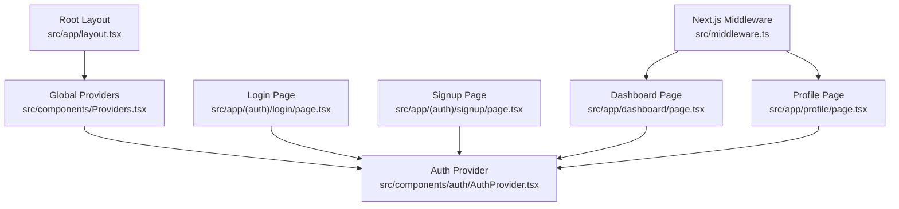
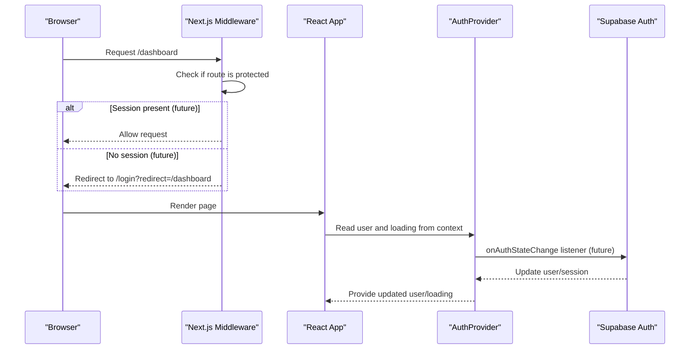
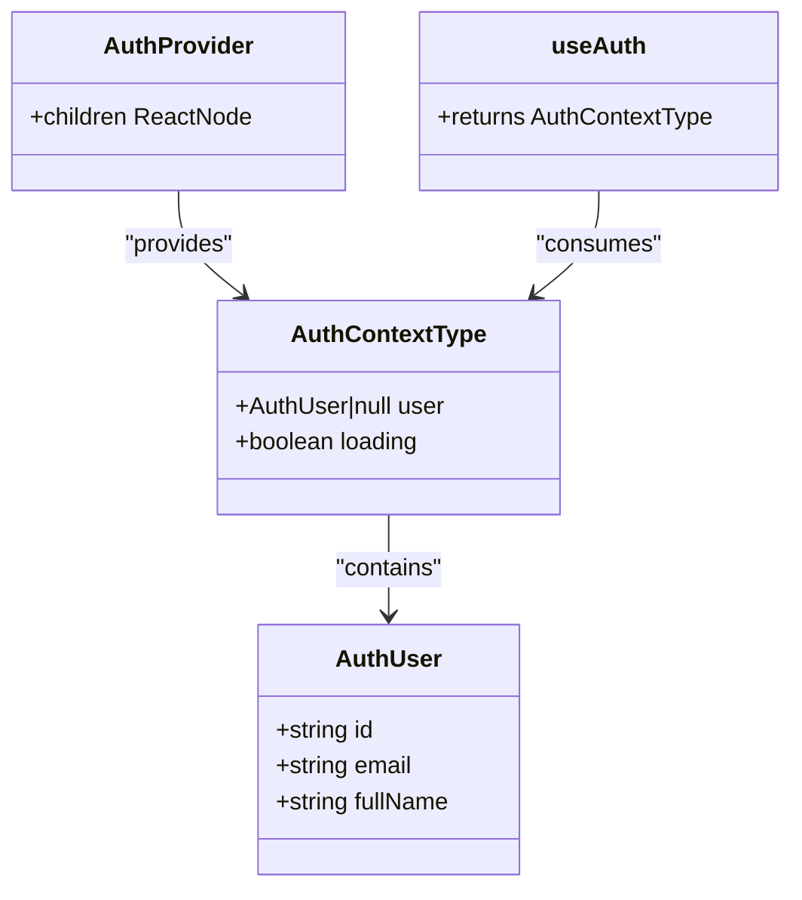
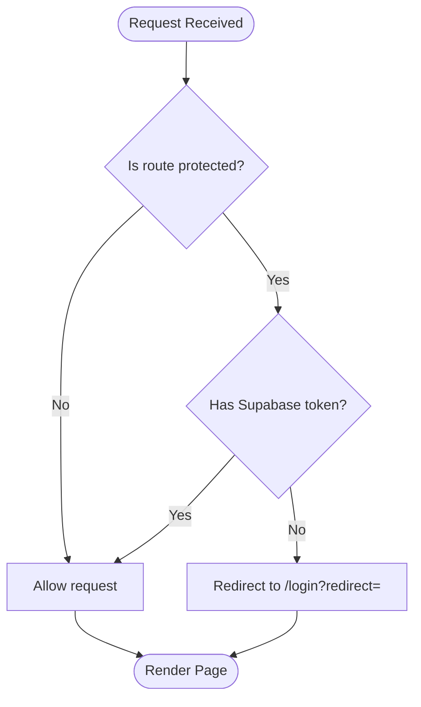
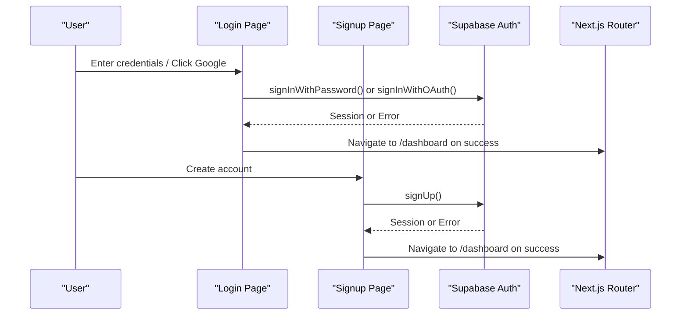
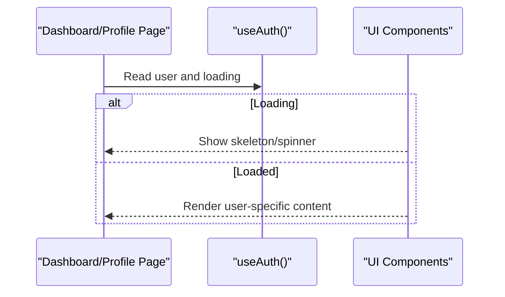
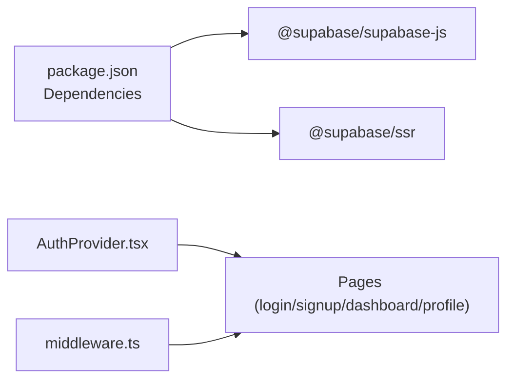

# Authentication Components

<cite>
**Referenced Files in This Document**
- [AuthProvider.tsx](file://src/components/auth/AuthProvider.tsx)
- [middleware.ts](file://src/middleware.ts)
- [Providers.tsx](file://src/components/Providers.tsx)
- [layout.tsx](file://src/app/layout.tsx)
- [login/page.tsx](file://src/app/(auth)/login/page.tsx)
- [signup/page.tsx](file://src/app/(auth)/signup/page.tsx)
- [dashboard/page.tsx](file://src/app/dashboard/page.tsx)
- [profile/page.tsx](file://src/app/profile/page.tsx)
- [package.json](file://package.json)
</cite>

## Table of Contents
1. Introduction
2. Project Structure
3. Core Components
4. Architecture Overview
5. Detailed Component Analysis
6. Dependency Analysis
7. Performance Considerations
8. Troubleshooting Guide
9. Conclusion
10. Appendices

## Introduction
This document explains MedAce AI’s authentication system components and how they integrate with Supabase for user authentication, session handling, token management, and protected route access. It covers the AuthProvider component that manages user authentication state, the authentication context, login/logout flows, and best practices for protecting routes and implementing authentication guards. It also addresses error handling, loading states, security considerations, token refresh mechanisms, and user session lifecycle management.

## Project Structure
MedAce AI is a Next.js application with:
- A root layout that mounts global providers (including data fetching via React Query).
- An authentication provider that exposes user state and loading status through React Context.
- Middleware that defines protected routes and prepares for server-side session checks.
- Auth UI pages for login and signup with placeholders for Google OAuth and email/password forms.
- Protected feature pages (dashboard, profile) that will enforce authentication once Supabase is wired.

**Diagram sources**
- [layout.tsx:44-56](file://src/app/layout.tsx#L44-L56)
- [Providers.tsx:7-21](file://src/components/Providers.tsx#L7-L21)
- [AuthProvider.tsx:43-56](file://src/components/auth/AuthProvider.tsx#L43-L56)
- [middleware.ts:14-35](file://src/middleware.ts#L14-L35)
- [login/page.tsx:5-89](file://src/app/(auth)/login/page.tsx#L5-L89)
- [signup/page.tsx:5-100](file://src/app/(auth)/signup/page.tsx#L5-L100)
- [dashboard/page.tsx:21-239](file://src/app/dashboard/page.tsx#L21-L239)
- [profile/page.tsx:18-224](file://src/app/profile/page.tsx#L18-L224)

**Section sources**
- [layout.tsx:44-56](file://src/app/layout.tsx#L44-L56)
- [Providers.tsx:7-21](file://src/components/Providers.tsx#L7-L21)
- [middleware.ts:14-35](file://src/middleware.ts#L14-L35)

## Core Components
- AuthProvider: Provides user state and loading status via React Context. Currently uses a mock user for frontend development and includes comments to wire up Supabase auth state changes.
- useAuth hook: Consumes the AuthContext to read user and loading state in any client component.
- Next.js Middleware: Defines protected routes and contains commented logic to check Supabase session cookies and redirect unauthenticated users to login.
- Global Providers: Wraps the app with React Query and Toast providers; AuthProvider should be mounted here or in the root layout to provide auth context globally.

Key responsibilities:
- Manage current user identity and loading state.
- Expose a simple API (user, loading) to all child components.
- Prepare for Supabase integration by listening to auth state changes and updating context accordingly.

**Section sources**
- [AuthProvider.tsx:11-29](file://src/components/auth/AuthProvider.tsx#L11-L29)
- [AuthProvider.tsx:31-56](file://src/components/auth/AuthProvider.tsx#L31-L56)
- [middleware.ts:4-12](file://src/middleware.ts#L4-L12)
- [middleware.ts:14-35](file://src/middleware.ts#L14-L35)
- [Providers.tsx:7-21](file://src/components/Providers.tsx#L7-L21)

## Architecture Overview
The authentication architecture combines client-side context with server-side middleware protection:
- Client side: AuthProvider holds user state and exposes it via useAuth. Pages consume this to render protected content or show login prompts.
- Server side: Middleware identifies protected routes and can enforce session validation using Supabase cookies when enabled.

**Diagram sources**
- [middleware.ts:14-35](file://src/middleware.ts#L14-L35)
- [AuthProvider.tsx:31-56](file://src/components/auth/AuthProvider.tsx#L31-L56)

## Detailed Component Analysis

### AuthProvider Component
- Purpose: Centralizes authentication state (current user and loading flag) and provides it to the entire app via React Context.
- Current behavior: Returns a static mock user and sets loading to false for frontend-only development.
- Integration points: Includes comments showing where to attach Supabase’s onAuthStateChange to update user and loading based on real sessions.

**Diagram sources**
- [AuthProvider.tsx:11-29](file://src/components/auth/AuthProvider.tsx#L11-L29)
- [AuthProvider.tsx:43-56](file://src/components/auth/AuthProvider.tsx#L43-L56)

**Section sources**
- [AuthProvider.tsx:11-29](file://src/components/auth/AuthProvider.tsx#L11-L29)
- [AuthProvider.tsx:31-56](file://src/components/auth/AuthProvider.tsx#L31-L56)

### Next.js Middleware and Protected Routes
- Purpose: Identify protected routes and enforce authentication at the edge before rendering pages.
- Current behavior: Lists protected routes and public routes; currently allows all requests through during development.
- Future behavior: When Supabase is wired, check for an access token cookie and redirect unauthenticated users to login with a redirect parameter.

**Diagram sources**
- [middleware.ts:4-12](file://src/middleware.ts#L4-L12)
- [middleware.ts:14-35](file://src/middleware.ts#L14-L35)

**Section sources**
- [middleware.ts:4-12](file://src/middleware.ts#L4-L12)
- [middleware.ts:14-35](file://src/middleware.ts#L14-L35)

### Login and Signup Pages
- Purpose: Provide user-facing entry points for authentication.
- Current behavior: Displays UI for Google OAuth and email/password forms; no backend calls yet.
- Integration points: On successful sign-in/sign-up, call Supabase auth methods and update context/state accordingly. After success, navigate to protected routes.

**Diagram sources**
- [login/page.tsx:25-75](file://src/app/(auth)/login/page.tsx#L25-L75)
- [signup/page.tsx:25-87](file://src/app/(auth)/signup/page.tsx#L25-L87)

**Section sources**
- [login/page.tsx:25-75](file://src/app/(auth)/login/page.tsx#L25-L75)
- [signup/page.tsx:25-87](file://src/app/(auth)/signup/page.tsx#L25-L87)

### Protected Feature Pages (Dashboard, Profile)
- Purpose: Display authenticated user data and features.
- Current behavior: Uses mock data and displays user name statically.
- Integration points: Consume AuthContext via useAuth to display real user info and guard rendering until loading completes.

**Diagram sources**
- [dashboard/page.tsx:21-239](file://src/app/dashboard/page.tsx#L21-L239)
- [profile/page.tsx:18-224](file://src/app/profile/page.tsx#L18-L224)

**Section sources**
- [dashboard/page.tsx:21-239](file://src/app/dashboard/page.tsx#L21-L239)
- [profile/page.tsx:18-224](file://src/app/profile/page.tsx#L18-L224)

## Dependency Analysis
- External dependencies relevant to authentication:
  - @supabase/supabase-js and @supabase/ssr are installed and ready for integration.
- Internal dependencies:
  - AuthProvider depends on React Context and hooks.
  - Middleware depends on Next.js server APIs.
  - Pages depend on UI components and optional routing.

**Diagram sources**
- [package.json:11-27](file://package.json#L11-L27)
- [AuthProvider.tsx:43-56](file://src/components/auth/AuthProvider.tsx#L43-L56)
- [middleware.ts:14-35](file://src/middleware.ts#L14-L35)

**Section sources**
- [package.json:11-27](file://package.json#L11-L27)

## Performance Considerations
- Keep loading state minimal: Only set loading to true while establishing the initial Supabase session; avoid unnecessary re-renders.
- Prefer server-side checks in middleware to prevent rendering protected content until authentication is verified.
- Use React Query caching strategies already configured in Providers to reduce redundant network calls.
- Avoid heavy computations in AuthProvider; delegate to Supabase SDK for session management.

[No sources needed since this section provides general guidance]

## Troubleshooting Guide
Common issues and resolutions:
- Unauthenticated access to protected routes:
  - Ensure middleware checks for Supabase tokens and redirects appropriately when implemented.
  - Verify that Supabase sets the expected cookie name used by middleware.
- Stale or missing user state:
  - Confirm that Supabase’s onAuthStateChange updates the AuthProvider context correctly.
  - Ensure that pages wait for loading to complete before rendering user-specific content.
- Login/Signup failures:
  - Validate form inputs and handle errors gracefully with toast notifications.
  - Log detailed error messages from Supabase to diagnose configuration issues.

**Section sources**
- [middleware.ts:14-35](file://src/middleware.ts#L14-L35)
- [AuthProvider.tsx:31-56](file://src/components/auth/AuthProvider.tsx#L31-L56)

## Conclusion
MedAce AI’s authentication system is structured around a lightweight AuthProvider that exposes user state and loading status via React Context, complemented by Next.js middleware to protect routes. While currently using mock data for frontend development, the codebase is prepared for Supabase integration with clear extension points for session listeners and token-based protection. Implementing Supabase auth state changes in AuthProvider and enabling middleware checks will deliver a secure, responsive authentication flow with proper error handling and loading states.

[No sources needed since this section summarizes without analyzing specific files]

## Appendices

### Usage Examples

- Protecting routes with middleware:
  - Add new paths to the protectedRoutes list in middleware and enable token checking to redirect unauthenticated users.

- Accessing user data in components:
  - Use the useAuth hook to read user and loading state; conditionally render protected content or show skeletons while loading.

- Implementing authentication guards:
  - In client components, check loading first; if not loaded, show a spinner. If user is null after loading, redirect to login.

- Integrating Supabase:
  - Initialize Supabase client and subscribe to onAuthStateChange in AuthProvider to update user and loading based on session events.
  - Use Supabase SSR helpers to manage cookies for server-side checks in middleware.

[No sources needed since this section provides general guidance]

### Security Considerations
- Never store sensitive tokens in localStorage; rely on Supabase-managed cookies.
- Enforce route protection on both client and server sides (middleware).
- Validate all user inputs on the server and sanitize outputs.
- Use HTTPS and ensure proper CORS settings for Supabase.

[No sources needed since this section provides general guidance]

### Token Refresh and Session Lifecycle
- Rely on Supabase to automatically refresh tokens and maintain sessions.
- Listen to auth state changes to keep the UI synchronized with the actual session state.
- Handle logout by clearing local state and calling Supabase sign-out; ensure middleware redirects to login afterward.

[No sources needed since this section provides general guidance]