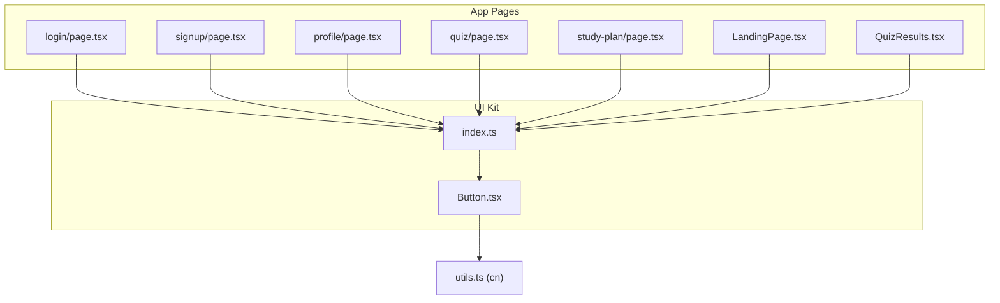
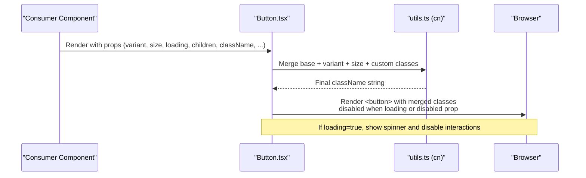
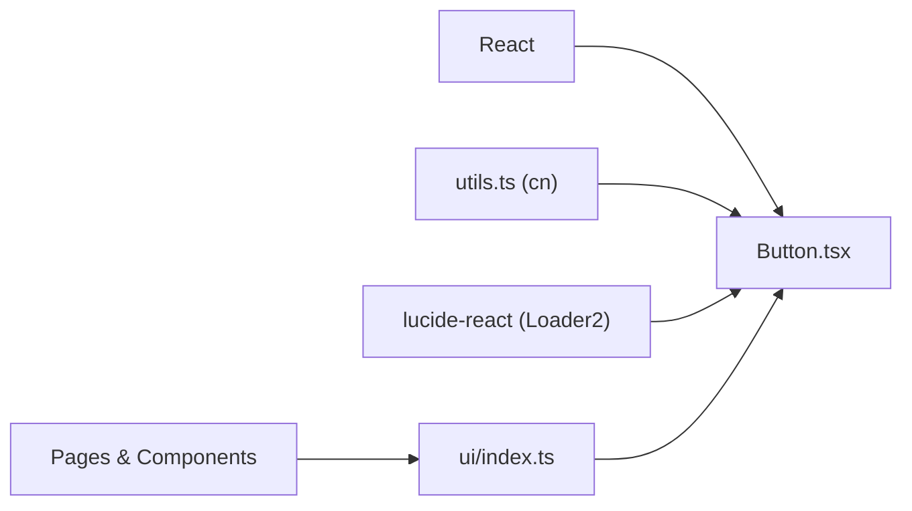

# Button Component

<cite>
**Referenced Files in This Document**
- [Button.tsx](file://Next-app/src/components/ui/Button.tsx)
- [index.ts](file://Next-app/src/components/ui/index.ts)
- [utils.ts](file://Next-app/src/lib/utils.ts)
- [login/page.tsx](file://Next-app/src/app/(auth)/login/page.tsx)
- [signup/page.tsx](file://Next-app/src/app/(auth)/signup/page.tsx)
- [profile/page.tsx](file://Next-app/src/app/(dashboard)/profile/page.tsx)
- [quiz/page.tsx](file://Next-app/src/app/(dashboard)/quiz/page.tsx)
- [study-plan/page.tsx](file://Next-app/src/app/(dashboard)/study-plan/page.tsx)
- [LandingPage.tsx](file://Next-app/src/components/LandingPage.tsx)
- [QuizResults.tsx](file://Next-app/src/components/quiz/QuizResults.tsx)
</cite>

## Table of Contents
1. [Introduction](#introduction)
2. [Project Structure](#project-structure)
3. [Core Components](#core-components)
4. [Architecture Overview](#architecture-overview)
5. [Detailed Component Analysis](#detailed-component-analysis)
6. [Dependency Analysis](#dependency-analysis)
7. [Performance Considerations](#performance-considerations)
8. [Troubleshooting Guide](#troubleshooting-guide)
9. [Conclusion](#conclusion)
10. [Appendices](#appendices)

## Introduction
This document provides comprehensive documentation for the Button component used across the application. It covers all available props, variants, sizes, disabled and loading states, icon support, accessibility considerations, usage examples, styling guidance with Tailwind CSS, integration patterns, and best practices for consistent button usage.

## Project Structure
The Button component is part of a shared UI kit under src/components/ui and is re-exported via an index file for convenient imports throughout the app. It is used in authentication pages, dashboard features, landing page, and quiz flows.

**Diagram sources**
- [Button.tsx:1-65](file://Next-app/src/components/ui/Button.tsx#L1-L65)
- [index.ts:1-11](file://Next-app/src/components/ui/index.ts#L1-L11)
- [utils.ts:1-27](file://Next-app/src/lib/utils.ts#L1-L27)
- [login/page.tsx:1-104](file://Next-app/src/app/(auth)/login/page.tsx#L1-L104)
- [signup/page.tsx:1-120](file://Next-app/src/app/(auth)/signup/page.tsx#L1-L120)
- [profile/page.tsx:1-200](file://Next-app/src/app/(dashboard)/profile/page.tsx#L1-L200)
- [quiz/page.tsx:1-200](file://Next-app/src/app/(dashboard)/quiz/page.tsx#L1-L200)
- [study-plan/page.tsx:1-150](file://Next-app/src/app/(dashboard)/study-plan/page.tsx#L1-L150)
- [LandingPage.tsx:1-222](file://Next-app/src/components/LandingPage.tsx#L1-L222)
- [QuizResults.tsx:1-149](file://Next-app/src/components/quiz/QuizResults.tsx#L1-L149)

**Section sources**
- [Button.tsx:1-65](file://Next-app/src/components/ui/Button.tsx#L1-L65)
- [index.ts:1-11](file://Next-app/src/components/ui/index.ts#L1-L11)

## Core Components
- Button component: A reusable, accessible <button> element with variant-driven styles, size options, loading state, and full HTML button attribute support.
- Utility function cn: Merges class names using clsx and tailwind-merge to avoid conflicts and enable dynamic styling.

Key capabilities:
- Variants: primary, secondary, ghost, destructive
- Sizes: sm, md, lg
- Loading state: shows a spinner and disables interaction
- Disabled state: prevents interaction and reduces opacity
- Icon support: place icons alongside text inside the button
- Accessibility: focus ring, keyboard navigation, proper semantics

**Section sources**
- [Button.tsx:7-14](file://Next-app/src/components/ui/Button.tsx#L7-L14)
- [Button.tsx:16-30](file://Next-app/src/components/ui/Button.tsx#L16-L30)
- [Button.tsx:32-65](file://Next-app/src/components/ui/Button.tsx#L32-L65)
- [utils.ts:1-6](file://Next-app/src/lib/utils.ts#L1-L6)

## Architecture Overview
The Button component composes base classes, variant classes, and size classes through the cn utility. It renders a native <button>, supports all standard HTML attributes, and integrates a loading spinner from lucide-react when loading is true.

**Diagram sources**
- [Button.tsx:32-65](file://Next-app/src/components/ui/Button.tsx#L32-L65)
- [utils.ts:1-6](file://Next-app/src/lib/utils.ts#L1-L6)

## Detailed Component Analysis

### Props API
- variant: "primary" | "secondary" | "ghost" | "destructive"
  - primary: default action emphasis
  - secondary: less prominent action
  - ghost: minimal visual weight
  - destructive: danger actions
- size: "sm" | "md" | "lg"
  - Controls padding and font size
- loading: boolean
  - Shows a spinner and disables the button
- disabled: boolean
  - Disables interaction and reduces opacity
- className: string
  - Additional Tailwind classes to customize appearance
- All standard HTML button attributes are supported via spread (e.g., type, onClick, aria-*)

Usage references:
- Login form submit with loading
- Landing page header and hero buttons with different sizes and variants
- Quiz results with icons and secondary variant
- Profile page with destructive variant and loading

**Section sources**
- [Button.tsx:7-14](file://Next-app/src/components/ui/Button.tsx#L7-L14)
- [Button.tsx:16-30](file://Next-app/src/components/ui/Button.tsx#L16-L30)
- [Button.tsx:32-65](file://Next-app/src/components/ui/Button.tsx#L32-L65)
- [login/page.tsx:75-77](file://Next-app/src/app/(auth)/login/page.tsx#L75-L77)
- [LandingPage.tsx:31-37](file://Next-app/src/components/LandingPage.tsx#L31-L37)
- [LandingPage.tsx:64-73](file://Next-app/src/components/LandingPage.tsx#L64-L73)
- [LandingPage.tsx:197-200](file://Next-app/src/components/LandingPage.tsx#L197-L200)
- [QuizResults.tsx:69-78](file://Next-app/src/components/quiz/QuizResults.tsx#L69-L78)
- [profile/page.tsx:126-196](file://Next-app/src/app/(dashboard)/profile/page.tsx#L126-L196)

### Visual States and Styling
- Base styles include rounded corners, centered content, transition effects, focus ring, and disabled states.
- Variant classes define background, text color, hover behavior, and focus ring colors.
- Size classes adjust horizontal padding, vertical padding, and font size.
- Custom className can override or extend any style.

References:
- Base and merged classes applied in render
- Variant and size class maps

**Section sources**
- [Button.tsx:16-30](file://Next-app/src/components/ui/Button.tsx#L16-L30)
- [Button.tsx:45-59](file://Next-app/src/components/ui/Button.tsx#L45-L59)

### Loading State Behavior
- When loading is true:
  - The button becomes disabled
  - A spinner icon is shown before the children
- This ensures users cannot trigger multiple submissions during async operations.

References:
- Loading prop handling and spinner rendering
- Usage in login/signup forms

**Section sources**
- [Button.tsx:32-65](file://Next-app/src/components/ui/Button.tsx#L32-L65)
- [login/page.tsx:17-38](file://Next-app/src/app/(auth)/login/page.tsx#L17-L38)
- [signup/page.tsx:100-120](file://Next-app/src/app/(auth)/signup/page.tsx#L100-L120)

### Icon Support
- Place icons inside the button alongside text.
- Use lucide-react icons consistently for visual harmony.
- Examples include rotating arrow and home icons in quiz results.

References:
- Icons used within buttons in landing page and quiz results

**Section sources**
- [LandingPage.tsx:64-73](file://Next-app/src/components/LandingPage.tsx#L64-L73)
- [QuizResults.tsx:69-78](file://Next-app/src/components/quiz/QuizResults.tsx#L69-L78)

### Accessibility Features
- Keyboard navigation: Native <button> provides focus and activation via Enter/Space.
- Focus management: Visible focus ring ensures clear focus indication.
- Disabled state: Properly disables interaction and reduces opacity.
- Screen readers: Semantic <button> conveys purpose; add descriptive labels if needed.
- ARIA attributes: You can pass any aria-* attributes via props (e.g., aria-label, aria-describedby).

References:
- Focus ring and disabled behavior in base classes
- Native button semantics

**Section sources**
- [Button.tsx:45-59](file://Next-app/src/components/ui/Button.tsx#L45-L59)

### Integration Patterns
- Forms: Use with type="submit" and loading to indicate async submission.
- Navigation: Wrap in Link components for client-side routing while preserving button semantics.
- Actions: Use destructive variant for delete or cancel actions.
- Lists and dashboards: Use ghost or secondary for non-primary actions.

References:
- Form submit usage
- Link-wrapped buttons
- Destructive variant usage

**Section sources**
- [login/page.tsx:75-77](file://Next-app/src/app/(auth)/login/page.tsx#L75-L77)
- [LandingPage.tsx:31-37](file://Next-app/src/components/LandingPage.tsx#L31-L37)
- [profile/page.tsx:168-196](file://Next-app/src/app/(dashboard)/profile/page.tsx#L168-L196)

### When to Use Each Variant
- primary: Main call-to-action (e.g., sign up, start quiz)
- secondary: Supporting actions (e.g., go back, view details)
- ghost: Low-emphasis actions (e.g., header login link)
- destructive: Danger actions (e.g., delete account, remove item)

References:
- Primary usage in hero CTA
- Secondary usage in results and profile
- Ghost usage in header
- Destructive usage in profile

**Section sources**
- [LandingPage.tsx:64-73](file://Next-app/src/components/LandingPage.tsx#L64-L73)
- [QuizResults.tsx:69-78](file://Next-app/src/components/quiz/QuizResults.tsx#L69-L78)
- [LandingPage.tsx:31-37](file://Next-app/src/components/LandingPage.tsx#L31-L37)
- [profile/page.tsx:168-196](file://Next-app/src/app/(dashboard)/profile/page.tsx#L168-L196)

### Best Practices
- Keep one primary action per section to avoid visual competition.
- Use consistent sizing: sm for inline/header actions, md for most cases, lg for prominent CTAs.
- Always provide meaningful labels for screen readers.
- Combine loading with disabled to prevent duplicate submissions.
- Prefer icons that reinforce action meaning (e.g., refresh, home).
- Avoid stacking too many buttons; group related actions.

[No sources needed since this section provides general guidance]

## Dependency Analysis
- Button depends on:
  - React forwardRef and types
  - cn utility for class merging
  - lucide-react Loader2 for loading spinner
- Consumers import Button via the ui index barrel for centralized exports.

**Diagram sources**
- [Button.tsx:1-6](file://Next-app/src/components/ui/Button.tsx#L1-L6)
- [utils.ts:1-6](file://Next-app/src/lib/utils.ts#L1-L6)
- [index.ts:1-11](file://Next-app/src/components/ui/index.ts#L1-L11)

**Section sources**
- [Button.tsx:1-65](file://Next-app/src/components/ui/Button.tsx#L1-L65)
- [index.ts:1-11](file://Next-app/src/components/ui/index.ts#L1-L11)
- [utils.ts:1-27](file://Next-app/src/lib/utils.ts#L1-L27)

## Performance Considerations
- Minimal overhead: Button is a thin wrapper around <button>.
- Class merging via cn avoids unnecessary re-renders by producing stable class strings.
- Loading spinner uses a lightweight SVG icon.
- Avoid excessive inline styles; prefer Tailwind classes for better caching and performance.

[No sources needed since this section provides general guidance]

## Troubleshooting Guide
Common issues and resolutions:
- Button not clickable: Ensure it is not wrapped in a disabled parent or marked disabled/loading.
- Styles not applying: Verify variant and size values match the allowed enums; use className to override when necessary.
- Loading spinner not visible: Confirm loading prop is true and children are present; ensure no CSS hides the spinner.
- Focus ring missing: Check global focus styles; the component applies a focus ring by default.
- Accessibility warnings: Add aria-label or other attributes via props if the button’s purpose is not obvious from its label.

**Section sources**
- [Button.tsx:32-65](file://Next-app/src/components/ui/Button.tsx#L32-L65)

## Conclusion
The Button component offers a robust, accessible, and flexible foundation for user actions across the application. With well-defined variants, sizes, loading/disabled states, and icon support, it enables consistent UX while allowing customization through Tailwind classes. Follow the guidelines and best practices to maintain clarity, accessibility, and visual consistency.

[No sources needed since this section summarizes without analyzing specific files]

## Appendices

### Usage Examples Across the App
- Login form submit with loading
- Header and hero CTAs with various sizes and variants
- Quiz results with icons and secondary variant
- Profile actions including destructive variant and loading

**Section sources**
- [login/page.tsx:75-77](file://Next-app/src/app/(auth)/login/page.tsx#L75-L77)
- [LandingPage.tsx:31-37](file://Next-app/src/components/LandingPage.tsx#L31-L37)
- [LandingPage.tsx:64-73](file://Next-app/src/components/LandingPage.tsx#L64-L73)
- [LandingPage.tsx:197-200](file://Next-app/src/components/LandingPage.tsx#L197-L200)
- [QuizResults.tsx:69-78](file://Next-app/src/components/quiz/QuizResults.tsx#L69-L78)
- [profile/page.tsx:126-196](file://Next-app/src/app/(dashboard)/profile/page.tsx#L126-L196)