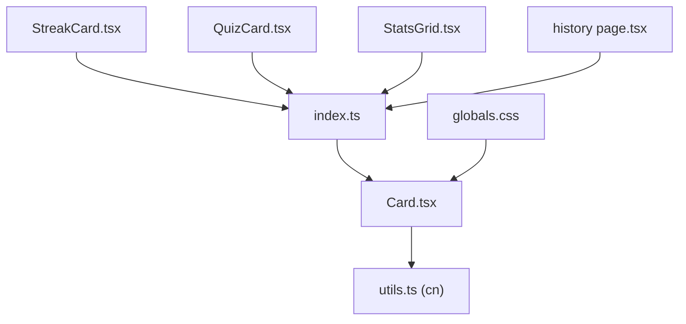
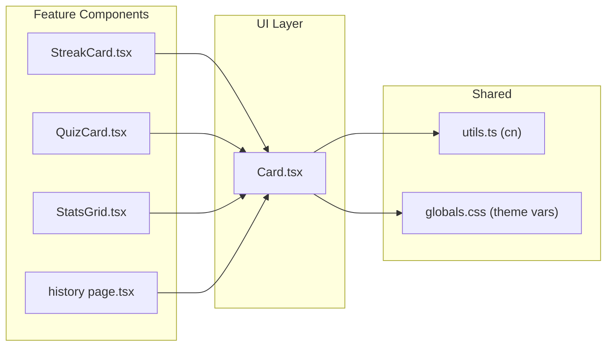
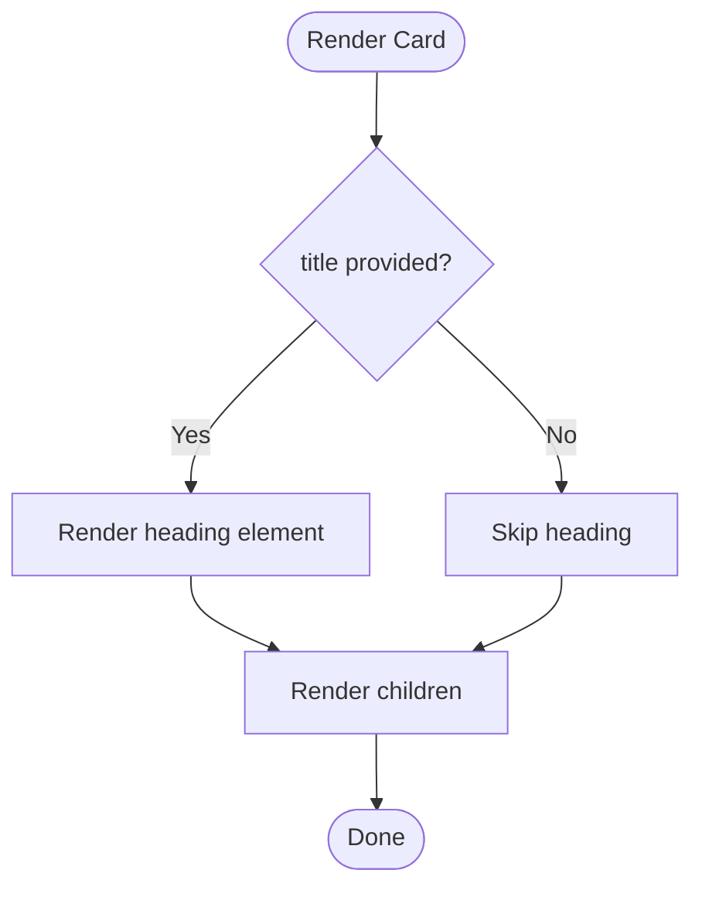
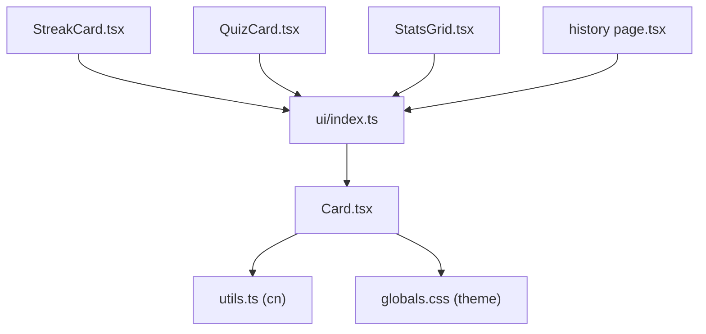

# Card Component

<cite>
**Referenced Files in This Document**
- [Card.tsx](file://src/components/ui/Card.tsx)
- [index.ts](file://src/components/ui/index.ts)
- [utils.ts](file://src/lib/utils.ts)
- [globals.css](file://src/app/globals.css)
- [StreakCard.tsx](file://src/components/dashboard/StreakCard.tsx)
- [QuizCard.tsx](file://src/components/quiz/QuizCard.tsx)
- [StatsGrid.tsx](file://src/components/dashboard/StatsGrid.tsx)
- [history page.tsx](file://src/app/(dashboard)/history/page.tsx)
</cite>

## Table of Contents
1. [Introduction](#introduction)
2. [Project Structure](#project-structure)
3. [Core Components](#core-components)
4. [Architecture Overview](#architecture-overview)
5. [Detailed Component Analysis](#detailed-component-analysis)
6. [Dependency Analysis](#dependency-analysis)
7. [Performance Considerations](#performance-considerations)
8. [Troubleshooting Guide](#troubleshooting-guide)
9. [Conclusion](#conclusion)
10. [Appendices](#appendices)

## Introduction
This document provides comprehensive documentation for the Card component used across the application. It explains available props, styling customization, usage patterns, accessibility considerations, and performance guidance for large card collections. The Card is a lightweight container that applies consistent visual styling and optional title rendering, enabling composition into richer UI components like StreakCard, QuizCard, StatsGrid, and interactive history items.

## Project Structure
The Card component lives in the shared UI layer and is re-exported through a barrel index for convenient imports. It is consumed by dashboard and quiz features to present data in a consistent, styled container.

**Diagram sources**
- [Card.tsx:1-24](file://src/components/ui/Card.tsx#L1-L24)
- [index.ts:1-11](file://src/components/ui/index.ts#L1-L11)
- [utils.ts:1-6](file://src/lib/utils.ts#L1-L6)
- [globals.css:3-20](file://src/app/globals.css#L3-L20)
- [StreakCard.tsx:1-49](file://src/components/dashboard/StreakCard.tsx#L1-L49)
- [QuizCard.tsx:1-19](file://src/components/quiz/QuizCard.tsx#L1-L19)
- [StatsGrid.tsx:1-71](file://src/components/dashboard/StatsGrid.tsx#L1-L71)
- [history page.tsx:80-180](file://src/app/(dashboard)/history/page.tsx#L80-L180)

**Section sources**
- [Card.tsx:1-24](file://src/components/ui/Card.tsx#L1-L24)
- [index.ts:1-11](file://src/components/ui/index.ts#L1-L11)

## Core Components
- Card: A reusable container with default rounded corners, surface background, border, padding, and subtle shadow. It optionally renders a heading when a title prop is provided.
- Consumers:
  - StreakCard: Uses Card to display streak metrics with custom gradient and accent colors.
  - QuizCard: Wraps question text within a Card for clear separation.
  - StatsGrid: Renders multiple stat cards in a responsive grid.
  - History page: Uses Card as an interactive row with expandable details.

Key behaviors:
- Optional title renders as a prominent heading above content.
- Children are rendered directly inside the container.
- Styling is applied via Tailwind classes merged with className prop using a utility function.

**Section sources**
- [Card.tsx:4-24](file://src/components/ui/Card.tsx#L4-L24)
- [StreakCard.tsx:26-49](file://src/components/dashboard/StreakCard.tsx#L26-L49)
- [QuizCard.tsx:9-19](file://src/components/quiz/QuizCard.tsx#L9-L19)
- [StatsGrid.tsx:47-71](file://src/components/dashboard/StatsGrid.tsx#L47-L71)
- [history page.tsx:80-180](file://src/app/(dashboard)/history/page.tsx#L80-L180)

## Architecture Overview
The Card component is a presentational primitive composed with higher-level feature components. It relies on a theme defined in global styles and a class-name merging utility for flexible styling.

**Diagram sources**
- [Card.tsx:1-24](file://src/components/ui/Card.tsx#L1-L24)
- [utils.ts:1-6](file://src/lib/utils.ts#L1-L6)
- [globals.css:3-20](file://src/app/globals.css#L3-L20)
- [StreakCard.tsx:1-49](file://src/components/dashboard/StreakCard.tsx#L1-L49)
- [QuizCard.tsx:1-19](file://src/components/quiz/QuizCard.tsx#L1-L19)
- [StatsGrid.tsx:1-71](file://src/components/dashboard/StatsGrid.tsx#L1-L71)
- [history page.tsx:80-180](file://src/app/(dashboard)/history/page.tsx#L80-L180)

## Detailed Component Analysis

### Card Props and Behavior
- title?: string — When provided, renders a heading above children.
- children: ReactNode — Content placed inside the card.
- className?: string — Additional classes merged with defaults for customization.

Default styling includes rounded corners, surface background, border, padding, and a subtle shadow. The title uses semantic heading markup and typography from the theme.

**Diagram sources**
- [Card.tsx:10-24](file://src/components/ui/Card.tsx#L10-L24)

**Section sources**
- [Card.tsx:4-24](file://src/components/ui/Card.tsx#L4-L24)

### Styling Customization
- className prop: Merge additional Tailwind classes to override or extend defaults.
- Border options: Default border is applied; you can adjust via className (e.g., thicker borders, different colors).
- Padding variations: Default padding is set; override with className to change spacing.
- Color themes: Use theme variables defined in global styles for consistent colors (surface, text, border, etc.).
- Shadow: Subtle shadow is applied by default; modify via className if needed.

Note: Hover effects are not built-in to the Card itself; apply hover states via className where appropriate.

**Section sources**
- [Card.tsx:10-24](file://src/components/ui/Card.tsx#L10-L24)
- [globals.css:3-20](file://src/app/globals.css#L3-L20)

### Usage Examples

#### Basic Card
- Wrap any content in Card to get consistent spacing, border, and shadow.
- Example consumer: QuizCard wraps question text.

**Section sources**
- [QuizCard.tsx:9-19](file://src/components/quiz/QuizCard.tsx#L9-L19)

#### Card with Images
- Place images inside Card’s children and style them with Tailwind classes via className.
- No image-specific props exist; rely on children and className.

[No sources needed since this section describes general usage without analyzing specific files]

#### Interactive Cards
- Add interactivity by wrapping clickable content inside Card and handling events in the parent component.
- Example consumer: History page uses Card as a clickable row with expand/collapse behavior.

**Section sources**
- [history page.tsx:80-180](file://src/app/(dashboard)/history/page.tsx#L80-L180)

#### Nested Card Layouts
- Nest Cards to create layered sections (e.g., outer container with inner detail panels).
- Example consumer: StatsGrid composes multiple small Cards in a responsive grid.

**Section sources**
- [StatsGrid.tsx:47-71](file://src/components/dashboard/StatsGrid.tsx#L47-L71)

### Composition Patterns
- Header/Footer/Content: Compose these areas by placing elements before and after your main content inside Card’s children. Use semantic headings for headers and paragraphs/lists for content.
- Themed variants: Apply gradient backgrounds, accent colors, and borders via className to create distinct variants (e.g., StreakCard uses gradient and accent colors).

**Section sources**
- [StreakCard.tsx:26-49](file://src/components/dashboard/StreakCard.tsx#L26-L49)
- [Card.tsx:10-24](file://src/components/ui/Card.tsx#L10-L24)

### Accessibility Considerations
- Semantic headings: When using title, a proper heading element is rendered, aiding screen readers.
- Keyboard interaction: For interactive cards (like history rows), ensure click targets are keyboard accessible and provide focus indicators.
- Color contrast: Use theme colors to maintain sufficient contrast for text and icons.
- Meaningful structure: Keep content organized with headings, lists, and landmarks inside Card for better navigation.

[No sources needed since this section provides general guidance]

### Performance Optimization for Large Card Collections
- Minimize re-renders: Memoize expensive child components inside Card using memoization utilities.
- Virtualization: For very long lists of cards, consider virtualizing the list to render only visible items.
- Avoid heavy inline styles: Prefer Tailwind classes for better caching and reduced runtime overhead.
- Debounce interactions: If cards handle frequent state changes (e.g., hover-driven animations), debounce handlers to reduce work.

[No sources needed since this section provides general guidance]

## Dependency Analysis
Card depends on:
- utils.ts cn function for class name merging.
- globals.css theme variables for colors and fonts.

Consumers depend on Card via the UI barrel export.

**Diagram sources**
- [Card.tsx:1-24](file://src/components/ui/Card.tsx#L1-L24)
- [utils.ts:1-6](file://src/lib/utils.ts#L1-L6)
- [globals.css:3-20](file://src/app/globals.css#L3-L20)
- [index.ts:1-11](file://src/components/ui/index.ts#L1-L11)
- [StreakCard.tsx:1-49](file://src/components/dashboard/StreakCard.tsx#L1-L49)
- [QuizCard.tsx:1-19](file://src/components/quiz/QuizCard.tsx#L1-L19)
- [StatsGrid.tsx:1-71](file://src/components/dashboard/StatsGrid.tsx#L1-L71)
- [history page.tsx:80-180](file://src/app/(dashboard)/history/page.tsx#L80-L180)

**Section sources**
- [Card.tsx:1-24](file://src/components/ui/Card.tsx#L1-L24)
- [utils.ts:1-6](file://src/lib/utils.ts#L1-L6)
- [globals.css:3-20](file://src/app/globals.css#L3-L20)
- [index.ts:1-11](file://src/components/ui/index.ts#L1-L11)

## Performance Considerations
- Class merging: Using a dedicated utility ensures efficient class resolution and avoids conflicts.
- Minimal DOM: Card renders a single container with optional heading; keep children lean.
- Theme consistency: Relying on CSS variables reduces runtime computation and improves maintainability.

[No sources needed since this section provides general guidance]

## Troubleshooting Guide
- Title not appearing: Ensure title prop is provided; otherwise, no heading will be rendered.
- Styles not applying: Verify className is passed correctly and does not conflict with defaults; use the class merging utility pattern.
- Interactions not working: For interactive cards, ensure event handlers are attached to appropriate elements inside Card and manage state at the parent level.
- Visual inconsistencies: Confirm theme variables are loaded and that custom classes align with the design system.

**Section sources**
- [Card.tsx:10-24](file://src/components/ui/Card.tsx#L10-L24)
- [history page.tsx:80-180](file://src/app/(dashboard)/history/page.tsx#L80-L180)

## Conclusion
The Card component offers a simple, flexible foundation for building consistent UI surfaces. With optional title rendering, robust styling via Tailwind and theme variables, and easy composition patterns, it supports a wide range of use cases—from basic containers to interactive, nested layouts. Follow the guidelines for accessibility and performance to ensure a high-quality user experience across all screens and data volumes.

## Appendices

### API Summary
- Props:
  - title?: string — Optional heading rendered above content.
  - children: ReactNode — Content inside the card.
  - className?: string — Additional classes merged with defaults.

- Default styling:
  - Rounded corners, surface background, border, padding, subtle shadow.

- Theming:
  - Colors and fonts are defined in global styles; use theme variables for consistency.

**Section sources**
- [Card.tsx:4-24](file://src/components/ui/Card.tsx#L4-L24)
- [globals.css:3-20](file://src/app/globals.css#L3-L20)