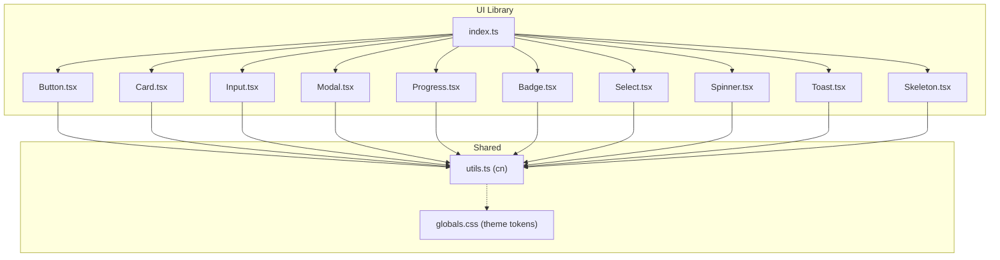
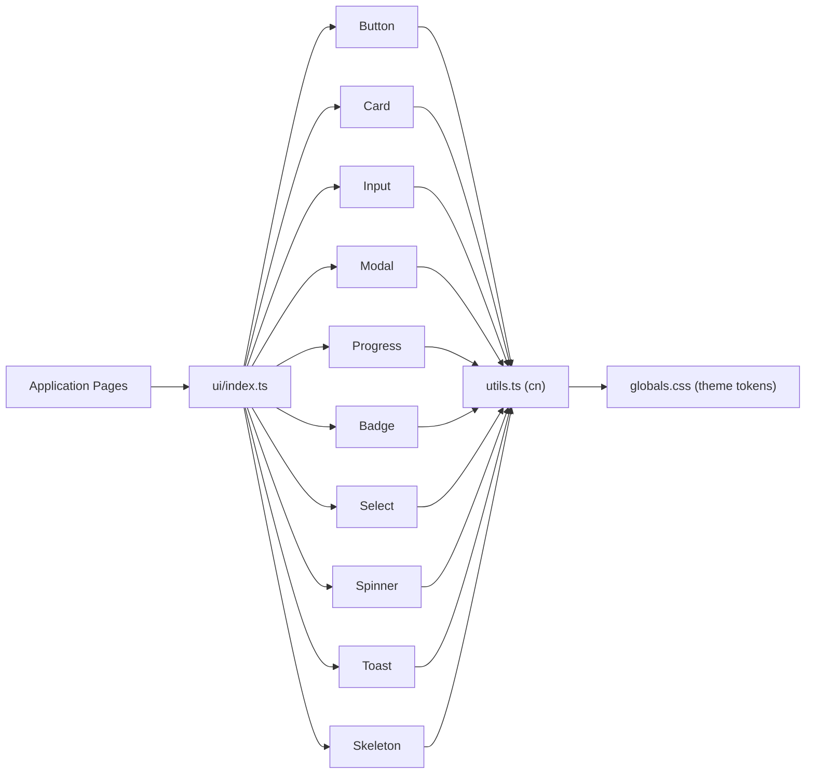
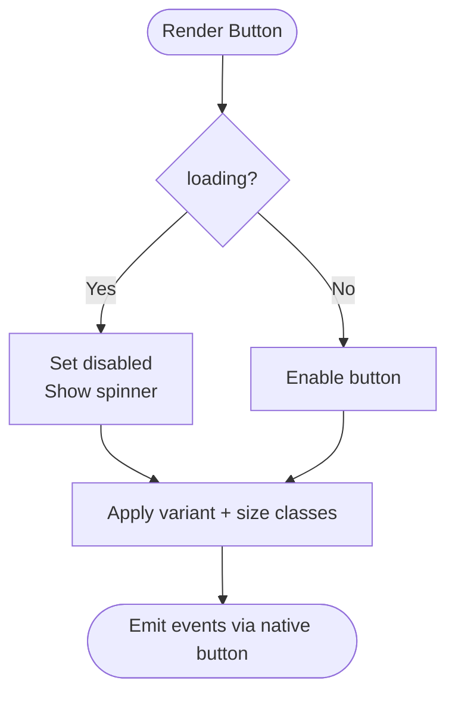
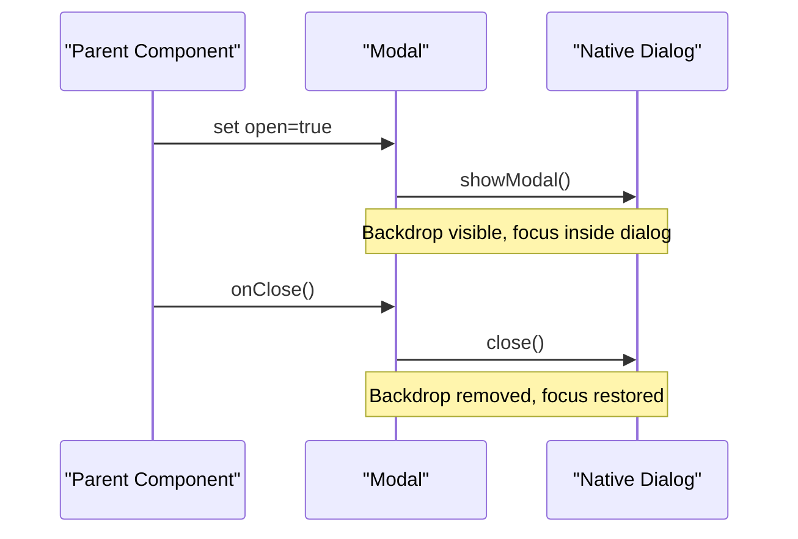
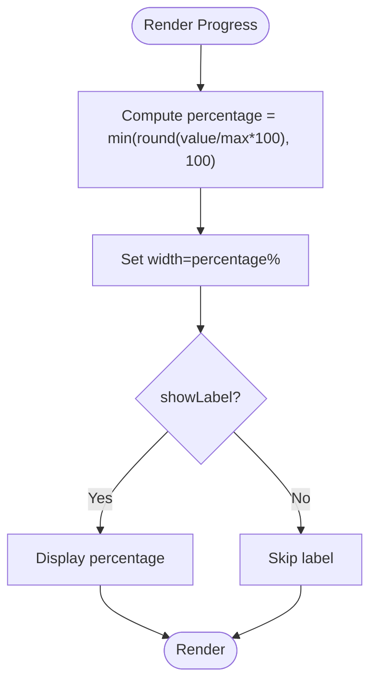
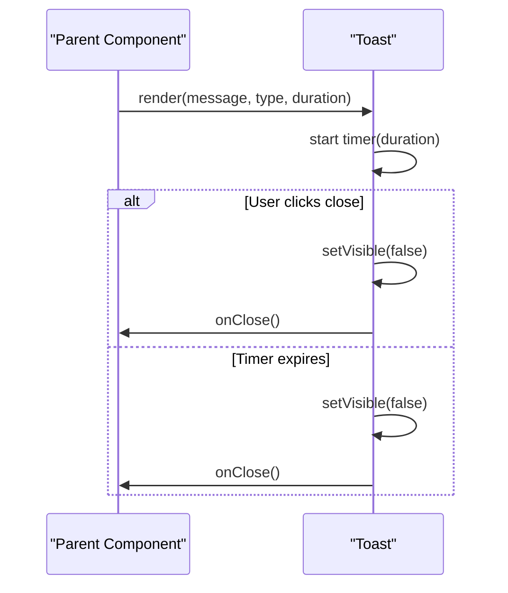
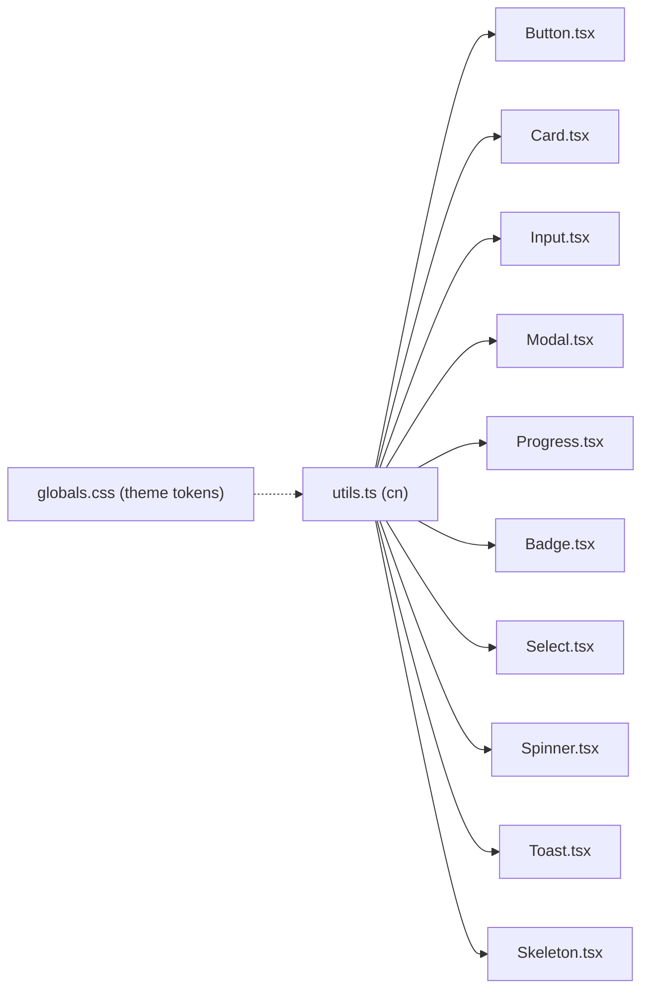

# Component Library

<cite>
**Referenced Files in This Document**
- [index.ts](file://Next-app/src/components/ui/index.ts)
- [Button.tsx](file://Next-app/src/components/ui/Button.tsx)
- [Card.tsx](file://Next-app/src/components/ui/Card.tsx)
- [Input.tsx](file://Next-app/src/components/ui/Input.tsx)
- [Modal.tsx](file://Next-app/src/components/ui/Modal.tsx)
- [Progress.tsx](file://Next-app/src/components/ui/Progress.tsx)
- [Badge.tsx](file://Next-app/src/components/ui/Badge.tsx)
- [Select.tsx](file://Next-app/src/components/ui/Select.tsx)
- [Spinner.tsx](file://Next-app/src/components/ui/Spinner.tsx)
- [Toast.tsx](file://Next-app/src/components/ui/Toast.tsx)
- [Skeleton.tsx](file://Next-app/src/components/ui/Skeleton.tsx)
- [utils.ts](file://Next-app/src/lib/utils.ts)
- [globals.css](file://Next-app/src/app/globals.css)
</cite>

## Table of Contents
1. Introduction
2. Project Structure
3. Core Components
4. Architecture Overview
5. Detailed Component Analysis
6. Dependency Analysis
7. Performance Considerations
8. Troubleshooting Guide
9. Conclusion
10. Appendices

## Introduction
This document describes the reusable UI component library implemented under src/components/ui. It covers each component’s props, events, styling options, accessibility features, and usage patterns. It also explains composition patterns, theming via CSS variables, responsive design approaches, and guidelines for extending or creating new components consistently.

## Project Structure
The UI library is organized as a flat set of components with a single barrel export file that re-exports all public components. Styling uses Tailwind CSS classes combined with a shared utility function to merge class names safely. Global theme tokens are defined in the application’s global stylesheet.

**Diagram sources**
- [index.ts:1-11](file://Next-app/src/components/ui/index.ts#L1-L11)
- [utils.ts:1-6](file://Next-app/src/lib/utils.ts#L1-L6)
- [globals.css:3-20](file://Next-app/src/app/globals.css#L3-L20)

**Section sources**
- [index.ts:1-11](file://Next-app/src/components/ui/index.ts#L1-L11)
- [utils.ts:1-6](file://Next-app/src/lib/utils.ts#L1-L6)
- [globals.css:3-20](file://Next-app/src/app/globals.css#L3-L20)

## Core Components
- Button: Primary interactive element with variants, sizes, loading state, and accessible focus styles.
- Card: Container with optional title and consistent surface styling.
- Input: Accessible text input with label, error messaging, and focus states.
- Modal: Accessible dialog with backdrop, keyboard support via native dialog, and close behavior.
- Progress: Linear progress indicator with color variants and optional percentage label.
- Badge: Small status or category labels with semantic color variants.
- Select: Styled select dropdown with label, placeholder, and error display.
- Spinner: Loading indicator with size variants.
- Toast: Auto-dismissing notification with type-based icons and colors.
- Skeleton: Placeholder shapes for content loading states.

All components use the shared cn utility for safe class merging and rely on theme tokens from globals.css for consistent colors and typography.

**Section sources**
- [Button.tsx:1-65](file://Next-app/src/components/ui/Button.tsx#L1-L65)
- [Card.tsx:1-25](file://Next-app/src/components/ui/Card.tsx#L1-L25)
- [Input.tsx:1-42](file://Next-app/src/components/ui/Input.tsx#L1-L42)
- [Modal.tsx:1-63](file://Next-app/src/components/ui/Modal.tsx#L1-L63)
- [Progress.tsx:1-51](file://Next-app/src/components/ui/Progress.tsx#L1-L51)
- [Badge.tsx:1-36](file://Next-app/src/components/ui/Badge.tsx#L1-L36)
- [Select.tsx:1-63](file://Next-app/src/components/ui/Select.tsx#L1-L63)
- [Spinner.tsx:1-22](file://Next-app/src/components/ui/Spinner.tsx#L1-L22)
- [Toast.tsx:1-73](file://Next-app/src/components/ui/Toast.tsx#L1-L73)
- [Skeleton.tsx:1-54](file://Next-app/src/components/ui/Skeleton.tsx#L1-L54)
- [utils.ts:1-6](file://Next-app/src/lib/utils.ts#L1-L6)
- [globals.css:3-20](file://Next-app/src/app/globals.css#L3-L20)

## Architecture Overview
The library follows a simple, composable architecture:
- Each component is self-contained and styled with Tailwind utilities.
- The barrel index.ts centralizes exports for clean imports across the app.
- Theming is driven by CSS custom properties defined in globals.css; components reference these via Tailwind theme tokens.
- Accessibility is built-in using native semantics (button, dialog, progressbar, alert), proper roles, and aria attributes where appropriate.

**Diagram sources**
- [index.ts:1-11](file://Next-app/src/components/ui/index.ts#L1-L11)
- [utils.ts:1-6](file://Next-app/src/lib/utils.ts#L1-L6)
- [globals.css:3-20](file://Next-app/src/app/globals.css#L3-L20)

## Detailed Component Analysis

### Button
- Purpose: Primary action button with multiple visual variants and sizes.
- Props:
  - variant: primary | secondary | ghost | destructive
  - size: sm | md | lg
  - loading: boolean (disables interaction and shows spinner)
  - className: string (additional styles)
  - All standard HTML button attributes are supported via forwardRef and spread.
- Events:
  - onClick and other native button events are forwarded.
- Styling:
  - Uses Tailwind classes for base, variant, and size styles.
  - Focus ring and disabled states are included.
- Accessibility:
  - Native <button> ensures correct semantics and keyboard behavior.
  - Disabled state prevents interaction when loading.
- Usage patterns:
  - Use primary for main actions, secondary for alternatives, ghost for subtle actions, destructive for danger actions.
  - Combine with loading to indicate async operations.

**Diagram sources**
- [Button.tsx:10-65](file://Next-app/src/components/ui/Button.tsx#L10-L65)

**Section sources**
- [Button.tsx:1-65](file://Next-app/src/components/ui/Button.tsx#L1-L65)

### Card
- Purpose: Content container with optional title and consistent surface styling.
- Props:
  - title?: string
  - children: ReactNode
  - className?: string
- Styling:
  - Rounded corners, border, background, padding, and shadow.
- Accessibility:
  - Semantic heading used for title when provided.
- Usage patterns:
  - Wrap grouped content such as stats, forms, or panels.

**Section sources**
- [Card.tsx:1-25](file://Next-app/src/components/ui/Card.tsx#L1-L25)

### Input
- Purpose: Text input with label and error messaging.
- Props:
  - label?: string
  - error?: string
  - id?: string (auto-generated from label if not provided)
  - className?: string
  - All standard HTML input attributes are supported via forwardRef and spread.
- Events:
  - onChange, onBlur, onFocus, etc., are forwarded.
- Styling:
  - Focus ring, disabled state, and error border/highlight.
- Accessibility:
  - Label associated via htmlFor/id.
  - Error message displayed below input.
- Usage patterns:
  - Pair with form validation to show error messages.

**Section sources**
- [Input.tsx:1-42](file://Next-app/src/components/ui/Input.tsx#L1-L42)

### Modal
- Purpose: Accessible modal dialog with backdrop and close behavior.
- Props:
  - open: boolean
  - onClose: () => void
  - title?: string
  - children: ReactNode
  - className?: string
- Behavior:
  - Uses native <dialog> showModal/close lifecycle controlled by open prop.
  - Backdrop click triggers onClose.
- Accessibility:
  - Native dialog provides focus trapping and ESC key handling.
  - Close button has an aria-label.
- Usage patterns:
  - Control visibility from parent state; pass data via children.

**Diagram sources**
- [Modal.tsx:15-63](file://Next-app/src/components/ui/Modal.tsx#L15-L63)

**Section sources**
- [Modal.tsx:1-63](file://Next-app/src/components/ui/Modal.tsx#L1-L63)

### Progress
- Purpose: Linear progress indicator with color variants and optional percentage label.
- Props:
  - value: number
  - max?: number (default 100)
  - color?: primary | success | error | warning | accent
  - showLabel?: boolean
  - className?: string
- Behavior:
  - Calculates percentage and clamps to 0–100.
  - Applies width style based on percentage.
- Accessibility:
  - role="progressbar" with aria-valuenow, aria-valuemin, aria-valuemax.
- Usage patterns:
  - Use for file uploads, quiz progress, or any bounded process.

**Diagram sources**
- [Progress.tsx:19-51](file://Next-app/src/components/ui/Progress.tsx#L19-L51)

**Section sources**
- [Progress.tsx:1-51](file://Next-app/src/components/ui/Progress.tsx#L1-L51)

### Badge
- Purpose: Small status or category label with semantic color variants.
- Props:
  - variant?: success | error | warning | info | default
  - children: React.ReactNode
  - className?: string
- Styling:
  - Rounded pill shape with variant-specific background and text colors.
- Usage patterns:
  - Tag items, statuses, or categories.

**Section sources**
- [Badge.tsx:1-36](file://Next-app/src/components/ui/Badge.tsx#L1-L36)

### Select
- Purpose: Styled select dropdown with label, placeholder, and error display.
- Props:
  - options: array of { value: string; label: string }
  - value: string
  - onChange: (value: string) => void
  - label?: string
  - placeholder?: string
  - error?: string
  - className?: string
- Behavior:
  - Controlled component; onChange updates parent state.
  - First option acts as placeholder and is disabled.
- Accessibility:
  - Label present when provided.
  - Error message shown when provided.
- Usage patterns:
  - Use for categorical selection within forms.

**Section sources**
- [Select.tsx:1-63](file://Next-app/src/components/ui/Select.tsx#L1-L63)

### Spinner
- Purpose: Loading indicator with size variants.
- Props:
  - size?: sm | md | lg
  - className?: string
- Styling:
  - Animated rotation with size-specific dimensions.
- Usage patterns:
  - Display during async operations or while data loads.

**Section sources**
- [Spinner.tsx:1-22](file://Next-app/src/components/ui/Spinner.tsx#L1-L22)

### Toast
- Purpose: Auto-dismissing notification with type-based icon and color.
- Props:
  - message: string
  - type?: success | error | warning | info
  - duration?: number (ms)
  - onClose: () => void
- Behavior:
  - Auto-hides after duration with fade-out animation.
  - Manual close via button.
- Accessibility:
  - role="alert" for screen readers.
- Usage patterns:
  - Show transient feedback for user actions.

**Diagram sources**
- [Toast.tsx:30-73](file://Next-app/src/components/ui/Toast.tsx#L30-L73)

**Section sources**
- [Toast.tsx:1-73](file://Next-app/src/components/ui/Toast.tsx#L1-L73)

### Skeleton
- Purpose: Placeholder shapes for content loading states.
- Props:
  - lines?: number (default 3)
  - type?: text | card | circle
  - className?: string
- Styling:
  - Pulsing placeholders matching common layouts.
- Usage patterns:
  - Replace content while fetching data to reduce perceived load time.

**Section sources**
- [Skeleton.tsx:1-54](file://Next-app/src/components/ui/Skeleton.tsx#L1-L54)

## Dependency Analysis
- Shared utilities:
  - cn merges class names safely using clsx and tailwind-merge.
- Theming:
  - Color tokens (primary, surface, text, border, success, error, warning, info, accent) and fonts are defined in globals.css and consumed via Tailwind theme.
- Exports:
  - index.ts re-exports all UI components for centralized imports.

**Diagram sources**
- [utils.ts:1-6](file://Next-app/src/lib/utils.ts#L1-L6)
- [globals.css:3-20](file://Next-app/src/app/globals.css#L3-L20)
- [index.ts:1-11](file://Next-app/src/components/ui/index.ts#L1-L11)

**Section sources**
- [utils.ts:1-6](file://Next-app/src/lib/utils.ts#L1-L6)
- [globals.css:3-20](file://Next-app/src/app/globals.css#L3-L20)
- [index.ts:1-11](file://Next-app/src/components/ui/index.ts#L1-L11)

## Performance Considerations
- Class merging: Using cn reduces redundant classes and improves rendering performance by minimizing style churn.
- Native elements: Leveraging native <button>, <input>, and <dialog> avoids heavy custom implementations and benefits from browser optimizations.
- Animations: Minimal CSS animations (spin, pulse, transitions) keep interactions smooth without blocking the main thread.
- Conditional rendering: Components like Modal and Toast avoid unnecessary DOM when hidden or dismissed.

[No sources needed since this section provides general guidance]

## Troubleshooting Guide
- Modal does not close:
  - Ensure onClose is passed and called from both backdrop click and close button.
  - Verify open prop toggles correctly in parent state.
- Input error not showing:
  - Pass error prop; ensure it renders conditionally below the input.
- Progress out of bounds:
  - Clamp value between 0 and max; the component handles clamping but ensure inputs are valid.
- Toast not dismissing:
  - Check duration and onClose handler; ensure parent removes toast from DOM after onClose.
- Styles not applying:
  - Confirm theme tokens exist in globals.css and Tailwind is configured to read them.
  - Use className to override or extend styles via cn.

**Section sources**
- [Modal.tsx:15-63](file://Next-app/src/components/ui/Modal.tsx#L15-L63)
- [Input.tsx:1-42](file://Next-app/src/components/ui/Input.tsx#L1-L42)
- [Progress.tsx:19-51](file://Next-app/src/components/ui/Progress.tsx#L19-L51)
- [Toast.tsx:30-73](file://Next-app/src/components/ui/Toast.tsx#L30-L73)
- [globals.css:3-20](file://Next-app/src/app/globals.css#L3-L20)

## Conclusion
The UI library provides a cohesive set of accessible, theme-driven primitives that compose well together. By following the established patterns—controlled props, native semantics, Tailwind styling with cn, and theme tokens—you can extend or create new components that remain consistent and maintainable across the application.

[No sources needed since this section summarizes without analyzing specific files]

## Appendices

### Theming and Styling Guidelines
- Define or adjust colors and fonts in globals.css under the theme block.
- Use Tailwind classes referencing theme tokens throughout components.
- Extend or override styles via className; prefer adding modifiers rather than mutating internals.

**Section sources**
- [globals.css:3-20](file://Next-app/src/app/globals.css#L3-L20)

### Accessibility Checklist
- Use native interactive elements (button, input, dialog).
- Provide labels and associate them with inputs.
- Include ARIA attributes where necessary (e.g., progressbar).
- Ensure focus management and keyboard support (handled by native dialog).

**Section sources**
- [Input.tsx:1-42](file://Next-app/src/components/ui/Input.tsx#L1-L42)
- [Modal.tsx:15-63](file://Next-app/src/components/ui/Modal.tsx#L15-L63)
- [Progress.tsx:19-51](file://Next-app/src/components/ui/Progress.tsx#L19-L51)

### Responsive Design Approaches
- Rely on Tailwind’s responsive utilities for layout adjustments.
- Keep spacing and sizing tokens consistent via theme variables.
- Test components at various viewport sizes; ensure touch targets meet minimum sizes.

[No sources needed since this section provides general guidance]

### Extending Existing Components
- Add new variants or sizes by extending typed unions and corresponding class maps.
- Compose components (e.g., Card + Button + Input) to build higher-level UI.
- Maintain consistency by using cn for class merging and theme tokens for colors.

**Section sources**
- [Button.tsx:10-30](file://Next-app/src/components/ui/Button.tsx#L10-L30)
- [utils.ts:1-6](file://Next-app/src/lib/utils.ts#L1-L6)