# Component Library

<cite>
**Referenced Files in This Document**
- [index.ts](file://src/components/ui/index.ts)
- [Button.tsx](file://src/components/ui/Button.tsx)
- [Card.tsx](file://src/components/ui/Card.tsx)
- [Input.tsx](file://src/components/ui/Input.tsx)
- [Modal.tsx](file://src/components/ui/Modal.tsx)
- [Progress.tsx](file://src/components/ui/Progress.tsx)
- [Badge.tsx](file://src/components/ui/Badge.tsx)
- [Tabs.tsx](file://src/components/ui/Tabs.tsx)
- [AppLayout.tsx](file://src/components/layout/AppLayout.tsx)
- [Navbar.tsx](file://src/components/layout/Navbar.tsx)
- [Sidebar.tsx](file://src/components/layout/Sidebar.tsx)
- [Footer.tsx](file://src/components/layout/Footer.tsx)
- [AuthProvider.tsx](file://src/components/auth/AuthProvider.tsx)
- [Providers.tsx](file://src/components/Providers.tsx)
</cite>

## Table of Contents
1. Introduction
2. Project Structure
3. Core Components
4. Architecture Overview
5. Detailed Component Analysis
6. Dependency Analysis
7. Performance Considerations
8. Troubleshooting Guide
9. Conclusion
10. Appendices

## Introduction
This document provides comprehensive documentation for MedAce AI’s reusable component library. It covers UI primitives (Button, Card, Input, Modal, Progress, Badge, Tabs), layout components (AppLayout, Navbar, Sidebar, Footer), and authentication context usage. For each component, you will find props, events, customization options, accessibility notes, composition patterns, theme integration via Tailwind CSS tokens, responsive behavior, and guidance on state management and event handling within the application architecture.

## Project Structure
The component library is organized under src/components with a clear separation between UI primitives, layout shells, and auth context:
- UI primitives live in src/components/ui and are re-exported from an index barrel for convenient imports.
- Layout components in src/components/layout compose page structure using Navbar, Sidebar, and Footer.
- Authentication context is provided by AuthProvider, which exposes user state to consumers.
- Global providers wrap the app with data fetching and toast capabilities.

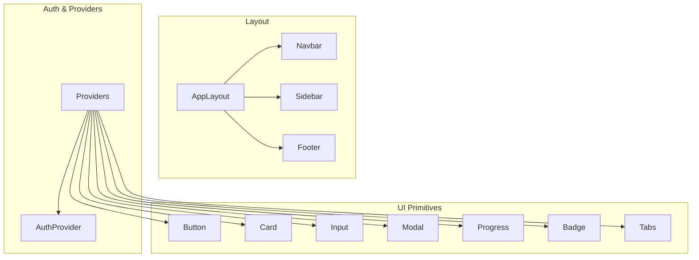

**Diagram sources**
- [index.ts:1-15](file://src/components/ui/index.ts#L1-L15)
- [AppLayout.tsx:1-25](file://src/components/layout/AppLayout.tsx#L1-L25)
- [Navbar.tsx:1-162](file://src/components/layout/Navbar.tsx#L1-L162)
- [Sidebar.tsx:1-74](file://src/components/layout/Sidebar.tsx#L1-L74)
- [Footer.tsx:1-35](file://src/components/layout/Footer.tsx#L1-L35)
- [AuthProvider.tsx:1-58](file://src/components/auth/AuthProvider.tsx#L1-L58)
- [Providers.tsx:1-23](file://src/components/Providers.tsx#L1-L23)

**Section sources**
- [index.ts:1-15](file://src/components/ui/index.ts#L1-L15)
- [AppLayout.tsx:1-25](file://src/components/layout/AppLayout.tsx#L1-L25)
- [Providers.tsx:1-23](file://src/components/Providers.tsx#L1-L23)

## Core Components
This section summarizes the key UI primitives and their configuration surface.

- Button
  - Purpose: Primary interactive action with variants and sizes; supports loading state.
  - Props: variant (primary, secondary, ghost, danger), size (sm, md, lg), loading, disabled, plus standard button attributes.
  - Events: onClick and other native button events forwarded.
  - Customization: Variants and sizes map to Tailwind classes; use className to override or extend.
  - Accessibility: Focus ring and disabled states are styled; ensure meaningful labels when used as icon-only buttons.
  - Usage example path: [Button.tsx:10-58](file://src/components/ui/Button.tsx#L10-L58)

- Card
  - Purpose: Content container with visual hierarchy.
  - Props: variant (default, elevated, bordered), padding (none, sm, md, lg), plus HTML div attributes.
  - Customization: Combine variant and padding; extend with className.
  - Accessibility: Semantic div; add aria-label or role if used as a landmark.
  - Usage example path: [Card.tsx:7-45](file://src/components/ui/Card.tsx#L7-L45)

- Input
  - Purpose: Text input with label, optional left icon, and error display.
  - Props: label, error, leftIcon, id, and all native input attributes.
  - Events: onChange, onBlur, onFocus, etc., forwarded to the underlying input.
  - Customization: Error styling and focus ring integrate with theme tokens; leftIcon adds spacing automatically.
  - Accessibility: Label is linked via htmlFor; error text is presented below the field.
  - Usage example path: [Input.tsx:4-52](file://src/components/ui/Input.tsx#L4-L52)

- Modal
  - Purpose: Accessible dialog overlay with backdrop and keyboard support.
  - Props: isOpen, onClose, title, children, className, maxWidth.
  - Events: Escape key triggers onClose; clicking backdrop closes modal.
  - Customization: Title bar and content area can be extended via className; width controlled by maxWidth.
  - Accessibility: Uses role="dialog", aria-modal, aria-label; traps focus context while open; prevents body scroll.
  - Usage example path: [Modal.tsx:7-82](file://src/components/ui/Modal.tsx#L7-L82)

- Progress
  - Purpose: Linear progress indicator with color variants and sizes.
  - Props: value (0–100), variant (primary, success, error, warning), showLabel, size (sm, md, lg), className.
  - Behavior: Value is clamped to 0–100; animated fill width.
  - Customization: Use variant for semantic meaning; showLabel for percentage readout.
  - Accessibility: Provide descriptive aria-label or aria-valuetext when needed for screen readers.
  - Usage example path: [Progress.tsx:5-58](file://src/components/ui/Progress.tsx#L5-L58)

- Badge
  - Purpose: Small status or category indicator.
  - Props: variant (default, success, error, warning, info, ai), plus span attributes.
  - Customization: Choose variant for semantic color; extend with className.
  - Accessibility: Use aria-live or aria-describedby if badge conveys dynamic status changes.
  - Usage example path: [Badge.tsx:6-34](file://src/components/ui/Badge.tsx#L6-L34)

- Tabs
  - Purpose: Controlled tab navigation with active state styling.
  - Props: tabs (array of {id, label}), activeTab, onTabChange(id), className.
  - Events: onTabChange fires when a tab is selected.
  - Customization: Active/inactive styles are applied via className logic; extend with className.
  - Accessibility: Buttons are keyboard navigable; consider adding aria-selected and aria-controls for richer semantics.
  - Usage example path: [Tabs.tsx:5-38](file://src/components/ui/Tabs.tsx#L5-L38)

**Section sources**
- [Button.tsx:10-58](file://src/components/ui/Button.tsx#L10-L58)
- [Card.tsx:7-45](file://src/components/ui/Card.tsx#L7-L45)
- [Input.tsx:4-52](file://src/components/ui/Input.tsx#L4-L52)
- [Modal.tsx:7-82](file://src/components/ui/Modal.tsx#L7-L82)
- [Progress.tsx:5-58](file://src/components/ui/Progress.tsx#L5-L58)
- [Badge.tsx:6-34](file://src/components/ui/Badge.tsx#L6-L34)
- [Tabs.tsx:5-38](file://src/components/ui/Tabs.tsx#L5-L38)

## Architecture Overview
The layout system composes a consistent page shell across the application. AppLayout wraps content with a sticky Navbar, a persistent Sidebar, and a main content area. The Navbar adapts to landing vs. app contexts and includes mobile menu behavior. Sidebar provides app navigation with active state detection. Footer offers branding and links.

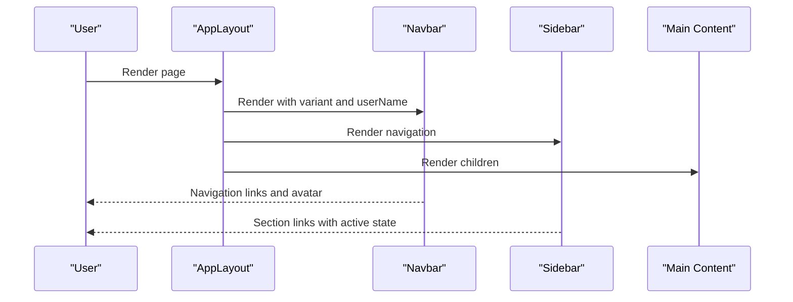

**Diagram sources**
- [AppLayout.tsx:5-24](file://src/components/layout/AppLayout.tsx#L5-L24)
- [Navbar.tsx:25-161](file://src/components/layout/Navbar.tsx#L25-L161)
- [Sidebar.tsx:14-73](file://src/components/layout/Sidebar.tsx#L14-L73)

**Section sources**
- [AppLayout.tsx:5-24](file://src/components/layout/AppLayout.tsx#L5-L24)
- [Navbar.tsx:25-161](file://src/components/layout/Navbar.tsx#L25-L161)
- [Sidebar.tsx:14-73](file://src/components/layout/Sidebar.tsx#L14-L73)

## Detailed Component Analysis

### Button
- Props and types: variant, size, loading, disabled, plus native button attributes.
- Styling: Uses theme tokens for background, text, borders, and focus rings; class merging via utility helper.
- Loading state: Renders a spinner icon and disables interaction while loading.
- Accessibility: Focus ring and disabled state are visually distinct; ensure accessible names for icon-only buttons.
- Composition: Can wrap icons or text; combine with Card or Modal actions.

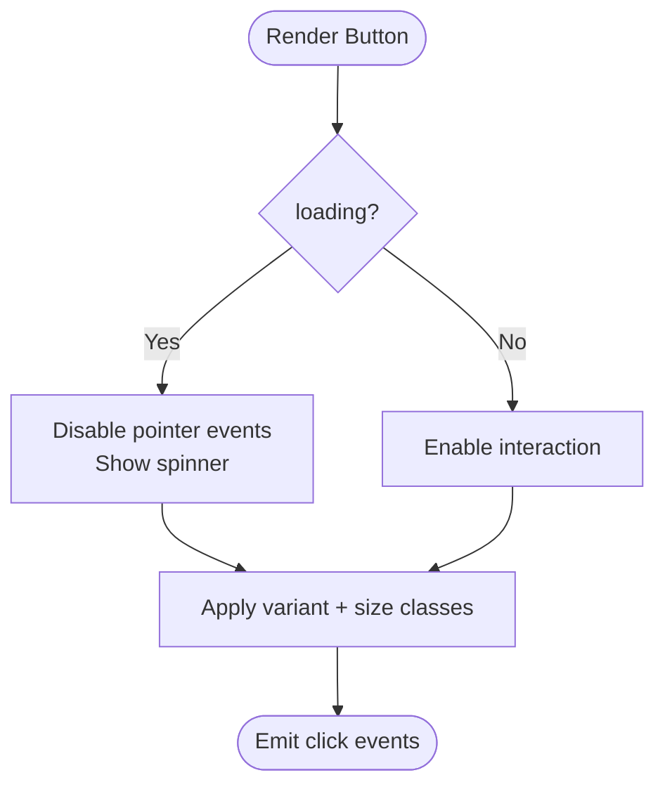

**Diagram sources**
- [Button.tsx:10-58](file://src/components/ui/Button.tsx#L10-L58)

**Section sources**
- [Button.tsx:10-58](file://src/components/ui/Button.tsx#L10-L58)

### Card
- Props and types: variant, padding, plus HTML div attributes.
- Styling: Theme-based backgrounds and borders; elevation via shadow; padding scales with size.
- Composition: Wraps headers, lists, forms, or media; pair with Badge for status.

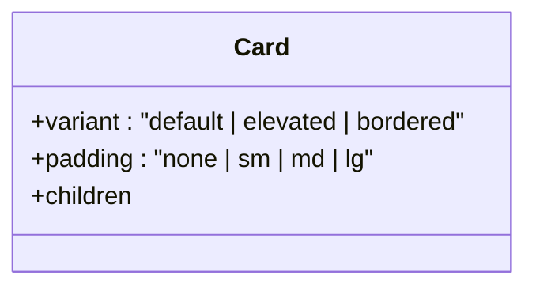

**Diagram sources**
- [Card.tsx:7-45](file://src/components/ui/Card.tsx#L7-L45)

**Section sources**
- [Card.tsx:7-45](file://src/components/ui/Card.tsx#L7-L45)

### Input
- Props and types: label, error, leftIcon, id, plus native input attributes.
- Behavior: Auto-generates id from label if none provided; applies error styles and focus ring.
- Accessibility: Label associates with input via htmlFor; error message is visible below.
- Composition: Use within forms; pair with Button for submission.

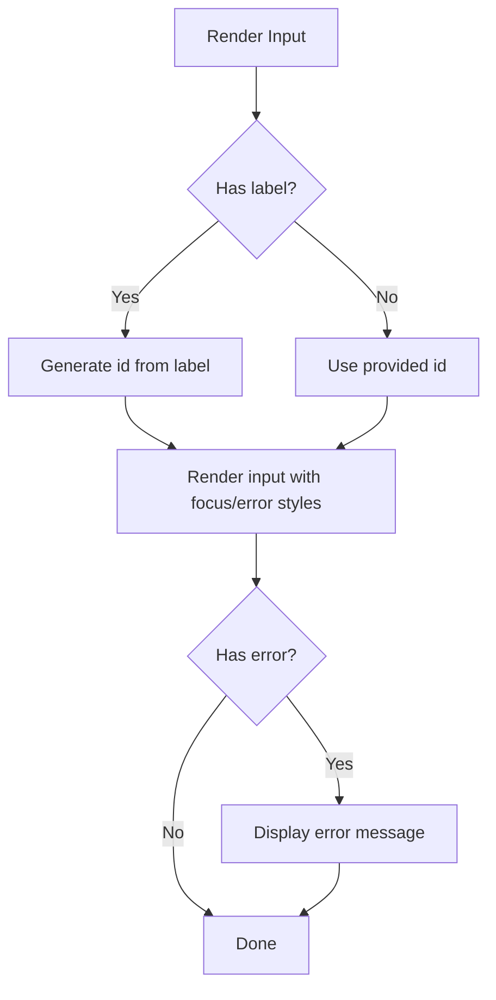

**Diagram sources**
- [Input.tsx:4-52](file://src/components/ui/Input.tsx#L4-L52)

**Section sources**
- [Input.tsx:4-52](file://src/components/ui/Input.tsx#L4-L52)

### Modal
- Props and types: isOpen, onClose, title, children, className, maxWidth.
- Behavior: Hides when not open; prevents body scroll; handles Escape key; closes on backdrop click.
- Accessibility: role="dialog", aria-modal, aria-label; close button has aria-label.
- Composition: Wrap forms, confirmations, or rich content; control visibility from parent state.

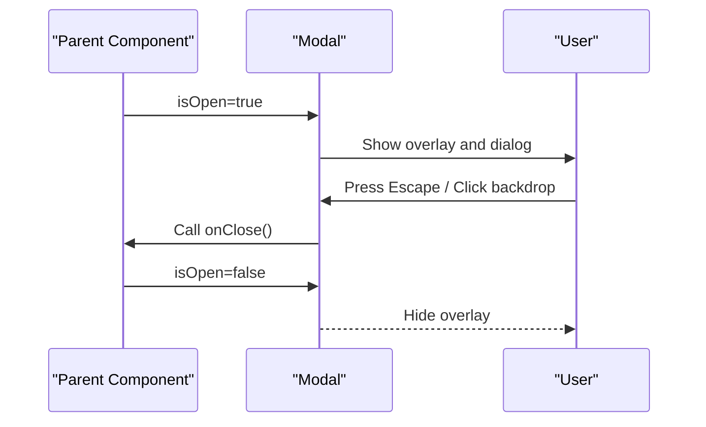

**Diagram sources**
- [Modal.tsx:7-82](file://src/components/ui/Modal.tsx#L7-L82)

**Section sources**
- [Modal.tsx:7-82](file://src/components/ui/Modal.tsx#L7-L82)

### Progress
- Props and types: value (0–100), variant, showLabel, size, className.
- Behavior: Clamps value; animates width; optionally shows percentage label.
- Accessibility: Add aria-valuenow and aria-label for screen reader context.
- Composition: Use within Cards or alongside Buttons to indicate load or completion.

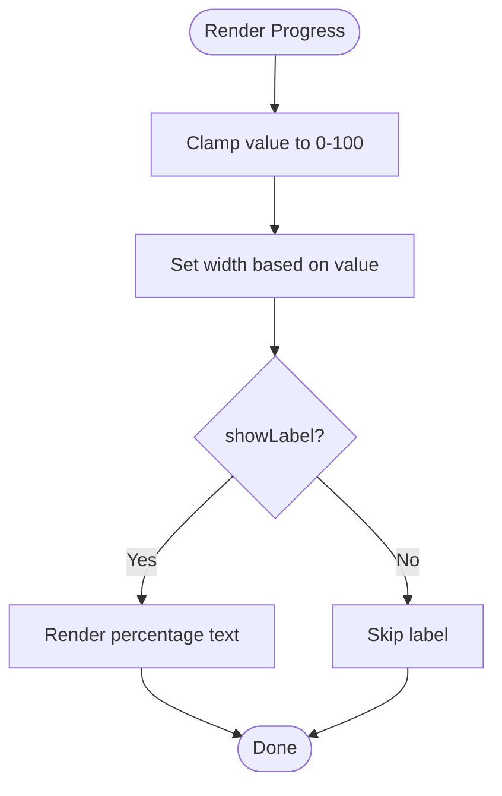

**Diagram sources**
- [Progress.tsx:5-58](file://src/components/ui/Progress.tsx#L5-L58)

**Section sources**
- [Progress.tsx:5-58](file://src/components/ui/Progress.tsx#L5-L58)

### Badge
- Props and types: variant (default, success, error, warning, info, ai), plus span attributes.
- Styling: Semantic colors via theme tokens; compact inline presentation.
- Accessibility: Use aria-live regions for dynamic updates.
- Composition: Place next to titles, list items, or inside Cards.

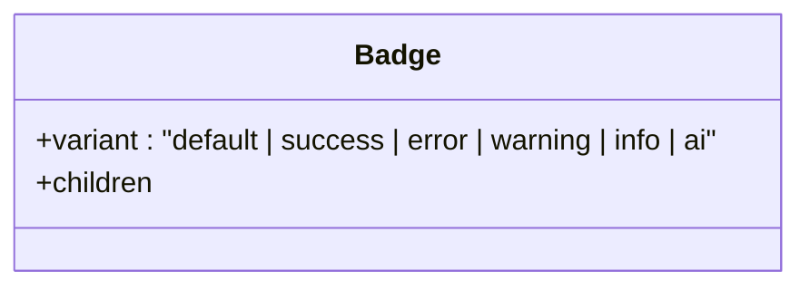

**Diagram sources**
- [Badge.tsx:6-34](file://src/components/ui/Badge.tsx#L6-L34)

**Section sources**
- [Badge.tsx:6-34](file://src/components/ui/Badge.tsx#L6-L34)

### Tabs
- Props and types: tabs array ({id, label}), activeTab, onTabChange(id), className.
- Behavior: Highlights active tab; delegates selection to parent via callback.
- Accessibility: Keyboard navigable; consider adding aria-selected and aria-controls for enhanced semantics.
- Composition: Pair with Tab panels managed by parent state.

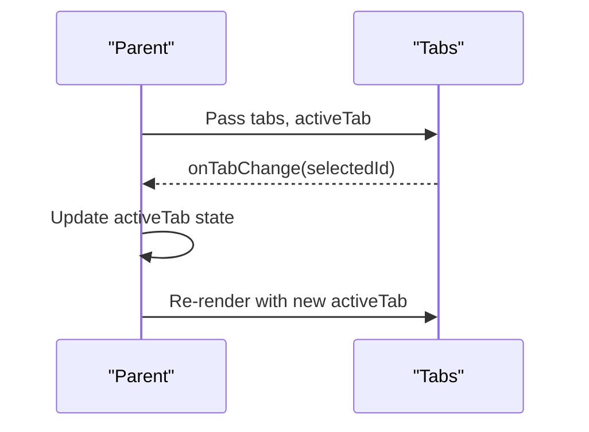

**Diagram sources**
- [Tabs.tsx:5-38](file://src/components/ui/Tabs.tsx#L5-L38)

**Section sources**
- [Tabs.tsx:5-38](file://src/components/ui/Tabs.tsx#L5-L38)

### Layout Components

#### AppLayout
- Composes Navbar, Sidebar, and a responsive main content area.
- Props: children, userName (passed to Navbar).
- Responsive behavior: Sidebar hidden on small screens; main content expands flexibly.

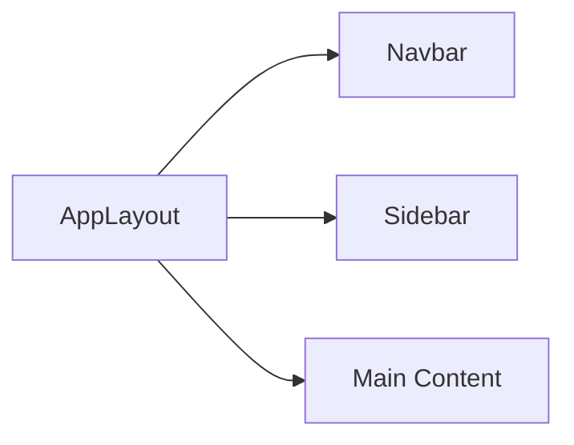

**Diagram sources**
- [AppLayout.tsx:5-24](file://src/components/layout/AppLayout.tsx#L5-L24)

**Section sources**
- [AppLayout.tsx:5-24](file://src/components/layout/AppLayout.tsx#L5-L24)

#### Navbar
- Provides top navigation with app or landing variants, mobile menu toggle, and user avatar.
- Props: variant ("landing" | "app"), userName.
- Behavior: Highlights current route; collapses to hamburger menu on small screens.

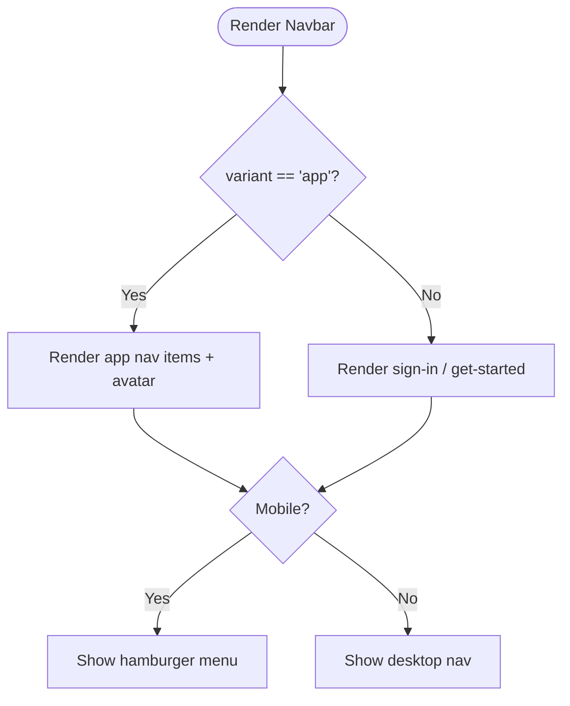

**Diagram sources**
- [Navbar.tsx:25-161](file://src/components/layout/Navbar.tsx#L25-L161)

**Section sources**
- [Navbar.tsx:25-161](file://src/components/layout/Navbar.tsx#L25-L161)

#### Sidebar
- Persistent navigation panel with active state detection and brand footer.
- Behavior: Highlights current route or prefix matches; fixed width on large screens.

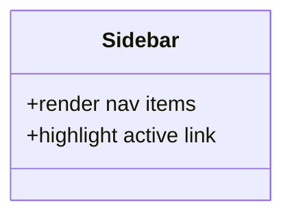

**Diagram sources**
- [Sidebar.tsx:14-73](file://src/components/layout/Sidebar.tsx#L14-L73)

**Section sources**
- [Sidebar.tsx:14-73](file://src/components/layout/Sidebar.tsx#L14-L73)

#### Footer
- Simple footer with branding and quick links.
- Usage: Include at the bottom of pages or within layouts.

**Section sources**
- [Footer.tsx:1-35](file://src/components/layout/Footer.tsx#L1-L35)

### Authentication Components
- AuthProvider
  - Provides user context with mock data for development; ready to wire to Supabase auth state listener.
  - Exposes user and loading state via a custom hook.
  - Integration: Wrap your app tree with Providers to enable global access to auth and data fetching.

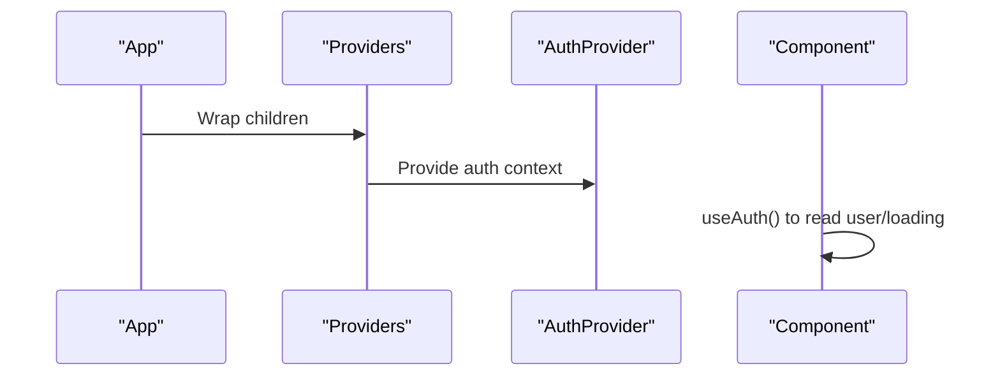

**Diagram sources**
- [AuthProvider.tsx:11-57](file://src/components/auth/AuthProvider.tsx#L11-L57)
- [Providers.tsx:7-22](file://src/components/Providers.tsx#L7-L22)

**Section sources**
- [AuthProvider.tsx:11-57](file://src/components/auth/AuthProvider.tsx#L11-L57)
- [Providers.tsx:7-22](file://src/components/Providers.tsx#L7-L22)

## Dependency Analysis
- UI primitives depend on shared utilities for class merging and theme tokens.
- Layout components depend on Next.js routing hooks and lucide-react icons.
- Providers orchestrate TanStack Query and Toast context for global features.
- Barrel export centralizes UI imports for clean consumption.

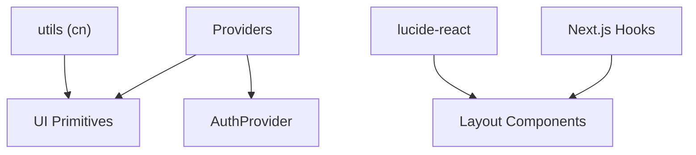

**Diagram sources**
- [index.ts:1-15](file://src/components/ui/index.ts#L1-L15)
- [Providers.tsx:1-23](file://src/components/Providers.tsx#L1-L23)
- [Navbar.tsx:1-162](file://src/components/layout/Navbar.tsx#L1-L162)
- [Sidebar.tsx:1-74](file://src/components/layout/Sidebar.tsx#L1-L74)

**Section sources**
- [index.ts:1-15](file://src/components/ui/index.ts#L1-L15)
- [Providers.tsx:1-23](file://src/components/Providers.tsx#L1-L23)

## Performance Considerations
- Prefer controlled components for stateful UI (e.g., Tabs, Modal) to keep rendering predictable.
- Avoid unnecessary re-renders by memoizing callbacks passed to components where appropriate.
- Use lightweight icons and avoid heavy dependencies in frequently rendered components.
- Leverage Tailwind’s utility-first approach to minimize CSS overhead and improve build times.
- Keep Modal closed by default and only render when needed to reduce DOM cost.

[No sources needed since this section provides general guidance]

## Troubleshooting Guide
- Modal does not close on Escape
  - Ensure onKeyDown handler is attached and isOpen is true before adding listeners.
  - Verify that onClose is correctly wired to parent state.
  - Reference: [Modal.tsx:26-38](file://src/components/ui/Modal.tsx#L26-L38)

- Input error not showing
  - Confirm error prop is passed and not overridden by className.
  - Ensure label/id association is correct for accessibility.
  - Reference: [Input.tsx:10-46](file://src/components/ui/Input.tsx#L10-L46)

- Button loading state not disabling clicks
  - Verify loading prop is set and disabled is derived from it.
  - Ensure no external onClick overrides disable behavior.
  - Reference: [Button.tsx:33-52](file://src/components/ui/Button.tsx#L33-L52)

- Tabs active state not updating
  - Ensure onTabChange updates activeTab in parent state.
  - Confirm activeTab matches the selected tab id.
  - Reference: [Tabs.tsx:17-33](file://src/components/ui/Tabs.tsx#L17-L33)

- Navbar mobile menu not toggling
  - Check state update for mobileOpen and event binding on menu button.
  - Reference: [Navbar.tsx:104-158](file://src/components/layout/Navbar.tsx#L104-L158)

**Section sources**
- [Modal.tsx:26-38](file://src/components/ui/Modal.tsx#L26-L38)
- [Input.tsx:10-46](file://src/components/ui/Input.tsx#L10-L46)
- [Button.tsx:33-52](file://src/components/ui/Button.tsx#L33-L52)
- [Tabs.tsx:17-33](file://src/components/ui/Tabs.tsx#L17-L33)
- [Navbar.tsx:104-158](file://src/components/layout/Navbar.tsx#L104-L158)

## Conclusion
MedAce AI’s component library provides a cohesive set of UI primitives and layout building blocks designed for consistency, accessibility, and responsiveness. By leveraging theme tokens, controlled state patterns, and clear composition strategies, teams can rapidly assemble robust interfaces. The authentication context and provider setup streamline global state management and future backend integration.

[No sources needed since this section summarizes without analyzing specific files]

## Appendices

### Theme and Styling Guidelines
- Use theme tokens (e.g., bg-surface, text-text, border-border) for consistent visuals.
- Apply variant and size props where available; fall back to className for custom overrides.
- Maintain focus states for keyboard accessibility; rely on built-in focus rings.

[No sources needed since this section provides general guidance]

### Accessibility Checklist
- Ensure all interactive elements have accessible names and roles.
- Provide descriptive labels for modals and progress indicators.
- Test keyboard navigation and screen reader announcements.

[No sources needed since this section provides general guidance]

### Integration Patterns
- Wrap your app with Providers to enable data fetching and toast functionality.
- Use AuthProvider to expose user state; replace mock data with real auth when ready.
- Compose layout with AppLayout for consistent page structure across routes.

**Section sources**
- [Providers.tsx:7-22](file://src/components/Providers.tsx#L7-L22)
- [AuthProvider.tsx:31-57](file://src/components/auth/AuthProvider.tsx#L31-L57)
- [AppLayout.tsx:5-24](file://src/components/layout/AppLayout.tsx#L5-L24)