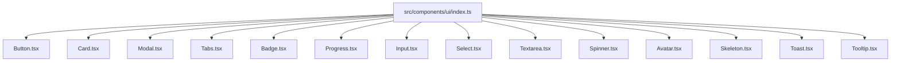
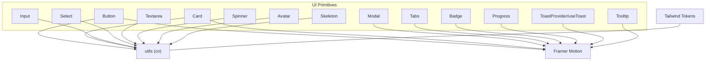
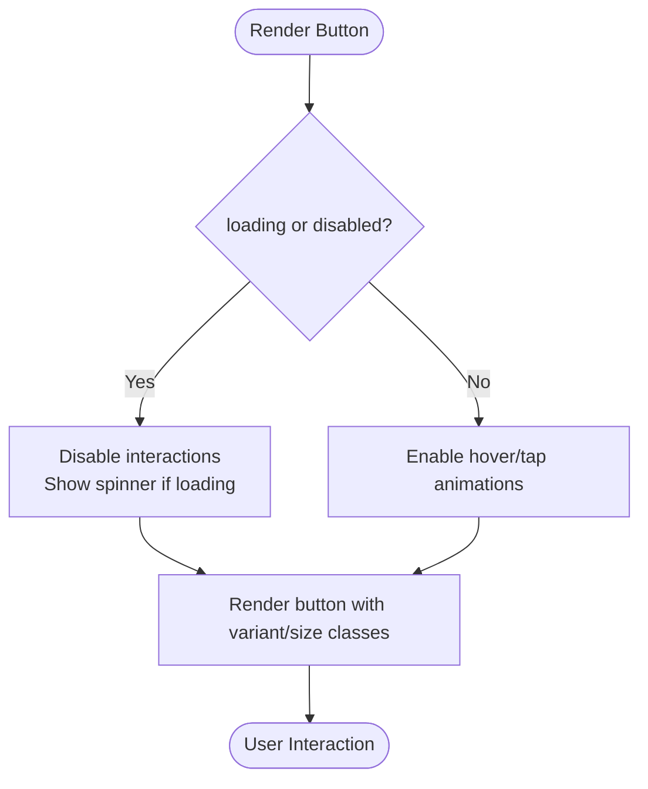
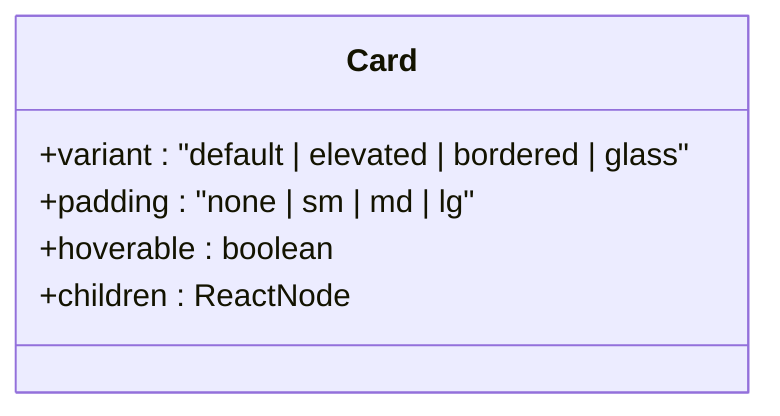
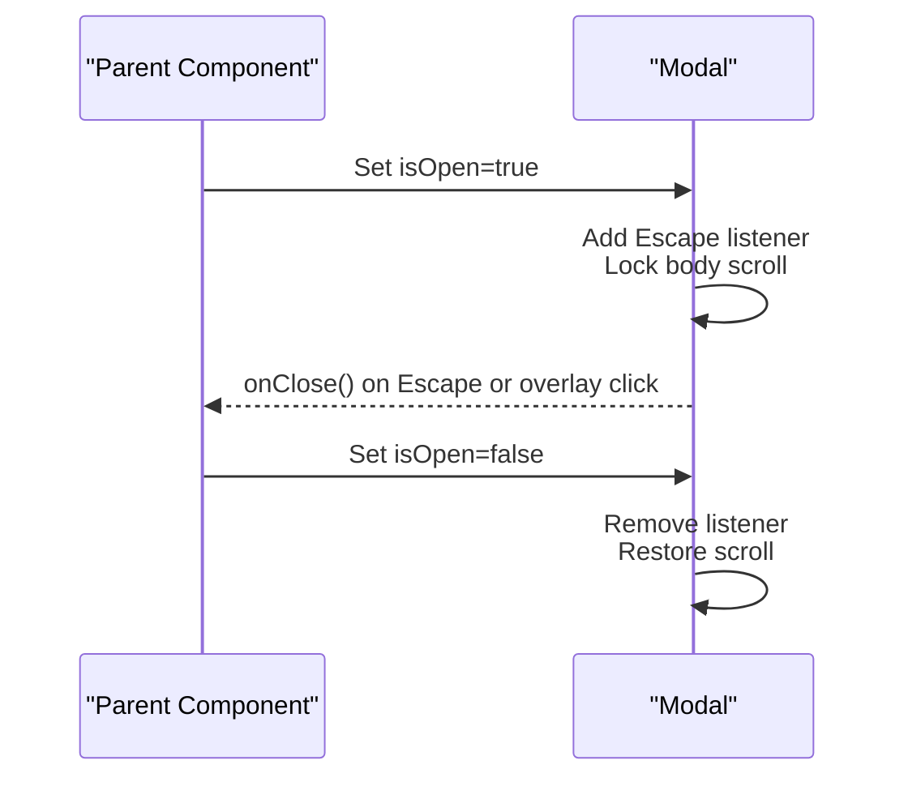
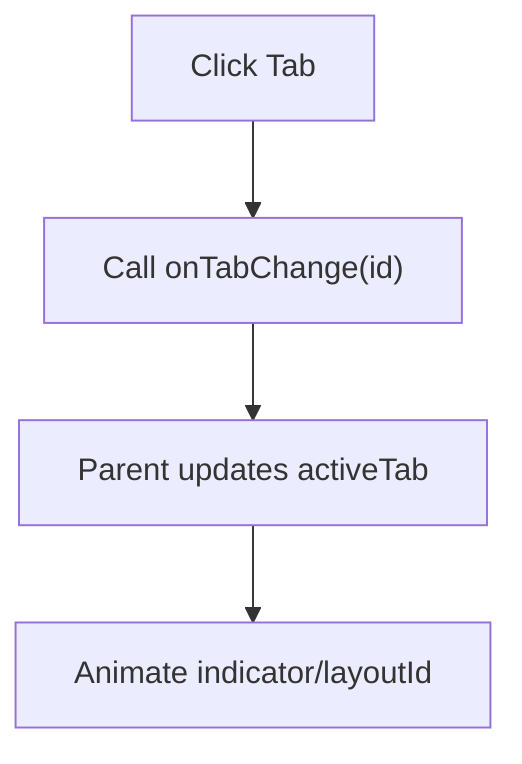
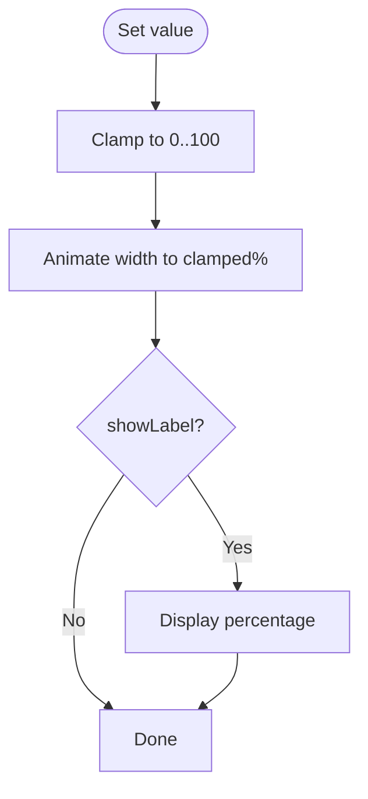
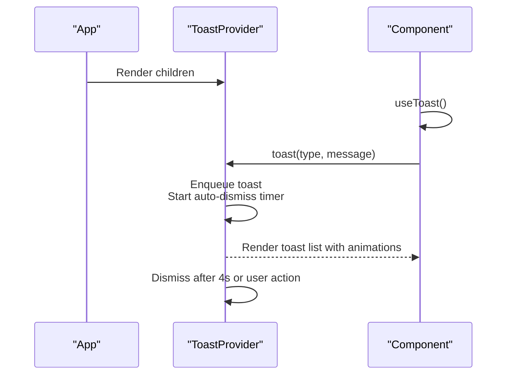
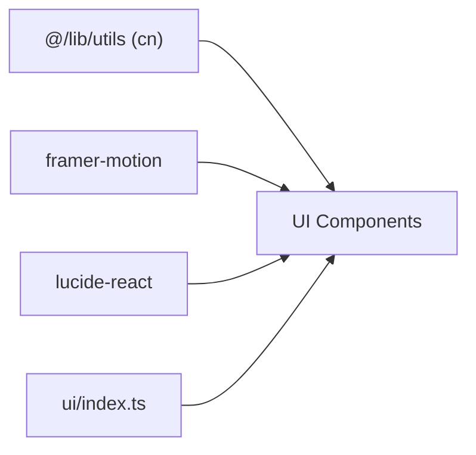

# Component Library

<cite>
**Referenced Files in This Document**
- [index.ts](file://src/components/ui/index.ts)
- [Button.tsx](file://src/components/ui/Button.tsx)
- [Card.tsx](file://src/components/ui/Card.tsx)
- [Modal.tsx](file://src/components/ui/Modal.tsx)
- [Tabs.tsx](file://src/components/ui/Tabs.tsx)
- [Badge.tsx](file://src/components/ui/Badge.tsx)
- [Progress.tsx](file://src/components/ui/Progress.tsx)
- [Input.tsx](file://src/components/ui/Input.tsx)
- [Select.tsx](file://src/components/ui/Select.tsx)
- [Textarea.tsx](file://src/components/ui/Textarea.tsx)
- [Spinner.tsx](file://src/components/ui/Spinner.tsx)
- [Avatar.tsx](file://src/components/ui/Avatar.tsx)
- [Skeleton.tsx](file://src/components/ui/Skeleton.tsx)
- [Toast.tsx](file://src/components/ui/Toast.tsx)
- [Tooltip.tsx](file://src/components/ui/Tooltip.tsx)
</cite>

## Table of Contents
1. [Introduction](#introduction)
2. [Project Structure](#project-structure)
3. [Core Components](#core-components)
4. [Architecture Overview](#architecture-overview)
5. [Detailed Component Analysis](#detailed-component-analysis)
6. [Dependency Analysis](#dependency-analysis)
7. [Performance Considerations](#performance-considerations)
8. [Troubleshooting Guide](#troubleshooting-guide)
9. [Conclusion](#conclusion)
10. [Appendices](#appendices)

## Introduction
This document describes MedAce-AI’s reusable UI component library built with Tailwind CSS and Framer Motion. It covers primitive components for buttons, cards, modals, tabs, badges, progress indicators, form controls (input, select, textarea), feedback elements (spinner, toast, tooltip), and visual placeholders (avatar, skeleton). The design system emphasizes glassmorphism (backdrop blur, translucent surfaces), gradient accents, and subtle glow animations. Animations are powered by Framer Motion using spring physics, shared element transitions, and responsive motion patterns. Guidelines for responsive design, accessibility, and cross-browser compatibility are included, along with composition patterns, theming support via Tailwind tokens, and integration notes for the application layout.

## Project Structure
The component library is organized under src/components/ui with a single barrel export file that re-exports all primitives for convenient imports across the app. Each component is implemented as a small, focused React module styled with Tailwind utility classes and enhanced with Framer Motion where appropriate.

**Diagram sources**
- [index.ts:1-15](file://src/components/ui/index.ts#L1-L15)

**Section sources**
- [index.ts:1-15](file://src/components/ui/index.ts#L1-L15)

## Core Components
Below is a concise overview of each primitive, including appearance, behavior, props, events, and customization options. For implementation details and exact prop types, see the referenced files.

- Button
  - Appearance: Rounded button with gradient primary variant; secondary, ghost, and danger variants; optional glow effect.
  - Behavior: Hover scale-up and tap scale-down via Framer Motion; loading state shows spinner; disabled state prevents interaction.
  - Props: variant, size, loading, glow, plus standard HTML button attributes.
  - Events: All native button events supported via spread props.
  - Customization: Variants and sizes map to Tailwind classes; custom className can override styles.

- Card
  - Appearance: Default, elevated, bordered, and glass variants; configurable padding.
  - Behavior: Optional hoverable mode lifts card on hover with shadow.
  - Props: variant, padding, hoverable, plus HTML div attributes.
  - Customization: Glass variant uses backdrop blur and translucent background; other variants adjust borders/shadows.

- Modal
  - Appearance: Centered dialog with blurred dark backdrop; header with title and close button; accessible role and labels.
  - Behavior: Opens/closes based on isOpen; Escape key closes; clicking overlay closes; spring-based entrance/exit animations.
  - Props: isOpen, onClose, title, children, className, maxWidth.
  - Accessibility: role="dialog", aria-modal, aria-label on container; focus trap not enforced here but keyboard escape is handled.

- Tabs
  - Appearance: Underline or pill style; active tab highlighted with gradient or indicator.
  - Behavior: Controlled activeTab; onTabChange callback updates selection; shared element animation for active indicator.
  - Props: tabs array (id, label), activeTab, onTabChange, variant, className.
  - Customization: Variant switches between underline and pill modes.

- Badge
  - Appearance: Small rounded label; default, success, error, warning, info, and AI-themed variants.
  - Behavior: Spring-in animation on mount; AI variant adds gradient border.
  - Props: variant, plus HTML span attributes.
  - Customization: Use Tailwind color tokens via variants; extend with className.

- Progress
  - Appearance: Horizontal bar with rounded ends; multiple variants; optional glow; size options.
  - Behavior: Animated width from 0 to value using spring; clamps value to 0–100; optional percentage label.
  - Props: value, variant, showLabel, size, glow, className.
  - Customization: Variants map to colors; glow applies colored shadow.

- Input
  - Appearance: Field with label, optional left icon, focus ring with subtle glow; error state with shake animation.
  - Behavior: Accessible label association; error message display; focus states.
  - Props: label, error, leftIcon, id, plus standard input attributes.
  - Customization: Error styling and focus effects use Tailwind utilities; className overrides allowed.

- Select
  - Appearance: Styled select with custom chevron; placeholder option; error state.
  - Behavior: Accessible label association; error message display; focus ring and glow.
  - Props: label, error, options (value, label), placeholder, id, plus standard select attributes.
  - Customization: Options rendered with consistent theme colors; className overrides allowed.

- Textarea
  - Appearance: Multi-line field with label; focus ring and glow; resizable vertically.
  - Behavior: Accessible label association; error message display.
  - Props: label, error, id, plus standard textarea attributes.
  - Customization: Focus and error states themed via Tailwind; className overrides allowed.

- Spinner
  - Appearance: Rotating loader icon; sized variants.
  - Behavior: Always spinning; accessible label.
  - Props: size, className.
  - Customization: Color inherited from text-primary; size classes control dimensions.

- Avatar
  - Appearance: Circular image or initials fallback; border and size variants.
  - Behavior: Shows image if provided; otherwise displays initials derived from name.
  - Props: src, name, size, className.
  - Customization: Size classes control dimensions; border and background themed via Tailwind.

- Skeleton
  - Appearance: Placeholder shimmer blocks; text lines, card shape, or circle.
  - Behavior: Static placeholder; uses shimmer class for animation.
  - Props: variant, lines, className.
  - Customization: Choose shape via variant; customize dimensions via className.

- Toast
  - Appearance: Floating notifications bottom-right; icons per type; auto-dismiss progress bar.
  - Behavior: Provider manages queue; toast function enqueues messages; auto-dismiss after timeout; AnimatePresence for enter/exit.
  - Props: Provided via context; no direct render props.
  - Usage: Wrap app with provider; call toast(type, message) from anywhere within context.
  - Customization: Types map to icons and borders; duration fixed at 4 seconds.

- Tooltip
  - Appearance: Floating label above target with pointer; glass-like surface.
  - Behavior: Delayed show/hide via mouse events; spring animation for visibility changes.
  - Props: content, children, className, delay.
  - Customization: Positioning and styling via className; delay adjustable.

**Section sources**
- [Button.tsx:1-68](file://src/components/ui/Button.tsx#L1-L68)
- [Card.tsx:1-70](file://src/components/ui/Card.tsx#L1-L70)
- [Modal.tsx:1-96](file://src/components/ui/Modal.tsx#L1-L96)
- [Tabs.tsx:1-76](file://src/components/ui/Tabs.tsx#L1-L76)
- [Badge.tsx:1-42](file://src/components/ui/Badge.tsx#L1-L42)
- [Progress.tsx:1-74](file://src/components/ui/Progress.tsx#L1-L74)
- [Input.tsx:1-55](file://src/components/ui/Input.tsx#L1-L55)
- [Select.tsx:1-65](file://src/components/ui/Select.tsx#L1-L65)
- [Textarea.tsx:1-46](file://src/components/ui/Textarea.tsx#L1-L46)
- [Spinner.tsx:1-25](file://src/components/ui/Spinner.tsx#L1-L25)
- [Avatar.tsx:1-58](file://src/components/ui/Avatar.tsx#L1-L58)
- [Skeleton.tsx:1-49](file://src/components/ui/Skeleton.tsx#L1-L49)
- [Toast.tsx:1-106](file://src/components/ui/Toast.tsx#L1-L106)
- [Tooltip.tsx:1-59](file://src/components/ui/Tooltip.tsx#L1-L59)

## Architecture Overview
The UI layer composes primitives into higher-level screens and layouts. Components rely on shared utilities (cn) and Tailwind theme tokens for consistent styling. Framer Motion provides micro-interactions and page-level transitions.

**Diagram sources**
- [Button.tsx:1-68](file://src/components/ui/Button.tsx#L1-L68)
- [Card.tsx:1-70](file://src/components/ui/Card.tsx#L1-L70)
- [Modal.tsx:1-96](file://src/components/ui/Modal.tsx#L1-L96)
- [Tabs.tsx:1-76](file://src/components/ui/Tabs.tsx#L1-L76)
- [Badge.tsx:1-42](file://src/components/ui/Badge.tsx#L1-L42)
- [Progress.tsx:1-74](file://src/components/ui/Progress.tsx#L1-L74)
- [Input.tsx:1-55](file://src/components/ui/Input.tsx#L1-L55)
- [Select.tsx:1-65](file://src/components/ui/Select.tsx#L1-L65)
- [Textarea.tsx:1-46](file://src/components/ui/Textarea.tsx#L1-L46)
- [Spinner.tsx:1-25](file://src/components/ui/Spinner.tsx#L1-L25)
- [Avatar.tsx:1-58](file://src/components/ui/Avatar.tsx#L1-L58)
- [Skeleton.tsx:1-49](file://src/components/ui/Skeleton.tsx#L1-L49)
- [Toast.tsx:1-106](file://src/components/ui/Toast.tsx#L1-L106)
- [Tooltip.tsx:1-59](file://src/components/ui/Tooltip.tsx#L1-L59)

## Detailed Component Analysis

### Button
- Visuals: Gradient primary, secondary, ghost, danger; optional pulse-glow; rounded corners; focus ring.
- Interactions: Hover scale, tap scale; loading spinner; disabled state.
- Props: variant, size, loading, glow, plus HTML button attributes.
- Events: All native button events via props spread.
- Theming: Uses Tailwind tokens for colors and shadows; className overrides supported.

**Diagram sources**
- [Button.tsx:35-63](file://src/components/ui/Button.tsx#L35-L63)

**Section sources**
- [Button.tsx:1-68](file://src/components/ui/Button.tsx#L1-L68)

### Card
- Visuals: Variants include default, elevated, bordered, glass (with backdrop blur). Padding levels available.
- Interactions: Optional hoverable mode lifts card and increases shadow.
- Props: variant, padding, hoverable, plus HTML div attributes.
- Theming: Glass variant uses backdrop-blur-xl and translucent bg; others adjust borders/shadows.

**Diagram sources**
- [Card.tsx:10-14](file://src/components/ui/Card.tsx#L10-L14)

**Section sources**
- [Card.tsx:1-70](file://src/components/ui/Card.tsx#L1-L70)

### Modal
- Visuals: Backdrop with blur; dialog with header and body; accessible roles and labels.
- Interactions: Open/close controlled by parent; Escape key closes; click-outside closes; spring animations for open/close.
- Props: isOpen, onClose, title, children, className, maxWidth.
- Accessibility: role="dialog", aria-modal="true", aria-label set from title; focus management not enforced here.

**Diagram sources**
- [Modal.tsx:17-93](file://src/components/ui/Modal.tsx#L17-L93)

**Section sources**
- [Modal.tsx:1-96](file://src/components/ui/Modal.tsx#L1-L96)

### Tabs
- Visuals: Underline or pill variants; active indicator animates with shared layoutId.
- Interactions: Controlled activeTab; onTabChange updates selection; spring transition for indicator movement.
- Props: tabs (id, label), activeTab, onTabChange, variant, className.
- Composition: Typically used to switch content panels in a parent component.

**Diagram sources**
- [Tabs.tsx:19-73](file://src/components/ui/Tabs.tsx#L19-L73)

**Section sources**
- [Tabs.tsx:1-76](file://src/components/ui/Tabs.tsx#L1-L76)

### Badge
- Visuals: Small rounded label; AI variant adds gradient border; variants for status messaging.
- Interactions: Spring-in animation on mount.
- Props: variant, plus HTML span attributes.
- Theming: Colors mapped via Tailwind tokens; className overrides supported.

**Section sources**
- [Badge.tsx:1-42](file://src/components/ui/Badge.tsx#L1-L42)

### Progress
- Visuals: Horizontal bar with rounded ends; variants and sizes; optional glow.
- Interactions: Animated width from 0 to value using spring; clamped to 0–100; optional percentage label.
- Props: value, variant, showLabel, size, glow, className.
- Theming: Variants map to colors; glow applies colored shadow.

**Diagram sources**
- [Progress.tsx:37-70](file://src/components/ui/Progress.tsx#L37-L70)

**Section sources**
- [Progress.tsx:1-74](file://src/components/ui/Progress.tsx#L1-L74)

### Input
- Visuals: Field with label, optional left icon; focus ring with subtle glow; error state with shake animation.
- Interactions: Accessible label association; error message display; focus states.
- Props: label, error, leftIcon, id, plus standard input attributes.
- Theming: Focus and error states themed via Tailwind; className overrides supported.

**Section sources**
- [Input.tsx:1-55](file://src/components/ui/Input.tsx#L1-L55)

### Select
- Visuals: Styled select with custom chevron; placeholder option; error state.
- Interactions: Accessible label association; error message display; focus ring and glow.
- Props: label, error, options (value, label), placeholder, id, plus standard select attributes.
- Theming: Options themed consistently; className overrides supported.

**Section sources**
- [Select.tsx:1-65](file://src/components/ui/Select.tsx#L1-L65)

### Textarea
- Visuals: Multi-line field with label; focus ring and glow; resizable vertically.
- Interactions: Accessible label association; error message display.
- Props: label, error, id, plus standard textarea attributes.
- Theming: Focus and error states themed via Tailwind; className overrides supported.

**Section sources**
- [Textarea.tsx:1-46](file://src/components/ui/Textarea.tsx#L1-L46)

### Spinner
- Visuals: Rotating loader icon; sized variants.
- Interactions: Always spinning; accessible label.
- Props: size, className.
- Theming: Color inherited from text-primary; size classes control dimensions.

**Section sources**
- [Spinner.tsx:1-25](file://src/components/ui/Spinner.tsx#L1-L25)

### Avatar
- Visuals: Circular image or initials fallback; border and size variants.
- Interactions: Shows image if provided; otherwise displays initials derived from name.
- Props: src, name, size, className.
- Theming: Size classes control dimensions; border and background themed via Tailwind.

**Section sources**
- [Avatar.tsx:1-58](file://src/components/ui/Avatar.tsx#L1-L58)

### Skeleton
- Visuals: Placeholder shimmer blocks; text lines, card shape, or circle.
- Interactions: Static placeholder; uses shimmer class for animation.
- Props: variant, lines, className.
- Theming: Shimmer effect applied via Tailwind; customize via className.

**Section sources**
- [Skeleton.tsx:1-49](file://src/components/ui/Skeleton.tsx#L1-L49)

### Toast
- Visuals: Floating notifications bottom-right; icons per type; auto-dismiss progress bar.
- Interactions: Provider manages queue; toast function enqueues messages; auto-dismiss after timeout; AnimatePresence for enter/exit.
- API: Wrap app with ToastProvider; call useToast().toast(type, message) from any child.
- Props: None directly; configuration via context.
- Theming: Types map to icons and borders; duration fixed at 4 seconds.

**Diagram sources**
- [Toast.tsx:46-103](file://src/components/ui/Toast.tsx#L46-L103)

**Section sources**
- [Toast.tsx:1-106](file://src/components/ui/Toast.tsx#L1-L106)

### Tooltip
- Visuals: Floating label above target with pointer; glass-like surface.
- Interactions: Delayed show/hide via mouse events; spring animation for visibility changes.
- Props: content, children, className, delay.
- Theming: Surface and border themed via Tailwind; className overrides supported.

**Section sources**
- [Tooltip.tsx:1-59](file://src/components/ui/Tooltip.tsx#L1-L59)

## Dependency Analysis
- Shared Utilities: Most components import cn from "@/lib/utils" to merge class names efficiently.
- Animation: Framer Motion is used for micro-interactions (hover, tap, layoutId transitions, spring animations) and presence transitions (AnimatePresence).
- Icons: Lucide React icons are used for loaders and status icons.
- Export Pattern: Barrel index.ts centralizes exports for clean imports across the application.

**Diagram sources**
- [index.ts:1-15](file://src/components/ui/index.ts#L1-L15)
- [Button.tsx:1-68](file://src/components/ui/Button.tsx#L1-L68)
- [Card.tsx:1-70](file://src/components/ui/Card.tsx#L1-L70)
- [Modal.tsx:1-96](file://src/components/ui/Modal.tsx#L1-L96)
- [Tabs.tsx:1-76](file://src/components/ui/Tabs.tsx#L1-L76)
- [Badge.tsx:1-42](file://src/components/ui/Badge.tsx#L1-L42)
- [Progress.tsx:1-74](file://src/components/ui/Progress.tsx#L1-L74)
- [Input.tsx:1-55](file://src/components/ui/Input.tsx#L1-L55)
- [Select.tsx:1-65](file://src/components/ui/Select.tsx#L1-L65)
- [Textarea.tsx:1-46](file://src/components/ui/Textarea.tsx#L1-L46)
- [Spinner.tsx:1-25](file://src/components/ui/Spinner.tsx#L1-L25)
- [Avatar.tsx:1-58](file://src/components/ui/Avatar.tsx#L1-L58)
- [Skeleton.tsx:1-49](file://src/components/ui/Skeleton.tsx#L1-L49)
- [Toast.tsx:1-106](file://src/components/ui/Toast.tsx#L1-L106)
- [Tooltip.tsx:1-59](file://src/components/ui/Tooltip.tsx#L1-L59)

**Section sources**
- [index.ts:1-15](file://src/components/ui/index.ts#L1-L15)

## Performance Considerations
- Prefer controlled components for stateful UI (e.g., Tabs, Modal) to avoid unnecessary re-renders.
- Use Framer Motion’s layoutId for smooth shared element transitions without heavy computations.
- Avoid excessive nested motion wrappers; keep animations localized to relevant nodes.
- Leverage Tailwind’s utility classes for efficient styling without custom CSS overhead.
- Debounce or throttle expensive operations in parent components when updating many instances (e.g., large lists of Cards).
- Use Skeleton during data fetching to reduce perceived latency and improve UX.

[No sources needed since this section provides general guidance]

## Troubleshooting Guide
- Modal not closing on Escape: Ensure the modal receives isOpen and onClose props correctly and that the parent state updates on close.
- Toast not appearing: Verify the app tree includes ToastProvider and that toast is called from within its context.
- Input validation errors: Confirm error prop is passed and that the field has an associated label via htmlFor/id for accessibility.
- Select dropdown styling: Ensure custom SVG background is visible; check for conflicting global styles.
- Tooltip positioning: If content overflows viewport, consider adjusting placement or wrapping in a container with overflow handling.
- Glassmorphism artifacts: On some browsers, backdrop-blur may be unsupported; provide fallback backgrounds or disable glass variants conditionally.

**Section sources**
- [Modal.tsx:27-39](file://src/components/ui/Modal.tsx#L27-L39)
- [Toast.tsx:28-32](file://src/components/ui/Toast.tsx#L28-L32)
- [Input.tsx:12-48](file://src/components/ui/Input.tsx#L12-L48)
- [Select.tsx:18-58](file://src/components/ui/Select.tsx#L18-L58)
- [Tooltip.tsx:14-55](file://src/components/ui/Tooltip.tsx#L14-L55)

## Conclusion
MedAce-AI’s component library offers a cohesive, accessible, and animated set of primitives built on Tailwind CSS and Framer Motion. The design system emphasizes glassmorphism, gradients, and subtle glows while maintaining performance and usability. By following the guidelines for responsive design, accessibility, and theming, teams can compose rich interfaces quickly and consistently across the application.

[No sources needed since this section summarizes without analyzing specific files]

## Appendices

### Design Language: Glassmorphism and Glow
- Glass surfaces: Use Card variant "glass" for translucent backgrounds with backdrop blur.
- Gradients: Primary gradient used in Button and Tabs active states; apply via Tailwind utilities.
- Glow: Optional glow on Buttons and Progress for emphasis; ensure contrast remains sufficient.

[No sources needed since this section provides general guidance]

### Animation System: Framer Motion Patterns
- Spring physics: Used in Modals, Tabs, Badges, Progress, and Tooltips for natural motion.
- Shared element transitions: layoutId for Tabs indicator ensures smooth movement between active tabs.
- Presence transitions: AnimatePresence handles Modal and Toast enter/exit animations.

[No sources needed since this section provides general guidance]

### Responsive Design Guidelines
- Use Tailwind responsive prefixes to adapt spacing, font sizes, and widths.
- Ensure touch targets meet minimum sizes for mobile interactions.
- Test glassmorphism and backdrop blur on target devices; provide fallbacks where necessary.

[No sources needed since this section provides general guidance]

### Accessibility Compliance
- Provide labels and associations for form fields (label htmlFor/input id).
- Use semantic roles and ARIA attributes (e.g., Modal role="dialog", aria-modal).
- Ensure keyboard navigation and focus management (e.g., Escape to close Modal).
- Maintain sufficient color contrast for text and interactive elements.

[No sources needed since this section provides general guidance]

### Cross-Browser Compatibility
- Backdrop blur: Not fully supported in all environments; consider disabling glass variants on unsupported browsers.
- Framer Motion: Works across modern browsers; test Safari and older versions for edge cases.
- Tailwind utilities: Verify custom utilities (e.g., shimmer) are defined and compatible with target browsers.

[No sources needed since this section provides general guidance]

### Integration with Application Layout
- Wrap the app with ToastProvider to enable toasts globally.
- Compose higher-level pages using Card, Tabs, and Modal to structure content and interactions.
- Use Button and form controls consistently across forms and actions.
- Centralize exports via ui/index.ts for clean imports throughout the codebase.

[No sources needed since this section provides general guidance]