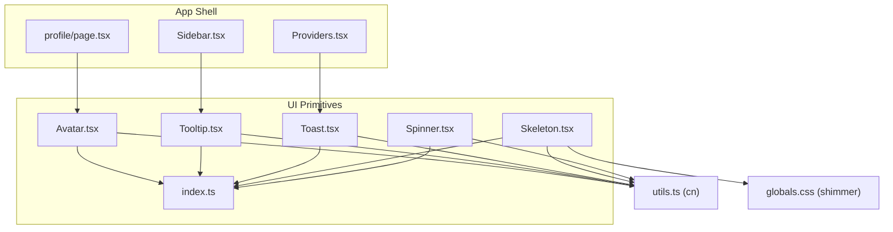
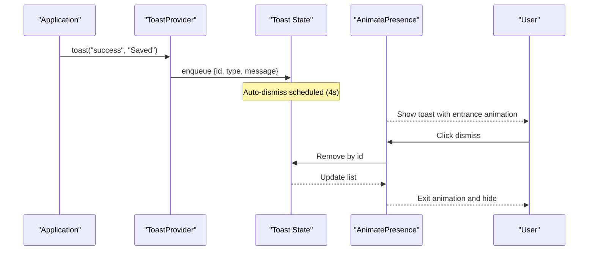
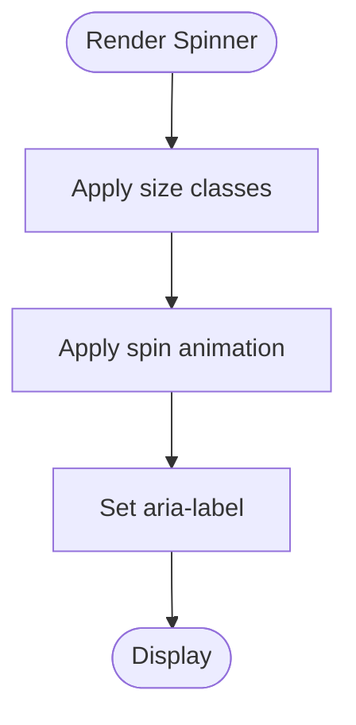
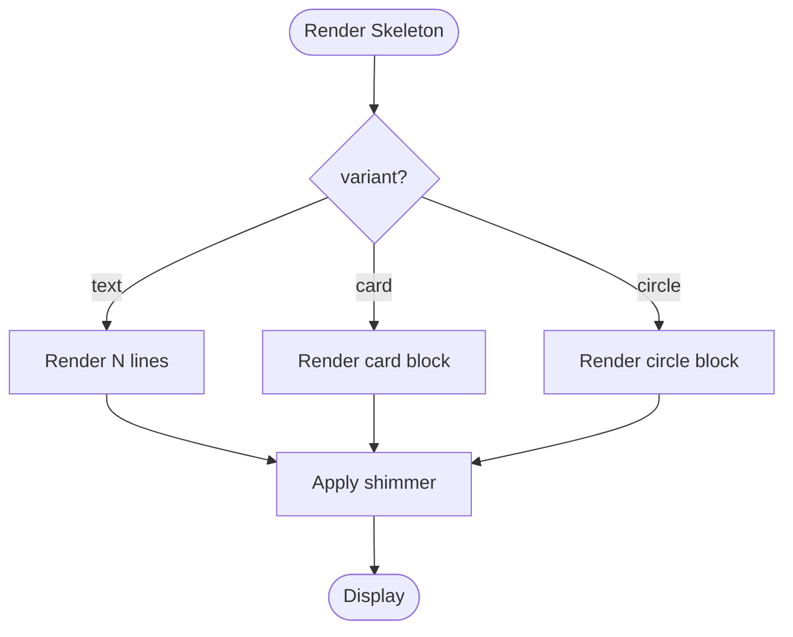
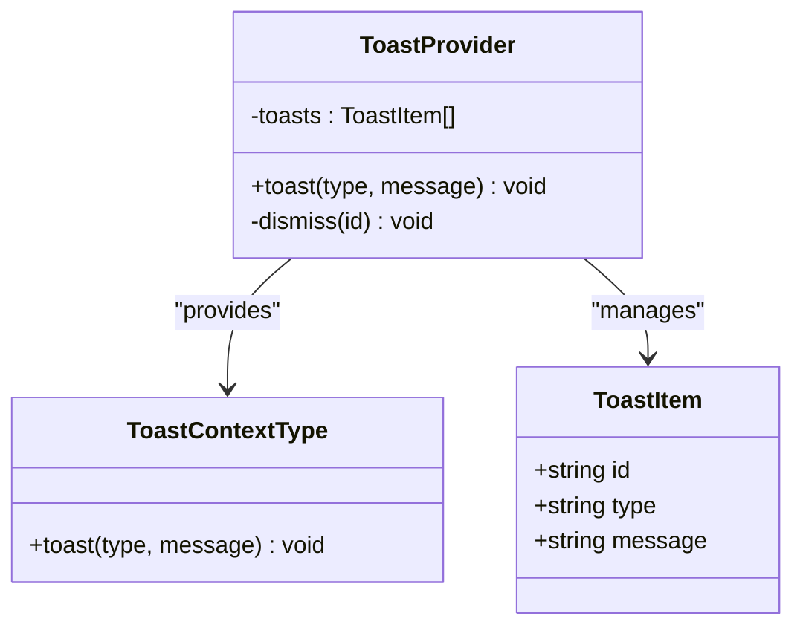
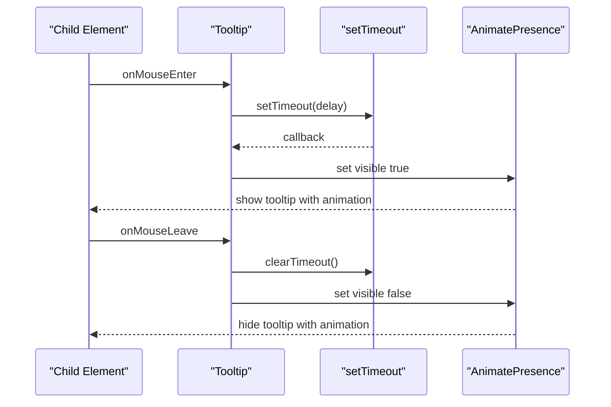
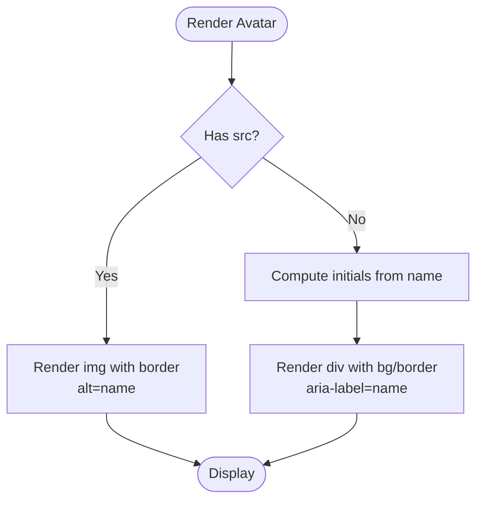
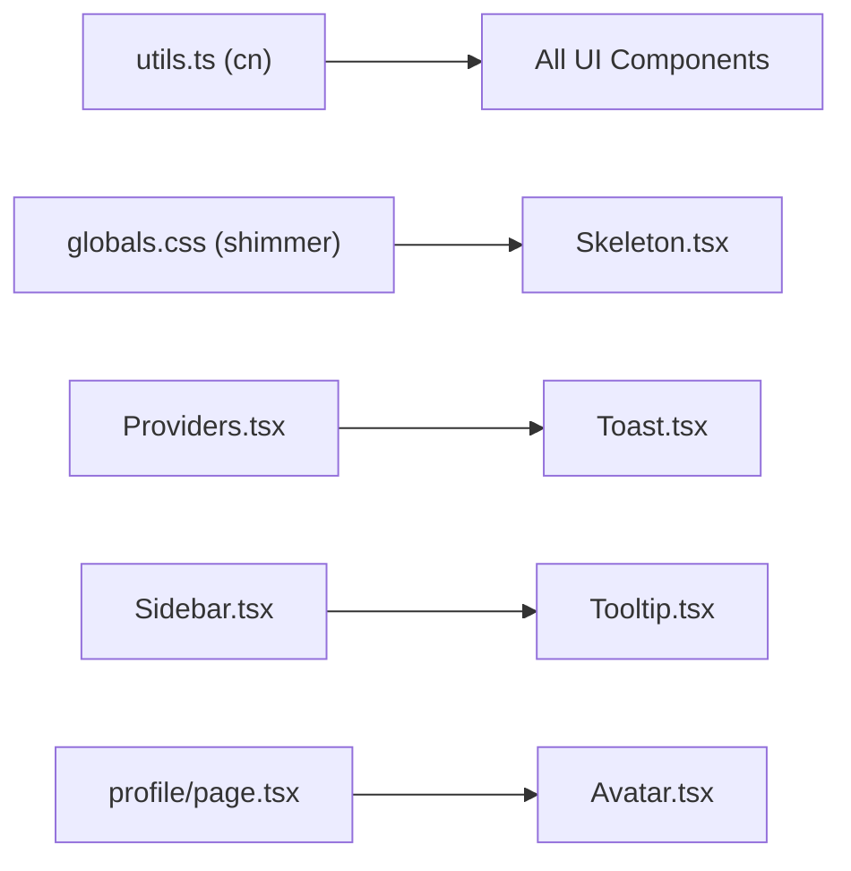

# Feedback & Loading Components

<cite>
**Referenced Files in This Document**
- [Spinner.tsx](file://src/components/ui/Spinner.tsx)
- [Skeleton.tsx](file://src/components/ui/Skeleton.tsx)
- [Toast.tsx](file://src/components/ui/Toast.tsx)
- [Tooltip.tsx](file://src/components/ui/Tooltip.tsx)
- [Avatar.tsx](file://src/components/ui/Avatar.tsx)
- [index.ts](file://src/components/ui/index.ts)
- [Providers.tsx](file://src/components/Providers.tsx)
- [Sidebar.tsx](file://src/components/layout/Sidebar.tsx)
- [profile/page.tsx](file://src/app/profile/page.tsx)
- [utils.ts](file://src/lib/utils.ts)
- [globals.css](file://src/app/globals.css)
</cite>

## Table of Contents
1. Introduction
2. Project Structure
3. Core Components
4. Architecture Overview
5. Detailed Component Analysis
6. Dependency Analysis
7. Performance Considerations
8. Troubleshooting Guide
9. Conclusion
10. Appendices

## Introduction
This document provides comprehensive documentation for MedAce-AI’s feedback and loading components: Spinner, Skeleton, Toast, Tooltip, and Avatar. It explains how these components implement loading states, animations with Framer Motion, and user experience best practices. It includes prop specifications, positioning options, customization capabilities, progressive loading patterns, error handling strategies, and accessibility considerations. The toast notification system is covered with queue management, auto-dismiss behavior, and visual progress indicators. Avatar rendering covers fallbacks, image optimization, and size variants. Finally, it offers guidelines to maintain consistent feedback patterns across the application.

## Project Structure
The feedback and loading components are implemented as reusable UI primitives under src/components/ui and are consumed throughout the app via a centralized barrel export. The Toast system is provided at the application level through a provider wrapper.

**Diagram sources**
- [index.ts:1-15](file://src/components/ui/index.ts#L1-L15)
- [Providers.tsx:1-23](file://src/components/Providers.tsx#L1-L23)
- [Sidebar.tsx:110-146](file://src/components/layout/Sidebar.tsx#L110-L146)
- [profile/page.tsx:90-100](file://src/app/profile/page.tsx#L90-L100)
- [utils.ts:1-6](file://src/lib/utils.ts#L1-L6)
- [globals.css:187-196](file://src/app/globals.css#L187-L196)

**Section sources**
- [index.ts:1-15](file://src/components/ui/index.ts#L1-L15)
- [Providers.tsx:1-23](file://src/components/Providers.tsx#L1-L23)
- [utils.ts:1-6](file://src/lib/utils.ts#L1-L6)
- [globals.css:187-196](file://src/app/globals.css#L187-L196)

## Core Components
- Spinner: A lightweight, animated indicator using an icon with a built-in spin animation. Supports small/medium/large sizes and custom class overrides.
- Skeleton: Placeholder UI for content loading with text/card/circle variants and configurable line count. Uses a CSS shimmer effect.
- Toast: Global notification system with success/error/info types, auto-dismiss timer, manual dismiss, and spring-based entrance/exit animations.
- Tooltip: Hover-triggered contextual hints with configurable delay and spring animations. Positioned above the trigger element.
- Avatar: Displays a user image or initials fallback with size variants and accessible labels.

These components share common utilities:
- cn utility for safe Tailwind class merging.
- Framer Motion for smooth transitions and animations.
- Lucide icons for consistent iconography.

**Section sources**
- [Spinner.tsx:1-25](file://src/components/ui/Spinner.tsx#L1-L25)
- [Skeleton.tsx:1-49](file://src/components/ui/Skeleton.tsx#L1-L49)
- [Toast.tsx:1-106](file://src/components/ui/Toast.tsx#L1-L106)
- [Tooltip.tsx:1-59](file://src/components/ui/Tooltip.tsx#L1-L59)
- [Avatar.tsx:1-58](file://src/components/ui/Avatar.tsx#L1-L58)
- [utils.ts:1-6](file://src/lib/utils.ts#L1-L6)
- [globals.css:187-196](file://src/app/globals.css#L187-L196)

## Architecture Overview
The feedback system is composed of independent UI primitives that can be used anywhere in the app. The Toast system is globalized via a provider that maintains a queue of notifications and renders them in a fixed container. Tooltips are local to their triggers and use hover state with delayed visibility. Avatars render images when available and fall back to initials otherwise.

**Diagram sources**
- [Toast.tsx:28-59](file://src/components/ui/Toast.tsx#L28-L59)
- [Toast.tsx:61-103](file://src/components/ui/Toast.tsx#L61-L103)

## Detailed Component Analysis

### Spinner
- Purpose: Indicate ongoing operations with a rotating icon.
- Props:
  - size: "sm" | "md" | "lg" (default "md")
  - className: optional override
- Behavior:
  - Applies a spin animation class to the icon.
  - Sets aria-label for accessibility.
- Customization:
  - Use className to adjust color, spacing, or add additional effects.
- Usage pattern:
  - Show while data fetches or actions are processing; hide on completion or error.

**Diagram sources**
- [Spinner.tsx:4-21](file://src/components/ui/Spinner.tsx#L4-L21)

**Section sources**
- [Spinner.tsx:1-25](file://src/components/ui/Spinner.tsx#L1-L25)

### Skeleton
- Purpose: Provide placeholder shapes during content loading.
- Props:
  - variant: "text" | "card" | "circle" (default "text")
  - lines: number of text lines (default 1)
  - className: optional override
- Behavior:
  - Text variant renders multiple rounded bars with varying widths.
  - Card variant renders a single large rounded block.
  - Circle variant renders a rounded shape suitable for avatar placeholders.
  - Uses a CSS shimmer animation for a polished loading feel.
- Customization:
  - Override dimensions and colors via className.
  - Adjust lines for different content densities.

**Diagram sources**
- [Skeleton.tsx:3-45](file://src/components/ui/Skeleton.tsx#L3-L45)
- [globals.css:187-196](file://src/app/globals.css#L187-L196)

**Section sources**
- [Skeleton.tsx:1-49](file://src/components/ui/Skeleton.tsx#L1-L49)
- [globals.css:187-196](file://src/app/globals.css#L187-L196)

### Toast
- Purpose: Display transient notifications with visual feedback and auto-dismiss.
- Context:
  - useToast hook returns a function to enqueue messages.
  - Must be used within ToastProvider.
- Types:
  - "success", "error", "info"
- Features:
  - Queue management: multiple toasts stacked vertically.
  - Auto-dismiss: each toast disappears after a fixed duration.
  - Manual dismiss: close button removes the toast immediately.
  - Visual progress bar: indicates remaining time before auto-dismiss.
  - Animations: spring-based entrance and exit via Framer Motion.
- Positioning:
  - Fixed bottom-right corner with vertical stacking and gap.
- Accessibility:
  - Dismiss button has aria-label.
  - Icons convey meaning; ensure screen readers rely on context.

**Diagram sources**
- [Toast.tsx:16-32](file://src/components/ui/Toast.tsx#L16-L32)
- [Toast.tsx:46-59](file://src/components/ui/Toast.tsx#L46-L59)

**Section sources**
- [Toast.tsx:1-106](file://src/components/ui/Toast.tsx#L1-L106)
- [Providers.tsx:1-23](file://src/components/Providers.tsx#L1-L23)

### Tooltip
- Purpose: Show contextual information on hover with smooth animations.
- Props:
  - content: ReactNode displayed inside the tooltip
  - children: ReactNode that triggers the tooltip
  - className: optional override for styling
  - delay: number in ms before showing (default 200)
- Behavior:
  - Shows on mouse enter with a configurable delay.
  - Hides on mouse leave; clears pending timeout to avoid flicker.
  - Positioned above the trigger with a small arrow.
  - Spring-based animations for appearance/disappearance.
- Accessibility:
  - Ensure child elements are keyboard-focusable if needed; consider adding role="tooltip" semantics where appropriate.

**Diagram sources**
- [Tooltip.tsx:7-56](file://src/components/ui/Tooltip.tsx#L7-L56)

**Section sources**
- [Tooltip.tsx:1-59](file://src/components/ui/Tooltip.tsx#L1-L59)
- [Sidebar.tsx:110-146](file://src/components/layout/Sidebar.tsx#L110-L146)

### Avatar
- Purpose: Display user identity via image or initials fallback.
- Props:
  - src?: string | null — optional image URL
  - name: string — used for alt text and initials generation
  - size?: "sm" | "md" | "lg" (default "md")
  - className?: string — optional override
- Behavior:
  - If src is present, renders an img with border and object-cover.
  - Otherwise, renders initials derived from name with background and border styles.
  - Provides aria-label for accessibility when showing initials.
- Image optimization:
  - Prefer optimized image URLs; consider lazy-loading and responsive formats at the consumer layer.
- Size variants:
  - Small, medium, large map to specific height/width and font sizes.

**Diagram sources**
- [Avatar.tsx:3-55](file://src/components/ui/Avatar.tsx#L3-L55)

**Section sources**
- [Avatar.tsx:1-58](file://src/components/ui/Avatar.tsx#L1-L58)
- [profile/page.tsx:90-100](file://src/app/profile/page.tsx#L90-L100)

## Dependency Analysis
- Shared utilities:
  - cn from utils.ts merges Tailwind classes safely across all components.
- Styling:
  - Skeleton uses a CSS shimmer defined in globals.css.
- Providers:
  - ToastProvider wraps the app tree to provide global toast functionality.
- Consumption:
  - Sidebar uses Tooltip for collapsed navigation hints.
  - Profile page uses Avatar to display user identity.

**Diagram sources**
- [utils.ts:1-6](file://src/lib/utils.ts#L1-L6)
- [globals.css:187-196](file://src/app/globals.css#L187-L196)
- [Providers.tsx:1-23](file://src/components/Providers.tsx#L1-L23)
- [Sidebar.tsx:110-146](file://src/components/layout/Sidebar.tsx#L110-L146)
- [profile/page.tsx:90-100](file://src/app/profile/page.tsx#L90-L100)

**Section sources**
- [utils.ts:1-6](file://src/lib/utils.ts#L1-L6)
- [globals.css:187-196](file://src/app/globals.css#L187-L196)
- [Providers.tsx:1-23](file://src/components/Providers.tsx#L1-L23)
- [Sidebar.tsx:110-146](file://src/components/layout/Sidebar.tsx#L110-L146)
- [profile/page.tsx:90-100](file://src/app/profile/page.tsx#L90-L100)

## Performance Considerations
- Avoid excessive re-renders:
  - Memoize expensive computations around avatar initials if names change frequently.
- Animation performance:
  - Framer Motion animations are GPU-accelerated; keep transition durations reasonable.
- Skeleton usage:
  - Limit the number of skeleton lines to reduce layout thrashing during heavy loads.
- Toast queue:
  - Auto-dismiss ensures toasts do not accumulate indefinitely; consider limiting max visible toasts if needed.
- Images:
  - For avatars, prefer optimized image sources and consider responsive images at the consumer layer.

[No sources needed since this section provides general guidance]

## Troubleshooting Guide
- Toast errors:
  - Using useToast outside ToastProvider throws an error. Ensure the provider wraps your app tree.
- Tooltip flicker:
  - If tooltips appear/disappear unexpectedly, verify that mouse events are not being interrupted and that delays are appropriate.
- Skeleton mismatch:
  - If skeleton dimensions do not match final content, adjust className or variant to better approximate layout.
- Avatar accessibility:
  - When displaying images, ensure alt text is meaningful; when showing initials, aria-label should reflect the user’s name.

**Section sources**
- [Toast.tsx:28-32](file://src/components/ui/Toast.tsx#L28-L32)
- [Tooltip.tsx:14-26](file://src/components/ui/Tooltip.tsx#L14-L26)
- [Skeleton.tsx:9-45](file://src/components/ui/Skeleton.tsx#L9-L45)
- [Avatar.tsx:25-55](file://src/components/ui/Avatar.tsx#L25-L55)

## Conclusion
MedAce-AI’s feedback and loading components provide a cohesive, accessible, and performant foundation for user interactions. Spinner and Skeleton communicate loading states clearly, Toast delivers actionable notifications with queue management and auto-dismiss, Tooltip enhances discoverability with contextual hints, and Avatar presents user identity with robust fallbacks. By following the guidelines and patterns outlined here, teams can maintain consistent feedback experiences across the application.

[No sources needed since this section summarizes without analyzing specific files]

## Appendices

### Prop Specifications Summary
- Spinner
  - size: "sm" | "md" | "lg"
  - className: string
- Skeleton
  - variant: "text" | "card" | "circle"
  - lines: number
  - className: string
- Toast
  - useToast(): toast(type: "success" | "error" | "info", message: string)
  - ToastProvider: required wrapper
- Tooltip
  - content: ReactNode
  - children: ReactNode
  - className: string
  - delay: number (ms)
- Avatar
  - src?: string | null
  - name: string
  - size: "sm" | "md" | "lg"
  - className: string

**Section sources**
- [Spinner.tsx:4-7](file://src/components/ui/Spinner.tsx#L4-L7)
- [Skeleton.tsx:3-7](file://src/components/ui/Skeleton.tsx#L3-L7)
- [Toast.tsx:14-24](file://src/components/ui/Toast.tsx#L14-L24)
- [Tooltip.tsx:7-12](file://src/components/ui/Tooltip.tsx#L7-L12)
- [Avatar.tsx:3-8](file://src/components/ui/Avatar.tsx#L3-L8)

### Progressive Loading Patterns
- List items:
  - Show Skeleton cards while fetching; replace with real content when ready.
- Detail pages:
  - Show Spinner for async actions; use Skeleton for initial content blocks.
- Notifications:
  - On save success, call toast("success", ...); on failure, call toast("error", ...).

[No sources needed since this section provides general guidance]

### Accessibility Checklist
- Spinner: aria-label present; ensure surrounding context indicates purpose.
- Skeleton: no interactive elements; pair with meaningful headings.
- Toast: dismiss button has aria-label; ensure screen readers announce messages.
- Tooltip: ensure trigger is focusable if keyboard navigation is required.
- Avatar: alt text for images; aria-label for initials fallback.

**Section sources**
- [Spinner.tsx:15-21](file://src/components/ui/Spinner.tsx#L15-L21)
- [Toast.tsx:80-86](file://src/components/ui/Toast.tsx#L80-L86)
- [Avatar.tsx:28-55](file://src/components/ui/Avatar.tsx#L28-L55)