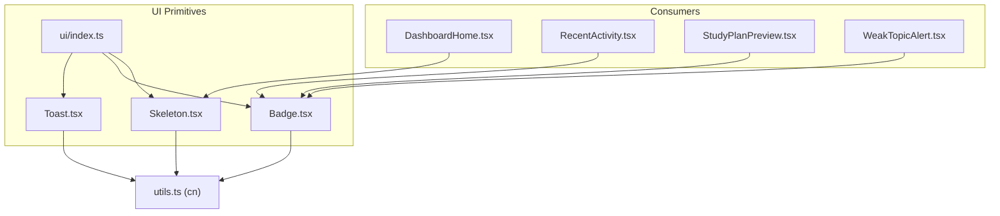
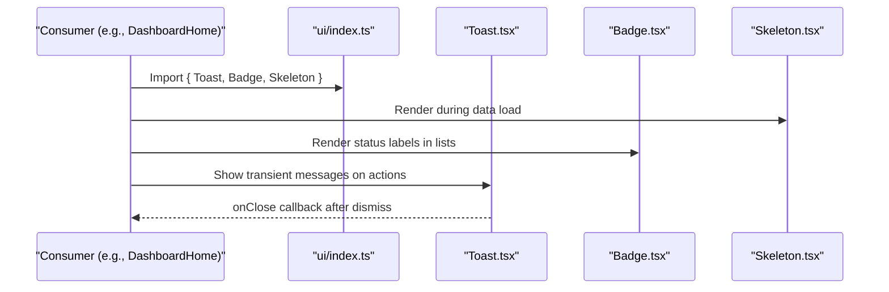
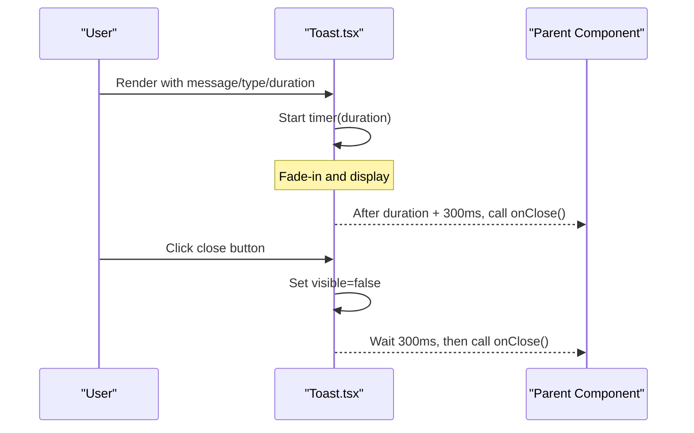
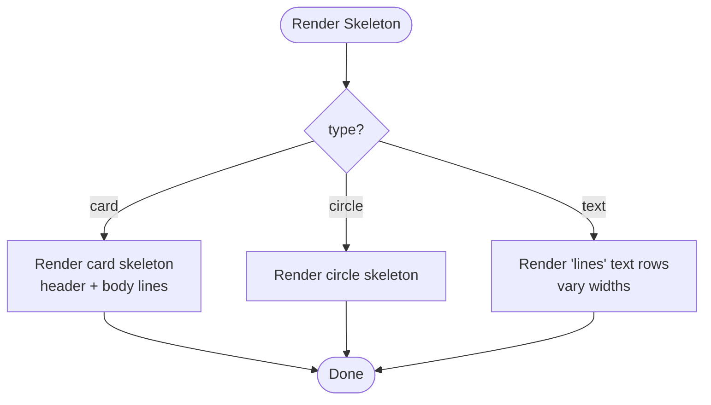
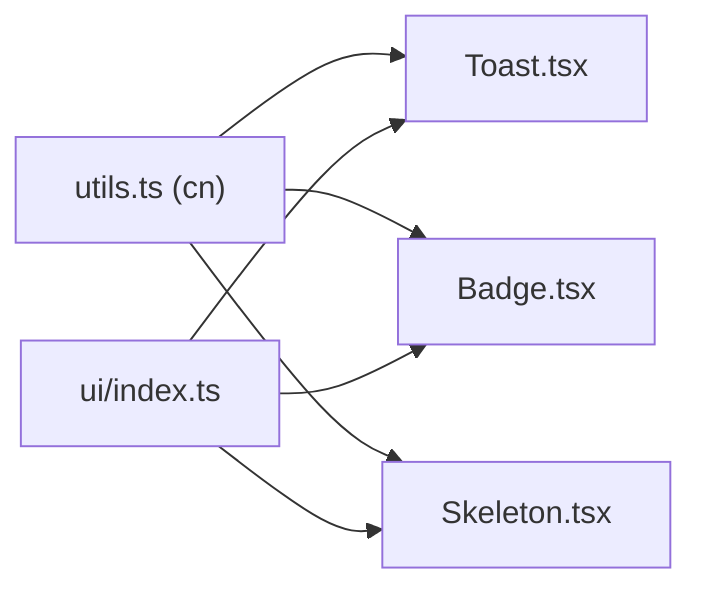

# Feedback Components

<cite>
**Referenced Files in This Document**
- [Toast.tsx](file://Next-app/src/components/ui/Toast.tsx)
- [Badge.tsx](file://Next-app/src/components/ui/Badge.tsx)
- [Skeleton.tsx](file://Next-app/src/components/ui/Skeleton.tsx)
- [index.ts](file://Next-app/src/components/ui/index.ts)
- [utils.ts](file://Next-app/src/lib/utils.ts)
- [DashboardHome.tsx](file://Next-app/src/components/DashboardHome.tsx)
- [RecentActivity.tsx](file://Next-app/src/components/dashboard/RecentActivity.tsx)
- [StudyPlanPreview.tsx](file://Next-app/src/components/dashboard/StudyPlanPreview.tsx)
- [WeakTopicAlert.tsx](file://Next-app/src/components/quiz/WeakTopicAlert.tsx)
</cite>

## Table of Contents
1. Introduction
2. Project Structure
3. Core Components
4. Architecture Overview
5. Detailed Component Analysis
6. Dependency Analysis
7. Performance Considerations
8. Troubleshooting Guide
9. Conclusion
10. Appendices

## Introduction
This document provides comprehensive documentation for feedback and status components: Toast notifications, Badge indicators, and Skeleton loaders. It explains props, usage patterns, accessibility considerations, animation timing, and UX best practices to maintain a clear visual hierarchy in feedback displays. Examples include success/error toasts, notification center patterns, status badges, and content placeholders.

## Project Structure
The feedback components are implemented as reusable UI primitives under the ui folder and are re-exported via an index barrel. They are consumed across dashboard and quiz features to communicate system status and loading states.

**Diagram sources**
- [Toast.tsx:1-73](file://Next-app/src/components/ui/Toast.tsx#L1-L73)
- [Badge.tsx:1-36](file://Next-app/src/components/ui/Badge.tsx#L1-L36)
- [Skeleton.tsx:1-54](file://Next-app/src/components/ui/Skeleton.tsx#L1-L54)
- [index.ts:1-11](file://Next-app/src/components/ui/index.ts#L1-L11)
- [utils.ts:1-27](file://Next-app/src/lib/utils.ts#L1-L27)
- [DashboardHome.tsx:1-90](file://Next-app/src/components/DashboardHome.tsx#L1-L90)
- [RecentActivity.tsx:1-68](file://Next-app/src/components/dashboard/RecentActivity.tsx#L1-L68)
- [StudyPlanPreview.tsx:1-77](file://Next-app/src/components/dashboard/StudyPlanPreview.tsx#L1-L77)
- [WeakTopicAlert.tsx:1-32](file://Next-app/src/components/quiz/WeakTopicAlert.tsx#L1-L32)

**Section sources**
- [index.ts:1-11](file://Next-app/src/components/ui/index.ts#L1-L11)
- [utils.ts:1-27](file://Next-app/src/lib/utils.ts#L1-L27)

## Core Components
- Toast: A transient alert that auto-dismisses after a configurable duration with fade-out animation. Supports multiple types (success, error, warning, info).
- Badge: A compact inline indicator used to show status or category labels with variants (default, info, success, warning, error).
- Skeleton: A placeholder component for loading states supporting text lines, card layouts, and circular shapes with pulse animation.

Key behaviors:
- Toast auto-dismiss uses a timer and triggers a short delay before invoking onClose to allow fade-out completion.
- Badge applies variant-specific color classes and supports custom className overrides.
- Skeleton uses CSS animations for smooth loading feel and can render multiple line lengths to mimic real content.

Accessibility highlights:
- Toast is announced as an alert region.
- Close button includes an aria-label for screen readers.
- Badges and skeletons do not require special roles but should be paired with meaningful surrounding context.

Animation timing:
- Toast transitions use a 300ms duration for visibility changes.
- Auto-dismiss defaults to 4000ms; close delay after user action is also 300ms.
- Skeleton uses a continuous pulse animation.

**Section sources**
- [Toast.tsx:9-46](file://Next-app/src/components/ui/Toast.tsx#L9-L46)
- [Badge.tsx:5-17](file://Next-app/src/components/ui/Badge.tsx#L5-L17)
- [Skeleton.tsx:3-13](file://Next-app/src/components/ui/Skeleton.tsx#L3-L13)

## Architecture Overview
Feedback components follow a simple, composable architecture:
- Toast encapsulates lifecycle (show/hide), type-based styling, and accessibility attributes.
- Badge is a presentational component driven by variant props and optional className.
- Skeleton abstracts common loading shapes and sizes.
- Consumers compose these primitives to build dashboards, alerts, and lists.

**Diagram sources**
- [index.ts:1-11](file://Next-app/src/components/ui/index.ts#L1-L11)
- [Toast.tsx:30-73](file://Next-app/src/components/ui/Toast.tsx#L30-L73)
- [Badge.tsx:19-35](file://Next-app/src/components/ui/Badge.tsx#L19-L35)
- [Skeleton.tsx:9-54](file://Next-app/src/components/ui/Skeleton.tsx#L9-L54)

## Detailed Component Analysis

### Toast
Purpose:
- Display transient feedback such as success, error, warning, or info messages.
- Auto-dismiss after a configurable duration with a smooth fade-out.

Props:
- message: string — The text to display.
- type?: "success" | "error" | "warning" | "info" — Visual theme and icon mapping.
- duration?: number — Time in milliseconds before auto-dismiss (default 4000).
- onClose: () => void — Callback invoked after fade-out completes.

Behavior:
- Uses a timer to set visible to false, then waits 300ms before calling onClose to ensure animation finishes.
- Renders with role="alert" for accessibility.
- Provides a close button with an aria-label for screen readers.

Positioning:
- Fixed at top-center using transform utilities.
- z-index ensures it appears above other content.

Animation:
- Transition duration 300ms for opacity and translate changes.
- Auto-dismiss delay matches transition duration to avoid abrupt cuts.

Usage examples:
- Success toast after form submission.
- Error toast when API call fails.
- Warning/info toasts for non-blocking guidance.

Accessibility:
- Announced as an alert.
- Close button has descriptive aria-label.

Best practices:
- Keep messages concise and actionable.
- Use appropriate type to convey urgency.
- Avoid stacking too many toasts; consider a notification center for high-volume scenarios.

**Section sources**
- [Toast.tsx:7-14](file://Next-app/src/components/ui/Toast.tsx#L7-L14)
- [Toast.tsx:16-28](file://Next-app/src/components/ui/Toast.tsx#L16-L28)
- [Toast.tsx:30-46](file://Next-app/src/components/ui/Toast.tsx#L30-L46)
- [Toast.tsx:48-73](file://Next-app/src/components/ui/Toast.tsx#L48-L73)

#### Toast Sequence Diagram

**Diagram sources**
- [Toast.tsx:30-46](file://Next-app/src/components/ui/Toast.tsx#L30-L46)
- [Toast.tsx:60-69](file://Next-app/src/components/ui/Toast.tsx#L60-L69)

### Badge
Purpose:
- Indicate status or categorize items inline with minimal space.

Props:
- variant?: "default" | "info" | "success" | "warning" | "error" — Controls background and text colors.
- children: React.ReactNode — Label content.
- className?: string — Optional additional styles.

Variants:
- default: neutral gray
- info: blue
- success: green
- warning: amber
- error: red

Usage examples:
- Quiz accuracy thresholds mapped to success/warning/error.
- Study plan activity type labels.
- Weak topic tags in alerts.

Accessibility:
- Presentational; pair with contextual text so meaning is clear.

Best practices:
- Use consistent semantics across the app (e.g., green for success, red for errors).
- Avoid overusing badges; reserve for meaningful status signals.

**Section sources**
- [Badge.tsx:3-17](file://Next-app/src/components/ui/Badge.tsx#L3-L17)
- [Badge.tsx:19-35](file://Next-app/src/components/ui/Badge.tsx#L19-L35)
- [RecentActivity.tsx:44-48](file://Next-app/src/components/dashboard/RecentActivity.tsx#L44-L48)
- [StudyPlanPreview.tsx:58-60](file://Next-app/src/components/dashboard/StudyPlanPreview.tsx#L58-L60)
- [WeakTopicAlert.tsx:18-23](file://Next-app/src/components/quiz/WeakTopicAlert.tsx#L18-L23)

### Skeleton
Purpose:
- Provide lightweight placeholders while content loads to improve perceived performance.

Props:
- lines?: number — Number of text lines (default 3).
- type?: "text" | "card" | "circle" — Shape preset.
- className?: string — Optional additional styles.

Patterns:
- Text: renders stacked lines with varying widths.
- Card: renders a card-like skeleton with header and body lines.
- Circle: renders a pulsing circle avatar or icon placeholder.

Animation:
- Uses a continuous pulse animation to indicate loading.

Usage examples:
- Dashboard grid placeholders during initial data fetch.
- List item skeletons while fetching recent activity.

Accessibility:
- Skeletons are decorative; ensure surrounding content remains accessible.

Best practices:
- Match skeleton dimensions to actual content layout to reduce layout shift.
- Limit concurrent skeletons to avoid overwhelming users.

**Section sources**
- [Skeleton.tsx:3-13](file://Next-app/src/components/ui/Skeleton.tsx#L3-L13)
- [Skeleton.tsx:14-54](file://Next-app/src/components/ui/Skeleton.tsx#L14-L54)
- [DashboardHome.tsx:44-57](file://Next-app/src/components/DashboardHome.tsx#L44-L57)

#### Skeleton Flowchart

**Diagram sources**
- [Skeleton.tsx:9-54](file://Next-app/src/components/ui/Skeleton.tsx#L9-L54)

## Dependency Analysis
- All three components depend on the shared cn utility for class merging.
- ui/index.ts centralizes exports for consumers.
- Consumers import from the barrel to keep imports clean.

**Diagram sources**
- [utils.ts:4-6](file://Next-app/src/lib/utils.ts#L4-L6)
- [index.ts:1-11](file://Next-app/src/components/ui/index.ts#L1-L11)
- [Toast.tsx:4](file://Next-app/src/components/ui/Toast.tsx#L4)
- [Badge.tsx:1](file://Next-app/src/components/ui/Badge.tsx#L1)
- [Skeleton.tsx:1](file://Next-app/src/components/ui/Skeleton.tsx#L1)

**Section sources**
- [utils.ts:1-27](file://Next-app/src/lib/utils.ts#L1-L27)
- [index.ts:1-11](file://Next-app/src/components/ui/index.ts#L1-L11)

## Performance Considerations
- Toast:
  - Keep durations reasonable to avoid blocking user flow.
  - Debounce rapid successive toasts if needed to prevent jank.
- Badge:
  - Pure presentational component; negligible performance impact.
- Skeleton:
  - Prefer skeleton over blank spaces to reduce layout shifts.
  - Use appropriate sizes to minimize repaint cost.

[No sources needed since this section provides general guidance]

## Troubleshooting Guide
Common issues and resolutions:
- Toast does not disappear:
  - Ensure onClose is provided and clears state in the parent.
  - Verify duration is not excessively large.
- Toast not announced:
  - Confirm it is rendered within an accessible container and role="alert" is preserved.
- Badge not visually distinct:
  - Check variant selection and any overriding className.
- Skeleton looks misaligned:
  - Ensure skeleton dimensions match final content layout to avoid reflow.

**Section sources**
- [Toast.tsx:30-46](file://Next-app/src/components/ui/Toast.tsx#L30-L46)
- [Toast.tsx:48-73](file://Next-app/src/components/ui/Toast.tsx#L48-L73)
- [Badge.tsx:19-35](file://Next-app/src/components/ui/Badge.tsx#L19-L35)
- [Skeleton.tsx:9-54](file://Next-app/src/components/ui/Skeleton.tsx#L9-L54)

## Conclusion
Toast, Badge, and Skeleton provide a cohesive feedback and status system. By using consistent variants, sensible defaults, and accessible patterns, teams can deliver clear, unobtrusive feedback that enhances usability. Follow the guidelines here to maintain visual hierarchy and a positive user experience across the application.

[No sources needed since this section summarizes without analyzing specific files]

## Appendices

### Usage Scenarios and Best Practices
- Success/Error Toasts:
  - Use for immediate feedback after actions like saving or submitting forms.
  - Keep messages concise and outcome-focused.
- Notification Centers:
  - For high-frequency updates, aggregate toasts into a dedicated panel.
  - Allow users to mark as read and dismiss individually.
- Status Badges:
  - Use for persistent status indicators (e.g., quiz accuracy tiers, activity types).
  - Maintain semantic consistency across the app.
- Content Placeholders:
  - Use skeletons during data fetching to reduce perceived wait time.
  - Match skeleton sizes to final content to minimize layout shifts.

[No sources needed since this section provides general guidance]