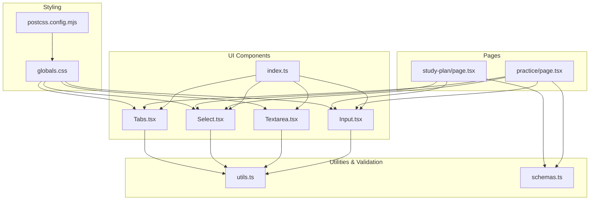
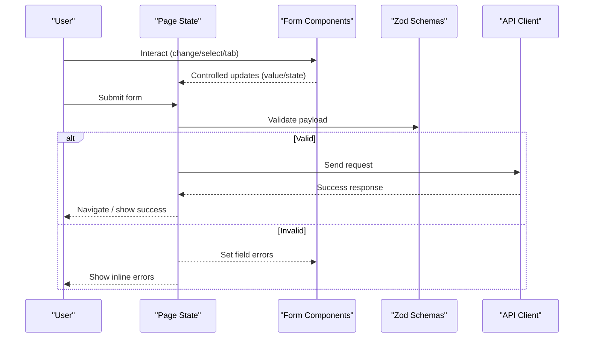
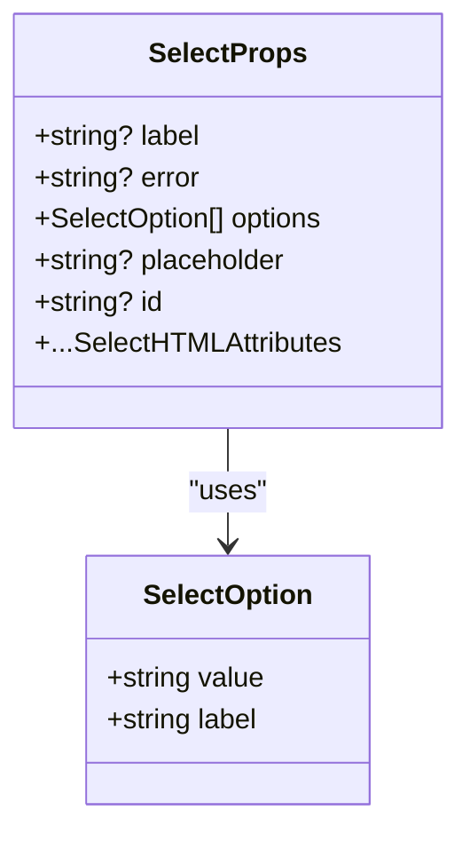
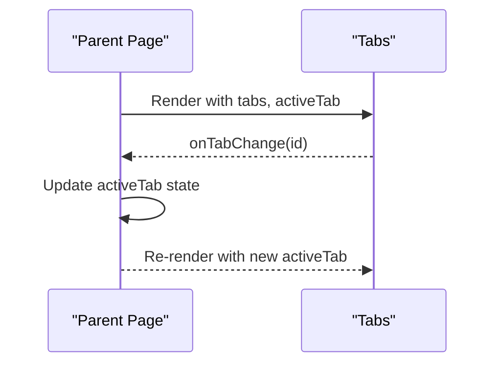
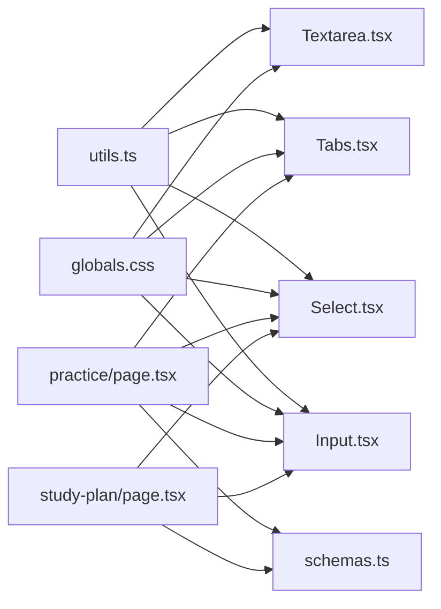

# Form Input Components

<cite>
**Referenced Files in This Document**
- [Input.tsx](file://src/components/ui/Input.tsx)
- [Textarea.tsx](file://src/components/ui/Textarea.tsx)
- [Select.tsx](file://src/components/ui/Select.tsx)
- [Tabs.tsx](file://src/components/ui/Tabs.tsx)
- [index.ts](file://src/components/ui/index.ts)
- [utils.ts](file://src/lib/utils.ts)
- [schemas.ts](file://src/lib/validations/schemas.ts)
- [practice/page.tsx](file://src/app/practice/page.tsx)
- [study-plan/page.tsx](file://src/app/study-plan/page.tsx)
- [globals.css](file://src/app/globals.css)
- [postcss.config.mjs](file://postcss.config.mjs)
</cite>

## Table of Contents
1. Introduction
2. Project Structure
3. Core Components
4. Architecture Overview
5. Detailed Component Analysis
6. Dependency Analysis
7. Performance Considerations
8. Troubleshooting Guide
9. Conclusion
10. Appendices

## Introduction
This document provides comprehensive documentation for MedAce-AI’s form input components: Input, Textarea, Select, and Tabs. It covers props, events, state management patterns, validation integration with Zod schemas, error handling, user feedback, accessibility (ARIA attributes, keyboard navigation, focus management), styling with Tailwind CSS v4 and custom design tokens, responsive design, and best practices for form layout and UX. Examples are grounded in real usage within the application pages.

## Project Structure
The form components live under src/components/ui and are re-exported via a barrel index. Validation schemas are centralized under src/lib/validations. Pages demonstrate composition of these components in realistic forms and workflows. Styling is powered by Tailwind CSS v4 with a dark medical theme defined in global styles.

**Diagram sources**
- [Input.tsx:1-55](file://src/components/ui/Input.tsx#L1-L55)
- [Textarea.tsx:1-46](file://src/components/ui/Textarea.tsx#L1-L46)
- [Select.tsx:1-65](file://src/components/ui/Select.tsx#L1-L65)
- [Tabs.tsx:1-76](file://src/components/ui/Tabs.tsx#L1-L76)
- [index.ts:1-15](file://src/components/ui/index.ts#L1-L15)
- [utils.ts:1-34](file://src/lib/utils.ts#L1-L34)
- [schemas.ts:1-48](file://src/lib/validations/schemas.ts#L1-L48)
- [practice/page.tsx:1-277](file://src/app/practice/page.tsx#L1-L277)
- [study-plan/page.tsx:1-335](file://src/app/study-plan/page.tsx#L1-L335)
- [globals.css:1-300](file://src/app/globals.css#L1-L300)
- [postcss.config.mjs:1-9](file://postcss.config.mjs#L1-L9)

**Section sources**
- [index.ts:1-15](file://src/components/ui/index.ts#L1-L15)
- [globals.css:1-300](file://src/app/globals.css#L1-L300)
- [postcss.config.mjs:1-9](file://postcss.config.mjs#L1-L9)

## Core Components
- Input: Accessible text input with label, optional left icon, and inline error display. Uses controlled value pattern when composed in pages.
- Textarea: Accessible multi-line input with label and inline error display.
- Select: Accessible dropdown with label, placeholder, options, and inline error display.
- Tabs: Accessible tab bar supporting underline and pill variants with animated indicator; controlled activeTab via parent state.

All components accept an id or derive one from label to ensure proper label-for/input-id association. They render errors conditionally and use consistent spacing and typography.

**Section sources**
- [Input.tsx:6-54](file://src/components/ui/Input.tsx#L6-L54)
- [Textarea.tsx:6-45](file://src/components/ui/Textarea.tsx#L6-L45)
- [Select.tsx:6-64](file://src/components/ui/Select.tsx#L6-L64)
- [Tabs.tsx:6-75](file://src/components/ui/Tabs.tsx#L6-L75)

## Architecture Overview
Form data flows from page-level state into controlled components. Validation schemas define expected shapes and constraints. On submit, pages validate inputs against schemas, handle success or error states, and navigate or update UI accordingly.

**Diagram sources**
- [practice/page.tsx:75-98](file://src/app/practice/page.tsx#L75-L98)
- [study-plan/page.tsx:67-90](file://src/app/study-plan/page.tsx#L67-L90)
- [schemas.ts:3-47](file://src/lib/validations/schemas.ts#L3-L47)

## Detailed Component Analysis

### Input Component
- Props:
  - All standard HTML input attributes via inheritance
  - label?: string — renders a visible label and associates it via htmlFor
  - error?: string — renders an inline error message below the input
  - leftIcon?: ReactNode — renders an icon inside the input container with appropriate padding
  - id?: string — if omitted, derived from label for accessibility
- Events:
  - Standard input events (onChange, onBlur, etc.) pass through
- State Management:
  - Typically used as a controlled component in pages (e.g., practice/search, study-plan/date)
- Accessibility:
  - Label uses htmlFor linked to input id
  - Error text is visually present; consider pairing with aria-describedby for screen readers in future enhancements
- Styling:
  - Focus ring and border color changes on focus
  - Error state applies red border, ring, and animation
  - Left icon adds left padding to avoid overlap
- Usage Example:
  - Search input in Practice page
  - Date input in Study Plan modal

```mermaid
flowchart TD
Start(["Render Input"]) --> HasLabel{"Has label?"}
HasLabel --> |Yes| RenderLabel["Render <label> with htmlFor"]
HasLabel --> |No| SkipLabel["Skip label"]
RenderLabel --> RenderInput["Render <input> with id"]
SkipLabel --> RenderInput
RenderInput --> HasError{"Has error?"}
HasError --> |Yes| ShowError["Render error message"]
HasError --> |No| End(["Done"])
ShowError --> End
```

**Diagram sources**
- [Input.tsx:12-50](file://src/components/ui/Input.tsx#L12-L50)

**Section sources**
- [Input.tsx:6-54](file://src/components/ui/Input.tsx#L6-L54)
- [practice/page.tsx:112-122](file://src/app/practice/page.tsx#L112-L122)
- [study-plan/page.tsx:284-295](file://src/app/study-plan/page.tsx#L284-L295)

### Textarea Component
- Props:
  - All standard HTML textarea attributes
  - label?: string — accessible label with htmlFor
  - error?: string — inline error message
  - id?: string — auto-derived from label if not provided
- Events:
  - Standard textarea events pass through
- State Management:
  - Controlled via page state where used
- Accessibility:
  - Label-to-field association via htmlFor/id
- Styling:
  - Consistent focus ring and border behavior
  - Error state styling similar to Input
- Usage Example:
  - Not directly used in current pages but available for long-form inputs

**Section sources**
- [Textarea.tsx:6-45](file://src/components/ui/Textarea.tsx#L6-L45)

### Select Component
- Props:
  - options: SelectOption[] — array of { value, label }
  - placeholder?: string — first disabled option when provided
  - label?: string — accessible label
  - error?: string — inline error
  - id?: string — auto-derived from label
  - All standard select attributes
- Events:
  - onChange passes selected value
- State Management:
  - Controlled via page state (e.g., difficulty, number of questions, daily goal)
- Accessibility:
  - Label-to-select association via htmlFor/id
- Styling:
  - Custom dropdown arrow via background image
  - Dark-themed options via global CSS overrides
  - Error state styling
- Usage Example:
  - Difficulty and question count in Practice modal
  - Daily study goal in Study Plan modal

**Diagram sources**
- [Select.tsx:6-16](file://src/components/ui/Select.tsx#L6-L16)

**Section sources**
- [Select.tsx:6-64](file://src/components/ui/Select.tsx#L6-L64)
- [practice/page.tsx:217-241](file://src/app/practice/page.tsx#L217-L241)
- [study-plan/page.tsx:297-306](file://src/app/study-plan/page.tsx#L297-L306)
- [globals.css:120-132](file://src/app/globals.css#L120-L132)

### Tabs Component
- Props:
  - tabs: Tab[] — array of { id, label }
  - activeTab: string — currently active tab id
  - onTabChange: (id: string) => void — callback to update active tab
  - variant?: "underline" | "pill" — visual style
  - className?: string — additional classes
- Events:
  - onClick handled internally; calls onTabChange with tab id
- State Management:
  - Fully controlled by parent state (activeTab)
- Accessibility:
  - Buttons are keyboard-navigable; consider adding role="tablist", role="tab", and aria-selected in future enhancements for full ARIA compliance
- Styling:
  - Animated indicator using framer-motion layoutId
  - Underline variant shows bottom border indicator
  - Pill variant shows gradient background behind active tab
- Usage Example:
  - Category filter tabs in Practice page

**Diagram sources**
- [Tabs.tsx:11-17](file://src/components/ui/Tabs.tsx#L11-L17)
- [Tabs.tsx:19-73](file://src/components/ui/Tabs.tsx#L19-L73)
- [practice/page.tsx:124-130](file://src/app/practice/page.tsx#L124-L130)

**Section sources**
- [Tabs.tsx:6-75](file://src/components/ui/Tabs.tsx#L6-L75)
- [practice/page.tsx:15-20](file://src/app/practice/page.tsx#L15-L20)
- [practice/page.tsx:124-130](file://src/app/practice/page.tsx#L124-L130)

## Dependency Analysis
- Components depend on:
  - utils.ts for className merging via cn()
  - globals.css for design tokens and base styles
  - Tailwind CSS v4 via postcss config
- Pages depend on:
  - Components for UI
  - Validation schemas for type-safe payloads
  - API client for network requests (not shown here)

**Diagram sources**
- [utils.ts:1-6](file://src/lib/utils.ts#L1-L6)
- [globals.css:1-41](file://src/app/globals.css#L1-L41)
- [Input.tsx:1-55](file://src/components/ui/Input.tsx#L1-L55)
- [Textarea.tsx:1-46](file://src/components/ui/Textarea.tsx#L1-L46)
- [Select.tsx:1-65](file://src/components/ui/Select.tsx#L1-L65)
- [Tabs.tsx:1-76](file://src/components/ui/Tabs.tsx#L1-L76)
- [practice/page.tsx:1-277](file://src/app/practice/page.tsx#L1-L277)
- [study-plan/page.tsx:1-335](file://src/app/study-plan/page.tsx#L1-L335)
- [schemas.ts:1-48](file://src/lib/validations/schemas.ts#L1-L48)

**Section sources**
- [utils.ts:1-34](file://src/lib/utils.ts#L1-L34)
- [schemas.ts:1-48](file://src/lib/validations/schemas.ts#L1-L48)
- [practice/page.tsx:1-277](file://src/app/practice/page.tsx#L1-L277)
- [study-plan/page.tsx:1-335](file://src/app/study-plan/page.tsx#L1-L335)

## Performance Considerations
- Controlled components: Keep state minimal and stable; avoid unnecessary re-renders by memoizing callbacks where needed.
- Class name merging: The cn utility efficiently merges and deduplicates classes; prefer it over manual concatenation.
- Animations: Tabs use framer-motion layout animations; keep tab lists small to maintain smooth transitions.
- Styling: Tailwind v4 compiles at build time; ensure unused utilities are purged by default configuration.

[No sources needed since this section provides general guidance]

## Troubleshooting Guide
- Validation Errors:
  - Ensure form payloads conform to Zod schemas before submission. Mismatches will cause runtime errors or rejected payloads.
  - Map schema errors to component-level error props to display inline messages.
- Focus and Accessibility:
  - Always provide a unique id or rely on label-derived ids to link labels to fields.
  - For complex interactions (like Tabs), add ARIA roles and attributes (role="tablist", role="tab", aria-selected) to improve assistive technology support.
- Styling Issues:
  - If select options do not appear styled, verify global CSS overrides for select option elements.
  - Confirm Tailwind v4 import and PostCSS plugin are configured correctly.

**Section sources**
- [schemas.ts:3-47](file://src/lib/validations/schemas.ts#L3-L47)
- [globals.css:120-132](file://src/app/globals.css#L120-L132)
- [postcss.config.mjs:1-9](file://postcss.config.mjs#L1-L9)

## Conclusion
MedAce-AI’s form components provide a consistent, accessible, and themed foundation for building robust forms. They integrate cleanly with Zod-based validation and are designed for controlled state patterns. The styling system leverages Tailwind CSS v4 with a cohesive dark medical theme. By following the guidelines in this document, you can compose accessible, responsive, and user-friendly forms across the application.

[No sources needed since this section summarizes without analyzing specific files]

## Appendices

### Form Composition Patterns and Workflows
- Field Grouping:
  - Group related fields (e.g., difficulty and question count) within a single card or modal for clarity.
  - Use consistent spacing and alignment to create visual hierarchy.
- Validation Workflow:
  - Collect values from controlled components.
  - Validate against Zod schemas before sending to the server.
  - Display inline errors per field and/or a summary message at the top of the form.
- User Feedback:
  - Provide immediate feedback on focus and interaction states.
  - Show loading indicators during async operations and disable submit buttons while processing.

**Section sources**
- [practice/page.tsx:200-273](file://src/app/practice/page.tsx#L200-L273)
- [study-plan/page.tsx:277-331](file://src/app/study-plan/page.tsx#L277-L331)
- [schemas.ts:3-47](file://src/lib/validations/schemas.ts#L3-L47)

### Accessibility Checklist
- Labels:
  - Ensure every input has a visible label associated via htmlFor/id.
- Keyboard Navigation:
  - Inputs and selects are naturally keyboard accessible.
  - For Tabs, ensure logical tab order and consider adding ARIA roles for full compliance.
- Focus Management:
  - Maintain clear focus outlines; components already apply focus rings.
  - When opening modals, manage focus trap and return focus to trigger element on close (ensure Modal implementation supports this).
- Screen Readers:
  - Associate error messages with fields using aria-describedby if needed.
  - Announce dynamic content changes (e.g., tab changes) appropriately.

**Section sources**
- [Input.tsx:12-50](file://src/components/ui/Input.tsx#L12-L50)
- [Textarea.tsx:11-40](file://src/components/ui/Textarea.tsx#L11-L40)
- [Select.tsx:18-58](file://src/components/ui/Select.tsx#L18-L58)
- [Tabs.tsx:19-73](file://src/components/ui/Tabs.tsx#L19-L73)

### Styling System and Responsive Design
- Design Tokens:
  - Colors, surfaces, semantic tokens, and fonts are defined in global styles for consistency.
- Tailwind CSS v4:
  - Import via @import "tailwindcss"; PostCSS plugin configured.
- Responsive Patterns:
  - Use grid and flex utilities to adapt layouts across breakpoints.
  - Ensure interactive elements remain usable on small screens with adequate touch targets.

**Section sources**
- [globals.css:1-41](file://src/app/globals.css#L1-L41)
- [postcss.config.mjs:1-9](file://postcss.config.mjs#L1-L9)