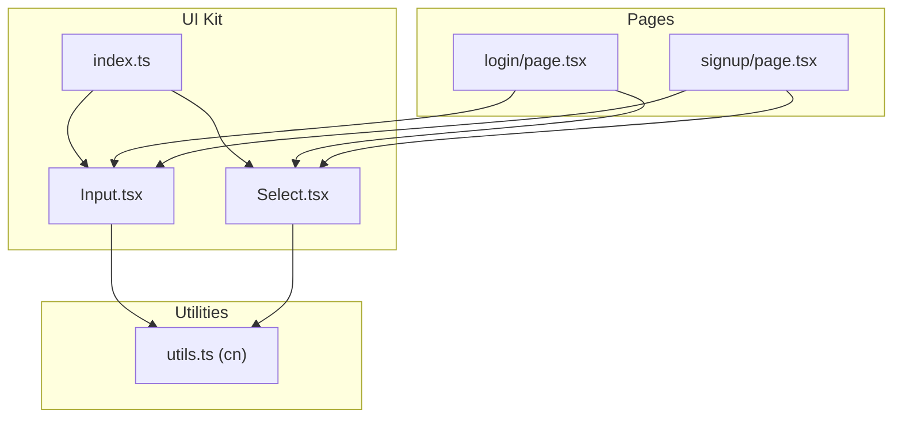
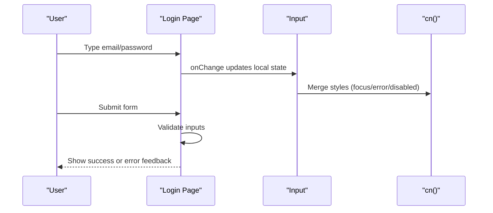
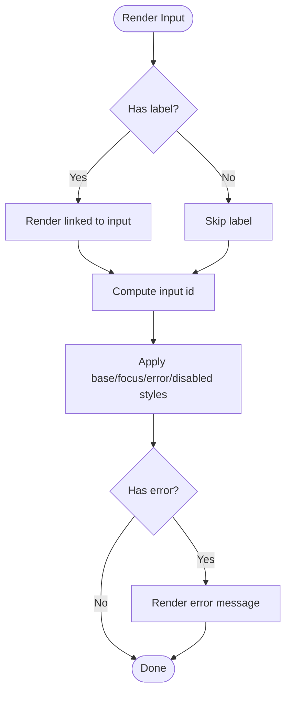
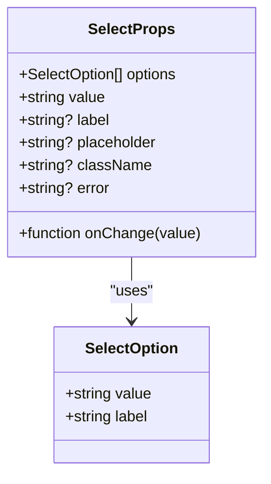
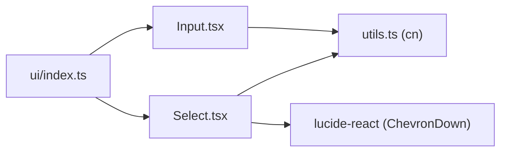

# Input Components

<cite>
**Referenced Files in This Document**
- [Input.tsx](file://Next-app/src/components/ui/Input.tsx)
- [Select.tsx](file://Next-app/src/components/ui/Select.tsx)
- [index.ts](file://Next-app/src/components/ui/index.ts)
- [login/page.tsx](file://Next-app/src/app/(auth)/login/page.tsx)
- [signup/page.tsx](file://Next-app/src/app/(auth)/signup/page.tsx)
- [utils.ts](file://Next-app/src/lib/utils.ts)
</cite>

## Table of Contents
1. [Introduction](#introduction)
2. [Project Structure](#project-structure)
3. [Core Components](#core-components)
4. [Architecture Overview](#architecture-overview)
5. [Detailed Component Analysis](#detailed-component-analysis)
6. [Dependency Analysis](#dependency-analysis)
7. [Performance Considerations](#performance-considerations)
8. [Troubleshooting Guide](#troubleshooting-guide)
9. [Conclusion](#conclusion)

## Introduction
This document provides detailed documentation for the form input components used across the application: Input and Select. It covers props, validation states, placeholder text, icons, error handling, option structures, dropdown behavior, accessibility, styling, and integration patterns with forms. Examples reference real usage within the authentication flows to demonstrate validated forms and error handling.

## Project Structure
The Input and Select components are part of a shared UI kit under src/components/ui. They are re-exported via an index file and consumed by feature pages such as login and signup.

**Diagram sources**
- [index.ts:1-11](file://Next-app/src/components/ui/index.ts#L1-L11)
- [Input.tsx:1-42](file://Next-app/src/components/ui/Input.tsx#L1-L42)
- [Select.tsx:1-63](file://Next-app/src/components/ui/Select.tsx#L1-L63)
- [login/page.tsx:1-104](file://Next-app/src/app/(auth)/login/page.tsx#L1-L104)
- [signup/page.tsx:1-139](file://Next-app/src/app/(auth)/signup/page.tsx#L1-L139)
- [utils.ts:1-27](file://Next-app/src/lib/utils.ts#L1-L27)

**Section sources**
- [index.ts:1-11](file://Next-app/src/components/ui/index.ts#L1-L11)
- [Input.tsx:1-42](file://Next-app/src/components/ui/Input.tsx#L1-L42)
- [Select.tsx:1-63](file://Next-app/src/components/ui/Select.tsx#L1-L63)
- [login/page.tsx:1-104](file://Next-app/src/app/(auth)/login/page.tsx#L1-L104)
- [signup/page.tsx:1-139](file://Next-app/src/app/(auth)/signup/page.tsx#L1-L139)
- [utils.ts:1-27](file://Next-app/src/lib/utils.ts#L1-L27)

## Core Components
- Input: A flexible text input that supports labels, placeholders, focus states, disabled state, and inline error messages. It forwards all standard HTML input attributes and exposes a ref.
- Select: A styled select dropdown with label, placeholder, options, value binding, change handler, and inline error messages. It includes a chevron icon to indicate dropdown behavior.

Key behaviors observed in usage:
- Both components render a label when provided and display an error message below the control when an error prop is set.
- Focus states use consistent ring and border colors; error states switch to error color.
- Disabled state is supported and visually distinct.

**Section sources**
- [Input.tsx:4-36](file://Next-app/src/components/ui/Input.tsx#L4-L36)
- [Select.tsx:6-19](file://Next-app/src/components/ui/Select.tsx#L6-L19)
- [Select.tsx:31-60](file://Next-app/src/components/ui/Select.tsx#L31-L60)

## Architecture Overview
The components are presentational and rely on Tailwind utility classes merged via a shared cn helper. Pages manage state and validation logic and pass values, handlers, and errors into the components.

**Diagram sources**
- [login/page.tsx:17-38](file://Next-app/src/app/(auth)/login/page.tsx#L17-L38)
- [Input.tsx:23-35](file://Next-app/src/components/ui/Input.tsx#L23-L35)
- [utils.ts:4-6](file://Next-app/src/lib/utils.ts#L4-L6)

## Detailed Component Analysis

### Input Component
- Purpose: Text input with accessible labeling, optional error messaging, and full HTML input attribute support.
- Props:
  - label?: string — Renders a visible label above the input.
  - error?: string — Displays an error message below the input when present.
  - All standard HTML input attributes (e.g., type, placeholder, required, disabled, value, onChange, id).
- Behavior:
  - Generates an input id from either the provided id or a normalized version of the label for accessibility.
  - Applies focus ring and border color changes on focus; switches to error styles when error is set.
  - Supports disabled state with visual cues.
  - Forwards ref to the underlying input element.
- Accessibility:
  - Label is associated with the input via htmlFor/id pairing.
  - Error text appears below the input for screen readers.
- Styling:
  - Uses consistent spacing, borders, background, and typography tokens via Tailwind classes.
  - Placeholder text uses muted color.
- Usage examples:
  - Login page demonstrates email and password inputs with labels, placeholders, and required attributes.
  - Signup page demonstrates multiple inputs including name, email, password, and confirm password.

**Diagram sources**
- [Input.tsx:9-36](file://Next-app/src/components/ui/Input.tsx#L9-L36)

**Section sources**
- [Input.tsx:4-42](file://Next-app/src/components/ui/Input.tsx#L4-L42)
- [login/page.tsx:49-67](file://Next-app/src/app/(auth)/login/page.tsx#L49-L67)
- [signup/page.tsx:65-102](file://Next-app/src/app/(auth)/signup/page.tsx#L65-L102)

### Select Component
- Purpose: Dropdown selection with label, placeholder, options, controlled value, and error messaging.
- Props:
  - options: SelectOption[] — Array of { value: string; label: string }.
  - value: string — Controlled selected value.
  - onChange: (value: string) => void — Handler for selection changes.
  - label?: string — Optional label above the select.
  - placeholder?: string — Default placeholder shown in the first disabled option.
  - className?: string — Additional class names for container.
  - error?: string — Inline error message displayed below the select.
- Behavior:
  - Renders a native <select> with custom styling and a chevron icon overlay.
  - First option is a disabled placeholder; subsequent options map from the options array.
  - On change, calls the provided onChange with the selected value.
  - Applies focus ring and border color changes on focus; switches to error styles when error is set.
  - Supports disabled state with visual cues.
- Accessibility:
  - Label is rendered above the select for context.
  - Error text appears below the select for assistive technologies.
- Styling:
  - Uses consistent design tokens via Tailwind classes.
  - Chevron icon indicates dropdown affordance.
- Limitations:
  - Single-select only; no built-in multi-select.
  - No search/filtering; relies on native browser dropdown behavior.
  - Option structure is simple (value/label); no grouping or nested options.

**Diagram sources**
- [Select.tsx:6-19](file://Next-app/src/components/ui/Select.tsx#L6-L19)

**Section sources**
- [Select.tsx:6-63](file://Next-app/src/components/ui/Select.tsx#L6-L63)

## Dependency Analysis
- Input depends on:
  - React forwardRef and InputHTMLAttributes for typing and ref forwarding.
  - cn utility for style merging.
- Select depends on:
  - cn utility for style merging.
  - lucide-react ChevronDown icon for dropdown affordance.
- Re-exports:
  - index.ts re-exports both Input and Select for convenient imports in pages.

**Diagram sources**
- [Input.tsx:1-3](file://Next-app/src/components/ui/Input.tsx#L1-L3)
- [Select.tsx:1-5](file://Next-app/src/components/ui/Select.tsx#L1-L5)
- [index.ts:1-11](file://Next-app/src/components/ui/index.ts#L1-L11)
- [utils.ts:1-6](file://Next-app/src/lib/utils.ts#L1-L6)

**Section sources**
- [Input.tsx:1-3](file://Next-app/src/components/ui/Input.tsx#L1-L3)
- [Select.tsx:1-5](file://Next-app/src/components/ui/Select.tsx#L1-L5)
- [index.ts:1-11](file://Next-app/src/components/ui/index.ts#L1-L11)
- [utils.ts:1-6](file://Next-app/src/lib/utils.ts#L1-L6)

## Performance Considerations
- Both components are lightweight and render minimal DOM nodes.
- Style merging via cn ensures efficient class computation without runtime overhead.
- Using native <input> and <select> avoids heavy third-party libraries and keeps interactions fast.
- Avoid passing large option lists directly to Select without memoization at the parent level if performance becomes a concern.

[No sources needed since this section provides general guidance]

## Troubleshooting Guide
Common issues and resolutions:
- Error not showing: Ensure the error prop is passed to the component and that it is truthy; both Input and Select conditionally render error text based on this prop.
- Label not clickable: Verify that a label is provided; Input automatically associates the label with the input using generated or provided id.
- Placeholder not visible: For Select, ensure the first option is disabled and has the desired placeholder text; for Input, provide a placeholder prop.
- Disabled state: Pass disabled prop to Input; Select also supports disabled natively through HTML semantics.
- Styling conflicts: Use className to override or extend default styles; the cn utility merges classes safely.

Validation patterns in the codebase:
- Login page validates credentials server-side and displays a global error message after submission.
- Signup page performs client-side checks (password match and minimum length) before submission and shows a global error message.

To integrate with external form libraries:
- The components accept standard props like value, onChange, and ref, making them compatible with libraries that manage form state and validation.
- Bind the library’s field value and onChange to the component props and surface validation errors via the error prop.

**Section sources**
- [Input.tsx:23-36](file://Next-app/src/components/ui/Input.tsx#L23-L36)
- [Select.tsx:38-60](file://Next-app/src/components/ui/Select.tsx#L38-L60)
- [login/page.tsx:17-38](file://Next-app/src/app/(auth)/login/page.tsx#L17-L38)
- [signup/page.tsx:19-54](file://Next-app/src/app/(auth)/signup/page.tsx#L19-L54)

## Conclusion
Input and Select provide accessible, styled, and easy-to-use form controls that integrate seamlessly with Next.js pages. They support labels, placeholders, focus and disabled states, and inline error messages. While Select currently offers single-select functionality with a simple option structure, its controlled value pattern makes it straightforward to extend or wrap for advanced features like search or multi-select if needed. Validation and error handling are handled at the page level, keeping components focused on presentation and interaction.

[No sources needed since this section summarizes without analyzing specific files]