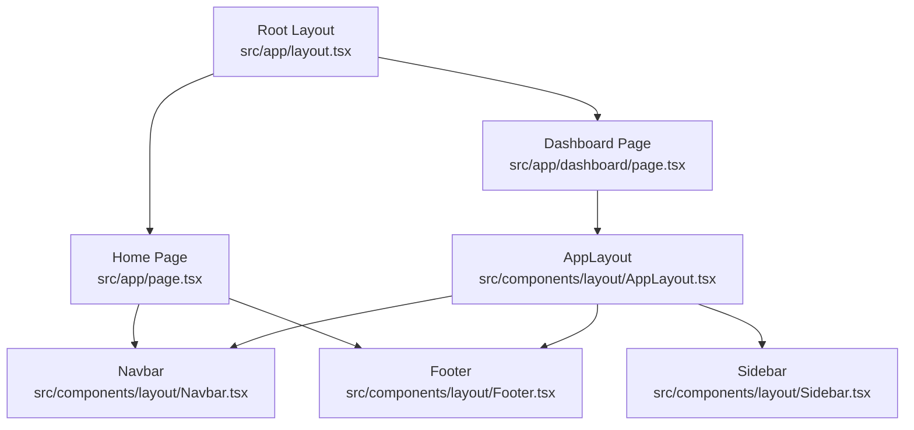
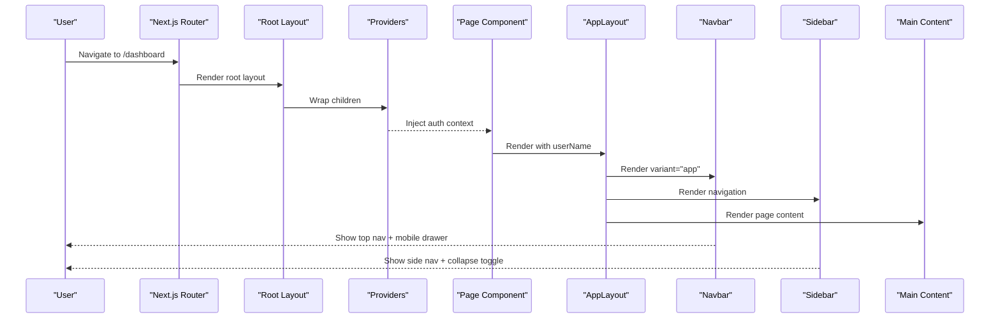
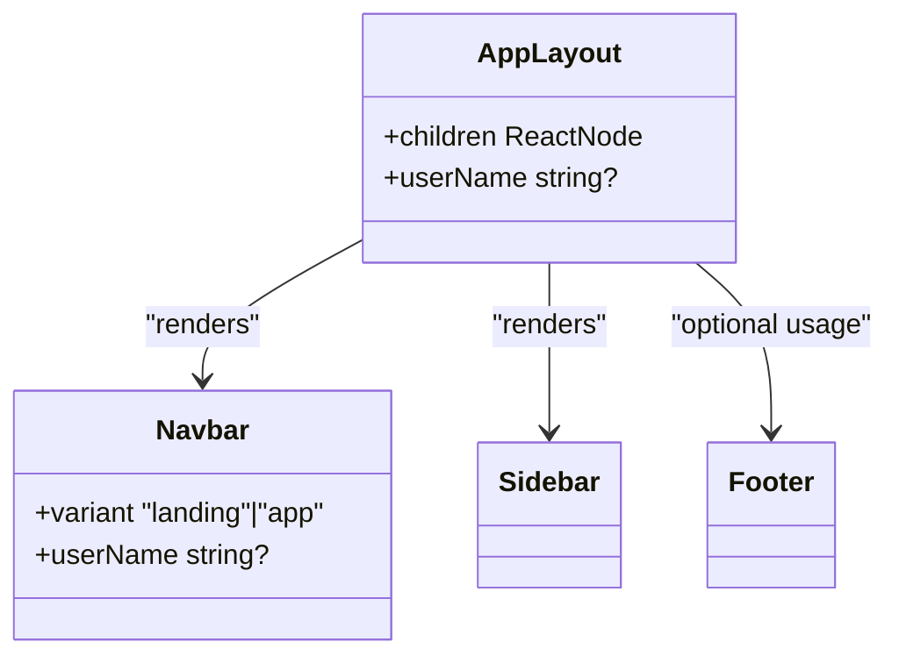
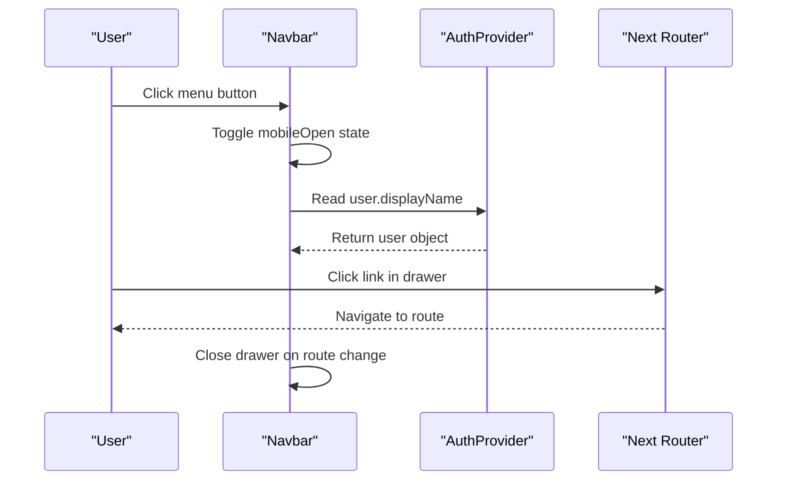
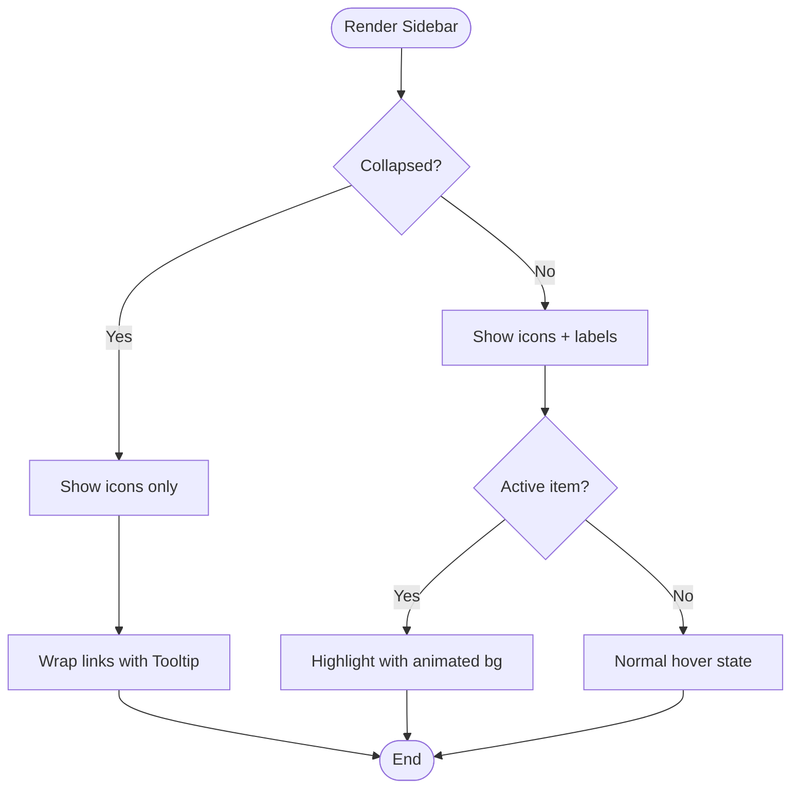
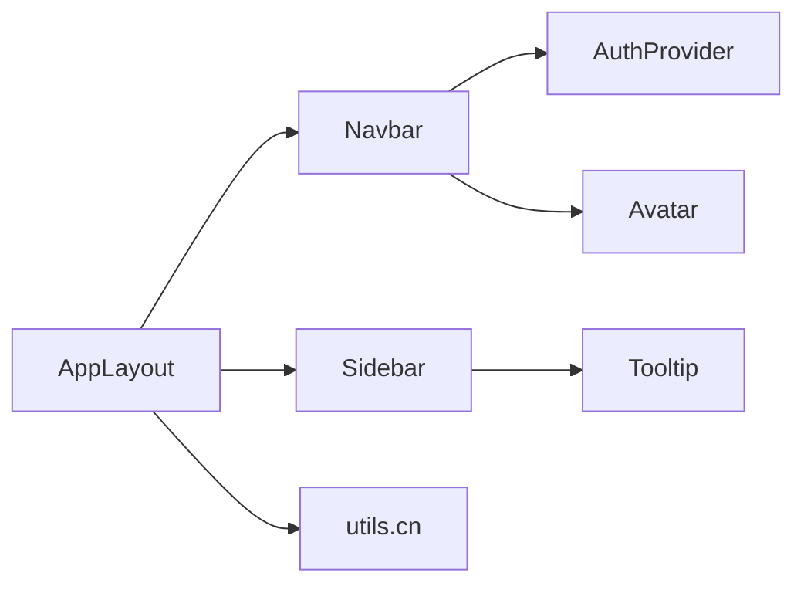

# Layout & Navigation Components

<cite>
**Referenced Files in This Document**
- [AppLayout.tsx](file://src/components/layout/AppLayout.tsx)
- [Navbar.tsx](file://src/components/layout/Navbar.tsx)
- [Sidebar.tsx](file://src/components/layout/Sidebar.tsx)
- [Footer.tsx](file://src/components/layout/Footer.tsx)
- [layout.tsx](file://src/app/layout.tsx)
- [page.tsx (Home)](file://src/app/page.tsx)
- [page.tsx (Dashboard)](file://src/app/dashboard/page.tsx)
- [AuthProvider.tsx](file://src/components/auth/AuthProvider.tsx)
- [utils.ts](file://src/lib/utils.ts)
- [Avatar.tsx](file://src/components/ui/Avatar.tsx)
- [Tooltip.tsx](file://src/components/ui/Tooltip.tsx)
</cite>

## Table of Contents
1. Introduction
2. Project Structure
3. Core Components
4. Architecture Overview
5. Detailed Component Analysis
6. Dependency Analysis
7. Performance Considerations
8. Troubleshooting Guide
9. Conclusion

## Introduction
This document explains MedAce-AI’s layout and navigation system, focusing on AppLayout, Navbar, Sidebar, and Footer. It covers responsive design patterns, mobile-first behavior, route-based navigation, active state management, collapsible sidebar, authentication-aware menus, and guidelines for consistent layouts across pages.

## Project Structure
The layout system is composed of reusable components under src/components/layout and integrated into Next.js app routes:
- Root HTML layout provides global styles and providers.
- Landing page uses a landing-style Navbar and Footer.
- App pages use AppLayout to compose Navbar, Sidebar, and main content with a mobile bottom nav.

**Diagram sources**
- [layout.tsx:44-56](file://src/app/layout.tsx#L44-L56)
- [page.tsx (Home):568-583](file://src/app/page.tsx#L568-L583)
- [page.tsx (Dashboard):34-75](file://src/app/dashboard/page.tsx#L34-L75)
- [AppLayout.tsx:29-89](file://src/components/layout/AppLayout.tsx#L29-L89)

**Section sources**
- [layout.tsx:44-56](file://src/app/layout.tsx#L44-L56)
- [page.tsx (Home):568-583](file://src/app/page.tsx#L568-L583)
- [page.tsx (Dashboard):34-75](file://src/app/dashboard/page.tsx#L34-L75)

## Core Components
- AppLayout: Provides the application shell with sticky Navbar, collapsible Sidebar, main content area, and a fixed mobile bottom navigation bar.
- Navbar: Responsive header with desktop links or landing CTAs, user avatar, and a slide-in mobile drawer menu.
- Sidebar: Collapsible left navigation with active state indicators and tooltips when collapsed.
- Footer: Multi-column footer with product, resources, company links, and social icons.

Key behaviors:
- Mobile-first responsive breakpoints via Tailwind classes.
- Route-based active states using Next.js usePathname.
- Authentication-aware display via AuthProvider context.
- Smooth animations with Framer Motion.

**Section sources**
- [AppLayout.tsx:24-89](file://src/components/layout/AppLayout.tsx#L24-L89)
- [Navbar.tsx:27-253](file://src/components/layout/Navbar.tsx#L27-L253)
- [Sidebar.tsx:20-145](file://src/components/layout/Sidebar.tsx#L20-L145)
- [Footer.tsx:31-133](file://src/components/layout/Footer.tsx#L31-L133)

## Architecture Overview
The layout architecture composes a shared root layout with two primary modes:
- Landing mode: Uses Navbar variant "landing" and Footer directly from the home page.
- App mode: Uses AppLayout which wraps Navbar (variant "app"), Sidebar, and main content; includes a mobile bottom nav.

**Diagram sources**
- [layout.tsx:44-56](file://src/app/layout.tsx#L44-L56)
- [page.tsx (Dashboard):34-75](file://src/app/dashboard/page.tsx#L34-L75)
- [AppLayout.tsx:29-89](file://src/components/layout/AppLayout.tsx#L29-L89)
- [Navbar.tsx:32-253](file://src/components/layout/Navbar.tsx#L32-L253)
- [Sidebar.tsx:27-145](file://src/components/layout/Sidebar.tsx#L27-L145)

## Detailed Component Analysis

### AppLayout
Responsibilities:
- Compose Navbar, Sidebar, and main content area.
- Provide a fixed mobile bottom navigation bar with active state based on current pathname.
- Ensure proper spacing and min-height for content.

Props:
- children: ReactNode — page content to render inside the main area.
- userName?: string — optional display name for the avatar in the navbar.

Responsive behavior:
- Desktop: Sidebar visible; main content expands flexibly.
- Mobile: Bottom tab bar appears; Sidebar hidden.

Active state logic:
- Highlights the current tab by comparing pathname to href or prefix matching for sub-routes.

Animation:
- Uses Framer Motion for smooth transitions on active indicator.

Integration:
- Used by app pages like Dashboard to wrap their content.

**Section sources**
- [AppLayout.tsx:24-89](file://src/components/layout/AppLayout.tsx#L24-L89)
- [page.tsx (Dashboard):34-75](file://src/app/dashboard/page.tsx#L34-L75)

#### AppLayout Class Diagram

**Diagram sources**
- [AppLayout.tsx:24-89](file://src/components/layout/AppLayout.tsx#L24-L89)
- [Navbar.tsx:27-253](file://src/components/layout/Navbar.tsx#L27-L253)
- [Sidebar.tsx:20-145](file://src/components/layout/Sidebar.tsx#L20-L145)
- [Footer.tsx:31-133](file://src/components/layout/Footer.tsx#L31-L133)

### Navbar
Responsibilities:
- Display brand logo and navigation links for app mode or landing CTAs for landing mode.
- Manage mobile drawer with slide-in animation and overlay.
- Show user avatar and name in app mode.
- Collapse height on scroll for compact header.

Props:
- variant?: "landing" | "app" — controls displayed links and actions.
- userName?: string — overrides user name if provided.

Navigation flow:
- Desktop: Horizontal links with active indicator via layoutId animation.
- Mobile: Hamburger toggles a right-side drawer containing links and user info.

Authentication awareness:
- Reads user from AuthProvider to show displayName and profile link.

Responsive behavior:
- Hidden desktop nav on small screens; drawer replaces it.
- Sticky header with dynamic height transition on scroll.

Accessibility:
- aria-label on hamburger button.

**Section sources**
- [Navbar.tsx:27-253](file://src/components/layout/Navbar.tsx#L27-L253)
- [AuthProvider.tsx:13-39](file://src/components/auth/AuthProvider.tsx#L13-L39)

#### Navbar Sequence Diagram

**Diagram sources**
- [Navbar.tsx:32-253](file://src/components/layout/Navbar.tsx#L32-L253)
- [AuthProvider.tsx:13-39](file://src/components/auth/AuthProvider.tsx#L13-L39)

### Sidebar
Responsibilities:
- Provide persistent navigation for app mode.
- Support collapse/expand to icon-only mode with tooltips.
- Highlight active items based on current pathname.

Configuration:
- Items array defines href, label, and icon for each navigation entry.

Behavior:
- Collapsed width reduces to show only icons; text fades out.
- Tooltip shows label when collapsed.
- Active item gets an animated background indicator.

Responsive behavior:
- Hidden on small and medium screens; visible on large screens.

**Section sources**
- [Sidebar.tsx:20-145](file://src/components/layout/Sidebar.tsx#L20-L145)
- [Tooltip.tsx:7-59](file://src/components/ui/Tooltip.tsx#L7-L59)

#### Sidebar Flowchart

**Diagram sources**
- [Sidebar.tsx:27-145](file://src/components/layout/Sidebar.tsx#L27-L145)

### Footer
Responsibilities:
- Present multi-column links for Product, Resources, Company.
- Include brand description and social media links.
- Provide a subtle gradient accent line at the top.

Configuration:
- footerLinks object defines grouped links.
- socialLinks array defines external links with icons.

Responsive behavior:
- Grid adapts from 2 columns to 4 columns on larger screens.

**Section sources**
- [Footer.tsx:31-133](file://src/components/layout/Footer.tsx#L31-L133)

## Dependency Analysis
Component relationships and key dependencies:
- AppLayout depends on Navbar, Sidebar, and utility functions for styling.
- Navbar depends on AuthProvider for user data and UI components (Avatar).
- Sidebar depends on Tooltip for collapsed labels and utility functions for styling.
- Footer is self-contained but uses icons and links.

**Diagram sources**
- [AppLayout.tsx:24-89](file://src/components/layout/AppLayout.tsx#L24-L89)
- [Navbar.tsx:27-253](file://src/components/layout/Navbar.tsx#L27-L253)
- [Sidebar.tsx:20-145](file://src/components/layout/Sidebar.tsx#L20-L145)
- [AuthProvider.tsx:13-39](file://src/components/auth/AuthProvider.tsx#L13-L39)
- [Avatar.tsx:3-58](file://src/components/ui/Avatar.tsx#L3-L58)
- [Tooltip.tsx:7-59](file://src/components/ui/Tooltip.tsx#L7-L59)
- [utils.ts:4-6](file://src/lib/utils.ts#L4-L6)

**Section sources**
- [AppLayout.tsx:24-89](file://src/components/layout/AppLayout.tsx#L24-L89)
- [Navbar.tsx:27-253](file://src/components/layout/Navbar.tsx#L27-L253)
- [Sidebar.tsx:20-145](file://src/components/layout/Sidebar.tsx#L20-L145)
- [AuthProvider.tsx:13-39](file://src/components/auth/AuthProvider.tsx#L13-L39)
- [Avatar.tsx:3-58](file://src/components/ui/Avatar.tsx#L3-L58)
- [Tooltip.tsx:7-59](file://src/components/ui/Tooltip.tsx#L7-L59)
- [utils.ts:4-6](file://src/lib/utils.ts#L4-L6)

## Performance Considerations
- Use client components sparingly; only layout components that require interactivity are marked as such.
- Leverage Framer Motion’s layout animations for smooth transitions without heavy reflows.
- Keep navigation lists static arrays to avoid unnecessary computations.
- Prefer CSS utilities for responsive behavior to minimize JS overhead.
- Avoid deep nesting in layout trees; keep main content lightweight.

[No sources needed since this section provides general guidance]

## Troubleshooting Guide
Common issues and resolutions:
- Mobile drawer not closing on route change: Ensure useEffect listens to pathname changes and resets mobileOpen state.
- Active state not highlighting: Verify pathname comparison logic and ensure hrefs match exactly or use prefix matching for nested routes.
- Collapsed sidebar tooltips not appearing: Confirm Tooltip wrapper is applied when collapsed and delay is set appropriately.
- Navbar user name not showing: Check AuthProvider initialization and fallback to default user when no session exists.

**Section sources**
- [Navbar.tsx:43-46](file://src/components/layout/Navbar.tsx#L43-L46)
- [Sidebar.tsx:67-70](file://src/components/layout/Sidebar.tsx#L67-L70)
- [Sidebar.tsx:112-118](file://src/components/layout/Sidebar.tsx#L112-L118)
- [AuthProvider.tsx:172-192](file://src/components/auth/AuthProvider.tsx#L172-L192)

## Conclusion
MedAce-AI’s layout and navigation system delivers a cohesive, responsive experience across devices. AppLayout orchestrates the composition of Navbar, Sidebar, and content while providing a mobile bottom nav. Navbar adapts to landing vs app contexts and integrates authentication-aware features. Sidebar offers collapsible navigation with clear active states. Footer standardizes site-wide information and links. Together, these components establish a scalable foundation for consistent layouts and complex navigation hierarchies.

[No sources needed since this section summarizes without analyzing specific files]