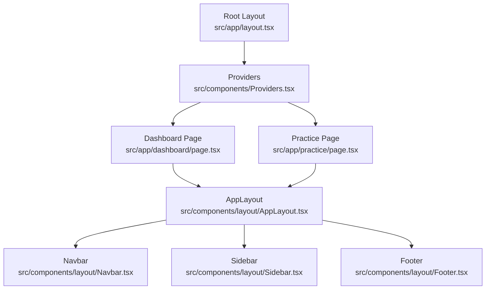
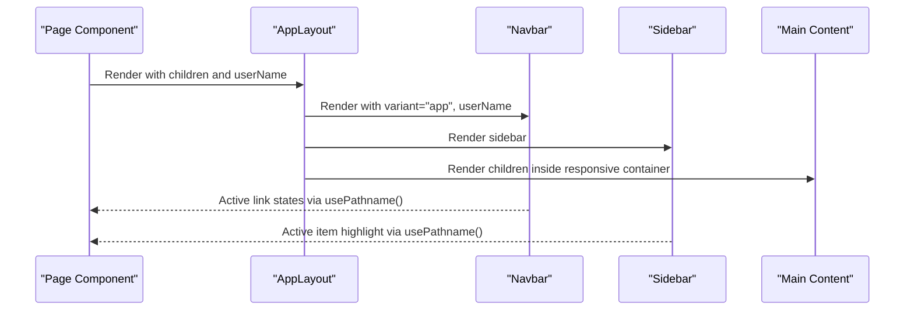
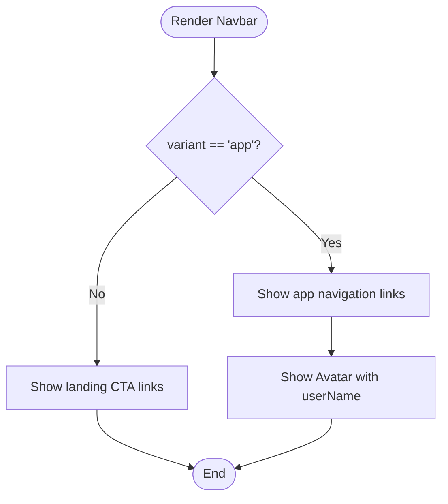
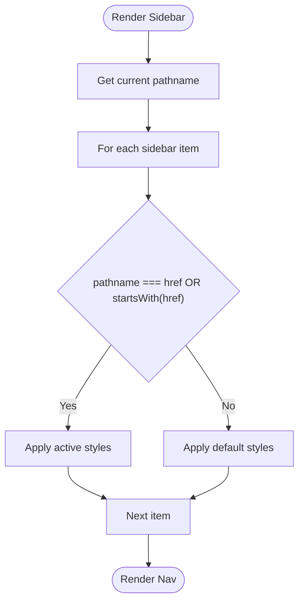
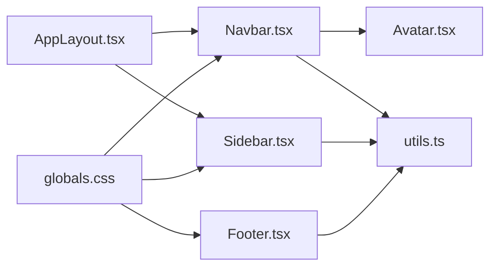

# Layout Components

<cite>
**Referenced Files in This Document**
- [AppLayout.tsx](file://src/components/layout/AppLayout.tsx)
- [Navbar.tsx](file://src/components/layout/Navbar.tsx)
- [Sidebar.tsx](file://src/components/layout/Sidebar.tsx)
- [Footer.tsx](file://src/components/layout/Footer.tsx)
- [Avatar.tsx](file://src/components/ui/Avatar.tsx)
- [utils.ts](file://src/lib/utils.ts)
- [globals.css](file://src/app/globals.css)
- [layout.tsx](file://src/app/layout.tsx)
- [dashboard/page.tsx](file://src/app/dashboard/page.tsx)
- [practice/page.tsx](file://src/app/practice/page.tsx)
</cite>

## Table of Contents
1. [Introduction](#introduction)
2. [Project Structure](#project-structure)
3. [Core Components](#core-components)
4. [Architecture Overview](#architecture-overview)
5. [Detailed Component Analysis](#detailed-component-analysis)
6. [Dependency Analysis](#dependency-analysis)
7. [Performance Considerations](#performance-considerations)
8. [Troubleshooting Guide](#troubleshooting-guide)
9. [Conclusion](#conclusion)
10. [Appendices](#appendices)

## Introduction
This document describes MedAce AI’s layout system, focusing on the components that provide a consistent application shell: AppLayout (main wrapper), Navbar (top navigation with logo, links, user menu, and mobile behavior), Sidebar (navigation panel with active state and nested support patterns), and Footer (branding, links, responsive design). It covers composition patterns, prop interfaces, integration examples, responsive breakpoints, accessibility features, and customization options for each component.

## Project Structure
The layout system is implemented as reusable React components under src/components/layout and consumed by pages via Next.js routing. The root layout sets global styles and providers; pages wrap their content in AppLayout to inherit consistent structure.

**Diagram sources**
- [layout.tsx:44-56](file://src/app/layout.tsx#L44-L56)
- [AppLayout.tsx:10-24](file://src/components/layout/AppLayout.tsx#L10-L24)
- [Navbar.tsx:30-161](file://src/components/layout/Navbar.tsx#L30-L161)
- [Sidebar.tsx:21-73](file://src/components/layout/Sidebar.tsx#L21-L73)
- [Footer.tsx:4-34](file://src/components/layout/Footer.tsx#L4-L34)
- [dashboard/page.tsx:21-237](file://src/app/dashboard/page.tsx#L21-L237)
- [practice/page.tsx:18-195](file://src/app/practice/page.tsx#L18-L195)

**Section sources**
- [layout.tsx:1-57](file://src/app/layout.tsx#L1-L57)
- [AppLayout.tsx:1-25](file://src/components/layout/AppLayout.tsx#L1-L25)

## Core Components
- AppLayout: Wraps application pages with a sticky top Navbar, a persistent Sidebar, and a responsive main content area. Accepts children and an optional userName for the user menu.
- Navbar: Provides branding, contextual navigation (app vs landing variants), user avatar, and a mobile drawer with accessible toggle.
- Sidebar: Displays primary navigation with active state detection and supports nested routes via prefix matching.
- Footer: Branding, quick links, and responsive layout for consistent page footers.

Key props and behaviors:
- AppLayoutProps: { children: ReactNode; userName?: string }
- NavbarProps: { variant?: "landing" | "app"; userName?: string }
- Sidebar: No props; derives active state from current pathname.
- Footer: No props; renders static branding and links.

Integration examples:
- Pages wrap content in <AppLayout userName="...">...</AppLayout>.
- Navbar automatically adapts based on variant and route context.
- Sidebar highlights active items using pathname matching.

**Section sources**
- [AppLayout.tsx:5-24](file://src/components/layout/AppLayout.tsx#L5-L24)
- [Navbar.tsx:25-33](file://src/components/layout/Navbar.tsx#L25-L33)
- [Sidebar.tsx:14-23](file://src/components/layout/Sidebar.tsx#L14-L23)
- [Footer.tsx:4-34](file://src/components/layout/Footer.tsx#L4-L34)
- [dashboard/page.tsx:21-237](file://src/app/dashboard/page.tsx#L21-L237)
- [practice/page.tsx:18-195](file://src/app/practice/page.tsx#L18-L195)

## Architecture Overview
The layout architecture composes a stable chrome around page content:
- Root layout establishes global theme and font variables.
- AppLayout orchestrates Navbar, Sidebar, and main content region.
- Navbar handles both app and landing modes with responsive menus.
- Sidebar provides persistent navigation with active state.
- Footer offers consistent branding and links at the bottom of pages when used.

**Diagram sources**
- [AppLayout.tsx:10-24](file://src/components/layout/AppLayout.tsx#L10-L24)
- [Navbar.tsx:30-161](file://src/components/layout/Navbar.tsx#L30-L161)
- [Sidebar.tsx:21-73](file://src/components/layout/Sidebar.tsx#L21-L73)
- [dashboard/page.tsx:21-237](file://src/app/dashboard/page.tsx#L21-L237)
- [practice/page.tsx:18-195](file://src/app/practice/page.tsx#L18-L195)

## Detailed Component Analysis

### AppLayout
Responsibilities:
- Provide full-height background and consistent spacing.
- Compose Navbar (app mode) and Sidebar.
- Create a responsive main content area with max-width and padding.

Composition pattern:
- Receives children and optional userName.
- Passes userName to Navbar for user menu display.

Responsive behavior:
- Uses Tailwind breakpoints to control content width and padding.
- Ensures main content height accounts for navbar height.

Accessibility:
- Semantic main element for content region.
- Proper stacking context and z-index handled by child components.

Customization:
- Adjust max-width and padding classes to change content width.
- Modify background or spacing to fit brand guidelines.

Integration example:
- Wrap page content in <AppLayout userName="...">...</AppLayout>.

**Section sources**
- [AppLayout.tsx:5-24](file://src/components/layout/AppLayout.tsx#L5-L24)
- [dashboard/page.tsx:21-237](file://src/app/dashboard/page.tsx#L21-L237)
- [practice/page.tsx:18-195](file://src/app/practice/page.tsx#L18-L195)

### Navbar
Responsibilities:
- Display logo and branding.
- Show contextual navigation links based on variant ("app" or "landing").
- Provide user avatar in app mode.
- Offer mobile drawer with accessible toggle.

Props:
- variant: "landing" | "app"
- userName?: string

Behavior:
- Desktop nav links are visible on md+ screens; hidden on smaller devices.
- Mobile menu toggles open/close with aria-label for accessibility.
- Active link highlighting uses current pathname.

Mobile responsiveness:
- Hidden desktop nav on small screens; shows hamburger button.
- Drawer slides down with backdrop blur and border styling.

Accessibility:
- Button has aria-label for screen readers.
- Links are semantic and keyboard navigable.

Customization:
- Change variant to switch between app and landing navigation.
- Update appNavItems to add/remove links and icons.
- Style transitions and colors via Tailwind utilities.

**Diagram sources**
- [Navbar.tsx:30-161](file://src/components/layout/Navbar.tsx#L30-L161)

**Section sources**
- [Navbar.tsx:25-161](file://src/components/layout/Navbar.tsx#L25-L161)
- [Avatar.tsx:3-56](file://src/components/ui/Avatar.tsx#L3-L56)

### Sidebar
Responsibilities:
- Present persistent navigation for app sections.
- Highlight active items based on current pathname.
- Support nested routes via prefix matching.

Behavior:
- Active state logic considers exact match and startsWith for sub-routes.
- Visual indicator includes left border accent for active items.

Nested menu support:
- Prefix matching enables highlighting for grouped routes without explicit nested UI.
- To implement expandable nested menus, extend the data model and render groups with collapsible sections.

Accessibility:
- Semantic aside and nav elements.
- Keyboard-friendly links.

Customization:
- Extend sidebarItems to add new sections or groupings.
- Adjust active state logic to handle deeper nesting if needed.

**Diagram sources**
- [Sidebar.tsx:21-73](file://src/components/layout/Sidebar.tsx#L21-L73)

**Section sources**
- [Sidebar.tsx:14-73](file://src/components/layout/Sidebar.tsx#L14-L73)

### Footer
Responsibilities:
- Provide branding, quick links, and copyright notice.
- Maintain responsive layout across devices.

Behavior:
- Flexbox layout stacks vertically on small screens and horizontally on larger screens.
- Links hover to indicate interactivity.

Accessibility:
- Semantic footer element.
- Links are standard anchor elements.

Customization:
- Add or remove links and update branding text.
- Adjust spacing and alignment via Tailwind classes.

**Section sources**
- [Footer.tsx:4-34](file://src/components/layout/Footer.tsx#L4-L34)

## Dependency Analysis
Component relationships and imports:
- AppLayout depends on Navbar and Sidebar.
- Navbar depends on Next.js Link, hooks, lucide-react icons, and Avatar.
- Sidebar depends on Next.js Link, hooks, and lucide-react icons.
- Footer depends on Next.js Link and lucide-react icon.
- Global styles define design tokens and animations used by layout components.

**Diagram sources**
- [AppLayout.tsx:1-24](file://src/components/layout/AppLayout.tsx#L1-L24)
- [Navbar.tsx:1-161](file://src/components/layout/Navbar.tsx#L1-L161)
- [Sidebar.tsx:1-73](file://src/components/layout/Sidebar.tsx#L1-L73)
- [Footer.tsx:1-34](file://src/components/layout/Footer.tsx#L1-L34)
- [Avatar.tsx:1-56](file://src/components/ui/Avatar.tsx#L1-L56)
- [utils.ts:1-34](file://src/lib/utils.ts#L1-L34)
- [globals.css:1-181](file://src/app/globals.css#L1-L181)

**Section sources**
- [AppLayout.tsx:1-24](file://src/components/layout/AppLayout.tsx#L1-L24)
- [Navbar.tsx:1-161](file://src/components/layout/Navbar.tsx#L1-L161)
- [Sidebar.tsx:1-73](file://src/components/layout/Sidebar.tsx#L1-L73)
- [Footer.tsx:1-34](file://src/components/layout/Footer.tsx#L1-L34)
- [Avatar.tsx:1-56](file://src/components/ui/Avatar.tsx#L1-L56)
- [utils.ts:1-34](file://src/lib/utils.ts#L1-L34)
- [globals.css:1-181](file://src/app/globals.css#L1-L181)

## Performance Considerations
- Client-side rendering: Navbar and Sidebar are marked as client components to access router hooks; ensure only necessary state updates occur to avoid re-renders.
- Navigation performance: Using Next.js Link reduces full-page reloads and improves perceived performance.
- Styling efficiency: Tailwind utility classes minimize CSS bloat and leverage built-in optimizations.
- Avatar rendering: Conditional image vs initials avoids unnecessary DOM nodes when no image is provided.

[No sources needed since this section provides general guidance]

## Troubleshooting Guide
Common issues and resolutions:
- Mobile menu not closing: Ensure onClick handler closes the drawer and verify state updates are applied.
- Active state not highlighting: Confirm pathname matches expected href values; adjust startsWith logic for nested routes if needed.
- Navbar variant mismatch: Verify variant prop is set correctly per page context ("app" vs "landing").
- Avatar not displaying name: Ensure userName prop is passed to AppLayout and forwarded to Navbar.

Debugging tips:
- Inspect computed className values using browser dev tools to confirm conditional styling.
- Log pathname to verify active link calculations.
- Validate Tailwind breakpoints and class names for responsive behavior.

**Section sources**
- [Navbar.tsx:30-161](file://src/components/layout/Navbar.tsx#L30-L161)
- [Sidebar.tsx:21-73](file://src/components/layout/Sidebar.tsx#L21-L73)
- [AppLayout.tsx:10-24](file://src/components/layout/AppLayout.tsx#L10-L24)

## Conclusion
MedAce AI’s layout system provides a robust, responsive, and accessible foundation for application pages. AppLayout composes Navbar, Sidebar, and main content consistently. Navbar adapts to app and landing contexts with mobile-friendly navigation. Sidebar offers clear active state management and supports nested routes through simple logic. Footer ensures consistent branding and links. Together, these components deliver a cohesive user experience across devices while remaining customizable and maintainable.

[No sources needed since this section summarizes without analyzing specific files]

## Appendices

### Responsive Breakpoints Used
- sm: Small screens (e.g., mobile portrait)
- md: Medium screens (e.g., tablets)
- lg: Large screens (e.g., desktops)

These breakpoints are applied throughout layout components to control visibility and layout changes.

**Section sources**
- [Navbar.tsx:55-110](file://src/components/layout/Navbar.tsx#L55-L110)
- [Sidebar.tsx:25-73](file://src/components/layout/Sidebar.tsx#L25-L73)
- [Footer.tsx:6-34](file://src/components/layout/Footer.tsx#L6-L34)

### Accessibility Features
- Semantic HTML elements (header, nav, aside, main, footer).
- Accessible labels for interactive controls (e.g., mobile menu toggle).
- Keyboard-navigable links and focus states via default browser behavior.
- ARIA attributes where appropriate (e.g., aria-label on buttons).

**Section sources**
- [Navbar.tsx:104-110](file://src/components/layout/Navbar.tsx#L104-L110)
- [Avatar.tsx:49-52](file://src/components/ui/Avatar.tsx#L49-L52)

### Customization Options
- Design tokens: Colors, fonts, and effects are defined in globals.css for consistent theming.
- Utility functions: cn helper merges classes efficiently; consider extending for additional utilities.
- Navigation items: Extend arrays in Navbar and Sidebar to add or modify links and icons.
- Layout dimensions: Adjust max-width and padding in AppLayout to change content width.

**Section sources**
- [globals.css:7-36](file://src/app/globals.css#L7-L36)
- [utils.ts:4-6](file://src/lib/utils.ts#L4-L6)
- [Navbar.tsx:18-23](file://src/components/layout/Navbar.tsx#L18-L23)
- [Sidebar.tsx:14-19](file://src/components/layout/Sidebar.tsx#L14-L19)
- [AppLayout.tsx:16-19](file://src/components/layout/AppLayout.tsx#L16-L19)