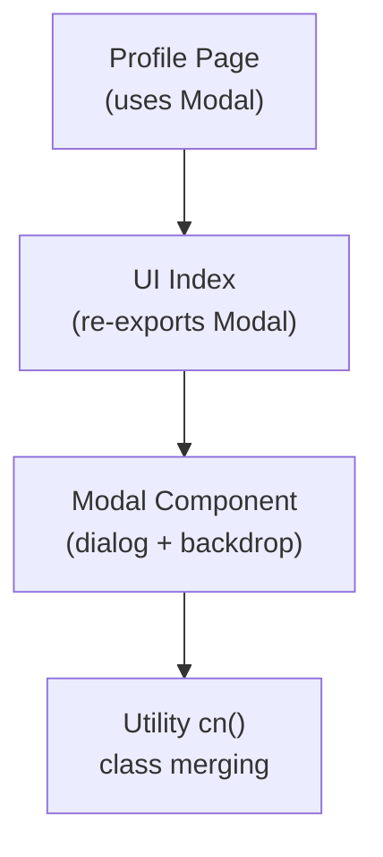
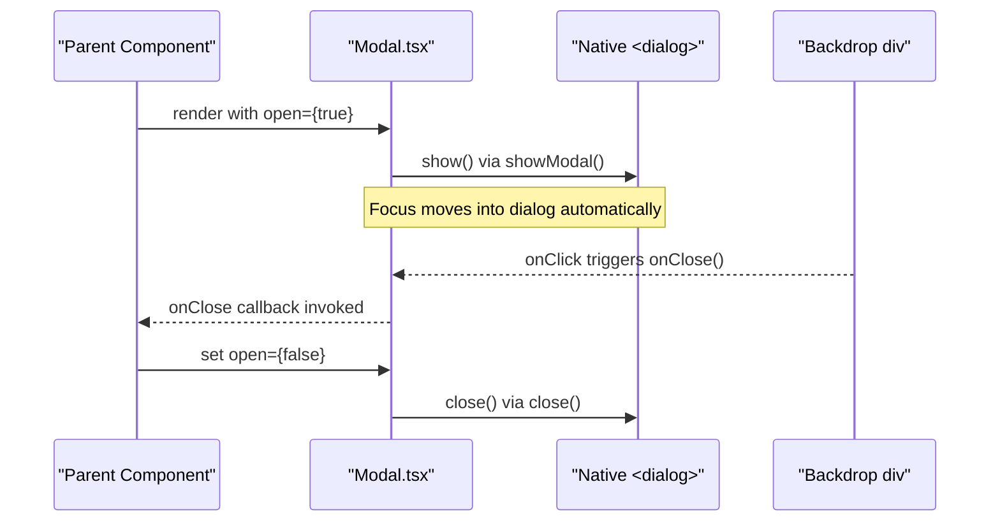
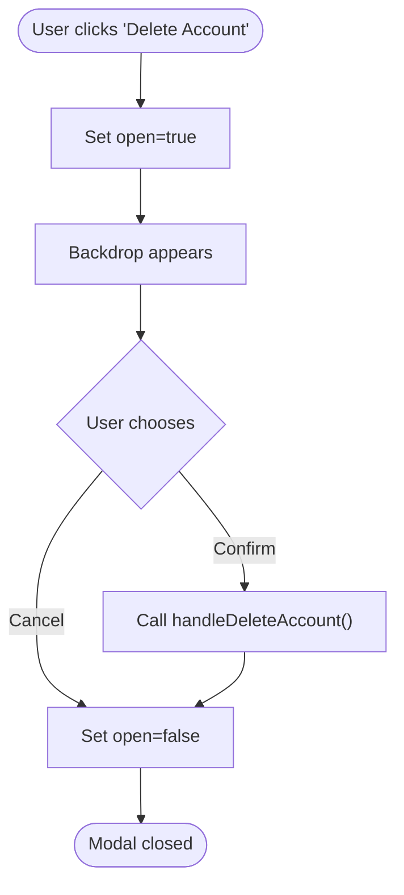
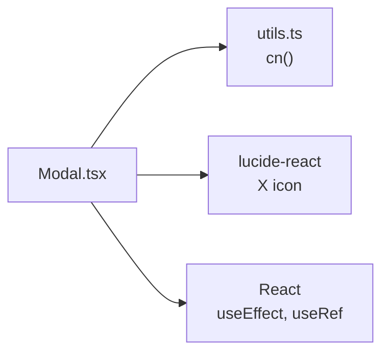

# Modal Component

<cite>
**Referenced Files in This Document**
- [Modal.tsx](file://Next-app/src/components/ui/Modal.tsx)
- [index.ts](file://Next-app/src/components/ui/index.ts)
- [profile page.tsx](file://Next-app/src/app/(dashboard)/profile/page.tsx)
- [utils.ts](file://Next-app/src/lib/utils.ts)
</cite>

## Table of Contents
1. [Introduction](#introduction)
2. [Project Structure](#project-structure)
3. [Core Components](#core-components)
4. [Architecture Overview](#architecture-overview)
5. [Detailed Component Analysis](#detailed-component-analysis)
6. [Dependency Analysis](#dependency-analysis)
7. [Performance Considerations](#performance-considerations)
8. [Troubleshooting Guide](#troubleshooting-guide)
9. [Conclusion](#conclusion)

## Introduction
This document provides comprehensive documentation for the Modal component used across the application. It explains available props, behavior, accessibility features, and usage patterns with examples from the codebase. The Modal is a lightweight overlay built on the native HTML dialog element, providing a simple yet accessible modal experience.

## Project Structure
The Modal component resides in the shared UI library and is re-exported via the UI index. It is consumed by dashboard pages to implement confirmation dialogs and other overlays.

**Diagram sources**
- [profile page.tsx:170-207](file://Next-app/src/app/(dashboard)/profile/page.tsx#L170-L207)
- [index.ts:1-11](file://Next-app/src/components/ui/index.ts#L1-L11)
- [Modal.tsx:1-63](file://Next-app/src/components/ui/Modal.tsx#L1-L63)
- [utils.ts:1-6](file://Next-app/src/lib/utils.ts#L1-L6)

**Section sources**
- [index.ts:1-11](file://Next-app/src/components/ui/index.ts#L1-L11)
- [Modal.tsx:1-63](file://Next-app/src/components/ui/Modal.tsx#L1-L63)
- [profile page.tsx:170-207](file://Next-app/src/app/(dashboard)/profile/page.tsx#L170-L207)

## Core Components
- Modal: A client-side React component that renders an overlay and a centered dialog using the native <dialog> element. It manages open/close state via props and uses the browser’s built-in modal semantics.

Key responsibilities:
- Render a semi-transparent backdrop that closes the modal when clicked.
- Center and style the dialog content.
- Provide a close button in the header.
- Control visibility based on the open prop.

**Section sources**
- [Modal.tsx:7-13](file://Next-app/src/components/ui/Modal.tsx#L7-L13)
- [Modal.tsx:15-63](file://Next-app/src/components/ui/Modal.tsx#L15-L63)

## Architecture Overview
The Modal integrates with the parent component through controlled props and leverages native dialog APIs for focus trapping and keyboard handling.

**Diagram sources**
- [Modal.tsx:18-27](file://Next-app/src/components/ui/Modal.tsx#L18-L27)
- [Modal.tsx:31-60](file://Next-app/src/components/ui/Modal.tsx#L31-L60)

## Detailed Component Analysis

### Props API
- open (boolean): Controls whether the modal is visible. When true, the dialog is shown; when false, it is hidden.
- onClose (): Function called to close the modal. Triggered by clicking the backdrop or the close button.
- title? (string): Optional header text rendered above the content.
- children (ReactNode): Content rendered inside the dialog body.
- className? (string): Additional CSS classes applied to the dialog container for customization.

Notes:
- The component is controlled; always manage open state in the parent.
- The dialog uses native semantics for focus management and keyboard interactions.

**Section sources**
- [Modal.tsx:7-13](file://Next-app/src/components/ui/Modal.tsx#L7-L13)
- [Modal.tsx:15-63](file://Next-app/src/components/ui/Modal.tsx#L15-L63)

### Behavior and Features
- Backdrop: A full-screen overlay with opacity that closes the modal on click.
- Close button: Positioned in the header; calls onClose().
- Native dialog: Uses <dialog>, which provides built-in focus trapping and Escape key handling in modern browsers.
- Conditional rendering: When not open, the component returns null to avoid unnecessary DOM nodes.

Accessibility highlights:
- aria-hidden="true" on the backdrop ensures screen readers ignore it.
- Native dialog semantics assist screen readers and keyboard users.

**Section sources**
- [Modal.tsx:31-60](file://Next-app/src/components/ui/Modal.tsx#L31-L60)

### Styling and Z-Index
- Backdrop z-index: Lower than the dialog to ensure proper layering.
- Dialog z-index: Highest among modal elements to appear above the backdrop.
- Default width: Constrained maximum width with responsive centering.
- Customization: Use className to override or extend default styles.

**Section sources**
- [Modal.tsx:31-47](file://Next-app/src/components/ui/Modal.tsx#L31-L47)

### Usage Example: Confirmation Dialog
A delete confirmation modal is implemented in the profile page, demonstrating typical usage with open state, onClose handler, title, and action buttons inside the modal.

**Diagram sources**
- [profile page.tsx:170-207](file://Next-app/src/app/(dashboard)/profile/page.tsx#L170-L207)

**Section sources**
- [profile page.tsx:170-207](file://Next-app/src/app/(dashboard)/profile/page.tsx#L170-L207)

### Examples and Patterns

- Basic Modal
  - Use open and onClose to control visibility.
  - Add a title and any content in children.
  - Reference: [Modal.tsx:7-13](file://Next-app/src/components/ui/Modal.tsx#L7-L13), [Modal.tsx:15-63](file://Next-app/src/components/ui/Modal.tsx#L15-L63)

- Confirmation Dialog
  - Two-button layout inside children (confirm/cancel).
  - Reference: [profile page.tsx:170-207](file://Next-app/src/app/(dashboard)/profile/page.tsx#L170-L207)

- Form Modal
  - Place form fields inside children.
  - Ensure forms submit via your own handlers; use onClose to dismiss after submission.
  - Reference: [Modal.tsx:15-63](file://Next-app/src/components/ui/Modal.tsx#L15-L63)

- Nested Modals
  - Nesting multiple modals can be complex due to focus stacking and z-index.
  - Recommendation: Avoid deep nesting; if necessary, manage z-index carefully and ensure only one modal is active at a time.
  - Reference: [Modal.tsx:31-47](file://Next-app/src/components/ui/Modal.tsx#L31-L47)

[No sources needed since this section aggregates usage patterns without analyzing additional files]

### Focus Management, Keyboard Navigation, and Escape Key
- Focus management: The native <dialog> element handles focus trapping when shown via showModal(), moving focus into the modal and keeping it within until closed.
- Escape key: Closing via Escape is handled by the native dialog behavior.
- Screen reader support: The backdrop has aria-hidden="true", and the dialog’s native semantics provide appropriate roles and states to assistive technologies.

Implementation references:
- Showing/hiding via showModal()/close(): [Modal.tsx:18-27](file://Next-app/src/components/ui/Modal.tsx#L18-L27)
- Backdrop attribute: [Modal.tsx:31-38](file://Next-app/src/components/ui/Modal.tsx#L31-L38)

**Section sources**
- [Modal.tsx:18-27](file://Next-app/src/components/ui/Modal.tsx#L18-L27)
- [Modal.tsx:31-38](file://Next-app/src/components/ui/Modal.tsx#L31-L38)

### Composition Guidelines
- Keep each modal focused on a single task.
- Compose reusable subcomponents (headers, footers, forms) inside children for clarity.
- Use className to adapt sizing and layout per context.

**Section sources**
- [Modal.tsx:15-63](file://Next-app/src/components/ui/Modal.tsx#L15-L63)

## Dependency Analysis
The Modal depends on:
- React hooks: useEffect, useRef for lifecycle and DOM access.
- Utility function: cn for class name merging.
- Icon library: lucide-react X icon for the close button.

**Diagram sources**
- [Modal.tsx:1-5](file://Next-app/src/components/ui/Modal.tsx#L1-L5)
- [utils.ts:1-6](file://Next-app/src/lib/utils.ts#L1-L6)

**Section sources**
- [Modal.tsx:1-5](file://Next-app/src/components/ui/Modal.tsx#L1-L5)
- [utils.ts:1-6](file://Next-app/src/lib/utils.ts#L1-L6)

## Performance Considerations
- Controlled open prop: Prevents unnecessary re-renders by managing visibility in the parent.
- Native dialog: Leverages browser optimizations for focus and event handling.
- Lightweight DOM: Minimal markup reduces overhead.
- Complex content: For heavy forms or large lists, consider lazy loading or virtualization inside children to maintain responsiveness.

[No sources needed since this section provides general guidance]

## Troubleshooting Guide
- Modal does not close on backdrop click:
  - Ensure onClose is passed and sets open to false.
  - Verify no event.stopPropagation() prevents the click from reaching the backdrop.
  - Reference: [Modal.tsx:31-38](file://Next-app/src/components/ui/Modal.tsx#L31-L38)

- Escape key does not close:
  - Confirm the dialog is being shown via showModal() and not manually toggled without native methods.
  - Reference: [Modal.tsx:18-27](file://Next-app/src/components/ui/Modal.tsx#L18-L27)

- Focus not trapped:
  - Ensure the dialog is opened using showModal() and not just CSS visibility changes.
  - Reference: [Modal.tsx:18-27](file://Next-app/src/components/ui/Modal.tsx#L18-L27)

- Accessibility issues:
  - Verify aria-hidden on backdrop remains true.
  - Check that the dialog has a clear title or accessible label.
  - Reference: [Modal.tsx:31-38](file://Next-app/src/components/ui/Modal.tsx#L31-L38), [Modal.tsx:48-57](file://Next-app/src/components/ui/Modal.tsx#L48-L57)

**Section sources**
- [Modal.tsx:18-27](file://Next-app/src/components/ui/Modal.tsx#L18-L27)
- [Modal.tsx:31-38](file://Next-app/src/components/ui/Modal.tsx#L31-L38)
- [Modal.tsx:48-57](file://Next-app/src/components/ui/Modal.tsx#L48-L57)

## Conclusion
The Modal component offers a simple, accessible, and performant overlay solution built on native dialog semantics. It supports essential behaviors like backdrop dismissal, focus management, and keyboard navigation out of the box. By controlling open state in the parent and composing content via children, you can implement basic modals, confirmation dialogs, form modals, and more. For advanced needs such as size variants, custom animations, or nested modals, extend the component thoughtfully while preserving accessibility and performance.