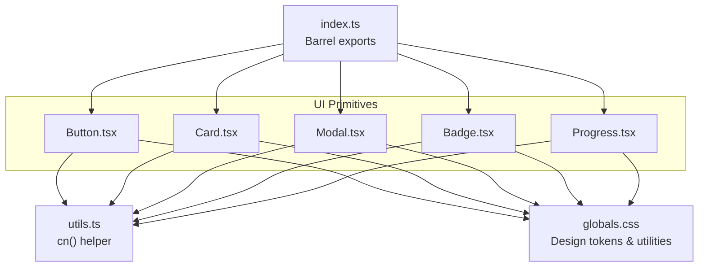
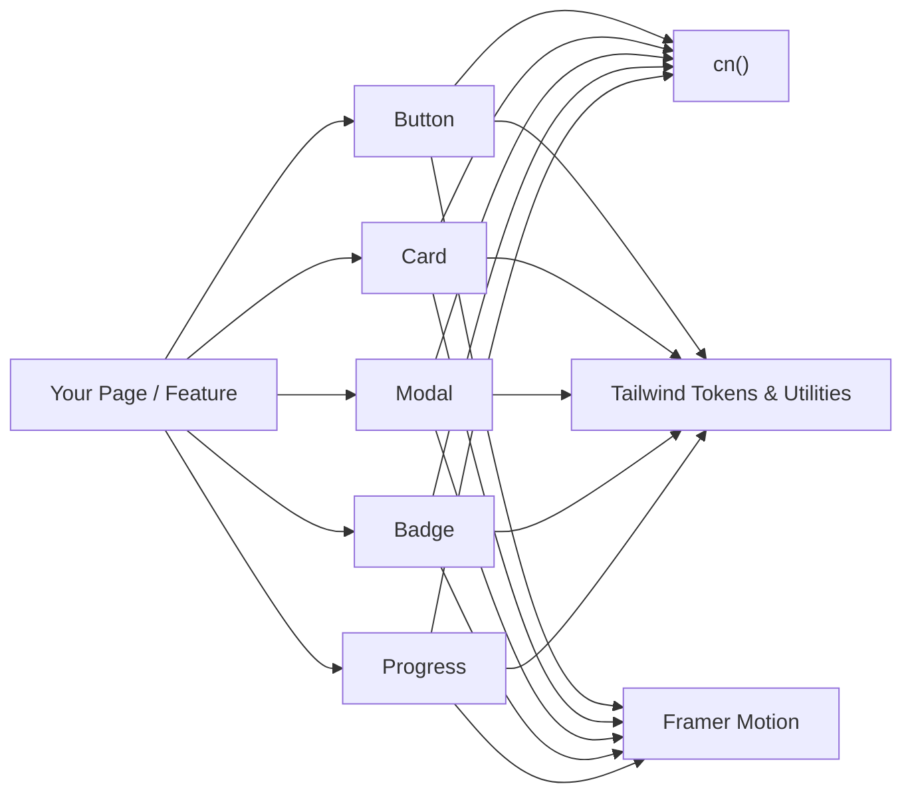
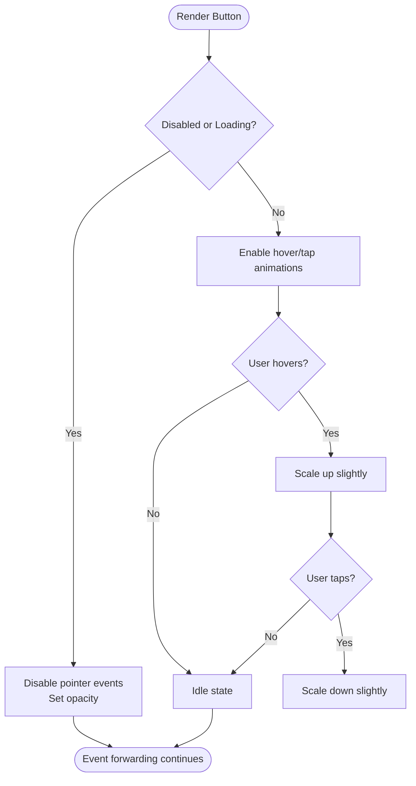
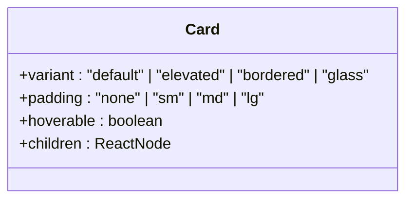
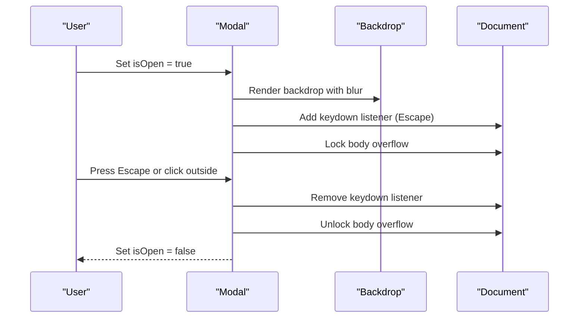
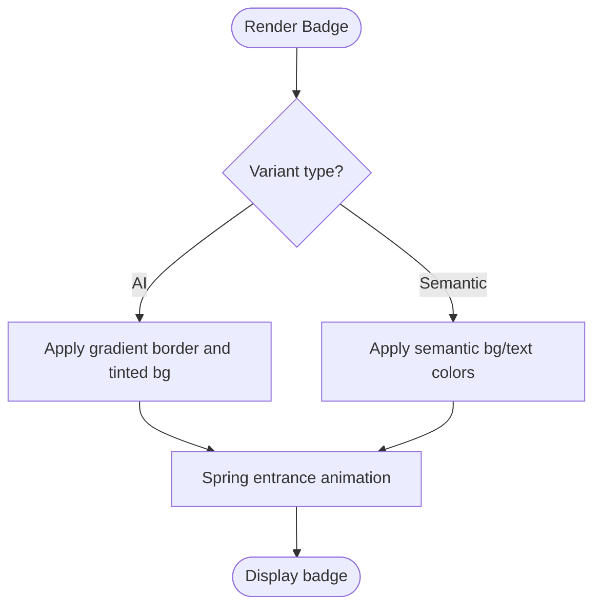
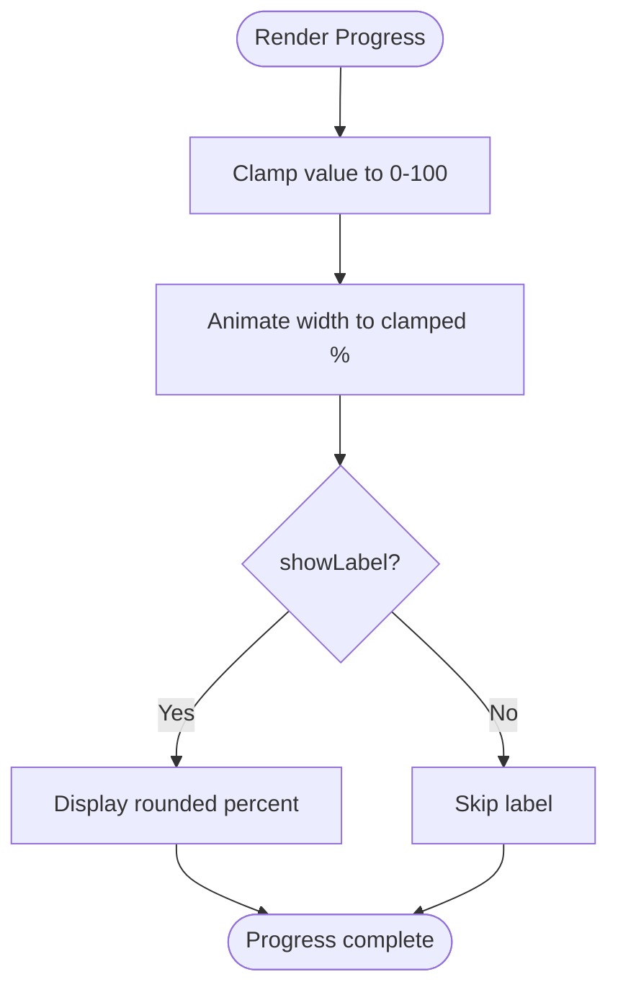
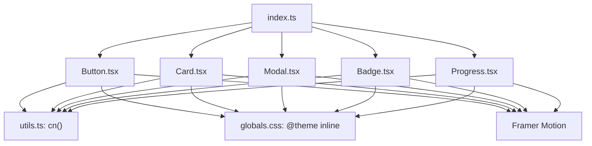

# Primitive UI Components

<cite>
**Referenced Files in This Document**
- [Button.tsx](file://src/components/ui/Button.tsx)
- [Card.tsx](file://src/components/ui/Card.tsx)
- [Modal.tsx](file://src/components/ui/Modal.tsx)
- [Badge.tsx](file://src/components/ui/Badge.tsx)
- [Progress.tsx](file://src/components/ui/Progress.tsx)
- [index.ts](file://src/components/ui/index.ts)
- [utils.ts](file://src/lib/utils.ts)
- [globals.css](file://src/app/globals.css)
</cite>

## Table of Contents
1. [Introduction](#introduction)
2. [Project Structure](#project-structure)
3. [Core Components](#core-components)
4. [Architecture Overview](#architecture-overview)
5. [Detailed Component Analysis](#detailed-component-analysis)
6. [Dependency Analysis](#dependency-analysis)
7. [Performance Considerations](#performance-considerations)
8. [Troubleshooting Guide](#troubleshooting-guide)
9. [Conclusion](#conclusion)
10. [Appendices](#appendices)

## Introduction
This document provides comprehensive documentation for MedAce-AI’s primitive UI components: Button, Card, Modal, Badge, and Progress. These components follow a dark premium medical design language with glassmorphism surfaces, backdrop blur effects, gradient accents, and spring-physics animations powered by Framer Motion. Each component includes prop specifications, event handling patterns, customization options, accessibility considerations, and guidance for consistent theming and responsive behavior.

## Project Structure
The primitive components live under src/components/ui and are re-exported from a single barrel file. They rely on shared utilities (cn class merger), Tailwind CSS v4 tokens defined inline via @theme, and Framer Motion for motion primitives. The global design system is defined in the application’s global stylesheet.

**Diagram sources**
- [Button.tsx:1-68](file://src/components/ui/Button.tsx#L1-L68)
- [Card.tsx:1-70](file://src/components/ui/Card.tsx#L1-L70)
- [Modal.tsx:1-96](file://src/components/ui/Modal.tsx#L1-L96)
- [Badge.tsx:1-42](file://src/components/ui/Badge.tsx#L1-L42)
- [Progress.tsx:1-74](file://src/components/ui/Progress.tsx#L1-L74)
- [index.ts:1-15](file://src/components/ui/index.ts#L1-L15)
- [utils.ts:1-34](file://src/lib/utils.ts#L1-L34)
- [globals.css:1-300](file://src/app/globals.css#L1-L300)

**Section sources**
- [index.ts:1-15](file://src/components/ui/index.ts#L1-L15)
- [globals.css:1-300](file://src/app/globals.css#L1-L300)

## Core Components
- Button: A versatile action button with variants, sizes, loading state, optional glow animation, and hover/tap micro-interactions.
- Card: A container with multiple visual variants including glassmorphism, elevation, and border styles; optional hover lift animation.
- Modal: An accessible dialog with backdrop blur, spring-based entrance/exit transitions, keyboard support, and focus management.
- Badge: A small status indicator with semantic variants and an AI variant featuring gradient borders and shimmer-like styling.
- Progress: A linear progress bar with animated fill using spring physics, size and color variants, optional glow, and label display.

All components use the cn utility to merge classes safely and leverage Tailwind CSS v4 design tokens for consistent colors, spacing, and typography.

**Section sources**
- [Button.tsx:1-68](file://src/components/ui/Button.tsx#L1-L68)
- [Card.tsx:1-70](file://src/components/ui/Card.tsx#L1-L70)
- [Modal.tsx:1-96](file://src/components/ui/Modal.tsx#L1-L96)
- [Badge.tsx:1-42](file://src/components/ui/Badge.tsx#L1-L42)
- [Progress.tsx:1-74](file://src/components/ui/Progress.tsx#L1-L74)
- [utils.ts:1-34](file://src/lib/utils.ts#L1-L34)
- [globals.css:1-300](file://src/app/globals.css#L1-L300)

## Architecture Overview
The primitive components share a common architecture:
- Props define appearance and behavior (variants, sizes, states).
- Class composition via cn merges base, variant, size, and user-provided classes.
- Framer Motion adds subtle interactions: whileHover/whileTap for buttons, spring transitions for modals and badges, animated width for progress bars.
- Accessibility attributes (role, aria-modal, aria-label) ensure screen reader compatibility.
- Global design tokens provide consistent colors, glassmorphism, and glow utilities.

**Diagram sources**
- [Button.tsx:1-68](file://src/components/ui/Button.tsx#L1-L68)
- [Card.tsx:1-70](file://src/components/ui/Card.tsx#L1-L70)
- [Modal.tsx:1-96](file://src/components/ui/Modal.tsx#L1-L96)
- [Badge.tsx:1-42](file://src/components/ui/Badge.tsx#L1-L42)
- [Progress.tsx:1-74](file://src/components/ui/Progress.tsx#L1-L74)
- [utils.ts:1-34](file://src/lib/utils.ts#L1-L34)
- [globals.css:1-300](file://src/app/globals.css#L1-L300)

## Detailed Component Analysis

### Button
- Visual appearance: Rounded button with gradient primary style, secondary surface style, ghost transparent style, and danger accent style. Includes optional glow pulse animation.
- Props:
  - variant: "primary" | "secondary" | "ghost" | "danger"
  - size: "sm" | "md" | "lg"
  - loading: boolean
  - glow: boolean
  - disabled: boolean
  - Standard HTML button attributes supported via forwardRef
- Event handlers: All standard button events (onClick, onKeyDown, etc.) are forwarded.
- Animations:
  - Hover scale up and tap scale down via Framer Motion when enabled and not disabled/loading.
  - Optional pulsing glow animation class.
- Accessibility:
  - Focus ring and outline styles for keyboard navigation.
  - Disabled state prevents interaction and reduces opacity.
- Customization:
  - Use className to override or extend styles.
  - Combine with icons (e.g., loader icon shown when loading).
- Responsive behavior:
  - Sizes adjust padding and text for different contexts.
  - Works within flex layouts and adapts to content width.

**Diagram sources**
- [Button.tsx:35-63](file://src/components/ui/Button.tsx#L35-L63)

**Section sources**
- [Button.tsx:1-68](file://src/components/ui/Button.tsx#L1-L68)
- [globals.css:198-236](file://src/app/globals.css#L198-L236)

### Card
- Visual appearance: Container with default, elevated, bordered, and glass variants. Glass variant uses semi-transparent background with backdrop blur.
- Props:
  - variant: "default" | "elevated" | "bordered" | "glass"
  - padding: "none" | "sm" | "md" | "lg"
  - hoverable: boolean
  - Standard HTML div attributes supported via forwardRef
- Animations:
  - When hoverable, lifts upward on hover with smooth transition.
- Accessibility:
  - Semantic usage depends on context; can be wrapped with appropriate roles if needed.
- Customization:
  - className allows additional styling overrides.
  - Padding controls internal spacing consistently across variants.
- Responsive behavior:
  - Padding scales appropriately; works well in grids and flex containers.

**Diagram sources**
- [Card.tsx:10-14](file://src/components/ui/Card.tsx#L10-L14)

**Section sources**
- [Card.tsx:1-70](file://src/components/ui/Card.tsx#L1-L70)
- [globals.css:150-155](file://src/app/globals.css#L150-L155)

### Modal
- Visual appearance: Full-screen overlay with blurred backdrop and a centered dialog card with rounded corners and shadow.
- Props:
  - isOpen: boolean
  - onClose: function
  - title?: string
  - children: ReactNode
  - className?: string
  - maxWidth?: string
- Animations:
  - Backdrop fades in/out.
  - Dialog enters/exits with spring physics for natural motion.
- Accessibility:
  - role="dialog", aria-modal="true", aria-label set from title.
  - Escape key closes modal.
  - Body scroll lock/unlock when open/closed.
- Event handling:
  - Clicking outside the dialog triggers close.
  - Close button inside header triggers close.
- Customization:
  - className allows overriding dialog styles.
  - maxWidth controls maximum width for different screen sizes.

**Diagram sources**
- [Modal.tsx:17-93](file://src/components/ui/Modal.tsx#L17-L93)

**Section sources**
- [Modal.tsx:1-96](file://src/components/ui/Modal.tsx#L1-L96)
- [globals.css:157-161](file://src/app/globals.css#L157-L161)

### Badge
- Visual appearance: Small pill-shaped label with semantic color variants and a special AI variant with gradient border and tinted background.
- Props:
  - variant: "default" | "success" | "error" | "warning" | "info" | "ai"
  - Standard HTML span attributes supported
- Animations:
  - Spring-based entrance with scale and opacity transition.
- Accessibility:
  - Semantic usage depends on context; can be paired with aria-live regions for dynamic updates.
- Customization:
  - className allows additional styling overrides.
- Responsive behavior:
  - Inline-flex layout adapts to content length.

**Diagram sources**
- [Badge.tsx:22-38](file://src/components/ui/Badge.tsx#L22-L38)

**Section sources**
- [Badge.tsx:1-42](file://src/components/ui/Badge.tsx#L1-L42)

### Progress
- Visual appearance: Linear progress bar with rounded ends, track background, and animated fill. Supports glow effect for emphasis.
- Props:
  - value: number (0–100)
  - variant: "primary" | "success" | "error" | "warning"
  - showLabel: boolean
  - size: "sm" | "md" | "lg"
  - glow: boolean
  - className?: string
- Animations:
  - Width animates from 0 to clamped percentage using spring physics with slight delay.
- Accessibility:
  - Can be combined with aria-valuenow, aria-valuemin, aria-valuemax for screen readers when used as a widget.
- Customization:
  - className allows additional styling overrides.
  - Glow adds colored shadow based on variant.
- Responsive behavior:
  - Full-width container adapts to parent sizing.

**Diagram sources**
- [Progress.tsx:37-70](file://src/components/ui/Progress.tsx#L37-L70)

**Section sources**
- [Progress.tsx:1-74](file://src/components/ui/Progress.tsx#L1-L74)

## Dependency Analysis
- Shared utilities:
  - cn(): Combines and merges Tailwind classes without conflicts.
- Design tokens:
  - Colors, glass, glow, fonts defined in globals.css via @theme inline.
- Animation library:
  - Framer Motion used for motion primitives and AnimatePresence.
- Barrel exports:
  - index.ts centralizes exports for easy imports.

**Diagram sources**
- [Button.tsx:1-68](file://src/components/ui/Button.tsx#L1-L68)
- [Card.tsx:1-70](file://src/components/ui/Card.tsx#L1-L70)
- [Modal.tsx:1-96](file://src/components/ui/Modal.tsx#L1-L96)
- [Badge.tsx:1-42](file://src/components/ui/Badge.tsx#L1-L42)
- [Progress.tsx:1-74](file://src/components/ui/Progress.tsx#L1-L74)
- [utils.ts:1-34](file://src/lib/utils.ts#L1-L34)
- [globals.css:1-300](file://src/app/globals.css#L1-L300)
- [index.ts:1-15](file://src/components/ui/index.ts#L1-L15)

**Section sources**
- [utils.ts:1-34](file://src/lib/utils.ts#L1-L34)
- [globals.css:1-300](file://src/app/globals.css#L1-L300)
- [index.ts:1-15](file://src/components/ui/index.ts#L1-L15)

## Performance Considerations
- Prefer minimal re-renders by keeping props stable and avoiding unnecessary state changes.
- Use Framer Motion’s spring animations judiciously; they are efficient but can cause layout thrashing if overused.
- Avoid heavy animations on low-end devices; consider reducing motion via prefers-reduced-motion where applicable.
- Leverage className merging to prevent redundant style recalculations.
- For lists or repeated components, ensure unique keys and avoid animating large DOM trees simultaneously.

[No sources needed since this section provides general guidance]

## Troubleshooting Guide
- Button not responding:
  - Ensure not disabled or loading; check event handlers are passed correctly.
- Modal not closing:
  - Verify isOpen state is controlled and onClose is provided; check Escape key listener setup.
- Progress bar not animating:
  - Confirm value is within 0–100; check that width animation is applied and no CSS overrides block it.
- Badge not visible:
  - Ensure contrast against background; verify variant colors align with theme tokens.
- Card hover not working:
  - Confirm hoverable prop is set; check z-index and pointer-events if nested in other elements.

**Section sources**
- [Button.tsx:35-63](file://src/components/ui/Button.tsx#L35-L63)
- [Modal.tsx:27-39](file://src/components/ui/Modal.tsx#L27-L39)
- [Progress.tsx:45-64](file://src/components/ui/Progress.tsx#L45-L64)
- [Badge.tsx:22-38](file://src/components/ui/Badge.tsx#L22-L38)
- [Card.tsx:30-47](file://src/components/ui/Card.tsx#L30-L47)

## Conclusion
MedAce-AI’s primitive UI components provide a cohesive, accessible, and animated foundation built on a dark premium medical design system. With clear prop interfaces, consistent theming via Tailwind tokens, and thoughtful animations using Framer Motion, these components enable rapid development of high-quality interfaces while maintaining performance and accessibility standards.

[No sources needed since this section summarizes without analyzing specific files]

## Appendices

### Theming and Design Guidelines
- Colors:
  - Primary teal, accent purple, semantic colors for success/error/warning/info.
  - Surface and background tokens ensure contrast and readability.
- Glassmorphism:
  - Use glass variant for cards and overlays; combine with backdrop blur for depth.
- Gradients:
  - Apply gradient-text for headings and CTAs; gradient-border for premium accents.
- Spacing:
  - Consistent padding across components; use predefined sizes for alignment.
- Typography:
  - Inter font family; maintain hierarchy with font-weight and line-height.

**Section sources**
- [globals.css:7-41](file://src/app/globals.css#L7-L41)
- [globals.css:139-204](file://src/app/globals.css#L139-L204)

### Accessibility Checklist
- Keyboard navigation:
  - Buttons and inputs must be focusable and operable via keyboard.
  - Modal supports Escape to close and traps focus within dialog when open.
- Screen reader support:
  - Use semantic roles (dialog) and ARIA attributes (aria-modal, aria-label).
  - Provide descriptive labels for interactive elements.
- Reduced motion:
  - Respect user preferences; consider disabling animations when necessary.

**Section sources**
- [Modal.tsx:27-39](file://src/components/ui/Modal.tsx#L27-L39)
- [Modal.tsx:71-84](file://src/components/ui/Modal.tsx#L71-L84)