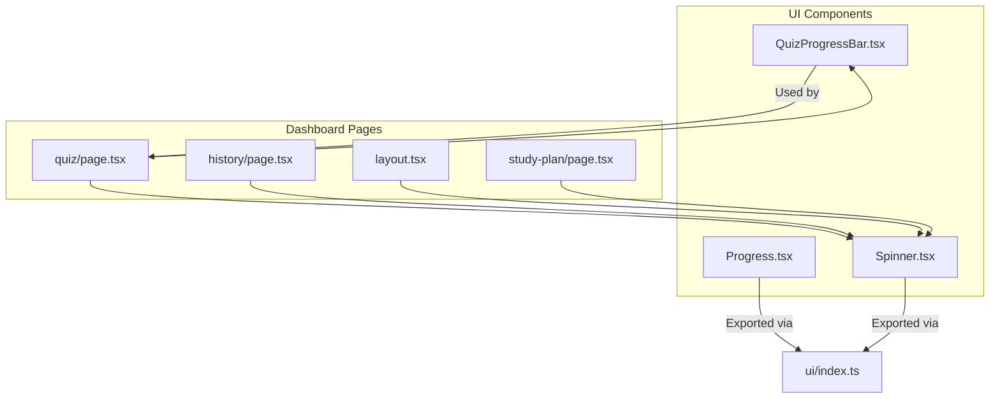
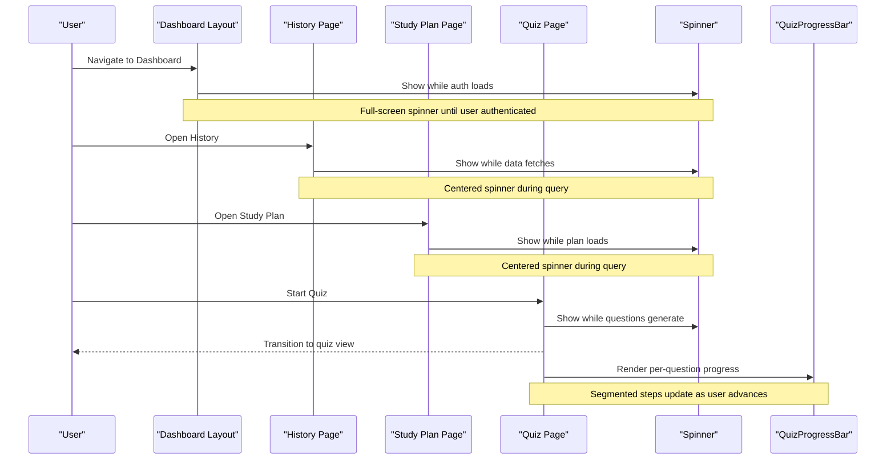
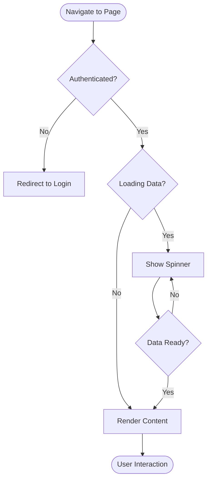
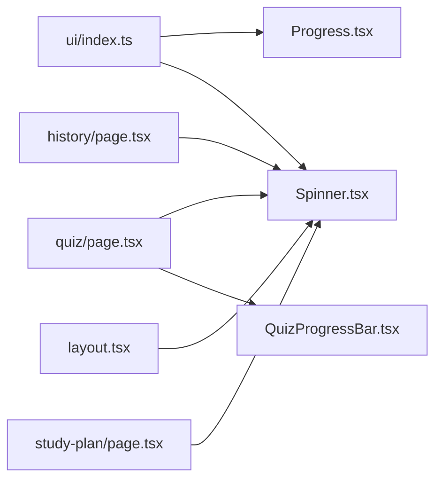

# Progress Indicators

<cite>
**Referenced Files in This Document**
- [Progress.tsx](file://Next-app/src/components/ui/Progress.tsx)
- [Spinner.tsx](file://Next-app/src/components/ui/Spinner.tsx)
- [ProgressBar.tsx](file://Next-app/src/components/quiz/ProgressBar.tsx)
- [index.ts](file://Next-app/src/components/ui/index.ts)
- [page.tsx](file://Next-app/src/app/(dashboard)/quiz/page.tsx)
- [history page.tsx](file://Next-app/src/app/(dashboard)/history/page.tsx)
- [layout.tsx](file://Next-app/src/app/(dashboard)/layout.tsx)
- [study-plan page.tsx](file://Next-app/src/app/(dashboard)/study-plan/page.tsx)
</cite>

## Table of Contents
1. Introduction
2. Project Structure
3. Core Components
4. Architecture Overview
5. Detailed Component Analysis
6. Dependency Analysis
7. Performance Considerations
8. Troubleshooting Guide
9. Conclusion

## Introduction
This document provides comprehensive guidance for progress indicator components in the application: linear progress bars and spinners. It covers props, styling, colors, sizes, indeterminate states, accessibility features (ARIA labels, keyboard navigation, screen reader announcements), usage patterns, performance optimization, and visual consistency across loading states.

## Project Structure
The progress indicators are implemented as reusable UI components and used across dashboard pages to communicate loading and progress states.

**Diagram sources**
- [Progress.tsx:1-51](file://Next-app/src/components/ui/Progress.tsx#L1-L51)
- [Spinner.tsx:1-22](file://Next-app/src/components/ui/Spinner.tsx#L1-L22)
- [ProgressBar.tsx:1-42](file://Next-app/src/components/quiz/ProgressBar.tsx#L1-L42)
- [index.ts:1-11](file://Next-app/src/components/ui/index.ts#L1-L11)
- [page.tsx:1-185](file://Next-app/src/app/(dashboard)/quiz/page.tsx#L1-L185)
- [history page.tsx:1-180](file://Next-app/src/app/(dashboard)/history/page.tsx#L1-L180)
- [layout.tsx:1-62](file://Next-app/src/app/(dashboard)/layout.tsx#L1-L62)
- [study-plan page.tsx:1-164](file://Next-app/src/app/(dashboard)/study-plan/page.tsx#L1-L164)

**Section sources**
- [index.ts:1-11](file://Next-app/src/components/ui/index.ts#L1-L11)
- [page.tsx:1-185](file://Next-app/src/app/(dashboard)/quiz/page.tsx#L1-L185)
- [history page.tsx:1-180](file://Next-app/src/app/(dashboard)/history/page.tsx#L1-L180)
- [layout.tsx:1-62](file://Next-app/src/app/(dashboard)/layout.tsx#L1-L62)
- [study-plan page.tsx:1-164](file://Next-app/src/app/(dashboard)/study-plan/page.tsx#L1-L164)

## Core Components
- Linear Progress Bar (Progress): A percentage-based bar with color variants and optional label.
- Spinner: A size-controlled animated loader using a standard icon.
- Quiz Progress Bar (QuizProgressBar): A segmented step indicator showing current question and answered count.

Key behaviors:
- Progress uses ARIA attributes for assistive technologies.
- Spinner is purely decorative; it does not require ARIA roles.
- QuizProgressBar communicates progress through visible text and visual segments.

**Section sources**
- [Progress.tsx:1-51](file://Next-app/src/components/ui/Progress.tsx#L1-L51)
- [Spinner.tsx:1-22](file://Next-app/src/components/ui/Spinner.tsx#L1-L22)
- [ProgressBar.tsx:1-42](file://Next-app/src/components/quiz/ProgressBar.tsx#L1-L42)

## Architecture Overview
The components are consumed by multiple pages to represent different loading scenarios:
- Global layout loading state during authentication.
- Data fetching loading states on history and study plan pages.
- Quiz flow loading state while generating questions.
- In-quiz progress tracking with a segmented bar.

**Diagram sources**
- [layout.tsx:1-62](file://Next-app/src/app/(dashboard)/layout.tsx#L1-L62)
- [history page.tsx:1-180](file://Next-app/src/app/(dashboard)/history/page.tsx#L1-L180)
- [study-plan page.tsx:1-164](file://Next-app/src/app/(dashboard)/study-plan/page.tsx#L1-L164)
- [page.tsx:1-185](file://Next-app/src/app/(dashboard)/quiz/page.tsx#L1-L185)
- [Spinner.tsx:1-22](file://Next-app/src/components/ui/Spinner.tsx#L1-L22)
- [ProgressBar.tsx:1-42](file://Next-app/src/components/quiz/ProgressBar.tsx#L1-L42)

## Detailed Component Analysis

### Linear Progress Bar (Progress)
Purpose:
- Display deterministic progress (e.g., upload, form completion).
- Provide accessible feedback via ARIA.

Props:
- value: number — Current progress value.
- max?: number — Maximum value (default 100).
- color?: "primary" | "success" | "error" | "warning" | "accent" — Visual theme.
- className?: string — Additional styles.
- showLabel?: boolean — Toggle percentage label below the bar.

Behavior:
- Calculates percentage from value/max and clamps to 100%.
- Applies transition animation for smooth updates.
- Renders ARIA role="progressbar" with aria-valuenow, aria-valuemin, aria-valuemax.

Accessibility:
- Screen readers announce current progress based on ARIA attributes.
- Optional label provides explicit percentage for clarity.

Usage examples:
- Upload progress: bind value to bytes uploaded / total bytes.
- Form wizard: bind value to completed steps / total steps.

Performance:
- Avoid frequent re-renders by debouncing rapid value changes.
- Keep animations short and subtle to prevent jank.

**Section sources**
- [Progress.tsx:1-51](file://Next-app/src/components/ui/Progress.tsx#L1-L51)

### Spinner
Purpose:
- Indicate indeterminate loading when duration is unknown.

Props:
- size?: "sm" | "md" | "lg" — Controls dimensions.
- className?: string — Additional styles.

Behavior:
- Uses an animated spinning icon centered within a container.
- No interactive behavior; purely decorative.

Accessibility:
- Decorative element; no ARIA role required.
- Pair with descriptive text or context so users understand what is loading.

Usage examples:
- Initial app load or authentication check.
- Data fetching in list or detail views.

Performance:
- Lightweight animation; avoid stacking multiple spinners unnecessarily.

**Section sources**
- [Spinner.tsx:1-22](file://Next-app/src/components/ui/Spinner.tsx#L1-L22)

### Quiz Progress Bar (QuizProgressBar)
Purpose:
- Communicate quiz progression and completion status.

Props:
- current: number — Zero-based index of the active question.
- total: number — Total number of questions.
- answers: boolean[] — Indicates which questions have been answered.
- className?: string — Additional styles.

Behavior:
- Displays current question number and answered count.
- Renders a segment per question:
  - Active segment highlighted.
  - Answered segments partially highlighted.
  - Unanswered segments neutral.

Accessibility:
- Visible text conveys progress clearly.
- Ensure surrounding content remains readable for screen readers.

Usage examples:
- Quiz navigation: update current and answers as user proceeds.

Performance:
- Efficient rendering via mapping over total length; keep arrays aligned with total.

**Section sources**
- [ProgressBar.tsx:1-42](file://Next-app/src/components/quiz/ProgressBar.tsx#L1-L42)
- [page.tsx:1-185](file://Next-app/src/app/(dashboard)/quiz/page.tsx#L1-L185)

### Usage Patterns Across Pages
- Authentication guard: Shows a full-page spinner while verifying user session.
- Data fetching: Shows a centered spinner while querying history or study plan.
- Quiz flow: Shows a spinner while generating questions, then switches to segmented progress.

**Diagram sources**
- [layout.tsx:1-62](file://Next-app/src/app/(dashboard)/layout.tsx#L1-L62)
- [history page.tsx:1-180](file://Next-app/src/app/(dashboard)/history/page.tsx#L1-L180)
- [study-plan page.tsx:1-164](file://Next-app/src/app/(dashboard)/study-plan/page.tsx#L1-L164)
- [page.tsx:1-185](file://Next-app/src/app/(dashboard)/quiz/page.tsx#L1-L185)

## Dependency Analysis
- UI components are exported via a central index for consistent imports.
- Pages import Spinner and ProgressBar directly where needed.
- Utility functions support formatting and calculations used by other components.

**Diagram sources**
- [index.ts:1-11](file://Next-app/src/components/ui/index.ts#L1-L11)
- [page.tsx:1-185](file://Next-app/src/app/(dashboard)/quiz/page.tsx#L1-L185)
- [history page.tsx:1-180](file://Next-app/src/app/(dashboard)/history/page.tsx#L1-L180)
- [layout.tsx:1-62](file://Next-app/src/app/(dashboard)/layout.tsx#L1-L62)
- [study-plan page.tsx:1-164](file://Next-app/src/app/(dashboard)/study-plan/page.tsx#L1-L164)
- [ProgressBar.tsx:1-42](file://Next-app/src/components/quiz/ProgressBar.tsx#L1-L42)

**Section sources**
- [index.ts:1-11](file://Next-app/src/components/ui/index.ts#L1-L11)
- [page.tsx:1-185](file://Next-app/src/app/(dashboard)/quiz/page.tsx#L1-L185)
- [history page.tsx:1-180](file://Next-app/src/app/(dashboard)/history/page.tsx#L1-L180)
- [layout.tsx:1-62](file://Next-app/src/app/(dashboard)/layout.tsx#L1-L62)
- [study-plan page.tsx:1-164](file://Next-app/src/app/(dashboard)/study-plan/page.tsx#L1-L164)

## Performance Considerations
- Debounce rapid progress updates to reduce reflows.
- Prefer CSS transitions for smooth animations without heavy JS.
- Avoid nested spinners; use one clear loading indicator per view.
- Keep spinner size appropriate to context (small inline vs large full-screen).
- For long-running tasks, consider skeleton placeholders alongside spinners to improve perceived performance.

[No sources needed since this section provides general guidance]

## Troubleshooting Guide
Common issues and resolutions:
- Progress not updating:
  - Ensure value and max are numbers and value <= max.
  - Verify that parent state updates trigger re-renders.
- Accessibility concerns:
  - Confirm ARIA attributes are present on Progress.
  - Add descriptive text near Spinner to clarify what is loading.
- Visual inconsistency:
  - Use consistent sizes for Spinner across pages.
  - Align colors with design tokens (primary, success, error, warning, accent).
- Quiz progress misalignment:
  - Ensure answers array length matches total; pad with false if necessary.

**Section sources**
- [Progress.tsx:1-51](file://Next-app/src/components/ui/Progress.tsx#L1-L51)
- [Spinner.tsx:1-22](file://Next-app/src/components/ui/Spinner.tsx#L1-L22)
- [ProgressBar.tsx:1-42](file://Next-app/src/components/quiz/ProgressBar.tsx#L1-L42)
- [page.tsx:1-185](file://Next-app/src/app/(dashboard)/quiz/page.tsx#L1-L185)

## Conclusion
Use the linear Progress bar for deterministic progress with accessible ARIA attributes, and the Spinner for indeterminate loading states. The QuizProgressBar offers a clear, segmented view of quiz progress. Maintain consistent sizing, colors, and spacing across pages to ensure a cohesive experience. Follow accessibility guidelines and performance best practices to deliver responsive, inclusive interfaces.

[No sources needed since this section summarizes without analyzing specific files]