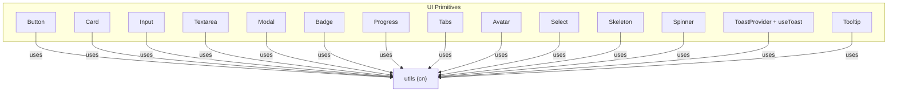
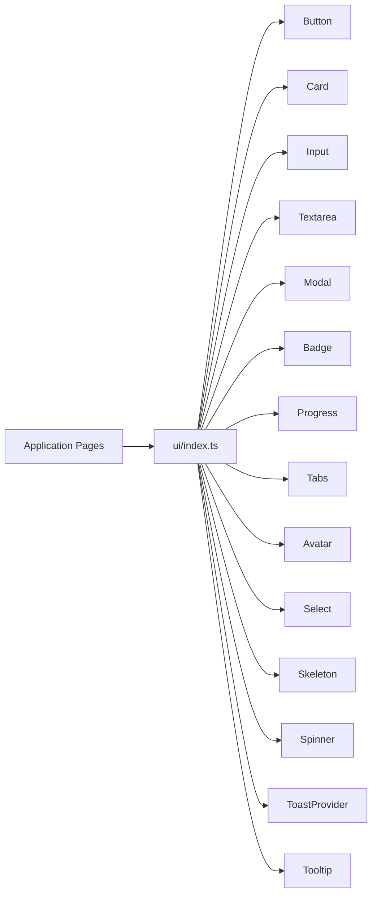
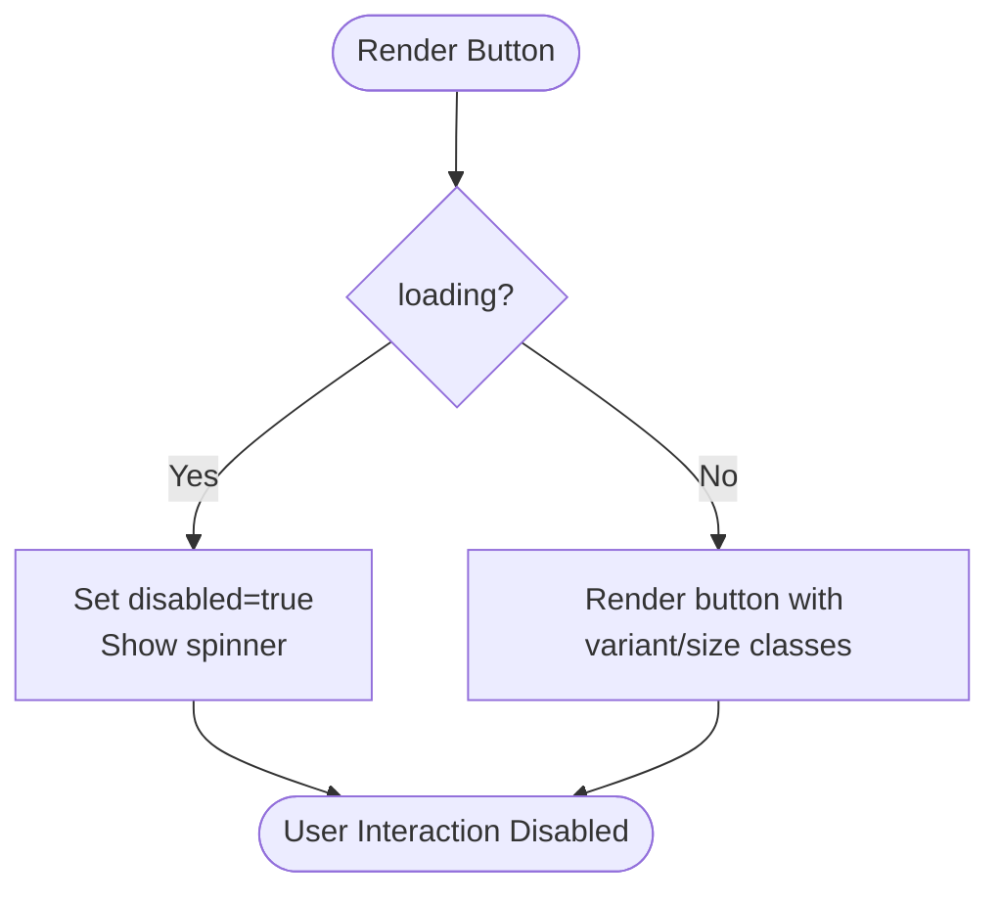
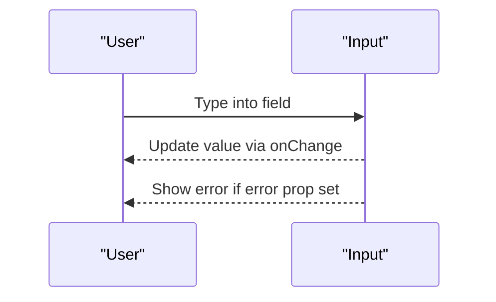
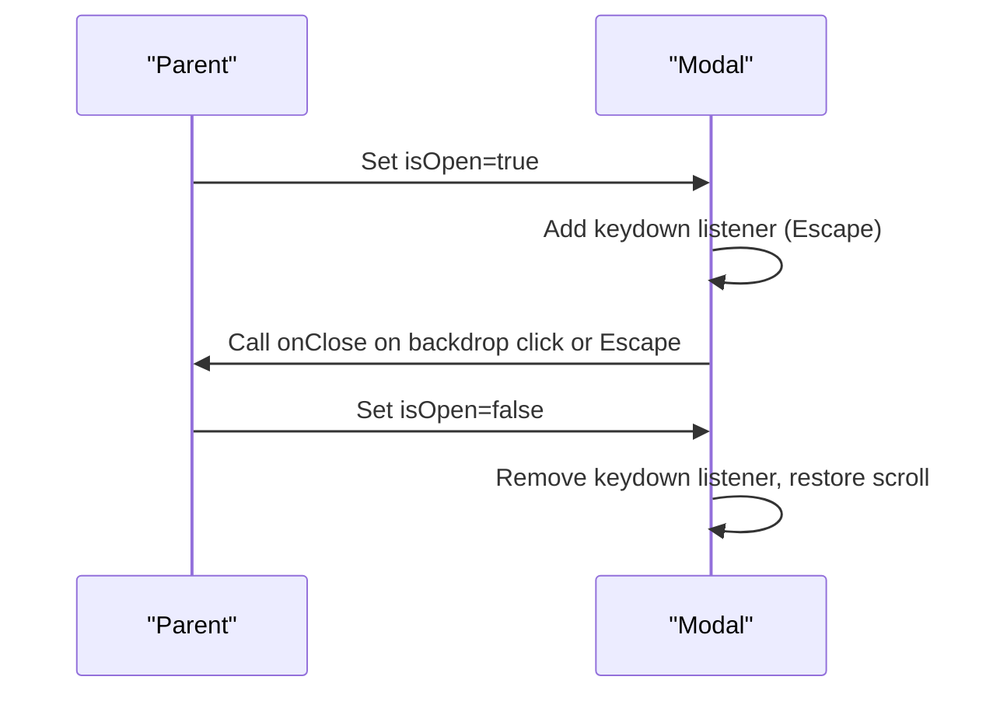
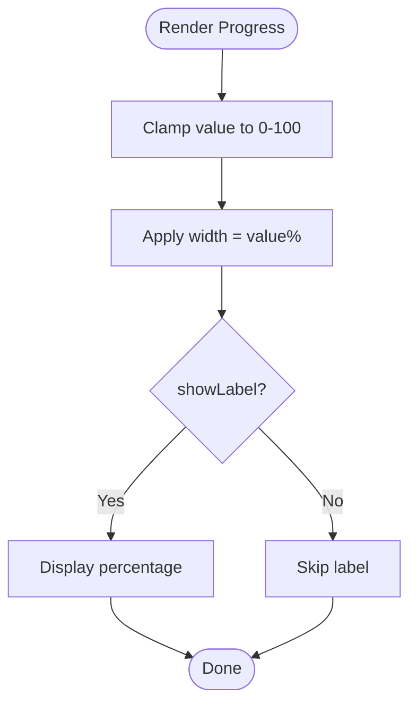
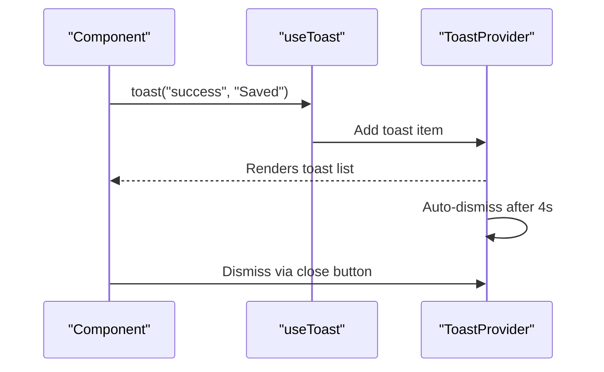
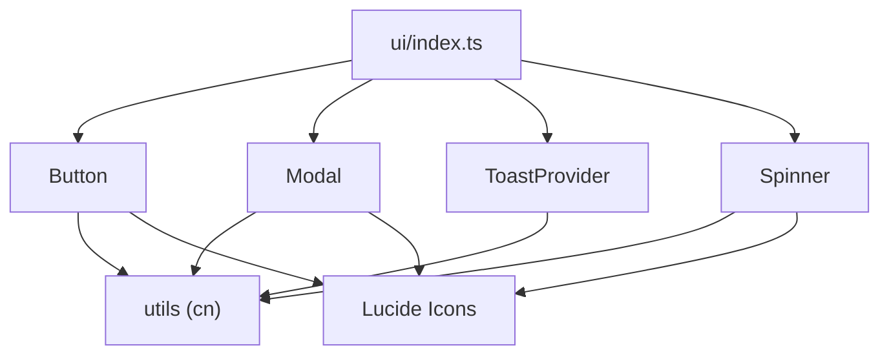

# UI Primitives

<cite>
**Referenced Files in This Document**
- [Button.tsx](file://src/components/ui/Button.tsx)
- [Card.tsx](file://src/components/ui/Card.tsx)
- [Input.tsx](file://src/components/ui/Input.tsx)
- [Textarea.tsx](file://src/components/ui/Textarea.tsx)
- [Modal.tsx](file://src/components/ui/Modal.tsx)
- [Badge.tsx](file://src/components/ui/Badge.tsx)
- [Progress.tsx](file://src/components/ui/Progress.tsx)
- [Tabs.tsx](file://src/components/ui/Tabs.tsx)
- [Avatar.tsx](file://src/components/ui/Avatar.tsx)
- [Select.tsx](file://src/components/ui/Select.tsx)
- [Skeleton.tsx](file://src/components/ui/Skeleton.tsx)
- [Spinner.tsx](file://src/components/ui/Spinner.tsx)
- [Toast.tsx](file://src/components/ui/Toast.tsx)
- [Tooltip.tsx](file://src/components/ui/Tooltip.tsx)
- [index.ts](file://src/components/ui/index.ts)
</cite>

## Table of Contents
1. Introduction
2. Project Structure
3. Core Components
4. Architecture Overview
5. Detailed Component Analysis
6. Dependency Analysis
7. Performance Considerations
8. Troubleshooting Guide
9. Conclusion

## Introduction
This document provides comprehensive documentation for MedAce AI’s core UI primitive components located under src/components/ui. It covers each component’s props, events, styling options, accessibility features, and usage patterns with code example references via section sources. The goal is to help developers integrate these primitives consistently across the application while maintaining a cohesive design system.

## Project Structure
The UI primitives are organized as individual React components under src/components/ui, with a central barrel export file that re-exports all public APIs. Each component encapsulates its own styling using utility classes and supports common customization through props such as variant, size, and className.

**Diagram sources**
- [index.ts:1-15](file://src/components/ui/index.ts#L1-L15)
- [Button.tsx:1-59](file://src/components/ui/Button.tsx#L1-L59)
- [Card.tsx:1-46](file://src/components/ui/Card.tsx#L1-L46)
- [Input.tsx:1-53](file://src/components/ui/Input.tsx#L1-L53)
- [Textarea.tsx:1-44](file://src/components/ui/Textarea.tsx#L1-L44)
- [Modal.tsx:1-83](file://src/components/ui/Modal.tsx#L1-L83)
- [Badge.tsx:1-35](file://src/components/ui/Badge.tsx#L1-L35)
- [Progress.tsx:1-59](file://src/components/ui/Progress.tsx#L1-L59)
- [Tabs.tsx:1-39](file://src/components/ui/Tabs.tsx#L1-L39)
- [Avatar.tsx:1-57](file://src/components/ui/Avatar.tsx#L1-L57)
- [Select.tsx:1-63](file://src/components/ui/Select.tsx#L1-L63)
- [Skeleton.tsx:1-49](file://src/components/ui/Skeleton.tsx#L1-L49)
- [Spinner.tsx:1-25](file://src/components/ui/Spinner.tsx#L1-L25)
- [Toast.tsx:1-89](file://src/components/ui/Toast.tsx#L1-L89)
- [Tooltip.tsx:1-40](file://src/components/ui/Tooltip.tsx#L1-L40)

**Section sources**
- [index.ts:1-15](file://src/components/ui/index.ts#L1-L15)

## Core Components
Below is a concise overview of each primitive, including key props, events, styling options, and accessibility notes. For detailed prop interfaces and behavior, see the corresponding sections below.

- Button: Variants (primary, secondary, ghost, danger), sizes (sm, md, lg), loading state, disabled state, focus ring, and icon support via children.
- Card: Variants (default, elevated, bordered), padding levels (none, sm, md, lg), and full content area via children.
- Input: Label, error message, left icon slot, accessible id generation, focus states, and validation feedback.
- Textarea: Label, error message, accessible id generation, focus states, and validation feedback.
- Modal: Backdrop click-to-close, Escape key handling, body scroll lock, dialog semantics, title bar, and close button.
- Badge: Status variants (default, success, error, warning, info, ai) with consistent pill styling.
- Progress: Value clamping (0–100), variants (primary, success, error, warning), sizes (sm, md, lg), optional percentage label.
- Tabs: Controlled active tab via props, keyboard-friendly buttons, and visual active state.
- Avatar: Image or initials fallback, sizes (sm, md, lg), accessible alt/label.
- Select: Options array, placeholder, label, error messaging, custom dropdown arrow, and accessible id.
- Skeleton: Loading placeholders with variants (text, card, circle) and configurable lines.
- Spinner: Animated loader with sizes (sm, md, lg) and accessible label.
- Toast: Context-based notifications with types (success, error, info), auto-dismiss, and manual dismiss.
- Tooltip: Hover-triggered contextual help with positioning and animation.

**Section sources**
- [Button.tsx:1-59](file://src/components/ui/Button.tsx#L1-L59)
- [Card.tsx:1-46](file://src/components/ui/Card.tsx#L1-L46)
- [Input.tsx:1-53](file://src/components/ui/Input.tsx#L1-L53)
- [Textarea.tsx:1-44](file://src/components/ui/Textarea.tsx#L1-L44)
- [Modal.tsx:1-83](file://src/components/ui/Modal.tsx#L1-L83)
- [Badge.tsx:1-35](file://src/components/ui/Badge.tsx#L1-L35)
- [Progress.tsx:1-59](file://src/components/ui/Progress.tsx#L1-L59)
- [Tabs.tsx:1-39](file://src/components/ui/Tabs.tsx#L1-L39)
- [Avatar.tsx:1-57](file://src/components/ui/Avatar.tsx#L1-L57)
- [Select.tsx:1-63](file://src/components/ui/Select.tsx#L1-L63)
- [Skeleton.tsx:1-49](file://src/components/ui/Skeleton.tsx#L1-L49)
- [Spinner.tsx:1-25](file://src/components/ui/Spinner.tsx#L1-L25)
- [Toast.tsx:1-89](file://src/components/ui/Toast.tsx#L1-L89)
- [Tooltip.tsx:1-40](file://src/components/ui/Tooltip.tsx#L1-L40)

## Architecture Overview
The UI primitives follow a consistent pattern:
- Props-driven configuration (variants, sizes, labels, errors).
- Utility class composition via cn for flexible styling.
- Accessibility built-in (labels, roles, aria attributes, focus management where applicable).
- Client-side interactivity for components that require state (Modal, Tabs, Toast, Tooltip).

**Diagram sources**
- [index.ts:1-15](file://src/components/ui/index.ts#L1-L15)

## Detailed Component Analysis

### Button
- Purpose: Primary interactive element with multiple visual styles and states.
- Props:
  - variant: primary | secondary | ghost | danger
  - size: sm | md | lg
  - loading: boolean (disables interaction and shows spinner)
  - Standard HTML button attributes via inheritance
- Events:
  - All standard button events (onClick, onKeyDown, etc.)
- Styling:
  - Focus ring, transitions, disabled opacity, and cursor pointer
  - Size-specific spacing and typography
  - Variant-specific color schemes
- Accessibility:
  - Disabled state prevents focus and interaction
  - Inherits native button semantics
- Usage patterns:
  - Use primary for main actions, secondary for alternatives, ghost for subtle actions, danger for destructive actions
  - Combine with icons via children when needed

**Diagram sources**
- [Button.tsx:33-53](file://src/components/ui/Button.tsx#L33-L53)

**Section sources**
- [Button.tsx:1-59](file://src/components/ui/Button.tsx#L1-L59)

### Card
- Purpose: Content container with consistent padding and visual variants.
- Props:
  - variant: default | elevated | bordered
  - padding: none | sm | md | lg
  - Standard div attributes via inheritance
- Styling:
  - Rounded corners, border, shadow (elevated), background colors
  - Padding scales with size
- Accessibility:
  - Semantic div; combine with headings inside as needed
- Usage patterns:
  - Wrap related content blocks; choose elevated for emphasis, bordered for subtle separation

**Section sources**
- [Card.tsx:1-46](file://src/components/ui/Card.tsx#L1-L46)

### Input
- Purpose: Single-line text input with label, error, and optional left icon.
- Props:
  - label: string (optional)
  - error: string (optional)
  - leftIcon: ReactNode (optional)
  - Standard input attributes via inheritance
- Events:
  - onChange, onBlur, onFocus, onKeyDown, etc.
- Validation & Error Handling:
  - Displays error message below input
  - Applies error-focused styles when error is present
- Accessibility:
  - Generates stable id from label if not provided
  - Associates label via htmlFor
- Styling:
  - Focus ring, border color changes, left icon spacing
- Usage patterns:
  - Pair with form libraries; show error messages on validation failure

**Diagram sources**
- [Input.tsx:10-47](file://src/components/ui/Input.tsx#L10-L47)

**Section sources**
- [Input.tsx:1-53](file://src/components/ui/Input.tsx#L1-L53)

### Textarea
- Purpose: Multi-line text input with label and error support.
- Props:
  - label: string (optional)
  - error: string (optional)
  - Standard textarea attributes via inheritance
- Events:
  - onChange, onBlur, onFocus, onKeyDown, etc.
- Validation & Error Handling:
  - Displays error message below textarea
  - Applies error-focused styles when error is present
- Accessibility:
  - Generates stable id from label if not provided
  - Associates label via htmlFor
- Styling:
  - Focus ring, border color changes, resizable vertically
- Usage patterns:
  - Suitable for comments, descriptions, long-form inputs

**Section sources**
- [Textarea.tsx:1-44](file://src/components/ui/Textarea.tsx#L1-L44)

### Modal
- Purpose: Accessible overlay dialog with backdrop and keyboard support.
- Props:
  - isOpen: boolean
  - onClose: function
  - title: string (optional)
  - children: ReactNode
  - className: string (optional)
  - maxWidth: string (optional)
- Events:
  - Close via backdrop click or Escape key press
- Focus Management:
  - Locks body scroll when open
  - Uses role="dialog" and aria-modal for semantics
- Animation:
  - Fade-in backdrop and slide-up dialog
- Styling:
  - Centered overlay, rounded card-like dialog, border, shadow
- Usage patterns:
  - Control visibility from parent state; provide clear title and close affordance

**Diagram sources**
- [Modal.tsx:16-79](file://src/components/ui/Modal.tsx#L16-L79)

**Section sources**
- [Modal.tsx:1-83](file://src/components/ui/Modal.tsx#L1-L83)

### Badge
- Purpose: Small status indicators with semantic variants.
- Props:
  - variant: default | success | error | warning | info | ai
  - Standard span attributes via inheritance
- Styling:
  - Pill shape, compact padding, variant-specific colors
- Accessibility:
  - Semantic span; add aria-label when needed for context
- Usage patterns:
  - Display statuses like “Active”, “Error”, “AI” next to items

**Section sources**
- [Badge.tsx:1-35](file://src/components/ui/Badge.tsx#L1-L35)

### Progress
- Purpose: Linear progress indicator for loading or completion states.
- Props:
  - value: number (clamped to 0–100)
  - variant: primary | success | error | warning
  - showLabel: boolean (optional)
  - size: sm | md | lg
  - className: string (optional)
- Events: None
- Styling:
  - Smooth width transition, rounded track, variant colors
- Accessibility:
  - Can be paired with aria-live regions in parent for dynamic updates
- Usage patterns:
  - Indeterminate or determinate progress by animating value

**Diagram sources**
- [Progress.tsx:26-55](file://src/components/ui/Progress.tsx#L26-L55)

**Section sources**
- [Progress.tsx:1-59](file://src/components/ui/Progress.tsx#L1-L59)

### Tabs
- Purpose: Controlled tab navigation for organizing content.
- Props:
  - tabs: Array<{ id: string; label: string }>
  - activeTab: string
  - onTabChange: (id: string) => void
  - className: string (optional)
- Events:
  - Click triggers onTabChange with selected tab id
- Styling:
  - Active tab highlighted with primary color and underline
- Accessibility:
  - Buttons are keyboard-focusable; manage focus in parent if needed
- Usage patterns:
  - Manage activeTab state in parent; render tab panels accordingly

**Section sources**
- [Tabs.tsx:1-39](file://src/components/ui/Tabs.tsx#L1-L39)

### Avatar
- Purpose: User representation with image or initials fallback.
- Props:
  - src: string | null (optional)
  - name: string
  - size: sm | md | lg
  - className: string (optional)
- Events: None
- Styling:
  - Circular shape, border, size-specific dimensions and font sizes
- Accessibility:
  - Uses alt text for images; aria-label for initials fallback
- Usage patterns:
  - Display user profile pictures or initials when no image is available

**Section sources**
- [Avatar.tsx:1-57](file://src/components/ui/Avatar.tsx#L1-L57)

### Select
- Purpose: Dropdown selection with options and validation support.
- Props:
  - label: string (optional)
  - error: string (optional)
  - options: Array<{ value: string; label: string }>
  - placeholder: string (optional)
  - Standard select attributes via inheritance
- Events:
  - onChange, onBlur, onFocus, onKeyDown, etc.
- Validation & Error Handling:
  - Displays error message below select
  - Applies error-focused styles when error is present
- Accessibility:
  - Generates stable id from label if not provided
  - Associates label via htmlFor
- Styling:
  - Custom dropdown arrow via background image, focus ring, border color changes
- Usage patterns:
  - Populate options dynamically; handle selection via onChange

**Section sources**
- [Select.tsx:1-63](file://src/components/ui/Select.tsx#L1-L63)

### Skeleton
- Purpose: Loading placeholders to improve perceived performance.
- Props:
  - variant: text | card | circle
  - lines: number (for text variant)
  - className: string (optional)
- Events: None
- Styling:
  - Pulsing animation, rounded shapes, borders for cards
- Accessibility:
  - Decorative; avoid placing meaningful content here
- Usage patterns:
  - Replace heavy content during initial load or async fetches

**Section sources**
- [Skeleton.tsx:1-49](file://src/components/ui/Skeleton.tsx#L1-L49)

### Spinner
- Purpose: Inline loading indicator.
- Props:
  - size: sm | md | lg
  - className: string (optional)
- Events: None
- Styling:
  - Animated rotation, primary color, size-specific dimensions
- Accessibility:
  - aria-label="Loading" for screen readers
- Usage patterns:
  - Embed within buttons or standalone to indicate ongoing operations

**Section sources**
- [Spinner.tsx:1-25](file://src/components/ui/Spinner.tsx#L1-L25)

### Toast (ToastProvider + useToast)
- Purpose: Global notification system with auto-dismiss and manual dismissal.
- Provider:
  - ToastProvider wraps application to expose toast functionality
- Hook:
  - useToast returns { toast } function to trigger notifications
- Types:
  - success, error, info
- Behavior:
  - Auto-dismiss after 4 seconds
  - Manual dismiss via close button
- Styling:
  - Fixed bottom-right stack, border accents per type, slide-up animation
- Accessibility:
  - Dismiss button has aria-label; consider adding aria-live region for announcements in parent if needed
- Usage patterns:
  - Wrap app with ToastProvider; call toast(type, message) from anywhere

**Diagram sources**
- [Toast.tsx:27-88](file://src/components/ui/Toast.tsx#L27-L88)

**Section sources**
- [Toast.tsx:1-89](file://src/components/ui/Toast.tsx#L1-L89)

### Tooltip
- Purpose: Contextual help shown on hover.
- Props:
  - content: ReactNode
  - children: ReactNode
  - className: string (optional)
- Events:
  - onMouseEnter/onMouseLeave control visibility
- Styling:
  - Positioned above the trigger with a small arrow, fade-in animation
- Accessibility:
  - Ensure children are interactive elements; consider keyboard support in future enhancements
- Usage patterns:
  - Wrap informational icons or links to provide additional context

**Section sources**
- [Tooltip.tsx:1-40](file://src/components/ui/Tooltip.tsx#L1-L40)

## Dependency Analysis
All components rely on a shared utility for class merging (cn) and some use Lucide icons for consistent visuals. The barrel index centralizes exports for clean imports.

**Diagram sources**
- [Button.tsx:3-5](file://src/components/ui/Button.tsx#L3-L5)
- [Modal.tsx:3-5](file://src/components/ui/Modal.tsx#L3-L5)
- [Spinner.tsx:1-3](file://src/components/ui/Spinner.tsx#L1-L3)
- [Toast.tsx:10-11](file://src/components/ui/Toast.tsx#L10-L11)
- [index.ts:1-15](file://src/components/ui/index.ts#L1-L15)

**Section sources**
- [index.ts:1-15](file://src/components/ui/index.ts#L1-L15)
- [Button.tsx:1-59](file://src/components/ui/Button.tsx#L1-L59)
- [Modal.tsx:1-83](file://src/components/ui/Modal.tsx#L1-L83)
- [Spinner.tsx:1-25](file://src/components/ui/Spinner.tsx#L1-L25)
- [Toast.tsx:1-89](file://src/components/ui/Toast.tsx#L1-L89)

## Performance Considerations
- Prefer controlled components for stateful primitives (Modal, Tabs, Select) to minimize re-renders.
- Use skeleton placeholders to reduce layout shifts during data fetching.
- Avoid excessive nested tooltips or modals to prevent rendering overhead.
- Leverage variant and size props instead of custom CSS to keep bundle size minimal.
- Debounce rapid input changes in parent components when using Input/Textarea for expensive operations.

[No sources needed since this section provides general guidance]

## Troubleshooting Guide
- Modal does not close on Escape:
  - Ensure the modal is mounted and isOpen is true; verify event listener registration and cleanup.
  - Check that onClose is correctly bound and called.
- Toast not appearing:
  - Confirm the app is wrapped with ToastProvider; otherwise useToast will throw an error.
  - Verify that toast calls are made within a provider context.
- Input/Textarea error not showing:
  - Ensure error prop is passed as a non-empty string; check conditional rendering logic.
- Select dropdown arrow missing:
  - Verify CSS background URL is valid and not blocked by CSP; ensure appearance is styled appropriately.
- Button disabled unexpectedly:
  - Check if loading or disabled props are true; confirm event handlers do not force disabled state.

**Section sources**
- [Modal.tsx:26-38](file://src/components/ui/Modal.tsx#L26-L38)
- [Toast.tsx:27-31](file://src/components/ui/Toast.tsx#L27-L31)
- [Input.tsx:33-45](file://src/components/ui/Input.tsx#L33-L45)
- [Textarea.tsx:26-36](file://src/components/ui/Textarea.tsx#L26-L36)
- [Select.tsx:33-40](file://src/components/ui/Select.tsx#L33-L40)
- [Button.tsx:41-48](file://src/components/ui/Button.tsx#L41-L48)

## Conclusion
MedAce AI’s UI primitives provide a robust, accessible, and customizable foundation for building consistent interfaces. By leveraging their props, events, and styling options, teams can rapidly assemble screens while maintaining design coherence. Follow the usage patterns and troubleshooting tips to ensure reliable behavior across the application.

[No sources needed since this section summarizes without analyzing specific files]