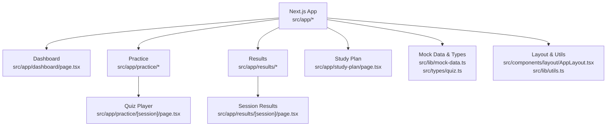
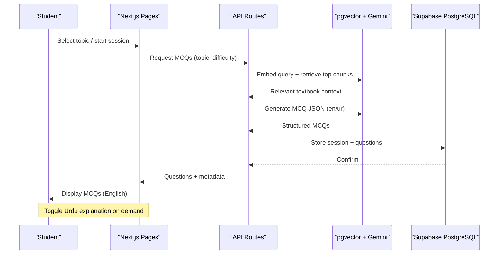
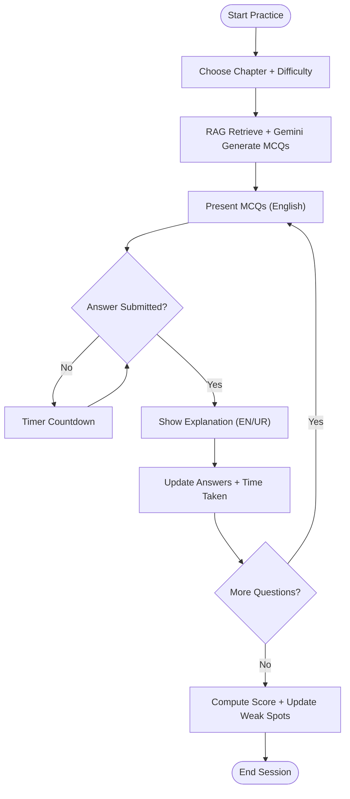
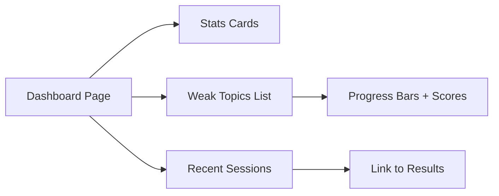
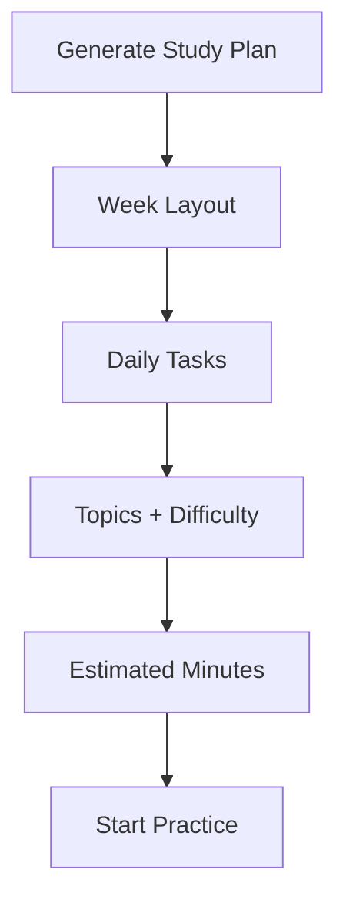
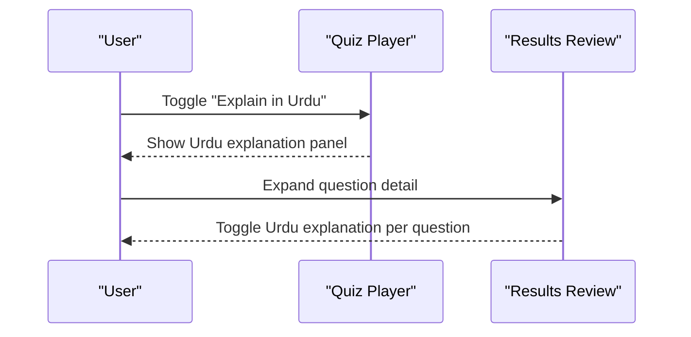
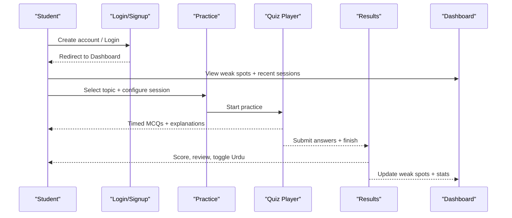
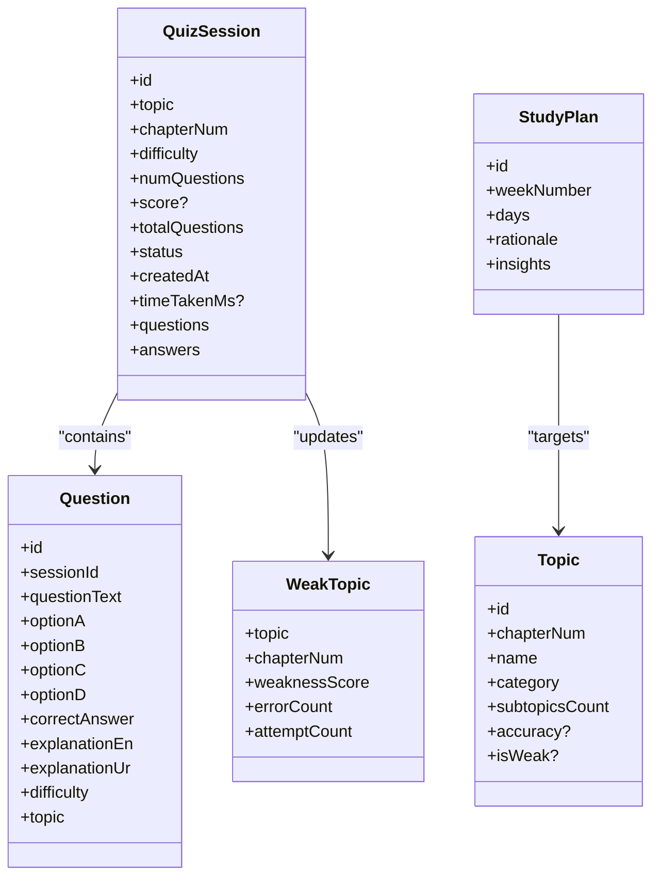
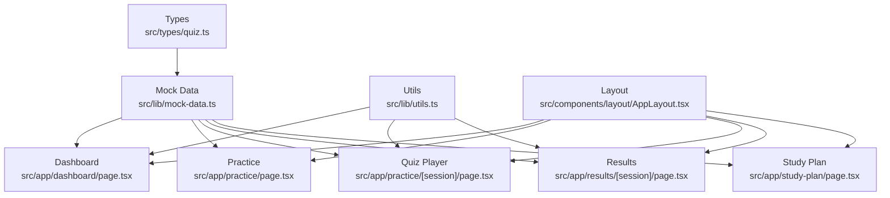

# Core Features

<cite>
**Referenced Files in This Document**
- [README.md](file://README.md)
- [src/app/page.tsx](file://src/app/page.tsx)
- [src/app/dashboard/page.tsx](file://src/app/dashboard/page.tsx)
- [src/app/practice/page.tsx](file://src/app/practice/page.tsx)
- [src/app/practice/[session]/page.tsx](file://src/app/practice/[session]/page.tsx)
- [src/app/results/[session]/page.tsx](file://src/app/results/[session]/page.tsx)
- [src/app/study-plan/page.tsx](file://src/app/study-plan/page.tsx)
- [src/lib/mock-data.ts](file://src/lib/mock-data.ts)
- [src/types/quiz.ts](file://src/types/quiz.ts)
- [src/components/layout/AppLayout.tsx](file://src/components/layout/AppLayout.tsx)
- [src/lib/utils.ts](file://src/lib/utils.ts)
</cite>

## Table of Contents
1. Introduction
2. Project Structure
3. Core Components
4. Architecture Overview
5. Detailed Component Analysis
6. Dependency Analysis
7. Performance Considerations
8. Troubleshooting Guide
9. Conclusion

## Introduction
MedAce AI is an adaptive MDCAT prep coach that mirrors the real exam experience while adding a high-leverage understanding layer: on-demand Urdu explanations for English MCQs. It uses Retrieval-Augmented Generation (RAG) over 15 FSc Biology textbook chapters to generate syllabus-grounded questions, tracks weak spots by topic and concept, and produces personalized weekly study plans based on individual performance patterns. The system supports bilingual comprehension without compromising exam authenticity: interface and questions are in English; explanations can be shown in Urdu when needed.

Key capabilities covered here:
- Adaptive practice engine generating personalized MCQs based on performance and weak spots
- Dashboard analytics tracking progress across 15 biology chapters with detailed metrics
- Study plan generator creating personalized weekly schedules aligned to learning patterns
- Bilingual support providing English MCQs with optional Urdu explanations
- End-to-end user workflow from sign-up through practice sessions to progress tracking
- Adaptive learning algorithms identifying weak spots and adjusting difficulty automatically

**Section sources**
- [README.md:1-22](file://README.md#L1-L22)
- [README.md:79-122](file://README.md#L79-L122)
- [README.md:124-161](file://README.md#L124-L161)

## Project Structure
The application is a Next.js 15 App Router project with client-side pages for auth, dashboard, practice, results, and study plan. Shared UI components, layout wrappers, mock data, and TypeScript types drive the frontend behavior. RAG and backend integration are described in the README and referenced via API routes and services.

**Diagram sources**
- [src/app/dashboard/page.tsx:1-239](file://src/app/dashboard/page.tsx#L1-L239)
- [src/app/practice/page.tsx:1-196](file://src/app/practice/page.tsx#L1-L196)
- [src/app/practice/[session]/page.tsx:1-352](file://src/app/practice/[session]/page.tsx#L1-L352)
- [src/app/results/[session]/page.tsx:1-315](file://src/app/results/[session]/page.tsx#L1-L315)
- [src/app/study-plan/page.tsx:1-192](file://src/app/study-plan/page.tsx#L1-L192)
- [src/lib/mock-data.ts:1-313](file://src/lib/mock-data.ts#L1-L313)
- [src/types/quiz.ts:1-107](file://src/types/quiz.ts#L1-L107)
- [src/components/layout/AppLayout.tsx:1-25](file://src/components/layout/AppLayout.tsx#L1-L25)
- [src/lib/utils.ts:1-34](file://src/lib/utils.ts#L1-L34)

**Section sources**
- [README.md:163-226](file://README.md#L163-L226)
- [src/app/page.tsx:1-418](file://src/app/page.tsx#L1-L418)

## Core Components
- Adaptive Practice Engine: Generates MCQs grounded in textbook content using RAG retrieval and Gemini generation. Difficulty and topics adapt to student performance and weak-spot signals.
- Dashboard Analytics: Displays overall accuracy, session counts, streaks, and chapter-level performance across all 15 chapters. Highlights weak topics and recent sessions.
- Study Plan Generator: Produces a week-by-week schedule tailored to weak areas and strengths, with daily tasks, estimated time, and rationale.
- Bilingual Support: English MCQs with toggleable Urdu explanations during practice and review.
- User Workflow: Sign-up → Topic selection → Timed practice → Review with explanations → Progress updates → Personalized study plan.

**Section sources**
- [README.md:79-122](file://README.md#L79-L122)
- [src/app/dashboard/page.tsx:21-239](file://src/app/dashboard/page.tsx#L21-L239)
- [src/app/practice/page.tsx:18-196](file://src/app/practice/page.tsx#L18-L196)
- [src/app/study-plan/page.tsx:18-192](file://src/app/study-plan/page.tsx#L18-L192)
- [src/lib/mock-data.ts:15-313](file://src/lib/mock-data.ts#L15-L313)

## Architecture Overview
MedAce AI’s architecture combines a Next.js frontend with server-side API routes and Supabase-backed storage. RAG retrieves relevant textbook chunks via pgvector cosine similarity, then Gemini generates structured MCQs with bilingual explanations. The database schema captures users, sessions, questions, answers, weak topics, and study plans.

**Diagram sources**
- [README.md:79-122](file://README.md#L79-L122)
- [README.md:124-161](file://README.md#L124-L161)

**Section sources**
- [README.md:23-78](file://README.md#L23-L78)
- [README.md:124-161](file://README.md#L124-L161)

## Detailed Component Analysis

### Adaptive Practice Engine
- Topic selection and configuration: Users choose a chapter, set difficulty (Easy/Medium/Hard/Mixed), and number of questions. The engine uses RAG to retrieve relevant textbook content and generate MCQs grounded in the MDCAT syllabus.
- Session flow: Timed questions, immediate feedback, and optional Urdu explanations. After completion, scores and answer times update weak-spot signals and inform future practice.
- Adaptivity: Weak-spot tracking drives future question selection and difficulty adjustments. The dashboard highlights “Topics to Focus On” and recent sessions guide next steps.

**Diagram sources**
- [src/app/practice/page.tsx:18-196](file://src/app/practice/page.tsx#L18-L196)
- [src/app/practice/[session]/page.tsx:25-352](file://src/app/practice/[session]/page.tsx#L25-L352)
- [src/lib/mock-data.ts:69-210](file://src/lib/mock-data.ts#L69-L210)

**Section sources**
- [src/app/practice/page.tsx:18-196](file://src/app/practice/page.tsx#L18-L196)
- [src/app/practice/[session]/page.tsx:25-352](file://src/app/practice/[session]/page.tsx#L25-L352)
- [src/lib/mock-data.ts:69-210](file://src/lib/mock-data.ts#L69-L210)

### Dashboard Analytics System
- Metrics: Total questions, accuracy rate, sessions completed, study streak.
- Weak spots: Ranked list of topics with weakness score, error count, and attempt count.
- Recent sessions: Quick links to detailed results with date and score.
- Chapter coverage: Mock data enumerates all 15 chapters with per-chapter accuracy where available.

**Diagram sources**
- [src/app/dashboard/page.tsx:21-239](file://src/app/dashboard/page.tsx#L21-L239)
- [src/lib/mock-data.ts:15-64](file://src/lib/mock-data.ts#L15-L64)

**Section sources**
- [src/app/dashboard/page.tsx:21-239](file://src/app/dashboard/page.tsx#L21-L239)
- [src/lib/mock-data.ts:15-64](file://src/lib/mock-data.ts#L15-L64)

### Study Plan Generator
- Weekly schedule: Days with topics, difficulty, question counts, and estimated minutes.
- Personalization: Rationale and insights explain why certain topics are prioritized based on weak areas and strengths.
- Actions: Today’s sessions are highlighted with quick “Start” buttons linking to practice.

**Diagram sources**
- [src/app/study-plan/page.tsx:18-192](file://src/app/study-plan/page.tsx#L18-L192)
- [src/lib/mock-data.ts:261-281](file://src/lib/mock-data.ts#L261-L281)

**Section sources**
- [src/app/study-plan/page.tsx:18-192](file://src/app/study-plan/page.tsx#L18-L192)
- [src/lib/mock-data.ts:261-281](file://src/lib/mock-data.ts#L261-L281)

### Bilingual Support System
- English-first interface and MCQs to mirror exam conditions.
- On-demand Urdu explanations during practice and review, improving conceptual understanding without altering the exam language.
- Consistent toggles in both quiz player and results review.

**Diagram sources**
- [src/app/practice/[session]/page.tsx:190-213](file://src/app/practice/[session]/page.tsx#L190-L213)
- [src/app/results/[session]/page.tsx:262-284](file://src/app/results/[session]/page.tsx#L262-L284)
- [src/lib/mock-data.ts:69-210](file://src/lib/mock-data.ts#L69-L210)

**Section sources**
- [src/app/practice/[session]/page.tsx:190-213](file://src/app/practice/[session]/page.tsx#L190-L213)
- [src/app/results/[session]/page.tsx:262-284](file://src/app/results/[session]/page.tsx#L262-L284)
- [src/lib/mock-data.ts:69-210](file://src/lib/mock-data.ts#L69-L210)

### User Workflow Examples
- Sign-up and login: Auth flows are provided under app/(auth).
- Practice session: Choose topic, configure difficulty and quantity, take timed MCQs, view explanations, finish session.
- Results and review: See score breakdown, filter by correct/wrong/skipped, expand explanations, toggle Urdu.
- Progress tracking: Dashboard shows weak spots, recent sessions, and quick actions to continue practicing.

**Diagram sources**
- [src/app/dashboard/page.tsx:21-239](file://src/app/dashboard/page.tsx#L21-L239)
- [src/app/practice/page.tsx:18-196](file://src/app/practice/page.tsx#L18-L196)
- [src/app/practice/[session]/page.tsx:25-352](file://src/app/practice/[session]/page.tsx#L25-L352)
- [src/app/results/[session]/page.tsx:28-315](file://src/app/results/[session]/page.tsx#L28-L315)

**Section sources**
- [src/app/dashboard/page.tsx:21-239](file://src/app/dashboard/page.tsx#L21-L239)
- [src/app/practice/page.tsx:18-196](file://src/app/practice/page.tsx#L18-L196)
- [src/app/practice/[session]/page.tsx:25-352](file://src/app/practice/[session]/page.tsx#L25-L352)
- [src/app/results/[session]/page.tsx:28-315](file://src/app/results/[session]/page.tsx#L28-L315)

### Adaptive Learning Algorithms
- Weak-spot identification: Tracks errors and attempts per topic; higher weakness scores indicate need for focused practice.
- Difficulty adjustment: Mixed difficulty recommended; engine adapts future sessions based on performance trends.
- Study plan personalization: Prioritizes weak areas while maintaining strengths; provides rationale and insights.

**Diagram sources**
- [src/types/quiz.ts:5-107](file://src/types/quiz.ts#L5-L107)
- [src/lib/mock-data.ts:15-313](file://src/lib/mock-data.ts#L15-L313)

**Section sources**
- [src/types/quiz.ts:5-107](file://src/types/quiz.ts#L5-L107)
- [src/lib/mock-data.ts:15-313](file://src/lib/mock-data.ts#L15-L313)

## Dependency Analysis
- Frontend pages depend on shared UI components, layout wrapper, and utilities for formatting and styling.
- Mock data supplies topics, questions, sessions, and study plans used across practice, results, dashboard, and study plan pages.
- Types enforce consistent shapes for questions, sessions, and plans, ensuring type safety across components.

**Diagram sources**
- [src/types/quiz.ts:1-107](file://src/types/quiz.ts#L1-L107)
- [src/lib/mock-data.ts:1-313](file://src/lib/mock-data.ts#L1-L313)
- [src/app/dashboard/page.tsx:1-239](file://src/app/dashboard/page.tsx#L1-L239)
- [src/app/practice/page.tsx:1-196](file://src/app/practice/page.tsx#L1-L196)
- [src/app/practice/[session]/page.tsx:1-352](file://src/app/practice/[session]/page.tsx#L1-L352)
- [src/app/results/[session]/page.tsx:1-315](file://src/app/results/[session]/page.tsx#L1-L315)
- [src/app/study-plan/page.tsx:1-192](file://src/app/study-plan/page.tsx#L1-L192)
- [src/components/layout/AppLayout.tsx:1-25](file://src/components/layout/AppLayout.tsx#L1-L25)
- [src/lib/utils.ts:1-34](file://src/lib/utils.ts#L1-L34)

**Section sources**
- [src/types/quiz.ts:1-107](file://src/types/quiz.ts#L1-L107)
- [src/lib/mock-data.ts:1-313](file://src/lib/mock-data.ts#L1-L313)
- [src/components/layout/AppLayout.tsx:1-25](file://src/components/layout/AppLayout.tsx#L1-L25)
- [src/lib/utils.ts:1-34](file://src/lib/utils.ts#L1-L34)

## Performance Considerations
- RAG retrieval efficiency: Cosine similarity over pgvector returns top relevant chunks quickly; ensure embeddings are indexed and chunk sizes are optimized for relevance.
- Gemini generation latency: Use concise prompts and structured outputs to reduce response time; batch requests where possible.
- Frontend rendering: Minimize re-renders in quiz player by memoizing handlers and avoiding unnecessary state updates; leverage client-side timers efficiently.
- Database writes: Batch answer submissions and weak-spot updates to reduce write overhead; use optimistic UI updates for better perceived performance.

[No sources needed since this section provides general guidance]

## Troubleshooting Guide
- Missing or incorrect environment variables: Ensure Supabase URL, keys, database URL, and Gemini API key are configured before running migrations and starting the dev server.
- RAG index not built: Run cleaning, chunking, embedding, and upload scripts to populate pgvector with textbook chunks.
- Type mismatches: Validate inputs/outputs with Zod schemas and Drizzle types to prevent runtime errors.
- Navigation issues: Verify route paths for practice sessions and results; confirm router usage in quiz player transitions.

**Section sources**
- [README.md:228-244](file://README.md#L228-L244)
- [README.md:292-314](file://README.md#L292-L314)
- [src/app/practice/[session]/page.tsx:76-82](file://src/app/practice/[session]/page.tsx#L76-L82)

## Conclusion
MedAce AI delivers an authentic, adaptive MDCAT preparation experience grounded in real textbook content. Its RAG-powered engine generates syllabus-aligned MCQs, tracks weak spots, and tailors study plans to individual learning patterns. The bilingual support enhances comprehension without compromising exam readiness. Together, these features create a cohesive loop: practice, review, learn, and improve—driven by data and powered by AI.

[No sources needed since this section summarizes without analyzing specific files]