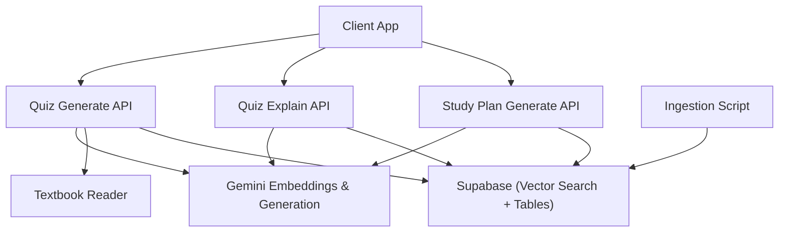
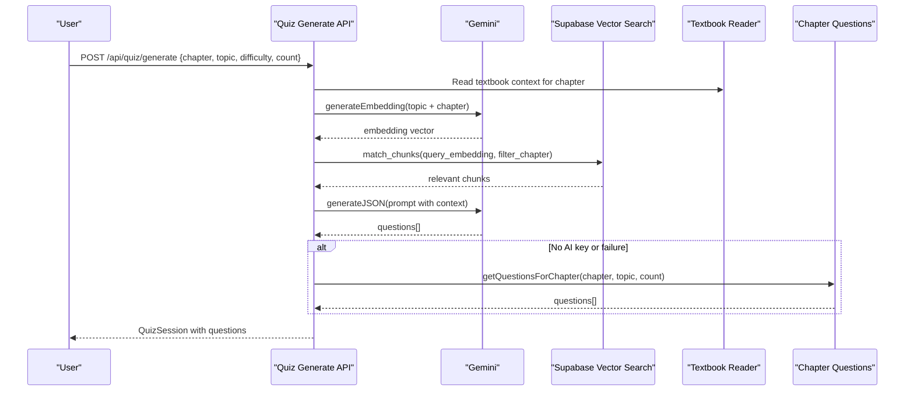
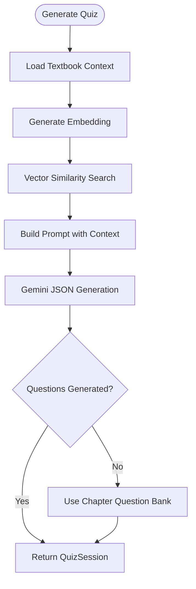
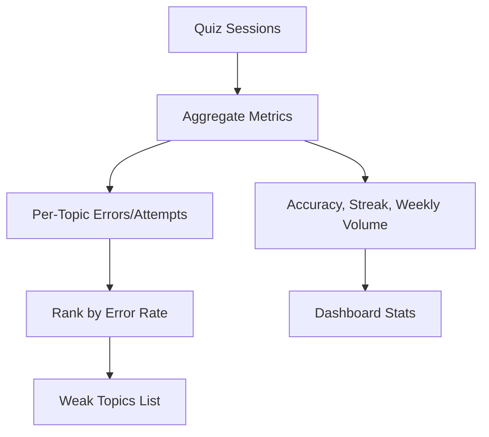
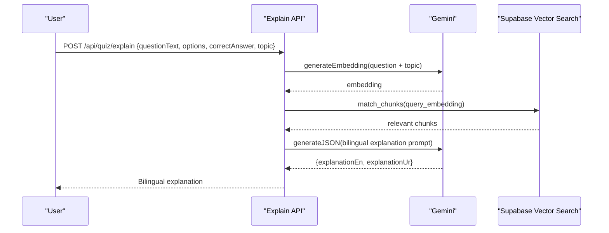
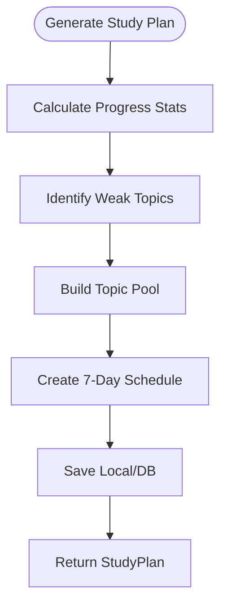
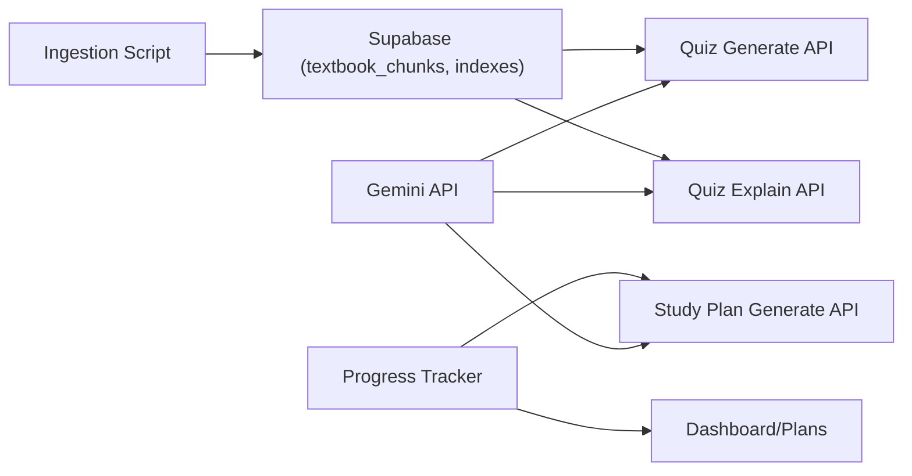

# Core Features

<cite>
**Referenced Files in This Document**
- [route.ts](file://src/app/api/quiz/generate/route.ts)
- [route.ts](file://src/app/api/quiz/explain/route.ts)
- [route.ts](file://src/app/api/study-plan/generate/route.ts)
- [gemini.ts](file://src/lib/ai/gemini.ts)
- [textbook-reader.ts](file://src/lib/textbook-reader.ts)
- [chapter-questions.ts](file://src/lib/chapter-questions.ts)
- [progress-tracker.ts](file://src/lib/progress-tracker.ts)
- [study-plan-generator.ts](file://src/lib/study-plan-generator.ts)
- [schema.sql](file://supabase/schema.sql)
- [ingest-textbooks.ts](file://scripts/ingest-textbooks.ts)
- [quiz.ts](file://src/types/quiz.ts)
</cite>

## Table of Contents
1. Introduction
2. Project Structure
3. Core Components
4. Architecture Overview
5. Detailed Component Analysis
6. Dependency Analysis
7. Performance Considerations
8. Troubleshooting Guide
9. Conclusion

## Introduction
MedAce-AI is an adaptive MDCAT preparation platform that personalizes learning through RAG-powered quiz generation, weak-spot tracking, bilingual explanations, and a study plan generator. Educators and administrators can understand how the system creates targeted practice and schedules based on real performance data. Developers can extend features by following the documented flows for vector similarity search, SLO-based chunking, and adaptive difficulty adjustment.

## Project Structure
The platform exposes Next.js API routes for quiz generation, explanation, and study planning. AI capabilities are provided via Gemini embeddings and JSON-mode generation. Textbook content is ingested into Supabase as vectorized chunks with HNSW indexing for fast similarity search. A local fallback reads chapter text files directly when needed. Progress analytics compute weak topics and drive personalized scheduling.

**Diagram sources**
- [route.ts:10-196](file://src/app/api/quiz/generate/route.ts#L10-L196)
- [route.ts:6-79](file://src/app/api/quiz/explain/route.ts#L6-L79)
- [route.ts:8-123](file://src/app/api/study-plan/generate/route.ts#L8-L123)
- [gemini.ts:29-59](file://src/lib/ai/gemini.ts#L29-L59)
- [textbook-reader.ts:9-45](file://src/lib/textbook-reader.ts#L9-L45)
- [schema.sql:26-44](file://supabase/schema.sql#L26-L44)
- [schema.sql:116-150](file://supabase/schema.sql#L116-L150)
- [ingest-textbooks.ts:97-183](file://scripts/ingest-textbooks.ts#L97-L183)

**Section sources**
- [route.ts:10-196](file://src/app/api/quiz/generate/route.ts#L10-L196)
- [route.ts:6-79](file://src/app/api/quiz/explain/route.ts#L6-L79)
- [route.ts:8-123](file://src/app/api/study-plan/generate/route.ts#L8-L123)
- [gemini.ts:1-61](file://src/lib/ai/gemini.ts#L1-L61)
- [textbook-reader.ts:1-46](file://src/lib/textbook-reader.ts#L1-L46)
- [schema.sql:1-250](file://supabase/schema.sql#L1-L250)
- [ingest-textbooks.ts:1-189](file://scripts/ingest-textbooks.ts#L1-L189)

## Core Components
- RAG-powered quiz generation: Builds questions from textbook context using vector similarity search and Gemini JSON generation, with a robust fallback to curated chapter questions.
- Adaptive weak-spot tracking: Aggregates session history to identify low-accuracy topics and ranks them by error rate.
- Bilingual support: Every question includes English and Urdu explanations; explanations can be regenerated on demand using RAG context.
- Study plan generator: Produces a weekly schedule prioritizing weak topics while maintaining core coverage, persisted locally and optionally in the database.

Practical outcomes:
- Students receive questions aligned to their syllabus chapters and current weak areas.
- Explanations in both languages improve conceptual clarity and retention.
- Weekly plans adapt to performance, focusing time where it matters most.

**Section sources**
- [route.ts:29-135](file://src/app/api/quiz/generate/route.ts#L29-L135)
- [progress-tracker.ts:37-191](file://src/lib/progress-tracker.ts#L37-L191)
- [route.ts:20-70](file://src/app/api/quiz/explain/route.ts#L20-L70)
- [study-plan-generator.ts:26-101](file://src/lib/study-plan-generator.ts#L26-L101)

## Architecture Overview
The system combines retrieval-augmented generation with performance analytics to deliver adaptive learning.

**Diagram sources**
- [route.ts:10-196](file://src/app/api/quiz/generate/route.ts#L10-L196)
- [gemini.ts:29-59](file://src/lib/ai/gemini.ts#L29-L59)
- [schema.sql:116-150](file://supabase/schema.sql#L116-L150)
- [textbook-reader.ts:9-45](file://src/lib/textbook-reader.ts#L9-L45)
- [chapter-questions.ts:1-800](file://src/lib/chapter-questions.ts#L1-L800)

## Detailed Component Analysis

### RAG-Powered Quiz Generation
Conceptual overview:
- The system retrieves high-yield textbook content via vector similarity search and enriches prompts for Gemini to generate unique, syllabus-aligned MCQs with bilingual explanations. If the AI service is unavailable, it falls back to a curated question bank.

Technical implementation:
- Embeddings are generated for the topic and chapter, then used to query Supabase’s vector index for relevant chunks.
- A prompt instructs Gemini to return structured JSON with options, correct answers, and explanations in English and Urdu.
- On failure or missing API key, the system uses chapter-specific questions from the built-in bank.

Adaptive difficulty adjustment:
- Difficulty is enforced at generation time; mixed mode alternates between Easy and Medium to balance challenge and confidence building.

Educator/administrator example:
- For a student struggling in Nervous System, the system generates focused questions on action potentials and neurotransmitters, with clear Urdu explanations to reinforce understanding.

Developer extension points:
- Adjust match_threshold and match_count in vector search to tune recall vs precision.
- Extend prompt templates to align with new SLOs or add more nuanced difficulty tiers.

**Diagram sources**
- [route.ts:29-135](file://src/app/api/quiz/generate/route.ts#L29-L135)
- [gemini.ts:29-59](file://src/lib/ai/gemini.ts#L29-L59)
- [schema.sql:116-150](file://supabase/schema.sql#L116-L150)
- [chapter-questions.ts:1-800](file://src/lib/chapter-questions.ts#L1-L800)

**Section sources**
- [route.ts:10-196](file://src/app/api/quiz/generate/route.ts#L10-L196)
- [gemini.ts:1-61](file://src/lib/ai/gemini.ts#L1-L61)
- [schema.sql:26-44](file://supabase/schema.sql#L26-L44)
- [chapter-questions.ts:1-800](file://src/lib/chapter-questions.ts#L1-L800)

### Adaptive Weak-Spot Tracking
Conceptual overview:
- Tracks quiz sessions and computes per-topic accuracy and error rates to identify weak areas. These insights drive personalized study plans and targeted practice.

Technical implementation:
- Session history is aggregated to calculate total questions, weekly volume, accuracy rate, streaks, and per-topic metrics.
- Weak topics are ranked by error rate; best and worst topics are derived from chapter performance.

Educator/administrator example:
- If a student scores low on Urinary System, the dashboard highlights this area and suggests focused review and practice.

Developer extension points:
- Integrate server-side session persistence to replace localStorage for multi-device sync.
- Add confidence intervals or trend detection to surface emerging weaknesses earlier.

**Diagram sources**
- [progress-tracker.ts:37-191](file://src/lib/progress-tracker.ts#L37-L191)

**Section sources**
- [progress-tracker.ts:1-192](file://src/lib/progress-tracker.ts#L1-L192)

### Multilingual Support (English Questions, Urdu Explanations)
Conceptual overview:
- Every question includes bilingual explanations to aid comprehension across language preferences. On-demand explanations can be regenerated using RAG context for deeper understanding.

Technical implementation:
- Generated questions include explanationEn and explanationUr fields.
- The explain endpoint builds a prompt with question context and returns bilingual explanations via Gemini JSON.

Educator/administrator example:
- Students can toggle between English and Urdu explanations during review, improving retention and reducing language barriers.

Developer extension points:
- Add localization toggles in UI and persist user preference.
- Expand translation quality by including domain-specific terminology in prompts.

**Diagram sources**
- [route.ts:6-79](file://src/app/api/quiz/explain/route.ts#L6-L79)
- [gemini.ts:29-59](file://src/lib/ai/gemini.ts#L29-L59)
- [schema.sql:116-150](file://supabase/schema.sql#L116-L150)

**Section sources**
- [route.ts:6-79](file://src/app/api/quiz/explain/route.ts#L6-L79)
- [quiz.ts:15-28](file://src/types/quiz.ts#L15-L28)

### Study Plan Generator
Conceptual overview:
- Creates a personalized weekly schedule that emphasizes weak topics while maintaining coverage of core chapters. Includes rationale and actionable insights.

Technical implementation:
- Uses progress stats to identify weak topics; if insufficient data, falls back to default core topics.
- Generates day-by-day entries with topics, estimated minutes, difficulty, and question counts. Persists plan locally and optionally in the database.

Educator/administrator example:
- A student with weak areas in Nervous System and Pharmacological Drugs receives a plan that allocates more time to these topics each week.

Developer extension points:
- Integrate calendar sync and reminders.
- Allow educators to set constraints (e.g., max daily hours) and adjust pacing algorithms.

**Diagram sources**
- [study-plan-generator.ts:26-101](file://src/lib/study-plan-generator.ts#L26-L101)
- [progress-tracker.ts:37-191](file://src/lib/progress-tracker.ts#L37-L191)
- [route.ts:8-123](file://src/app/api/study-plan/generate/route.ts#L8-L123)

**Section sources**
- [study-plan-generator.ts:1-102](file://src/lib/study-plan-generator.ts#L1-L102)
- [route.ts:8-123](file://src/app/api/study-plan/generate/route.ts#L8-L123)

## Dependency Analysis
Key dependencies and relationships:
- API routes depend on Gemini for embeddings and JSON generation.
- Vector similarity search relies on Supabase’s HNSW index and match_chunks function.
- Textbook ingestion pipeline prepares chunks and embeddings for retrieval.
- Progress tracker consumes session history to compute weak topics and stats.
- Study plan generator uses progress stats and persists outputs.

**Diagram sources**
- [gemini.ts:1-61](file://src/lib/ai/gemini.ts#L1-L61)
- [schema.sql:26-44](file://supabase/schema.sql#L26-L44)
- [schema.sql:116-150](file://supabase/schema.sql#L116-L150)
- [ingest-textbooks.ts:97-183](file://scripts/ingest-textbooks.ts#L97-L183)
- [progress-tracker.ts:37-191](file://src/lib/progress-tracker.ts#L37-L191)
- [route.ts:10-196](file://src/app/api/quiz/generate/route.ts#L10-L196)
- [route.ts:6-79](file://src/app/api/quiz/explain/route.ts#L6-L79)
- [route.ts:8-123](file://src/app/api/study-plan/generate/route.ts#L8-L123)

**Section sources**
- [schema.sql:1-250](file://supabase/schema.sql#L1-L250)
- [ingest-textbooks.ts:1-189](file://scripts/ingest-textbooks.ts#L1-L189)
- [progress-tracker.ts:1-192](file://src/lib/progress-tracker.ts#L1-L192)
- [route.ts:10-196](file://src/app/api/quiz/generate/route.ts#L10-L196)
- [route.ts:6-79](file://src/app/api/quiz/explain/route.ts#L6-L79)
- [route.ts:8-123](file://src/app/api/study-plan/generate/route.ts#L8-L123)

## Performance Considerations
- Vector search tuning: Adjust match_threshold and match_count to balance relevance and latency.
- Chunk size and overlap: Larger chunks reduce retrieval calls but may increase token usage; overlap improves continuity.
- Rate limiting: Ingestion script includes retries and delays to respect API limits.
- Fallback strategy: Chapter question bank ensures availability even without AI keys.
- Caching: Consider caching frequent embeddings or popular contexts to reduce repeated calls.

[No sources needed since this section provides general guidance]

## Troubleshooting Guide
Common issues and resolutions:
- Missing Gemini API key: Ensure environment variable is configured; otherwise, the system falls back to chapter questions.
- Vector search failures: Verify Supabase extensions and indexes; check match_chunks function and permissions.
- Textbook ingestion errors: Confirm directory structure and file naming; handle rate limits and retries.
- Local storage limits: Study plans and quiz history use localStorage; consider server-side persistence for larger datasets.

Operational checks:
- Validate schema migrations and RLS policies for read/write access.
- Monitor error logs in API routes for detailed messages.

**Section sources**
- [gemini.ts:6-8](file://src/lib/ai/gemini.ts#L6-L8)
- [schema.sql:5-8](file://supabase/schema.sql#L5-L8)
- [schema.sql:116-150](file://supabase/schema.sql#L116-L150)
- [ingest-textbooks.ts:135-165](file://scripts/ingest-textbooks.ts#L135-L165)
- [route.ts:188-193](file://src/app/api/quiz/generate/route.ts#L188-L193)
- [route.ts:71-76](file://src/app/api/quiz/explain/route.ts#L71-L76)
- [route.ts:115-120](file://src/app/api/study-plan/generate/route.ts#L115-L120)

## Conclusion
MedAce-AI’s core features combine RAG-powered content retrieval, adaptive analytics, and bilingual explanations to deliver a highly personalized MDCAT preparation experience. Educators gain visibility into student weaknesses and can tailor instruction, while developers have clear extension points to enhance retrieval, generation, and scheduling logic. The result is improved learning efficiency and measurable outcomes through targeted practice and adaptive difficulty.

[No sources needed since this section summarizes without analyzing specific files]