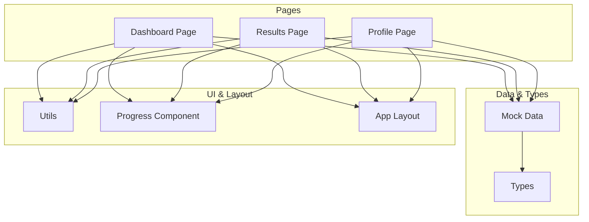
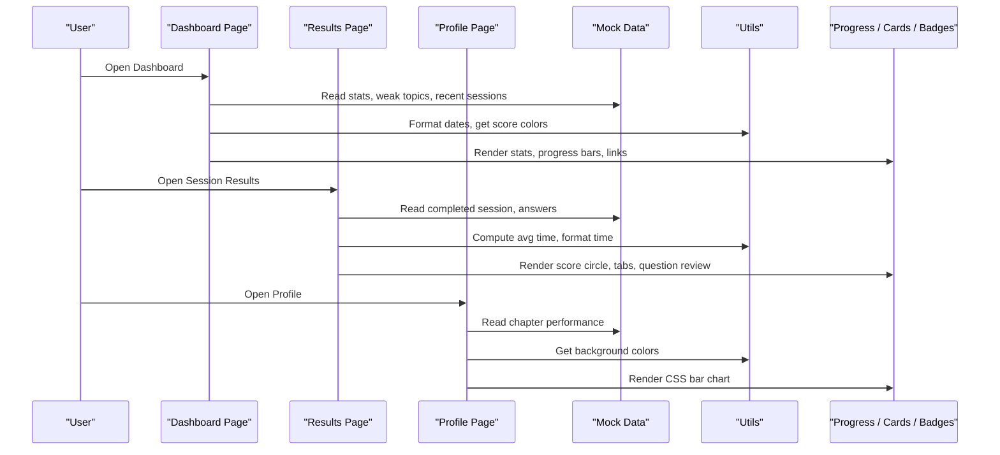
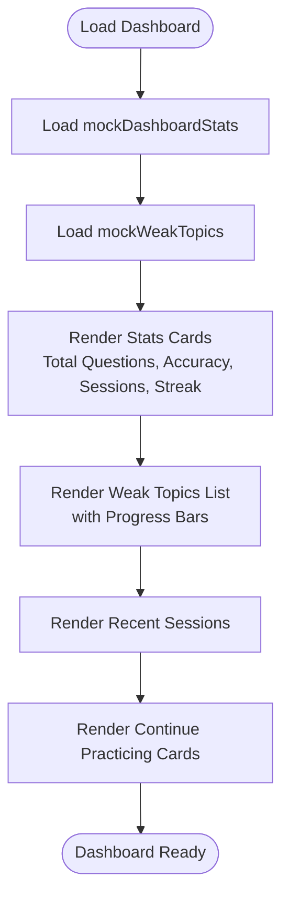
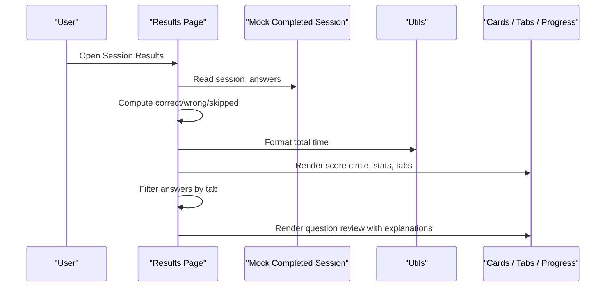
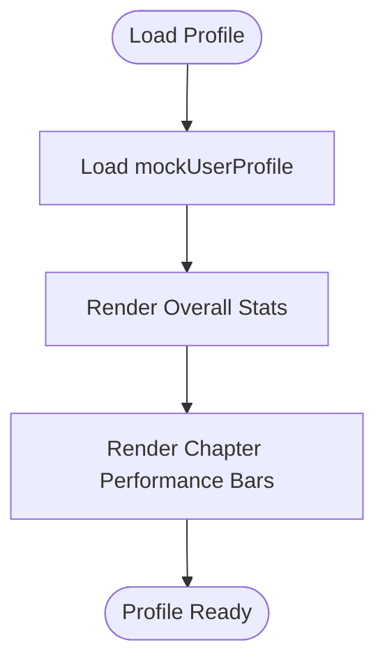
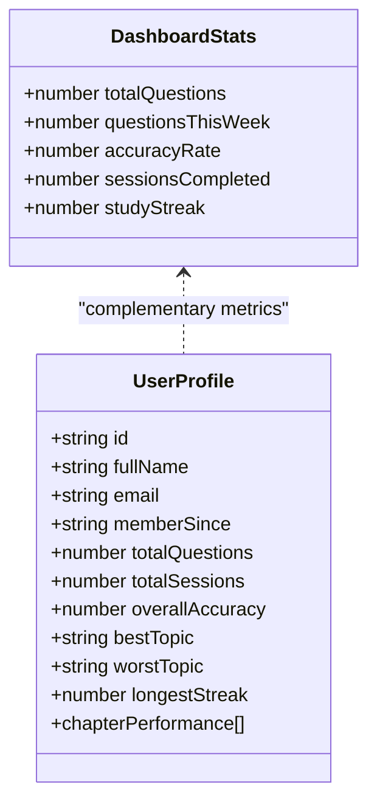
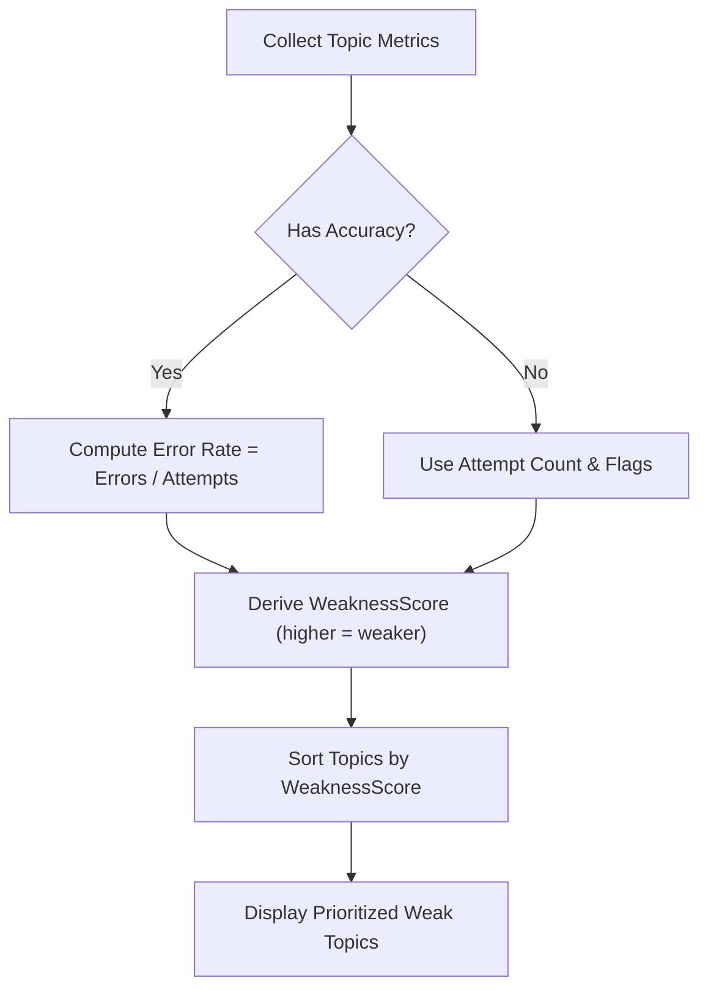
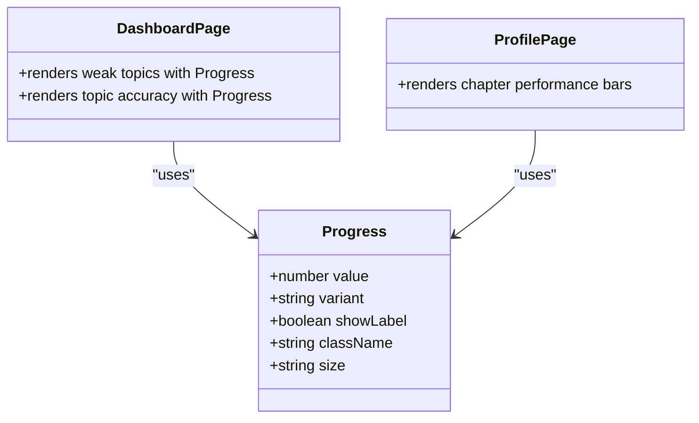
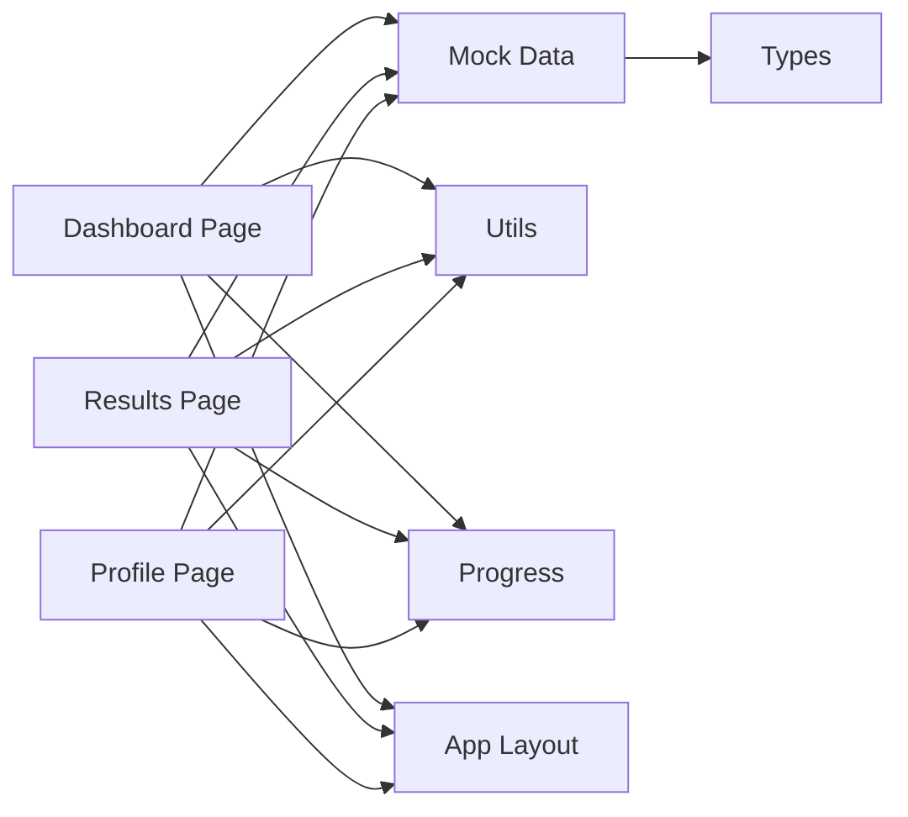

# Dashboard & Analytics

<cite>
**Referenced Files in This Document**
- [dashboard/page.tsx](file://src/app/dashboard/page.tsx)
- [results/[session]/page.tsx](file://src/app/results/[session]/page.tsx)
- [profile/page.tsx](file://src/app/profile/page.tsx)
- [mock-data.ts](file://src/lib/mock-data.ts)
- [quiz.ts](file://src/types/quiz.ts)
- [utils.ts](file://src/lib/utils.ts)
- [Progress.tsx](file://src/components/ui/Progress.tsx)
- [AppLayout.tsx](file://src/components/layout/AppLayout.tsx)
</cite>

## Table of Contents
1. Introduction
2. Project Structure
3. Core Components
4. Architecture Overview
5. Detailed Component Analysis
6. Dependency Analysis
7. Performance Considerations
8. Troubleshooting Guide
9. Conclusion

## Introduction
This document explains the dashboard and analytics system for MedAce AI, focusing on how performance metrics are tracked across all 15 biology chapters, including accuracy percentages, time analysis, and study streak tracking. It also documents the weak spot identification approach used to pinpoint areas requiring improvement, progress visualization components (charts, graphs, and indicators), and the study streak system that encourages consistent learning. Finally, it covers real-time analytics updates, data aggregation methods, performance optimization techniques, responsive design considerations, and accessibility features present in the current implementation.

## Project Structure
The dashboard and analytics functionality is implemented as a set of Next.js pages and reusable UI components:
- Dashboard page aggregates high-level stats, recent sessions, and topics to focus on.
- Results page provides per-session analytics with question-level review and time analysis.
- Profile page visualizes chapter-wise performance using CSS-based bar charts.
- Mock data defines the 15 biology chapters, weak topics, session history, and user profile.
- Shared utilities provide formatting helpers and color logic.
- A shared Progress component renders progress bars with variants and sizes.
- AppLayout wraps pages with consistent layout and navigation.

**Diagram sources**
- [dashboard/page.tsx:1-239](file://src/app/dashboard/page.tsx#L1-L239)
- [results/[session]/page.tsx:1-315](file://src/app/results/[session]/page.tsx#L1-L315)
- [profile/page.tsx:1-224](file://src/app/profile/page.tsx#L1-L224)
- [mock-data.ts:1-313](file://src/lib/mock-data.ts#L1-L313)
- [quiz.ts:1-107](file://src/types/quiz.ts#L1-L107)
- [utils.ts:1-34](file://src/lib/utils.ts#L1-L34)
- [Progress.tsx:1-59](file://src/components/ui/Progress.tsx#L1-L59)
- [AppLayout.tsx:1-25](file://src/components/layout/AppLayout.tsx#L1-L25)

**Section sources**
- [dashboard/page.tsx:1-239](file://src/app/dashboard/page.tsx#L1-L239)
- [results/[session]/page.tsx:1-315](file://src/app/results/[session]/page.tsx#L1-L315)
- [profile/page.tsx:1-224](file://src/app/profile/page.tsx#L1-L224)
- [mock-data.ts:1-313](file://src/lib/mock-data.ts#L1-L313)
- [quiz.ts:1-107](file://src/types/quiz.ts#L1-L107)
- [utils.ts:1-34](file://src/lib/utils.ts#L1-L34)
- [Progress.tsx:1-59](file://src/components/ui/Progress.tsx#L1-L59)
- [AppLayout.tsx:1-25](file://src/components/layout/AppLayout.tsx#L1-L25)

## Core Components
- Dashboard Page: Displays overall stats (total questions, accuracy rate, sessions completed, study streak), recent sessions, and “Topics to Focus On” derived from weak topic data. It also shows quick-start cards for continuing practice.
- Results Page: Shows per-session score, correct/wrong/skipped counts, average time per question, and an expandable question review with explanations and optional Urdu explanations. It also indicates weak spot updates after a session.
- Profile Page: Presents overall statistics and a chapter-wise performance chart using CSS bars, along with settings and account management.
- Mock Data: Defines 15 biology chapters with accuracy and weakness flags, weak topics list, recent sessions, quiz session state, and user profile including chapter performance arrays.
- Utilities: Provide date/time formatting and score-based color selection.
- Progress Component: Renders accessible progress bars with variants and sizes, clamping values to 0–100.
- App Layout: Provides consistent application shell with responsive container and sidebar.

**Section sources**
- [dashboard/page.tsx:21-239](file://src/app/dashboard/page.tsx#L21-L239)
- [results/[session]/page.tsx:28-315](file://src/app/results/[session]/page.tsx#L28-L315)
- [profile/page.tsx:18-224](file://src/app/profile/page.tsx#L18-L224)
- [mock-data.ts:15-313](file://src/lib/mock-data.ts#L15-L313)
- [utils.ts:8-33](file://src/lib/utils.ts#L8-L33)
- [Progress.tsx:26-56](file://src/components/ui/Progress.tsx#L26-L56)
- [AppLayout.tsx:10-24](file://src/components/layout/AppLayout.tsx#L10-L24)

## Architecture Overview
The analytics system follows a client-side rendering model where mock data drives the UI. The flow is:
- Pages import types and mock data.
- Pages compute derived metrics (e.g., percentage scores, averages).
- UI components render progress indicators and charts.
- Utilities format dates/times and assign colors based on thresholds.

**Diagram sources**
- [dashboard/page.tsx:21-239](file://src/app/dashboard/page.tsx#L21-L239)
- [results/[session]/page.tsx:28-315](file://src/app/results/[session]/page.tsx#L28-L315)
- [profile/page.tsx:18-224](file://src/app/profile/page.tsx#L18-L224)
- [mock-data.ts:15-313](file://src/lib/mock-data.ts#L15-L313)
- [utils.ts:8-33](file://src/lib/utils.ts#L8-L33)

## Detailed Component Analysis

### Dashboard Metrics and Weak Spot Identification
- Accuracy Percentages: Overall accuracy is displayed via a stat card; per-topic accuracy is shown in quick-start cards when available.
- Time Analysis: Not directly shown on the dashboard; time metrics appear in the results page.
- Streak Tracking: Current study streak is highlighted in the header badge and stat card.
- Weak Spots: “Topics to Focus On” lists weak topics with a weakness score, error count, and attempt count. The dashboard uses these to guide practice.

**Diagram sources**
- [dashboard/page.tsx:21-239](file://src/app/dashboard/page.tsx#L21-L239)
- [mock-data.ts:47-64](file://src/lib/mock-data.ts#L47-L64)
- [mock-data.ts:36-42](file://src/lib/mock-data.ts#L36-L42)

**Section sources**
- [dashboard/page.tsx:21-239](file://src/app/dashboard/page.tsx#L21-L239)
- [mock-data.ts:47-64](file://src/lib/mock-data.ts#L47-L64)
- [mock-data.ts:36-42](file://src/lib/mock-data.ts#L36-L42)

### Results Page Analytics and Time Analysis
- Score Display: Circular SVG indicator shows score and percentage.
- Correct/Wrong/Skipped Counts: Computed from answers array.
- Average Time: Calculated by summing answer times and dividing by number of answers.
- Question Review: Expandable items show options, correct answer highlighting, user choice, and explanations in English and optionally Urdu.
- Weak Spot Update: A notification indicates improvements or ongoing focus areas.

**Diagram sources**
- [results/[session]/page.tsx:28-315](file://src/app/results/[session]/page.tsx#L28-L315)
- [mock-data.ts:232-256](file://src/lib/mock-data.ts#L232-L256)
- [utils.ts:17-21](file://src/lib/utils.ts#L17-L21)

**Section sources**
- [results/[session]/page.tsx:28-315](file://src/app/results/[session]/page.tsx#L28-L315)
- [mock-data.ts:232-256](file://src/lib/mock-data.ts#L232-L256)
- [utils.ts:17-21](file://src/lib/utils.ts#L17-L21)

### Profile Chapter Performance Visualization
- Chapter-wise Performance: CSS-based horizontal bar chart displays each chapter’s accuracy with color-coded bars and labels.
- Overall Statistics: Includes total questions, sessions completed, overall accuracy, best/worst topics, and longest streak.

**Diagram sources**
- [profile/page.tsx:18-224](file://src/app/profile/page.tsx#L18-L224)
- [mock-data.ts:286-312](file://src/lib/mock-data.ts#L286-L312)
- [utils.ts:23-33](file://src/lib/utils.ts#L23-L33)

**Section sources**
- [profile/page.tsx:18-224](file://src/app/profile/page.tsx#L18-L224)
- [mock-data.ts:286-312](file://src/lib/mock-data.ts#L286-L312)
- [utils.ts:23-33](file://src/lib/utils.ts#L23-L33)

### Study Streak System
- Current Streak: Displayed prominently on the dashboard header and stat card.
- Longest Streak: Shown in the profile overview.
- Motivation: Streaks encourage daily engagement; the dashboard highlights the current streak to motivate continued practice.

**Diagram sources**
- [quiz.ts:78-84](file://src/types/quiz.ts#L78-L84)
- [quiz.ts:94-106](file://src/types/quiz.ts#L94-L106)
- [mock-data.ts:47-53](file://src/lib/mock-data.ts#L47-L53)
- [mock-data.ts:286-312](file://src/lib/mock-data.ts#L286-L312)

**Section sources**
- [dashboard/page.tsx:21-88](file://src/app/dashboard/page.tsx#L21-L88)
- [profile/page.tsx:42-90](file://src/app/profile/page.tsx#L42-L90)
- [quiz.ts:78-84](file://src/types/quiz.ts#L78-L84)
- [quiz.ts:94-106](file://src/types/quiz.ts#L94-L106)
- [mock-data.ts:47-53](file://src/lib/mock-data.ts#L47-L53)
- [mock-data.ts:286-312](file://src/lib/mock-data.ts#L286-L312)

### Weak Spot Identification Algorithm
- Inputs: Per-topic accuracy, error counts, attempt counts, and flags indicating weak topics.
- Logic: WeaknessScore reflects relative difficulty; higher scores indicate weaker areas. The dashboard ranks topics by this score to prioritize practice.
- Output: A prioritized list of topics to focus on, with visual progress indicators and contextual wrong/attempts counts.

**Diagram sources**
- [mock-data.ts:15-31](file://src/lib/mock-data.ts#L15-L31)
- [mock-data.ts:36-42](file://src/lib/mock-data.ts#L36-L42)
- [dashboard/page.tsx:90-139](file://src/app/dashboard/page.tsx#L90-L139)

**Section sources**
- [mock-data.ts:15-31](file://src/lib/mock-data.ts#L15-L31)
- [mock-data.ts:36-42](file://src/lib/mock-data.ts#L36-L42)
- [dashboard/page.tsx:90-139](file://src/app/dashboard/page.tsx#L90-L139)

### Progress Visualization Components
- Progress Bars: Reusable component with variants (primary, success, error, warning) and sizes (sm, md, lg); clamps values to 0–100 for safe rendering.
- Charts: CSS-based horizontal bars in the profile page visualize chapter performance.
- Indicators: Badges and icons communicate status (e.g., weak, new, today).

**Diagram sources**
- [Progress.tsx:26-56](file://src/components/ui/Progress.tsx#L26-L56)
- [dashboard/page.tsx:107-139](file://src/app/dashboard/page.tsx#L107-L139)
- [dashboard/page.tsx:191-233](file://src/app/dashboard/page.tsx#L191-L233)
- [profile/page.tsx:93-128](file://src/app/profile/page.tsx#L93-L128)

**Section sources**
- [Progress.tsx:26-56](file://src/components/ui/Progress.tsx#L26-L56)
- [dashboard/page.tsx:107-139](file://src/app/dashboard/page.tsx#L107-L139)
- [dashboard/page.tsx:191-233](file://src/app/dashboard/page.tsx#L191-L233)
- [profile/page.tsx:93-128](file://src/app/profile/page.tsx#L93-L128)

## Dependency Analysis
- Pages depend on mock data for content and on utilities for formatting and styling.
- UI components are reused across pages for consistency.
- Types define contracts for data structures ensuring type safety.

**Diagram sources**
- [dashboard/page.tsx:1-239](file://src/app/dashboard/page.tsx#L1-L239)
- [results/[session]/page.tsx:1-315](file://src/app/results/[session]/page.tsx#L1-L315)
- [profile/page.tsx:1-224](file://src/app/profile/page.tsx#L1-L224)
- [mock-data.ts:1-313](file://src/lib/mock-data.ts#L1-L313)
- [quiz.ts:1-107](file://src/types/quiz.ts#L1-L107)
- [utils.ts:1-34](file://src/lib/utils.ts#L1-L34)
- [Progress.tsx:1-59](file://src/components/ui/Progress.tsx#L1-L59)
- [AppLayout.tsx:1-25](file://src/components/layout/AppLayout.tsx#L1-L25)

**Section sources**
- [dashboard/page.tsx:1-239](file://src/app/dashboard/page.tsx#L1-L239)
- [results/[session]/page.tsx:1-315](file://src/app/results/[session]/page.tsx#L1-L315)
- [profile/page.tsx:1-224](file://src/app/profile/page.tsx#L1-L224)
- [mock-data.ts:1-313](file://src/lib/mock-data.ts#L1-L313)
- [quiz.ts:1-107](file://src/types/quiz.ts#L1-L107)
- [utils.ts:1-34](file://src/lib/utils.ts#L1-L34)
- [Progress.tsx:1-59](file://src/components/ui/Progress.tsx#L1-L59)
- [AppLayout.tsx:1-25](file://src/components/layout/AppLayout.tsx#L1-L25)

## Performance Considerations
- Client-Side Rendering: All analytics are computed in the browser using mock data, avoiding network latency during development.
- Efficient Updates: Derived metrics (percentages, averages) are computed once per render; consider memoization if datasets grow.
- Lightweight Visualizations: CSS-based charts avoid heavy charting libraries, reducing bundle size and improving load times.
- Responsive Design: Tailwind utility classes ensure layouts adapt across screen sizes without additional overhead.
- Accessibility: Semantic HTML elements, readable contrast via color utilities, and keyboard-friendly interactive elements support inclusive usage.

[No sources needed since this section provides general guidance]

## Troubleshooting Guide
- Incorrect Scores: Verify that answer correctness and selected answers match expected values in the completed session data.
- Missing Explanations: Ensure explanations are present in the question data and toggles are functioning correctly.
- Progress Bar Clamping: Values outside 0–100 are automatically clamped; check input data to prevent unexpected visuals.
- Date Formatting: Use provided formatting utilities to ensure consistent display across locales.

**Section sources**
- [results/[session]/page.tsx:28-315](file://src/app/results/[session]/page.tsx#L28-L315)
- [Progress.tsx:26-56](file://src/components/ui/Progress.tsx#L26-L56)
- [utils.ts:8-21](file://src/lib/utils.ts#L8-L21)

## Conclusion
The MedAce AI dashboard and analytics system provides a comprehensive view of learner performance across all 15 biology chapters. It tracks accuracy, time, and streaks while identifying weak spots to guide focused practice. The modular architecture leverages reusable UI components and shared utilities to deliver responsive, accessible visualizations. With mock data driving the experience, the system is ready for integration with backend services to enable real-time analytics updates and persistent storage.

[No sources needed since this section summarizes without analyzing specific files]