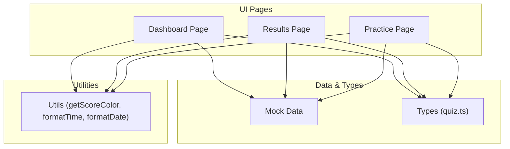
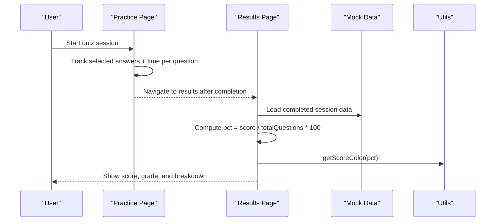
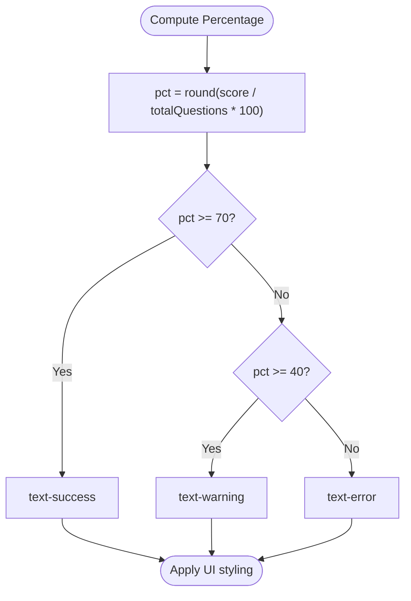
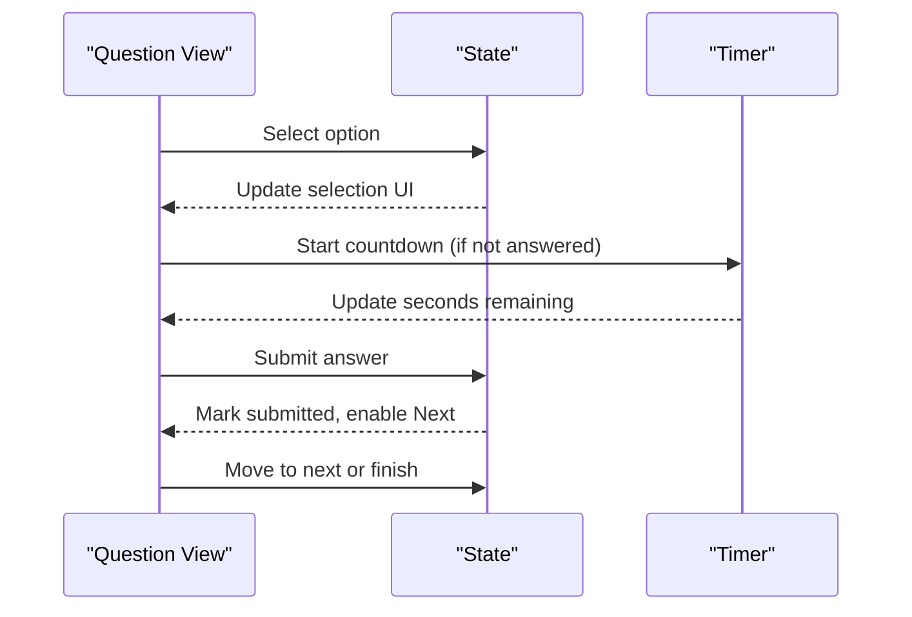
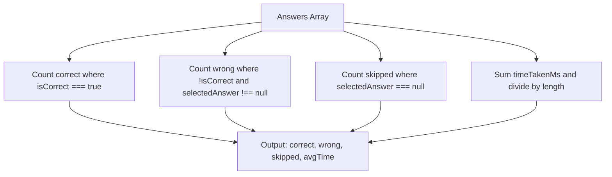
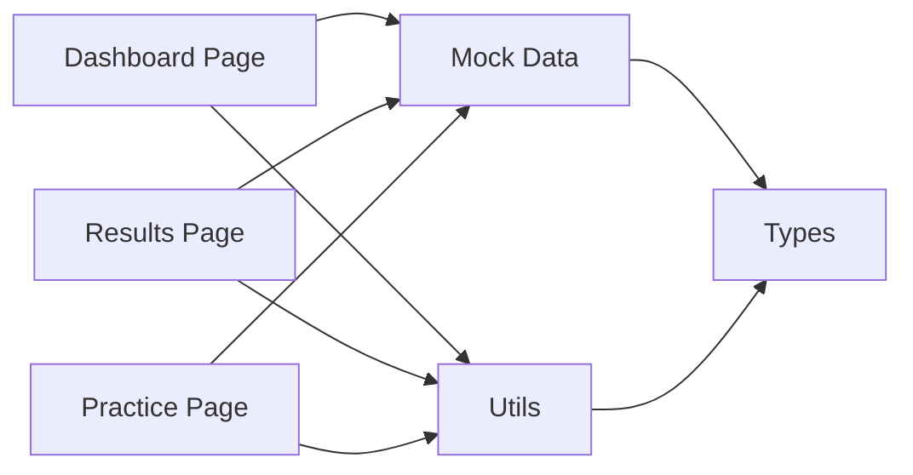

# Performance Metrics & Statistics

<cite>
**Referenced Files in This Document**
- [dashboard/page.tsx](file://src/app/dashboard/page.tsx)
- [results/[session]/page.tsx](file://src/app/results/[session]/page.tsx)
- [practice/[session]/page.tsx](file://src/app/practice/[session]/page.tsx)
- [mock-data.ts](file://src/lib/mock-data.ts)
- [utils.ts](file://src/lib/utils.ts)
- [quiz.ts](file://src/types/quiz.ts)
</cite>

## Table of Contents
1. Introduction
2. Project Structure
3. Core Components
4. Architecture Overview
5. Detailed Component Analysis
6. Dependency Analysis
7. Performance Considerations
8. Troubleshooting Guide
9. Conclusion

## Introduction
This document explains how the performance metrics and statistics system works in the application. It covers how total questions, accuracy rates, sessions completed, and study streaks are calculated and displayed on the dashboard; how weekly progress is tracked; how scoring algorithms determine color coding for success, warning, and error states; and how real-time updates and data aggregation are implemented across practice and results flows.

## Project Structure
The metrics and statistics system spans a few key areas:
- Dashboard page displays aggregated stats and recent activity.
- Mock data defines the structure and sample values for dashboard stats, topics, weak topics, recent sessions, and quiz sessions.
- Types define the contracts for all metric-related structures.
- Utilities provide formatting and scoring color logic.
- Practice and Results pages compute per-session metrics and feed them into the overall picture.

**Diagram sources**
- [dashboard/page.tsx:1-239](file://src/app/dashboard/page.tsx#L1-L239)
- [results/[session]/page.tsx:1-315](file://src/app/results/[session]/page.tsx#L1-L315)
- [practice/[session]/page.tsx:1-352](file://src/app/practice/[session]/page.tsx#L1-L352)
- [mock-data.ts:1-313](file://src/lib/mock-data.ts#L1-L313)
- [utils.ts:1-34](file://src/lib/utils.ts#L1-L34)
- [quiz.ts:1-107](file://src/types/quiz.ts#L1-L107)

**Section sources**
- [dashboard/page.tsx:1-239](file://src/app/dashboard/page.tsx#L1-L239)
- [mock-data.ts:1-313](file://src/lib/mock-data.ts#L1-L313)
- [utils.ts:1-34](file://src/lib/utils.ts#L1-L34)
- [quiz.ts:1-107](file://src/types/quiz.ts#L1-L107)

## Core Components
- DashboardStats: Holds totalQuestions, questionsThisWeek, accuracyRate, sessionsCompleted, studyStreak.
- RecentSession: Captures per-session score and date to show recent activity.
- QuizSession and UserAnswer: Define session-level answers and timing used to compute per-session metrics.
- WeakTopic: Tracks topic-level weakness scores and attempt/error counts.

Key responsibilities:
- Display aggregated stats on the dashboard.
- Compute per-session accuracy and time-based metrics on the results page.
- Provide mock data as the source of truth for current implementation.
- Apply consistent color coding based on thresholds.

**Section sources**
- [mock-data.ts:47-64](file://src/lib/mock-data.ts#L47-L64)
- [quiz.ts:30-58](file://src/types/quiz.ts#L30-L58)
- [quiz.ts:78-92](file://src/types/quiz.ts#L78-L92)

## Architecture Overview
The system follows a simple client-side architecture:
- The dashboard reads from mock data and renders high-level metrics.
- The practice page tracks user answers and timing per question.
- The results page aggregates answers to compute correct/wrong/skipped counts, average time, and percentage score.
- Utility functions standardize color coding and formatting.

**Diagram sources**
- [practice/[session]/page.tsx:25-86](file://src/app/practice/[session]/page.tsx#L25-L86)
- [results/[session]/page.tsx:28-46](file://src/app/results/[session]/page.tsx#L28-L46)
- [mock-data.ts:232-256](file://src/lib/mock-data.ts#L232-L256)
- [utils.ts:23-27](file://src/lib/utils.ts#L23-L27)

## Detailed Component Analysis

### Dashboard Stats Display
- Displays totalQuestions, accuracyRate, sessionsCompleted, studyStreak, and questionsThisWeek.
- Accuracy rate color changes based on threshold: green if >= 70%, otherwise yellow.
- Recent sessions list shows score/total and formatted dates.

Accuracy display logic:
- Uses a conditional to set text color based on accuracyRate value.

Weekly progress:
- Questions this week is shown as a sub-label under total questions.

**Section sources**
- [dashboard/page.tsx:47-88](file://src/app/dashboard/page.tsx#L47-L88)
- [dashboard/page.tsx:150-176](file://src/app/dashboard/page.tsx#L150-L176)
- [mock-data.ts:47-53](file://src/lib/mock-data.ts#L47-L53)

### Scoring Algorithms and Color Coding
- Percentage calculation: pct = Math.round((score / totalQuestions) * 100).
- Grade labels: Excellent (>=80), Good work (>=60), Keep going (>=40), Needs practice (<40).
- Color coding via utility:
  - Success (green): >= 70%
  - Warning (yellow): >= 40% and < 70%
  - Error (red): < 40%

These rules are applied consistently in both dashboard and results views.

**Diagram sources**
- [results/[session]/page.tsx:34-46](file://src/app/results/[session]/page.tsx#L34-L46)
- [utils.ts:23-27](file://src/lib/utils.ts#L23-L27)

**Section sources**
- [results/[session]/page.tsx:34-46](file://src/app/results/[session]/page.tsx#L34-L46)
- [utils.ts:23-27](file://src/lib/utils.ts#L23-L27)

### Real-Time Updates Mechanism
- Per-question timer: A countdown runs while a question is unanswered, resetting when moving to the next question.
- Progress tracking: Answered count updates the progress bar in real time.
- State transitions: Selection -> Submit -> Next flow updates state immediately without network calls.

**Diagram sources**
- [practice/[session]/page.tsx:42-55](file://src/app/practice/[session]/page.tsx#L42-L55)
- [practice/[session]/page.tsx:57-86](file://src/app/practice/[session]/page.tsx#L57-L86)
- [practice/[session]/page.tsx:155-161](file://src/app/practice/[session]/page.tsx#L155-L161)

**Section sources**
- [practice/[session]/page.tsx:42-55](file://src/app/practice/[session]/page.tsx#L42-L55)
- [practice/[session]/page.tsx:57-86](file://src/app/practice/[session]/page.tsx#L57-L86)
- [practice/[session]/page.tsx:155-161](file://src/app/practice/[session]/page.tsx#L155-L161)

### Data Aggregation Methods
- Correct/Wrong/Skipped counts: Derived by filtering answers array by correctness and presence of selectedAnswer.
- Average time: Sum of timeTakenMs across answers divided by number of answers, converted to seconds.
- Session score: Provided in mock data; can be derived from answers if needed.

**Diagram sources**
- [results/[session]/page.tsx:34-43](file://src/app/results/[session]/page.tsx#L34-L43)

**Section sources**
- [results/[session]/page.tsx:34-43](file://src/app/results/[session]/page.tsx#L34-L43)

### Weekly Progress Tracking
- questionsThisWeek is part of the dashboard stats object and displayed as a sub-label under total questions.
- In this implementation, it is sourced directly from mock data.

Example usage path:
- Dashboard reads mockDashboardStats.questionsThisWeek and renders it alongside totalQuestions.

**Section sources**
- [mock-data.ts:47-53](file://src/lib/mock-data.ts#L47-L53)
- [dashboard/page.tsx:47-88](file://src/app/dashboard/page.tsx#L47-L88)

### Example: Accuracy Percentage Calculation
- Formula: pct = Math.round((score / totalQuestions) * 100).
- Applied in results view to compute the percentage for display and grading.

Where to find it:
- Computed in the results page before rendering the score header and circular indicator.

**Section sources**
- [results/[session]/page.tsx:34-36](file://src/app/results/[session]/page.tsx#L34-L36)

### Topic-Level Weakness Indicators
- Weak topics list includes weaknessScore, errorCount, and attemptCount.
- Progress bars use variant mapping:
  - >= 70: error
  - >= 50: warning
  - else: primary

This provides visual cues for focus areas on the dashboard.

**Section sources**
- [mock-data.ts:36-42](file://src/lib/mock-data.ts#L36-L42)
- [dashboard/page.tsx:107-138](file://src/app/dashboard/page.tsx#L107-L138)

## Dependency Analysis
- Dashboard depends on mock data for stats and topics, and utils for formatting and color.
- Results depend on mock completed session data and utils for color and time formatting.
- Practice depends on mock questions and local state for real-time interactions.
- Types ensure consistency across components.

**Diagram sources**
- [dashboard/page.tsx:1-239](file://src/app/dashboard/page.tsx#L1-L239)
- [results/[session]/page.tsx:1-315](file://src/app/results/[session]/page.tsx#L1-L315)
- [practice/[session]/page.tsx:1-352](file://src/app/practice/[session]/page.tsx#L1-L352)
- [mock-data.ts:1-313](file://src/lib/mock-data.ts#L1-L313)
- [utils.ts:1-34](file://src/lib/utils.ts#L1-L34)
- [quiz.ts:1-107](file://src/types/quiz.ts#L1-L107)

**Section sources**
- [dashboard/page.tsx:1-239](file://src/app/dashboard/page.tsx#L1-L239)
- [results/[session]/page.tsx:1-315](file://src/app/results/[session]/page.tsx#L1-L315)
- [practice/[session]/page.tsx:1-352](file://src/app/practice/[session]/page.tsx#L1-L352)
- [mock-data.ts:1-313](file://src/lib/mock-data.ts#L1-L313)
- [utils.ts:1-34](file://src/lib/utils.ts#L1-L34)
- [quiz.ts:1-107](file://src/types/quiz.ts#L1-L107)

## Performance Considerations
- Client-side calculations are lightweight and operate on small arrays, keeping UI responsive.
- Timer uses setInterval with immediate cleanup on unmount or question change to avoid leaks.
- Avoid unnecessary re-renders by keeping state minimal and using functional updates.

[No sources needed since this section provides general guidance]

## Troubleshooting Guide
- Incorrect percentage display: Ensure score and totalQuestions are correctly set in the session data.
- Misapplied colors: Verify that getScoreColor thresholds match UI expectations (>=70 success, >=40 warning, else error).
- Timer not updating: Confirm interval setup and cleanup around question navigation.
- Wrong counts: Validate filters for correct/wrong/skipped against the answers array schema.

**Section sources**
- [results/[session]/page.tsx:34-46](file://src/app/results/[session]/page.tsx#L34-L46)
- [utils.ts:23-27](file://src/lib/utils.ts#L23-L27)
- [practice/[session]/page.tsx:42-55](file://src/app/practice/[session]/page.tsx#L42-L55)

## Conclusion
The performance metrics and statistics system centers on clear, consistent calculations and presentation:
- Dashboard aggregates high-level stats and weekly progress from mock data.
- Results compute per-session accuracy, time, and categorization with standardized color coding.
- Practice provides real-time feedback through timers and progress indicators.
- Types and utilities enforce consistency and readability across the app.

[No sources needed since this section summarizes without analyzing specific files]