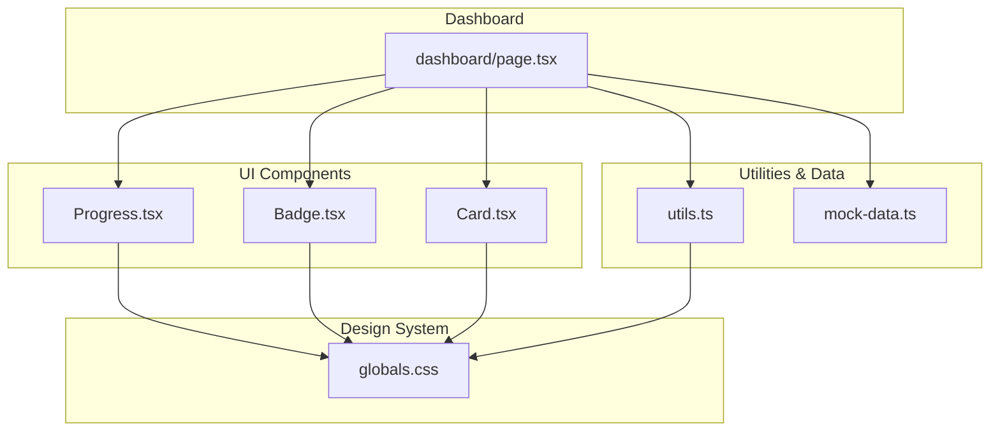
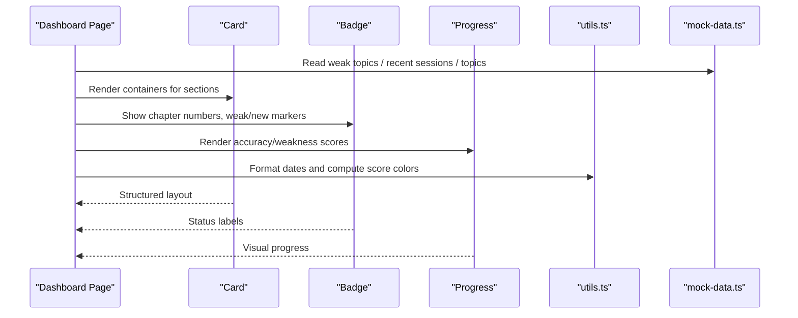
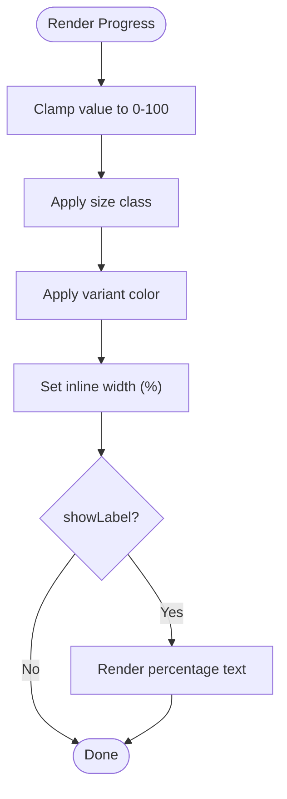
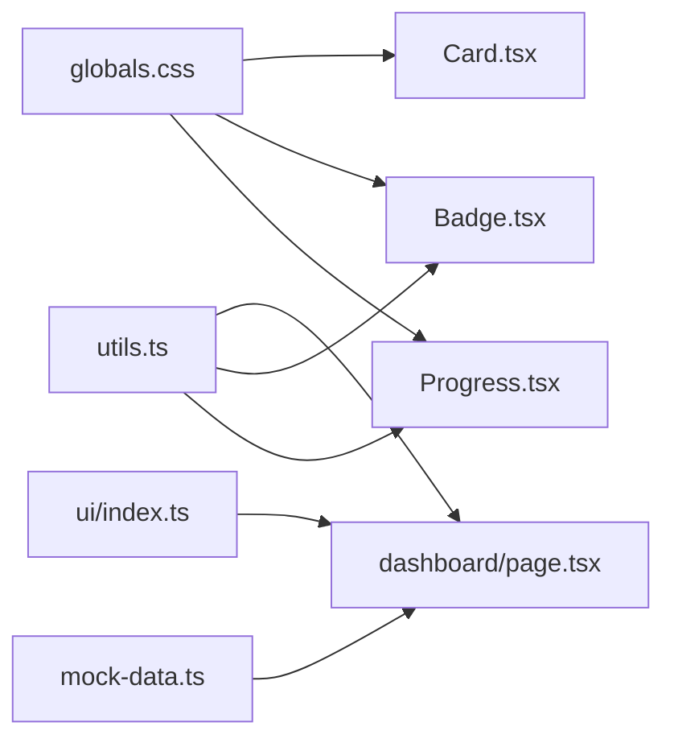

# Progress Visualization Components

<cite>
**Referenced Files in This Document**
- [Progress.tsx](file://src/components/ui/Progress.tsx)
- [Badge.tsx](file://src/components/ui/Badge.tsx)
- [Card.tsx](file://src/components/ui/Card.tsx)
- [dashboard/page.tsx](file://src/app/dashboard/page.tsx)
- [utils.ts](file://src/lib/utils.ts)
- [mock-data.ts](file://src/lib/mock-data.ts)
- [index.ts](file://src/components/ui/index.ts)
- [globals.css](file://src/app/globals.css)
</cite>

## Table of Contents
1. [Introduction](#introduction)
2. [Project Structure](#project-structure)
3. [Core Components](#core-components)
4. [Architecture Overview](#architecture-overview)
5. [Detailed Component Analysis](#detailed-component-analysis)
6. [Dependency Analysis](#dependency-analysis)
7. [Performance Considerations](#performance-considerations)
8. [Troubleshooting Guide](#troubleshooting-guide)
9. [Conclusion](#conclusion)
10. [Appendices](#appendices)

## Introduction
This document explains the progress visualization components used across the dashboard: the Progress component with semantic variants, the Badge component for categorization and status indicators, responsive grid layouts using Tailwind CSS classes, and card-based design patterns that organize information into digestible sections. It also covers accessibility considerations, color contrast standards, and interactive states such as hover effects and transitions.

## Project Structure
The progress visualization system is composed of reusable UI primitives (Progress, Badge, Card) and a dashboard page that composes them to present user performance data. The design tokens define colors and typography, while utility functions provide consistent formatting and color logic.

**Diagram sources**
- [Progress.tsx:1-59](file://src/components/ui/Progress.tsx#L1-L59)
- [Badge.tsx:1-35](file://src/components/ui/Badge.tsx#L1-L35)
- [Card.tsx:1-46](file://src/components/ui/Card.tsx#L1-L46)
- [dashboard/page.tsx:1-239](file://src/app/dashboard/page.tsx#L1-L239)
- [utils.ts:1-34](file://src/lib/utils.ts#L1-L34)
- [mock-data.ts:1-313](file://src/lib/mock-data.ts#L1-L313)
- [globals.css:1-181](file://src/app/globals.css#L1-L181)

**Section sources**
- [Progress.tsx:1-59](file://src/components/ui/Progress.tsx#L1-L59)
- [Badge.tsx:1-35](file://src/components/ui/Badge.tsx#L1-L35)
- [Card.tsx:1-46](file://src/components/ui/Card.tsx#L1-L46)
- [dashboard/page.tsx:1-239](file://src/app/dashboard/page.tsx#L1-L239)
- [utils.ts:1-34](file://src/lib/utils.ts#L1-L34)
- [mock-data.ts:1-313](file://src/lib/mock-data.ts#L1-L313)
- [globals.css:1-181](file://src/app/globals.css#L1-L181)

## Core Components
- Progress: A flexible, accessible progress bar with semantic variants and sizes.
- Badge: A compact label for chapter numbers, weak status, new content markers, and more.
- Card: A container for grouping related content with visual hierarchy and padding options.

These components are exported from the UI index and composed within the dashboard to visualize learning progress and performance insights.

**Section sources**
- [index.ts:1-15](file://src/components/ui/index.ts#L1-L15)
- [Progress.tsx:1-59](file://src/components/ui/Progress.tsx#L1-L59)
- [Badge.tsx:1-35](file://src/components/ui/Badge.tsx#L1-L35)
- [Card.tsx:1-46](file://src/components/ui/Card.tsx#L1-L46)

## Architecture Overview
The dashboard composes Progress, Badge, and Card to display:
- Weak topics with severity-coded progress bars
- Recent sessions with score summaries
- Topic cards showing accuracy or “New” status

**Diagram sources**
- [dashboard/page.tsx:1-239](file://src/app/dashboard/page.tsx#L1-L239)
- [utils.ts:1-34](file://src/lib/utils.ts#L1-L34)
- [mock-data.ts:1-313](file://src/lib/mock-data.ts#L1-L313)

## Detailed Component Analysis

### Progress Component
- Purpose: Visualize completion or performance metrics with semantic meaning via variants.
- Variants and semantics:
  - primary: Neutral baseline progress (e.g., default state).
  - success: Positive outcomes (e.g., high accuracy).
  - warning: Needs attention (e.g., moderate accuracy).
  - error: Critical issues (e.g., low accuracy or high weakness).
- Sizes: sm, md, lg for different contexts (compact lists vs prominent sections).
- Behavior:
  - Value clamping ensures 0–100 range.
  - Smooth animated width transition for dynamic updates.
  - Optional percentage label for clarity.

**Diagram sources**
- [Progress.tsx:26-56](file://src/components/ui/Progress.tsx#L26-L56)

Usage examples in the dashboard:
- Weak topics: Severity-driven variant selection based on weakness score thresholds.
- Topic cards: Accuracy-driven variant selection based on percentage thresholds.

**Section sources**
- [Progress.tsx:1-59](file://src/components/ui/Progress.tsx#L1-L59)
- [dashboard/page.tsx:108-138](file://src/app/dashboard/page.tsx#L108-L138)
- [dashboard/page.tsx:191-233](file://src/app/dashboard/page.tsx#L191-L233)

### Badge Component
- Purpose: Compact labels for categorization and status.
- Variants and meanings:
  - default: Neutral labels (e.g., chapter numbers).
  - success: Positive status (not used in current dashboard usage but available).
  - warning: Attention needed (e.g., “Weak” topic indicator).
  - error: Negative status (available for future use).
  - info: Informational (e.g., “New” content marker).
  - ai: AI-related highlights (available for future use).
- Styling: Rounded pill shape with subtle background tint and contrasting text.

Common uses in the dashboard:
- Chapter number badges next to topic titles.
- “Weak” badge to highlight topics needing focus.
- “New” badge for topics without prior performance data.

**Section sources**
- [Badge.tsx:1-35](file://src/components/ui/Badge.tsx#L1-L35)
- [dashboard/page.tsx:114-118](file://src/app/dashboard/page.tsx#L114-L118)
- [dashboard/page.tsx:201-205](file://src/app/dashboard/page.tsx#L201-L205)
- [dashboard/page.tsx:228-230](file://src/app/dashboard/page.tsx#L228-L230)

### Card Component
- Purpose: Container for grouping related content with consistent padding and visual elevation.
- Variants:
  - default: Subtle border and surface background.
  - elevated: Shadowed appearance for emphasis.
  - bordered: Transparent background with visible borders.
- Padding levels: none, sm, md, lg for flexible spacing.

In the dashboard:
- Stats cards with icons and values.
- Section containers for weak topics and recent sessions.
- Topic cards with hover interactions and internal badges/progress.

**Section sources**
- [Card.tsx:1-46](file://src/components/ui/Card.tsx#L1-L46)
- [dashboard/page.tsx:47-88](file://src/app/dashboard/page.tsx#L47-L88)
- [dashboard/page.tsx:90-178](file://src/app/dashboard/page.tsx#L90-L178)
- [dashboard/page.tsx:191-233](file://src/app/dashboard/page.tsx#L191-L233)

### Responsive Grid Layouts
The dashboard uses Tailwind’s responsive grid utilities to adapt from mobile to desktop:
- Stats row: Two columns on small screens, four columns on large screens.
- Main content: Three-column section for weak topics and two-column section for recent sessions on large screens.
- Quick start topics: Two columns on medium screens, four columns on large screens.

These grids ensure readability and efficient use of space across devices.

**Section sources**
- [dashboard/page.tsx:47-88](file://src/app/dashboard/page.tsx#L47-L88)
- [dashboard/page.tsx:90-178](file://src/app/dashboard/page.tsx#L90-L178)
- [dashboard/page.tsx:191-233](file://src/app/dashboard/page.tsx#L191-L233)

### Color System and Semantic Meaning
Colors are defined as design tokens and applied consistently:
- Primary: Teal accent for brand and neutral progress.
- Success: Green for positive outcomes.
- Warning: Amber for cautionary states.
- Error: Red for critical issues.
- Info: Blue for informational states.
- Surface and borders: Dark theme surfaces and subtle borders for contrast.

Semantic mapping in the dashboard:
- Progress variants reflect performance thresholds.
- Badges indicate category or status (chapter, weak, new).
- Utility functions derive color classes based on numeric scores.

**Section sources**
- [globals.css:7-36](file://src/app/globals.css#L7-L36)
- [utils.ts:23-33](file://src/lib/utils.ts#L23-L33)
- [dashboard/page.tsx:120-130](file://src/app/dashboard/page.tsx#L120-L130)
- [dashboard/page.tsx:212-223](file://src/app/dashboard/page.tsx#L212-L223)

### Interactive States and Transitions
- Hover effects:
  - Cards and list items change background on hover for feedback.
  - Links transition text color to primary-light on hover.
- Transitions:
  - Progress bars animate width changes smoothly over a short duration.
  - Cards have subtle color transitions for interactivity.

These behaviors improve usability by providing clear feedback during interaction.

**Section sources**
- [dashboard/page.tsx:108-112](file://src/app/dashboard/page.tsx#L108-L112)
- [dashboard/page.tsx:151-158](file://src/app/dashboard/page.tsx#L151-L158)
- [dashboard/page.tsx:197-208](file://src/app/dashboard/page.tsx#L197-L208)
- [Progress.tsx:43-49](file://src/components/ui/Progress.tsx#L43-L49)
- [Card.tsx:25-39](file://src/components/ui/Card.tsx#L25-L39)

## Dependency Analysis
Components depend on shared utilities and design tokens:
- Progress and Badge rely on the cn utility for class merging.
- Dashboard composes components and uses mock data and formatting utilities.
- Design tokens in globals.css define the color palette and typography.

**Diagram sources**
- [utils.ts:1-34](file://src/lib/utils.ts#L1-L34)
- [globals.css:1-181](file://src/app/globals.css#L1-L181)
- [mock-data.ts:1-313](file://src/lib/mock-data.ts#L1-L313)
- [index.ts:1-15](file://src/components/ui/index.ts#L1-L15)
- [Progress.tsx:1-59](file://src/components/ui/Progress.tsx#L1-L59)
- [Badge.tsx:1-35](file://src/components/ui/Badge.tsx#L1-L35)
- [Card.tsx:1-46](file://src/components/ui/Card.tsx#L1-L46)
- [dashboard/page.tsx:1-239](file://src/app/dashboard/page.tsx#L1-L239)

**Section sources**
- [utils.ts:1-34](file://src/lib/utils.ts#L1-L34)
- [globals.css:1-181](file://src/app/globals.css#L1-L181)
- [mock-data.ts:1-313](file://src/lib/mock-data.ts#L1-L313)
- [index.ts:1-15](file://src/components/ui/index.ts#L1-L15)

## Performance Considerations
- Efficient rendering:
  - Use memoized computations where possible for derived values like percentages.
  - Avoid unnecessary re-renders by keeping props stable and minimal.
- Animation performance:
  - Keep transitions short and hardware-accelerated (transform/opacity preferred).
  - Ensure width animations do not trigger layout thrashing; consider transform-based approaches if scaling becomes heavy.
- Data handling:
  - Slice or paginate large datasets to reduce DOM size.
  - Use utility functions for consistent formatting to avoid repeated logic.

[No sources needed since this section provides general guidance]

## Troubleshooting Guide
Common issues and resolutions:
- Progress bar exceeds bounds:
  - Ensure values are clamped between 0 and 100 before rendering.
- Incorrect variant application:
  - Verify threshold logic matches desired semantics (success/warning/error).
- Accessibility concerns:
  - Add descriptive aria attributes (e.g., aria-valuenow, aria-valuemin, aria-valuemax) for screen readers.
  - Ensure sufficient color contrast between progress fill and background.
- Hover and focus states:
  - Confirm focus outlines are visible for keyboard navigation.
  - Test hover states on touch devices to ensure they do not interfere with taps.

**Section sources**
- [Progress.tsx:33-53](file://src/components/ui/Progress.tsx#L33-L53)
- [dashboard/page.tsx:120-130](file://src/app/dashboard/page.tsx#L120-L130)
- [dashboard/page.tsx:212-223](file://src/app/dashboard/page.tsx#L212-L223)
- [globals.css:7-36](file://src/app/globals.css#L7-L36)

## Conclusion
The progress visualization system combines semantic Progress variants, informative Badges, and structured Cards to deliver clear, accessible, and responsive dashboards. Consistent design tokens and utility functions ensure coherence across components, while thoughtful interactions and transitions enhance user experience. Adhering to accessibility best practices and performance guidelines will further strengthen the system’s reliability and inclusivity.

[No sources needed since this section summarizes without analyzing specific files]

## Appendices

### API Reference Summary
- Progress
  - Props: value (number), variant ("primary" | "success" | "error" | "warning"), showLabel (boolean), className (string), size ("sm" | "md" | "lg")
  - Behavior: Clamps value, applies size and variant styles, animates width, optionally shows percentage label
- Badge
  - Props: variant ("default" | "success" | "error" | "warning" | "info" | "ai"), children, additional HTML span attributes
  - Behavior: Renders rounded pill with variant-specific background and text colors
- Card
  - Props: variant ("default" | "elevated" | "bordered"), padding ("none" | "sm" | "md" | "lg"), children, additional HTML div attributes
  - Behavior: Applies variant styling and padding, supports hover transitions

**Section sources**
- [Progress.tsx:5-11](file://src/components/ui/Progress.tsx#L5-L11)
- [Badge.tsx:6-8](file://src/components/ui/Badge.tsx#L6-L8)
- [Card.tsx:7-10](file://src/components/ui/Card.tsx#L7-L10)