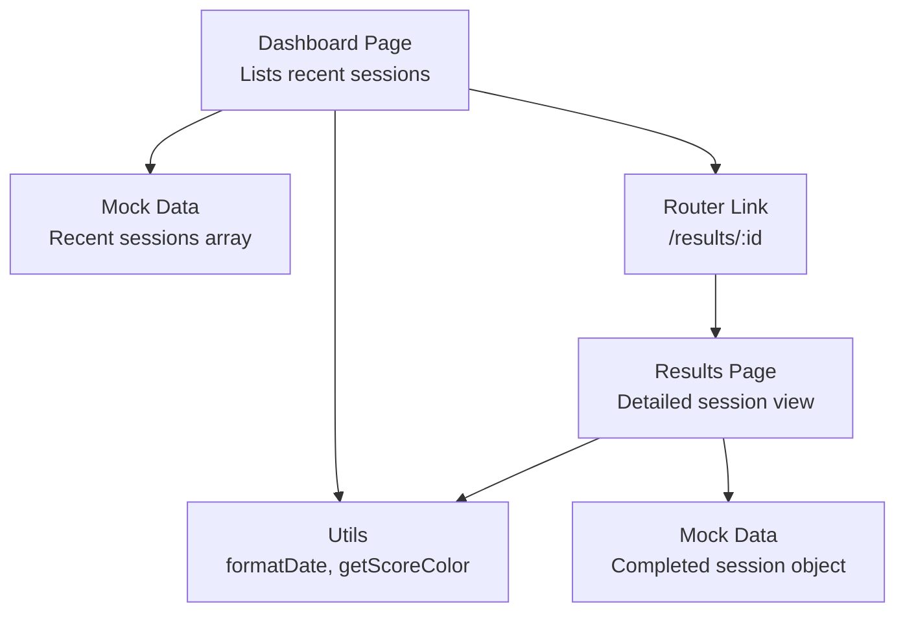
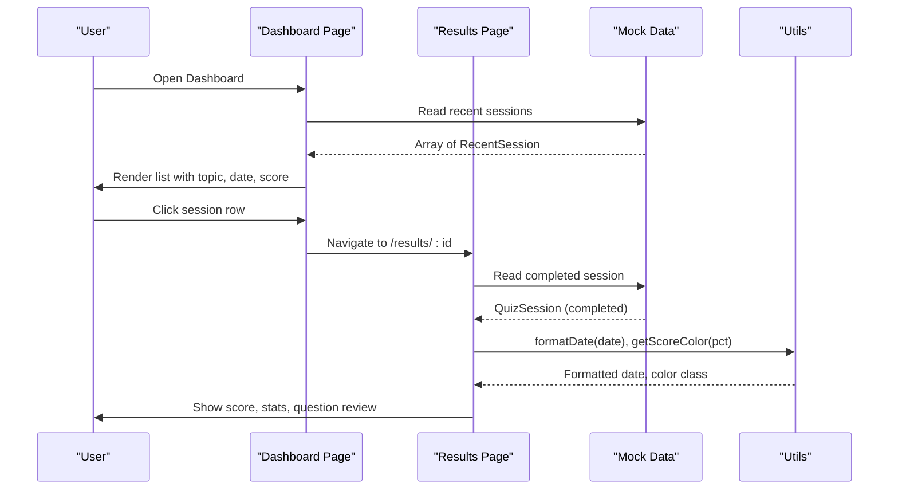
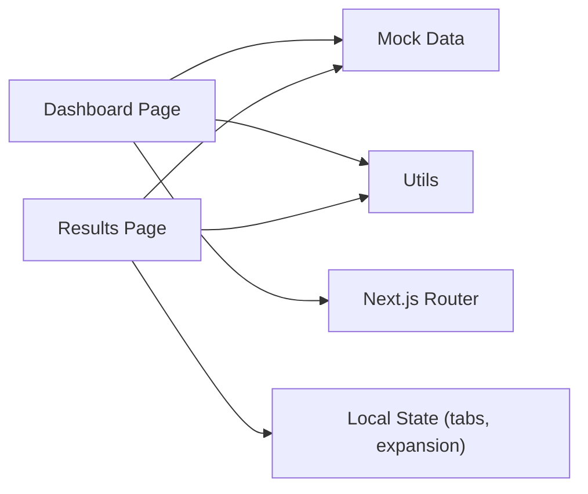

# Recent Sessions & History Tracking

<cite>
**Referenced Files in This Document**
- [dashboard/page.tsx](file://src/app/dashboard/page.tsx)
- [results/[session]/page.tsx](file://src/app/results/[session]/page.tsx)
- [quiz.ts](file://src/types/quiz.ts)
- [utils.ts](file://src/lib/utils.ts)
- [mock-data.ts](file://src/lib/mock-data.ts)
</cite>

## Table of Contents
1. Introduction
2. Project Structure
3. Core Components
4. Architecture Overview
5. Detailed Component Analysis
6. Dependency Analysis
7. Performance Considerations
8. Troubleshooting Guide
9. Conclusion

## Introduction
This document explains how practice sessions are recorded, stored, and displayed across the application’s history system. It focuses on:
- The session data model used to track topic, date, score, and total questions
- How recent sessions are listed and navigated from the dashboard
- How detailed results are shown for a completed session
- Date formatting utilities and score color-coding functions that provide visual feedback
- Sorting and filtering mechanisms that organize sessions chronologically and highlight recent activity

## Project Structure
The recent sessions feature spans several files:
- Data model definitions live in types
- Mock data provides sample sessions and completed session details
- Dashboard lists recent sessions with links to results
- Results page renders a full breakdown of a completed session
- Utilities provide consistent date formatting and score-based styling

**Diagram sources**
- [dashboard/page.tsx:141-177](file://src/app/dashboard/page.tsx#L141-L177)
- [mock-data.ts:58-64](file://src/lib/mock-data.ts#L58-L64)
- [utils.ts:8-33](file://src/lib/utils.ts#L8-L33)
- [results/[session]/page.tsx:28-108](file://src/app/results/[session]/page.tsx#L28-L108)

**Section sources**
- [dashboard/page.tsx:141-177](file://src/app/dashboard/page.tsx#L141-L177)
- [mock-data.ts:58-64](file://src/lib/mock-data.ts#L58-L64)
- [utils.ts:8-33](file://src/lib/utils.ts#L8-L33)
- [results/[session]/page.tsx:28-108](file://src/app/results/[session]/page.tsx#L28-L108)

## Core Components
- Session data model: Defines the shape of a recent session and a full quiz session, including id, topic, date, score, totalQuestions, and related fields.
- Recent sessions list: Displays the last N sessions with topic, formatted date, and score, with color-coded performance indicators.
- Results detail: Shows score percentage, correct/wrong/skipped counts, average time per question, and per-question review with explanations.
- Utilities: Provide consistent date formatting and score color logic.

Key responsibilities:
- Record and store: Represented by the data structures; currently backed by mock data.
- Display: Dashboard lists recent sessions; results page shows detailed metrics.
- Navigation: Clicking a session row navigates to /results/:id.
- Visual feedback: Score color-coding and progress bars reflect performance tiers.

**Section sources**
- [quiz.ts:37-50](file://src/types/quiz.ts#L37-L50)
- [quiz.ts:86-92](file://src/types/quiz.ts#L86-L92)
- [mock-data.ts:58-64](file://src/lib/mock-data.ts#L58-L64)
- [mock-data.ts:232-256](file://src/lib/mock-data.ts#L232-L256)
- [dashboard/page.tsx:141-177](file://src/app/dashboard/page.tsx#L141-L177)
- [results/[session]/page.tsx:28-108](file://src/app/results/[session]/page.tsx#L28-L108)
- [utils.ts:8-33](file://src/lib/utils.ts#L8-L33)

## Architecture Overview
The flow begins on the dashboard where recent sessions are rendered from mock data. Each session item is a clickable link to the dynamic results route. The results page loads a completed session object and computes derived metrics (percentage, counts, average time). Utilities standardize date display and apply color classes based on score thresholds.

**Diagram sources**
- [dashboard/page.tsx:141-177](file://src/app/dashboard/page.tsx#L141-L177)
- [mock-data.ts:58-64](file://src/lib/mock-data.ts#L58-L64)
- [mock-data.ts:232-256](file://src/lib/mock-data.ts#L232-L256)
- [results/[session]/page.tsx:28-108](file://src/app/results/[session]/page.tsx#L28-L108)
- [utils.ts:8-33](file://src/lib/utils.ts#L8-L33)

## Detailed Component Analysis

### Data Model: RecentSession and QuizSession
- RecentSession captures summary-level information for listing:
  - Fields: id, topic, score, totalQuestions, date
- QuizSession captures full session context for results:
  - Fields include id, topic, chapterNum, difficulty, numQuestions, score, totalQuestions, status, createdAt, timeTakenMs, questions, answers

These models ensure consistency between what is shown in the recent list and what is analyzed in the results view.

**Section sources**
- [quiz.ts:37-50](file://src/types/quiz.ts#L37-L50)
- [quiz.ts:86-92](file://src/types/quiz.ts#L86-L92)

### Recent Sessions List (Dashboard)
- Renders a list of recent sessions using mock data.
- For each session:
  - Computes percentage from score and totalQuestions
  - Formats date using a utility
  - Applies color coding to the score text based on percentage
  - Provides a navigation link to the results page for that session

Sorting and filtering:
- The current implementation displays sessions in the order provided by the mock data, which is already sorted by most recent first.
- No additional client-side sorting or filtering is applied in this component.

Navigation integration:
- Each row is a link to /results/:id, enabling users to click and view detailed results.

Visual feedback:
- Percentage-based color classes are applied via a utility function to indicate performance tiers.

**Section sources**
- [dashboard/page.tsx:141-177](file://src/app/dashboard/page.tsx#L141-L177)
- [mock-data.ts:58-64](file://src/lib/mock-data.ts#L58-L64)
- [utils.ts:8-33](file://src/lib/utils.ts#L8-L33)

### Results Detail Page
- Loads a completed session object and computes:
  - Percentage score
  - Counts of correct, wrong, and skipped answers
  - Average time per question in seconds
- Displays:
  - A circular score indicator with grade label
  - Topic, difficulty, and formatted date/time
  - Stats cards for correct, wrong, and average time
  - Question review with expandable details, options highlighting, and bilingual explanations
- Uses utilities for:
  - Formatting time
  - Applying score-based color classes

Filtering within results:
- Tabs allow filtering questions into All, Correct, Wrong, Skipped views.

Navigation:
- Links back to Practice and Dashboard for continued learning.

**Section sources**
- [results/[session]/page.tsx:28-108](file://src/app/results/[session]/page.tsx#L28-L108)
- [results/[session]/page.tsx:153-291](file://src/app/results/[session]/page.tsx#L153-L291)
- [mock-data.ts:232-256](file://src/lib/mock-data.ts#L232-L256)
- [utils.ts:17-27](file://src/lib/utils.ts#L17-L27)

### Date Formatting Utilities
- formatDate converts a Date or ISO string into a localized month/day/year format for display in the dashboard’s recent sessions list.
- formatTime converts seconds into a mm:ss string for average time display in results.

These utilities centralize formatting rules, ensuring consistent presentation across components.

**Section sources**
- [utils.ts:8-21](file://src/lib/utils.ts#L8-L21)
- [dashboard/page.tsx:163-165](file://src/app/dashboard/page.tsx#L163-L165)
- [results/[session]/page.tsx:98-107](file://src/app/results/[session]/page.tsx#L98-L107)

### Score Color-Coding Functions
- getScoreColor returns a text color class based on percentage thresholds:
  - Success for high scores
  - Warning for mid-range scores
  - Error for low scores
- getScoreBgColor returns background color classes following the same thresholds

Usage:
- Applied to recent session scores in the dashboard
- Applied to the main score display in the results page

**Section sources**
- [utils.ts:23-33](file://src/lib/utils.ts#L23-L33)
- [dashboard/page.tsx:167-171](file://src/app/dashboard/page.tsx#L167-L171)
- [results/[session]/page.tsx:90-94](file://src/app/results/[session]/page.tsx#L90-L94)

### Sorting and Filtering Mechanisms
- Recent sessions list:
  - Displays sessions in the order provided by mock data (most recent first)
  - No explicit sort/filter logic in the dashboard component
- Results page:
  - Filters questions by correctness or skip status using tabs
  - Does not affect the overall session ordering

If chronological sorting is required at scale, consider sorting the recent sessions array by date before rendering.

**Section sources**
- [mock-data.ts:58-64](file://src/lib/mock-data.ts#L58-L64)
- [dashboard/page.tsx:151-174](file://src/app/dashboard/page.tsx#L151-L174)
- [results/[session]/page.tsx:48-55](file://src/app/results/[session]/page.tsx#L48-L55)

## Dependency Analysis
- Dashboard depends on:
  - Mock data for recent sessions
  - Utils for date formatting and score colors
  - Router links to navigate to results
- Results page depends on:
  - Mock data for a completed session
  - Utils for time formatting and score colors
  - Local state for tab selection and expansion

**Diagram sources**
- [dashboard/page.tsx:141-177](file://src/app/dashboard/page.tsx#L141-L177)
- [results/[session]/page.tsx:28-108](file://src/app/results/[session]/page.tsx#L28-L108)
- [mock-data.ts:58-64](file://src/lib/mock-data.ts#L58-L64)
- [utils.ts:8-33](file://src/lib/utils.ts#L8-L33)

**Section sources**
- [dashboard/page.tsx:141-177](file://src/app/dashboard/page.tsx#L141-L177)
- [results/[session]/page.tsx:28-108](file://src/app/results/[session]/page.tsx#L28-L108)
- [mock-data.ts:58-64](file://src/lib/mock-data.ts#L58-L64)
- [utils.ts:8-33](file://src/lib/utils.ts#L8-L33)

## Performance Considerations
- Rendering efficiency:
  - Recent sessions list uses simple mapping over a small array; no heavy computations.
  - Results page computes derived metrics once per render; acceptable for typical session sizes.
- Potential optimizations:
  - Memoize filtered answers in results to avoid recomputation on re-renders.
  - If sessions grow large, implement pagination or virtualization for the recent sessions list.
  - Precompute percentages and color classes in data layer if needed.

[No sources needed since this section provides general guidance]

## Troubleshooting Guide
- Dates not displaying correctly:
  - Ensure dates are valid ISO strings or Date objects passed to formatDate.
  - Check locale settings if localization differs from expected.
- Incorrect score colors:
  - Verify percentage calculation uses score and totalQuestions consistently.
  - Confirm threshold boundaries align with design expectations.
- Navigation issues:
  - Ensure session id exists in mock data and routes match /results/:id.
  - Validate that links use the correct href pattern.
- Filtering not working:
  - Confirm activeTab state updates and filters match question answer statuses.
  - Check that answer matching uses questionId correctly.

**Section sources**
- [utils.ts:8-21](file://src/lib/utils.ts#L8-L21)
- [utils.ts:23-33](file://src/lib/utils.ts#L23-L33)
- [dashboard/page.tsx:151-174](file://src/app/dashboard/page.tsx#L151-L174)
- [results/[session]/page.tsx:48-55](file://src/app/results/[session]/page.tsx#L48-L55)

## Conclusion
The recent sessions tracking and history system centers around a clear data model and two primary UI surfaces:
- Dashboard lists recent sessions with topic, date, and color-coded scores, linking to detailed results.
- Results page presents comprehensive metrics and per-question review, leveraging utilities for consistent formatting and visual feedback.

Current behavior relies on mock data and straightforward client-side logic. Future enhancements can include server-backed persistence, robust sorting/filtering, and performance optimizations for larger datasets.

[No sources needed since this section summarizes without analyzing specific files]