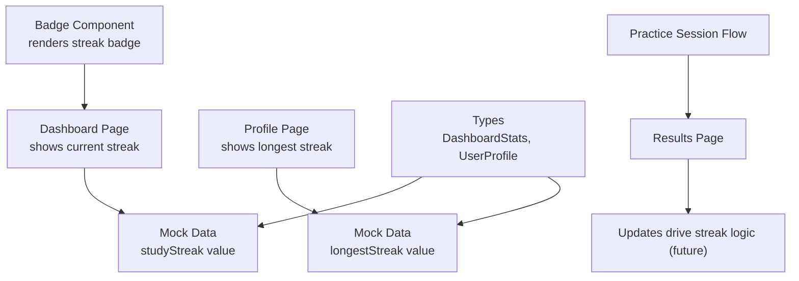
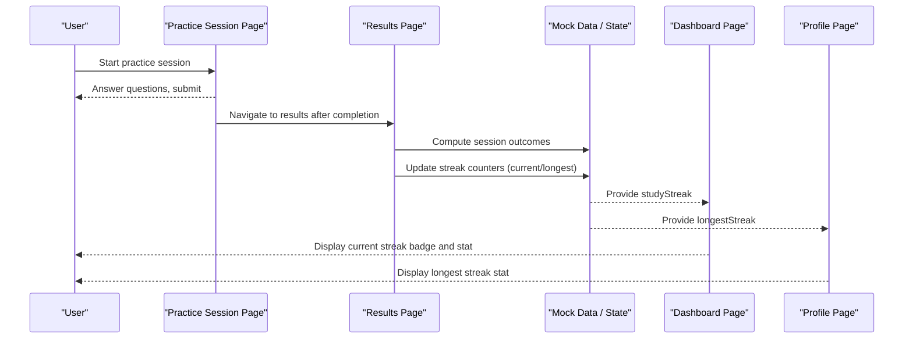
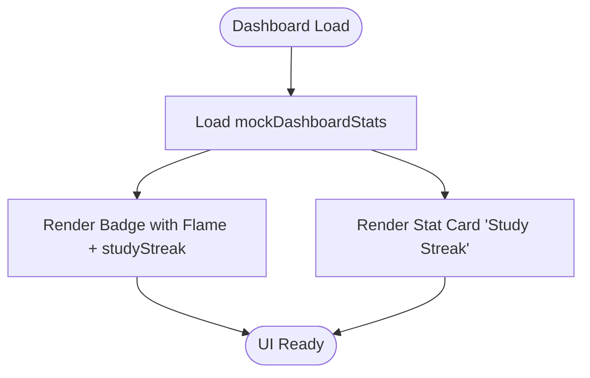
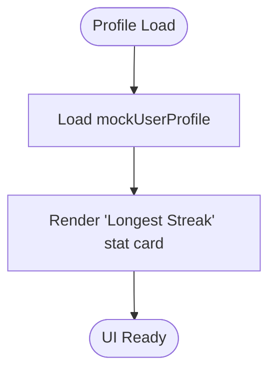
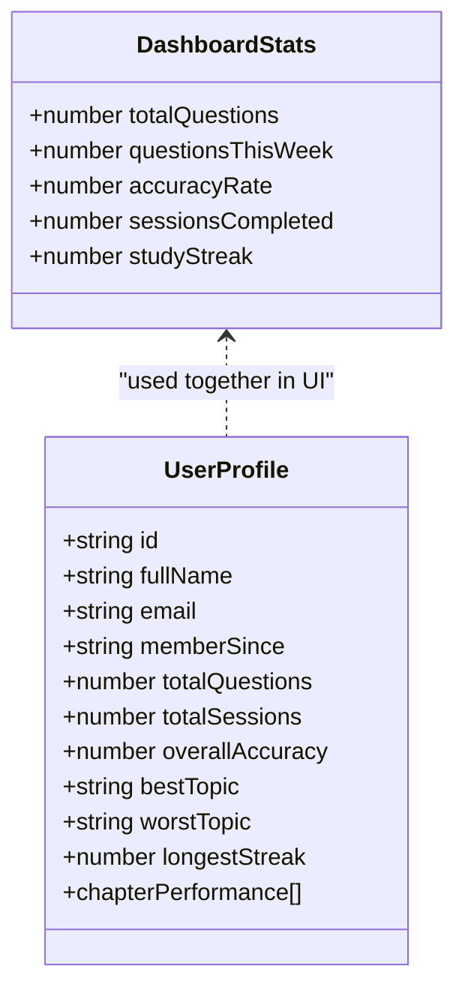
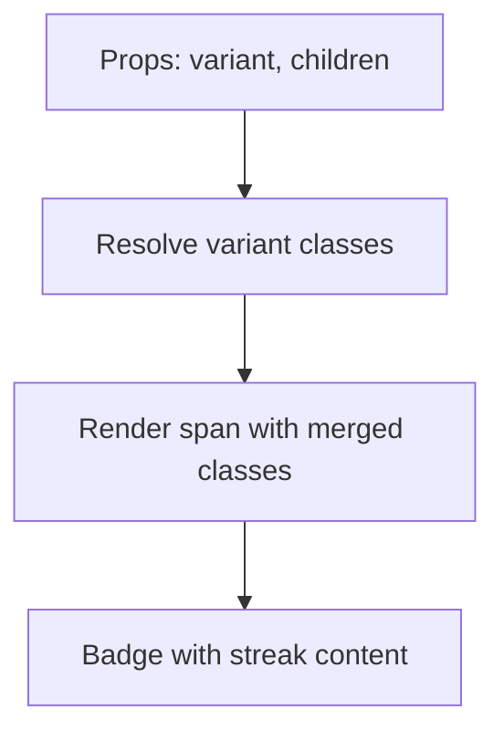
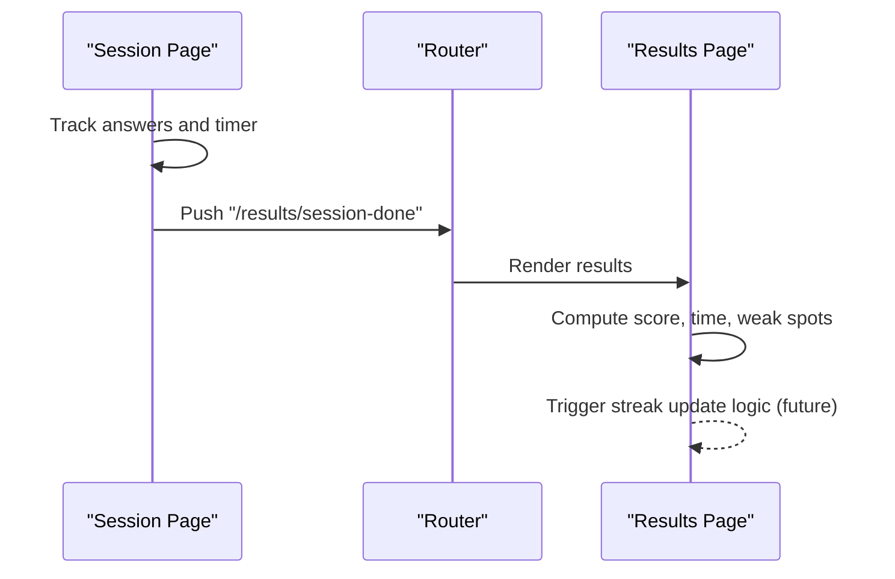
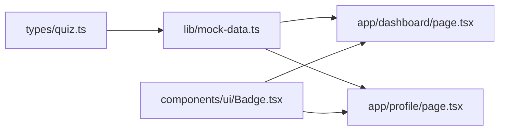

# Study Streak & Motivation System

<cite>
**Referenced Files in This Document**
- [dashboard/page.tsx](file://src/app/dashboard/page.tsx)
- [profile/page.tsx](file://src/app/profile/page.tsx)
- [mock-data.ts](file://src/lib/mock-data.ts)
- [quiz.ts](file://src/types/quiz.ts)
- [Badge.tsx](file://src/components/ui/Badge.tsx)
- [practice/[session]/page.tsx](file://src/app/practice/[session]/page.tsx)
- [results/[session]/page.tsx](file://src/app/results/[session]/page.tsx)
</cite>

## Table of Contents
1. [Introduction](#introduction)
2. [Project Structure](#project-structure)
3. [Core Components](#core-components)
4. [Architecture Overview](#architecture-overview)
5. [Detailed Component Analysis](#detailed-component-analysis)
6. [Dependency Analysis](#dependency-analysis)
7. [Performance Considerations](#performance-considerations)
8. [Troubleshooting Guide](#troubleshooting-guide)
9. [Conclusion](#conclusion)
10. [Appendices](#appendices)

## Introduction
This document explains the study streak system that motivates consistent learning by tracking consecutive days of practice, visualizing progress with flame icons and badges, and integrating streaks into user profiles and dashboards. It covers how streak data is represented, where it is displayed, and how it interacts with practice sessions and results. It also outlines recommended strategies for daily validation, reset conditions, milestone celebrations, preservation and recovery mechanisms, and achievement recognition to enhance engagement.

## Project Structure
The streak-related features are implemented across UI pages and shared types:
- Dashboard displays current streak as a prominent badge and stat card.
- Profile shows longest streak as part of overall statistics.
- Mock data provides sample values for streaks and integrates them with other metrics.
- Types define the shape of dashboard stats and user profile including streak fields.
- Badge component renders streak indicators with variants.
- Practice session flow and results page complete the user journey that drives streak updates.

**Diagram sources**
- [dashboard/page.tsx:41-44](file://src/app/dashboard/page.tsx#L41-L44)
- [profile/page.tsx:83-89](file://src/app/profile/page.tsx#L83-L89)
- [mock-data.ts:47-53](file://src/lib/mock-data.ts#L47-L53)
- [mock-data.ts:286-312](file://src/lib/mock-data.ts#L286-L312)
- [quiz.ts:78-84](file://src/types/quiz.ts#L78-L84)
- [quiz.ts:94-105](file://src/types/quiz.ts#L94-L105)
- [Badge.tsx:19-31](file://src/components/ui/Badge.tsx#L19-L31)

**Section sources**
- [dashboard/page.tsx:21-87](file://src/app/dashboard/page.tsx#L21-L87)
- [profile/page.tsx:18-91](file://src/app/profile/page.tsx#L18-L91)
- [mock-data.ts:47-53](file://src/lib/mock-data.ts#L47-L53)
- [mock-data.ts:286-312](file://src/lib/mock-data.ts#L286-L312)
- [quiz.ts:78-84](file://src/types/quiz.ts#L78-L84)
- [quiz.ts:94-105](file://src/types/quiz.ts#L94-L105)
- [Badge.tsx:1-34](file://src/components/ui/Badge.tsx#L1-L34)

## Core Components
- Streak display on Dashboard:
  - A warning-styled Badge with a flame icon shows the current streak count alongside a greeting header.
  - A dedicated stat card labeled “Study Streak” reinforces the metric with an icon and subtext indicating consecutive days.
- Longest streak on Profile:
  - A stat card with a trophy icon highlights the longest streak achieved, expressed in days.
- Data model integration:
  - DashboardStats includes a studyStreak field used by the dashboard.
  - UserProfile includes a longestStreak field used by the profile.
- Visual components:
  - The Badge component supports variant styling; the dashboard uses a warning variant to emphasize streak status.

**Section sources**
- [dashboard/page.tsx:41-44](file://src/app/dashboard/page.tsx#L41-L44)
- [dashboard/page.tsx:71-77](file://src/app/dashboard/page.tsx#L71-L77)
- [profile/page.tsx:83-89](file://src/app/profile/page.tsx#L83-L89)
- [mock-data.ts:47-53](file://src/lib/mock-data.ts#L47-L53)
- [mock-data.ts:286-312](file://src/lib/mock-data.ts#L286-L312)
- [quiz.ts:78-84](file://src/types/quiz.ts#L78-L84)
- [quiz.ts:94-105](file://src/types/quiz.ts#L94-L105)
- [Badge.tsx:19-31](file://src/components/ui/Badge.tsx#L19-L31)

## Architecture Overview
The streak system currently surfaces precomputed values from mock data into the UI. The intended end-to-end flow connects practice sessions to streak updates:
- User completes a practice session.
- Results page summarizes performance and can trigger streak updates.
- Updated streak values propagate back to Dashboard and Profile views.

**Diagram sources**
- [practice/[session]/page.tsx:76-82](file://src/app/practice/[session]/page.tsx#L76-L82)
- [results/[session]/page.tsx:39-55](file://src/app/results/[session]/page.tsx#L39-L55)
- [mock-data.ts:47-53](file://src/lib/mock-data.ts#L47-L53)
- [mock-data.ts:286-312](file://src/lib/mock-data.ts#L286-L312)
- [dashboard/page.tsx:41-44](file://src/app/dashboard/page.tsx#L41-L44)
- [profile/page.tsx:83-89](file://src/app/profile/page.tsx#L83-L89)

## Detailed Component Analysis

### Dashboard Streak Display
- Renders a warning-styled Badge with a flame icon showing the current streak count.
- Includes a “Study Streak” stat card with icon and subtext “Consecutive days.”
- Uses mock dashboard stats to source the studyStreak value.

**Diagram sources**
- [dashboard/page.tsx:21-23](file://src/app/dashboard/page.tsx#L21-L23)
- [dashboard/page.tsx:41-44](file://src/app/dashboard/page.tsx#L41-L44)
- [dashboard/page.tsx:71-77](file://src/app/dashboard/page.tsx#L71-L77)
- [mock-data.ts:47-53](file://src/lib/mock-data.ts#L47-L53)

**Section sources**
- [dashboard/page.tsx:21-87](file://src/app/dashboard/page.tsx#L21-L87)
- [mock-data.ts:47-53](file://src/lib/mock-data.ts#L47-L53)

### Profile Longest Streak Display
- Shows a stat card with a trophy icon displaying the longest streak in days.
- Sources the value from mock user profile data.

**Diagram sources**
- [profile/page.tsx:18-20](file://src/app/profile/page.tsx#L18-L20)
- [profile/page.tsx:83-89](file://src/app/profile/page.tsx#L83-L89)
- [mock-data.ts:286-312](file://src/lib/mock-data.ts#L286-L312)

**Section sources**
- [profile/page.tsx:18-91](file://src/app/profile/page.tsx#L18-L91)
- [mock-data.ts:286-312](file://src/lib/mock-data.ts#L286-L312)

### Streak Data Model
- DashboardStats includes a studyStreak number representing current consecutive days.
- UserProfile includes a longestStreak number representing the all-time best streak.

**Diagram sources**
- [quiz.ts:78-84](file://src/types/quiz.ts#L78-L84)
- [quiz.ts:94-105](file://src/types/quiz.ts#L94-L105)

**Section sources**
- [quiz.ts:78-84](file://src/types/quiz.ts#L78-L84)
- [quiz.ts:94-105](file://src/types/quiz.ts#L94-L105)

### Badge Component for Streak Indicators
- Provides styled spans with variants; dashboard uses warning variant to highlight streak status.
- Supports flexible content such as icons and text for streak badges.

**Diagram sources**
- [Badge.tsx:4-17](file://src/components/ui/Badge.tsx#L4-L17)
- [Badge.tsx:19-31](file://src/components/ui/Badge.tsx#L19-L31)

**Section sources**
- [Badge.tsx:1-34](file://src/components/ui/Badge.tsx#L1-L34)

### Practice Session Flow and Streak Integration Points
- Practice session navigates to results upon completion, which is the natural place to compute and persist streak updates.
- Results page computes session metrics and can be extended to update streak counters based on completed activity.

**Diagram sources**
- [practice/[session]/page.tsx:76-82](file://src/app/practice/[session]/page.tsx#L76-L82)
- [results/[session]/page.tsx:39-55](file://src/app/results/[session]/page.tsx#L39-L55)

**Section sources**
- [practice/[session]/page.tsx:25-86](file://src/app/practice/[session]/page.tsx#L25-L86)
- [results/[session]/page.tsx:39-55](file://src/app/results/[session]/page.tsx#L39-L55)

## Dependency Analysis
- Dashboard depends on mock data for studyStreak and renders it via Badge and stat cards.
- Profile depends on mock data for longestStreak and renders it via stat cards.
- Types define the structure of streak-related fields consumed by both pages.
- Badge component is reused to render streak indicators consistently.

**Diagram sources**
- [quiz.ts:78-84](file://src/types/quiz.ts#L78-L84)
- [quiz.ts:94-105](file://src/types/quiz.ts#L94-L105)
- [mock-data.ts:47-53](file://src/lib/mock-data.ts#L47-L53)
- [mock-data.ts:286-312](file://src/lib/mock-data.ts#L286-L312)
- [dashboard/page.tsx:41-44](file://src/app/dashboard/page.tsx#L41-L44)
- [profile/page.tsx:83-89](file://src/app/profile/page.tsx#L83-L89)
- [Badge.tsx:19-31](file://src/components/ui/Badge.tsx#L19-L31)

**Section sources**
- [quiz.ts:78-84](file://src/types/quiz.ts#L78-L84)
- [quiz.ts:94-105](file://src/types/quiz.ts#L94-L105)
- [mock-data.ts:47-53](file://src/lib/mock-data.ts#L47-L53)
- [mock-data.ts:286-312](file://src/lib/mock-data.ts#L286-L312)
- [dashboard/page.tsx:41-44](file://src/app/dashboard/page.tsx#L41-L44)
- [profile/page.tsx:83-89](file://src/app/profile/page.tsx#L83-L89)
- [Badge.tsx:19-31](file://src/components/ui/Badge.tsx#L19-L31)

## Performance Considerations
- Keep streak calculations lightweight: compute once per session completion and cache results in state or local storage to avoid re-computation on every render.
- Debounce any frequent UI updates when streak milestones trigger animations or notifications.
- Avoid heavy computations during practice sessions; defer streak updates until results are finalized.

[No sources needed since this section provides general guidance]

## Troubleshooting Guide
- If streak counts do not reflect recent activity:
  - Verify that session completion triggers an update to the streak counters in the results flow.
  - Ensure mock data or state is correctly updated before re-rendering Dashboard and Profile.
- If streak visuals are inconsistent:
  - Confirm Badge variant usage aligns with desired emphasis (e.g., warning for active streak).
  - Check that icons and labels match the current streak context.
- If streak resets unexpectedly:
  - Validate reset rules (e.g., missed day handling) and ensure they are applied only at appropriate boundaries (daily rollover).
  - Review any conditional logic that might zero out streaks prematurely.

[No sources needed since this section provides general guidance]

## Conclusion
The study streak system currently presents current and longest streaks through the Dashboard and Profile using mock data and reusable UI components. The practice-to-results flow provides a clear integration point to compute and persist streak updates. Extending the results page to calculate streak changes, applying robust daily validation and reset rules, and adding milestone celebrations will strengthen motivation and engagement.

[No sources needed since this section summarizes without analyzing specific files]

## Appendices

### Recommended Streak Logic (Implementation Guidance)
- Daily validation:
  - On each new day, check if the user completed at least one practice session on the previous day.
  - If yes, increment current streak; if no, reset current streak to zero.
- Reset conditions:
  - Reset occurs when a full calendar day passes without any completed session.
  - Optionally allow grace periods or “streak freezes” for special cases.
- Milestone celebrations:
  - At key thresholds (e.g., 3, 7, 14, 30 days), show celebratory banners or unlock badges.
- Preservation and recovery:
  - Offer “streak insurance” tokens earned through achievements to preserve streaks after a missed day.
  - Provide gentle reminders and quick-start prompts to recover streaks promptly.
- Achievement recognition:
  - Integrate streak milestones with profile badges and dashboard highlights.
  - Use flame intensity or color changes to visually communicate streak length.

[No sources needed since this section provides general guidance]