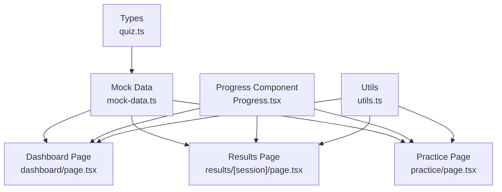
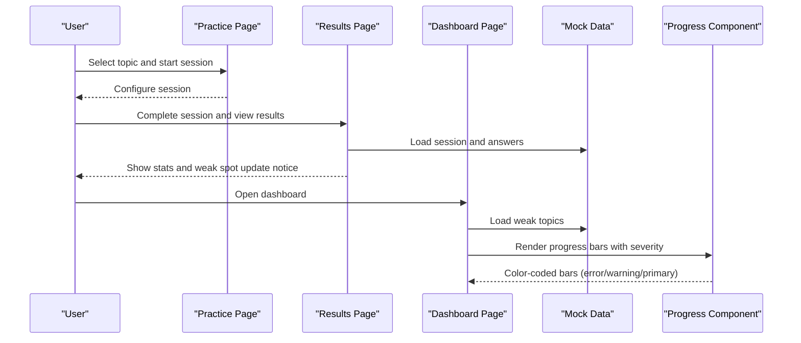
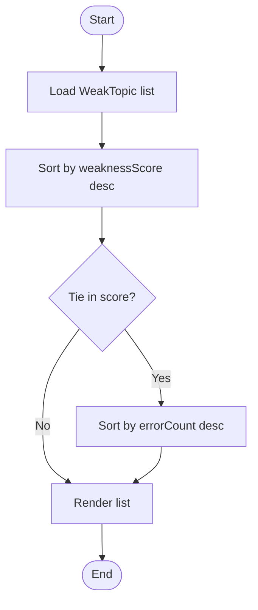
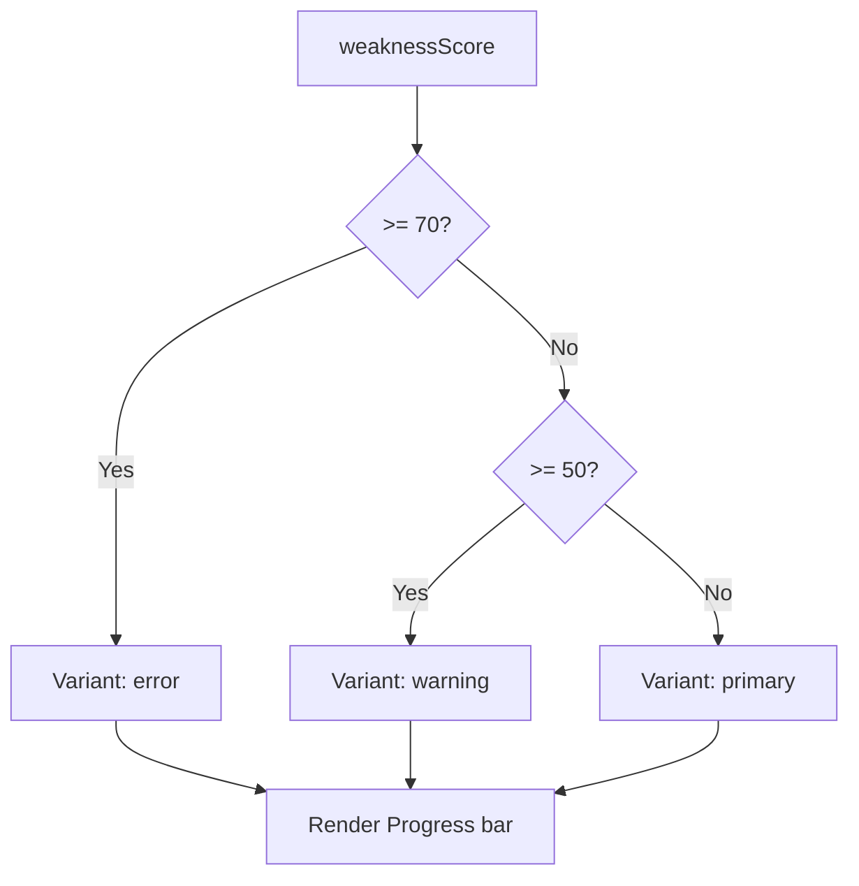
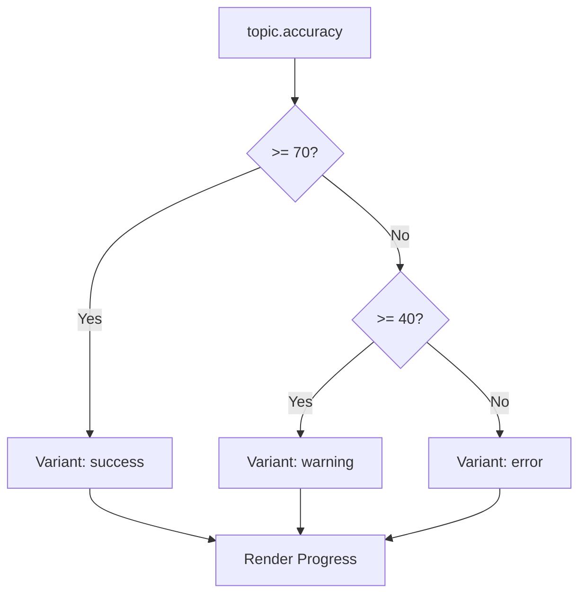
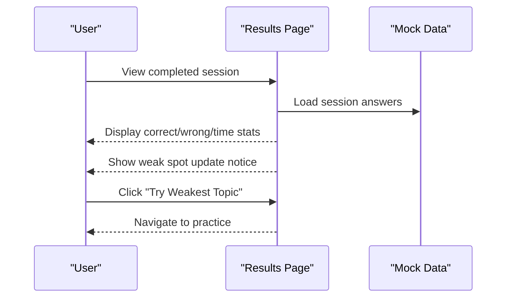
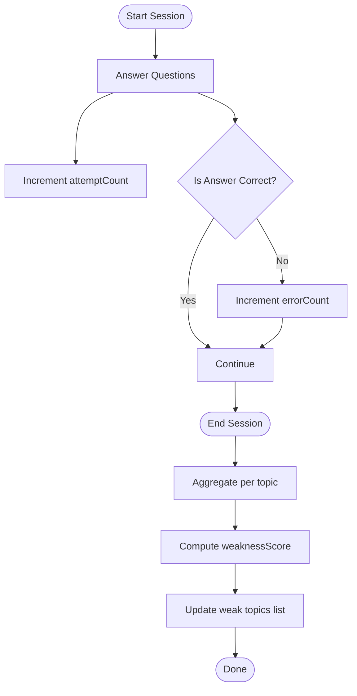
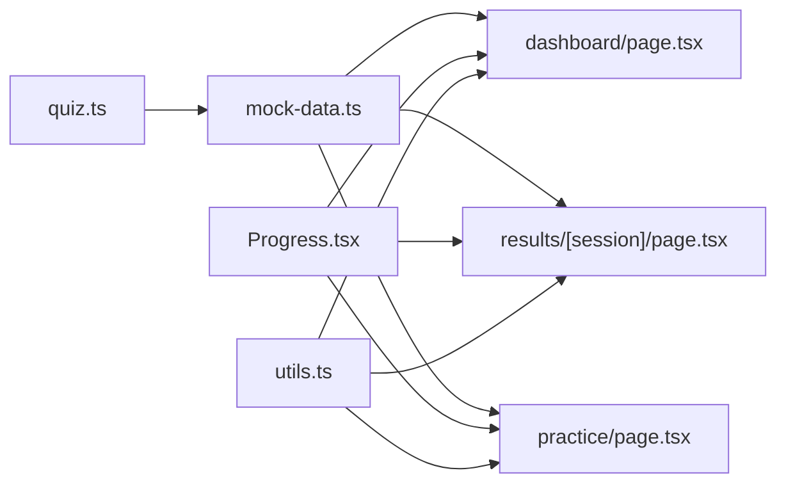

# Weak Spot Identification System

<cite>
**Referenced Files in This Document**
- [quiz.ts](file://src/types/quiz.ts)
- [mock-data.ts](file://src/lib/mock-data.ts)
- [dashboard/page.tsx](file://src/app/dashboard/page.tsx)
- [results/[session]/page.tsx](file://src/app/results/[session]/page.tsx)
- [practice/page.tsx](file://src/app/practice/page.tsx)
- [Progress.tsx](file://src/components/ui/Progress.tsx)
- [utils.ts](file://src/lib/utils.ts)
</cite>

## Table of Contents
1. [Introduction](#introduction)
2. [Project Structure](#project-structure)
3. [Core Components](#core-components)
4. [Architecture Overview](#architecture-overview)
5. [Detailed Component Analysis](#detailed-component-analysis)
6. [Dependency Analysis](#dependency-analysis)
7. [Performance Considerations](#performance-considerations)
8. [Troubleshooting Guide](#troubleshooting-guide)
9. [Conclusion](#conclusion)

## Introduction
This document explains the weak spot identification algorithm and display system used to analyze topics, identify areas needing improvement, and present actionable insights to learners. It covers how topics are evaluated using error counts, attempt counts, and weakness scores; how the weakTopics data structure is organized; how prioritization ranks topics by difficulty and severity; and how visual indicators (progress bars with color-coded severity levels) communicate performance at a glance. It also describes how weak spots are detected and updated after each practice session.

## Project Structure
The weak spot system spans types, mock data, UI components, and pages that render dashboards, results, and practice flows:
- Types define Topic, Question, UserAnswer, QuizSession, and WeakTopic structures.
- Mock data provides sample topics, weak topics, sessions, and user profile for demonstration.
- Dashboard page displays “Topics to Focus On” using WeakTopic entries and progress bars.
- Results page shows session outcomes and indicates when weak spots are updated.
- Practice page lists topics with accuracy and weak badges.
- Progress component renders color-coded severity based on thresholds.
- Utilities provide helper functions for formatting and score coloring.

**Diagram sources**
- [quiz.ts:5-58](file://src/types/quiz.ts#L5-L58)
- [mock-data.ts:15-42](file://src/lib/mock-data.ts#L15-L42)
- [dashboard/page.tsx:90-139](file://src/app/dashboard/page.tsx#L90-L139)
- [results/[session]/page.tsx:129-151](file://src/app/results/[session]/page.tsx#L129-L151)
- [practice/page.tsx:60-112](file://src/app/practice/page.tsx#L60-L112)
- [Progress.tsx:13-18](file://src/components/ui/Progress.tsx#L13-L18)
- [utils.ts:23-33](file://src/lib/utils.ts#L23-L33)

**Section sources**
- [quiz.ts:5-58](file://src/types/quiz.ts#L5-L58)
- [mock-data.ts:15-42](file://src/lib/mock-data.ts#L15-L42)
- [dashboard/page.tsx:90-139](file://src/app/dashboard/page.tsx#L90-L139)
- [results/[session]/page.tsx:129-151](file://src/app/results/[session]/page.tsx#L129-L151)
- [practice/page.tsx:60-112](file://src/app/practice/page.tsx#L60-L112)
- [Progress.tsx:13-18](file://src/components/ui/Progress.tsx#L13-L18)
- [utils.ts:23-33](file://src/lib/utils.ts#L23-L33)

## Core Components
- WeakTopic model: Represents a topic’s weakness with fields for topic name, chapter number, weakness score (0–100), error count, and attempt count.
- Topic model: Includes accuracy and an optional weak flag used in topic cards.
- Progress component: Renders a bar with variant-based colors (primary, success, warning, error).
- Dashboard page: Displays weak topics sorted by weakness score and shows error/attempt ratios.
- Results page: Shows session stats and a notification that weak spots were updated.
- Practice page: Lists topics with accuracy and weak badges.

Key responsibilities:
- Data modeling: Define consistent shapes for topics and weak topics.
- Visualization: Use color-coded progress bars to indicate severity.
- Aggregation: Present aggregated metrics (errorCount, attemptCount, weaknessScore) per topic.
- Feedback: Indicate updates to weak spots post-session.

**Section sources**
- [quiz.ts:5-58](file://src/types/quiz.ts#L5-L58)
- [mock-data.ts:15-42](file://src/lib/mock-data.ts#L15-L42)
- [Progress.tsx:13-18](file://src/components/ui/Progress.tsx#L13-L18)
- [dashboard/page.tsx:90-139](file://src/app/dashboard/page.tsx#L90-L139)
- [results/[session]/page.tsx:129-151](file://src/app/results/[session]/page.tsx#L129-L151)
- [practice/page.tsx:60-112](file://src/app/practice/page.tsx#L60-L112)

## Architecture Overview
The weak spot system integrates data models, mock datasets, and UI components to compute and display weaknesses:
- Data layer: Types and mock data define the domain model and sample values.
- Presentation layer: Pages consume mock data to render dashboards, results, and practice views.
- Component layer: Progress bars and utilities provide consistent visuals and helpers.

**Diagram sources**
- [practice/page.tsx:60-112](file://src/app/practice/page.tsx#L60-L112)
- [results/[session]/page.tsx:129-151](file://src/app/results/[session]/page.tsx#L129-L151)
- [dashboard/page.tsx:90-139](file://src/app/dashboard/page.tsx#L90-L139)
- [mock-data.ts:15-42](file://src/lib/mock-data.ts#L15-L42)
- [Progress.tsx:13-18](file://src/components/ui/Progress.tsx#L13-L18)

## Detailed Component Analysis

### WeakTopic Data Model and Prioritization
- Fields:
  - topic: string
  - chapterNum: number
  - weaknessScore: number (0–100; higher means weaker)
  - errorCount: number
  - attemptCount: number
- Prioritization logic:
  - Topics are ranked primarily by weaknessScore descending to surface the most critical areas first.
  - Secondary sorting can use errorCount or attemptCount to break ties and highlight high-volume failure areas.
  - Difficulty level influences focus recommendations in study plans and action buttons (“Try Weakest Topic”).

**Diagram sources**
- [mock-data.ts:36-42](file://src/lib/mock-data.ts#L36-L42)
- [dashboard/page.tsx:108-136](file://src/app/dashboard/page.tsx#L108-L136)

**Section sources**
- [quiz.ts:52-58](file://src/types/quiz.ts#L52-L58)
- [mock-data.ts:36-42](file://src/lib/mock-data.ts#L36-L42)
- [dashboard/page.tsx:108-136](file://src/app/dashboard/page.tsx#L108-L136)

### Visual Indicators: Progress Bars and Severity Levels
- Severity thresholds for weaknessScore:
  - Error: >= 70%
  - Warning: >= 50%
  - Primary: < 50%
- The Progress component maps these variants to background colors and animates width based on value.
- In the dashboard, each WeakTopic entry uses the appropriate variant to reflect severity.

**Diagram sources**
- [dashboard/page.tsx:120-130](file://src/app/dashboard/page.tsx#L120-L130)
- [Progress.tsx:13-18](file://src/components/ui/Progress.tsx#L13-L18)

**Section sources**
- [dashboard/page.tsx:120-130](file://src/app/dashboard/page.tsx#L120-L130)
- [Progress.tsx:13-18](file://src/components/ui/Progress.tsx#L13-L18)

### Topic Accuracy and Weak Flags in Practice View
- Topic accuracy is displayed via progress bars with thresholds:
  - Success: >= 70%
  - Warning: >= 40%
  - Error: < 40%
- Weak topics are marked with a badge and included in quick-start suggestions.

**Diagram sources**
- [practice/page.tsx:89-109](file://src/app/practice/page.tsx#L89-L109)

**Section sources**
- [practice/page.tsx:89-109](file://src/app/practice/page.tsx#L89-L109)

### Session Results and Weak Spot Updates
- After completing a session, the results page shows:
  - Correct, wrong, and average time metrics.
  - A notification indicating that weak spots were updated for the relevant topic.
- Action buttons allow users to practice again or try the weakest topic.

**Diagram sources**
- [results/[session]/page.tsx:110-151](file://src/app/results/[session]/page.tsx#L110-L151)
- [results/[session]/page.tsx:293-311](file://src/app/results/[session]/page.tsx#L293-L311)

**Section sources**
- [results/[session]/page.tsx:110-151](file://src/app/results/[session]/page.tsx#L110-L151)
- [results/[session]/page.tsx:293-311](file://src/app/results/[session]/page.tsx#L293-L311)

### Real-Time Detection and Update Flow
- During a session, each answer contributes to counters:
  - Attempt count increments per question answered.
  - Error count increments if the answer is incorrect.
- Post-session, the system aggregates these counts per topic and computes a weakness score to reflect performance.
- The dashboard reflects updated weak topics, enabling immediate feedback and targeted practice.

[No sources needed since this diagram shows conceptual workflow, not actual code structure]

## Dependency Analysis
- Types define shared contracts consumed across modules.
- Mock data supplies sample values for all pages and components.
- Dashboard depends on WeakTopic data and Progress component for visualization.
- Results page depends on session data and displays weak spot updates.
- Practice page depends on Topic data and uses Progress for accuracy visualization.
- Utils provide consistent formatting and color logic.

**Diagram sources**
- [quiz.ts:5-58](file://src/types/quiz.ts#L5-L58)
- [mock-data.ts:15-42](file://src/lib/mock-data.ts#L15-L42)
- [dashboard/page.tsx:90-139](file://src/app/dashboard/page.tsx#L90-L139)
- [results/[session]/page.tsx:129-151](file://src/app/results/[session]/page.tsx#L129-L151)
- [practice/page.tsx:60-112](file://src/app/practice/page.tsx#L60-L112)
- [Progress.tsx:13-18](file://src/components/ui/Progress.tsx#L13-L18)
- [utils.ts:23-33](file://src/lib/utils.ts#L23-L33)

**Section sources**
- [quiz.ts:5-58](file://src/types/quiz.ts#L5-L58)
- [mock-data.ts:15-42](file://src/lib/mock-data.ts#L15-L42)
- [dashboard/page.tsx:90-139](file://src/app/dashboard/page.tsx#L90-L139)
- [results/[session]/page.tsx:129-151](file://src/app/results/[session]/page.tsx#L129-L151)
- [practice/page.tsx:60-112](file://src/app/practice/page.tsx#L60-L112)
- [Progress.tsx:13-18](file://src/components/ui/Progress.tsx#L13-L18)
- [utils.ts:23-33](file://src/lib/utils.ts#L23-L33)

## Performance Considerations
- Sorting and filtering operations on small arrays (topics, weak topics) are negligible in cost.
- Rendering progress bars is lightweight; ensure animations do not cause layout thrashing.
- Avoid recomputing derived metrics on every render; memoize where possible if scaling up.
- Keep mock data representative but minimal to reduce bundle size.

[No sources needed since this section provides general guidance]

## Troubleshooting Guide
- Incorrect severity mapping: Verify threshold checks in dashboard and practice pages match intended rules (error >= 70%, warning >= 50%, primary < 50%).
- Missing weak topic updates: Ensure post-session aggregation includes both error and attempt counts and that the dashboard re-renders with updated data.
- Progress bar not reflecting values: Confirm value clamping and variant selection in the Progress component.
- Utility color mismatches: Validate getScoreColor and getScoreBgColor thresholds align with UI expectations.

**Section sources**
- [dashboard/page.tsx:120-130](file://src/app/dashboard/page.tsx#L120-L130)
- [practice/page.tsx:89-109](file://src/app/practice/page.tsx#L89-L109)
- [Progress.tsx:13-18](file://src/components/ui/Progress.tsx#L13-L18)
- [utils.ts:23-33](file://src/lib/utils.ts#L23-L33)

## Conclusion
The weak spot identification system combines clear data models, straightforward prioritization logic, and intuitive visual indicators to help learners focus on areas needing improvement. WeakTopic entries capture essential metrics (topic, chapter, weakness score, error/attempt counts), while progress bars communicate severity effectively. After each session, weak spots are updated and surfaced on the dashboard and results pages, guiding users toward targeted practice. This design balances simplicity with actionable insights, enabling continuous learning and measurable progress.