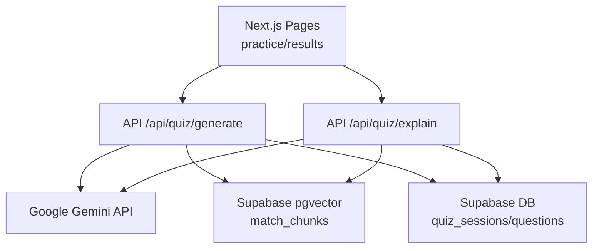
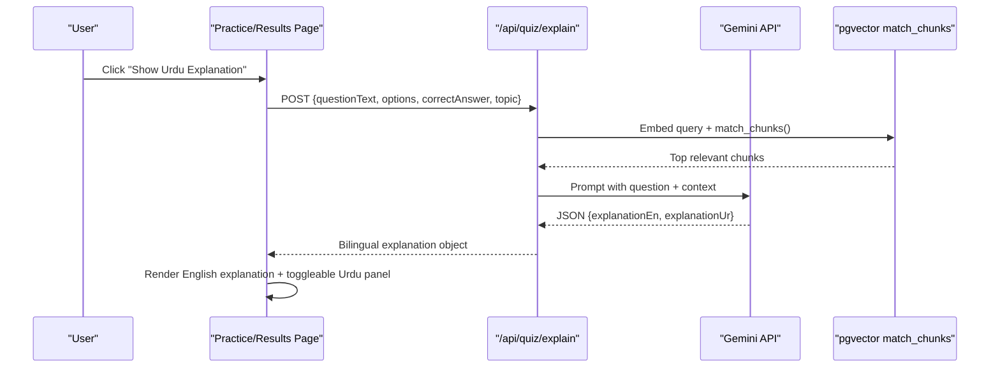
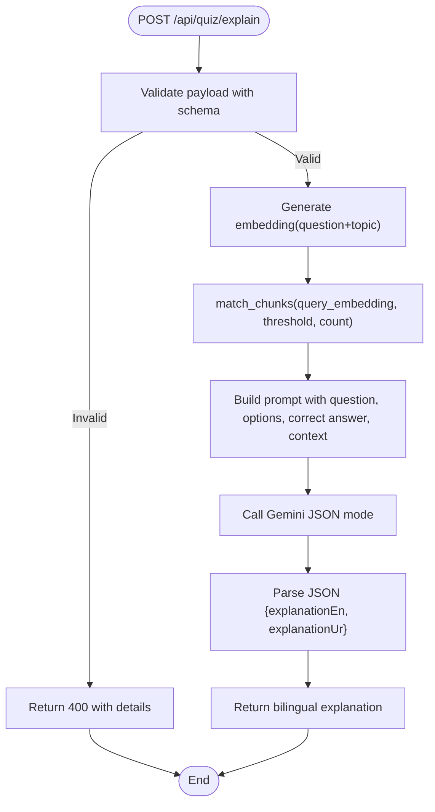
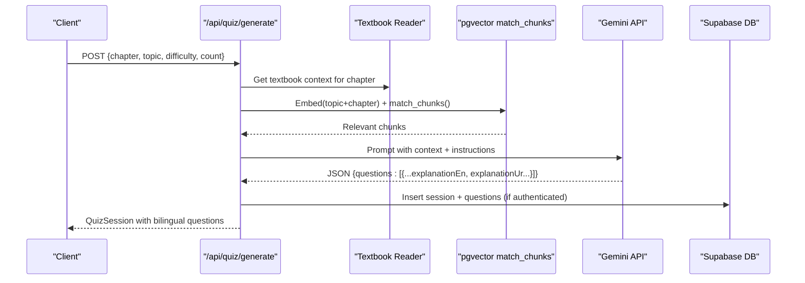
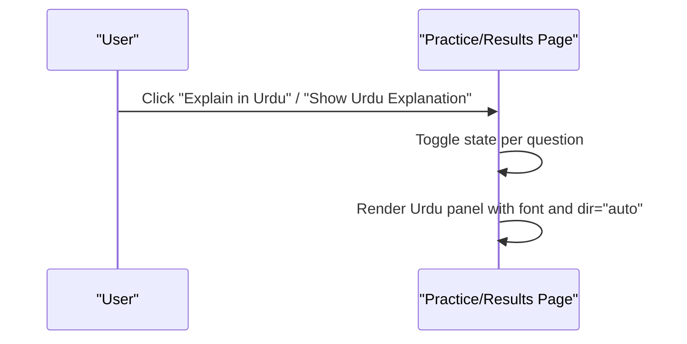
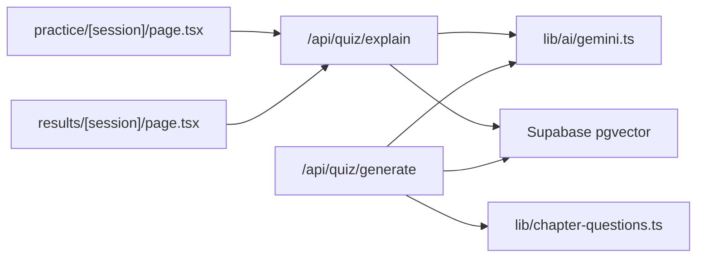

# Multilingual Support

<cite>
**Referenced Files in This Document**
- [README.md](file://README.md)
- [src/app/api/quiz/explain/route.ts](file://src/app/api/quiz/explain/route.ts)
- [src/app/api/quiz/generate/route.ts](file://src/app/api/quiz/generate/route.ts)
- [src/lib/ai/gemini.ts](file://src/lib/ai/gemini.ts)
- [src/lib/validations/schemas.ts](file://src/lib/validations/schemas.ts)
- [src/app/results/[session]/page.tsx](file://src/app/results/[session]/page.tsx)
- [src/app/practice/[session]/page.tsx](file://src/app/practice/[session]/page.tsx)
- [src/app/layout.tsx](file://src/app/layout.tsx)
- [src/app/globals.css](file://src/app/globals.css)
- [src/lib/chapter-questions.ts](file://src/lib/chapter-questions.ts)
</cite>

## Table of Contents
1. [Introduction](#introduction)
2. [Project Structure](#project-structure)
3. [Core Components](#core-components)
4. [Architecture Overview](#architecture-overview)
5. [Detailed Component Analysis](#detailed-component-analysis)
6. [Dependency Analysis](#dependency-analysis)
7. [Performance Considerations](#performance-considerations)
8. [Troubleshooting Guide](#troubleshooting-guide)
9. [Conclusion](#conclusion)

## Introduction
MedAce AI delivers English multiple-choice questions with optional Urdu explanations to support Pakistan’s diverse student population preparing for the MDCAT. The system keeps the exam experience authentic (English interface and MCQs) while providing a culturally appropriate, concept-focused explanation layer in Urdu when students need it. Explanations are generated using Google Gemini API and grounded in textbook content via Retrieval-Augmented Generation (RAG). A per-question toggle lets learners reveal Urdu explanations without disrupting their flow.

## Project Structure
The multilingual capability spans server-side generation and client-side rendering:
- Server endpoints generate or retrieve bilingual explanations (English + Urdu) and return structured JSON.
- Client pages render English content by default and conditionally show Urdu explanations with proper font and direction handling.
- Validation schemas enforce consistent request/response contracts for explain and generate flows.

**Diagram sources**
- [src/app/api/quiz/generate/route.ts:10-187](file://src/app/api/quiz/generate/route.ts#L10-L187)
- [src/app/api/quiz/explain/route.ts:6-78](file://src/app/api/quiz/explain/route.ts#L6-L78)
- [src/lib/ai/gemini.ts:1-60](file://src/lib/ai/gemini.ts#L1-L60)

**Section sources**
- [README.md:27-83](file://README.md#L27-L83)
- [src/app/api/quiz/generate/route.ts:10-187](file://src/app/api/quiz/generate/route.ts#L10-L187)
- [src/app/api/quiz/explain/route.ts:6-78](file://src/app/api/quiz/explain/route.ts#L6-L78)

## Core Components
- Explain endpoint: Produces contextual bilingual explanations for incorrect answers using textbook context and Gemini.
- Generate endpoint: Creates quiz sessions with both English and Urdu explanations grounded in textbook chapters and vector search results.
- Gemini integration: Provides text generation in JSON mode and embedding generation for RAG.
- Validation schemas: Ensure typed, safe payloads for explain and generate requests.
- UI toggles: Per-question buttons to show/hide Urdu explanations with correct fonts and directionality.

**Section sources**
- [src/app/api/quiz/explain/route.ts:6-78](file://src/app/api/quiz/explain/route.ts#L6-L78)
- [src/app/api/quiz/generate/route.ts:10-187](file://src/app/api/quiz/generate/route.ts#L10-L187)
- [src/lib/ai/gemini.ts:1-60](file://src/lib/ai/gemini.ts#L1-L60)
- [src/lib/validations/schemas.ts:27-40](file://src/lib/validations/schemas.ts#L27-L40)
- [src/app/results/[session]/page.tsx:312-344](file://src/app/results/[session]/page.tsx#L312-L344)
- [src/app/practice/[session]/page.tsx:279-302](file://src/app/practice/[session]/page.tsx#L279-L302)

## Architecture Overview
The bilingual pipeline combines RAG retrieval with Gemini generation to produce accurate, syllabus-aligned explanations in both languages.

**Diagram sources**
- [src/app/api/quiz/explain/route.ts:20-69](file://src/app/api/quiz/explain/route.ts#L20-L69)
- [src/lib/ai/gemini.ts:45-59](file://src/lib/ai/gemini.ts#L45-L59)
- [src/app/results/[session]/page.tsx:312-344](file://src/app/results/[session]/page.tsx#L312-L344)

## Detailed Component Analysis

### Explain Endpoint: Contextual Urdu Explanations
- Input validation: Uses a dedicated schema to validate question text, options, correct answer, and optional topic.
- Context retrieval: Generates an embedding from the question and topic, then retrieves top matching textbook chunks via Supabase RPC.
- Prompt engineering: Instructs Gemini to provide an English rationale and a full Urdu translation written in clear script, returning strict JSON.
- Fallbacks: If embeddings or vector search fail, a generic syllabus reference is used; if Gemini fails, user-friendly fallback strings are returned.

**Diagram sources**
- [src/app/api/quiz/explain/route.ts:6-78](file://src/app/api/quiz/explain/route.ts#L6-L78)
- [src/lib/validations/schemas.ts:27-40](file://src/lib/validations/schemas.ts#L27-L40)
- [src/lib/ai/gemini.ts:45-59](file://src/lib/ai/gemini.ts#L45-L59)

**Section sources**
- [src/app/api/quiz/explain/route.ts:6-78](file://src/app/api/quiz/explain/route.ts#L6-L78)
- [src/lib/validations/schemas.ts:27-40](file://src/lib/validations/schemas.ts#L27-L40)
- [src/lib/ai/gemini.ts:45-59](file://src/lib/ai/gemini.ts#L45-L59)

### Generate Endpoint: Bilingual Quiz Creation
- Loads chapter-specific textbook context and optionally augments it with vector-matched chunks.
- Prompts Gemini to generate N MCQs with four options each, including both English and Urdu explanations.
- Maps AI output into session objects and persists them to the database when authenticated.
- Falls back to a local chapter question generator if AI generation is unavailable.

**Diagram sources**
- [src/app/api/quiz/generate/route.ts:10-187](file://src/app/api/quiz/generate/route.ts#L10-L187)
- [src/lib/ai/gemini.ts:45-59](file://src/lib/ai/gemini.ts#L45-L59)

**Section sources**
- [src/app/api/quiz/generate/route.ts:10-187](file://src/app/api/quiz/generate/route.ts#L10-L187)

### Language Switching Functionality
- Practice page: A per-question button toggles a panel that shows the Urdu explanation alongside the English question.
- Results page: Each expanded question includes an explanation block and a toggle to reveal the Urdu explanation.
- Both implementations use a right-to-left friendly approach for Urdu text rendering.

**Diagram sources**
- [src/app/practice/[session]/page.tsx:279-302](file://src/app/practice/[session]/page.tsx#L279-L302)
- [src/app/results/[session]/page.tsx:312-344](file://src/app/results/[session]/page.tsx#L312-L344)

**Section sources**
- [src/app/practice/[session]/page.tsx:279-302](file://src/app/practice/[session]/page.tsx#L279-L302)
- [src/app/results/[session]/page.tsx:312-344](file://src/app/results/[session]/page.tsx#L312-L344)

### Translation Quality Assurance and Cultural Adaptation
- Grounded content: Explanations are built on retrieved textbook chunks to ensure alignment with the MDCAT syllabus and avoid hallucination.
- Structured prompts: Explicit instructions require an English rationale and a full Urdu translation in clear script, preserving technical terms where appropriate.
- Strict JSON contract: Gemini responses are parsed into typed objects, ensuring both language fields are present and consistently named.
- Fallbacks: When AI or vector search fails, the system returns safe defaults so the UI remains functional.

Implementation anchors:
- Prompt construction and JSON parsing for bilingual outputs.
- Vector similarity search to constrain explanations to syllabus-aligned content.
- Zod schemas to enforce input correctness before calling AI.

**Section sources**
- [src/app/api/quiz/explain/route.ts:20-69](file://src/app/api/quiz/explain/route.ts#L20-L69)
- [src/app/api/quiz/generate/route.ts:55-107](file://src/app/api/quiz/generate/route.ts#L55-L107)
- [src/lib/ai/gemini.ts:45-59](file://src/lib/ai/gemini.ts#L45-L59)
- [src/lib/validations/schemas.ts:27-40](file://src/lib/validations/schemas.ts#L27-L40)

### Subject-Specific Terminology and Consistency
- Technical terms remain in English within explanations to mirror exam conditions, while reasoning is explained in Urdu for clarity.
- Chapter-based question sets include pre-bilingual explanations across multiple subjects, demonstrating consistent terminology usage.
- RAG ensures subject relevance by retrieving only the most pertinent textbook segments before prompting Gemini.

Examples of consistent bilingual pairs can be observed in the chapter question dataset.

**Section sources**
- [src/lib/chapter-questions.ts:14-101](file://src/lib/chapter-questions.ts#L14-L101)
- [src/lib/chapter-questions.ts:103-175](file://src/lib/chapter-questions.ts#L103-L175)
- [src/lib/chapter-questions.ts:177-235](file://src/lib/chapter-questions.ts#L177-L235)

### Accessibility and RTL Rendering for Urdu
- Font support: The project defines a dedicated Urdu font family and loads it via CSS @font-face.
- Directionality: Urdu panels use dir="auto" to let the browser choose the correct text direction based on content.
- Layout: The root layout uses left-to-right direction for the overall app, while individual Urdu blocks render correctly due to auto direction and font settings.

**Section sources**
- [src/app/globals.css:38-71](file://src/app/globals.css#L38-L71)
- [src/app/layout.tsx:44-56](file://src/app/layout.tsx#L44-L56)
- [src/app/results/[session]/page.tsx:335-344](file://src/app/results/[session]/page.tsx#L335-L344)
- [src/app/practice/[session]/page.tsx:295-302](file://src/app/practice/[session]/page.tsx#L295-L302)

## Dependency Analysis
Key dependencies and relationships:
- API routes depend on Gemini utilities for generation and embeddings.
- Explain and generate routes rely on Supabase for vector search and persistence.
- Frontend components consume API responses and render bilingual content with appropriate styling and direction.

**Diagram sources**
- [src/app/api/quiz/explain/route.ts:1-78](file://src/app/api/quiz/explain/route.ts#L1-L78)
- [src/app/api/quiz/generate/route.ts:1-187](file://src/app/api/quiz/generate/route.ts#L1-L187)
- [src/lib/ai/gemini.ts:1-60](file://src/lib/ai/gemini.ts#L1-L60)
- [src/lib/chapter-questions.ts:1-12](file://src/lib/chapter-questions.ts#L1-L12)

**Section sources**
- [src/app/api/quiz/explain/route.ts:1-78](file://src/app/api/quiz/explain/route.ts#L1-L78)
- [src/app/api/quiz/generate/route.ts:1-187](file://src/app/api/quiz/generate/route.ts#L1-L187)
- [src/lib/ai/gemini.ts:1-60](file://src/lib/ai/gemini.ts#L1-L60)
- [src/lib/chapter-questions.ts:1-12](file://src/lib/chapter-questions.ts#L1-L12)

## Performance Considerations
- Vector search limits: The explain endpoint retrieves a small number of chunks to keep latency low while still providing relevant context.
- Prompt size control: Textbook context is truncated to a reasonable length to fit within model constraints and reduce response time.
- JSON mode: Using Gemini’s JSON mode reduces parsing overhead and improves reliability of bilingual outputs.
- Fallback paths: Graceful degradation ensures the UI remains usable even when external services are slow or unavailable.

[No sources needed since this section provides general guidance]

## Troubleshooting Guide
Common issues and resolutions:
- Missing API key: If the Gemini API key is not configured, generation/embedding calls will throw errors. Ensure environment variables are set.
- Invalid request payload: The explain endpoint validates inputs; missing or malformed fields return a 400 error with details.
- Vector search failures: If embeddings or match_chunks fail, the endpoint falls back to a generic syllabus reference to continue generating explanations.
- UI not showing Urdu: Verify that the per-question toggle is active and that the Urdu panel renders with the correct font and direction attributes.

**Section sources**
- [src/lib/ai/gemini.ts:6-8](file://src/lib/ai/gemini.ts#L6-L8)
- [src/lib/ai/gemini.ts:29-43](file://src/lib/ai/gemini.ts#L29-L43)
- [src/app/api/quiz/explain/route.ts:7-16](file://src/app/api/quiz/explain/route.ts#L7-L16)
- [src/app/api/quiz/explain/route.ts:20-35](file://src/app/api/quiz/explain/route.ts#L20-L35)
- [src/app/results/[session]/page.tsx:335-344](file://src/app/results/[session]/page.tsx#L335-L344)

## Conclusion
MedAce AI’s multilingual support blends authentic English exam practice with on-demand, culturally appropriate Urdu explanations. By grounding explanations in textbook content and leveraging Gemini’s bilingual capabilities, the system maintains academic rigor while improving comprehension. The per-question language toggle preserves learning flow, and robust validation and fallbacks ensure reliability. Together, these features make high-quality MDCAT preparation accessible to a broader audience across Pakistan.