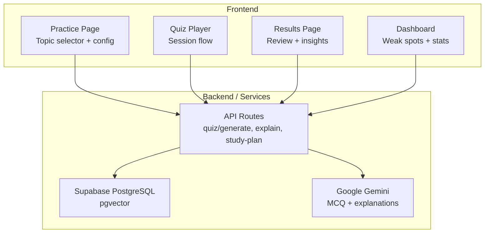
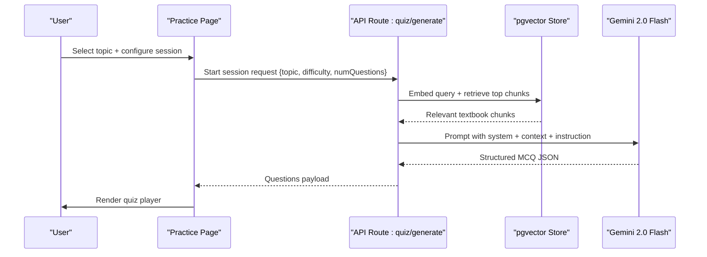
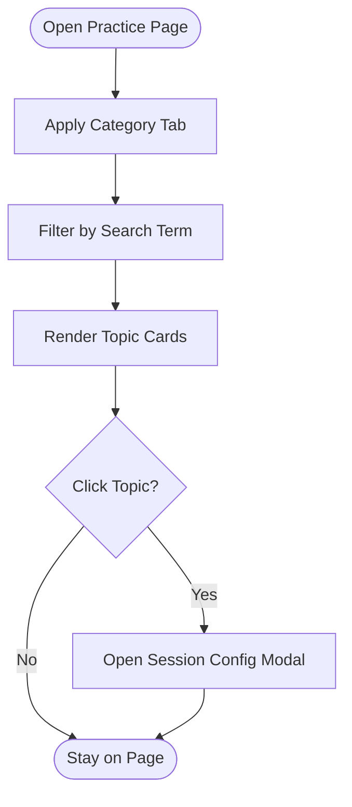
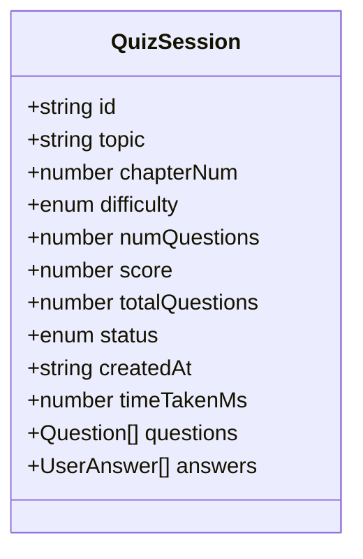
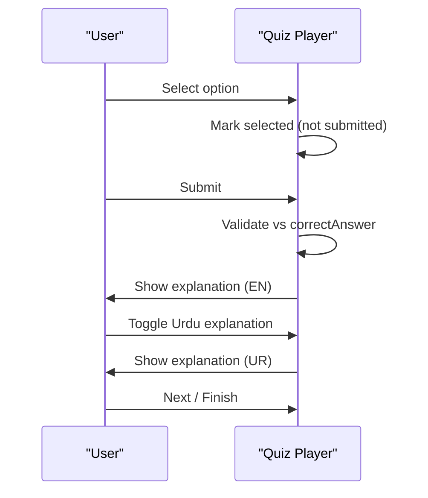
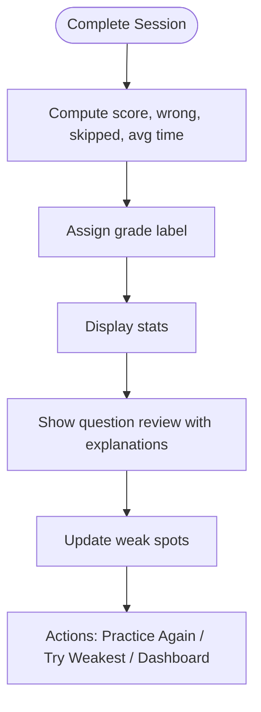
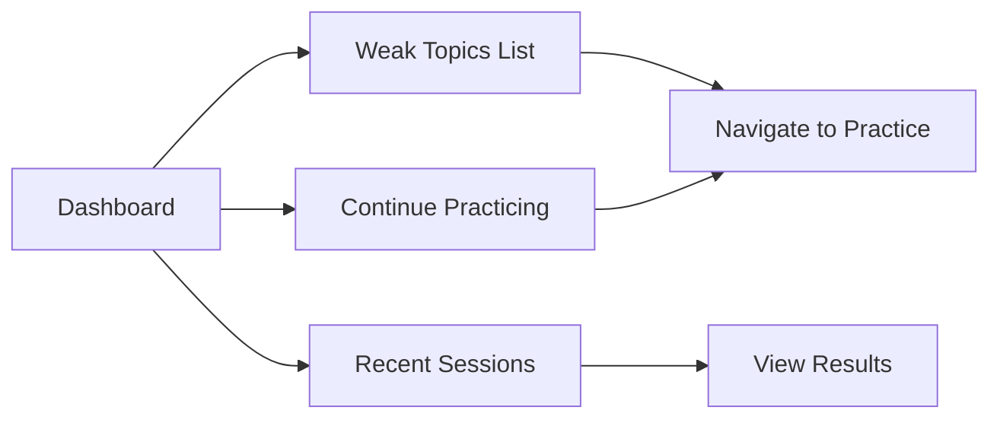
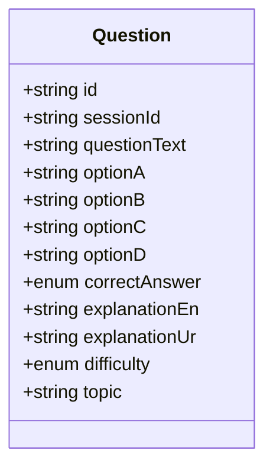
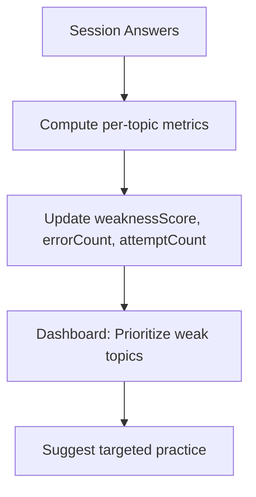
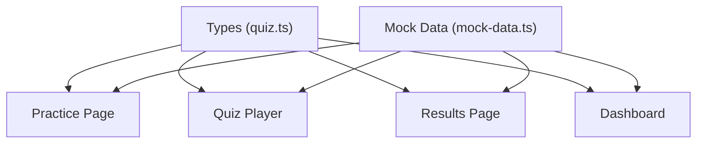

# Practice Engine

<cite>
**Referenced Files in This Document**
- [README.md](file://README.md)
- [practice page.tsx](file://src/app/practice/page.tsx)
- [session player page.tsx](file://src/app/practice/[session]/page.tsx)
- [results page.tsx](file://src/app/results/[session]/page.tsx)
- [dashboard page.tsx](file://src/app/dashboard/page.tsx)
- [quiz types.ts](file://src/types/quiz.ts)
- [mock data.ts](file://src/lib/mock-data.ts)
</cite>

## Table of Contents
1. Introduction
2. Project Structure
3. Core Components
4. Architecture Overview
5. Detailed Component Analysis
6. Dependency Analysis
7. Performance Considerations
8. Troubleshooting Guide
9. Conclusion
10. Appendices

## Introduction
MedAce AI’s Practice Engine is an adaptive, bilingual MDCAT preparation system that generates MCQs grounded in real textbook content using Retrieval-Augmented Generation (RAG). It provides:
- A topic selection interface with category filtering and search
- Session configuration (difficulty levels, question count, timer)
- AI-powered question generation from textbook chapters via RAG
- Bilingual support: English MCQs with Urdu explanations on demand
- Real-time feedback during practice sessions
- Progress tracking and weak spot identification to drive adaptive learning

The engine mirrors the exam experience (English interface and questions) while offering Urdu explanations when students need conceptual clarity.

## Project Structure
The application is a Next.js 15 App Router project with TypeScript, Tailwind CSS v4, Supabase for auth/database/vector store, and Google Gemini for generation and embeddings. The key UI flows for the Practice Engine are:
- Topic selection and session configuration: src/app/practice/page.tsx
- In-session quiz player: src/app/practice/[session]/page.tsx
- Results and review: src/app/results/[session]/page.tsx
- Dashboard with weak spots and stats: src/app/dashboard/page.tsx
- Shared types and mock data: src/types/quiz.ts, src/lib/mock-data.ts
- RAG pipeline documentation and architecture: README.md

**Diagram sources**
- [README.md:23-77](file://README.md#L23-L77)
- [README.md:163-226](file://README.md#L163-L226)

**Section sources**
- [README.md:23-77](file://README.md#L23-L77)
- [README.md:163-226](file://README.md#L163-L226)

## Core Components
- Topic Selection Interface: Category tabs (Human Physiology, Modern Topics, Pharmacology), search by chapter name, weak spot badges, accuracy progress bars.
- Session Configuration Modal: Difficulty (Easy/Medium/Hard/Mixed), number of questions (5/10/15/20), optional timer toggle (60 seconds per question).
- Quiz Player: Question display, option selection, submit/next navigation, per-question timer, post-answer explanation (English), on-demand Urdu explanation toggle.
- Results Review: Score summary, correct/wrong/skipped breakdown, average time, expandable question review with explanations and Urdu toggles, weak spot update notification.
- Dashboard: Overall stats, weak topics list with weakness scores, recent sessions, quick-start cards for continued practice.

**Section sources**
- [practice page.tsx:11-195](file://src/app/practice/page.tsx#L11-L195)
- [session player page.tsx:18-352](file://src/app/practice/[session]/page.tsx#L18-L352)
- [results page.tsx:21-315](file://src/app/results/[session]/page.tsx#L21-L315)
- [dashboard page.tsx:21-239](file://src/app/dashboard/page.tsx#L21-L239)

## Architecture Overview
The Practice Engine uses a RAG pipeline to generate syllabus-aligned MCQs:
- Build-time indexing: Textbooks are cleaned, chunked by SLO codes/headings, embedded with text-embedding-004, and stored in pgvector.
- Query-time generation: On session start, the query (topic + difficulty context) is embedded; top relevant chunks are retrieved via cosine similarity; a Gemini prompt builds structured MCQ JSON (question, options, answer, explanation_en, explanation_ur); output is validated and served.

**Diagram sources**
- [README.md:79-122](file://README.md#L79-L122)

**Section sources**
- [README.md:79-122](file://README.md#L79-L122)

## Detailed Component Analysis

### Topic Selection Interface
- Category Filtering: Tabs for All, Human Physiology, Modern Topics, Pharmacology.
- Search Functionality: Filter chapters by name.
- Weak Spot Identification: Badges indicate weak topics; accuracy progress shows performance per chapter.
- Navigation: Clicking a topic opens the session configuration modal.

**Diagram sources**
- [practice page.tsx:11-118](file://src/app/practice/page.tsx#L11-L118)

**Section sources**
- [practice page.tsx:11-118](file://src/app/practice/page.tsx#L11-L118)

### Session Configuration System
- Difficulty Levels: Easy, Medium, Hard, Mixed (Recommended).
- Question Count Options: 5 (Quick), 10 (Standard), 15 (Extended), 20 (Full Session).
- Timer Settings: Toggle for 60 seconds per question.
- AI Note: Indicates questions are generated from real textbook content via RAG.

**Diagram sources**
- [quiz types.ts:37-50](file://src/types/quiz.ts#L37-L50)

**Section sources**
- [practice page.tsx:120-195](file://src/app/practice/page.tsx#L120-L195)
- [quiz types.ts:37-50](file://src/types/quiz.ts#L37-L50)

### Quiz Player and Practice Flow
- State Management: Tracks current question index, selected answers, submission state, Urdu explanation visibility, exit confirmation, and per-question timer.
- Answer Validation: Compares selected option against correct answer after submission; highlights correct/incorrect options.
- Real-Time Feedback: Shows English explanation post-submission; Urdu explanation available via toggle.
- Navigation: Previous/Next buttons, question dots for quick jumps, Finish Quiz at last question.
- Timer: Countdown per question; resets on question change; visual urgency when low.

**Diagram sources**
- [session player page.tsx:57-86](file://src/app/practice/[session]/page.tsx#L57-L86)
- [session player page.tsx:88-108](file://src/app/practice/[session]/page.tsx#L88-L108)
- [session player page.tsx:185-267](file://src/app/practice/[session]/page.tsx#L185-L267)

**Section sources**
- [session player page.tsx:18-352](file://src/app/practice/[session]/page.tsx#L18-L352)

### Results and Progress Tracking
- Score Summary: Circular score display, grade label based on percentage.
- Stats: Correct/Wrong counts, average time per question.
- Weak Spot Update: Notification indicating improvement or areas needing focus.
- Question Review: Expandable items showing options, correct answer, explanations (EN), and Urdu toggle.
- Actions: Practice Again, Try Weakest Topic, return to Dashboard.

**Diagram sources**
- [results page.tsx:28-151](file://src/app/results/[session]/page.tsx#L28-L151)
- [results page.tsx:153-315](file://src/app/results/[session]/page.tsx#L153-L315)

**Section sources**
- [results page.tsx:21-315](file://src/app/results/[session]/page.tsx#L21-L315)

### Dashboard and Weak Spots
- Metrics: Total questions, accuracy rate, sessions completed, study streak.
- Weak Topics: Ranked by weakness score with error/attempt counts; progress bars indicate severity.
- Recent Sessions: Quick links to detailed results.
- Continue Practicing: Cards for weak or attempted topics to resume practice.

**Diagram sources**
- [dashboard page.tsx:47-178](file://src/app/dashboard/page.tsx#L47-L178)
- [dashboard page.tsx:180-239](file://src/app/dashboard/page.tsx#L180-L239)

**Section sources**
- [dashboard page.tsx:21-239](file://src/app/dashboard/page.tsx#L21-L239)

### Bilingual Support System
- English MCQs: Interface and questions remain in English to mirror exam conditions.
- Urdu Explanations: Available on demand during practice and in results review; supports code-mixed technical terms.
- Implementation: Each question includes explanationEn and explanationUr fields; UI toggles reveal Urdu content.

**Diagram sources**
- [quiz types.ts:15-28](file://src/types/quiz.ts#L15-L28)

**Section sources**
- [session player page.tsx:190-213](file://src/app/practice/[session]/page.tsx#L190-L213)
- [results page.tsx:252-284](file://src/app/results/[session]/page.tsx#L252-L284)
- [quiz types.ts:15-28](file://src/types/quiz.ts#L15-L28)

### Adaptive Algorithms and Weak Spot Identification
- Weak Spot Tracking: Per-topic metrics include weaknessScore, errorCount, attemptCount; displayed in dashboard and updated post-session.
- Adaptive Focus: Results screen suggests practicing weakest topics; dashboard prioritizes weak areas in “Topics to Focus On.”
- Difficulty Adjustment: While the UI exposes difficulty selection, the documented RAG pipeline integrates difficulty context into retrieval and generation to tailor question complexity.

**Diagram sources**
- [dashboard page.tsx:90-178](file://src/app/dashboard/page.tsx#L90-L178)
- [results page.tsx:129-151](file://src/app/results/[session]/page.tsx#L129-L151)
- [README.md:79-122](file://README.md#L79-L122)

**Section sources**
- [dashboard page.tsx:90-178](file://src/app/dashboard/page.tsx#L90-L178)
- [results page.tsx:129-151](file://src/app/results/[session]/page.tsx#L129-L151)
- [README.md:79-122](file://README.md#L79-L122)

## Dependency Analysis
- Frontend Pages depend on shared UI components and mock data during development; production will integrate API routes for live data.
- Types define contracts for Question, UserAnswer, QuizSession, WeakTopic, StudyPlan, UserProfile, ensuring consistency across UI and backend.
- Mock data provides realistic datasets for topics, questions, sessions, weak topics, and user profile to demonstrate flows.

**Diagram sources**
- [quiz types.ts:1-107](file://src/types/quiz.ts#L1-L107)
- [mock data.ts:1-313](file://src/lib/mock-data.ts#L1-L313)

**Section sources**
- [quiz types.ts:1-107](file://src/types/quiz.ts#L1-L107)
- [mock data.ts:1-313](file://src/lib/mock-data.ts#L1-L313)

## Performance Considerations
- RAG Retrieval Efficiency: Using pgvector cosine similarity over top-k chunks minimizes LLM context size and latency.
- Chunking Strategy: ~400–600 tokens per chunk with overlap improves relevance without overwhelming prompts.
- Client-Side Timers: Lightweight interval-based countdown avoids server load; reset on question change ensures fairness.
- UI Responsiveness: Conditional rendering of explanations and toggles reduces unnecessary re-renders.

[No sources needed since this section provides general guidance]

## Troubleshooting Guide
- No Chapters Match Search: Ensure search term matches chapter names; verify category tab selection.
- Timer Not Resetting: Confirm effect dependencies reset timer on question change; check for stale intervals.
- Urdu Explanation Not Showing: Verify explanationUr field exists; ensure toggle state is managed correctly.
- Exit Confirmation: Use modal to prevent accidental loss of progress; confirm navigation to dashboard.

**Section sources**
- [practice page.tsx:114-118](file://src/app/practice/page.tsx#L114-L118)
- [session player page.tsx:42-55](file://src/app/practice/[session]/page.tsx#L42-L55)
- [session player page.tsx:319-348](file://src/app/practice/[session]/page.tsx#L319-L348)

## Conclusion
MedAce AI’s Practice Engine delivers a robust, adaptive, and bilingual practice experience aligned with MDCAT standards. Its RAG-driven question generation ensures syllabus fidelity, while weak spot tracking and targeted recommendations personalize learning paths. The UI provides clear controls for topic selection, session configuration, and real-time feedback, making it accessible and effective for diverse learners.

[No sources needed since this section summarizes without analyzing specific files]

## Appendices
- Environment Setup: Configure Supabase, Gemini API keys, and database credentials as outlined in the README.
- RAG Indexing: Run cleaning, chunking, embedding, and upload scripts to build the vector index before use.

**Section sources**
- [README.md:228-244](file://README.md#L228-L244)
- [README.md:292-314](file://README.md#L292-L314)