# Practice Session Flow

<cite>
**Referenced Files in This Document**
- [practice/page.tsx](file://src/app/practice/page.tsx)
- [practice/[session]/page.tsx](file://src/app/practice/%5Bsession%5D/page.tsx)
- [results/[session]/page.tsx](file://src/app/results/%5Bsession%5D/page.tsx)
- [types/quiz.ts](file://src/types/quiz.ts)
- [mock-data.ts](file://src/lib/mock-data.ts)
- [utils.ts](file://src/lib/utils.ts)
- [Providers.tsx](file://src/components/Providers.tsx)
- [AuthProvider.tsx](file://src/components/auth/AuthProvider.tsx)
- [middleware.ts](file://src/middleware.ts)
- [README.md](file://README.md)
</cite>

## Table of Contents
1. [Introduction](#introduction)
2. [Project Structure](#project-structure)
3. [Core Components](#core-components)
4. [Architecture Overview](#architecture-overview)
5. [Detailed Component Analysis](#detailed-component-analysis)
6. [Dependency Analysis](#dependency-analysis)
7. [Performance Considerations](#performance-considerations)
8. [Troubleshooting Guide](#troubleshooting-guide)
9. [Conclusion](#conclusion)
10. [Appendices](#appendices)

## Introduction
This document explains the practice session flow in MedAce AI’s adaptive learning system. It covers the full lifecycle from topic selection and session configuration, through question delivery and answer handling, to completion and results review. It also documents bilingual support (English MCQs with Urdu explanations), progress tracking, scoring, time management, error handling, loading states, session persistence considerations, and the RAG-based integration for generating questions from textbook content.

## Project Structure
The practice session spans three primary pages:
- Topic selection and session configuration: src/app/practice/page.tsx
- Active quiz player: src/app/practice/[session]/page.tsx
- Results and review: src/app/results/[session]/page.tsx

Supporting assets include shared types, mock data used during development, utility helpers, providers, middleware, and project documentation describing the RAG pipeline and architecture.

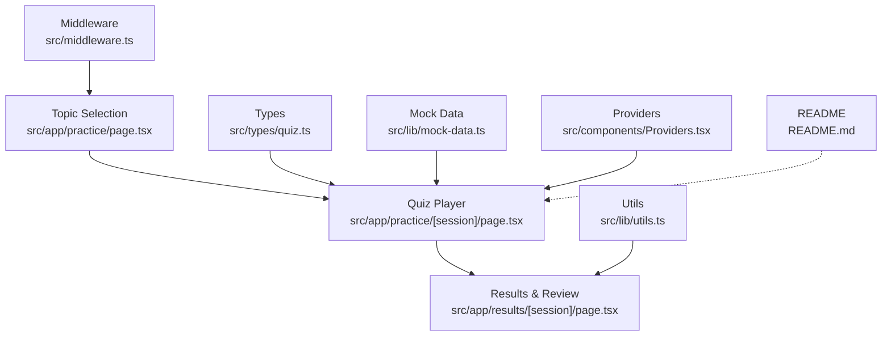

**Diagram sources**
- [practice/page.tsx:18-195](file://src/app/practice/page.tsx#L18-L195)
- [practice/[session]/page.tsx:25-352](file://src/app/practice/%5Bsession%5D/page.tsx#L25-L352)
- [results/[session]/page.tsx:28-315](file://src/app/results/%5Bsession%5D/page.tsx#L28-L315)
- [types/quiz.ts:15-50](file://src/types/quiz.ts#L15-L50)
- [mock-data.ts:69-227](file://src/lib/mock-data.ts#L69-L227)
- [utils.ts:17-33](file://src/lib/utils.ts#L17-L33)
- [Providers.tsx:7-22](file://src/components/Providers.tsx#L7-L22)
- [middleware.ts:14-36](file://src/middleware.ts#L14-L36)
- [README.md:79-122](file://README.md#L79-L122)

**Section sources**
- [practice/page.tsx:18-195](file://src/app/practice/page.tsx#L18-L195)
- [practice/[session]/page.tsx:25-352](file://src/app/practice/%5Bsession%5D/page.tsx#L25-L352)
- [results/[session]/page.tsx:28-315](file://src/app/results/%5Bsession%5D/page.tsx#L28-L315)
- [types/quiz.ts:15-50](file://src/types/quiz.ts#L15-L50)
- [mock-data.ts:69-227](file://src/lib/mock-data.ts#L69-L227)
- [utils.ts:17-33](file://src/lib/utils.ts#L17-L33)
- [Providers.tsx:7-22](file://src/components/Providers.tsx#L7-L22)
- [middleware.ts:14-36](file://src/middleware.ts#L14-L36)
- [README.md:79-122](file://README.md#L79-L122)

## Core Components
- Topic selector and session configuration: filters topics by category/search, opens a modal to choose difficulty, number of questions, and timer behavior; indicates AI-generated questions via RAG.
- Quiz player: renders one question at a time, handles option selection, submission, navigation, per-question timer, bilingual explanation toggle, and exit confirmation.
- Results page: displays score, stats, weak-spot updates, and detailed question review with tabs and bilingual explanations.
- Shared types define Question, UserAnswer, QuizSession, and related models.
- Mock data provides sample topics, questions, and completed sessions for UI flows.
- Utilities provide formatting helpers and score color logic.
- Providers set up global state and toast infrastructure.
- Middleware protects routes and can enforce authentication when wired.

**Section sources**
- [practice/page.tsx:18-195](file://src/app/practice/page.tsx#L18-L195)
- [practice/[session]/page.tsx:25-352](file://src/app/practice/%5Bsession%5D/page.tsx#L25-L352)
- [results/[session]/page.tsx:28-315](file://src/app/results/%5Bsession%5D/page.tsx#L28-L315)
- [types/quiz.ts:15-50](file://src/types/quiz.ts#L15-L50)
- [mock-data.ts:69-227](file://src/lib/mock-data.ts#L69-L227)
- [utils.ts:17-33](file://src/lib/utils.ts#L17-L33)
- [Providers.tsx:7-22](file://src/components/Providers.tsx#L7-L22)
- [middleware.ts:14-36](file://src/middleware.ts#L14-L36)

## Architecture Overview
The practice session is a client-side flow driven by React components and Next.js routing. During development, questions are sourced from mock data; the README describes how production will generate questions using RAG over textbook content via Gemini embeddings and pgvector retrieval.

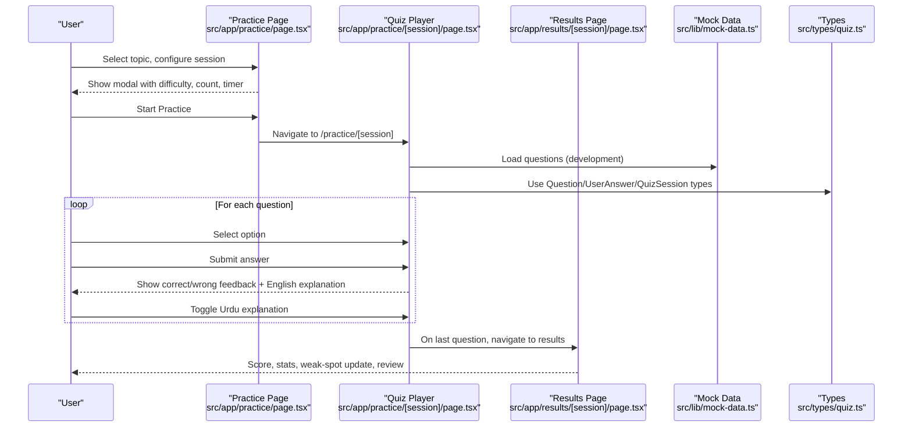

**Diagram sources**
- [practice/page.tsx:120-195](file://src/app/practice/page.tsx#L120-L195)
- [practice/[session]/page.tsx:25-352](file://src/app/practice/%5Bsession%5D/page.tsx#L25-L352)
- [results/[session]/page.tsx:28-315](file://src/app/results/%5Bsession%5D/page.tsx#L28-L315)
- [mock-data.ts:69-227](file://src/lib/mock-data.ts#L69-L227)
- [types/quiz.ts:15-50](file://src/types/quiz.ts#L15-L50)
- [README.md:79-122](file://README.md#L79-L122)

## Detailed Component Analysis

### Topic Selection and Session Configuration
- Filters topics by category and search text.
- Displays accuracy badges and weak-topic indicators.
- Opens a modal to configure:
  - Difficulty: Easy, Medium, Hard, Mixed
  - Number of questions: 5, 10, 15, 20
  - Timer: 60 seconds per question (toggle present)
- Indicates that questions are AI-generated from real textbook content using RAG retrieval.

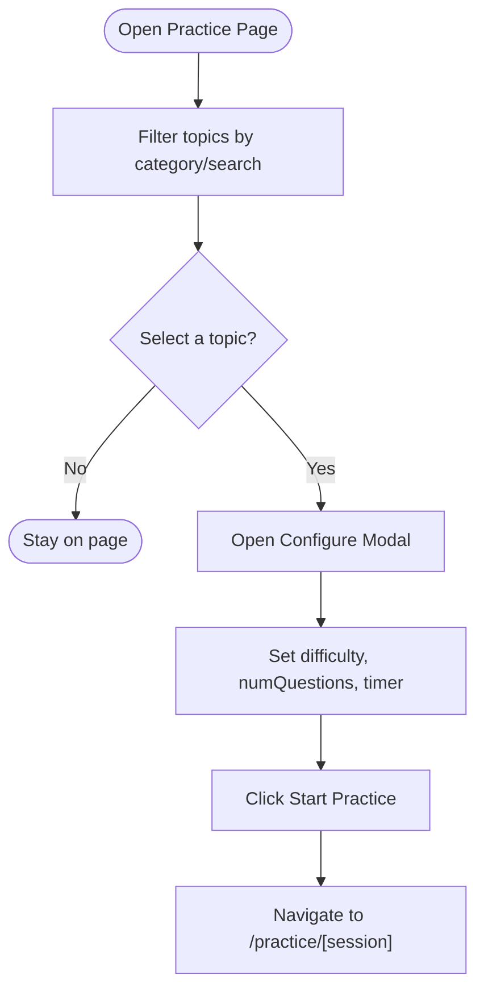

**Diagram sources**
- [practice/page.tsx:25-118](file://src/app/practice/page.tsx#L25-L118)
- [practice/page.tsx:120-195](file://src/app/practice/page.tsx#L120-L195)

**Section sources**
- [practice/page.tsx:25-195](file://src/app/practice/page.tsx#L25-L195)

### Quiz Player: Question Rendering, Answer Handling, Validation, and Navigation
- Renders current question with difficulty badge and question number.
- Provides four options (A–D) with visual feedback before and after submission.
- Tracks user answers in local state keyed by question ID.
- Validates submission: requires a selected option; prevents re-submission.
- Shows English explanation immediately after submission; offers Urdu explanation toggle per question.
- Per-question countdown timer (60 seconds); resets on question change; stops after submission.
- Navigation: Previous/Next buttons; question dots indicate status (answered correct/wrong/unanswered).
- Exit confirmation warns about lost progress and navigates back to dashboard if confirmed.

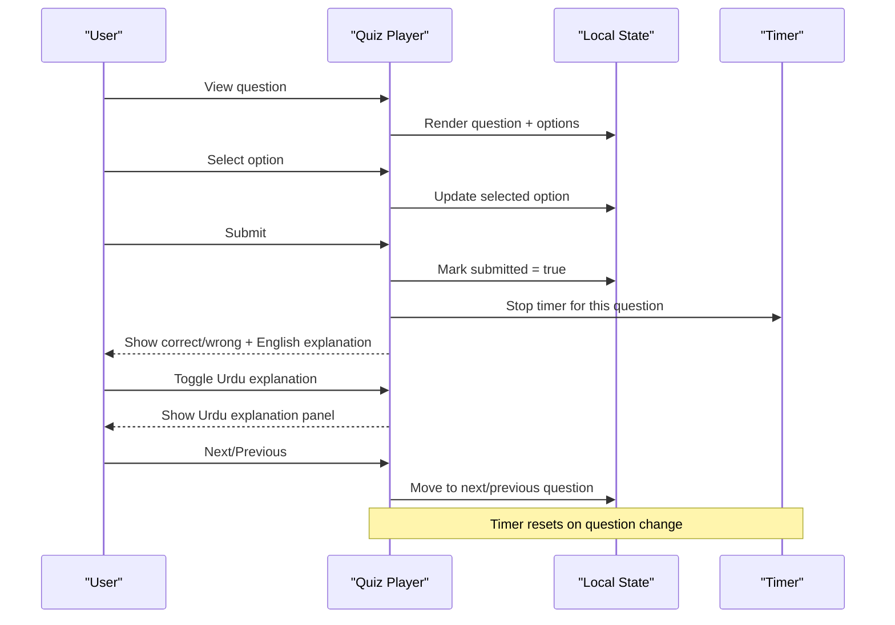

**Diagram sources**
- [practice/[session]/page.tsx:25-352](file://src/app/practice/%5Bsession%5D/page.tsx#L25-L352)

**Section sources**
- [practice/[session]/page.tsx:25-352](file://src/app/practice/%5Bsession%5D/page.tsx#L25-L352)

### Results and Review
- Computes score percentage and grade label based on performance thresholds.
- Displays circular score visualization, counts of correct/wrong/skipped, and average time per question.
- Highlights weak-spot updates and suggests targeted follow-up practice.
- Provides tabbed review (All, Correct, Wrong, Skipped) with expandable details showing options, correctness, and bilingual explanations.

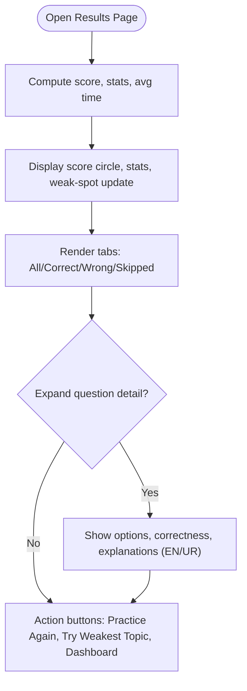

**Diagram sources**
- [results/[session]/page.tsx:28-315](file://src/app/results/%5Bsession%5D/page.tsx#L28-L315)

**Section sources**
- [results/[session]/page.tsx:28-315](file://src/app/results/%5Bsession%5D/page.tsx#L28-L315)

### Data Models and Types
- Question: id, sessionId, questionText, options, correctAnswer, bilingual explanations, difficulty, topic.
- UserAnswer: questionId, selectedAnswer, isCorrect, timeTakenMs.
- QuizSession: id, topic, chapterNum, difficulty, numQuestions, score, totalQuestions, status, timestamps, questions, answers.
- Additional models for weak topics, study plans, dashboard stats, recent sessions, and user profile.

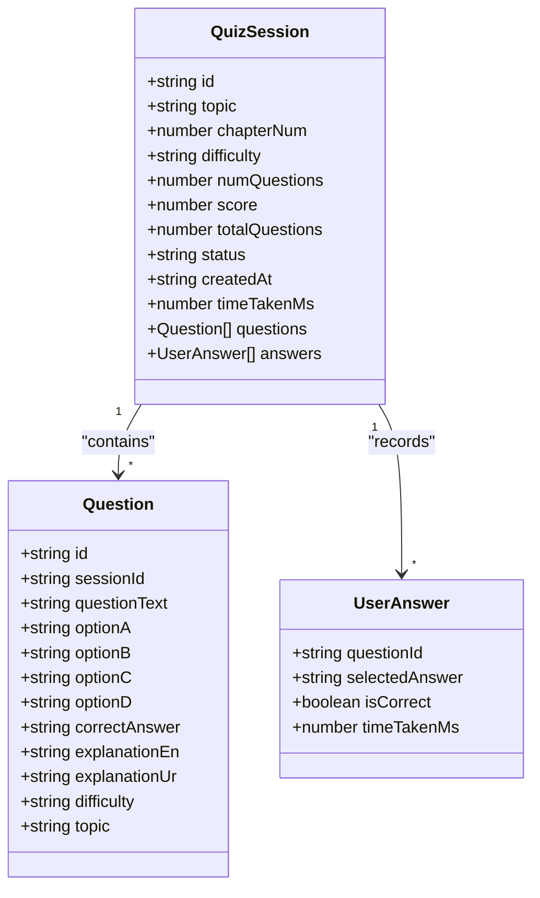

**Diagram sources**
- [types/quiz.ts:15-50](file://src/types/quiz.ts#L15-L50)

**Section sources**
- [types/quiz.ts:15-50](file://src/types/quiz.ts#L15-L50)

### Bilingual Support System
- English MCQs are presented exactly as in the exam.
- Each question includes both English and Urdu explanations.
- In-session toggle shows/hides Urdu explanation per question.
- Results page supports toggling Urdu explanations within expanded question details.

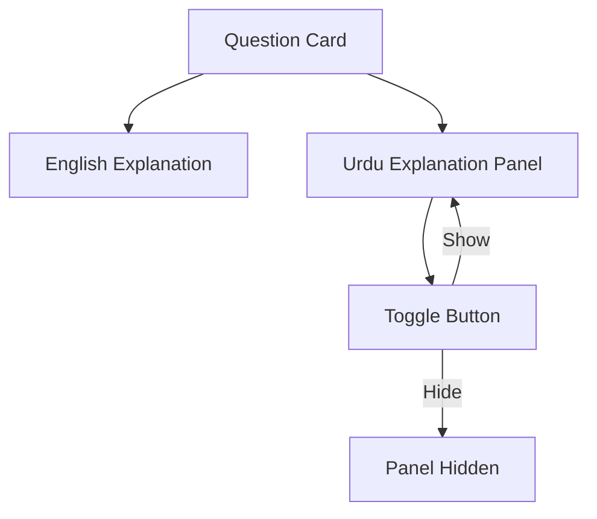

**Diagram sources**
- [practice/[session]/page.tsx:190-213](file://src/app/practice/%5Bsession%5D/page.tsx#L190-L213)
- [results/[session]/page.tsx:252-284](file://src/app/results/%5Bsession%5D/page.tsx#L252-L284)

**Section sources**
- [practice/[session]/page.tsx:190-213](file://src/app/practice/%5Bsession%5D/page.tsx#L190-L213)
- [results/[session]/page.tsx:252-284](file://src/app/results/%5Bsession%5D/page.tsx#L252-L284)

### Progress Tracking, Scoring, and Time Management
- Progress bar reflects answered vs total questions.
- Question dots show per-question status (correct, wrong, unanswered).
- Timer runs per question (60 seconds), resets on navigation, and stops after submission.
- Results compute:
  - Percentage score and grade label
  - Counts of correct, wrong, skipped
  - Average time per question
- Utility functions format time and derive score colors.

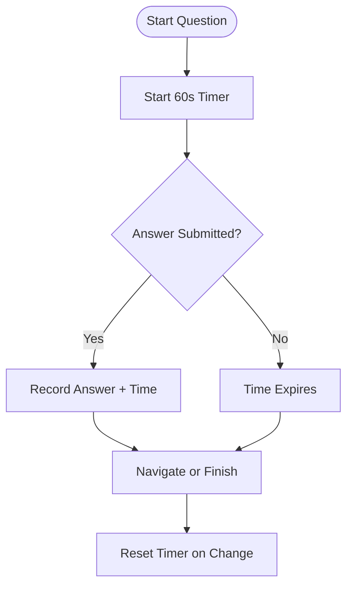

**Diagram sources**
- [practice/[session]/page.tsx:42-55](file://src/app/practice/%5Bsession%5D/page.tsx#L42-L55)
- [results/[session]/page.tsx:34-46](file://src/app/results/%5Bsession%5D/page.tsx#L34-L46)
- [utils.ts:17-33](file://src/lib/utils.ts#L17-L33)

**Section sources**
- [practice/[session]/page.tsx:42-55](file://src/app/practice/%5Bsession%5D/page.tsx#L42-L55)
- [results/[session]/page.tsx:34-46](file://src/app/results/%5Bsession%5D/page.tsx#L34-L46)
- [utils.ts:17-33](file://src/lib/utils.ts#L17-L33)

### Adaptive Algorithms and Difficulty Adjustment
- The UI exposes difficulty selection (Easy/Medium/Hard/Mixed) and tracks per-topic accuracy and weakness indicators.
- The README describes an adaptive engine that uses weak-spot tracking to direct future practice toward weaker areas.
- In the current implementation, difficulty is user-configured; adaptive adjustments would be applied server-side when integrating with backend analytics and RAG generation.

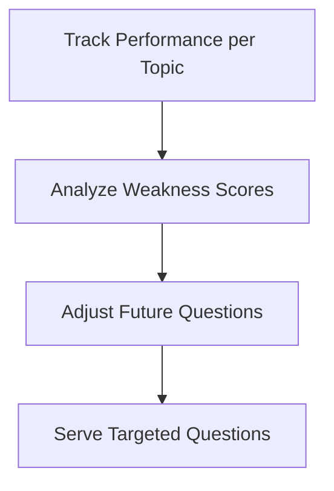

[No diagram sources needed since this section conceptualizes adaptation beyond current code]

**Section sources**
- [practice/page.tsx:69-110](file://src/app/practice/page.tsx#L69-L110)
- [README.md:15-22](file://README.md#L15-L22)

### Integration with RAG System for AI-Generated Questions
- The README outlines the RAG pipeline:
  - Build-time indexing of textbook chapters into vectors using Gemini embeddings.
  - Query-time retrieval of relevant chunks via pgvector cosine similarity.
  - Prompt construction and generation of structured MCQ JSON (including bilingual explanations).
  - Validation and storage before serving to students.
- The practice page indicates that questions are AI-generated from real textbook content using RAG retrieval.

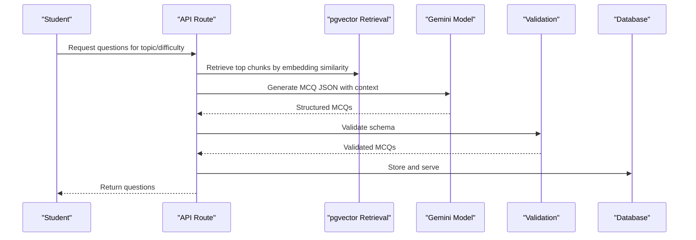

**Diagram sources**
- [README.md:79-122](file://README.md#L79-L122)
- [practice/page.tsx:176-183](file://src/app/practice/page.tsx#L176-L183)

**Section sources**
- [README.md:79-122](file://README.md#L79-L122)
- [practice/page.tsx:176-183](file://src/app/practice/page.tsx#L176-L183)

## Dependency Analysis
- Pages depend on shared UI components (Button, Card, Badge, Progress, Modal, Tabs, Input, Select).
- Quiz player depends on mock data for questions and types for structure.
- Results page depends on utilities for formatting and styling.
- Providers wrap the app with query client and toast provider.
- Middleware defines protected routes and can enforce auth when integrated.

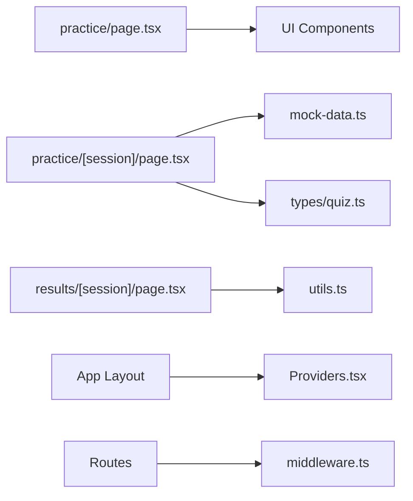

**Diagram sources**
- [practice/page.tsx:1-195](file://src/app/practice/page.tsx#L1-L195)
- [practice/[session]/page.tsx:1-352](file://src/app/practice/%5Bsession%5D/page.tsx#L1-L352)
- [results/[session]/page.tsx:1-315](file://src/app/results/%5Bsession%5D/page.tsx#L1-L315)
- [mock-data.ts:1-313](file://src/lib/mock-data.ts#L1-L313)
- [types/quiz.ts:1-107](file://src/types/quiz.ts#L1-L107)
- [utils.ts:1-34](file://src/lib/utils.ts#L1-L34)
- [Providers.tsx:1-22](file://src/components/Providers.tsx#L1-L22)
- [middleware.ts:1-40](file://src/middleware.ts#L1-L40)

**Section sources**
- [practice/page.tsx:1-195](file://src/app/practice/page.tsx#L1-L195)
- [practice/[session]/page.tsx:1-352](file://src/app/practice/%5Bsession%5D/page.tsx#L1-L352)
- [results/[session]/page.tsx:1-315](file://src/app/results/%5Bsession%5D/page.tsx#L1-L315)
- [mock-data.ts:1-313](file://src/lib/mock-data.ts#L1-L313)
- [types/quiz.ts:1-107](file://src/types/quiz.ts#L1-L107)
- [utils.ts:1-34](file://src/lib/utils.ts#L1-L34)
- [Providers.tsx:1-22](file://src/components/Providers.tsx#L1-L22)
- [middleware.ts:1-40](file://src/middleware.ts#L1-L40)

## Performance Considerations
- Client-side state for answers avoids unnecessary re-renders by scoping updates to specific question IDs.
- Timer intervals are cleared on unmount and reset on question changes to prevent leaks.
- Using memoized callbacks (useCallback) reduces re-renders for handlers.
- Results computation aggregates arrays efficiently; consider debouncing heavy operations if dataset grows.
- When integrating RAG, cache retrieved chunks and generated questions to minimize API calls.

[No sources needed since this section provides general guidance]

## Troubleshooting Guide
- Navigation issues: Ensure route protection is configured in middleware when integrating authentication.
- Timer not resetting: Verify effect dependencies for question index changes.
- Submission disabled unexpectedly: Check that selected option exists and submission flag is false.
- Urdu explanation not showing: Confirm toggle state and that explanation fields exist in question data.
- Results not updating: Ensure answers array is populated with correct flags and times before navigating to results.

**Section sources**
- [middleware.ts:14-36](file://src/middleware.ts#L14-L36)
- [practice/[session]/page.tsx:42-86](file://src/app/practice/%5Bsession%5D/page.tsx#L42-L86)
- [results/[session]/page.tsx:34-55](file://src/app/results/%5Bsession%5D/page.tsx#L34-L55)

## Conclusion
MedAce AI’s practice session provides a complete, interactive workflow for adaptive learning: select a topic, configure session parameters, answer timed questions with immediate feedback, toggle bilingual explanations, and review results with actionable insights. While the current implementation uses mock data, the documented RAG pipeline enables production-grade, syllabus-grounded question generation. The design supports future enhancements such as persistent session storage, server-driven adaptive difficulty, and robust error handling across the stack.

## Appendices
- Environment setup and deployment steps are described in the README.
- The tech stack and architecture overview explain how RAG integrates with Supabase and Gemini.

**Section sources**
- [README.md:292-325](file://README.md#L292-L325)
- [README.md:23-78](file://README.md#L23-L78)