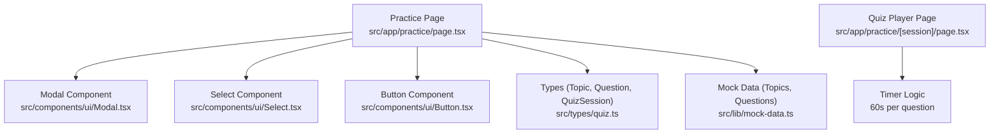
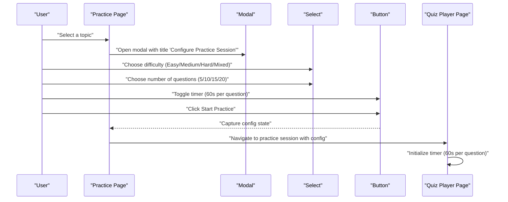
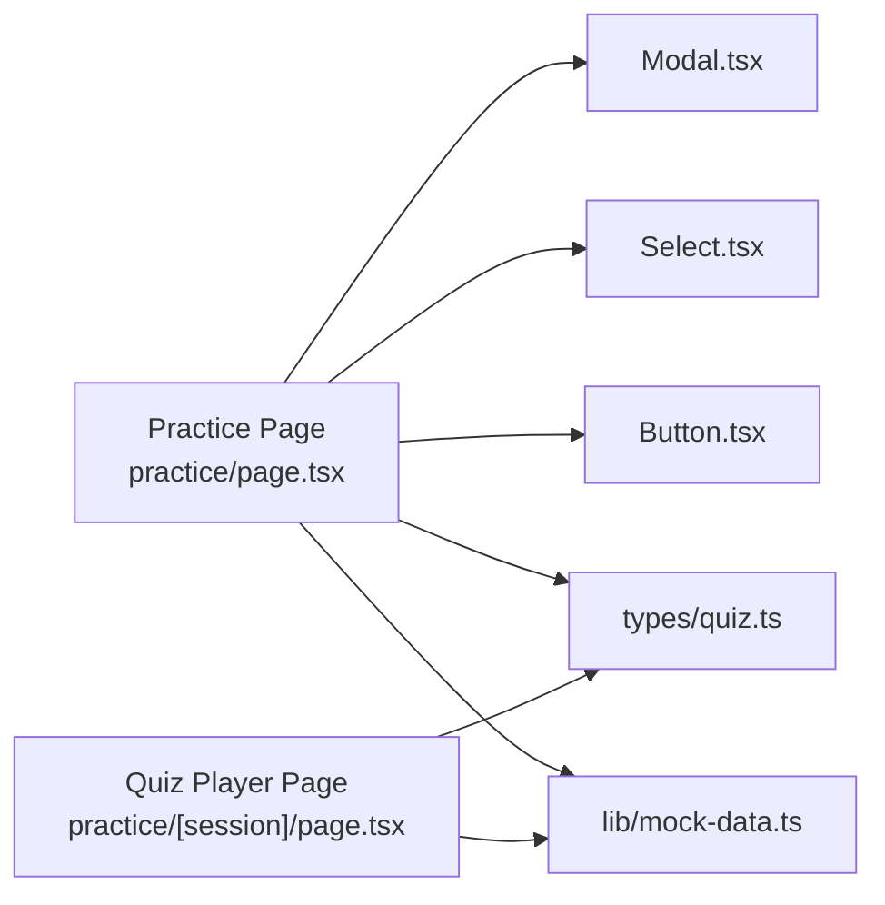

# Session Configuration

<cite>
**Referenced Files in This Document**
- [practice/page.tsx](file://src/app/practice/page.tsx)
- [practice/[session]/page.tsx](file://src/app/practice/[session]/page.tsx)
- [Modal.tsx](file://src/components/ui/Modal.tsx)
- [Select.tsx](file://src/components/ui/Select.tsx)
- [Button.tsx](file://src/components/ui/Button.tsx)
- [quiz.ts](file://src/types/quiz.ts)
- [mock-data.ts](file://src/lib/mock-data.ts)
</cite>

## Table of Contents
1. [Introduction](#introduction)
2. [Project Structure](#project-structure)
3. [Core Components](#core-components)
4. [Architecture Overview](#architecture-overview)
5. [Detailed Component Analysis](#detailed-component-analysis)
6. [Dependency Analysis](#dependency-analysis)
7. [Performance Considerations](#performance-considerations)
8. [Troubleshooting Guide](#troubleshooting-guide)
9. [Conclusion](#conclusion)

## Introduction
This document explains the practice session configuration modal in MedAce AI. It covers how users configure difficulty, question count, and timer settings before starting an AI-powered practice session. It also describes the component structure, form state management, validation approach, user experience considerations, and responsive design patterns used in the interface. Finally, it outlines how these configurations influence the subsequent practice session flow.

## Project Structure
The configuration modal is implemented on the Practice page and uses shared UI components for modals, selects, and buttons. The types that define sessions and questions are centralized to ensure consistency across the app.

**Diagram sources**
- [practice/page.tsx:120-192](file://src/app/practice/page.tsx#L120-L192)
- [Modal.tsx:16-80](file://src/components/ui/Modal.tsx#L16-L80)
- [Select.tsx:16-58](file://src/components/ui/Select.tsx#L16-L58)
- [Button.tsx:33-54](file://src/components/ui/Button.tsx#L33-L54)
- [quiz.ts:15-50](file://src/types/quiz.ts#L15-L50)
- [mock-data.ts:69-210](file://src/lib/mock-data.ts#L69-L210)
- [practice/[session]/page.tsx:42-55](file://src/app/practice/[session]/page.tsx#L42-L55)

**Section sources**
- [practice/page.tsx:18-196](file://src/app/practice/page.tsx#L18-L196)
- [Modal.tsx:16-80](file://src/components/ui/Modal.tsx#L16-L80)
- [Select.tsx:16-58](file://src/components/ui/Select.tsx#L16-L58)
- [Button.tsx:33-54](file://src/components/ui/Button.tsx#L33-L54)
- [quiz.ts:15-50](file://src/types/quiz.ts#L15-L50)
- [mock-data.ts:69-210](file://src/lib/mock-data.ts#L69-L210)
- [practice/[session]/page.tsx:42-55](file://src/app/practice/[session]/page.tsx#L42-L55)

## Core Components
- Modal: Accessible overlay with backdrop, keyboard dismissal (Escape), and focus-safe dialog behavior.
- Select: Styled native select with label, placeholder, and error support.
- Button: Reusable button with variants, sizes, loading state, and disabled handling.
- Types: Centralized TypeScript interfaces for Topic, Question, QuizSession, and related models.
- Mock Data: Sample topics and questions used to simulate content during development.

These components combine to render a clean, accessible configuration modal that guides users through setting up their practice session.

**Section sources**
- [Modal.tsx:16-80](file://src/components/ui/Modal.tsx#L16-L80)
- [Select.tsx:16-58](file://src/components/ui/Select.tsx#L16-L58)
- [Button.tsx:33-54](file://src/components/ui/Button.tsx#L33-L54)
- [quiz.ts:15-50](file://src/types/quiz.ts#L15-L50)
- [mock-data.ts:15-31](file://src/lib/mock-data.ts#L15-L31)

## Architecture Overview
The Practice page hosts the configuration modal. When a topic is selected, the modal opens and exposes three primary controls:
- Difficulty selector with options Easy, Medium, Hard, Mixed
- Number of Questions selector with options 5, 10, 15, 20
- Timer toggle indicating 60 seconds per question

On submission, the configured values are intended to drive the creation of a new quiz session and navigate to the player page where the timer runs per question.

**Diagram sources**
- [practice/page.tsx:120-192](file://src/app/practice/page.tsx#L120-L192)
- [practice/[session]/page.tsx:42-55](file://src/app/practice/[session]/page.tsx#L42-L55)

## Detailed Component Analysis

### Practice Page — Configuration Modal
- State variables:
  - Selected topic: drives context shown in the modal header
  - Difficulty: default Mixed; options include Easy, Medium, Hard, Mixed
  - Number of questions: default 10; options include 5, 10, 15, 20
  - Timer: visual toggle present; indicates 60 seconds per question
- UI elements:
  - Topic info badge and name
  - Difficulty Select with labeled options
  - Number of Questions Select with labeled options
  - Timer row with description “60 seconds per question” and a toggle control
  - AI notice explaining RAG-based generation from textbook content
  - Primary action button to start the session
- Behavior:
  - Modal visibility controlled by selected topic
  - On close, selection resets via state update
  - Form fields use controlled inputs bound to local state

Impact on session generation:
- Difficulty influences the distribution or selection of question difficulty levels when generating or filtering questions.
- Question count determines how many questions will be included in the session.
- Timer setting aligns with the player’s per-question countdown of 60 seconds.

**Section sources**
- [practice/page.tsx:21-24](file://src/app/practice/page.tsx#L21-L24)
- [practice/page.tsx:120-192](file://src/app/practice/page.tsx#L120-L192)

### Modal Component
- Accessibility:
  - Uses role="dialog", aria-modal, and aria-label for screen readers
  - Escape key closes the modal
  - Backdrop click closes the modal
  - Prevents background scrolling while open
- Styling:
  - Centered overlay with backdrop blur
  - Responsive max-width container with rounded corners and shadow
- Extensibility:
  - Accepts title, children, className, and maxWidth props

**Section sources**
- [Modal.tsx:16-80](file://src/components/ui/Modal.tsx#L16-L80)

### Select Component
- Features:
  - Label association via htmlFor/id
  - Placeholder option support
  - Error message display
  - Custom dropdown arrow styling
  - Focus ring and border transitions
- Usage in configuration:
  - Difficulty and Number of Questions are both rendered using this component with predefined option sets

**Section sources**
- [Select.tsx:16-58](file://src/components/ui/Select.tsx#L16-L58)
- [practice/page.tsx:137-161](file://src/app/practice/page.tsx#L137-L161)

### Button Component
- Features:
  - Variants: primary, secondary, ghost, danger
  - Sizes: sm, md, lg
  - Loading spinner integration
  - Disabled state propagation
- Usage in configuration:
  - Primary “Start Practice” button triggers session creation

**Section sources**
- [Button.tsx:33-54](file://src/components/ui/Button.tsx#L33-L54)
- [practice/page.tsx:185-189](file://src/app/practice/page.tsx#L185-L189)

### Types and Data Models
- Topic: Represents chapters with metadata like category, subtopics count, accuracy, and weak flag.
- Question: Defines question text, options, correct answer, explanations, difficulty, and topic.
- QuizSession: Captures session-level metadata including difficulty, numQuestions, status, and answers.

These types guide consistent data flow between configuration and the player/results pages.

**Section sources**
- [quiz.ts:5-50](file://src/types/quiz.ts#L5-L50)
- [mock-data.ts:15-31](file://src/lib/mock-data.ts#L15-L31)
- [mock-data.ts:69-210](file://src/lib/mock-data.ts#L69-L210)

### Quiz Player — Timer Integration
- Timer logic:
  - Initializes at 60 seconds per question
  - Counts down each second until answered or time expires
  - Resets on question change
- Visual feedback:
  - Clock icon and monospaced timer display
  - Color changes when time is low (≤10 seconds)

This confirms that enabling the timer in configuration corresponds to a 60-second countdown per question in the player.

**Section sources**
- [practice/[session]/page.tsx:42-55](file://src/app/practice/[session]/page.tsx#L42-L55)
- [practice/[session]/page.tsx:125-144](file://src/app/practice/[session]/page.tsx#L125-L144)

## Dependency Analysis
- The Practice page composes Modal, Select, and Button to build the configuration UI.
- It imports types from the central types module to ensure type safety.
- Mock data provides sample topics and questions for demonstration.
- The Quiz Player page consumes similar types and demonstrates the timer behavior aligned with configuration expectations.

**Diagram sources**
- [practice/page.tsx:1-10](file://src/app/practice/page.tsx#L1-L10)
- [practice/page.tsx:120-192](file://src/app/practice/page.tsx#L120-L192)
- [Modal.tsx:16-80](file://src/components/ui/Modal.tsx#L16-L80)
- [Select.tsx:16-58](file://src/components/ui/Select.tsx#L16-L58)
- [Button.tsx:33-54](file://src/components/ui/Button.tsx#L33-L54)
- [quiz.ts:5-50](file://src/types/quiz.ts#L5-L50)
- [mock-data.ts:15-31](file://src/lib/mock-data.ts#L15-L31)
- [practice/[session]/page.tsx:42-55](file://src/app/practice/[session]/page.tsx#L42-L55)

**Section sources**
- [practice/page.tsx:1-10](file://src/app/practice/page.tsx#L1-L10)
- [practice/page.tsx:120-192](file://src/app/practice/page.tsx#L120-L192)
- [Modal.tsx:16-80](file://src/components/ui/Modal.tsx#L16-L80)
- [Select.tsx:16-58](file://src/components/ui/Select.tsx#L16-L58)
- [Button.tsx:33-54](file://src/components/ui/Button.tsx#L33-L54)
- [quiz.ts:5-50](file://src/types/quiz.ts#L5-L50)
- [mock-data.ts:15-31](file://src/lib/mock-data.ts#L15-L31)
- [practice/[session]/page.tsx:42-55](file://src/app/practice/[session]/page.tsx#L42-L55)

## Performance Considerations
- Controlled inputs: Each form field updates local state directly, keeping rendering predictable and efficient.
- Modal lifecycle: Escaping and backdrop interactions avoid unnecessary re-renders by toggling a single boolean flag.
- Timer efficiency: The player uses a simple interval per question and clears it appropriately to prevent memory leaks.
- UI responsiveness: Tailwind classes provide mobile-first layouts; grid and flex utilities adapt gracefully across breakpoints.

[No sources needed since this section provides general guidance]

## Troubleshooting Guide
- Modal does not close:
  - Ensure the onClose handler is wired to the modal’s backdrop and Escape key listener.
  - Verify isOpen prop reflects the expected state.
- Select not updating:
  - Confirm value and onChange are bound correctly to local state.
  - Check that options array contains valid value/label pairs.
- Timer not counting down:
  - Ensure the interval is set when a question is active and cleared when answered or navigated away.
  - Validate that currentIdx changes reset the timer to 60 seconds.
- Validation errors:
  - Add required checks for difficulty and question count if necessary.
  - Display inline errors using the Select component’s error prop.

**Section sources**
- [Modal.tsx:26-38](file://src/components/ui/Modal.tsx#L26-L38)
- [Select.tsx:16-58](file://src/components/ui/Select.tsx#L16-L58)
- [practice/[session]/page.tsx:42-55](file://src/app/practice/[session]/page.tsx#L42-L55)

## Conclusion
The practice session configuration modal provides a focused, accessible way to tailor AI-generated practice sessions. Users can choose difficulty (Easy, Medium, Hard, Mixed), question count (5–20), and enable a 60-second-per-question timer. These settings inform how questions are generated and presented during the session. The implementation leverages reusable UI components, clear state management, and responsive design patterns to deliver a smooth user experience. Integrating these configurations into the session creation flow ensures consistent behavior across the application.

[No sources needed since this section summarizes without analyzing specific files]