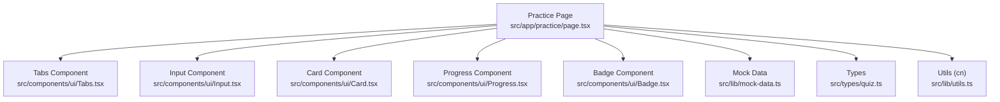
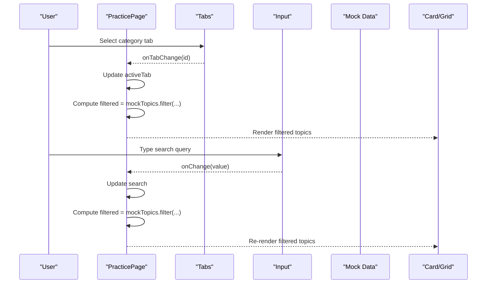
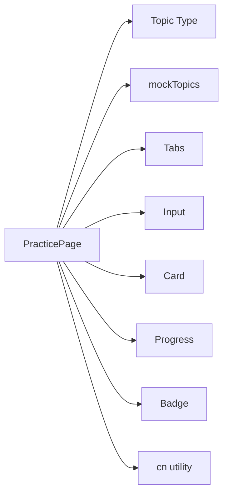

# Topic Selection Interface

<cite>
**Referenced Files in This Document**
- [practice/page.tsx](file://src/app/practice/page.tsx)
- [mock-data.ts](file://src/lib/mock-data.ts)
- [quiz.ts](file://src/types/quiz.ts)
- [Tabs.tsx](file://src/components/ui/Tabs.tsx)
- [Card.tsx](file://src/components/ui/Card.tsx)
- [Progress.tsx](file://src/components/ui/Progress.tsx)
- [Badge.tsx](file://src/components/ui/Badge.tsx)
- [Input.tsx](file://src/components/ui/Input.tsx)
- [utils.ts](file://src/lib/utils.ts)
</cite>

## Table of Contents
1. [Introduction](#introduction)
2. [Project Structure](#project-structure)
3. [Core Components](#core-components)
4. [Architecture Overview](#architecture-overview)
5. [Detailed Component Analysis](#detailed-component-analysis)
6. [Dependency Analysis](#dependency-analysis)
7. [Performance Considerations](#performance-considerations)
8. [Troubleshooting Guide](#troubleshooting-guide)
9. [Conclusion](#conclusion)

## Introduction
This document explains the topic selection interface in MedAce AI’s practice engine. It covers:
- Category filtering with tabs for All, Human Physiology, Modern Topics, and Pharmacology
- Search functionality that filters chapters by name
- Topic card display including chapter numbers, weak spot indicators, accuracy progress bars, and subtopic counts
- Responsive grid layout and hover effects
- Implementation details of filtering logic, state management for active tabs and search queries, and how weak spots are identified and displayed

## Project Structure
The topic selection interface is implemented as a client-side React page that composes reusable UI components and consumes mock data to render the practice topics.

**Diagram sources**
- [practice/page.tsx:1-196](file://src/app/practice/page.tsx#L1-L196)
- [Tabs.tsx:1-39](file://src/components/ui/Tabs.tsx#L1-L39)
- [Input.tsx:1-53](file://src/components/ui/Input.tsx#L1-L53)
- [Card.tsx:1-46](file://src/components/ui/Card.tsx#L1-L46)
- [Progress.tsx:1-59](file://src/components/ui/Progress.tsx#L1-L59)
- [Badge.tsx:1-35](file://src/components/ui/Badge.tsx#L1-L35)
- [mock-data.ts:15-31](file://src/lib/mock-data.ts#L15-L31)
- [quiz.ts:5-13](file://src/types/quiz.ts#L5-L13)
- [utils.ts:4-6](file://src/lib/utils.ts#L4-L6)

**Section sources**
- [practice/page.tsx:1-196](file://src/app/practice/page.tsx#L1-L196)
- [mock-data.ts:15-31](file://src/lib/mock-data.ts#L15-L31)
- [quiz.ts:5-13](file://src/types/quiz.ts#L5-L13)

## Core Components
- PracticePage: Orchestrates state (active tab, search query), applies filtering, renders category tabs, search input, responsive topic grid, and session configuration modal.
- Tabs: Renders selectable category tabs with active styling and change callback.
- Input: Provides a searchable text field with optional left icon.
- Card: Wraps each topic item with consistent padding, border, and transition styles.
- Progress: Displays accuracy percentage with color variants based on thresholds.
- Badge: Shows contextual labels such as chapter number, “Weak”, or “New”.

Key responsibilities:
- Filtering: Combines category tab selection and search query to compute visible topics.
- Display: Presents chapter metadata, weak spot status, accuracy, and subtopic count.
- Interaction: Opens a modal to configure difficulty, question count, and start a session.

**Section sources**
- [practice/page.tsx:11-29](file://src/app/practice/page.tsx#L11-L29)
- [Tabs.tsx:17-35](file://src/components/ui/Tabs.tsx#L17-L35)
- [Input.tsx:10-49](file://src/components/ui/Input.tsx#L10-L49)
- [Card.tsx:25-40](file://src/components/ui/Card.tsx#L25-L40)
- [Progress.tsx:26-55](file://src/components/ui/Progress.tsx#L26-L55)
- [Badge.tsx:19-31](file://src/components/ui/Badge.tsx#L19-L31)

## Architecture Overview
The interface follows a unidirectional data flow:
- State lives in the PracticePage component (activeTab, search).
- Filtering computes a derived list from mockTopics using both state values.
- UI components receive props and render accordingly.
- User interactions update state via callbacks, causing re-render with updated filtered results.

**Diagram sources**
- [practice/page.tsx:18-29](file://src/app/practice/page.tsx#L18-L29)
- [Tabs.tsx:17-35](file://src/components/ui/Tabs.tsx#L17-L35)
- [Input.tsx:10-49](file://src/components/ui/Input.tsx#L10-L49)
- [mock-data.ts:15-31](file://src/lib/mock-data.ts#L15-L31)

## Detailed Component Analysis

### Category Filtering System (Tabs)
- The page defines four categories: All, Human Physiology, Modern Topics, Pharmacology.
- Active tab state controls which category is selected; default is All.
- The filter checks if activeTab equals “all” or matches the topic’s category.

Behavior:
- Selecting a tab updates activeTab and triggers recomputation of filtered topics.
- The Tabs component highlights the active tab and calls the provided onTabChange handler.

**Section sources**
- [practice/page.tsx:11-16](file://src/app/practice/page.tsx#L11-L16)
- [practice/page.tsx:18-29](file://src/app/practice/page.tsx#L18-L29)
- [Tabs.tsx:17-35](file://src/components/ui/Tabs.tsx#L17-L35)

### Search Functionality
- The search input binds to a local search state.
- Filtering includes a case-insensitive substring match against topic names.
- When no results match, an empty state message is shown.

Behavior:
- Typing into the input updates search state and recalculates filtered topics.
- Combined with category filter, enabling precise narrowing of results.

**Section sources**
- [practice/page.tsx:41-51](file://src/app/practice/page.tsx#L41-L51)
- [practice/page.tsx:25-29](file://src/app/practice/page.tsx#L25-L29)
- [Input.tsx:10-49](file://src/components/ui/Input.tsx#L10-L49)

### Topic Card Display
Each topic card shows:
- Chapter number badge
- Weak spot indicator when applicable
- “New” badge when accuracy is undefined (not attempted)
- Topic name with line-clamp for long titles
- Subtopic count and category
- Accuracy progress bar with color variant based on thresholds
  - success for >= 70%
  - warning for >= 40% and < 70%
  - error for < 40%
- If not attempted, displays “Not yet attempted”

Hover effects:
- Cards have a subtle border highlight and title color change on hover via group utilities.

**Section sources**
- [practice/page.tsx:61-112](file://src/app/practice/page.tsx#L61-L112)
- [Card.tsx:25-40](file://src/components/ui/Card.tsx#L25-L40)
- [Progress.tsx:26-55](file://src/components/ui/Progress.tsx#L26-L55)
- [Badge.tsx:19-31](file://src/components/ui/Badge.tsx#L19-L31)

### Responsive Grid Layout
- Uses a responsive grid: single column on small screens, two columns on medium, three on large.
- Consistent spacing between cards ensures readability across devices.

**Section sources**
- [practice/page.tsx:61-62](file://src/app/practice/page.tsx#L61-L62)

### Session Configuration Modal
- Triggered by clicking a topic card.
- Allows selecting difficulty and number of questions.
- Includes a timer toggle and an informational note about AI-generated questions.
- Starts a practice session when the user confirms.

**Section sources**
- [practice/page.tsx:120-192](file://src/app/practice/page.tsx#L120-L192)

### Weak Spots Identification and Display
- Weakness is represented by a boolean flag on each topic.
- When true, a “Weak” badge with a warning variant appears on the card.
- The underlying data marks specific chapters as weak, enabling immediate visual feedback.

Thresholds and scoring:
- Accuracy-based progress bar uses thresholds at 70% and 40% to determine color variants.
- Utility functions provide color helpers for scores, though the page directly sets progress variants based on thresholds.

**Section sources**
- [mock-data.ts:15-31](file://src/lib/mock-data.ts#L15-L31)
- [practice/page.tsx:71-79](file://src/app/practice/page.tsx#L71-L79)
- [practice/page.tsx:89-109](file://src/app/practice/page.tsx#L89-L109)
- [utils.ts:23-33](file://src/lib/utils.ts#L23-L33)

### State Management Summary
- activeTab: string — current category filter
- search: string — current search query
- selectedTopic: Topic | null — currently selected topic for modal
- difficulty: string — selected difficulty level
- numQuestions: string — selected number of questions

These states drive filtering and modal behavior, ensuring reactive UI updates.

**Section sources**
- [practice/page.tsx:18-23](file://src/app/practice/page.tsx#L18-L23)

## Dependency Analysis
The PracticePage depends on:
- Types for strong typing of Topic and related structures
- Mock data for topic definitions and attributes
- UI components for rendering tabs, inputs, cards, progress bars, and badges
- Utility function for class merging

**Diagram sources**
- [practice/page.tsx:1-10](file://src/app/practice/page.tsx#L1-L10)
- [mock-data.ts:15-31](file://src/lib/mock-data.ts#L15-L31)
- [quiz.ts:5-13](file://src/types/quiz.ts#L5-L13)
- [Tabs.tsx:17-35](file://src/components/ui/Tabs.tsx#L17-L35)
- [Input.tsx:10-49](file://src/components/ui/Input.tsx#L10-L49)
- [Card.tsx:25-40](file://src/components/ui/Card.tsx#L25-L40)
- [Progress.tsx:26-55](file://src/components/ui/Progress.tsx#L26-L55)
- [Badge.tsx:19-31](file://src/components/ui/Badge.tsx#L19-L31)
- [utils.ts:4-6](file://src/lib/utils.ts#L4-L6)

**Section sources**
- [practice/page.tsx:1-10](file://src/app/practice/page.tsx#L1-L10)
- [mock-data.ts:15-31](file://src/lib/mock-data.ts#L15-L31)
- [quiz.ts:5-13](file://src/types/quiz.ts#L5-L13)

## Performance Considerations
- Filtering runs on every state change; for larger datasets, consider memoization (e.g., useMemo) to avoid unnecessary recalculations.
- Client-side search is efficient for the current dataset size but could be optimized with debouncing if needed.
- Using CSS transitions and Tailwind classes keeps animations smooth without heavy JS overhead.

[No sources needed since this section provides general guidance]

## Troubleshooting Guide
Common issues and resolutions:
- No results shown: Ensure search query does not conflict with selected category; clear search or switch to “All”.
- Incorrect category filter: Verify activeTab value matches one of the defined categories.
- Missing weak indicators: Confirm topic data includes isWeak flag set appropriately.
- Progress bar not updating: Check that accuracy is defined and within 0–100 range; ensure thresholds are applied correctly.

**Section sources**
- [practice/page.tsx:25-29](file://src/app/practice/page.tsx#L25-L29)
- [practice/page.tsx:71-79](file://src/app/practice/page.tsx#L71-L79)
- [practice/page.tsx:89-109](file://src/app/practice/page.tsx#L89-L109)

## Conclusion
The topic selection interface provides a clean, responsive way to browse and filter practice topics by category and name. It clearly communicates performance through accuracy progress bars and highlights weak areas to guide focused study. The modular design leverages reusable UI components and straightforward state management to deliver an intuitive experience.

[No sources needed since this section summarizes without analyzing specific files]