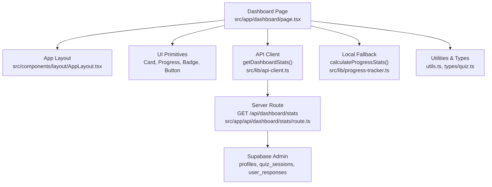
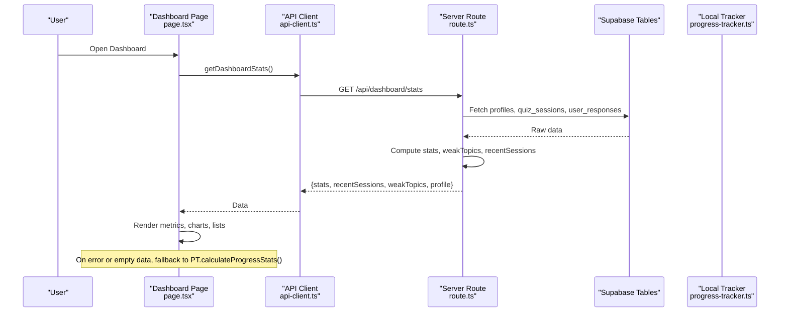
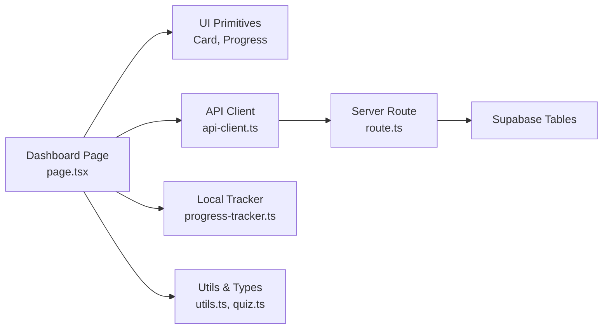
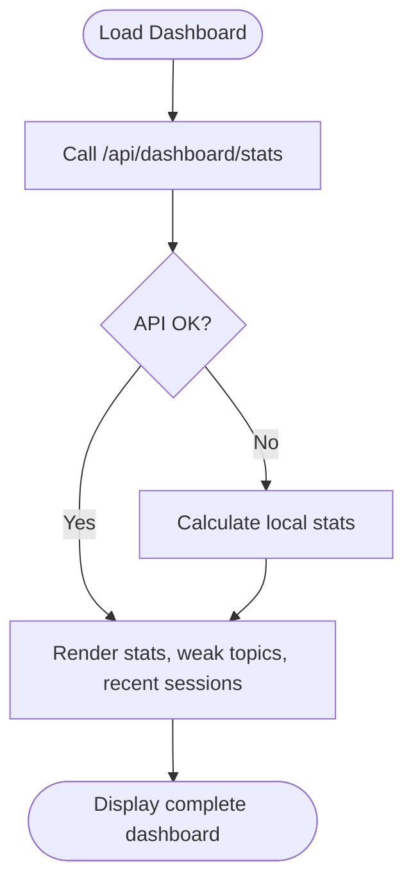

# Dashboard Visualization Interface

<cite>
**Referenced Files in This Document**
- [page.tsx](file://src/app/dashboard/page.tsx)
- [route.ts](file://src/app/api/dashboard/stats/route.ts)
- [Progress.tsx](file://src/components/ui/Progress.tsx)
- [Card.tsx](file://src/components/ui/Card.tsx)
- [api-client.ts](file://src/lib/api-client.ts)
- [progress-tracker.ts](file://src/lib/progress-tracker.ts)
- [mock-data.ts](file://src/lib/mock-data.ts)
- [utils.ts](file://src/lib/utils.ts)
- [quiz.ts](file://src/types/quiz.ts)
- [AppLayout.tsx](file://src/components/layout/AppLayout.tsx)
</cite>

## Table of Contents
1. [Introduction](#introduction)
2. [Project Structure](#project-structure)
3. [Core Components](#core-components)
4. [Architecture Overview](#architecture-overview)
5. [Detailed Component Analysis](#detailed-component-analysis)
6. [Dependency Analysis](#dependency-analysis)
7. [Performance Considerations](#performance-considerations)
8. [Troubleshooting Guide](#troubleshooting-guide)
9. [Conclusion](#conclusion)
10. [Appendices](#appendices)

## Introduction
This document explains the dashboard visualization interface that presents progress analytics in an intuitive, actionable format. It covers the layout structure for key metrics (accuracy rates, study streaks, recent sessions, and weak topic identification), interactive components (progress bars, cards, links), real-time data fetching from the backend API, responsive design patterns, accessibility considerations, loading states, error handling, and customization options for different user roles such as students and educators.

## Project Structure
The dashboard is implemented as a Next.js client component within the application shell. The main page composes reusable UI primitives and orchestrates data fetching to display performance insights.

**Diagram sources**
- [page.tsx:1-330](file://src/app/dashboard/page.tsx#L1-L330)
- [AppLayout.tsx:1-90](file://src/components/layout/AppLayout.tsx#L1-L90)
- [api-client.ts:100-117](file://src/lib/api-client.ts#L100-L117)
- [route.ts:1-181](file://src/app/api/dashboard/stats/route.ts#L1-L181)
- [progress-tracker.ts:37-191](file://src/lib/progress-tracker.ts#L37-L191)
- [utils.ts:1-34](file://src/lib/utils.ts#L1-L34)
- [quiz.ts:78-106](file://src/types/quiz.ts#L78-L106)

**Section sources**
- [page.tsx:1-330](file://src/app/dashboard/page.tsx#L1-L330)
- [AppLayout.tsx:1-90](file://src/components/layout/AppLayout.tsx#L1-L90)

## Core Components
- Stats Cards: Four metric cards at the top showing total questions, accuracy rate, sessions completed, and study streak with contextual icons and color-coded values.
- Weak Topics Panel: A list of topics where the user struggles most, each with a progress bar indicating weakness score and counts of errors/attempts.
- Recent Sessions Panel: A compact list of the latest completed sessions with scores and dates, linking to detailed results.
- Quick Start Topic Grid: A set of clickable cards to jump into practice for selected topics.

Key interactions:
- Clicking a recent session navigates to its results page.
- “Practice Now” or “Start Quiz” actions navigate to the practice flow.
- Progress bars animate on mount to reflect current values.

**Section sources**
- [page.tsx:101-156](file://src/app/dashboard/page.tsx#L101-L156)
- [page.tsx:158-285](file://src/app/dashboard/page.tsx#L158-L285)
- [page.tsx:288-326](file://src/app/dashboard/page.tsx#L288-L326)
- [Progress.tsx:1-74](file://src/components/ui/Progress.tsx#L1-L74)
- [Card.tsx:1-70](file://src/components/ui/Card.tsx#L1-L70)

## Architecture Overview
The dashboard follows a client-server pattern:
- The dashboard page requests stats via a typed API client.
- The server route authenticates the user, aggregates data from Supabase tables, computes derived metrics (weak topics, accuracy, streak), and returns a structured payload.
- If the API call fails or returns empty baseline data, the dashboard falls back to local calculations using stored history.

**Diagram sources**
- [page.tsx:47-70](file://src/app/dashboard/page.tsx#L47-L70)
- [api-client.ts:100-117](file://src/lib/api-client.ts#L100-L117)
- [route.ts:6-181](file://src/app/api/dashboard/stats/route.ts#L6-L181)
- [progress-tracker.ts:37-191](file://src/lib/progress-tracker.ts#L37-L191)

## Detailed Component Analysis

### Dashboard Page: Layout and Metrics
- Header greets the user and shows the current date and study streak badge.
- Stats row uses a responsive grid to present four KPI cards with icons, values, and sublabels.
- Main content grid splits into two sections:
  - Weak Spots (larger panel): Lists topics with chapter badges, names, animated progress bars, and wrong attempt counts.
  - Recent Sessions (smaller panel): Lists last sessions with topic, formatted date, and score; clicking navigates to results.
- Quick Start section displays topic cards for immediate practice.

Responsive behavior:
- Uses Tailwind responsive classes to adapt grids from mobile to desktop (e.g., 2-column to 4-column layouts).
- Mobile bottom navigation is provided by the app layout for quick access across features.

Accessibility:
- Semantic headings and link elements for navigation.
- Color-coded text and backgrounds are used consistently; ensure sufficient contrast when customizing themes.
- Interactive elements are keyboard-focusable via native HTML semantics.

Loading and empty states:
- While data loads, the page renders initial state and transitions to populated content once data arrives.
- Empty states show friendly messages and calls-to-action (e.g., start quiz).

Error handling:
- If the API call throws or returns no meaningful stats, the page falls back to local calculation to still render useful insights.

**Section sources**
- [page.tsx:34-70](file://src/app/dashboard/page.tsx#L34-L70)
- [page.tsx:74-156](file://src/app/dashboard/page.tsx#L74-L156)
- [page.tsx:158-285](file://src/app/dashboard/page.tsx#L158-L285)
- [page.tsx:288-326](file://src/app/dashboard/page.tsx#L288-L326)
- [AppLayout.tsx:32-87](file://src/components/layout/AppLayout.tsx#L32-L87)

### Server Route: Aggregation and Computation
- Authenticates the request and prepares demo defaults if unauthenticated.
- Retrieves user profile and recent completed sessions.
- Computes weekly question count based on session timestamps.
- Aggregates user responses to compute per-topic error rates and identifies weak topics (threshold-based filtering and sorting).
- Derives overall accuracy, best/worst topics, and builds a profile object including chapter performance.
- Returns structured JSON with stats, recent sessions, weak topics, and profile.
- Handles errors by returning a standardized error response.

Data sources:
- Supabase admin client queries profiles, quiz_sessions, and user_responses joined with quiz_questions to extract topic metadata.

**Section sources**
- [route.ts:6-181](file://src/app/api/dashboard/stats/route.ts#L6-L181)

### Local Fallback: Progress Calculation
- Reads local quiz history from localStorage.
- Calculates totals, weekly activity, accuracy, and streaks based on session dates.
- Builds weak topics by error rate and sorts them.
- Produces chapter performance and recent sessions for rendering.

This ensures the dashboard remains functional offline or when the backend is unavailable.

**Section sources**
- [progress-tracker.ts:12-35](file://src/lib/progress-tracker.ts#L12-L35)
- [progress-tracker.ts:37-191](file://src/lib/progress-tracker.ts#L37-L191)

### UI Primitives: Progress Bars and Cards
- Progress bar:
  - Accepts value (0–100), variant (primary/success/error/warning), size (sm/md/lg), optional glow, and label visibility.
  - Animates width on mount with spring easing.
  - Clamps values to valid range and applies variant-specific colors and optional shadows.
- Card:
  - Supports variants (default/elevated/bordered/glass) and padding levels.
  - Optional hover effect with subtle lift and shadow.

These primitives are composed throughout the dashboard to maintain consistent visual language and interaction patterns.

**Section sources**
- [Progress.tsx:1-74](file://src/components/ui/Progress.tsx#L1-L74)
- [Card.tsx:1-70](file://src/components/ui/Card.tsx#L1-L70)

### Data Models and Utilities
- Types define shapes for DashboardStats, RecentSession, WeakTopic, UserProfile, and others to ensure type safety across client and server.
- Utilities provide class merging, date formatting, time formatting, and score color helpers used by the dashboard for consistent styling and presentation.

**Section sources**
- [quiz.ts:78-106](file://src/types/quiz.ts#L78-L106)
- [utils.ts:1-34](file://src/lib/utils.ts#L1-L34)

## Dependency Analysis
The dashboard depends on:
- UI primitives for consistent visuals and interactions.
- API client for network calls and error propagation.
- Server route for data aggregation and business logic.
- Local tracker for resilience and offline capability.
- Utilities and types for shared functionality and contracts.

**Diagram sources**
- [page.tsx:1-330](file://src/app/dashboard/page.tsx#L1-L330)
- [api-client.ts:100-117](file://src/lib/api-client.ts#L100-L117)
- [route.ts:1-181](file://src/app/api/dashboard/stats/route.ts#L1-L181)
- [progress-tracker.ts:37-191](file://src/lib/progress-tracker.ts#L37-L191)
- [utils.ts:1-34](file://src/lib/utils.ts#L1-L34)
- [quiz.ts:78-106](file://src/types/quiz.ts#L78-L106)

**Section sources**
- [page.tsx:1-330](file://src/app/dashboard/page.tsx#L1-L330)
- [api-client.ts:100-117](file://src/lib/api-client.ts#L100-L117)
- [route.ts:1-181](file://src/app/api/dashboard/stats/route.ts#L1-L181)
- [progress-tracker.ts:37-191](file://src/lib/progress-tracker.ts#L37-L191)

## Performance Considerations
- Minimal re-renders: State updates are scoped to stats, weak topics, recent sessions, and loading flag.
- Efficient data fetching: Single endpoint call retrieves all needed data; fallback avoids extra network calls.
- Lightweight UI: Reusable primitives reduce duplication and keep bundle size manageable.
- Animation performance: Use framer-motion sparingly; animations are simple and GPU-friendly.

[No sources needed since this section provides general guidance]

## Troubleshooting Guide
Common issues and resolutions:
- API failure or network error:
  - The dashboard catches errors during fetch and falls back to local calculation to continue displaying insights.
  - Check browser console for thrown errors and verify server route availability.
- Empty or zero stats:
  - Unauthenticated users receive demo defaults; authenticated users should have records in profiles and quiz_sessions.
  - Verify Supabase permissions and RLS policies for reading user data.
- Incorrect weak topics or accuracy:
  - Ensure user_responses contain correct is_correct flags and that quiz_questions include topic and chapter_num.
  - Confirm server-side aggregation thresholds and sorting logic.
- Loading stuck:
  - Validate that the API client returns a promise and that the dashboard sets loading to false after data arrival or fallback.

**Section sources**
- [page.tsx:47-70](file://src/app/dashboard/page.tsx#L47-L70)
- [route.ts:173-181](file://src/app/api/dashboard/stats/route.ts#L173-L181)
- [api-client.ts:100-117](file://src/lib/api-client.ts#L100-L117)

## Conclusion
The dashboard provides a clear, responsive, and resilient view of learning progress. It combines server-aggregated analytics with a robust local fallback, presenting key metrics through accessible, interactive components. The modular architecture supports customization for different roles and future enhancements such as richer charts and role-based views.

[No sources needed since this section summarizes without analyzing specific files]

## Appendices

### Real-Time Statistics Flow

**Diagram sources**
- [page.tsx:47-70](file://src/app/dashboard/page.tsx#L47-L70)
- [api-client.ts:100-117](file://src/lib/api-client.ts#L100-L117)
- [progress-tracker.ts:37-191](file://src/lib/progress-tracker.ts#L37-L191)

### Customization Options by Role
- Students:
  - Focus on weak topics and recent sessions to guide practice.
  - Use “Continue Practicing” cards to resume targeted study.
- Educators:
  - Extend the dashboard to aggregate class-level metrics by querying multiple user IDs or adding a cohort filter.
  - Add educator-only panels showing average accuracy, common weak topics, and session completion rates.
  - Integrate export capabilities for reports and dashboards tailored to curriculum goals.

[No sources needed since this section proposes conceptual extensions]