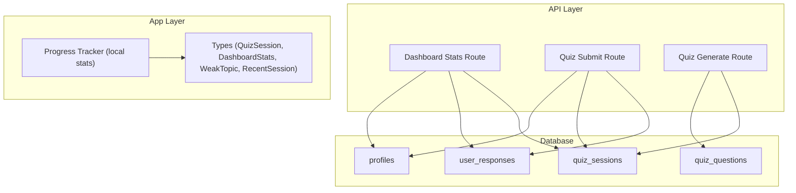
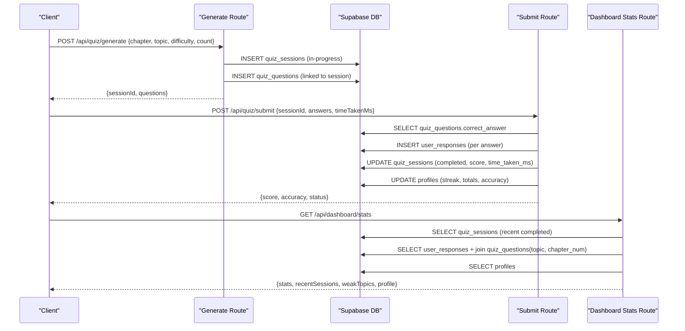
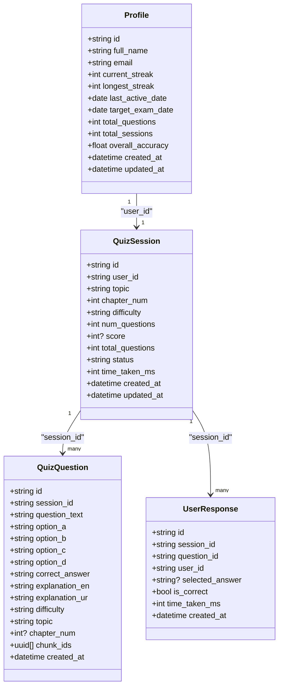
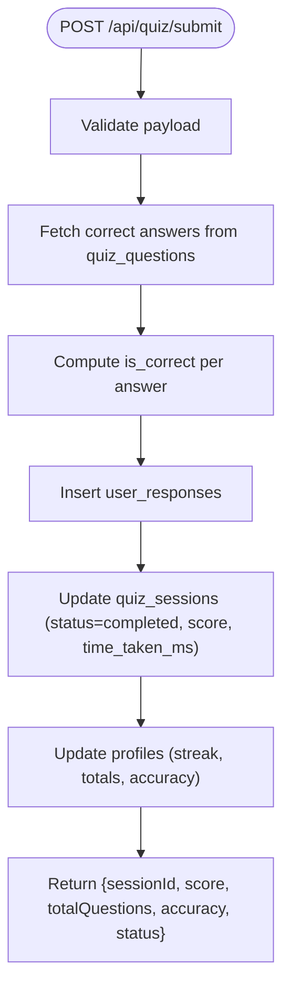

# Data Models & Database Schema

<cite>
**Referenced Files in This Document**
- [schema.sql](file://supabase/schema.sql)
- [quiz.ts](file://src/types/quiz.ts)
- [progress-tracker.ts](file://src/lib/progress-tracker.ts)
- [route.ts (dashboard stats)](file://src/app/api/dashboard/stats/route.ts)
- [route.ts (quiz submit)](file://src/app/api/quiz/submit/route.ts)
- [route.ts (quiz generate)](file://src/app/api/quiz/generate/route.ts)
- [mock-data.ts](file://src/lib/mock-data.ts)
</cite>

## Table of Contents
1. Introduction
2. Project Structure
3. Core Components
4. Architecture Overview
5. Detailed Component Analysis
6. Dependency Analysis
7. Performance Considerations
8. Troubleshooting Guide
9. Conclusion
10. Appendices

## Introduction
This document describes the data models and database schema that power the progress tracking system for quiz sessions, performance dashboards, and weak topic identification. It covers:
- The QuizSession entity structure with fields for question counts, scores, timestamps, and topic associations
- The DashboardStats model aggregating performance metrics
- The WeakTopic interface capturing difficulty indicators
- The RecentSession type used to display recent activity
- Entity relationships and foreign key constraints
- Validation rules enforced at application and database levels
- Indexing strategies for performance optimization
- Data retention policies for quiz history management

## Project Structure
The progress tracking system spans three layers:
- Database layer: PostgreSQL schema with tables, indexes, constraints, and Row Level Security policies
- API layer: Next.js routes that create sessions, record answers, compute scores, and aggregate dashboard metrics
- Application layer: TypeScript types and client-side logic that compute local stats and present UI data

**Diagram sources**
- [schema.sql:11-24](file://supabase/schema.sql#L11-L24)
- [schema.sql:47-63](file://supabase/schema.sql#L47-L63)
- [schema.sql:65-84](file://supabase/schema.sql#L65-L84)
- [schema.sql:86-99](file://supabase/schema.sql#L86-L99)
- [route.ts (dashboard stats):1-181](file://src/app/api/dashboard/stats/route.ts#L1-L181)
- [route.ts (quiz submit):1-141](file://src/app/api/quiz/submit/route.ts#L1-L141)
- [route.ts (quiz generate):1-196](file://src/app/api/quiz/generate/route.ts#L1-L196)
- [quiz.ts:37-92](file://src/types/quiz.ts#L37-L92)
- [progress-tracker.ts:37-191](file://src/lib/progress-tracker.ts#L37-L191)

**Section sources**
- [schema.sql:11-24](file://supabase/schema.sql#L11-L24)
- [schema.sql:47-63](file://supabase/schema.sql#L47-L63)
- [schema.sql:65-84](file://supabase/schema.sql#L65-L84)
- [schema.sql:86-99](file://supabase/schema.sql#L86-L99)
- [quiz.ts:37-92](file://src/types/quiz.ts#L37-L92)
- [progress-tracker.ts:37-191](file://src/lib/progress-tracker.ts#L37-L191)
- [route.ts (dashboard stats):1-181](file://src/app/api/dashboard/stats/route.ts#L1-L181)
- [route.ts (quiz submit):1-141](file://src/app/api/quiz/submit/route.ts#L1-L141)
- [route.ts (quiz generate):1-196](file://src/app/api/quiz/generate/route.ts#L1-L196)

## Core Components
This section outlines the primary entities and their responsibilities in the progress tracking system.

- QuizSession
  - Represents a user’s attempt at a set of questions for a specific topic/chapter and difficulty level
  - Tracks counts (num_questions, total_questions), score, status, time taken, and timestamps
  - Associated with a user via user_id and linked to questions via session_id

- QuizQuestion
  - Stores generated or fallback questions belonging to a session
  - Includes options, correct answer, explanations, difficulty, topic, chapter, and optional RAG chunk references

- UserResponse
  - Records each answer selected by a user within a session
  - Captures correctness and per-question time spent

- Profile
  - Aggregates long-term user statistics such as streaks, totals, and overall accuracy

- Types and DTOs
  - QuizSession, DashboardStats, WeakTopic, RecentSession define the shape of data consumed by the UI and computed by APIs

**Section sources**
- [schema.sql:47-63](file://supabase/schema.sql#L47-L63)
- [schema.sql:65-84](file://supabase/schema.sql#L65-L84)
- [schema.sql:86-99](file://supabase/schema.sql#L86-L99)
- [schema.sql:11-24](file://supabase/schema.sql#L11-L24)
- [quiz.ts:37-92](file://src/types/quiz.ts#L37-L92)

## Architecture Overview
The flow from quiz generation to dashboard aggregation:

**Diagram sources**
- [route.ts (quiz generate):10-196](file://src/app/api/quiz/generate/route.ts#L10-L196)
- [route.ts (quiz submit):6-141](file://src/app/api/quiz/submit/route.ts#L6-L141)
- [route.ts (dashboard stats):6-181](file://src/app/api/dashboard/stats/route.ts#L6-L181)
- [schema.sql:47-63](file://supabase/schema.sql#L47-L63)
- [schema.sql:65-84](file://supabase/schema.sql#L65-L84)
- [schema.sql:86-99](file://supabase/schema.sql#L86-L99)
- [schema.sql:11-24](file://supabase/schema.sql#L11-L24)

## Detailed Component Analysis

### QuizSession Entity
- Purpose: Captures a single quiz attempt with metadata and results
- Key fields:
  - Identifier and association: id, user_id
  - Topic and context: topic, chapter_num, difficulty
  - Counts and scoring: num_questions, total_questions, score
  - Status and timing: status, time_taken_ms
  - Timestamps: created_at, updated_at
- Relationships:
  - One-to-many with quiz_questions via session_id
  - One-to-many with user_responses via session_id
  - Belongs to a user via user_id (foreign key to auth.users)
- Constraints and validation:
  - difficulty must be one of Easy, Medium, Hard, Mixed
  - status must be in-progress or completed
  - user_id is required and enforces ownership via RLS

Typical record example (conceptual):
- A session for “Nervous System” chapter 5, difficulty Mixed, 10 questions, score null while in-progress, later updated to completed with score and time_taken_ms

**Section sources**
- [schema.sql:47-63](file://supabase/schema.sql#L47-L63)
- [route.ts (quiz generate):137-171](file://src/app/api/quiz/generate/route.ts#L137-L171)
- [route.ts (quiz submit):65-74](file://src/app/api/quiz/submit/route.ts#L65-L74)
- [quiz.ts:37-50](file://src/types/quiz.ts#L37-L50)

#### Class Diagram: QuizSession and Related Entities

**Diagram sources**
- [schema.sql:47-63](file://supabase/schema.sql#L47-L63)
- [schema.sql:65-84](file://supabase/schema.sql#L65-L84)
- [schema.sql:86-99](file://supabase/schema.sql#L86-L99)
- [schema.sql:11-24](file://supabase/schema.sql#L11-L24)

### DashboardStats Model
- Purpose: Aggregates high-level performance metrics for the dashboard
- Fields:
  - totalQuestions: cumulative number of questions attempted
  - questionsThisWeek: questions attempted in the last 7 days
  - accuracyRate: percentage of correct answers across all attempts
  - sessionsCompleted: number of completed sessions
  - studyStreak: consecutive days with at least one session
- Computation:
  - Backend aggregates from quiz_sessions and user_responses
  - Local computation uses progress-tracker logic when offline or for quick previews

Typical usage:
- Returned by the dashboard stats route and displayed on the dashboard page

**Section sources**
- [quiz.ts:78-84](file://src/types/quiz.ts#L78-L84)
- [route.ts (dashboard stats):69-140](file://src/app/api/dashboard/stats/route.ts#L69-L140)
- [progress-tracker.ts:37-147](file://src/lib/progress-tracker.ts#L37-L147)

### WeakTopic Interface
- Purpose: Identifies topics where the user struggles based on error rates
- Fields:
  - topic: name of the topic
  - chapterNum: associated chapter number
  - weaknessScore: percentage error rate (higher means weaker)
  - errorCount: total incorrect answers for the topic
  - attemptCount: total attempts for the topic
- Computation:
  - Derived from user_responses joined with quiz_questions to group by topic
  - Filtered to include only topics above a threshold (e.g., 30% error rate)

**Section sources**
- [quiz.ts:52-58](file://src/types/quiz.ts#L52-L58)
- [route.ts (dashboard stats):85-127](file://src/app/api/dashboard/stats/route.ts#L85-L127)
- [progress-tracker.ts:149-161](file://src/lib/progress-tracker.ts#L149-L161)

### RecentSession Type
- Purpose: Displays recent quiz activity on the dashboard
- Fields:
  - id: session identifier
  - topic: topic name
  - score: score achieved
  - totalQuestions: number of questions in the session
  - date: formatted date string
- Source:
  - Built from recent completed quiz_sessions ordered by creation time

**Section sources**
- [quiz.ts:86-92](file://src/types/quiz.ts#L86-L92)
- [route.ts (dashboard stats):58-83](file://src/app/api/dashboard/stats/route.ts#L58-L83)

### Data Flow: Session Submission and Score Calculation

**Diagram sources**
- [route.ts (quiz submit):6-141](file://src/app/api/quiz/submit/route.ts#L6-L141)

**Section sources**
- [route.ts (quiz submit):6-141](file://src/app/api/quiz/submit/route.ts#L6-L141)

## Dependency Analysis
Key dependencies and relationships:
- QuizSession depends on:
  - user_id referencing auth.users (ownership and RLS)
  - quiz_questions via session_id (one-to-many)
  - user_responses via session_id (one-to-many)
- QuizQuestion depends on:
  - session_id referencing quiz_sessions (cascading deletes)
  - Optional chunk_ids linking to textbook_chunks for RAG provenance
- UserResponse depends on:
  - session_id referencing quiz_sessions (cascading deletes)
  - question_id referencing quiz_questions (cascading deletes)
  - user_id referencing auth.users (RLS)
- Profile depends on:
  - id referencing auth.users (RLS and auto-created on signup)

Indexes:
- quiz_sessions.user_id for fast user-scoped queries
- quiz_questions.session_id for efficient session retrieval
- user_responses.user_id and user_responses.session_id for response lookups
- textbook_chunks.embedding_hnsw_idx for vector similarity search
- textbook_chunks.chapter_num_idx for chapter filtering

Row Level Security:
- Enforces user isolation for profiles, quiz_sessions, quiz_questions, user_responses, and study_plans

**Section sources**
- [schema.sql:47-63](file://supabase/schema.sql#L47-L63)
- [schema.sql:65-84](file://supabase/schema.sql#L65-L84)
- [schema.sql:86-99](file://supabase/schema.sql#L86-L99)
- [schema.sql:155-229](file://supabase/schema.sql#L155-L229)

## Performance Considerations
Indexing strategy:
- Use existing indexes on user_id and session_id to optimize dashboard queries and submission flows
- Leverage HNSW index on embeddings for fast vector similarity search during question generation
- Keep chapter_num indexed for filtered searches

Query patterns:
- Dashboard stats aggregates recent sessions and responses; ensure filters are applied early (e.g., user_id, status)
- Avoid selecting unnecessary columns; project only needed fields to reduce payload size

Caching considerations:
- For repeated dashboard loads, consider short-lived caching of aggregated stats if appropriate
- Local progress tracker provides immediate feedback without network calls

Retention policy recommendations:
- Archive or purge old quiz_sessions and user_responses beyond a defined window (e.g., 12–24 months) to control growth
- Retain anonymized aggregates for historical analytics if needed
- Implement periodic cleanup jobs to remove expired data and update summary tables

[No sources needed since this section provides general guidance]

## Troubleshooting Guide
Common issues and resolutions:
- Invalid submission payload
  - Symptom: 400 error with validation details
  - Cause: Missing or malformed fields in the submit request
  - Resolution: Ensure sessionId, answers array, and timeTakenMs conform to expected schema

- Authentication failures
  - Symptom: Unauthorized access to protected endpoints
  - Cause: Missing or invalid session token
  - Resolution: Verify authentication state before calling API routes

- Database constraint violations
  - Symptom: Errors inserting responses or updating sessions
  - Cause: Mismatched IDs or invalid enum values
  - Resolution: Confirm session exists and answer choices match allowed values

- Performance bottlenecks
  - Symptom: Slow dashboard load times
  - Cause: Large datasets without proper filtering or missing indexes
  - Resolution: Apply user_id and status filters; verify indexes exist; consider pagination

**Section sources**
- [route.ts (quiz submit):6-16](file://src/app/api/quiz/submit/route.ts#L6-L16)
- [route.ts (dashboard stats):173-179](file://src/app/api/dashboard/stats/route.ts#L173-L179)
- [schema.sql:155-229](file://supabase/schema.sql#L155-L229)

## Conclusion
The progress tracking system is built on a robust relational schema with clear entity boundaries and strong constraints. QuizSession captures session metadata and outcomes, while DashboardStats and WeakTopic provide actionable insights into performance and areas needing improvement. RecentSession offers concise visibility into recent activity. The combination of database constraints, Row Level Security, and targeted indexes ensures data integrity, security, and performance. Following the recommended retention policies will keep the system scalable over time.

[No sources needed since this section summarizes without analyzing specific files]

## Appendices

### Example Data Records (Conceptual)
- QuizSession
  - id: "a1b2c3d4-e5f6-..."
  - user_id: "user-uuid"
  - topic: "Nervous System of Man"
  - chapter_num: 5
  - difficulty: "Mixed"
  - num_questions: 10
  - total_questions: 10
  - score: 8
  - status: "completed"
  - time_taken_ms: 480000
  - created_at: "2026-08-30T09:00:00Z"
  - updated_at: "2026-08-30T09:08:00Z"

- QuizQuestion
  - id: "q1"
  - session_id: "a1b2c3d4-e5f6-..."
  - question_text: "Which part of the brain regulates homeostasis?"
  - option_a: "Cerebrum"
  - option_b: "Hypothalamus"
  - option_c: "Cerebellum"
  - option_d: "Medulla oblongata"
  - correct_answer: "B"
  - explanation_en: "The hypothalamus maintains homeostasis including temperature regulation."
  - explanation_ur: "Hypothalamus homeostasis ko maintain karta hai jisme temperature regulation shamil hai."
  - difficulty: "Medium"
  - topic: "Nervous System of Man"
  - chapter_num: 5
  - chunk_ids: ["chunk-uuid-1", "chunk-uuid-2"]

- UserResponse
  - id: "r1"
  - session_id: "a1b2c3d4-e5f6-..."
  - question_id: "q1"
  - user_id: "user-uuid"
  - selected_answer: "B"
  - is_correct: true
  - time_taken_ms: 15000

- DashboardStats
  - totalQuestions: 342
  - questionsThisWeek: 45
  - accuracyRate: 64
  - sessionsCompleted: 28
  - studyStreak: 5

- WeakTopic
  - topic: "Nervous System of Man"
  - chapterNum: 5
  - weaknessScore: 82
  - errorCount: 24
  - attemptCount: 45

- RecentSession
  - id: "a1b2c3d4-e5f6-..."
  - topic: "Nervous System of Man"
  - score: 8
  - totalQuestions: 10
  - date: "Aug 30"

[No sources needed since this section provides conceptual examples]