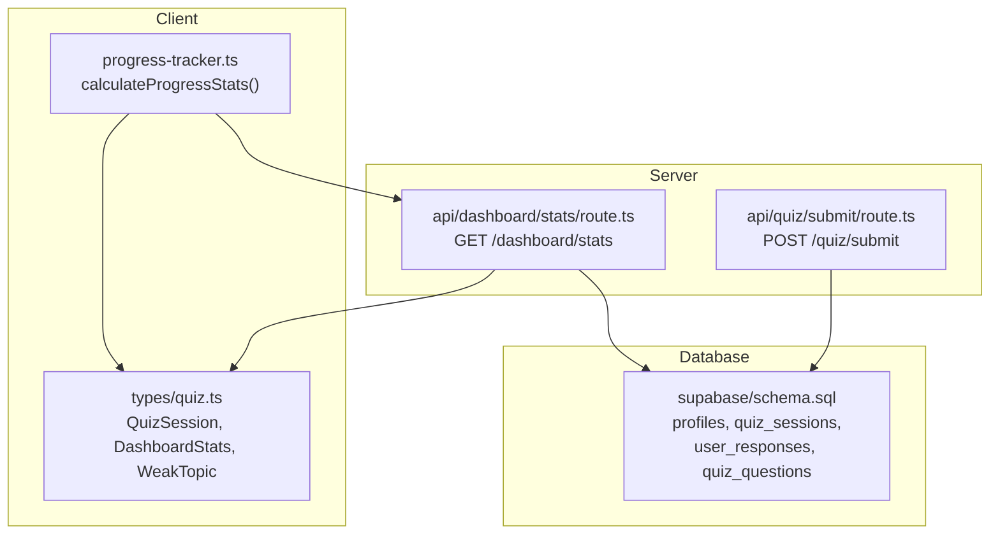
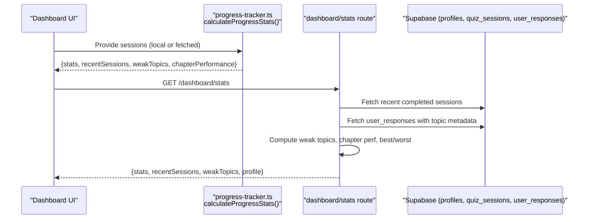
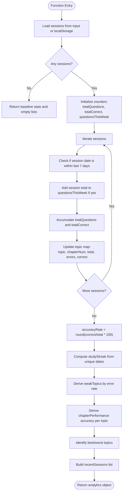
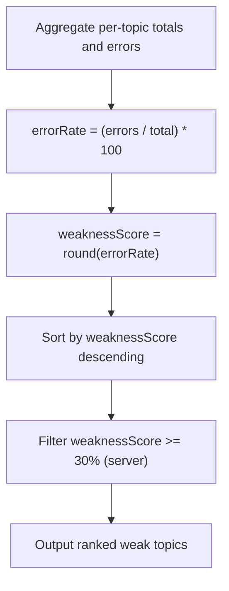
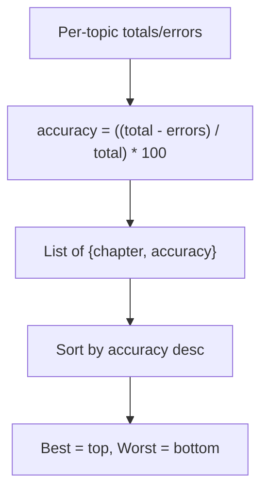
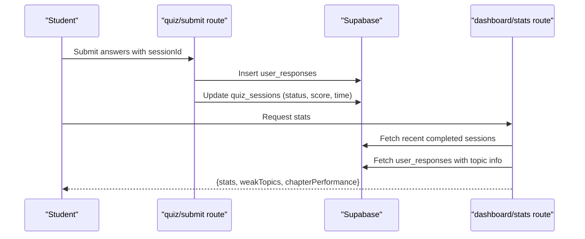
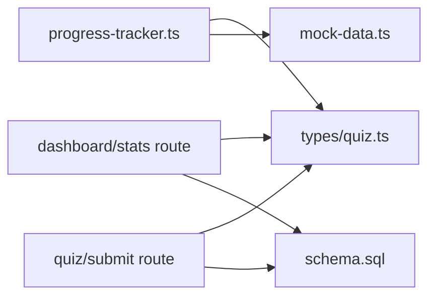

# Performance Analytics Engine

<cite>
**Referenced Files in This Document**
- [progress-tracker.ts](file://src/lib/progress-tracker.ts)
- [quiz.ts](file://src/types/quiz.ts)
- [route.ts (dashboard stats)](file://src/app/api/dashboard/stats/route.ts)
- [route.ts (quiz submit)](file://src/app/api/quiz/submit/route.ts)
- [chapter-questions.ts](file://src/lib/chapter-questions.ts)
- [mock-data.ts](file://src/lib/mock-data.ts)
- [schema.sql](file://supabase/schema.sql)
</cite>

## Table of Contents
1. [Introduction](#introduction)
2. [Project Structure](#project-structure)
3. [Core Components](#core-components)
4. [Architecture Overview](#architecture-overview)
5. [Detailed Component Analysis](#detailed-component-analysis)
6. [Dependency Analysis](#dependency-analysis)
7. [Performance Considerations](#performance-considerations)
8. [Troubleshooting Guide](#troubleshooting-guide)
9. [Conclusion](#conclusion)
10. [Appendices](#appendices)

## Introduction
This document explains the performance analytics engine that processes quiz session data to generate meaningful insights for students. It focuses on:
- The calculateProgressStats function that computes accuracy rates, total questions answered, weekly activity metrics, and study streaks.
- The weak-spot identification algorithm that analyzes error patterns across topics to highlight areas where students struggle most.
- Chapter-wise performance calculation that tracks accuracy per subject area.
- Longitudinal progress tracking by aggregating multiple quiz sessions over time.
- Statistical methods used for calculating improvement trends and performance benchmarks.

## Project Structure
The analytics engine spans client-side computation and server-side aggregation:
- Client-side: Local history storage and progress calculations using calculateProgressStats.
- Server-side: API endpoints that aggregate database records to compute dashboard stats, weak topics, and chapter performance.
- Data model: Shared TypeScript types define the shape of sessions, answers, and analytics outputs.
- Database schema: Defines tables for profiles, quiz sessions, questions, and user responses with indexes and policies.

**Diagram sources**
- [progress-tracker.ts:37-191](file://src/lib/progress-tracker.ts#L37-L191)
- [quiz.ts:37-106](file://src/types/quiz.ts#L37-L106)
- [route.ts (dashboard stats):6-181](file://src/app/api/dashboard/stats/route.ts#L6-L181)
- [route.ts (quiz submit):6-141](file://src/app/api/quiz/submit/route.ts#L6-L141)
- [schema.sql:11-99](file://supabase/schema.sql#L11-L99)

**Section sources**
- [progress-tracker.ts:37-191](file://src/lib/progress-tracker.ts#L37-L191)
- [quiz.ts:37-106](file://src/types/quiz.ts#L37-L106)
- [route.ts (dashboard stats):6-181](file://src/app/api/dashboard/stats/route.ts#L6-L181)
- [route.ts (quiz submit):6-141](file://src/app/api/quiz/submit/route.ts#L6-L141)
- [schema.sql:11-99](file://supabase/schema.sql#L11-L99)

## Core Components
- calculateProgressStats: Aggregates local or provided sessions to compute overall accuracy, weekly question volume, session count, and study streak; also derives weak topics and chapter-wise accuracy.
- Dashboard stats API: Fetches recent completed sessions and user responses from the database to compute weak topics, chapter performance, best/worst topics, and profile-level metrics.
- Quiz submit API: Validates submissions, verifies correctness against stored questions, updates session status, persists responses, and recalculates profile-level aggregates including streak and overall accuracy.

Key responsibilities:
- Accuracy rate: ratio of correct answers to total attempts per topic/session.
- Weekly activity: counts questions answered within the last seven days.
- Study streak: consecutive days with at least one session, starting from today or yesterday if applicable.
- Weak-spot identification: topics with highest error rates are flagged as weak spots.
- Chapter-wise performance: accuracy computed per topic/chapter.

**Section sources**
- [progress-tracker.ts:37-191](file://src/lib/progress-tracker.ts#L37-L191)
- [route.ts (dashboard stats):6-181](file://src/app/api/dashboard/stats/route.ts#L6-L181)
- [route.ts (quiz submit):6-141](file://src/app/api/quiz/submit/route.ts#L6-L141)

## Architecture Overview
The analytics pipeline integrates client-side and server-side logic with a relational database:

**Diagram sources**
- [progress-tracker.ts:37-191](file://src/lib/progress-tracker.ts#L37-L191)
- [route.ts (dashboard stats):6-181](file://src/app/api/dashboard/stats/route.ts#L6-L181)
- [schema.sql:11-99](file://supabase/schema.sql#L11-L99)

## Detailed Component Analysis

### calculateProgressStats: Accuracy, Weekly Activity, Streaks, Weak Spots, Chapter Performance
- Inputs: Optional array of QuizSession objects; otherwise reads from local storage history.
- Processing:
  - Aggregates total questions and total correct answers across sessions.
  - Computes weekly activity by filtering sessions created within the last seven days.
  - Derives accuracyRate as percentage of correct answers over total attempts.
  - Calculates studyStreak by identifying consecutive active days starting from today or yesterday.
  - Builds a topic map to track totals, errors, and correct counts per topic and chapter number.
  - Produces weakTopics sorted by highest error rate (weaknessScore).
  - Produces chapterPerformance with per-topic accuracy percentages.
  - Returns recent sessions and identifies best/worst topics based on chapter performance.

**Diagram sources**
- [progress-tracker.ts:37-191](file://src/lib/progress-tracker.ts#L37-L191)

**Section sources**
- [progress-tracker.ts:37-191](file://src/lib/progress-tracker.ts#L37-L191)
- [quiz.ts:37-106](file://src/types/quiz.ts#L37-L106)

### Weak-Spot Identification Algorithm
- Purpose: Identify topics where students struggle most by analyzing error patterns.
- Method:
  - For each topic, compute errorRate = (errors / total) * 100.
  - Assign weaknessScore equal to rounded errorRate.
  - Sort topics descending by weaknessScore to prioritize focus areas.
  - In the server endpoint, filter topics with weaknessScore >= 30% to surface actionable weak spots.

**Diagram sources**
- [progress-tracker.ts:149-161](file://src/lib/progress-tracker.ts#L149-L161)
- [route.ts (dashboard stats):115-127](file://src/app/api/dashboard/stats/route.ts#L115-L127)

**Section sources**
- [progress-tracker.ts:149-161](file://src/lib/progress-tracker.ts#L149-L161)
- [route.ts (dashboard stats):115-127](file://src/app/api/dashboard/stats/route.ts#L115-L127)

### Chapter-Wise Performance Calculation
- Purpose: Track accuracy per subject area (topic/chapter).
- Method:
  - For each topic, compute accuracy = ((total - errors) / total) * 100.
  - Produce a list of chapters with their accuracy percentages.
  - Determine best and worst topics by sorting accuracies ascending/descending.

**Diagram sources**
- [progress-tracker.ts:163-171](file://src/lib/progress-tracker.ts#L163-L171)
- [route.ts (dashboard stats):142-149](file://src/app/api/dashboard/stats/route.ts#L142-L149)

**Section sources**
- [progress-tracker.ts:163-171](file://src/lib/progress-tracker.ts#L163-L171)
- [route.ts (dashboard stats):142-149](file://src/app/api/dashboard/stats/route.ts#L142-L149)

### Longitudinal Progress Tracking Across Multiple Sessions
- Mechanism:
  - Sessions are persisted locally via saveQuizToLocalHistory or in the database via quiz_sessions and user_responses.
  - calculateProgressStats aggregates all sessions to compute cumulative metrics.
  - The dashboard stats endpoint fetches recent completed sessions and user responses to compute persistent analytics.
- Example flow:
  - Student completes multiple sessions across different topics and dates.
  - Each submission updates session status and stores individual responses.
  - Dashboard queries recent sessions and responses to compute weekly activity, accuracy, weak topics, and chapter performance.

**Diagram sources**
- [route.ts (quiz submit):6-141](file://src/app/api/quiz/submit/route.ts#L6-L141)
- [route.ts (dashboard stats):6-181](file://src/app/api/dashboard/stats/route.ts#L6-L181)
- [schema.sql:47-99](file://supabase/schema.sql#L47-L99)

**Section sources**
- [route.ts (quiz submit):6-141](file://src/app/api/quiz/submit/route.ts#L6-L141)
- [route.ts (dashboard stats):6-181](file://src/app/api/dashboard/stats/route.ts#L6-L181)
- [schema.sql:47-99](file://supabase/schema.sql#L47-L99)

### Statistical Methods for Improvement Trends and Benchmarks
- Accuracy Rate: Percentage of correct answers over total attempts; used both per-session and cumulatively.
- Error Rate: Percentage of incorrect answers per topic; basis for weakness scoring.
- Weekly Activity Metric: Count of questions answered within the last seven days to measure engagement cadence.
- Study Streak: Consecutive days with at least one session; resets when gaps exceed one day.
- Benchmarking:
  - Best/Worst Topics: Derived from chapter-wise accuracy rankings.
  - Weak Spot Threshold: Topics with weaknessScore >= 30% are surfaced for targeted practice.
  - Profile-Level Accuracy: Recalculated upon new submissions by combining previous correct answers with new ones.

These methods provide simple, interpretable metrics suitable for educational analytics without requiring advanced statistical modeling.

**Section sources**
- [progress-tracker.ts:105-147](file://src/lib/progress-tracker.ts#L105-L147)
- [route.ts (dashboard stats):129-149](file://src/app/api/dashboard/stats/route.ts#L129-L149)
- [route.ts (quiz submit):106-118](file://src/app/api/quiz/submit/route.ts#L106-L118)

## Dependency Analysis
- Client-side dependencies:
  - progress-tracker.ts depends on types/quiz.ts for data structures and mock-data.ts for default chapter mappings.
- Server-side dependencies:
  - dashboard/stats route depends on Supabase client/admin and types/quiz.ts.
  - quiz/submit route depends on validation schemas, Supabase admin/client, and types/quiz.ts.
- Database dependencies:
  - schema.sql defines tables and relationships used by both APIs.

**Diagram sources**
- [progress-tracker.ts:1-8](file://src/lib/progress-tracker.ts#L1-L8)
- [route.ts (dashboard stats):1-5](file://src/app/api/dashboard/stats/route.ts#L1-L5)
- [route.ts (quiz submit):1-5](file://src/app/api/quiz/submit/route.ts#L1-L5)
- [schema.sql:11-99](file://supabase/schema.sql#L11-L99)

**Section sources**
- [progress-tracker.ts:1-8](file://src/lib/progress-tracker.ts#L1-L8)
- [route.ts (dashboard stats):1-5](file://src/app/api/dashboard/stats/route.ts#L1-L5)
- [route.ts (quiz submit):1-5](file://src/app/api/quiz/submit/route.ts#L1-L5)
- [schema.sql:11-99](file://supabase/schema.sql#L11-L99)

## Performance Considerations
- Local vs. Server Computation:
  - calculateProgressStats operates efficiently on small to medium session sets stored in localStorage.
  - For large datasets, prefer server-side aggregation via dashboard/stats to avoid heavy client processing.
- Database Queries:
  - Use indexed fields (user_id, session_id) for efficient retrieval of sessions and responses.
  - Limit result sets (e.g., recent sessions limit) to reduce payload size.
- Accuracy Calculations:
  - Avoid repeated division by zero by guarding against empty totals.
  - Round percentages consistently to maintain stable UI rendering.

[No sources needed since this section provides general guidance]

## Troubleshooting Guide
Common issues and resolutions:
- No sessions found:
  - Ensure sessions are saved to localStorage or persisted in quiz_sessions.
  - Verify that status is set to "completed" for server-side aggregation.
- Incorrect accuracy:
  - Confirm that correct answers are verified against quiz_questions before computing scores.
  - Check that user_responses store is_correct flags accurately reflect outcomes.
- Streak not updating:
  - Validate last_active_date comparison logic and ensure daily updates occur on completion.
- Weak topics not appearing:
  - Ensure sufficient attempts exist per topic; low attempt counts may yield unstable metrics.
  - Check threshold filters (e.g., weaknessScore >= 30%) applied in server endpoint.

**Section sources**
- [progress-tracker.ts:22-35](file://src/lib/progress-tracker.ts#L22-L35)
- [route.ts (quiz submit):20-41](file://src/app/api/quiz/submit/route.ts#L20-L41)
- [route.ts (quiz submit):83-121](file://src/app/api/quiz/submit/route.ts#L83-L121)
- [route.ts (dashboard stats):115-127](file://src/app/api/dashboard/stats/route.ts#L115-L127)

## Conclusion
The performance analytics engine combines client-side and server-side computations to deliver actionable insights from quiz sessions. It calculates accuracy rates, weekly activity, study streaks, weak spots, and chapter-wise performance, enabling longitudinal progress tracking. The statistical methods are straightforward and robust, suitable for educational contexts. By leveraging local storage and database persistence, the system supports both immediate feedback and long-term analytics.

[No sources needed since this section summarizes without analyzing specific files]

## Appendices

### Data Models Reference
- QuizSession: Represents a single quiz attempt with topic, chapter, difficulty, score, timestamps, questions, and answers.
- DashboardStats: Aggregated metrics including total questions, weekly questions, accuracy rate, sessions completed, and study streak.
- WeakTopic: Topic-level weakness indicator with error counts and attempt counts.
- UserProfile: Persistent profile metrics including overall accuracy, best/worst topics, and chapter performance.

**Section sources**
- [quiz.ts:37-106](file://src/types/quiz.ts#L37-L106)

### Example Workflows
- Local progress calculation:
  - Retrieve sessions from localStorage or provided array.
  - Compute stats, weak topics, and chapter performance.
- Server dashboard stats:
  - Fetch recent completed sessions and user responses.
  - Compute weak topics and chapter performance; return profile and stats.

**Section sources**
- [progress-tracker.ts:37-191](file://src/lib/progress-tracker.ts#L37-L191)
- [route.ts (dashboard stats):6-181](file://src/app/api/dashboard/stats/route.ts#L6-L181)